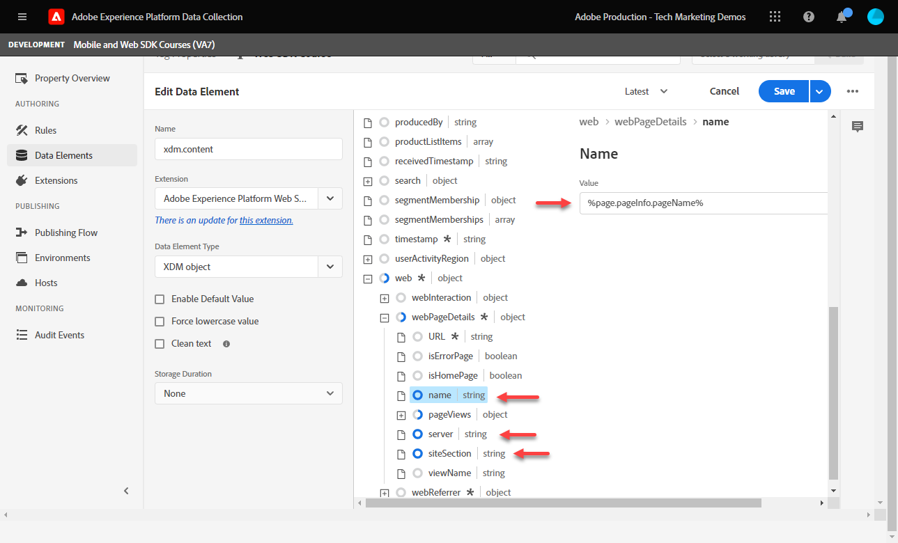

# Gegevenselementen maken

Leer hoe te om de essentiële gegevenselementen tot stand te brengen nodig om gegevens met het Web SDK van het Experience Platform te vangen. Leg zowel inhoud als identiteitsgegevens vast op het tabblad [Luma-demosite](https://luma.enablementadobe.com/content/luma/us/en.html). Leer hoe te om het XDM schema te gebruiken u vroeger voor het verzamelen van gegevens gebruikend het gegevenstype van SDK van het Web van het Platform geroepen Variabele.

>[!NOTE]
>
> Voor demonstratiedoeleinden bouwen de oefeningen in deze les op het voorbeeld dat tijdens wordt gebruikt [Een schema configureren](configure-schemas.md) stap; voorbeeld-XDM-objecten maken die weergegeven inhoud en identiteiten van gebruikers vastleggen op het tabblad [Luma-demosite](https://luma.enablementadobe.com/content/luma/us/en.html).

>[!IMPORTANT]
>
>De gegevens voor deze les zijn afkomstig uit de `[!UICONTROL digitalData]` gegevenslaag op de Luminasite. Om de gegevenslaag te bekijken, open uw ontwikkelaarsconsole en typ binnen `[!UICONTROL digitalData]` om de volledige beschikbare gegevenslaag te zien.


Ongeacht Platform Web SDK, moet u gegevenselementen binnen uw markeringsbezit blijven creëren die aan de variabelen van de gegevensinzameling van uw website, zoals een gegevenslaag, een attribuut van HTML, of anderen in kaart brengen. Zodra u die gegevenselementen creeert, moet u hen aan het XDM schema in kaart brengen u tijdens creeerde [vormen schema&#39;s](configure-schemas.md) les. Daarom bestaat het creëren van gegevenselementen uit twee acties:

1. Websitevariabelen toewijzen aan gegevenselementen, en
1. Die gegevenselementen toewijzen aan een XDM-object

Voor stap 1, blijft u uw gegevenslaag aan gegevenselementen in kaart brengen de manier u momenteel doet, gebruikend om het even welke de types van gegevenselement van de de markeringsuitbreiding van de Kern. Voor stap 2, heeft de uitbreiding van SDK van het Web van het Platform de volgende beschikbare types van gegevenselement:

* Samenvoegen-id gebeurtenis
* Identiteitskaart
* Variabele
* XDM-object

Deze les concentreert zich op het Variabele type van gegevenselement. U maakt een gegevenselement om de activiteit van Luminagebezoekers vast te leggen op basis van de beschikbare gegevenslaag op de Luministensite. In de volgende les leert u meer over Identiteitskaart.

>[!NOTE]
>
> Gegevenselstypen voor gebeurtenissamenvoegings-id en XDM-object worden zelden gebruikt voor randgevallen.

## Leerdoelstellingen

Aan het einde van deze les kunt u het volgende doen:

* Begrijp verschillende benaderingen om een gegevenslaag aan XDM in kaart te brengen
* Gegevenselementen maken om inhoudsgegevens vast te leggen
* Gegevenselementen toewijzen aan een XDM-objectelement


## Vereisten

U hebt inzicht in wat een gegevenslaag is, u bent vertrouwd met de [Luma-demosite](https://luma.enablementadobe.com/content/luma/us/en.html){target="_blank"} en weet hoe u naar gegevenselementen in tags kunt verwijzen. U moet de volgende vorige stappen in het leerprogramma hebben voltooid.

* [Een XDM-schema configureren](configure-schemas.md)
* [Naamruimte configureren](configure-identities.md)
* [Een gegevensstroom configureren](configure-datastream.md)
* [Web SDK-extensie geïnstalleerd in de eigenschap Tag](install-web-sdk.md)

>[!IMPORTANT]
>
>De [Experience Cloud ID Service-extensie](https://exchange.adobe.com/experiencecloud.details.100160.adobe-experience-cloud-id-launch-extension.html) is niet nodig wanneer het uitvoeren van het Web SDK van Adobe Experience Platform, aangezien de functionaliteit van de Dienst van identiteitskaart in het Web SDK van het Platform wordt gebouwd.

## Gegevenslaagbenaderingen

Er zijn meerdere manieren om gegevens van uw gegevenslaag toe te wijzen aan XDM gebruikend de markeringsfunctionaliteit van Adobe Experience Platform. Hieronder volgen een paar voor- en nadelen van drie verschillende benaderingen:

* [XDM in de gegevenslaag implementeren](create-data-elements.md#implement-xdm-in-the-data-layer)
* [Toewijzen aan XDM in de gegevensstroom](create-data-elements.md#map-to-xdm-in-the-datastream)
* [Toewijzen aan XDM in tags](create-data-elements.md#map-data-layer-in-tags)

>[!NOTE]
>
>De voorbeelden in deze zelfstudie volgen de Tagbenadering Kaart aan XDM.


### XDM in de gegevenslaag implementeren

Deze benadering impliceert het gebruiken van het volledig bepaalde voorwerp XDM als structuur voor uw gegevenslaag. Vervolgens wijst u de gehele gegevenslaag toe aan een XDM-objectelement in Adobe Tags. Als voor uw implementatie geen tagbeheer wordt gebruikt, is deze aanpak mogelijk ideaal omdat u gegevens rechtstreeks vanuit uw toepassing naar XDM kunt verzenden met de [XDM sendEvent, opdracht](https://experienceleague.adobe.com/docs/experience-platform/edge/fundamentals/tracking-events.html?lang=en#sending-xdm-data). Als u Adobe-tags gebruikt, kunt u een aangepast code-gegevenselement maken waarmee de gehele gegevenslaag als een pass-through JSON-object wordt vastgelegd op de XDM. Vervolgens wijst u de pass-through JSON toe aan het XDM-objectveld in de Send Event-handeling.

Hieronder is een voorbeeld van hoe de gegevenslaag als het gebruiken van het formaat van de Laag van de Gegevens van de Cliënt van de Adobe zou kijken:

+++XDM in het voorbeeld Gegevenslaag

```JSON
window.adobeDataLayer.push({
"eventType": "web.webPageDetails.pageViews",
"web":{
         "webInteraction":{
            "linkClicks":{
               "id":"",
               "value":""
            },
            "URL":"",
            "name":"",
            "region":"",
            "type":""
         },
         "webPageDetails":{
            "pageViews":{
               "id":"",
               "value":"1"
            },
            "URL":"https://luma.enablementadobe.com/",
            "isErrorPage":"",
            "isHomePage":"",
            "name":"luma:home",
            "server":"enablementadobe.com",
            "siteSection":"home",
            "viewName":""
         },
         "webReferrer":{
            "URL":"",
            "type":""
         }
      }
});
```

+++

Pros

* Hiermee worden stappen overgeslagen om afzonderlijke variabelen voor gegevenslagen toe te wijzen aan XDM
* Mogelijk is de implementatie sneller als uw ontwikkelingsteam eigenaar is van tags voor digitaal gedrag

Cons

* Volledige afhankelijkheid van ontwikkelingsteam en ontwikkelingscyclus voor het bijwerken van welke gegevens naar XDM gaan
* Beperkte flexibiliteit omdat XDM de exacte lading van de gegevenslaag ontvangt
* Kan ingebouwde functies voor tags, zoals plakken, persistentie en functies voor snelle implementatie, niet gebruiken
* Kan de gegevenslaag niet gebruiken voor pixels van derden
* Kan de gegevens niet transformeren tussen de gegevenslaag en XDM

### Toewijzen aan XDM in de gegevensstroom

Deze benadering gebruikt ingebouwde functionaliteit in de configuratie die van de gegevensstroom wordt genoemd [Gegevensvoorvoegsel voor gegevensverzameling](https://experienceleague.adobe.com/docs/experience-platform/datastreams/data-prep.html) en slaat de variabelen van de kaartgegevenslaag aan XDM in markeringen over.

Pros

* Flexibel omdat u individuele variabelen aan XDM kunt in kaart brengen
* Vermogen [nieuwe waarden berekenen](https://experienceleague.adobe.com/docs/experience-platform/data-prep/functions.html) of [gegevenstypen transformeren](https://experienceleague.adobe.com/docs/experience-platform/data-prep/data-handling.html) van een gegevenslaag voordat deze naar XDM gaat
* Gebruik een [Toewijzingsinterface](https://experienceleague.adobe.com/docs/experience-platform/datastreams/data-prep.html#create-mapping) om velden in uw brongegevens toe te wijzen aan XDM met een punt-en-klik UI

Cons

* Kan gegevenslaagvariabelen niet als gegevenselementen voor cliënt-kant derdepixel gebruiken, maar kan hen met Adobe gebruiken - de gebeurtenis-door:sturen
* Kan de plakfunctie van de tagfunctie van Adobe Experience Platform niet gebruiken
* De complexiteit van onderhoud neemt toe als de gegevenslaag zowel in tags als in gegevensstroom wordt toegewezen

### Gegevenslaag toewijzen in tags

Deze benadering omvat het in kaart brengen van individuele gegevenslaagvariabelen OF gegevenslaagvoorwerpen aan gegevenselementen in markeringen en uiteindelijk aan XDM. Dit is de traditionele benadering van implementatie gebruikend een systeem van het markeringsbeheer.

Pros

* De meest flexibele benadering zoals u individuele variabelen kunt controleren en gegevens omzetten alvorens het XDM krijgt
* Kan Adobe-tagtriggers en -schrappingsfunctionaliteit gebruiken om gegevens door te geven aan XDM
* Gegevenselementen kunnen worden toegewezen aan client-side pixels van derden

Cons

* Het kan langer duren om

>[!TIP]
>
> Google-gegevenslaag
> 
> Als uw organisatie al Googles Analytics gebruikt en het traditionele Google dataLayer-object op uw website heeft, kunt u de [Google Data Layer-extensie](https://experienceleague.adobe.com/docs/experience-platform/tags/extensions/client/google-data-layer/overview.html?lang=en) in Adobe Tags. Hierdoor kunt u sneller Adobe technologie implementeren zonder dat u ondersteuning van uw IT-team nodig hebt. Als u de Google-gegevenslaag toewijst aan XDM, worden dezelfde stappen uitgevoerd als hierboven.

>[!IMPORTANT]
>
>Zoals eerder vermeld, volgen de voorbeelden in deze zelfstudie de optie Toewijzen aan XDM in de tagaanpak.

## Gegevenselementen maken om de gegevenslaag vast te leggen

Voordat u het XDM-object maakt, maakt u de volgende set gegevenselementen voor de [Luma-demosite](https://luma.enablementadobe.com/content/luma/us/en.html){target="_blank"} gegevenslaag:

1. Ga naar **[!UICONTROL Gegevenselementen]** en selecteert u **[!UICONTROL Gegevenselement toevoegen]** (of **[!UICONTROL Nieuw gegevenselement maken]** als er geen bestaande gegevenselementen zijn in de eigenschap tag)

   

1. Geef het gegevenselement een naam `page.pageInfo.pageName`
1. Gebruik de **[!UICONTROL JavaScript-variabele]** **[!UICONTROL Het type Data Element]** om naar een waarde in de gegevenslaag van Luma te wijzen: `digitalData.page.pageInfo.pageName`

1. Schakel de selectievakjes in voor **[!UICONTROL Waarde in kleine letters forceren]** en **[!UICONTROL Tekst opschonen]** om het hoofdlettergebruik te standaardiseren en vreemde ruimten te verwijderen

1. Verlaten `None` als de **[!UICONTROL Opslagduur]** instellen omdat deze waarde op elke pagina anders is

1. Selecteren **[!UICONTROL Opslaan]**

   

Maak deze vier aanvullende gegevenselementen door dezelfde stappen uit te voeren:

* **`page.pageInfo.server`**  toegewezen aan
  `digitalData.page.pageInfo.server`

* **`page.pageInfo.hierarchie1`**  toegewezen aan
  `digitalData.page.pageInfo.hierarchie1`

* **`user.profile.attributes.username`**  toegewezen aan
  `digitalData.user.0.profile.0.attributes.username`

* **`user.profile.attributes.loggedIn`** toegewezen aan
  `digitalData.user.0.profile.0.attributes.loggedIn`

* **`cart.orderId`** toegewezen aan `digitalData.cart.orderId` (u gebruikt dit tijdens de [Analyses instellen](setup-analytics.md) les)


>[!CAUTION]
>
>De [!UICONTROL JavaScript-variabele] het type van gegevenselement behandelt serieverwijzingen als punten in plaats van haakjes, zo verwijzend het element van gebruikerslijstgegevens als `digitalData.user[0].profile[0].attributes.username` **werkt niet**.

## Variabele-gegevenselement maken

Nadat u de gegevenselementen hebt gemaakt, wijst u deze met de **[!UICONTROL Variabele]** gegevenselement dat het schema bepaalt dat voor het voorwerp XDM wordt gebruikt. Dit object moet overeenkomen met het XDM-schema dat u hebt gemaakt tijdens het [Een schema configureren](configure-schemas.md) les.

Het gegevenselement Variabele maken:

1. Selecteren **[!UICONTROL Gegevenselement toevoegen]**
1. Geef uw gegevenselement een naam `xdm.variable.content`. Het wordt aanbevolen om de gegevenselementen die specifiek zijn voor XDM, vooraf in te delen met &quot;xdm&quot; om de eigenschap tag beter te organiseren
1. Selecteer de **[!UICONTROL Adobe Experience Platform Web SDK]** als de **[!UICONTROL Extensie]**
1. Selecteer de **[!UICONTROL Variabele]** als de **[!UICONTROL Type gegevenselement]**
1. Selecteer het juiste Experience Platform **[!UICONTROL Sandbox]**
1. Selecteer de juiste **[!UICONTROL Schema]** in dit geval `Luma Web Event Data`
1. Selecteren **[!UICONTROL Opslaan]**

   

<!-- There are different ways to map data elements to XDM object fields. You can map individual data elements to individual XDM fields or map data elements to entire XDM objects as long as your data element matches the exact key-value pair schema present in the XDM object. In this lesson, you will capture content data by mapping to individual fields. You will learn how to [map a data element to an entire XDM object](setup-analytics.md#Map-an-entire-array-to-an-XDM-Object) in the [Setup Analytics](setup-analytics.md) lesson. 

Create an XDM object to capture content data:

1. In the left navigation, select **[!UICONTROL Data Elements]**
1. Select **[!UICONTROL Add Data Element]**
1. **[!UICONTROL Name]** the data element **`xdm.content`**
1. As the **[!UICONTROL Extension]** select `Adobe Experience Platform Web SDK`
1. As the **[!UICONTROL Data Element Type]** select `XDM object`
1. Select the Platform **[!UICONTROL Sandbox]** in which you created the XDM schema in during the [Configure an XDM Schema](configure-schemas.md) lesson, in this example `DEVELOPMENT Mobile and Web SDK Courses`
1. As the **[!UICONTROL Schema]**, select your `Luma Web Event Data` schema:

    

    >[!NOTE]
    >
    >The sandbox corresponds to the Experience Platform sandbox in which you created the schema. There can be multiple sandboxes available in your Experience Platform instance, so make sure to select the right one. Always work in development first, then production.

1. Scroll down until you reach the **`web`** object
1. Select to open it

    


1. Map the following web XDM variables to data elements

    * **`web.webPageDetials.name`** to `%page.pageInfo.pageName%`
    * **`web.webPageDetials.server`** to `%page.pageInfo.server%`
    * **`web.webPageDetials.siteSection`** to `%page.pageInfo.hierarchie1%`

    

1. Next, find the `identityMap` object in the schema and select it
 
1. Map to the `identityMap.loginID` data element

1. Select **[!UICONTROL Save]**

   

-->

Aan het einde van deze stappen moeten de volgende gegevenselementen worden gemaakt:

| CORE Extension Data Elements | Platform Web SDK Data Elements |
-----------------------------|-------------------------------
| `cart.orderId` | `xdm.variable.content` |
| `page.pageInfo.hierarchie1` | |
| `page.pageInfo.pageName` | |
| `page.pageInfo.server` | |
| `user.profile.attributes.loggedIn` | |
| `user.profile.attributes.username` | |


>[!TIP]
>
>In de toekomst [Een labelregel maken](create-tag-rule.md) les, leert u hoe **[!UICONTROL Variabele]** met gegevenselement kunt u meerdere regels in tags stapelen met behulp van de **[!UICONTROL Type handeling variabele bijwerken]**. Vervolgens kunt u het XDM-object onafhankelijk naar Adobe Experience Platform Edge Network verzenden met behulp van een aparte **[!UICONTROL Gebeurtenisactietype verzenden]**.

Met deze gegevenselementen op zijn plaats, bent u bereid om gegevens naar het Netwerk van de Rand van het Platform met een etikettenregel te beginnen te verzenden. Maar eerst, leer over het verzamelen van identiteiten met Web SDK.

[Volgende: ](create-identities.md)

>[!NOTE]
>
>Bedankt dat u tijd hebt geïnvesteerd in het leren over de SDK van Adobe Experience Platform Web. Als u vragen hebt, algemene feedback wilt delen of suggesties voor toekomstige inhoud hebt, kunt u deze delen over deze [Experience League Communautaire discussiestuk](https://experienceleaguecommunities.adobe.com/t5/adobe-experience-platform-launch/tutorial-discussion-implement-adobe-experience-cloud-with-web/td-p/444996)
