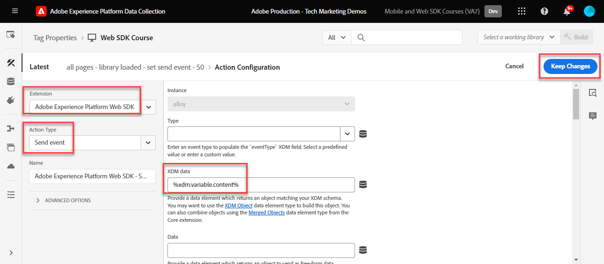
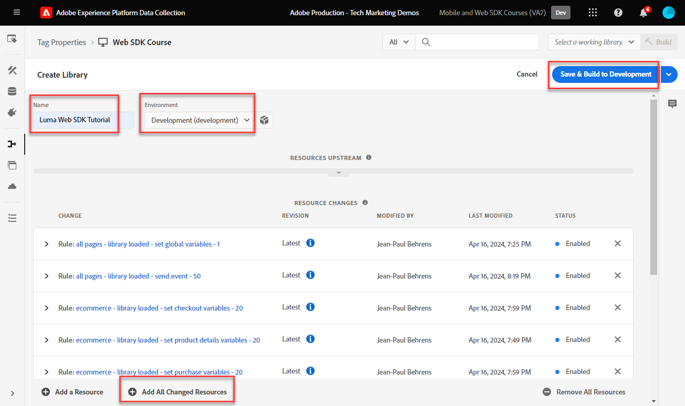
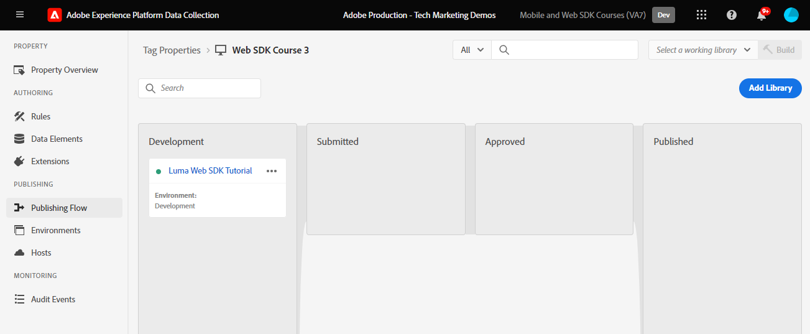

# Een labelregel maken

Leer hoe u een gebeurtenis naar het Platform Edge Network kunt verzenden met uw XDM-object aan de hand van een tagregel. Een labelregel is een combinatie van gebeurtenissen, voorwaarden en handelingen die de eigenschap van de tag opgeeft iets te doen.

>[!NOTE]
>
> Voor demonstratiedoeleinden bouwen de oefeningen in deze les op het voorbeeld dat tijdens wordt gebruikt [Identiteiten maken](create-identities.md) stap; verzenden van een XDM-gebeurtenisactie om inhoud en identiteiten van gebruikers op de [Luma-demosite](https://luma.enablementadobe.com/content/luma/us/en.html).

## Leerdoelstellingen

Aan het einde van deze les kunt u het volgende doen:

* Een naamgevingsconventie gebruiken voor het beheer van regels binnen tags
* Verzend een XDM-gebeurtenis met de actietypen Variabele bijwerken en Gebeurtenis verzenden in een tagregel
* Een labelregel publiceren naar een ontwikkelingsbibliotheek

## Vereisten

U bent vertrouwd met de tags voor gegevensverzameling en de [Luma-demosite](https://luma.enablementadobe.com/content/luma/us/en.html)en u moet de volgende lessen uit het verleden hebben geleerd in de zelfstudie:

* [Een XDM-schema configureren](configure-schemas.md)
* [Naamruimte configureren](configure-identities.md)
* [Een gegevensstroom configureren](configure-datastream.md)
* [Web SDK-extensie geïnstalleerd in de eigenschap Tag](install-web-sdk.md)
* [Gegevenselementen maken](create-data-elements.md)
* [Identiteiten maken](create-identities.md)

## Naamgevingsconventies

Voor een beter beheer van de regels in tags is het raadzaam een standaardnaamgevingsconventie te volgen. In deze zelfstudie wordt een naamgevingsconventie gebruikt die uit drie delen bestaat:

* [**locatie**] - [**event**] - [**gereedschap**] (**opeenvolging**)

waar;

1. **locatie** is de pagina of pagina&#39;s op de plaats waar de regel wordt geactiveerd
1. **event** is de trigger voor de regel
1. **gereedschap** is de specifieke toepassing of toepassingen die in de actiestap voor die regel worden gebruikt
1. **opeenvolging** is de volgorde waarin de regel ten opzichte van andere regels moet worden toegepast
<!-- minor update -->

## Tagregel maken

In tags worden regels gebruikt om handelingen (aanroepen naar brand) onder verschillende omstandigheden uit te voeren. De de etikettenuitbreiding van SDK van het Web van het Platform omvat twee acties die in deze les zullen worden gebruikt:

* **[!UICONTROL Variabele bijwerken]** koppelen gegevenselementen aan XDM-velden
* **[!UICONTROL Gebeurtenis verzenden]** Hiermee wordt het XDM-object naar het Edge Network-Experience Platform verzonden

### Variabele bijwerken

Creeer deze eerste regel als &quot;globale configuratie&quot;om alle essentiële inhoudsvariabelen in het voorwerp te plaatsen XDM gebruikend het Web SDK van het Platform **[!UICONTROL Variabele bijwerken]** handeling. Dan creeer een tweede regel, die wordt gerangschikt om na eerste te teweegbrengen, om het voorwerp XDM naar het Netwerk van de Rand van het Platform te verzenden gebruikend **[!UICONTROL Gebeurtenis verzenden]** handeling. Verderop in deze zelfstudie verzendt u verschillende XDM-velden op basis van het type pagina waarop de bezoeker zich bevindt (bijvoorbeeld product-SKU&#39;s op productpagina&#39;s). U verwezenlijkt dit door de regels te rangschikken die **[!UICONTROL Variabele bijwerken]** handelingen voor de regel die de **[!UICONTROL Gebeurtenis verzenden]** handeling.

Een labelregel maken:

1. Open de eigenschap tag die u voor deze zelfstudie gebruikt

1. Ga naar **[!UICONTROL Regels]** in de linkernavigatie

1. Selecteer de **[!UICONTROL Nieuwe regel maken]** knop

   

1. Naam van de regel `all pages global content variables - page bottom - AA (order 1)`

1. In de **[!UICONTROL Gebeurtenissen]** sectie, selecteert u **[!UICONTROL Toevoegen]**

   

1. Gebruik de **[!UICONTROL Core Extension]** en selecteert u `Page Bottom` als de **[!UICONTROL Type gebeurtenis]**

1. Onder de **[!UICONTROL Naam]** veld, naam geven `Core - Page Bottom - order 1`. Hierdoor kunt u de trigger met een betekenisvolle naam beschrijven.

1. Selecteren **[!UICONTROL Geavanceerd]** vervolgkeuzelijst en Enter `1` in **[!UICONTROL Volgorde]**

   >[!NOTE]
   >
   > Hoe hoger het getal dat u invoert, hoe hoger de bewerking in de algemene volgorde waarin deze wordt geactiveerd.

1. Selecteren **[!UICONTROL Wijzigingen behouden]** om op het belangrijkste regelscherm terug te keren
   

1. In de **[!UICONTROL Handelingen]** sectie, selecteert u **[!UICONTROL Toevoegen]**

1. Als de **[!UICONTROL Extensie]**, selecteert u **[!UICONTROL Adobe Experience Platform Web SDK]**

1. Als de **[!UICONTROL Type handeling]**, selecteert u **[!UICONTROL Variabele bijwerken]**

1. Als de **[!UICONTROL Gegevenselement]**, selecteert u de `xdm.variable.content` u in [Gegevenselementen maken](create-data-elements.md) les

   

Wijs nu uw [!UICONTROL gegevenselementen] aan de [!UICONTROL schema] wordt gebruikt door uw XDM-object.

>[!NOTE]
> 
> U kunt toewijzen aan afzonderlijke eigenschappen of volledige objecten. In dit voorbeeld wijst u een afbeelding toe aan afzonderlijke eigenschappen.

1. Schuif omlaag totdat u de **`web`** object

1. Selecteren om te openen

1. Wijs de volgende gegevenselementen toe aan de overeenkomstige `web` XDM-variabelen

   * **`web.webPageDetials.name`** tot `%page.pageInfo.pageName%`
   * **`web.webPageDetials.server`** tot `%page.pageInfo.server%`
   * **`web.webPageDetials.siteSection`** tot `%page.pageInfo.hierarchie1%`

   

1. Zoek vervolgens de `identityMap` object in het schema en selecteer het

1. Toewijzen aan `identityMap.loginID` gegevenselement

   

1. Zoek vervolgens het veld eventType en selecteer dit.

1. Voer de waarde in `web.webpagedetails.pageViews`

   >[!WARNING]
   >
   > In dit vervolgkeuzemenu worden de **`xdm.eventType`** in het XDM-object. Hoewel u in dit veld ook vrije-formulierlabels kunt typen, wordt u ten zeerste aangeraden **niet** omdat dit bijwerkingen heeft met Platform.

   >[!TIP]
   >
   > Om te begrijpen welke waarden in te vullen `eventType` veld, moet u naar de schemapagina gaan en de `eventType` veld om de voorgestelde waarden op het rechterspoor weer te geven.

   

1. Selecteren **[!UICONTROL Wijzigingen behouden]** en vervolgens **[!UICONTROL Opslaan]** de regel in het volgende scherm om het maken van de regel te voltooien

### Gebeurtenis Send

Nu u de variabelen hebt ingesteld, kunt u de tweede regel maken om het XDM-object naar Platform Edge Network te verzenden met de **[!UICONTROL Gebeurtenis Send]** actietype.

1. Selecteer rechts de optie **[!UICONTROL Regel toevoegen]** om een andere regel te creëren

1. Naam van de regel `all pages send event - page bottom - AA (order 50)`

1. In de **[!UICONTROL Gebeurtenissen]** sectie, selecteert u **[!UICONTROL Toevoegen]**

1. Gebruik de **[!UICONTROL Core Extension]** en selecteert u `Page Bottom` als de **[!UICONTROL Type gebeurtenis]**

1. Onder de **[!UICONTROL Naam]** veld, naam geven `Core - Page Bottom - order 50`. Hierdoor kunt u de trigger met een betekenisvolle naam beschrijven.

1. Selecteren **[!UICONTROL Geavanceerd]** vervolgkeuzelijst en Enter `50` in **[!UICONTROL Volgorde]**. Dit zorgt ervoor dat de tweede regel wordt geactiveerd na de eerste regel die u hebt ingesteld om te activeren als `1`.

1. Selecteren **[!UICONTROL Wijzigingen behouden]** om op het belangrijkste regelscherm terug te keren
   

1. In de **[!UICONTROL Handelingen]** sectie, selecteert u **[!UICONTROL Toevoegen]**

1. Als de **[!UICONTROL Extensie]**, selecteert u  **[!UICONTROL Adobe Experience Platform Web SDK]**

1. Als de  **[!UICONTROL Type handeling]**, selecteert u  **[!UICONTROL Gebeurtenis Send]**

1. Als de **[!UICONTROL XDM]**, selecteert u de `xdm.variable.content` gegevenselement dat in de vorige les is gemaakt

1. Selecteren **[!UICONTROL Wijzigingen behouden]** om op het belangrijkste regelscherm terug te keren

   
1. Selecteren **[!UICONTROL Opslaan]** om de regel op te slaan

   

## De regel in een bibliotheek publiceren

Vervolgens publiceert u de regel naar de ontwikkelomgeving, zodat u kunt controleren of deze werkt.

Een bibliotheek maken:

1. Ga naar **[!UICONTROL Publishing Flow]** in de linkernavigatie

1. Selecteren **[!UICONTROL Bibliotheek toevoegen]**

   
1. Voor de **[!UICONTROL Naam]**, enter `Luma Web SDK Tutorial`
1. Voor de **[!UICONTROL Omgeving]**, selecteert u `Development`
1. Selecteren  **[!UICONTROL Alle gewijzigde bronnen toevoegen]**

   >[!NOTE]
   >
   >    Naast de Adobe Experience Platform Web SDK-extensie en de `all pages global content variables - page bottom - AA (order 50)` regel, ziet u de markeringscomponenten die in vorige lessen worden gecreeerd. De Core-extensie bevat de basis-JavaScript die is vereist voor alle eigenschappen van webtags.

1. Selecteren **[!UICONTROL Opslaan en bouwen voor ontwikkeling]**

   

Het kan enkele minuten duren voordat de bibliotheek is gemaakt en wanneer deze is voltooid, wordt links van de naam van de bibliotheek een groene stip weergegeven:

Zoals u kunt zien op het tabblad [!UICONTROL Publishing Flow] screen, is er veel meer aan het het publiceren proces dat buiten het werkingsgebied van deze zelfstudie is. Deze zelfstudie gebruikt slechts één bibliotheek in uw ontwikkelomgeving.

Nu bent u bereid om de gegevens in het verzoek te bevestigen gebruikend het Adobe Experience Platform Debugger.

[Volgende ](validate-with-debugger.md)

>[!NOTE]
>
>Bedankt dat u tijd hebt geïnvesteerd in het leren over de SDK van Adobe Experience Platform Web. Als u vragen hebt, algemene feedback wilt delen of suggesties voor toekomstige inhoud hebt, kunt u deze delen over deze [Experience League Communautaire discussiestuk](https://experienceleaguecommunities.adobe.com/t5/adobe-experience-platform-launch/tutorial-discussion-implement-adobe-experience-cloud-with-web/td-p/444996)
