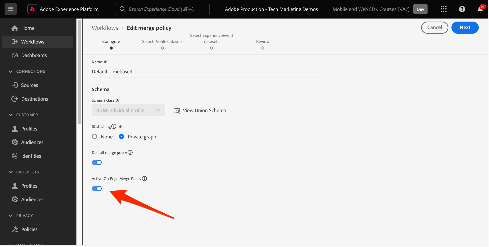

# Webkanaal instellen met Platform Web SDK

Leer hoe te om het Kanaal van het Web uit te voeren gebruikend Platform Web SDK. Deze gids behandelt de fundamentele eerste vereisten van het Kanaal van het Web, gedetailleerde stappen voor configuratie, en een diepe duik in een gebruiksgeval dat op loyaliteitsstatus wordt gecentreerd.

Met deze handleiding zijn Journey Optimizer-gebruikers uitgerust om het webkanaal effectief toe te passen voor geavanceerde onlinepersonalisatie met de Journey Optimizer Web Designer.

## Leerdoelen

Aan het einde van deze les kunt u het volgende doen:

* Begrijp de functie en de betekenis van SDK van het Web bij het leveren van de ervaring van het Webkanaal.
* Begrijp het proces van het creëren van een campagne van het Webkanaal van begin tot eind gebruikend het voorbeeld Luma Loyalty Rewards gebruiksgeval.
* Vorm campagneeigenschappen, acties, en programma&#39;s binnen de interface.
* Begrijp de functionaliteit en de voordelen van de extensie Adobe Experience Cloud Visual Editing Helper.
* Leer met de webontwerper de inhoud van webpagina&#39;s te bewerken, inclusief afbeeldingen, kopteksten en andere elementen.
* Leer hoe u voorstellen op een webpagina invoegt met de beslissingscomponent Voorstel.
* U vertrouwd maken met de beste praktijken om de kwaliteit en het succes van een webkanaalcampagne te garanderen.

## Vereisten

Om de lessen in deze sectie te voltooien, moet u eerst:

* Zorg ervoor dat de extensie van de Adobe Experience Platform Web SDK 2.16 of hoger is.
* Als u de Journey Optimizer-webontwerper gebruikt om uw webkanaalervaring te ontwerpen, moet u controleren of u de Google Chrome- of Microsoft® Edge-browsers gebruikt.
* Zorg er ook voor dat u de extensie Adobe Experience Cloud Visual Editing Helper browser hebt gedownload. Schakel de extensie van de browser van de visuele bewerkingshulp in de browserwerkbalk in voordat u een webkanaalervaring maakt.
   * In de Journey Optimizer-webontwerper kunnen bepaalde websites om een van de volgende redenen niet betrouwbaar worden geopend:
      1. De website heeft een streng beveiligingsbeleid.
      1. De website is ingesloten in een iframe.
      1. De QA- of werkgebiedsite van de klant is niet extern toegankelijk (het is een interne site).
* Zorg ervoor dat cookies van derden zijn toegestaan in uw browser. Het kan nodig zijn om ook eventuele advertentieblokkers in uw browser uit te schakelen.
* Wanneer u webervaringen maakt en inhoud uit de Adobe Experience Manager Assets Essentials-bibliotheek opneemt, moet u het subdomein configureren voor het publiceren van deze inhoud. [Meer informatie](https://experienceleague.adobe.com/docs/journey-optimizer/using/web/web-delegated-subdomains.html?lang=en).
* Als het gebruiken van de eigenschap van de inhoudstest, zorg ervoor dat uw Webdataset ook inbegrepen in uw rapporteringsconfiguratie is.
* Momenteel worden twee typen implementaties ondersteund voor het maken en leveren van webkanaalcampagnes op uw wegeigenschappen:
   * Alleen client: als u uw website wilt wijzigen, moet u de SDK van Adobe Experience Platform Web implementeren.
   * Hybride modus: u kunt de API van de Edge-netwerkserver van Platform gebruiken om personalisatie op de server aan te vragen. De reactie van de API wordt dan verstrekt aan het Web SDK van Adobe Experience Platform voor het teruggeven van wijzigingen op de cliënt-kant. Raadpleeg de documentatie van de Adobe Experience Platform Edge Network Server API voor meer informatie. In dit blogbericht vindt u meer details en implementatiemonsters voor de hybride modus.

>[!NOTE]
>
>Implementatie alleen op de server wordt momenteel niet ondersteund.

## Terminologie

Ten eerste moet u de terminologie begrijpen die in webkanaalcampagnes wordt gebruikt.

* **Webkanaal**: Een medium voor communicatie of voor de levering van inhoud via het web. In de context van deze handleiding verwijst het naar het mechanisme waarmee gepersonaliseerde inhoud wordt geleverd aan websitebezoekers die de Platform Web SDK, binnen Adobe Journey Optimizer gebruiken.
* **Weboppervlak**: Verwijst naar een webeigenschap die wordt geïdentificeerd door een URL waar inhoud wordt geleverd. Het kan één of meerdere Web-pagina&#39;s omvatten.
* **Journey Optimizer Web Designer**: Een specifiek hulpmiddel of een specifieke interface binnen de Journey Optimizer waar de gebruikers hun Web-kanaalervaringen kunnen ontwerpen.
* **Helper voor Adobe Experience Cloud Visual Editing**: Een browserextensie die helpt bij het visueel bewerken en ontwerpen van webkanaalervaringen.
* **DataStream**: Een configuratie binnen de Adobe Experience Platform-service die ervoor zorgt dat webkanaalervaringen kunnen worden geleverd.
* **Beleid samenvoegen**: Een configuratie die de nauwkeurige activering en publicatie van binnenkomende campagnes verzekert.
* **Publiek**: Een specifiek segment gebruikers of bezoekers van de site die aan bepaalde criteria voldoen.
* **Webontwerper**: Een interface of gereedschap dat u helpt bij het visueel bewerken en ontwerpen van een webbeleving zonder diep in de code te duiken.
* **Expressieeditor**: Een hulpmiddel binnen de Ontwerper van het Web dat gebruikers toestaat om verpersoonlijking aan webinhoud toe te voegen, potentieel gebaseerd op gegevensattributen of andere criteria.
* **Beslissingscomponent aanbieden**: Een component in de Ontwerper van het Web die helpt bij het bepalen van welke aanbieding het meest geschikt is om aan een specifieke bezoeker te worden getoond die op besluitvormingsbeheer wordt gebaseerd.
* **Inhoud experimenteren**: Een methode om verschillende inhoudvariaties te testen om te achterhalen welke het beste in termen van gewenste metrisch, zoals binnenkomende kliks presteert.
* **Behandeling**: In het kader van inhoudexperimenten verwijst een behandeling naar een specifieke variatie van inhoud die op een andere wordt getest.
* **Simulatie**: Een voorvertoningsmechanisme waarmee u de webkanaalervaring kunt visualiseren voordat u deze activeert voor een actief publiek.

## De gegevensstroom configureren

Zorg ervoor dat er een gegevensstroom is gedefinieerd in de Adobe Experience Platform-service en dat de optie Adobe Journey Optimizer is ingeschakeld. Dit moet worden gevormd alvorens om het even welke ervaring van het Webkanaal door het Web SDK van het Platform kan worden geleverd.

Adobe Journey Optimizer configureren in de gegevensstroom:

1. Ga naar de [Gegevensverzameling](https://experience.adobe.com/#/data-collection){target="blank"} interface.
1. Selecteer in de linkernavigatie de optie **[!UICONTROL Gegevensstromen]**.
1. Selecteer de eerder gemaakte Luma Web SDK-gegevensstroom.

   

1. Selecteren **[!UICONTROL Bewerken]** binnen de Adobe Experience Platform Service.

   

1. Controleer de **[!UICONTROL Adobe Journey Optimizer]** doos.

   

1. Selecteren **[!UICONTROL Opslaan]**.

Dit zorgt ervoor dat binnenkomende gebeurtenissen voor Journey Optimizer correct worden afgehandeld door Adobe Experience Platform Edge.

## Het samenvoegbeleid configureren

Zorg ervoor dat er een samenvoegbeleid is gedefinieerd met de **[!UICONTROL Samenvoegingsbeleid actief op rand]** optie ingeschakeld. Deze optie van het fusiebeleid wordt gebruikt door de inkomende kanalen van Journey Optimizer om de nauwkeurige activering en de publicatie van binnenkomende campagnes op de rand te verzekeren.

De optie configureren in het samenvoegbeleid:

1. Ga naar de **[!UICONTROL Klant]** > **[!UICONTROL Profielen]** in het Experience Platform of de interface van Journey Optimizer.
1. Selecteer de **[!UICONTROL Beleid samenvoegen]** tab.
1. Selecteer uw beleid en schakel de optie **[!UICONTROL Samenvoegingsbeleid actief op rand]** in de **[!UICONTROL Configureren]** stap.

   

## De webdataset configureren voor het experimenteren met inhoud

Als u inhoudstests wilt gebruiken in webkanaalcampagnes, moet u ervoor zorgen dat de gebruikte webdataset ook wordt opgenomen in uw rapportconfiguratie. Het Journey Optimizer-rapportagesysteem gebruikt de dataset op een alleen-lezen manier om rapporten voor het experimenteren met inhoud buiten de box te vullen.

[Het toevoegen van gegevenssets voor de rapportage van het inhoudexperiment wordt in deze sectie beschreven](https://experienceleague.adobe.com/docs/journey-optimizer/using/campaigns/content-experiment/reporting-configuration.html?lang=en#add-datasets).

## Hoofdletters gebruiken - Loyalty&#39;s

In deze les, wordt een geval van het de gebruiks van de beloningen van de steekproefLoyalty gebruikt om implementatie van een ervaring van het Webkanaal in detail te beschrijven gebruikend SDK van het Web.

Met dit gebruiksgeval kunt u beter begrijpen hoe Journey Optimizer uw klanten de beste binnenkomende ervaringen kan bieden, door gebruik te maken van de Journey Optimizer-campagnes en de webontwerper.

>[!NOTE]
>
>Aangezien deze zelfstudie gericht is op implementatoren, is het vermeldenswaard dat deze les substantieel interfacewerk in Journey Optimizer impliceert. Terwijl dergelijke interfacetaken typisch door marketers worden behandeld, kan het voor uitvoerders nuttig zijn om inzicht in het proces te krijgen, zelfs als zij niet verantwoordelijk voor de verwezenlijking van de Webkanaalcampagne aan het eind zijn.

### Loyalty Rewards-campagne maken

Laten we beginnen met de webkanaalcampagne Loyalty Rewards in Adobe Journey Optimizer.

De voorbeeldcampagne maken:

1. Navigeren naar **[!UICONTROL Reisbeheer]** > **[!UICONTROL Campagnes]** in de linkernavigatie
1. Klikken **[!UICONTROL Campagne maken]** rechtsboven.
1. In de **[!UICONTROL Eigenschappen]** , geeft u op hoe u de campagne wilt uitvoeren. Kies voor de Gebruikszaak Loyalty Rewards **Gepland**.

   

1. In de **[!UICONTROL Handelingen]** in, kiest u **[!UICONTROL Webkanaal]**. Als de  **[!UICONTROL Weboppervlak]**, selecteert u **[!UICONTROL Pagina-URL]**.

>[!NOTE]
>
>Een weboppervlak verwijst naar een webeigenschap die wordt geïdentificeerd door een URL waar inhoud wordt geleverd. De URL kan overeenkomen met één pagina of meerdere pagina&#39;s, zodat u wijzigingen kunt toepassen op een of meerdere webpagina&#39;s.

Kies de optie **[!UICONTROL Pagina-URL]** Optie voor het web om de ervaring voor deze campagne op één pagina te implementeren. Voer de URL in voor de pagina Luma.

1. Als het weboppervlak is gedefinieerd, selecteert u **[!UICONTROL Maken]**.

   

1. Voeg nu enkele aanvullende details toe aan de nieuwe webkanaalcampagne. Geef eerst de naam van de campagne. Bel het `Luma Loyalty Rewards – Gold Status – October 2023`. U kunt desgewenst een beschrijving aan de campagne toevoegen. Ook toevoegen **[!UICONTROL Tags]** verbetering van de algemene campagnetaxonomie.

   

1. Standaard is de campagne actief voor alle sitebezoekers. Voor de toepassing van dit gebruiksgeval mogen alleen leden met een goudstatus de ervaring zien. Klik op **[!UICONTROL Doelgroep selecteren]** en kiest u `Luma Loyalty Rewards – Gold Status` publiek.

1. In de **[!UICONTROL Naamruimte identiteit]** veld, selecteert u de naamruimte voor het identificeren van personen binnen het gekozen segment. Aangezien u de campagne op de plaats van de Luma opstelt, kunt u ECID namespace kiezen. Profielen in het dialoogvenster `Luma Loyalty Rewards – Gold Status` publiek dat niet beschikt over de ECID-naamruimte tussen de verschillende identiteiten, wordt niet aangeraden door de campagne voor webkanalen.

   

1. Plan de campagne die op 1 december moet beginnen met **[!UICONTROL Start campagne]** en eindigt op 31 december met de **[!UICONTROL Einde campagne]** -optie.

   

>[!NOTE]
>
>Houd er rekening mee dat voor webkanaalcampagnes de webervaring wordt weergegeven wanneer de bezoeker de pagina opent. In tegenstelling tot andere soorten campagnes in Adobe Journey Optimizer **[!UICONTROL Handelingtriggers]** kan niet worden geconfigureerd.

### Experimenteer met Loyalty Rewards-inhoud

In de **[!UICONTROL Handeling]** kunt u desgewenst een experiment maken om te testen welke inhoud het beste werkt voor de `Luma Loyalty Rewards – Gold Status` publiek. Laten we twee behandelingen maken en testen als onderdeel van de configuratie van de campagne.

U kunt als volgt het inhoudexperiment maken:

1. Klikken **[!UICONTROL Experimenteren maken]**.

   

1. Kies eerst een **[!UICONTROL Metrisch met succes]**. Dit is de maatstaf voor het bepalen van de doeltreffendheid van inhoud. Kies **[!UICONTROL Unieke binnenkomende klikken]**, om te zien welke inhoudsbehandeling meer kliks op het Web Ervaring CTA produceert.

   

1. Als u een experiment instelt met gebruik van een webkanaal en de optie **[!UICONTROL Binnenkomende klikken]**, **[!UICONTROL Unieke binnenkomende klikken]**, **[!UICONTROL Paginaweergaven]**, of **[!UICONTROL Unieke paginaweergaven]** de **[!UICONTROL Handeling klikken]** kunt u klikken en weergaven op specifieke pagina&#39;s nauwkeurig bijhouden en controleren.

1. U kunt desgewenst een **[!UICONTROL Holdout]** die geen van beide behandelingen krijgt. Laat dit nu ongecontroleerd.

1. Kies desgewenst ook **[!UICONTROL Gelijkmatig verdelen]**. Schakel deze optie in om ervoor te zorgen dat de splitsingen van de behandeling altijd gelijkmatig zijn verdeeld.

[Meer informatie over contentexperimenten in Adobe Journey Optimizer Web Channel](https://experienceleague.adobe.com/docs/journey-optimizer/using/campaigns/content-experiment/get-started-experiment.html?lang=en).

### Inhoud bewerken met de visuele hulp

Laten we nu de webkanaalervaring ontwerpen. Gebruik hiervoor de Adobe Experience Cloud **[!UICONTROL Visuele hulp]**. Dit gereedschap is een browserextensie die compatibel is met Google Chrome en Microsoft® Edge. Zorg ervoor dat u de extensie hebt gedownload voordat u uw ervaringen ontwikkelt. Zorg er ook voor dat de webpagina de Web SDK bevat.

1. Binnen de **[!UICONTROL Handeling]** tabblad van de campagne, klikt u op **[!UICONTROL Inhoud bewerken]**. Aangezien u één pagina-URL hebt ingevoerd als het oppervlak, kunt u beter beginnen te werken in de composer.

   

1. Klik nu op **[!UICONTROL Webpagina bewerken]** om te beginnen met ontwerpen.

   

1. Begin door sommige elementen te bewerken met de webcomposer. Gebruik het contextmenu om de koptekst van de hoofdafbeelding van de Luma te bewerken. Pas de stijl van het contextafhankelijke venster aan de rechterkant aan.

   

1. Voeg ook verpersoonlijking aan de container toe gebruikend **[!UICONTROL Expression-editor]**.

   

1. Zorg ervoor dat de ervaring correct voor kliks wordt gevolgd. Kies **[!UICONTROL Klikken op trackelement]** in het contextmenu.

   

1. Gebruik de **[!UICONTROL Aanbiedingsbeslissingscomponent]** om voorstellen in te voegen in de webpagina. Deze component gebruikt **[!UICONTROL Beslissingsbeheer]** om de beste aanbieding te kiezen voor Luma-bezoekers.

### HTML-ontwerpwijzigingen

Er zijn een paar beschikbare methodes als u geavanceerdere, of douaneveranderingen in de plaats als component van de campagne van de Beloning van de Loyaliteit wilt aanbrengen.

Gebruik de **[!UICONTROL Componenten]** om HTML of andere inhoud rechtstreeks toe te voegen aan de Luma-site.

Voeg een nieuwe HTML-component toe boven aan de pagina. Bewerk de HTML binnen de component vanuit de ontwerpinterface of **[!UICONTROL Contextueel]** venster.

U kunt ook HTML-bewerkingen toevoegen vanuit de **[!UICONTROL Wijzigingen]** venster. In dit deelvenster kunt u een component op de pagina selecteren en deze bewerken vanuit de ontwerpinterface.

Voeg in de editor de HTML voor de `Luma Loyalty Rewards – Gold Status` publiek. Selecteren **[!UICONTROL Valideren]**.

Bekijk nu de nieuwe aangepaste HTML-component om deze passend te maken.

Een specifieke component bewerken met de opdracht **[!UICONTROL CSS-selectietype]** wijziging.

Aangepaste code toevoegen met de opdracht **Pagina `<head>` type** wijziging.

De mogelijkheden om de **[!UICONTROL Visuele hulp]**.

### Loyalty Rewards-inhoud simuleren

Bekijk een voorvertoning van de gewijzigde webpagina voordat u de campagne activeert. Vergeet niet dat testprofielen moeten zijn geconfigureerd om webkanaalervaringen te simuleren.

U kunt als volgt de ervaring simuleren:

1. Selecteren **[!UICONTROL Inhoud simuleren]** in de campagne.

   

1. Kies een testprofiel om de simulatie te ontvangen. Houd er rekening mee dat het testprofiel in de `Luma Loyalty Rewards – Gold Status` publiek om de juiste behandeling te krijgen.

1. De voorvertoning wordt weergegeven voor het testprofiel.

### De Loyalty Rewards-campagne activeren

Ten slotte activeert u de campagne voor het webkanaal.

1. Selecteren **Controleren om te activeren**.

1. U wordt gevraagd de details van de campagne een laatste keer te bevestigen. Selecteren **[!UICONTROL Activeren]**. Het kan tot 15 minuten duren voordat de campagne live gaat op de site.

### Loyalty Rewards QA

Als beste praktijken, controleer **[!UICONTROL Web]** tabblad van de live campagne en algemene rapporten voor de campagnespecifieke KPI&#39;s. Voor deze campagne bekijkt u de indruk dat u afbeeldingen ervaart en klikt u op Snelheid.

### Webkanaalvalidatie met Adobe Experience Platform Debugger

Met de extensie Adobe Experience Platform Debugger, die beschikbaar is voor Chrome en Firefox, worden uw webpagina&#39;s geanalyseerd om problemen vast te stellen bij de implementatie van Adobe Experience Cloud-oplossingen.

Met het foutopsporingsprogramma op de Luminasite kunt u de ervaring met het webkanaal tijdens de productie valideren. Dit is beste praktijken zodra de het gebruiksgeval van de Beloningen van de Loyalty in werking is, om alles te verzekeren correct wordt gevormd.

[Leer hoe te om debugger in uw browser te vormen gebruikend de gids hier](https://experienceleague.adobe.com/docs/platform-learn/data-collection/debugger/overview.html?lang=en).

De validatie starten met de foutopsporing:

1. Navigeer met de webkanaalervaring naar de Luma-webpagina.
   <!--
    
    -->
1. Open tijdens de webpagina de **[!UICONTROL Adobe Experience Platform Debugger]**.
   <!--
    
    -->
1. Navigeren naar **Samenvatting**. Controleer of de **[!UICONTROL DataStream-id]** komt overeen met de **[!UICONTROL datastream]** in **[!UICONTROL Gegevensverzameling Adoben]** waarvoor je Adobe Journey Optimizer hebt ingeschakeld.
   <!--
    
    -->
1. Vervolgens kunt u zich met verschillende Luma-loyaliteitsaccounts aanmelden bij de site en de foutopsporing gebruiken om de aanvragen te valideren die naar het Adobe Experience Platform Edge-netwerk zijn verzonden.
   <!--
    
    -->
1. Onder **[!UICONTROL Oplossingen]** navigeer naar de **[!UICONTROL Experience Platform Web SDK]**.
   <!--
    
    -->
1. Binnen de **Configuratie** tab, in-/uitschakelen **[!UICONTROL Foutopsporing inschakelen]**. Hiermee kunt u zich aanmelden voor de sessie in een **[!UICONTROL Adobe Experience Platform Assurance]** sessie.
   <!--
    
    -->
1. Meld u met verschillende Luma-loyaliteitsaccounts aan bij de site en gebruik foutopsporing om de aanvragen te valideren die naar de site worden verzonden **[!UICONTROL Adobe Experience Platform Edge-netwerk]**. Al deze verzoeken moeten worden vastgelegd in **[!UICONTROL Betrouwbaarheid]** voor het bijhouden van logbestanden.
<!--
   
-->