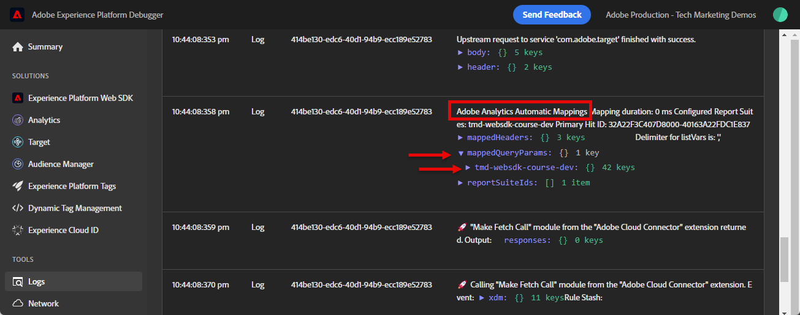
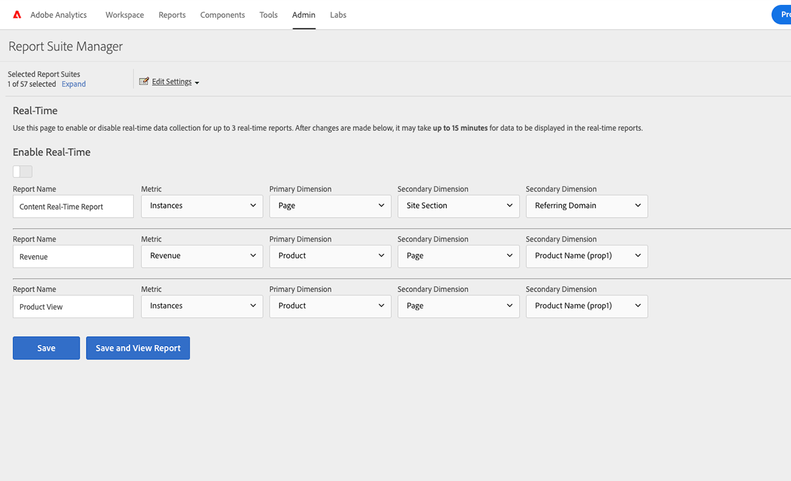
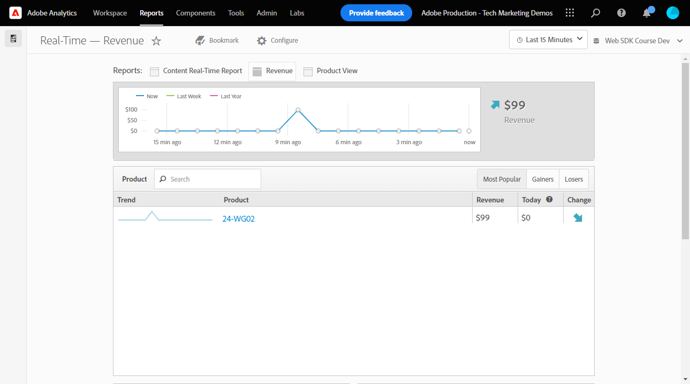

# Adobe Analytics instellen met Platform Web SDK

Meer informatie over het instellen van Adobe Analytics met [Experience Platform Web SDK](https://experienceleague.adobe.com/docs/platform-learn/data-collection/web-sdk/overview.html), maakt u labelregels om gegevens naar Adobe Analytics te verzenden en controleert u of Analytics gegevens vastlegt zoals u had verwacht.

[Adobe Analytics](https://experienceleague.adobe.com/docs/analytics.html) is een industrie-leidende toepassing die u machtigt om uw klanten als mensen te begrijpen en uw zaken met klantenintelligentie te sturen.


## Leerdoelstellingen

Aan het eind van deze les, zult u kunnen:

* Een XDM-schema voor Adobe Analytics configureren
* Begrijp het verschil tussen automatisch in kaart gebrachte en manueel in kaart gebrachte XDM variabelen voor Analytics
* Een gegevensstroom configureren om Adobe Analytics in te schakelen
* Een gegevensstroom negeren om gegevens naar een andere Adobe Analytics-rapportsuite te verzenden
* Afzonderlijke of volledige arraygegevenselementen toewijzen aan het XDM-object
* Gebruik de veranderlijke regelactietype van de Update om veelvoudige regels in één gebeurtenis te stapelen XDM
* Paginaweergaven vastleggen in Adobe Analytics met het XDM-object
* Leg e-commercegegevens vast met het XDM-object voor de Adobe Analytics-productreeks
* Een eVar voor productsyntaxisverwerking instellen met XDM
* Validatie van Adobe Analytics-variabelen wordt ingesteld met het XDM-object met behulp van Foutopsporing in Experience Platform
* Adobe Analytics-verwerkingsregels gebruiken om aangepaste variabelen in te stellen
* Gegevens valideren wordt vastgelegd door Adobe Analytics met Adobe Experience Platform Assurance
* Valideren van gegevens wordt vastgelegd door Adobe Analytics met Real-Time rapporten

## Vereisten

U kent tags, Adobe Analytics en de [Luma-demosite](https://luma.enablementadobe.com/content/luma/us/en.html){target="_blank"} aanmeldings- en winkelfunctionaliteit.

U hebt minstens één test/dev rapportsuite-id nodig. Als u geen test/dev- rapportreeks hebt die u voor dit leerprogramma kunt gebruiken, [Maak een](https://experienceleague.adobe.com/docs/analytics/admin/manage-report-suites/new-report-suite/t-create-a-report-suite.html).

U moet alle stappen van de vorige secties in het leerprogramma hebben voltooid:

* Eerste configuratie
   * [Een XDM-schema configureren](configure-schemas.md)
   * [Naamruimte configureren](configure-identities.md)
   * [Een gegevensstroom configureren](configure-datastream.md)
* Configuratie van tags
   * [Web SDK-extensie installeren](install-web-sdk.md)
   * [Gegevenselementen maken](create-data-elements.md)
   * [Identiteiten maken](create-identities.md)
   * [Een labelregel maken](create-tag-rule.md)
   * [Valideren met Adobe Experience Platform Debugger](validate-with-debugger.md)

U moet ook [Gebruikerstoegang tot Adobe Experience Platform-betrouwbaarheid inschakelen](https://experienceleague.adobe.com/docs/experience-platform/assurance/user-access.html) zodat u uw Adobe Analytics-gegevens kunt valideren met Adobe Experience Platform Assurance. (Als u toegangsschema&#39;s, identiteitsnaamruimten, en gegevensstromen hebt u reeds toegang tot Verzekering)

## XDM-schema&#39;s en analysevariabelen

Gefeliciteerd! U hebt al een schema geconfigureerd dat compatibel is met Adobe Analytics in het dialoogvenster [Een schema configureren](configure-schemas.md) les! Voor Adobe Analytics zijn er echter twee algemene benaderingen voor het definiëren van de XDM voor Adobe Analytics.

<!-- Implementing Platform Web SDK should be as product-agnostic as possible. For Adobe Analytics, mapping eVars, props, and events doesn't occur during schema creation, nor during the tag rules configuration as it has been done traditionally. Instead, every XDM key-value pair becomes a Context Data Variable that maps to an Analytics variable in one of two ways: 

1. Automatically mapped variables using reserved XDM fields
1. Manually mapped variables using Analytics Processing Rules

To understand what XDM variables are auto-mapped to Adobe Analytics, please see [Variables automatically mapped in Analytics](https://experienceleague.adobe.com/docs/experience-platform/edge/data-collection/adobe-analytics/automatically-mapped-vars.html?lang=en). Any variable that is not auto-mapped must be manually mapped. -->

1. **Product-agnostische XDM**: een semantisch sleutel-waarde paar XDM schema en gebruik handhaven [Adobe Analytics-verwerkingsregels](https://experienceleague.adobe.com/docs/analytics/admin/admin-tools/manage-report-suites/edit-report-suite/report-suite-general/c-processing-rules/processing-rules.html) om de XDM-velden toe te wijzen aan eVars, props enzovoort. Door een semantisch XDM-schema bedoelen we dat de veldnamen zelf betekenis hebben. De veldnaam `web.webPageDetails.pageName` heeft meer betekenis dan zeggen `prop1` of `evar3`.

   >[!IMPORTANT]
   >
   > Alle velden in het XDM-schema zijn beschikbaar voor Adobe Analytics als Context Data Variables met het volgende voorvoegsel `a.x.`. Bijvoorbeeld: `a.x.web.webinteraction.region`

1. **Analysespecifieke XDM**: Gebruik een doelgerichte Adobe Analytics-veldgroep in het XDM-schema met de naam `Adobe Analytics ExperienceEvent Template`

De Adobe heeft de voorkeur van klanten gezien **Analysespecifieke XDM**, omdat de toewijzingsstap in de interface Adobe Analytics Processing Rules wordt overgeslagen. De stappen in deze les gebruiken **Analysespecifieke XDM** aanpak.

## XDM toewijzen aan Adobe Analytics

Veel XDM-velden worden automatisch toegewezen aan analytische variabelen.

Het schema dat in het dialoogvenster [Een schema configureren](configure-schemas.md) De les bevat een paar automatisch aan variabelen van Analytics in kaart gebrachte, zoals die in deze lijst worden geschetst:

| Automatisch toegewezen variabelen van XDM naar Analytics | Adobe Analytics-variabele |
|-------|---------|
| `identitymap.ecid.[0].id` | midden |
| `web.webPageDetails.name` | s.pageName |
| `web.webPageDetails.server` | s.server |
| `web.webPageDetails.siteSection` | s.channel |
| `commerce.productViews.value` | prodView |
| `commerce.productListViews.value` | scView |
| `commerce.checkouts.value` | scCheckout |
| `commerce.purchases.value` | aankoop |
| `commerce.order.currencyCode` | s.currencyCode |
| `commerce.order.purchaseID` | s.purchaseID |
| `productListItems[].SKU` | s.products=;productnaam;;; (primair - zie onderstaande opmerking) |
| `productListItems[].name` | s.products=;productnaam;;; (fallback - zie onderstaande opmerking) |
| `productListItems[].quantity` | s.products=;;producthoeveelheid; |
| `productListItems[].priceTotal` | s.product=;;;productprijs; |

>[!NOTE]
>
>De afzonderlijke secties van de producttekenreeks Analytics worden ingesteld via verschillende XDM-variabelen onder de `productListItems` object.
>Vanaf 18 augustus 2022, `productListItems[].SKU` neemt prioriteit aan afbeelding aan de productnaam in de s.products variabele.
>De waarde die is ingesteld op `productListItems[].name` alleen aan de productnaam wordt toegewezen als `productListItems[].SKU` bestaat niet. Anders wordt de koppeling verwijderd en beschikbaar in contextgegevens.
>Stel geen lege tekenreeks of null in op  `productListItems[].SKU`. Dit heeft het ongewenste effect van afbeelding aan de productnaam in de s.products variabele.

Voor de meest recente lijst met toewijzingen raadpleegt u [Variabeletoewijzing analyseren in Adobe Experience Edge](https://experienceleague.adobe.com/docs/experience-platform/edge/data-collection/adobe-analytics/automatically-mapped-vars.html).

Voor XDM-variabelen die niet automatisch worden toegewezen, gebruikt u de opdracht `Adobe Analytics ExperienceEvent Template` veldgroep zoals hieronder in de volgende sectie wordt beschreven.


## De gegevensstroom configureren

Platform Web SDK verzendt gegevens van uw website naar Platform Edge Network. Uw gegevensstroom vertelt dan het Netwerk van de Rand van het Platform aan welke van uw Adobe Analytics- rapportreeksen om die gegevens door:sturen.

1. Ga naar [Gegevensverzameling](https://experience.adobe.com/#/data-collection){target="blank"} interface
1. Selecteer in de linkernavigatie de optie **[!UICONTROL Gegevensstromen]**
1. Selecteer de eerder gemaakte `Luma Web SDK: Development Environment` datastream

   

1. Selecteren **[!UICONTROL Service toevoegen]**
   
1. Selecteren **[!UICONTROL Adobe Analytics]** als de **[!UICONTROL Service]**
1. Voer de  **[!UICONTROL ID van rapportsuite]** van uw pakket ontwikkelingsrapporten
1. Selecteren **[!UICONTROL Opslaan]**

   

   >[!TIP]
   >
   >Meer rapportsuites toevoegen door te selecteren **[!UICONTROL Rapportsuite toevoegen]** is gelijk aan taggen met meerdere suite&#39;s.

>[!WARNING]
>
>In deze zelfstudie configureert u alleen de Adobe Analytics-rapportsuite voor uw ontwikkelomgeving. Wanneer u gegevensstromen voor uw eigen website creeert, zou u extra gegevensstromen en rapportsuites voor uw het opvoeren en productiemilieu&#39;s creëren.

### Een gegevensstroomrapportsuite-overschrijving configureren

U kunt wijzigen naar welke Adobe Analytics-rapportsuite gegevens worden verzonden wanneer bezoekers zich op bepaalde pagina&#39;s bevinden. Een gegevensstroomoverschrijvingsinstelling configureren voor Adobe Analytics:

1. Bewerk de **[!UICONTROL Adobe Analytics]** configuratie door de  en selecteert u vervolgens **[!UICONTROL Bewerken]**

   

1. Selecteer de **[!UICONTROL Geavanceerde opties]** openen **[!UICONTROL Overschrijvingen van rapportsuite]**

1. Selecteer de rapportsuites die u wilt met voeten treden. In dit geval: `Web SDK Course Dev` en `Web SDK Course Stg`

1. Selecteer Opslaan

   

Verderop in deze les [Maak een regel om een paginaweergave te verzenden naar een andere rapportsuite met gegevensstroomoverschrijving](setup-analytics.md###send-a-page-view-to-a-different-report-suite-with-datastream-override).

## Aanvullende e-commercegegevenselementen maken

Leg vervolgens aanvullende gegevens vast uit de gegevenslaag Luminantie en verzend deze naar Platform Edge Network. Terwijl de les zich op gemeenschappelijke vereisten van Adobe Analytics concentreert, kunnen alle gevangen gegevens gemakkelijk naar andere bestemmingen worden verzonden die op uw gegevensstroomconfiguratie worden gebaseerd. Als u bijvoorbeeld de Adobe Experience Platform-les hebt voltooid, worden de aanvullende gegevens die u in deze les vastlegt, ook verzonden naar Platform.

Tijdens de Create les van gegevenselementen, u [gemaakte JavaScript-gegevenselementen](create-data-elements.md#create-data-elements-to-capture-the-data-layer) die inhoud en identiteitsgegevens heeft vastgelegd. Nu creeert u extra gegevenselementen om e-commercegegevens te vangen. Omdat de [Luma-demosite](https://luma.enablementadobe.com/content/luma/us/en.html){target="_blank"} gebruikt verschillende structuren van de gegevenslaag voor productdetail pagina&#39;s en producten in het karretje, moet u afzonderlijke gegevenselementen voor elk scenario tot stand brengen. Gebruik aangepaste gegevenselementen voor de code om te halen wat u nodig hebt in de gegevenslaag Luminantie. Dit kan nodig zijn voor het implementeren op uw eigen site. In dit geval moet u door een reeks winkelwagentjes bladeren om specifieke details van elk product te pakken. Gebruik de meegeleverde codefragmenten hieronder:

1. Open de eigenschap tag die u gebruikt voor de zelfstudie

1. Ga naar **[!UICONTROL Gegevenselementen]**

1. Selecteren **[!UICONTROL Gegevenselement toevoegen]**

1. Naam geven **`product.productInfo.sku`**

1. Gebruik de **[!UICONTROL Aangepaste code]** **[!UICONTROL Type gegevenselement]**

1. Selectievakjes laten staan voor **[!UICONTROL Waarde in kleine letters forceren]** en **[!UICONTROL Tekst opschonen]** ongecontroleerd

1. Verlaten `None` als de **[!UICONTROL Opslagduur]** instellen omdat deze waarde op elke pagina anders is

1. Selecteren **[!UICONTROL Editor openen]**

   

1. De volgende code kopiëren en plakken


   ```javascript
   var cart = digitalData.product;
   var cartItem;
   cart.forEach(function(item){
   cartItem = item.productInfo.sku;
   });
   return cartItem;
   ```

1. Selecteren **[!UICONTROL Opslaan]** de aangepaste code opslaan

1. Selecteren **[!UICONTROL Opslaan]** het gegevenselement opslaan

Voer dezelfde stappen uit om deze extra gegevenselementen te maken:

* **`product.productInfo.title`**

  ```javascript
  var cart = digitalData.product;
  var cartItem;
  cart.forEach(function(item){
  cartItem = item.productInfo.title;
  });
  return cartItem;
  ```

<!--* **`product.productInfo.name`**

    ```javascript
    var cart = digitalData.product;
    var cartItem;
    cart.forEach(function(item){
    cartItem = item.productInfo.name;
    });
    return cartItem;
    ```-->

<!--* **`cart.productInfo`**

    ```javascript
    var cart = digitalData.cart.cartEntries; 
    var cartItem = [];
    cart.forEach(function(item, index, array){
    var qty;
    if(window.location.pathname.includes("thank-you.html")){
    qty = parseInt(item.qty);
    }else{
    qty = "";
    }
    var price = parseInt(item.price);
    cartItem.push({
    "SKU": item.sku,
    "quantity": qty,
    "priceTotal": price
    });
    });
    return cartItem; 
    ```-->

* **`cart.productInfo`**

  ```javascript
  var cart = digitalData.cart.cartEntries; 
  var cartItem = [];
  cart.forEach(function(item, index, array){
  cartItem.push({
  "SKU": item.sku
  });
  });
  return cartItem; 
  ```

* **`cart.productInfo.purchase`**

  ```javascript
  var cart = digitalData.cart.cartEntries; 
  var cartItem = [];
  cart.forEach(function(item, index, array){
  var qty = parseInt(item.qty);
  var price = parseInt(item.price);
  cartItem.push({
  "SKU": item.sku,
  "quantity": qty,
  "priceTotal": price
  });
  });
  return cartItem; 
  ```

  >[!TIP]
  >
  > Dit codefragment bevat een aangepaste eVar1-instelling die wordt gebruikt tijdens de les Product Merchandising Vars

Nadat u deze gegevenselementen hebt toegevoegd en de vorige elementen in het dialoogvenster [Gegevenselementen maken](create-data-elements.md) les, zou u de volgende gegevenselementen moeten hebben:

| Gegevenselementen |
-----------------------------|
| `cart.orderId` |
| `cart.productInfo` |
| `cart.productInfo.purchase` |
| `identityMap.loginID` |
| `page.pageInfo.hierarchie1` |
| `page.pageInfo.pageName` |
| `page.pageInfo.server` |
| `product.productInfo.sku` |
| `product.productInfo.title` |
| `user.profile.attributes.loggedIn` |
| `user.profile.attributes.username` |
| `xdm.variable.content` |

<!-- 
>[!IMPORTANT]
>
>In this tutorial, you will create a different XDM object for each event. That means you must remap variables that would be considered to be "globally" available on every hit, such as page name and identityMap. However, you may [Merge Objects](https://experienceleague.adobe.com/docs/experience-platform/tags/extensions/adobe/core/overview.html#merged-objects) or use [Mapping Tables](https://exchange.adobe.com/experiencecloud.details.103136.mapping-table.html) to manage your XDM objects more efficiently in a real-life situation. For this lesson, the global variables are considered as:
>
>* **[!UICONTROL identityMap]** to capture the authenticated ID as per the [Create Identity Map Data Element](create-data-elements.md#create-identity-map-data-element) exercise in the [Create Data Elements](create-data-elements.md) lesson.
>* **[!UICONTROL web]** object to capture content as per the [content XDM object](create-data-elements.md#map-content-data-elements-to-XDM-Schema-individually) exercise in the [Create Data Elements](create-data-elements.md) lesson on every data element above. 
-->

## Aanvullende regels maken

In de [Een labelregel maken](create-tag-rule.md) les, u opstelling een `all pages global content variables - library loaded - AA (order 1)` bepalen dat [heeft een XDM-basislijnobject gemaakt met het **[!UICONTROL Variabele bijwerken]** **[!UICONTROL actietypen]**](create-tag-rule.md#create-tag-rule). De volgende oefeningen verrijken dat voorwerp XDM om extra gegevens specifiek voor bepaalde pagina&#39;s te vangen.

### Weergaven van versleutelingspagina

Aangezien u nu gegevens naar Adobe Analytics verzendt, raden wij u aan een extra XDM-veld toe te wijzen om een paginaweergave aan te geven. Hoewel Analytics technisch niet vereist om een baken als paginamening te verwerken, is het nuttig om een standaardmanier te hebben om op een paginamening voor andere stroomafwaartse toepassingen te wijzen.

1. Open de `all pages global content variables - library loaded - AA (order 1)` regel
1. Open de **[!UICONTROL Variabele bijwerken]** action
1. Omlaag schuiven en selecteren tot `web.webPageDetails`
1. Selecteer deze optie om het dialoogvenster **[!UICONTROL pageViews]** object
1. Set **[!UICONTROL value]** tot `1`
1. Selecteren **[!UICONTROL Wijzigingen behouden]**

   


### Een paginaweergave verzenden naar een andere rapportsuite met gegevensstroomoverschrijving

Creeer een regel om een extra vraag van de paginamening naar een verschillende rapportreeks te verzenden. Gebruik de gegevensstroomoverschrijvingsfunctie om de rapportsuite voor een pagina te wijzigen met de functie **[!UICONTROL Gebeurtenis verzenden]** Actie.

1. Een nieuwe regel maken, een naam geven `homepage report suite override - library loaded - AA (order 51)`

1. Selecteer het plusteken onder **[!UICONTROL Gebeurtenis]** een nieuwe trigger toevoegen

1. Onder **[!UICONTROL Extensie]**, selecteert u **[!UICONTROL Kern]**

1. Onder **[!UICONTROL Type gebeurtenis]**, selecteert u **[!UICONTROL bibliotheek geladen]**

1. Naam geven `Core - library loaded - order 51`

1. Selecteren om te openen **[!UICONTROL Geavanceerde opties]**, typt u `51`. Dit verzekert de regellooppas na `all pages global content variables - library loaded - AA (order 50)` dat de basislijn-XDM instelt met de **[!UICONTROL Variabele bijwerken]** actietype.

   

1. Onder **[!UICONTROL Voorwaarden]**, selecteert u **[!UICONTROL Toevoegen]**

1. Verlaten **[!UICONTROL Logische typen]** als **[!UICONTROL Standaard]**

1. Verlaten **[!UICONTROL Extensies]** als **[!UICONTROL Kern]**

1. Selecteren **[!UICONTROL Type voorwaarde]** als **[!UICONTROL Pad zonder queryreeks]**

1. Laat rechts de knop **[!UICONTROL Regex]** schakelen uitgeschakeld

1. Onder **[!UICONTROL pad is gelijk aan]** set `/content/luma/us/en.html`. Voor de Luma-demo-site zorgt deze ervoor dat de regel alleen op de homepage wordt geactiveerd

1. Selecteren **[!UICONTROL Wijzigingen behouden]**

   

1. Onder **[!UICONTROL Handelingen]** selecteren **[!UICONTROL Toevoegen]**

1. Als de **[!UICONTROL Extensie]**, selecteert u **[!UICONTROL Adobe Experience Platform Web SDK]**

1. Als de **[!UICONTROL Type handeling]**, selecteert u **[!UICONTROL Gebeurtenis verzenden]**

1. Als de **[!UICONTROL Type]**, selecteert u `web.webpagedetails.pageViews`

1. Als de **[!UICONTROL XDM-gegevens]**, selecteert u de `xdm.variable.content` u in [Gegevenselementen maken](create-data-elements.md) les

   

1. Omlaag schuiven naar de **[!UICONTROL DataStream-configuraties overschrijven]** sectie

1. Laat de **[!UICONTROL Ontwikkeling]** geselecteerd.

   >[!TIP]
   >
   >    Dit tabblad bepaalt in welke tagomgeving de overschrijving plaatsvindt. Voor dit oefening specificeert u slechts het milieu van de Ontwikkeling maar wanneer u dit aan productie opstelt herinner zich om het in ook te doen in **[!UICONTROL Productie]** milieu.


1. Selecteer de **[!UICONTROL DataStream]** in dit geval `Luma Web SDK: Development Environment`

1. Onder **[!UICONTROL Reeksen rapporteren]** selecteert u de rapportsite waarvoor u deze wilt gebruiken. In dit geval: `tmd-websdk-course-stg`.


   >[!TIP]
   >
   >De lijst van hier getoonde rapportsuites wordt bepaald door [vorm een versie van het gegevensstroomrapport](configure-datastream.md###configure-a-datastream-report-suite-override) stap. Voeg rapportsuite toe is gelijk aan codering met meerdere suite.

1. Selecteren **[!UICONTROL Wijzigingen behouden]**

1. en **[!UICONTROL Opslaan]** uw regel

   

### Verrijk het XDM-object met de variabele Update

Met de **[!UICONTROL Variabele bijwerken]** actietype u kunt extra regels tot stand brengen om &quot;globale inhoud XDM&quot;te verrijken alvorens het wordt verzonden naar [!UICONTROL Platform Edge Network]. Voltooi dit door de nieuwe regels voor de `all pages send event - library loaded - AA (order 50)` die de gebeurtenis verzendt [!UICONTROL Platform Edge Network].

>[!TIP]
>
>De regelvolgorde bepaalt welke regel het eerst wordt uitgevoerd wanneer een gebeurtenis wordt geactiveerd. Als twee regels hetzelfde gebeurtenistype hebben, wordt eerst de regel met het laagste getal uitgevoerd.
> 
>

## De productreeks instellen

Alvorens u aan het productkoord in kaart brengt, is het belangrijk om te begrijpen er twee belangrijkste voorwerpen binnen het schema XDM zijn die voor het vangen van e-commercegegevens worden gebruikt die speciale verhoudingen met Adobe Analytics hebben:

1. De `commerce` objectsets Analytische gebeurtenissen zoals `prodView`, `scView`, en `purchase`
1. De `productListItems` objectsets Analysdimensies zoals `productID`.

Zie [Gegevens over handel en producten verzamelen](https://experienceleague.adobe.com/docs/experience-platform/edge/data-collection/collect-commerce-data.html?lang=en) voor meer informatie .


Begin door productmeningen op de productdetailpagina van Luma te volgen.

1. Selecteer in de linkernavigatie de optie **[!UICONTROL Regels]** en selecteer vervolgens **[!UICONTROL Regel toevoegen]**
1. Naam geven  [!UICONTROL `ecommerce - pdp library loaded - AA (order 20)`]
1. Selecteer de  onder Gebeurtenis om een nieuwe trigger toe te voegen
1. Onder **[!UICONTROL Extensie]**, selecteert u **[!UICONTROL Kern]**
1. Onder **[!UICONTROL Type gebeurtenis]**, selecteert u **[!UICONTROL bibliotheek geladen]**
1. Naam geven `Core - library loaded - order 20`
1. Selecteren om te openen **[!UICONTROL Geavanceerde opties]**, typt u `20`. Dit verzekert de regellooppas na `all pages global content variables - library loaded - AA (order 1)` dat de globale inhoudsvariabelen plaatst, maar vóór `all pages send event - library loaded - AA (order 50)` die de XDM-gebeurtenis verzendt.

   

1. Onder **[!UICONTROL Voorwaarden]**, selecteert u **[!UICONTROL Toevoegen]**
1. Verlaten **[!UICONTROL Logische typen]** als **[!UICONTROL Standaard]**
1. Verlaten **[!UICONTROL Extensies]** als **[!UICONTROL Kern]**
1. Selecteren **[!UICONTROL Type voorwaarde]** als **[!UICONTROL Pad zonder queryreeks]**
1. Schakel rechts de optie **[!UICONTROL Regex]** schakelen
1. Onder **[!UICONTROL pad is gelijk aan]** set `/products/`. Voor de Luma-demo-site zorgt deze ervoor dat de regel alleen op productpagina&#39;s wordt geactiveerd
1. Selecteren **[!UICONTROL Wijzigingen behouden]**

   

1. Onder **[!UICONTROL Handelingen]** selecteren **[!UICONTROL Toevoegen]**
1. Selecteren **[!UICONTROL Adobe Experience Platform Web SDK]** extension
1. Selecteren **[!UICONTROL Type handeling]** als **[!UICONTROL Variabele bijwerken]**
1. Omlaag schuiven naar de `commerce` en selecteert u deze om het te openen.
1. Open de **[!UICONTROL productViews]** object en set **[!UICONTROL value]** tot `1`

   

   >[!TIP]
   >
   >Het plaatsen van commerce.productViews.value=1 in XDM brengt automatisch aan `prodView` gebeurtenis in Analytics

Het is ook belangrijk te begrijpen dat u **[!UICONTROL afzonderlijke kenmerken opgeven]** naar afzonderlijke XDM-velden of **[!UICONTROL een volledige array opgeven]** naar een XDM-object.


### Afzonderlijke kenmerken toewijzen aan een XDM-object

Vanwege de structuur van de gegevenslaag op Luma kunt u afzonderlijke variabelen toewijzen om gegevens vast te leggen op de pagina met productdetails van de Luma-demo-site.

1. Omlaag schuiven naar en selecteren `productListItems` array
1. Selecteren **[!UICONTROL Afzonderlijke items opgeven]**
1. Selecteren **[!UICONTROL Item toevoegen]**

   

   >[!CAUTION]
   >
   >De **`productListItems`** is een `array` gegevenstype zodat verwacht het gegevens binnen als inzameling van elementen komen. Vanwege de gegevenslaagstructuur van de demo-site van Luma en omdat het alleen mogelijk is om één product tegelijk weer te geven op de Luministsite, voegt u afzonderlijke items toe. Afhankelijk van de structuur van de gegevenslaag kunt u bij de implementatie op uw eigen website mogelijk een volledige array opgeven.

1. Selecteren om te openen **[!UICONTROL Item 1]**
1. Kaart **`productListItems.item1.SKU`** tot `%product.productInfo.sku%`

   

1. Zoeken `eventType` en stel deze in op `commerce.productViews`

1. Selecteer Wijzigingen nog niet behouden

### Een merchandising-eVar instellen in de productreeks

Met de opdracht `Adobe Analytics ExperienceEvent Template` veldgroep om het XDM-schema te definiëren, kunt u variabelen toewijzen aan merchandising Vars of gebeurtenissen binnen de productreeks. Dit wordt ook wel instelling genoemd **Productsyntaxisverwerking**. Let op: `_experience` object onder `productListItems` > `Item 1`. Variabelen onder deze instelling instellen [!UICONTROL object] Hiermee stelt u Productsyntaxisvariabelen of -gebeurtenissen in.

1. Selecteren om te openen `_experience > analytics > customDimensions > eVars > eVar1`

1. Stel de **[!UICONTROL Waarde]** tot `%product.productInfo.title%`

1. Selecteren **[!UICONTROL Wijzigingen behouden]**

   

1. Selecteren **[!UICONTROL Opslaan]** om de regel op te slaan

<!--
1. The **[!UICONTROL Type]** field has a drop-down list of values to choose from. Select `[!UICONTROL commerce.productViews]`

    [!TIP]
    >
    >The value selected here has no effect on how data is mapped to Analytics, however it is recommended to thoughtfully apply this variable, as it is used in Adobe Experience Platform's segment builder interface. The value selected is available to use in the `[!UICONTROL c.a.x.eventtype]` context data variable downstream.

1. Under **[!UICONTROL XDM Data]**, select the `[!UICONTROL xdm.commerce.prodView]` XDM object data element
1. Select **[!UICONTROL Keep Changes]**

    

1. Your rule should look similar to the below. Select **[!UICONTROL Save]**

     -->


### Een volledige array toewijzen aan een XDM-object

Zoals eerder vermeld, gebruikt de site Luma Demo een andere gegevenslaagstructuur voor producten in het winkelwagentje. Het gegevenselement van de aangepaste code `cart.productInfo` u hebt eerdere lussen gemaakt via de `digitalData.cart.cartEntries` gegevenslaagobject en zet dit om in het vereiste XDM-objectschema. De nieuwe indeling **moet exact overeenkomen** het schema dat door `productListItems` object van het XDM-schema.

Zie de vergelijking hieronder van de gegevenslaag van de Luminasite (links) met het vertaalde gegevenselement (rechts) voor illustratie:


Vergelijk het gegevenselement met de `productListItems` structuur (hint, it should match).

>[!IMPORTANT]
>
>Numerieke variabelen worden omgezet met tekenreekswaarden in de gegevenslaag, zoals `price` en `qty` opnieuw opgemaakt naar getallen in het gegevenselement. Deze formaatvereisten zijn belangrijk voor gegevensintegriteit in Platform en worden bepaald tijdens [vormen schema&#39;s](configure-schemas.md) stap. In het voorbeeld: **[!UICONTROL hoeveelheid]** gebruikt de **[!UICONTROL Geheel]** gegevenstype.
> 

Nu terug naar het toewijzen van het XDM-object aan een volledige array. Herhaal dezelfde stappen als bij het maken van de `ecommerce - pdp library loaded - AA (order 20)` regel:

1. Naam geven  [!UICONTROL `ecommerce - cart library loaded - AA (order 20)`]
1. Selecteer de  onder Gebeurtenis om een nieuwe trigger toe te voegen
1. Onder **[!UICONTROL Extensie]**, selecteert u **[!UICONTROL Kern]**
1. Onder **[!UICONTROL Type gebeurtenis]**, selecteert u **[!UICONTROL bibliotheek geladen]**
1. Naam geven `Core - library loaded - order 20`
1. Selecteren om te openen **[!UICONTROL Geavanceerde opties]**, typt u `20`
1. Selecteren **[!UICONTROL Wijzigingen behouden]**

   

1. Onder **[!UICONTROL Voorwaarden]**, selecteert u **[!UICONTROL Toevoegen]**
1. Verlaten **[!UICONTROL Logische typen]** als **[!UICONTROL Standaard]**
1. Verlaten **[!UICONTROL Extensies]** als **[!UICONTROL Kern]**
1. Selecteren **[!UICONTROL Type voorwaarde]** als **[!UICONTROL Pad zonder queryreeks]**
1. Rechts **niet** de **[!UICONTROL Regex]** schakelen
1. Onder **[!UICONTROL pad is gelijk aan]** set `/content/luma/us/en/user/cart.html`. Voor de demo-site Luma zorgt deze optie ervoor dat de regel alleen triggers op de cartpagina bevat
1. Selecteren **[!UICONTROL Wijzigingen behouden]**

   

1. Onder **[!UICONTROL Handelingen]** selecteren **[!UICONTROL Toevoegen]**
1. Selecteren **[!UICONTROL Adobe Experience Platform Web SDK]** extension
1. Selecteren **[!UICONTROL Type handeling]** als **[!UICONTROL Variabele bijwerken]**
1. Omlaag schuiven naar de `commerce` en selecteert u deze om het te openen.
1. Open de **[!UICONTROL productListViews]** object en set **[!UICONTROL value]** tot `1`

   

   >[!TIP]
   >
   >Het plaatsen van commerce.productListViews.value=1 in XDM brengt automatisch aan toe `scView` gebeurtenis in Analytics

<!--1. Create an **[!UICONTROL XDM object]** **[!UICONTROL Data Element Type]** named **`xdm.commerce.cartView`**
1. Select the same Platform sandbox and XDM schema you are using for this tutorial
1. Open the **[!UICONTROL commerce]** object
1. Open the **[!UICONTROL productListViews]** object and set `value` to `1`

    >[!TIP]
    >
    >This step is equivalent to setting `scView` event in Analytics -->

1. Omlaag schuiven naar en selecteren **[!UICONTROL productListItems]** array

1. Selecteren **[!UICONTROL Volledige array opgeven]**

1. Toewijzen aan **`cart.productInfo`** gegevenselement

1. Selecteren `eventType` en instellen op `commerce.productListViews`

1. Selecteren **[!UICONTROL Wijzigingen behouden]**

1. Selecteren **[!UICONTROL Opslaan]** om de regel op te slaan

Maak twee andere regels voor afhandeling en aankoop volgens hetzelfde patroon, met de onderstaande verschillen:

**Naam van regel**: `ecommerce - checkout library loaded - AA (order 20)`

* **[!UICONTROL Voorwaarde]**: /content/luma/us/en/user/checkout.html
* Set `eventType` tot `commerce.checkouts`
* Set **XDM Commerce, gebeurtenis**: commerce.checkout.value to `1`

  >[!TIP]
  >
  >Dit is gelijk aan de instelling `scCheckout` gebeurtenis in Analytics

**Naam van regel**: `ecommerce - purchase library loaded - AA (order 20)`

* **[!UICONTROL Voorwaarde]**: /content/luma/us/en/user/checkout/order/thank-you.html
* Set `eventType` tot `commerce.purchases`
* Set **XDM Commerce, gebeurtenis**: commerce.purchase.value to `1`

  >[!TIP]
  >
  >Dit is gelijk aan de instelling `purchase` gebeurtenis in Analytics

Er zijn aanvullende stappen voor het vastleggen van alle vereiste `purchase` gebeurtenisvariabelen:

1. Openen **[!UICONTROL handel]** object
1. Open de **[!UICONTROL bestellen]** object
1. Kaart **[!UICONTROL purchaseID]** aan de `cart.orderId` gegevenselement
1. Set **[!UICONTROL currencyCode]** op de hardcoderingswaarde `USD`

   

   >[!TIP]
   >
   >Dit is gelijk aan de instelling `s.purchaseID` en `s.currencyCode` variabelen in Analytics


1. Omlaag schuiven naar en selecteren **[!UICONTROL productListItems]** array
1. Selecteren **[!UICONTROL Volledige array opgeven]**
1. Toewijzen aan **`cart.productInfo.purchase`** gegevenselement
1. Selecteren **[!UICONTROL Opslaan]**

Als u klaar bent, worden de volgende regels gemaakt.


<!--
## Create additional rules for Platform Web SDK

With the **[!UICONTROL Update variabl]**e and **[!UICONTROL Send Event]** Action Types of Platform Web SDK, its possible to sequence the **[!UICONTROL Send Event]** action to trigger after all **[!UICONTROL Update variable]** action types run. This is called Rule Stacking, and you use it to customize the baseline XDM created depending on the type of page you are on.  

In this exercise, you create individual rules per e-commerce event and use conditions so the rules fire on the right pages. 

Repeat the same for all other e-commerce events using the following parameters:

**Rule name**: cart view - library load - AA

* **[!UICONTROL Event Type]**: Library Loaded (Page Top)
* **[!UICONTROL Condition]**: /content/luma/us/en/user/cart.html
* **Type value under Web SDK - Send Action**: commerce.productListViews
* **XDM data for Web SDK - Send Action:** `%xdm.commerce.cartView%`

**Rule name**: checkout - library load - AA

* **[!UICONTROL Event Type]**: Library Loaded (Page Top)
* **[!UICONTROL Condition]** /content/luma/us/en/user/checkout.html
* **Type for Web SDK - Send Action**: commerce.checkouts
* **XDM data for Web SDK - Send Action:** `%xdm.commerce.checkout%`

**Rule name**: purchase - library load - AA

* **[!UICONTROL Event Type]**: Library Loaded (Page Top)
* **[!UICONTROL Condition]** /content/luma/us/en/user/checkout/order/thank-you.html
* **Type for Web SDK - Send Action**: commerce.purchases
* **XDM data for Web SDK - Send Action:** `%xdm.commerce.purchase%`
-->


## Bouw uw milieu van de Ontwikkeling

Voeg uw nieuwe gegevenselementen en regels toe aan uw `Luma Web SDK Tutorial` tagbibliotheek en herstel de ontwikkelomgeving.

Gefeliciteerd! De volgende stap bestaat uit het valideren van uw Adobe Analytics-implementatie via Experience Platform Web SDK.

## Adobe Analytics for Platform Web SDK valideren

In de [Foutopsporing](validate-with-debugger.md) les, leerde u hoe te om het cliënt-kant XDM verzoek met de Debugger van het Platform en browser ontwikkelaarsconsole te inspecteren, die aan gelijkaardig is hoe u zuivert `AppMeasurement.js` Implementatie van analysemogelijkheden. U leerde ook over het bevestigen van de server-zijverzoeken van het Netwerk van de Rand van het Platform die naar de toepassingen van de Adobe worden verzonden, en hoe te om een volledig verwerkte lading te bekijken gebruikend Verzekering.

Om Analytics te bevestigen vangt correct gegevens door het Web SDK van het Experience Platform, moet u twee stappen verder gaan:

1. Valideer hoe de gegevens door het voorwerp XDM op het Netwerk van de Rand van het Platform worden verwerkt, gebruikend de eigenschap van het Spoor van de Rand van Foutopsporing van het Experience Platform
1. Valideren hoe de gegevens door Analytics worden verwerkt gebruikend de Regels van de Verwerking en rapporten In real time
1. Valideren hoe gegevens volledig worden verwerkt door Analytics met Adobe Experience Platform Assurance

### Rand overtrekken gebruiken

Leer hoe u met de functie Edge Trace van Foutopsporing in Experience Platform kunt controleren of Adobe Analytics de ECID, paginaweergaven, de productreeks en e-commercegebeurtenissen vastlegt.

### Validatie van Experience Cloud-id

1. Ga naar de [Luma-demosite](https://luma.enablementadobe.com/content/luma/us/en.html){target="_blank"}
1. Selecteer de aanmeldknop rechtsboven en gebruik gebruikersgegevens u: test@adobe.com p: test voor verificatie
1. Open Foutopsporing Experience Platform en [schakelen van de markeringseigenschap op de site naar uw eigen ontwikkeleigenschap](validate-with-debugger.md#use-the-experience-platform-debugger-to-map-to-your-tags-property)


1. Als u Edge Trace wilt inschakelen, gaat u naar Foutopsporing Experience Platform en selecteert u in de linkernavigatie **[!UICONTROL Logboeken]** en selecteert u vervolgens de **[!UICONTROL Rand]** en selecteert u **[!UICONTROL Verbinden]**

   

1. Het zal nu leeg zijn

   

1. Vernieuw de pagina Luminantie en controleer Foutopsporing Experience Platform opnieuw. Er worden gegevens weergegeven. De rij die begint met **[!UICONTROL Automatische toewijzing van analysemogelijkheden]** is het baken van Adobe Analytics
1. Selecteer deze optie om beide opties te openen `[!UICONTROL mappedQueryParams]` vervolgkeuzelijst en tweede vervolgkeuzelijst om de variabelen Analytics weer te geven

   

   >[!TIP]
   >
   >De tweede vervolgkeuzelijst komt overeen met de ID van de Analytics-rapportsuite waarnaar u gegevens verzendt. Het zou uw eigen rapportreeks moeten aanpassen, niet in het schermafbeelding.

1. Omlaag schuiven om te zoeken `[!UICONTROL c.a.x.identitymap.ecid.[0].id]`. Het is een Context Data Variable die ECID vangt
1. Blijf omlaag schuiven totdat u de Analyse ziet `[!UICONTROL mid]` variabele. Beide id&#39;s komen overeen met de Experience Cloud-id van uw apparaat.
1. Op de Luma-site:

   

   >[!NOTE]
   >
   >Aangezien u bent aangemeld, duurt het even om de geverifieerde id te valideren `112ca06ed53d3db37e4cea49cc45b71e` voor de gebruiker **`test@adobe.com`** wordt ook vastgelegd in de `[!UICONTROL c.a.x.identitymap.lumacrmid.[0].id]`

### Overschrijvingen van rapportsuite

Hierboven hebt u een gegevensstroomoverschrijving geconfigureerd voor de [Luminantiepage](https://luma.enablementadobe.com/content/luma/us/en.html).  Om deze configuratie te bevestigen

1. Zoek een rij met **[!UICONTROL DataStream config nadat de opheffing werd toegepast]**. Hier vindt u de primaire rapportsuite en de extra rapportsuite(s) die voor de rapportsuite-overschrijvingen zijn geconfigureerd.

   

1. Omlaag schuiven naar de rij die begint met **[!UICONTROL Automatische toewijzing van analysemogelijkheden]**  en verifieert `[!UICONTROL reportSuiteIds]` toont de rapportsuite die u hebt opgegeven in uw overschrijvingsconfiguraties

   

### Weergaven van inhoudspagina

Ga naar een productpagina zoals de [pagina Didi Sport Watch](https://luma.enablementadobe.com/content/luma/us/en/products/gear/watches/didi-sport-watch.html#24-WG02).  Controleer of de weergaven van de inhoudspagina worden vastgelegd door Analytics.

1. Zoeken naar `[!UICONTROL c.a.x.web.webpagedetails.pageviews.value]=1`.
1. Omlaag schuiven om de `[!UICONTROL gn]` variabele. Dit is de dynamische syntaxis van Analytics voor de `[!UICONTROL s.pageName]` variabele. De paginanaam wordt vastgelegd vanuit de gegevenslaag.

   

### Tekenreeks- en e-commercegebeurtenissen van producten

Aangezien u al op een productpagina staat, blijft deze oefening het zelfde Spoor gebruiken om productgegevens te bevestigen wordt gevangen door Analytics. Zowel worden het productkoord als e-commercegebeurtenissen automatisch in kaart gebracht XDM variabelen aan Analytics. Zolang u aan het juiste hebt toegewezen `productListItem` XDM variable while [configureren van een XDM-schema voor Adobe Analytics](setup-analytics.md#configure-an-xdm-schema-for-adobe-analytics), zorgt het Platform Edge Network ervoor dat de gegevens worden toegewezen aan de juiste analytische variabelen.

**Eerst controleert u `Product String` is ingesteld**

1. Zoeken naar `[!UICONTROL c.a.x.productlistitems.][0].[!UICONTROL sku]`. De variabele legt de gegevenselementwaarde vast die u aan de `productListItems.item1.sku` eerder in deze les
1. Zoek ook naar `[!UICONTROL c.a.x.productlistitems.][0].[!UICONTROL _experience.analytics.customdimensions.evars.evar1]`. De variabele legt de waarde van het gegevenselement vast u aan `productListItems.item1._experience.analytics.customdimensions.evars.evar1`
1. Omlaag schuiven om de `[!UICONTROL pl]` variabele. Dit is de dynamische syntaxis van de variabele van de producttekenreeks Analytics
1. Merk op dat de productnaam van de gegevenslaag zowel aan de `[!UICONTROL c.a.x.productlistitems.][0].[!UICONTROL sku]` en de `[!UICONTROL product]` parameter van de producttekenreeks.  Bovendien wordt de producttitel van de gegevenslaag in kaart gebracht aan merchandising evar1 in het productkoord.

   

   De behandeling Rand overtrekken `commerce` gebeurtenissen iets anders dan `productList` afmetingen. U ziet geen Variabele van de Gegevens van de Context in kaart gebracht de zelfde manier u de productnaam in kaart brengt aan `[!UICONTROL c.a.x.productlistitem.[0].name]` hierboven. In plaats daarvan wordt in het Edge Trace de uiteindelijke gebeurtenis automatisch toegewezen in de Analytics `event` variabele. Het Netwerk van de Rand van het platform brengt het dienovereenkomstig in kaart zolang u aan juiste XDM in kaart brengt `commerce` variabele while [configureren van schema voor Adobe Analytics](setup-analytics.md#configure-an-xdm-schema-for-adobe-analytics); in dit geval `commerce.productViews.value=1`.

1. Ga terug in het venster van Foutopsporing Experience Platform en schuif omlaag naar de `[!UICONTROL events]` variable, it is ingesteld op `[!UICONTROL prodView]`

1. Ook notitie `[!UICONTROL c.a.x.eventType]` is ingesteld op `commerce.productViews` omdat u op een productpagina bent.

   >[!TIP]
   >
   > De `ecommerce - pdp library loaded - AA (order 20)` regel overschrijft de waarde van `eventType` door de `all pages global content variables - library loaded - AA (order 1)` regel zoals deze is ingesteld om later in de reeks te worden geactiveerd


   

**Valideer de overige e-commercegebeurtenissen en producttekenreeksen die zijn ingesteld voor Analytics**

1. Toevoegen [Didi Sport Watch](https://luma.enablementadobe.com/content/luma/us/en/products/gear/watches/didi-sport-watch.html#24-WG02) naar winkelwagentje
1. Ga naar de [Winkelpagina](https://luma.enablementadobe.com/content/luma/us/en/user/cart.html), controleer Edge Trace voor

   * `eventType` instellen op `commerce.productListViews`
   * `[!UICONTROL events: "scView"]`, en
   * de producttekenreeks is ingesteld

   

1. Ga door met de kassa, controleer Edge Trace voor

   * `eventType` instellen op `commerce.checkouts`
   * `[!UICONTROL events: "scCheckout"]`, en
   * de producttekenreeks is ingesteld

   

1. Vul alleen de **Voornaam** en **Achternaam** velden op het verzendformulier en selecteer **Doorgaan**. Selecteer op de volgende pagina de optie **Opdracht plaatsen**
1. Controleer Edge Trace op bevestigingspagina voor

   * `eventType` instellen op `commerce.purchases`
   * Inkoopgebeurtenis ingesteld `[!UICONTROL events: "purchase"]`
   * Valuta Code variabele die wordt ingesteld `[!UICONTROL cc: "USD"]`
   * Aankoop-id ingesteld in `[!UICONTROL pi]`
   * Producttekenreeks `[!UICONTROL pl]` de productnaam, de hoeveelheid en de prijs instellen

   

## Verwerkingsregels en real-time rapporten

Nu u de bakens Analytics met het Spoor van de Rand bevestigde, kunt u de gegevens ook bevestigen door Analytics gebruikend de rapporten in real time wordt verwerkt. Alvorens u de rapporten in real time controleert, moet u de regels van de Verwerking voor Analytics vormen `props` indien nodig.

### Verwerkingsregels voor aangepaste analytische toewijzingen

In deze oefening, wijst u één variabele XDM aan een steun toe zodat kunt u in rapporten in real time bekijken. Voer dezelfde stappen uit voor elke aangepaste toewijzing die u voor een toepassing moet uitvoeren `eVar`, `prop`, `event`of variabele die toegankelijk is via verwerkingsregels.

1. Ga in de interface Analytics naar [!UICONTROL Beheerder] > [!UICONTROL Admin Tools] > [!UICONTROL Rapportageopties]
1. Selecteer de set met ontwikkelings-/testrapporten die u gebruikt voor de zelfstudie > [!UICONTROL Instellingen bewerken] > [!UICONTROL Algemeen] > [!UICONTROL Verwerkingsregels]

   

1. Een regel maken voor **[!UICONTROL Waarde overschrijven van]** `[!UICONTROL Product SKU (prop1)]` tot `a.x.productlistitems.0.sku`. Herinner me om uw nota toe te voegen waarom u de regel creeert en uw regeltitel noemt. Selecteren **[!UICONTROL Opslaan]**

   

   >[!IMPORTANT]
   >
   >De eerste keer u aan een verwerkingsregel in kaart brengt, UI toont u niet de variabelen van contextgegevens van het voorwerp XDM. Als u een waarde wilt selecteren, slaat u Opslaan en keert u terug om te bewerken. Alle XDM-variabelen moeten nu worden weergegeven.

1. Ga naar [!UICONTROL Instellingen bewerken] >  [!UICONTROL Real-time]. Configureer alle drie met de volgende hieronder getoonde parameters, zodat u de weergaven van de inhoudspagina, de productweergaven en de aankopen kunt valideren

   

1. Herhaal de validatiestappen en u moet zien dat real-time rapporten gegevens dienovereenkomstig vullen.

   **Paginaweergaven**
   

   **Productweergaven**
   

   **Aankopen**
   

1. In de interface van de Werkruimte, creeer een lijst om de volledige elektronische handelstroom van het product te bekijken u kocht

   

Zie de video voor meer informatie over het toewijzen van XDM-velden aan analytische variabelen [Web SDK-variabelen toewijzen aan Adobe Analytics](https://experienceleague.adobe.com/docs/analytics-learn/tutorials/analysis-use-cases/internal-site-search/map-web-sdk-variables-into-adobe-analytics.html).

## Adobe Analytics valideren met Adobe Experience Platform Assurance

Adobe Experience Platform Assurance is een product van Adobe Experience Cloud waarmee u kunt controleren, testen, simuleren en valideren hoe u gegevens verzamelt of ervaringen opdoet met uw website en mobiele toepassing.

Boven u bevestigde dat Adobe Analytics ECID, paginameningen, het productkoord, en e-commercegebeurtenissen met de eigenschap van het Spoor van de Rand van Foutopsporing van het Experience Platform vangt.  U bevestigde ook dat afbeelding van prop1 gebruikend de Regels van de Verwerking en rapporten in real time.  Vervolgens valideert u dezelfde gebeurtenissen met Adobe Experience Platform Assurance.

>[!NOTE]
>
>Als u uw Adobe Analytics-gegevens wilt valideren met Adobe Experience Platform Assurance, moet u [Gebruikerstoegang tot Adobe Experience Platform-betrouwbaarheid inschakelen](https://experienceleague.adobe.com/docs/experience-platform/assurance/user-access.html)

### Access Adobe Experience Platform Assurance

Er zijn verschillende manieren waarop u toegang kunt krijgen tot Verzekering:

1. Via Adobe Experience Platform-interface
1. Via de Adobe Experience Platform Data Collection-interface
1. Via logbestanden binnen het Adobe Experience Platform Debugger (aanbevolen)

Als u Betrouwbaarheid wilt openen via Adobe Experience Platform, bladert u omlaag en selecteert u **[!UICONTROL Betrouwbaarheid]** in de linkerspoorvaart onder **[!UICONTROL GEGEVENSVERZAMELING]**.  Selecteer de **[!UICONTROL &quot;Zelfstudie voor SDK van web 3&quot;]** sessie voor toegang tot de gebeurtenissen die in de vorige sectie zijn gegenereerd.


Om tot Verzekering door de Inzameling van Gegevens van Adobe Experience Platform toegang te hebben, selecteer **[!UICONTROL Betrouwbaarheid]** in de linkerspoorvaart onder **[!UICONTROL GEGEVENSVERZAMELING]**.  Selecteer de **[!UICONTROL &quot;Zelfstudie voor SDK van web 3&quot;]** sessie voor toegang tot de gebeurtenissen die in de vorige sectie zijn gegenereerd.\


Om tot Verzekering door Adobe Experience Platform Debugger toegang te hebben, ga naar Debugger van het Experience Platform, in de linkernavigatie uitgezocht **[!UICONTROL Logboeken]** en selecteert u vervolgens de **[!UICONTROL Rand]** en selecteert u **[!UICONTROL Verbinden]**.  Zodra de verbinding met het Netwerk van de Rand wordt gevestigd, selecteer het externe verbindingspictogram. We raden u aan Betrouwbaarheid te gebruiken via Foutopsporing, omdat websessies momenteel moeten worden gestart vanuit Foutopsporing.


Binnen de **[!UICONTROL &quot;Zelfstudie voor SDK van web 3&quot;]** Verzekeringssessie openen **[!UICONTROL &quot;hitdebugger&quot;]** in de bar van het Onderzoek van Gebeurtenissen om de resultaten aan de Adobe te filtreren Analytics Post Verwerkte gegevens.


### Experience Cloud ID-validatie met betrouwbaarheid

Als u wilt valideren dat Adobe Analytics de ECID vastlegt, selecteert u een baken en opent u de Payload.  De leverancier van dit baken moet **[!UICONTROL com.adobe.analytics.hitdebugger]**


Schuif vervolgens omlaag naar **[!UICONTROL mcvisId]** controleren of de ECID correct is vastgelegd


### Validatie van inhouds-pagina&#39;s met Betrouwbaarheid

Met hetzelfde baken valideert u of de weergaven van de inhoudspagina zijn toegewezen aan de juiste Adobe Analytics-variabele.
Omlaag schuiven naar **[!UICONTROL pageName]** om te bevestigen dat `Page Name` correct is vastgelegd


### Validatie van productreeks- en e-commercegebeurtenissen met Betrouwbaarheid

Volg dezelfde validatiegebruikscase die wordt gebruikt bij validatie met de bovenstaande Experience Platform-foutopsporing, en ga verder met dezelfde baken voor validatie van de functie `Ecommerce Events` en de `Product String`.

1. Zoek naar lading waar **[!UICONTROL gebeurtenissen]** bevatten `prodView`
   
1. Omlaag schuiven naar **[!UICONTROL product-string]** om de `Product String`.
   * Noteer de `Product SKU` en `Merchandizing eVar1`.
1. Naderhand omlaag schuiven en valideren dat `prop1`, die u gebruikend verwerkingsregels in de vorige sectie vormde, bevat `Product SKU`\
   

Ga door met het valideren van uw implementatie door de gebeurtenissen voor winkelwagentjes, kassa&#39;s en aankopen te controleren.

1. Zoek naar lading waar **[!UICONTROL gebeurtenissen]** bevatten `scView` en valideer de productreeks.
   
1. Zoek naar lading waar **[!UICONTROL gebeurtenissen]** bevatten `scCheckout` en valideer de productreeks.
   
1. Zoek naar lading waar **[!UICONTROL gebeurtenissen]** bevatten `purchase`
   
1. Wanneer u het `purchase` -gebeurtenis, merkt u op dat de `Product String` bevat de `Product SKU`, `Product Quantity` , en `Product Total Price`.
1. Daarnaast geldt voor de `purchase` valideren dat de `purchase-id` en/of `purchaseId` zijn ingesteld


Gefeliciteerd! Je hebt het gedaan! Dit is het einde van de les en nu bent u klaar om Adobe Analytics met Platform Web SDK voor uw eigen website te implementeren.

[Volgende: ](setup-audience-manager.md)

>[!NOTE]
>
>Bedankt dat u tijd hebt geïnvesteerd in het leren over de SDK van Adobe Experience Platform Web. Als u vragen hebt, algemene feedback wilt delen of suggesties voor toekomstige inhoud hebt, kunt u deze delen over deze [Experience League Communautaire discussiestuk](https://experienceleaguecommunities.adobe.com/t5/adobe-experience-platform-launch/tutorial-discussion-implement-adobe-experience-cloud-with-web/td-p/444996)
