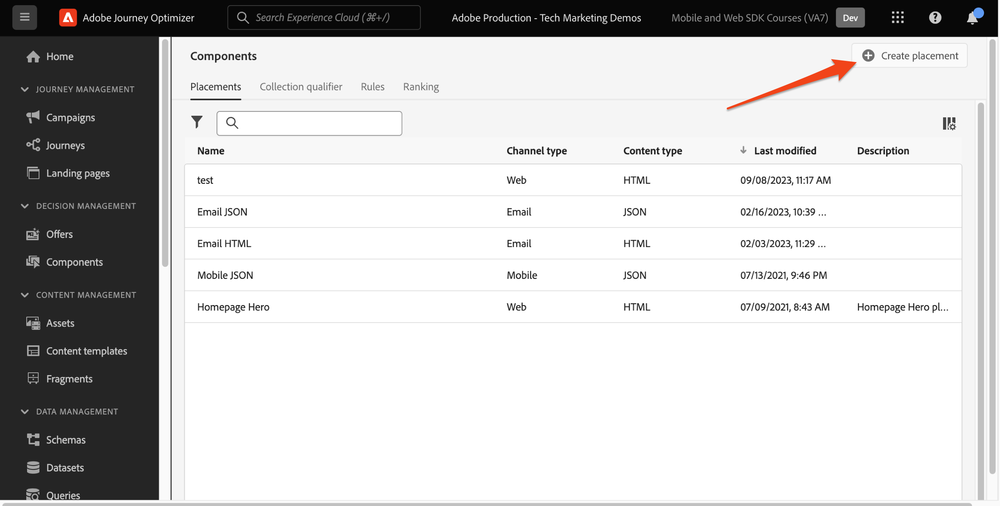

# Beslissingsbeheer instellen met Platform Web SDK

Leer hoe te om Beslissingsbeheer uit te voeren gebruikend Platform Web SDK. Deze gids behandelt de basisvoorwaarden van het Beheer van het Besluit, gedetailleerde stappen voor configuratie, en een diepe duik in een gebruiksgeval dat op loyaliteitsstatus wordt gericht.

Door deze zelfstudie te volgen, zijn Journey Optimizer-gebruikers uitgerust om offer decisioning-functies effectief toe te passen, waardoor de personalisatie en relevantie van hun klantinteracties wordt vergroot.


## Leerdoelen

Aan het einde van deze les kunt u het volgende doen:

* Pak de kernconcepten van Beslissingsbeheer binnen de Adobe Journey Optimizer en de integratie ervan met de SDK van het Web van Adobe Experience Platform.

* Leer het geleidelijke proces om SDK van het Web voor Offer decisioning te vormen, die naadloze integratie met Journey Optimizer verzekeren.

* Onderzoek een gedetailleerd gebruiksgeval dat op loyaliteitsstatusaanbiedingen wordt geconcentreerd, die inzicht in het creëren van en het leiden van aanbiedingen, besluiten, en plaatsen effectief krijgt.

* U dient de essentiële voorwaarden en de implicaties daarvan binnen het kader van het beheer van de besluiten te kennen.

* Begrijp het belang van besluitvormingsregels, inzamelingsbepalende eigenschappen, en reserveaanbiedingen in het leveren van het juiste aanbod aan de juiste gebruiker.

* Schrap in geavanceerde onderwerpen zoals simulaties en de inzameling van de gegevens van de douanegebeurtenis, toelatend u om uw mechanismen van de aanbiedingslevering te testen, te bevestigen en te verbeteren.

## Vereisten

Om de lessen in deze sectie te voltooien, moet u eerst:

* Zorg ervoor dat uw organisatie toegang heeft tot Adobe Journey Optimizer Ultimate (Journey Optimizer en Offer decisioning) of Adobe Experience Platform en de invoegtoepassing voor de toepassingsservice van de Offer decisioning.

* Voltooi alle lessen voor aanvankelijke configuratie van het Web SDK van het Platform.

* Schakel uw organisatie in voor Edge-besluitvorming.

* Begrijp hoe te om een plaatsing te vormen, en plaats en activiteit IDs binnen uw Reikwijdte JSON van het Besluit te concretiseren.

## Beperkingen

Neem nota van de volgende beperking:

* Aanbiedingen op basis van gebeurtenissen worden momenteel niet ondersteund in Adobe Journey Optimizer. Als u een beslissingsregel maakt die is gebaseerd op een gebeurtenis, kunt u deze regel niet toepassen in een aanbieding.

## Toegang verlenen tot het beheer van besluiten

Als u toegang wilt verlenen tot de functionaliteit van het beslissingsbeheer, moet u een **Productprofiel** en wijs de overeenkomstige toestemmingen aan uw gebruikers toe. [Meer informatie over het beheren van Journey Optimizer-gebruikers en -machtigingen in deze sectie](https://experienceleague.adobe.com/docs/journey-optimizer/using/access-control/privacy/high-low-permissions.html?lang=en#decisions-permissions).

## De gegevensstroom configureren

Offer decisioning moet zijn ingeschakeld in het dialoogvenster **datastream** configuratie vóór om het even welke activiteiten van het Beheer van Besluit kunnen door het Web SDK van het Platform worden geleverd.

Om Offer decisioning in de gegevensstroom te vormen:

1. Ga naar de [Gegevensverzameling](https://experience.adobe.com/#/data-collection) interface.

1. Selecteer in de linkernavigatie de optie **Gegevensstromen**.

1. Selecteer de eerder gemaakte Luma Web SDK-gegevensstroom.

   

1. Selecteren **Bewerken** binnen de **Adobe Experience Platform Service**.

   

1. Controleer de **Offer decisioning** doos.

   

1. Selecteren **Opslaan**.

Dit zorgt ervoor dat binnenkomende gebeurtenissen voor Journey Optimizer correct worden afgehandeld door de **Adobe Experience Platform Edge**.

## SDK configureren voor Beslissingsbeheer

Het Beheer van het besluit vereist extra stappen van SDK, afhankelijk van uw de implementatietype van SDK van het Web. Er zijn twee beschikbare opties om SDK voor Beslissingsbeheer te vormen.

* Zelfstandige SDK-installatie
   1. Vorm `sendEvent` handeling met uw `decisionScopes`.

      ```javascript
      alloy("sendEvent", {
         ...
         "decisionScopes": [
            "[DECISION SCOPE 1]",
            "[DECISION SCOPE 2]"
         ]
      })
      ```

* Installatie van SDK-tags
   1. Ga naar de interface voor gegevensverzameling.

   1. Selecteer in de linkernavigatie de optie **Tags**.

      

   1. Selecteer de **Tageigenschap**.

   1. Maak uw **Regels**.
      * Een Platform Web SDK toevoegen **Gebeurtenis verzenden, actie** en voeg de relevante `decisionScopes` aan de configuratie van die actie.

   1. Een **Bibliotheek** alle relevante **Regels**, **Gegevenselementen**, en **Extensies** u hebt gevormd.

## Terminologie

Ten eerste moet u de terminologie begrijpen die wordt gebruikt in de interface voor Beslissingsbeheer.

* **Afbeelding**: Een beperking die bepaalt hoe vaak een aanbieding wordt weergegeven. Twee typen:
   * Totale uiteinden: Maximale tijden kunnen over het doelpubliek worden getoond.
   * Profielbijschrift: de tijden waarin een aanbieding aan een bepaalde gebruiker kan worden getoond.
* **Verzamelingen**: Subsets van aanbiedingen die zijn gegroepeerd op specifieke voorwaarden die zijn ingesteld door bijvoorbeeld een aanbiedingscategorie.
* **Besluit**: Logica die de keuze van een aanbieding voorschrijft.
* **Beslissingsregel**: Beperkt het aantal voorstellen om na te gaan of een gebruiker in aanmerking komt.
* **In aanmerking komende aanbieding**: Een aanbieding die de vooraf ingestelde beperkingen aanpast en aan een gebruiker kan worden getoond.
* **Beslissingsbeheer**: Het systeem om gepersonaliseerde aanbiedingen te creëren en te verspreiden gebruikend bedrijfslogica en besluitvormingsregels.
* **Terugvalvoorstellen**: De standaardaanbieding die wordt weergegeven wanneer een gebruiker niet in aanmerking komt voor aanbiedingen in een verzameling.
* **Voorstel**: Een marketingbericht met potentiële toelatingsregels die bepalend zijn voor de kijkers.
* **Bibliotheek van aanbieding**: Een centrale opslagplaats die aanbiedingen, besluiten, en bijbehorende regels beheert.
* **Persoonlijke aanbiedingen**: Aangepaste marketingberichten op maat van geschiktheidsbeperkingen.
* **Plaatsen**: De instelling of het scenario waarin een aanbieding aan een gebruiker wordt weergegeven.
* **Prioriteit**: Metrische waarde voor aanbiedingen met inachtneming van verschillende beperkingen, zoals geschiktheid en aftopping.
* **Vertegenwoordigingen**: Kanaalspecifieke informatie, bijvoorbeeld locatie of taal, die de weergave van een aanbieding begeleidt.

## Hoofdletters gebruiken - Loyalty&#39;s

In deze les, implementeert u een voorbeeld van het gebruik van beloningen van de Loyalty om het Beheer van het Besluit te begrijpen gebruikend SDK van het Web.

Met dit gebruiksscenario kunt u beter begrijpen hoe Journey Optimizer uw klanten de beste aanbieding kan bieden door gebruik te maken van de gecentraliseerde aanbiedingsbibliotheek en de besluitvormingsengine voor de aanbieding.

>[!NOTE]
>
> Aangezien deze zelfstudie gericht is op implementatoren, is het vermeldenswaard dat deze les substantieel interfacewerk in Journey Optimizer impliceert. Terwijl dergelijke interfacetaken typisch door marketers worden behandeld, kan het voor uitvoerders nuttig zijn om inzicht in het proces te krijgen, zelfs als zij niet verantwoordelijk voor de verwezenlijking van de campagne van het besluitvormingsbeheer op de lange termijn zijn.

## Onderdelen

Voordat u de aanbiedingen gaat maken, moet u verschillende onderdelen definiëren die aan de voorwaarde voldoen.

### Een Plaatsing maken voor aanbiedingen met een logo

**Plaatsen** zijn containers die worden gebruikt om de aanbiedingen te tonen. In dit voorbeeld maakt u een plaatsing boven aan de Luminasite.

De lijst met stages is toegankelijk in het **Componenten** -menu. Er zijn filters beschikbaar waarmee u plaatsingen kunt ophalen op basis van een specifiek kanaal of specifieke inhoud.


Voer de volgende stappen uit om de plaatsing te maken:

1. Klikken **Plaatsing maken**.

   

1. Definieer de eigenschappen van de plaatsing:
   * **Naam**: De naam van de plaatsing. Laten we de voorbeeldplaatsing noemen *&#39;Homepage Banner&#39;*.
   * **Het type Channel**: Het kanaal waarvoor de plaatsing wordt gebruikt. Laten we het gebruiken *&#39;Web&#39;* omdat de aanbiedingen op de Luma-website worden weergegeven.
   * **Inhoudstype**: Het type inhoud dat de plaatsing mag weergeven: Tekst, HTML, Afbeeldingskoppeling of JSON. U kunt *&quot;HTML&quot;* voor het voorstel.
   * **Beschrijving**: Een beschrijving van de plaatsing (optioneel).

   

1. Klikken **Opslaan**.
1. Zodra de plaatsing wordt gecreeerd, toont het in de plaatsingslijst.
1. Selecteer de rij met uw nieuwe plaatsing en neem nota van plaatsidentiteitskaart, aangezien dit voor configuratie binnen uw Reikwijdte van het Besluit noodzakelijk kan zijn.

   

### Beslissingsregels voor de status van Loyalty

**Besluitvormingsregels** de voorwaarden voor de indiening van de offertes specificeren. In dit voorbeeld maakt u beslissingsregels voor verschillende aanbiedingen afhankelijk van de Loyalty-status van een gebruiker.

De lijst met besluitvormingsregels is toegankelijk in het **Componenten** -menu.

Voer de volgende stappen uit om de beslissingsregels te maken:

1. Ga naar de **Regels** en klikt u op **Regel maken**.

   

1. Laten we de eerste regel &#39;*Gouden regel voor de status van Loyalty*&quot;. U kunt XDM-velden gebruiken om de regel te definiëren. De Adobe Experience Platform **Segment Builder** is een intuïtieve interface die u kunt gebruiken om de regelvoorwaarden te bouwen.

   

1. Klikken **Opslaan** om de regelvoorwaarde te bevestigen.
1. De zojuist opgeslagen &#39;*Gouden regel voor de status van Loyalty*&#39; wordt weergegeven in het dialoogvenster **Lijsten**. Selecteer deze optie om de eigenschappen ervan weer te geven.

   

1. Creëer nu de resterende voorwaarden van de loyaliteitsaanbieding voor het gebruiksgeval.


### Verzamelingskwalificaties

**Verzamelingsaanduidingen** kunt u aanbiedingen gemakkelijk organiseren en zoeken binnen de aanbiedingsbibliotheek. In dit voorbeeld, voegt u inzamelingsbepalers aan de aanbiedingen van de Beloning van de Loyalty toe om de aanbiedingsorganisatie te verbeteren.

De lijst met verzamelingsaanduidingen is toegankelijk in het dialoogvenster **Componenten** -menu.

Voer de volgende stappen uit om de verzamelingskwalificatie Loyalty Rewards te maken:

1. Ga naar de **Verzamelingsaanduidingen** en klikt u op **Verzamelingskwalificatie maken**.

   

1. Geef de verzamelingskwalificatie &#39;*Loyalty&#39;s*&#39;

   

1. De nieuwe verzamelingskwalificatie moet nu worden weergegeven in het dialoogvenster **Verzamelingskwalificatie** tab

## Aanbiedingen

Nu is het tijd om de Loyalty Rewards aanbiedingen te creëren.

De lijst met aanbiedingen is toegankelijk in het **Aanbiedingen** -menu.


### Aanbiedingen maken voor verschillende kwaliteitstips

Begin met het maken van persoonlijke aanbiedingen voor de verschillende Luma Loyalty Tiers.

Als u de eerste **aanbieden** Voer de volgende stappen uit:

1. Klikken **Voorstel maken** selecteert u vervolgens **Persoonlijk aanbod**.

1. Geef de eerste aanbieding een naam &#39;*Luminantiegroeven - goud*&quot;. Je moet een begin-/einddatum en -tijd voor dit voorstel opgeven. U moet ook de opdracht **verzamelingskwalificatie** &#39;*Loyalty&#39;s*&quot; aan de aanbieding, zodat u zich beter kunt organiseren binnen **Bibliotheek van aanbieding**. Klik vervolgens op **Volgende**.

   

1. Nu moet u toevoegen **representaties** om te bepalen waar de aanbieding wordt weergegeven. Laten we de **webkanaal**. Laten we ook de &#39;*Homepage Banner*&#39; **plaatsing** u eerder vormde. De geselecteerde **plaatsing** is HTML-type, zodat kunt u HTML, JSON, of de inhoud van de TEKST direct aan de redacteur toevoegen om de aanbieding te bouwen gebruikend **Aangepast** keuzerondje.

   

1. Bewerk de inhoud van de aanbieding rechtstreeks met de **Expressieeditor**. U kunt HTML-, JSON- of TEXT-inhoud aan deze plaatsing toevoegen. Zorg ervoor dat u de juiste **mode** onder aan de editor, afhankelijk van het inhoudstype. U kunt ook **validate** om ervoor te zorgen dat er geen fouten zijn.

   

1. U kunt ook de Expressieeditor gebruiken om kenmerken op te halen die zijn opgeslagen in Adobe Experience Platform. Laten we de voornaam van een profiel toevoegen aan de inhoud van het aanbod om de loyaliteitsleden op een 1:1-niveau beter te personaliseren.

   

1. Voeg beperkingen toe om alleen de aanbieding weer te geven aan profielen die in aanmerking komen voor de &#39;*Gouden regel voor de status van Loyalty*&quot;.

   

1. Als je je voorstel hebt bekeken, klik je op **Voltooien**. Selecteren **Opslaan en goedkeuren**.

Maak nu de rest van de aanbiedingen voor de verschillende Luminantiegrenzen

### Terugvalvoorstellen

U wilt nog steeds een aanbieding doen aan bezoekers van de Luministensite die geen Luma Loyalty zijn. Om dit te doen, kunt u vormen **fallback-aanbieding** voor de campagne.

Ga als volgt te werk om de fallback-aanbieding te maken:

1. Klikken **Voorstel maken** selecteert u vervolgens **Fallback-aanbieding**.
   <!--
      
   -->
1. Geef de fallback-aanbieding een naam &#39;*Loyalty non-Luma*&quot;. U kunt de eerder gemaakte **verzamelingskwalificatie**, &#39;*Loyalty&#39;s*&quot; aan de fallback-aanbieding voor een eenvoudige organisatie van aanbiedingen.
   <!--
      
   -->
1. Voeg de inhoud van de fallback-aanbieding toe aan de **Expressieeditor**. U kunt HTML-, JSON- of TEXT-inhoud aan deze plaatsing toevoegen. Zorg ervoor dat u de juiste **mode** onder aan de editor, afhankelijk van het inhoudstype. U kunt ook **validate** om ervoor te zorgen dat er geen fouten zijn.
   <!--
      
   -->
1. Als alles correct wordt gevormd, druk **Voltooien** en vervolgens **Opslaan en goedkeuren**.
<!--
   
-->

## Besluiten

**Besluiten** zijn containers voor aanbiedingen die de beste aanbieding kiezen beschikbaar voor een klant, afhankelijk van het doel.

De lijst van besluiten is beschikbaar in **Besluiten** tabblad van het **Aanbiedingen** -menu.
<!--
   
-->

### Beslissingen maken voor aanbiedingen van royalty&#39;s

Laten we een beslissing maken voor de Luma Loyalty Rewards use case.

Voer de volgende stappen uit om de beslissing te maken:

1. Klikken **Beslissing maken**.
   <!--
      
   -->
1. Laten we de beslissing noemen, &#39;*Luminantiegraad van december*&quot;. De aanbiedingen moeten één maand lopen, dus laten we dat hier specificeren.
   <!--
      
   -->
1. Nu moet u de **beslissingsbereik**. Selecteer eerst een plaatsing. U kunt de eerder gemaakte &#39;*Homepage Banner*&quot;.
   <!--
      
   -->
1. Volgende moet u toevoegen **evaluatiecriteria** voor het toepassingsgebied van de beschikking. Klikken **Toevoegen** en kies de eerder gemaakte &#39;*Loyalty&#39;s*&#39; **collectie** die alle trouwe aanbiedingen bevat die in overweging moeten worden genomen.
   <!--
      
   -->
1. Binnen de &#39;*Loyalty&#39;s*&#39; verzameling, kunt u het veld Geschiktheid gebruiken om de levering van de aanbieding te beperken tot een subset van Luministers. In dit geval wilt u echter dat elke bezoeker een van de aanbiedingen ontvangt. Herinner me, vormde u **fallback-aanbieding** voor alle niet-loyaliteitsbezoekers. Stel de geschiktheid in op Geen.
   <!--
      
   -->
1. U kunt ook de opdracht **waarderingsmethode** veld voor het selecteren van de beste aanbieding voor elke Luma-bezoeker, als meerdere aanbiedingen in aanmerking komen voor de combinatie gebruiker/plaatsing. Voor dit gebruik kunt u de opdracht **Voorstelprioriteit** methode, die de waarden gebruikt die in de aanbiedingen worden bepaald om de beste aanbieding te dienen.
   <!--
      
   -->
1. Voeg nu de **fallback-aanbieding** op het besluit. Herinnering dat de fallback-aanbieding het standaardaanbod is dat wordt weergegeven aan Luministers als ze niet onder een Luma Loyalty-publiek vallen. Selecteren &#39;*Loyalty non-Luma*&quot; uit de lijst met beschikbare fallback-aanbiedingen voor de &quot;*Homepage Banner*&#39; placement.
   <!--
      
   -->
1. Voordat u de beslissing activeert, bekijken we eerst het bereik van de beslissing, de fallback-aanbieding, een voorvertoning van de beschikbare aanbiedingen en een schatting van de gekwalificeerde profielen. Als alles er goed uitziet, kunt u klikken op **Voltooien** en **Opslaan en activeren**.
<!--
   
-->

## Simulaties

Als beste praktijken, zou u de Luma het besluitvormingslogica van de Loyalty moeten bevestigen om ervoor te zorgen de correcte aanbiedingen aan het juiste loyaliteitspubliek worden geleverd. U kunt dit doen door **testprofielen**. Het is ook een goed idee om wijzigingen in aanbiedingen te testen via testprofielen voordat nieuwe aanbiedingsversies naar de productie worden verplaatst.

Als u wilt beginnen met testen, selecteert u de optie **Simulaties** van de **Aanbiedingen** -menu.

### Loyalty-aanbiedingen testen

1. Selecteer een testprofiel voor de simulatie. Klikken **Profiel beheren**. [Volg deze handleiding om een nieuw testprofiel voor het testen van aanbiedingen te maken of aan te wijzen](https://experienceleague.adobe.com/docs/journeys/using/building-journeys/about-journey-building/creating-test-profiles.html?lang=en#create-test-profiles-csv).
   <!--
      
   -->
1. Voeg een of meer testprofielen toe aan de simulatie en sla uw selectie op. Voor het testen van het gebruiksgeval, zou u testprofielen moeten hebben die voor elk Luma loyaliteitpubliek worden gevormd.
   <!--
      
   -->
1. Selecteer het beslissingsbereik dat u wilt testen. Selecteren **Beslissingsbereik toevoegen**.
   <!--
      
   -->
1. Selecteer de eerder gemaakte &#39;*Homepage Banner*&#39; placement.
   <!--
      
   -->
1. De beschikbare beslissingen worden weergegeven. Selecteer de eerder gemaakte *Luminantiegraad van december*&#39; beslissing en klik op **Toevoegen**.
   <!--
      
   -->
1. Als u een testprofiel hebt geselecteerd, klikt u op **Resultaten weergeven**. De beste beschikbare aanbieding wordt getoond aan het geselecteerde testprofiel voor &quot;*Luminantiegraad van december*&quot; besluit.
   <!--
      
   -->
1. Selecteer een ander testprofiel en klik op **Resultaten weergeven**. In het ideale geval ziet u een andere gesimuleerde aanbieding die overeenkomt met de loyaliteitslaag van het testprofiel.

## Beslissingsbeheervalidering met Adobe Experience Platform Debugger

De **Adobe Experience Platform Debugger** Deze extensie, die zowel beschikbaar is voor Chrome als Firefox, analyseert uw webpagina&#39;s om problemen te identificeren bij de implementatie van Adobe Experience Cloud-oplossingen.

U kunt debugger op de plaats van de Luma gebruiken om de besluitvormingslogica in productie te bevestigen. Dit is een goede praktijk zodra de het gebruiksgeval van de Beloningen van de Loyalty in werking is, om alles te verzekeren correct wordt gevormd.

[Leer hoe te om debugger in uw browser te vormen gebruikend de gids hier](https://experienceleague.adobe.com/docs/platform-learn/data-collection/debugger/overview.html?lang=en).

De validatie starten met de foutopsporing:

1. Navigeer naar de webpagina Luma met de plaatsing van de aanbieding.
   <!--
      
   -->
1. Open tijdens de webpagina de **Adobe Experience Platform debugger**.
   <!--
      
   -->
1. Navigeren naar **Samenvatting**. Controleer of de **DataStream-id** komt overeen met de **datastream** in **Gegevensverzameling Adoben** waarvoor u Offer decisioning hebt ingeschakeld.
   <!--
      
   -->
1. Onder **Oplossingen** navigeer naar de **Experience Platform Web SDK**.
   <!--
      
   -->
1. Binnen de **Configuratie** tab, in-/uitschakelen **Foutopsporing inschakelen**. Hiermee kunt u zich aanmelden voor de sessie in een **Adobe Experience Platform Assurance** sessie.
   <!--
      
   -->
1. U kunt zich dan bij de plaats met diverse rekeningen van de loyaliteit van de Luma aanmelden en debugger gebruiken om de verzoeken te bevestigen die naar worden verzonden **Adobe Experience Platform Edge-netwerk**. Al deze verzoeken moeten worden vastgelegd in **Betrouwbaarheid** voor het bijhouden van logbestanden.
<!--
   
-->

[Volgende: ](setup-consent.md)

>[!NOTE]
>
>Bedankt dat u tijd hebt geïnvesteerd in het leren over de SDK van Adobe Experience Platform Web. Als u vragen hebt, algemene feedback wilt delen of suggesties voor toekomstige inhoud hebt, kunt u deze delen over deze [Experience League Communautaire discussiestuk](https://experienceleaguecommunities.adobe.com/t5/adobe-experience-platform-launch/tutorial-discussion-implement-adobe-experience-cloud-with-web/td-p/444996)
