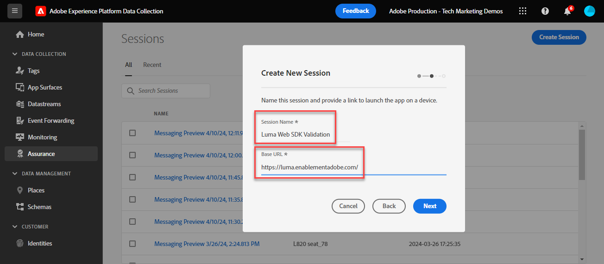

# Valideer de implementaties van SDK van het Web met de Verzekering van het Experience Platform

Adobe Experience Platform Assurance is een product van Adobe Experience Cloud dat u helpt bij het inspecteren, testen, simuleren en valideren van de manier waarop u gegevens verzamelt of ervaringen opdoet. Meer informatie over [Adobe Assurance](https://experienceleague.adobe.com/docs/experience-platform/assurance/home.html?lang=en).

## Leerdoelstellingen

Aan het eind van deze les, zult u kunnen:

* Een betrouwbaarheidssessie starten
* Verzoeken weergeven die van en naar de Edge Network Platform worden verzonden

## Vereisten

U bent vertrouwd met de tags voor gegevensverzameling en de [Luma-demosite](https://luma.enablementadobe.com/content/luma/us/en.html){target="_blank"} en hebben de vorige lessen in de zelfstudie voltooid:

* [Een XDM-schema configureren](configure-schemas.md)
* [Naamruimte configureren](configure-identities.md)
* [Een gegevensstroom configureren](configure-datastream.md)
* [Web SDK-extensie geïnstalleerd in de eigenschap Tag](install-web-sdk.md)
* [Gegevenselementen maken](create-data-elements.md)
* [Identiteiten maken](create-identities.md)
* [Een labelregel maken](create-tag-rule.md)
* [Valideren met foutopsporing](validate-with-debugger.md)

## Een betrouwbaarheidssessie starten en weergeven

Er zijn verschillende manieren om een betrouwbaarheidssessie te starten.

### Een betrouwbaarheidssessie starten in Foutopsporing

Telkens wanneer u het Spoor van de Rand in Adobe Experience Platform Debugger toelaat, is een zitting van de Verzekering begonnen op de achtergrond.

In de les Foutopsporing bekijken hoe we dit deden:

1. Ga naar de [Luma-demosite](https://luma.enablementadobe.com/content/luma/us/en.html) en gebruik foutopsporing om [schakelen van de markeringseigenschap op de site naar uw eigen ontwikkeleigenschap](validate-with-debugger.md#use-the-experience-platform-debugger-to-map-to-your-tags-property)
1. In de linkernavigatie van **[!UICONTROL Experience Platform Debugger]** selecteren **[!UICONTROL Logs]**
1. Selecteer de **[!UICONTROL Edge]** en selecteert u **[!UICONTROL Connect]**

   
1. Als Edge Trace is ingeschakeld, ziet u bovenaan een pictogram voor uitgaande koppelingen. Selecteer het pictogram om Verzekering te openen. Er wordt een nieuw tabblad in de browser geopend.

   

### Een Assurance-sessie starten vanuit de interface voor Betrouwbaarheid

1. Open de [Interface voor gegevensverzameling](https://experience.adobe.com/#/data-collection/home){target="_blank"}
1. Selecteer Betrouwbaarheid in de linkernavigatie
1. Sessie maken selecteren
   
1. Begin selecteren
1. Geef de sessie bijvoorbeeld een naam. `Luma Web SDK validation`
1. Als de **[!UICONTROL Base URL]** enter `https://luma.enablementadobe.com/`
   
1. Selecteer in het volgende scherm de optie **[!UICONTROL Copy Link]**
1. Selecteer het pictogram om de koppeling naar het klembord te kopiëren
1. Plak de URL in uw browser, die de Luma-website opent met een speciale URL-parameter `adb_validation_sessionid` en start de sessie
1. In de interface van de Verzekering, zou u een bericht moeten zien erop wijzen dat u met succes met de zitting hebt verbonden en u zou gebeurtenissen moeten zien die in de interface van de Verzekering worden gevangen.
   

## Valideer de huidige staat van uw implementatie van SDK van het Web

Er is beperkte informatie om in deze fase van uw implementatie te bekijken. Één waarde wij kunnen zien is uw Experience Cloud identiteitskaart (ECID) die op de Edge Network van het Platform wordt geproduceerd:

1. Selecteer de rij met de gebeurtenis genoemd de Handgreep van de Reactie van de Adobe.
1. Rechts wordt een menu weergegeven. Selecteer de `+` ondertekenen naast `[!UICONTROL ACPExtensionEvent]`
1. Omlaag boven door `[!UICONTROL payload > 0 > payload > 0 > namespace]`. De id die wordt weergegeven onder de laatste `0` komt overeen met de `ECID`. U weet dat met de waarde die onder verschijnt `namespace` overeenkomst `ECID`

   

   >[!CAUTION]
   >
   >Mogelijk wordt een ingekorte ECID-waarde weergegeven vanwege de breedte van het venster. Selecteer gewoon de greep in de interface en sleep naar links om de volledige ECID weer te geven.

In toekomstige lessen, gebruikt u Verzekering om volledig verwerkte nuttige lasten te bevestigen die een Adobe toepassing bereiken die in uw gegevensstroom wordt toegelaten.

Met een voorwerp XDM dat nu op een pagina, en met de kennis van hoe te om uw gegevensinzameling te bevestigen vuurt, bent u klaar aan opstelling de individuele toepassingen van de Adobe gebruikend het Web SDK van het Platform.

[Volgende: ](setup-experience-platform.md)

>[!NOTE]
>
>Bedankt dat u tijd hebt geïnvesteerd in het leren over de SDK van Adobe Experience Platform Web. Als u vragen hebt, algemene feedback wilt delen of suggesties voor toekomstige inhoud hebt, kunt u deze delen over deze [Experience League Communautaire discussiestuk](https://experienceleaguecommunities.adobe.com/t5/adobe-experience-platform-launch/tutorial-discussion-implement-adobe-experience-cloud-with-web/td-p/444996)
