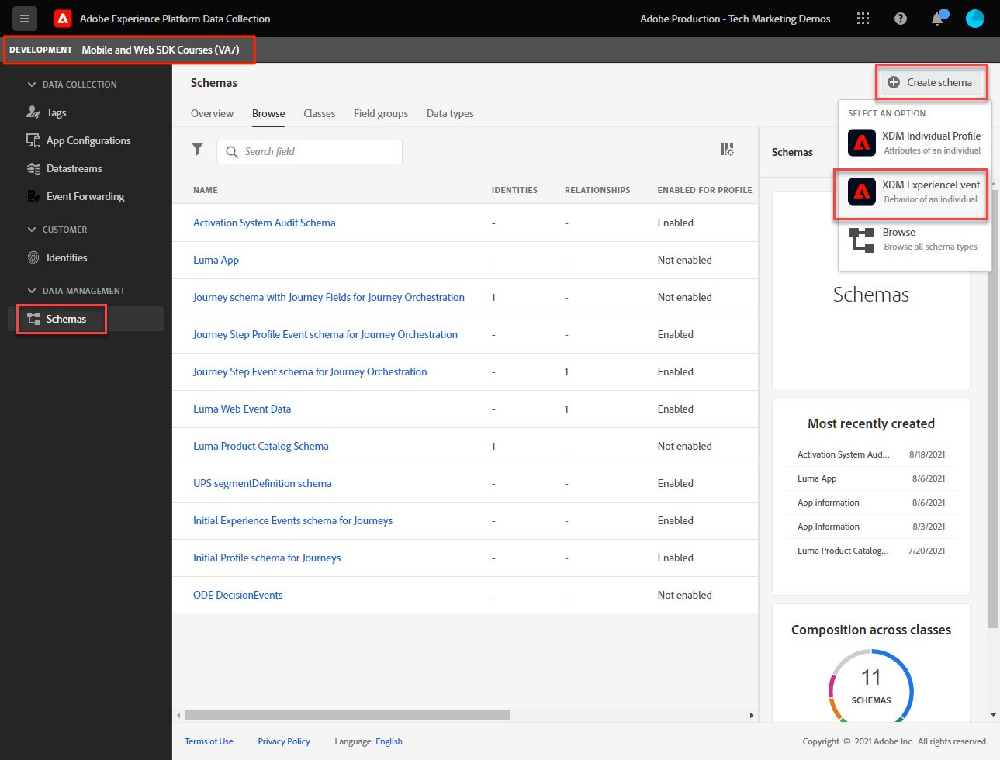

# Een XDM-schema voor webgegevens maken

Leer hoe te om een schema XDM voor Webgegevens in de interface van de Inzameling van Gegevens tot stand te brengen.

De schema&#39;s van het Gegevensmodel van de ervaring (XDM) zijn de bouwstenen, de principes, en de beste praktijken voor het samenstellen van schema&#39;s in Adobe Experience Platform.

De SDK van het Web van het platform gebruikt uw schema om uw gegevens van de Webgebeurtenis te standaardiseren, het naar het Netwerk van de Rand van het Platform te verzenden, en uiteindelijk door:sturen de gegevens aan om het even welke die toepassingen van het Experience Cloud in de gegevensstroom worden gevormd. Deze stap is kritiek aangezien het een standaardgegevensmodel bepaalt dat voor het opnemen van gegevens van de klantenervaring in Experience Platform wordt vereist en stroomafwaartse diensten en toepassingen toelaat die op deze normen worden voortgebouwd.

>[!NOTE]
>
> Voor demonstratiedoeleinden bouwen de oefeningen in deze les een voorbeeldschema om inhoud te vangen die en producten door klanten in worden bekeken in [Luma-demo-site](https://luma.enablementadobe.com/content/luma/us/en.html). Terwijl u deze stappen kunt gebruiken om een verschillend schema voor uw eigen doeleinden tot stand te brengen, adviseert men dat u eerst samen met het creëren van het voorbeeldschema volgt om de mogelijkheden van de schemaredacteur te leren.

Als u meer wilt weten over XDM-schema&#39;s, neemt u de cursus &quot;[Uw klantgegevens modelleren met XDM](https://experienceleague.adobe.com/?recommended=ExperiencePlatform-D-1-2021.1.xdm)&quot; of zie de [XDM System, overzicht](https://experienceleague.adobe.com/docs/experience-platform/xdm/home.html?lang=nl).

## Leerdoelstellingen

Aan het eind van deze les, zult u kunnen:

* Creeer een schema XDM van binnen de interface van de Inzameling van Gegevens
* Veldgroepen toevoegen aan uw XDM-schema
* XDM-schema&#39;s maken voor webgebeurtenisgegevens met behulp van best practices

## Vereisten

Alle noodzakelijke levering en gebruikerstoestemmingen voor de Inzameling van Gegevens en Adobe Experience Platform die in worden beschreven [Machtigingen configureren](configure-permissions.md) les.

## Een XDM-schema maken

De schema&#39;s XDM zijn de standaardmanier om gegevens in Experience Platform te beschrijven, toestaand alle gegevens die aan de schema&#39;s voldoen om over een organisatie zonder conflicten worden opnieuw gebruikt, of zelfs tussen veelvoudige organisaties worden gedeeld. Zie voor meer informatie de [grondbeginselen van de schemacompositie](https://experienceleague.adobe.com/docs/experience-platform/xdm/schema/composition.html?lang=en).

In deze oefening, zult u een schema XDM gebruikend de geadviseerde groepen van het basislijngebied voor het vangen van de gegevens van de Webgebeurtenis op creëren [Luma-demo-site](https://luma.enablementadobe.com/content/luma/us/en.html){target="_blank"}:

1. Open de [Interface voor gegevensverzameling](https://launch.adobe.com/){target="_blank"}
1. Zorg ervoor dat u zich in de juiste sandbox bevindt

   >[!NOTE]
   >
   >Als u de klant bent van een toepassing op basis van een platform, zoals Real-Time CDP, raden wij u aan een ontwikkelingssandbox voor deze zelfstudie te gebruiken. Als dat niet het geval is, gebruikt u de **[!UICONTROL Prod]** sandbox.

1. Ga naar **[!UICONTROL Schemas]** in de linkernavigatie
1. Selecteer de **[!UICONTROL Schema maken]** knop rechtsboven
1. Selecteer in het vervolgkeuzemenu de optie **[!UICONTROL XDM ExperienceEvent]**

## Veldgroepen toevoegen

Zoals eerder vermeld, is XDM het kernkader dat klantenervaringsgegevens door gemeenschappelijke structuren en definities voor gebruik in de stroomafwaartse diensten van Adobe Experience Platform te verstrekken gestandaardiseerd. Door te voldoen aan XDM-standaarden, _alle gegevens van de klantenervaring_ kan worden opgenomen in een gemeenschappelijke vertegenwoordiging. Deze benadering staat u toe om waardevolle inzichten van klantenacties te bereiken, klantenpubliek door segmenten te bepalen, en klantenattributen voor verpersoonlijkingsdoeleinden uit te drukken gebruikend gegevens uit veelvoudige bronnen. Zie [Aanbevolen procedures voor gegevensmodellering](https://experienceleague.adobe.com/docs/experience-platform/xdm/schema/best-practices.html?lang=en) voor meer informatie .

Indien mogelijk wordt aangeraden bestaande veldgroepen te gebruiken en zich te houden aan een product-agnostisch model en naamgevingsconventies. Voor alle gegevens die specifiek zijn voor uw organisatie en die niet in de hierboven vooraf gedefinieerde veldgroepen passen, kunt u een aangepaste veldgroep maken. Zie [Schema&#39;s maken met de Schema-editor](https://experienceleague.adobe.com/docs/experience-platform/xdm/tutorials/create-schema-ui.html?lang=en#create) voor meer gedetailleerde stappen op douaneschema&#39;s.

>[!TIP]
> 
>In deze oefening, voegt u de geadviseerde vooraf bepaalde gebiedsgroepen voor Webgegevensinzameling toe: _**[!UICONTROL AEP Web SDK ExperienceEvent]**_, en _**[!UICONTROL Consumentenervaringsgebeurtenis]**_.

1. In de **[!UICONTROL Veldgroepen]** sectie, selecteert u **[!UICONTROL Toevoegen]**
1. Zoeken naar [!UICONTROL `AEP Web SDK ExperienceEvent`]
1. Het selectievakje inschakelen
1. Zoeken naar [!UICONTROL `Consumer Experience Event`]
1. Het selectievakje inschakelen
1. Selecteren **[!UICONTROL Veldgroepen toevoegen]**

   

Als de veldgroepen zijn geselecteerd, kunt u het schema een naam geven. Een gemeenschappelijke noemende overeenkomst voor schema XDM moet het schema na de bron van de gegevens noemen:

1. In de **[!UICONTROL Compositie**] selecteert u de `Untitled schema name`
1. In de **[!UICONTROL Schema-eigenschappen]** in het deelvenster **[!UICONTROL Weergavenaam]** `Luma Web Event Data`
1. Selecteer iets buiten de **[!UICONTROL Weergavenaam]** veld om het **[!UICONTROL Opslaan]** option
1. Selecteren **[!UICONTROL Opslaan]**

Bij beide veldgroepen zult u zien dat u toegang hebt tot de meestgebruikte sleutelwaardeparen die vereist zijn voor gegevensverzameling op het web. De [!UICONTROL weergavenaam] van elk gebied verschijnt aan marketers in de segmentbouwerinterface van op platform-gebaseerde toepassingen en u kunt de vertoningsnaam van standaardgebieden veranderen om uw behoeften aan te passen. U kunt ook velden verwijderen die u niet wilt. Wanneer u op één van beide naam van de gebiedsgroep klikt, benadrukt de interface welke sleutel-waarde paargroeperingen tot het behoren. In het onderstaande voorbeeld ziet u tot welke groepen behoren **[!UICONTROL Consumentenervaringsgebeurtenis]**.

Deze les is slechts een uitgangspunt. Wanneer het bouwen van uw eigen schema van Webgebeurtenissen, moet u uw bedrijfsvereisten onderzoeken en documenteren. Dit proces lijkt op het maken van een [Document met zakelijke vereisten](https://experienceleague.adobe.com/docs/analytics-learn/tutorials/implementation/implementation-basics/creating-a-business-requirements-document.html) en [Referentie voor ontwerp van oplossing](https://experienceleague.adobe.com/docs/analytics-learn/tutorials/implementation/implementation-basics/creating-and-maintaining-an-sdr.html) voor een Adobe Analytics-implementatie, maar moet vereisten bevatten voor _alle downstreamontvangers_ zoals Platform, Doel, en gebeurtenis die bestemmingen door:sturen.

### Het object identityMap

Er is een speciale set gegevens vereist om webgebruikers te identificeren die `[!UICONTROL identityMap]`.

Het is een verplicht voorwerp voor om het even welke Web-gerelateerde gegevensinzameling, aangezien het Experience Cloud identiteitskaart die voor het identificeren van gebruikers op het Web wordt vereist opslaat. Het is ook de sleutel aan het plaatsen van interne klant IDs voor voor authentiek verklaarde gebruikers. `[!UICONTROL identityMap]` wordt meer besproken in het [Identiteiten configureren](configure-identities.md) les. Het wordt automatisch opgenomen in alle schema&#39;s gebruikend **[!UICONTROL XDM ExperienceEvent]** klasse.

>[!IMPORTANT]
>
> Het is mogelijk **[!UICONTROL Profiel]** voor een schema alvorens uw schema op te slaan. **Niet gebruiken** het op dit punt mogelijk te maken. Als een schema eenmaal is ingeschakeld voor Profiel, kan het niet worden uitgeschakeld of verwijderd. Ook kunnen velden na dit punt niet uit het schema worden verwijderd. Deze implicaties zijn belangrijk om later in mening te houden wanneer u met uw eigen gegevens in uw milieu van de Productie werkt.
>
>Deze instelling wordt tijdens het [Experience Platform instellen](setup-experience-platform.md) les.
>

Nu kunt u naar dit schema verwijzen wanneer u de uitbreiding van SDK van het Web aan uw markeringsbezit toevoegt.

[Volgende: ](configure-identities.md)

>[!NOTE]
>
>Bedankt dat u tijd hebt geïnvesteerd in het leren over de SDK van Adobe Experience Platform Web. Als u vragen hebt, algemene feedback wilt delen of suggesties voor toekomstige inhoud wilt hebben, deelt u deze over deze [Experience League Communautaire discussiestuk](https://experienceleaguecommunities.adobe.com/t5/adobe-experience-platform-launch/tutorial-discussion-implement-adobe-experience-cloud-with-web/td-p/444996)
