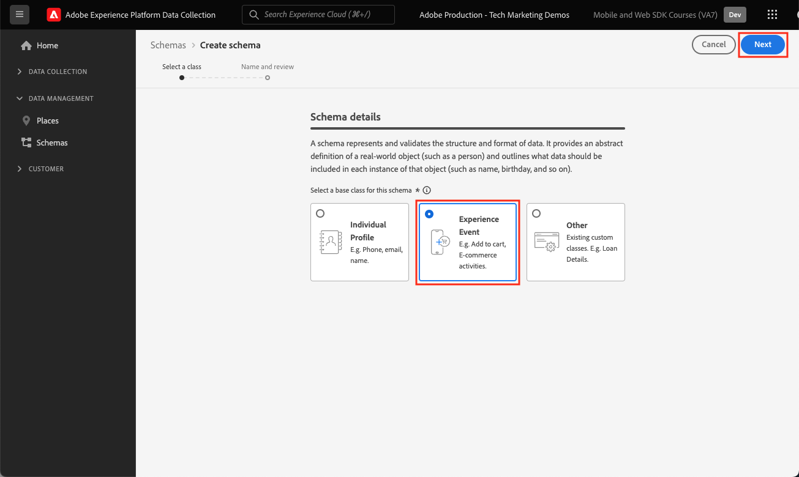
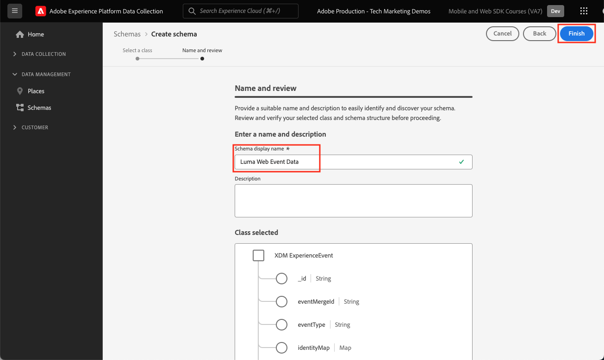

# Een XDM-schema voor webgegevens maken

Leer hoe u een XDM-schema voor webgegevens maakt in de interface van de Adobe Experience Platform-gegevensverzameling.

De schema&#39;s van het Gegevensmodel van de ervaring (XDM) zijn de bouwstenen, de principes, en de beste praktijken voor het verzamelen van gegevens in Adobe Experience Platform.

Het Web SDK van het platform gebruikt uw schema om uw gegevens van de Webgebeurtenis te standaardiseren, het naar het Platform Edge Network te verzenden, en uiteindelijk door:sturen de gegevens aan om het even welke toepassingen van Experience Cloud die in de gegevensstroom worden gevormd. Deze stap is kritiek aangezien het een standaardgegevensmodel bepaalt dat voor het opnemen van gegevens van de klantenervaring in Experience Platform wordt vereist en stroomafwaartse diensten en toepassingen toelaat die op deze normen worden voortgebouwd.

>[!NOTE]
>
>Een schema XDM wordt _vereist_ niet om Adobe Analytics, Adobe Target, of Adobe Audience Manager met het Web SDK uit te voeren (de gegevens kunnen in het `data` voorwerp in plaats van het `xdm` voorwerp worden overgegaan aangezien u later zult zien). Een XDM-schema is vereist voor de krachtigste implementaties van platformonafhankelijke toepassingen zoals Journey Optimizer, Real-Time Customer Data Platform en Customer Journey Analytics. Terwijl u kunt besluiten om geen schema XDM in uw eigen implementatie te gebruiken, wordt u geacht dit als deel van dit leerprogramma te doen.

## Waarom modelleren de gegevens?

De ondernemingen hebben hun eigen taal voor het communiceren over hun domein. De autohandel handelt merk, modellen, en cilinders. Luchtvaartmaatschappijen hebben te maken met vluchtnummers, dienstencategorieën en zitplaatsen. Sommige van deze termen zijn uniek voor een bepaalde onderneming, sommige worden gedeeld door een verticale industrie, en sommige worden gedeeld door bijna alle ondernemingen. Voor termen die worden gedeeld tussen een verticale of zelfs bredere branche, kunt u krachtige dingen met uw gegevens beginnen te doen wanneer u deze termen op een gemeenschappelijke manier noemt en structureert.

Bijvoorbeeld, behandelen vele ondernemingen bevelen. Wat als deze bedrijven gezamenlijk besloten om een order op dezelfde manier te modelleren? Wat gebeurt er bijvoorbeeld als het gegevensmodel bestond uit een object met een eigenschap `priceTotal` die de totale prijs van de order vertegenwoordigde? Wat gebeurt er als dat object ook eigenschappen met de naam `currencyCode` en `purchaseOrderNumber` had? Misschien bevat het orderobject een eigenschap met de naam `payments` die een array van betalingsobjecten zou zijn. Elk object zou een betaling voor de bestelling zijn. Bijvoorbeeld, misschien betaalde een klant voor een deel van de orde met een geschenkkaart en de rest gebruikend een creditcard. U kunt beginnen een model te construeren dat er ongeveer als volgt uitziet:

```json
{
  "order": {
    "priceTotal": 89.50,
    "currencyCode": "EUR",
    "purchaseOrderNumber": "JWN20192388410012",
    "payments": [
      {
        "paymentType": "gift_card",
        "paymentAmount": 50
      },
      {
        "paymentType": "credit_card",
        "paymentAmount": 39.50
      }
    ]
  }
}
```

Als alle bedrijven die met orders te maken hebben, besloten hebben om hun ordergegevens op consistente wijze te modelleren voor termen die in de sector algemeen zijn, kunnen er magische dingen beginnen te gebeuren. De informatie zou vlotter binnen en buiten uw organisatie kunnen worden uitgewisseld in plaats van constant het interpreteren en vertalen van de gegevens (pro&#39;s en evars, om het even wie?). Het leren van de machine kon gemakkelijker begrijpen wat uw gegevens __ betekent en actionable inzichten verstrekken. Gebruikersinterfaces voor het opzoeken van relevante gegevens kunnen intuïtiever worden. Uw gegevens kunnen naadloos worden geïntegreerd met partners en leveranciers die dezelfde modellering volgen.

Dit is het doel van het Model van de Gegevens van de Ervaring van Adobe [&#128279;](https://business.adobe.com/nl/products/experience-platform/experience-data-model.html). XDM verstrekt voorschrijvende modellering voor gegevens die in de industrie gemeenschappelijk zijn, terwijl ook het toestaan van u om het model voor uw specifieke behoeften uit te breiden. Adobe Experience Platform is gebouwd rond XDM en gegevens die naar Experience Platform worden verzonden, moeten daarom in XDM zijn opgeslagen. Overweeg in plaats van na te denken over waar en hoe u uw huidige gegevensmodellen in XDM kunt omzetten alvorens de gegevens naar Experience Platform te verzenden, meer doordringend het goedkeuren van XDM over uw organisatie zodat de vertaling zelden hoeft voor te komen.


>[!NOTE]
>
> Voor demonstratiedoeleinden, bouwen de oefeningen in deze les een voorbeeldschema om inhoud te vangen bekeken en producten die door klanten in de [&#x200B; Plaats van de Demo van de Luma worden gekocht &#x200B;](https://luma.enablementadobe.com/content/luma/us/en.html). Terwijl u deze stappen kunt gebruiken om een verschillend schema voor uw eigen doeleinden tot stand te brengen, adviseert men dat u eerst samen met het creëren van het voorbeeldschema volgt om de mogelijkheden van de schemaredacteur te leren.

Om meer over schema&#39;s te leren XDM, op de playlist [&#x200B; ModelUw Gegevens van de Ervaring van de Klant met XDM &#x200B;](https://experienceleague.adobe.com/nl/playlists/experience-platform-model-your-customer-experience-data-with-xdm) of zie het [&#x200B; XDM overzicht van het Systeem &#x200B;](https://experienceleague.adobe.com/nl/docs/experience-platform/xdm/home).

## Leerdoelstellingen

Aan het eind van deze les, zult u kunnen:

* Creeer een schema XDM van binnen de interface van de Inzameling van Gegevens
* Veldgroepen toevoegen aan uw XDM-schema
* XDM-schema&#39;s maken voor webgebeurtenisgegevens met behulp van best practices

## Vereisten

Alle noodzakelijke levering en gebruikerstoestemmingen voor de Inzameling van Gegevens en Adobe Experience Platform beschreven op de [&#x200B; overzicht &#x200B;](overview.md) pagina.

## Een XDM-schema maken

De schema&#39;s XDM zijn de standaardmanier om gegevens in Experience Platform te beschrijven, toestaand alle gegevens die aan de schema&#39;s in overeenstemming zijn om over een organisatie zonder conflicten worden opnieuw gebruikt, of zelfs tussen veelvoudige organisaties worden gedeeld. Meer leren, zie de [&#x200B; grondbeginselen van de samenstelling van het Schema &#x200B;](https://experienceleague.adobe.com/nl/docs/experience-platform/xdm/schema/composition).

In deze oefening, zult u een schema XDM gebruikend de geadviseerde groepen van het basislijngebied voor het vangen van de gegevens van de Webgebeurtenis over de [&#x200B; Plaats van de Demo van de Luma &#x200B;](https://luma.enablementadobe.com/content/luma/us/en.html){target="_blank"} tot stand brengen:

1. Open de [&#x200B; interface van de Inzameling van Gegevens &#x200B;](https://experience.adobe.com/data-collection/){target="_blank"}
1. Zorg ervoor dat u zich in de juiste sandbox bevindt. De sandbox in de rechterbovenhoek zoeken

   >[!NOTE]
   >
   >Als u de klant bent van een toepassing op basis van een platform, zoals Real-Time CDP of Journey Optimizer, raden we u aan een ontwikkelingssandbox voor deze zelfstudie te gebruiken. Als u dat niet doet, gebruikt u de **[!UICONTROL Prod]** -sandbox.

1. Ga naar **[!UICONTROL Schemas]** in de linkernavigatie
1. Selecteer de knop **[!UICONTROL Create Schema]** rechtsboven

   
1. Selecteer **[!UICONTROL Experience Event]** in het volgende scherm
1. Selecteren **[!UICONTROL Next]**

   

1. Voer in dit geval de naam van het schema in onder het veld **[!UICONTROL Schema display name]** . `Luma Web Event Data`

   >[!TIP]
   >
   >Een gemeenschappelijke noemende overeenkomst voor schema XDM moet het schema na de bron van de gegevens noemen.


1. Voltooien selecteren

   

## Veldgroepen toevoegen

Zoals eerder vermeld, is XDM het kernkader dat klantenervaringsgegevens door gemeenschappelijke structuren en definities voor gebruik in de stroomafwaartse diensten van Adobe Experience Platform te verstrekken gestandaardiseerd. Door aan normen XDM te houden, _kunnen alle gegevens van de klantenervaring_ in een gemeenschappelijke vertegenwoordiging worden opgenomen. Deze benadering staat u toe om waardevolle inzichten van klantenacties te bereiken, klantenpubliek door segmenten te bepalen, en klantenattributen voor verpersoonlijkingsdoeleinden uit te drukken gebruikend gegevens uit veelvoudige bronnen. Zie [&#x200B; Beste praktijken voor gegevens modelleren &#x200B;](https://experienceleague.adobe.com/nl/docs/experience-platform/xdm/schema/best-practices) voor meer informatie.

Indien mogelijk wordt aangeraden bestaande veldgroepen te gebruiken en zich te houden aan een product-agnostisch model en naamgevingsconventies. Voor alle gegevens die specifiek zijn voor uw organisatie en die niet in de hierboven vooraf gedefinieerde veldgroepen passen, kunt u een aangepaste veldgroep maken. Zie [&#x200B; Creërend een schema gebruikend de Redacteur van het Schema &#x200B;](https://experienceleague.adobe.com/nl/docs/experience-platform/xdm/tutorials/create-schema-ui#create) voor meer gedetailleerde stappen op douaneschema&#39;s.

>[!TIP]
> 
>In deze exercitie voegt u de aanbevolen vooraf gedefinieerde veldgroepen voor het verzamelen van webgegevens toe: _&#x200B;**[!UICONTROL AEP Web SDK ExperienceEvent]**&#x200B;_en_&#x200B;**[!UICONTROL Consumer Experience Event]**&#x200B;_ .
>


1. Selecteer in de sectie **[!UICONTROL Field groups]** de optie **[!UICONTROL Add]**

   

1. Zoeken naar [!UICONTROL `AEP Web SDK ExperienceEvent`]
1. Het selectievakje inschakelen
1. Zoeken naar [!UICONTROL `Consumer Experience Event`]
1. Het selectievakje inschakelen
1. Selecteren **[!UICONTROL Add field groups]**

    toe

Bij beide veldgroepen zult u zien dat u toegang hebt tot de meestgebruikte sleutelwaardeparen die vereist zijn voor gegevensverzameling op het web. De [!UICONTROL display name] van elk gebied verschijnt aan marketers in de segmentbuilderinterface van op platform-gebaseerde toepassingen en u kunt de vertoningsnaam van standaardgebieden veranderen om uw behoeften aan te passen. U kunt ook velden verwijderen die u niet wilt. Wanneer u op één van beide naam van de gebiedsgroep klikt, benadrukt de interface welke sleutel-waarde paargroeperingen tot het behoren. In het onderstaande voorbeeld ziet u tot welke velden behoren **[!UICONTROL Consumer Experience Event]** .


Deze les is slechts een uitgangspunt. Wanneer het bouwen van uw eigen schema van Webgebeurtenissen, moet u uw bedrijfsvereisten onderzoeken en documenteren. Dit proces is gelijkaardig aan het creëren van het Document van Bedrijfs a [&#x200B; Vereisten &#x200B;](https://experienceleague.adobe.com/nl/docs/analytics-learn/tutorials/implementation/implementation-basics/creating-a-business-requirements-document) en [&#x200B; de Verwijzing van het Ontwerp van de Oplossing &#x200B;](https://experienceleague.adobe.com/nl/docs/analytics-learn/tutorials/implementation/implementation-basics/creating-and-maintaining-an-sdr) voor een implementatie van Adobe Analytics, maar zou vereisten voor _alle stroomafwaartse gegevensontvangers_ zoals Platform, Doel, en gebeurtenis moeten omvatten door:sturen bestemmingen.


### Het object identityMap

Er is een speciaal veld dat wordt gebruikt voor het identificeren van webgebruikers die `[!UICONTROL identityMap]` worden genoemd.


Het is een verplicht object voor elke gegevensverzameling voor het web, omdat het de Experience Cloud-id bevat die nodig is om gebruikers op het web te identificeren. Het is ook de sleutel aan het plaatsen van interne klant IDs voor voor authentiek verklaarde gebruikers. `[!UICONTROL identityMap]` wordt besproken meer in [&#x200B; vormen de 2&rbrace; les van Identiteiten &lbrace;. &#x200B;](configure-identities.md) Deze wordt automatisch opgenomen in alle schema&#39;s met behulp van de klasse **[!UICONTROL XDM ExperienceEvent]** .


>[!IMPORTANT]
>
> U kunt **[!UICONTROL Profile]** mogelijk inschakelen voor een schema voordat u het schema opslaat. **laat niet** het op dit punt toe. Als een schema eenmaal is ingeschakeld voor Profiel, kan het niet worden uitgeschakeld of verwijderd zonder de volledige sandbox opnieuw in te stellen. De gebieden kunnen niet van schema&#39;s op dit punt of worden verwijderd, hoewel het mogelijk is [&#x200B; Gebieden in UI &#x200B;](https://experienceleague.adobe.com/nl/docs/experience-platform/xdm/tutorials/field-deprecation-ui#deprecate) te verwerpen. Deze implicaties zijn belangrijk om later in mening te houden wanneer u met uw eigen gegevens in uw milieu van de Productie werkt.
>
>
>Dit het plaatsen wordt besproken meer tijdens de [&#x200B; Experience Platform van de Opstelling &#x200B;](setup-experience-platform.md) les.
>&#x200B;>

Selecteer **[!UICONTROL Save]** rechtsboven om deze les te voltooien.


U kunt nu naar dit schema verwijzen wanneer u de extensie Web SDK toevoegt aan de eigenschap tag.

>[!NOTE]
>
>Bedankt dat je tijd hebt geïnvesteerd in het leren over Adobe Experience Platform Web SDK. Als u vragen hebt, algemene terugkoppelen wilt delen, of suggesties over toekomstige inhoud hebben, gelieve hen op deze [&#x200B; Communautaire besprekingspost van Experience League te delen &#x200B;](https://experienceleaguecommunities.adobe.com/t5/adobe-experience-platform-data/tutorial-discussion-implement-adobe-experience-cloud-with-web/td-p/444996)
