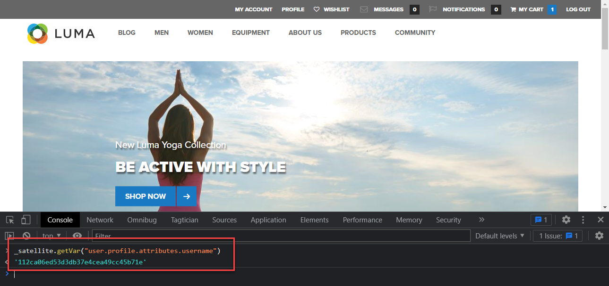

# Gegevenselementen maken

Leer hoe te om de essentiële gegevenselementen tot stand te brengen nodig om gegevens met het Web SDK van het Experience Platform te vangen. Leg zowel inhoud als identiteitsgegevens vast op het tabblad [Luma-demosite](https://luma.enablementadobe.com/content/luma/us/en.html). Leer hoe te om het XDM schema te gebruiken u vroeger voor het verzamelen van gegevens gebruikend het Web SDK van het Platform door een nieuw gegevenstype genoemd XDM Voorwerp creeerde.

>[!NOTE]
>
> Voor demonstratiedoeleinden bouwen de oefeningen in deze les op het voorbeeld dat tijdens wordt gebruikt [Een schema configureren](configure-schemas.md) stap; voorbeeld-XDM-objecten maken die inhoud vastleggen die wordt weergegeven en identiteit van gebruikers op het tabblad [Luma-demosite](https://luma.enablementadobe.com/content/luma/us/en.html).

>[!IMPORTANT]
>
>De gegevens voor deze les zijn afkomstig uit de `[!UICONTROL digitalData]` gegevenslaag op de Luminasite. Om de gegevenslaag te bekijken, open uw ontwikkelaarsconsole en typ binnen `[!UICONTROL digitalData]` om de volledige beschikbare gegevenslaag te zien.


Ongeacht het Web SDK van het Platform, moet u gegevenselementen binnen uw markeringsbezit blijven creëren die aan de variabelen van de gegevensinzameling van uw website, zoals een gegevenslaag, een attribuut van HTML, of anderen in kaart brengen. Zodra u die gegevenselementen creeert, moet u hen aan het XDM schema in kaart brengen u tijdens creeerde [vormen schema&#39;s](configure-schemas.md) les. Om dit te doen, stelt de uitbreiding van SDK van het Web van het Platform een nieuw gegevenstype ter beschikking genoemd voorwerp XDM. Daarom bestaat het creëren van gegevenselementen uit twee acties:

1. Websitevariabelen toewijzen aan gegevenselementen, en
1. Die gegevenselementen toewijzen aan een XDM-object

Voor stap 1, blijft u uw gegevenslaag aan gegevenselementen in kaart brengen de manier u momenteel doet, gebruikend om het even welke de types van gegevenselement van de de markeringsuitbreiding van de Kern. Voor stap 2, leidt de uitbreiding van SDK van het Web van het Platform tot een reeks nieuwe gegevenselematypen die niet eerder beschikbaar waren:

* Samenvoegen-id gebeurtenis
* Identiteitskaart
* XDM-object

In deze les worden de gegevenstelemetypen van XDM-objecten en identiteitskaarten besproken. U zult XDM voorwerpen creëren om de activiteit en de authentificatiestatus van bezoekers van Luma te vangen.

## Leerdoelstellingen

Aan het einde van deze les kunt u het volgende doen:

* Gegevenselementen maken om inhoud en gebruikerslogin-id-gegevens vast te leggen
* Een gegevenselement voor een identiteitsoverzicht maken
* Gegevenselementen toewijzen aan een XDM-objectelement


## Vereisten

U hebt inzicht in wat een gegevenslaag is, u bent vertrouwd met de [Luma-demosite](https://luma.enablementadobe.com/content/luma/us/en.html){target="_blank"} gegevenslaag, en weet hoe te om gegevenselementen in markeringen van verwijzingen te voorzien. U moet de volgende vorige stappen in de zelfstudie hebben uitgevoerd

* [Machtigingen configureren](configure-permissions.md)
* [Een XDM-schema configureren](configure-schemas.md)
* [Naamruimte configureren](configure-identities.md)
* [Een gegevensstroom configureren](configure-datastream.md)
* [Web SDK-extensie geïnstalleerd in de eigenschap Tag](install-web-sdk.md)

>[!IMPORTANT]
>
>De [Experience Cloud ID Service-extensie](https://exchange.adobe.com/experiencecloud.details.100160.adobe-experience-cloud-id-launch-extension.html) is niet nodig wanneer het uitvoeren van het Web SDK van Adobe Experience Platform, aangezien de functionaliteit van de Dienst van identiteitskaart in het Web SDK van het Platform wordt gebouwd.

## Gegevenselementen maken om de gegevenslaag vast te leggen

Voordat u begint met het maken van het XDM-object, moet u de volgende set gegevenselementen maken die zijn toegewezen aan de [Luma-demosite](https://luma.enablementadobe.com/content/luma/us/en.html){target="_blank"} gegevenslaag:

1. Ga naar **[!UICONTROL Gegevenselementen]** en selecteert u **[!UICONTROL Gegevenselement toevoegen]** (of **[!UICONTROL Nieuw gegevenselement maken]** als er geen bestaande gegevenselementen zijn in de eigenschap tag)

   

1. Geef het gegevenselement een naam `page.pageInfo.pageName`
1. Gebruik de **[!UICONTROL JavaScript-variabele]** **[!UICONTROL Het type Data Element]** om naar een waarde in de gegevenslaag van Luma te wijzen: `digitalData.page.pageInfo.pageName`

1. Schakel de selectievakjes in voor **[!UICONTROL Waarde in kleine letters forceren]** en **[!UICONTROL Tekst opschonen]** om het hoofdlettergebruik te standaardiseren en vreemde ruimten te verwijderen

1. Verlaten `None` als de **[!UICONTROL Opslagduur]** instellen omdat deze waarde op elke pagina anders is

1. Selecteren **[!UICONTROL Opslaan]**

   

Voer dezelfde stappen uit om deze vier aanvullende gegevenselementen te maken:

* **`page.pageInfo.server`**  toegewezen aan
  `digitalData.page.pageInfo.server`

* **`page.pageInfo.hierarchie1`**  toegewezen aan
  `digitalData.page.pageInfo.hierarchie1`

* **`user.profile.attributes.username`**  toegewezen aan
  `digitalData.user.0.profile.0.attributes.username`

* **`user.profile.attributes.loggedIn`** toegewezen aan
  `digitalData.user.0.profile.0.attributes.loggedIn`

* **`cart.orderId`** toegewezen aan `digitalData.cart.orderId` (u gebruikt dit tijdens het [Analyses instellen](setup-analytics.md) les)


>[!CAUTION]
>
>De [!UICONTROL JavaScript-variabele] het type van gegevenselement behandelt serieverwijzingen als punten in plaats van haakjes, zo verwijzend het element van gebruikerslijstgegevens als `digitalData.user[0].profile[0].attributes.username` **werkt niet**.

## Gegevenselement identiteitskaarten maken

Vervolgens kunt u het gegevenselement Identiteitskaart maken:

1. Ga naar **[!UICONTROL Gegevenselementen]** en selecteert u **[!UICONTROL Gegevenselement toevoegen]**

1. **[!UICONTROL Naam]** het gegevenselement `identityMap.loginID`

1. Als de **[!UICONTROL Extensie]**, selecteert u `Adobe Experience Platform Web SDK`

1. Als de **[!UICONTROL Type gegevenselement]**, selecteert u `Identity map`

1. Hiermee wordt een schermgebied rechts in het venster **[!UICONTROL Interface voor gegevensverzameling]** voor u om de identiteit te vormen:

   

1. Als de  **[!UICONTROL Naamruimte]**, selecteert u de `Luma CRM Id` naamruimte die u eerder hebt gemaakt in het dialoogvenster [Identiteiten configureren](configure-identities.md) les.

   >[!NOTE]
   >
   >    Als u uw `Luma CRM Id` naamruimte, controleert u of u deze ook hebt gemaakt in uw standaardproductiestandbox. Alleen naamruimten die zijn gemaakt in de standaardproductiefsandbox worden momenteel weergegeven in het vervolgkeuzemenu voor naamruimten.

1. Na de **[!UICONTROL Naamruimte]** is geselecteerd, moet een id worden ingesteld. Selecteer `user.profile.attributes.username` gegevenselement dat eerder in deze les wordt gecreeerd, die een identiteitskaart vangt wanneer de gebruikers in de plaats van de Luma worden geregistreerd.

<!--  >[!TIP]
   >
   >You can verify the **[!UICONTROL Luma CRM ID]** is collected in a data element on the web property by going to the [Luma Demo site](https://luma.enablementadobe.com/content/luma/us/en.html), logging in, [switching the tag environment](validate-with-debugger.md#use-the-experience-platform-debugger-to-map-to-your-tag-property) to your own, and typing `_satellite.getVar("user.profile.attributes.username")` in the web browser developer console.
   >
   >   
-->

1. Als de **[!UICONTROL Status geverifieerd]**, selecteert u **[!UICONTROL Geverifieerd]**
1. Selecteren **[!UICONTROL Primair]**

1. Selecteren **[!UICONTROL Opslaan]**

   

>[!TIP]
>
> Adobe raadt aan identiteiten te verzenden die een persoon vertegenwoordigen, zoals `Luma CRM Id`als de [!UICONTROL primair] identiteit.
>
> Als de identiteitskaart de persoon-id bevat (bijvoorbeeld Luma CRM-id), wordt de persoon-id de persoon-id [!UICONTROL primair] identiteit. Anders wordt ECID de [!UICONTROL primair] identiteit.


<!--
1. Once the data element is configured in **[!UICONTROL Data Collection interface]**, it can be tested on the Luma web property like any other Data Element. Enter the following script in the browser developer console
   
   
   ```
   _satellite.getVar('identityMap.loginID')
   ```  

   
   
   >[!NOTE]
   >
   >ECID identifier will NOT populate in the Data Element, as this is configured already with Platform Web SDK.   
-->

## Gegevenselementen toewijzen aan XDM-objecten

Alle gegevenselementen die u maakt, moeten worden toegewezen aan een XDM-object. Dit object moet overeenkomen met het XDM-schema dat u hebt gemaakt tijdens het [Een schema configureren](configure-schemas.md) les.

Er zijn verschillende manieren om gegevenselementen toe te wijzen aan XDM objecten gebieden. U kunt afzonderlijke gegevenselementen toewijzen aan afzonderlijke XDM-velden of gegevenselementen toewijzen aan hele XDM-objecten zolang uw gegevenselement overeenkomt met het exacte sleutelwaardepaarschema dat aanwezig is in het XDM-object. In deze les legt u inhoudsgegevens vast door deze toe te wijzen aan afzonderlijke velden. U leert hoe u [een gegevenselement toewijzen aan een volledig XDM-object](setup-analytics.md#Map-an-entire-array-to-an-XDM-Object) in de [Analyses instellen](setup-analytics.md) les.

Maak een XDM-object om inhoudsgegevens vast te leggen:

1. Selecteer in de linkernavigatie de optie **[!UICONTROL Gegevenselementen]**
1. Selecteren **[!UICONTROL Gegevenselement toevoegen]**
1. **[!UICONTROL Naam]** het gegevenselement **`xdm.content`**
1. Als de **[!UICONTROL Extensie]** selecteren `Adobe Experience Platform Web SDK`
1. Als de **[!UICONTROL Type gegevenselement]** selecteren `XDM object`
1. Selecteer het Platform **[!UICONTROL Sandbox]** waarin u het XDM-schema hebt gemaakt tijdens het [Een XDM-schema configureren](configure-schemas.md) les, in dit voorbeeld `DEVELOPMENT Mobile and Web SDK Courses`
1. Als de **[!UICONTROL Schema]**, selecteert u uw `Luma Web Event Data` schema:

   

   >[!NOTE]
   >
   >De sandbox komt overeen met de sandbox Experience Platform waarin u het schema hebt gemaakt. Er kunnen meerdere sandboxen beschikbaar zijn in uw Experience Platform-instantie. Selecteer dus de juiste sandbox. Werk altijd eerst in ontwikkeling en daarna in productie.

1. Schuif omlaag totdat u de **`web`** object
1. Selecteren om te openen

   


1. De volgende XDM-webvariabelen toewijzen aan gegevenselementen

   * **`web.webPageDetials.name`** tot `%page.pageInfo.pageName%`
   * **`web.webPageDetials.server`** tot `%page.pageInfo.server%`
   * **`web.webPageDetials.siteSection`** tot `%page.pageInfo.hierarchie1%`

   

1. Zoek vervolgens de `identityMap` object in het schema en selecteer het

1. Toewijzen aan de `identityMap.loginID` gegevenselement

1. Selecteren **[!UICONTROL Opslaan]**

   


Aan het einde van deze stappen moeten de volgende gegevenselementen worden gemaakt:

| CORE Extension Data Elements | Platform SDK-gegevenselementen |
-----------------------------|-------------------------------
| `cart.orderId` | `identityMap.loginID` |
| `page.pageInfo.hierarchie1` | `xdm.content` |
| `page.pageInfo.pageName` | |
| `page.pageInfo.server` | |
| `user.profile.attributes.loggedIn` | |
| `user.profile.attributes.username` | |

Met deze gegevenselementen op zijn plaats, bent u klaar om gegevens naar het Netwerk van de Rand van het Platform via het voorwerp te verzenden XDM door een regel in markeringen te creëren.

[Volgende: ](create-tag-rule.md)

>[!NOTE]
>
>Bedankt dat u tijd hebt geïnvesteerd in het leren over Adobe Experience Platform Web SDK. Als u vragen hebt, algemene feedback wilt delen of suggesties voor toekomstige inhoud hebt, kunt u deze delen over deze [Experience League Communautaire discussiestuk](https://experienceleaguecommunities.adobe.com/t5/adobe-experience-platform-launch/tutorial-discussion-implement-adobe-experience-cloud-with-web/td-p/444996)
