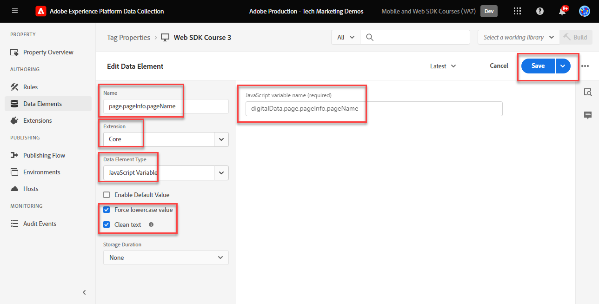

# Gegevenselementen maken

Leer hoe te om gegevenselementen in markeringen voor inhoud, handel, en identiteitsgegevens over de [ de demoplaats van de Luma ](https://luma.enablementadobe.com/content/luma/us/en.html) tot stand te brengen. Vul vervolgens velden in uw XDM-schema met het gegevenstype Variabele voor variabele-gegevenselement voor de extensie Adobe Experience Platform Web SDK.

## Leerdoelstellingen

Aan het einde van deze les kunt u het volgende doen:

* Begrijp verschillende benaderingen om een gegevenslaag aan XDM in kaart te brengen
* Gegevenselementen maken om gegevens vast te leggen
* Gegevenselementen toewijzen aan een XDM-object


## Vereisten

U hebt inzicht in wat een gegevenslaag is en de vorige lessen in het leerprogramma voltooid:

* [Een XDM-schema configureren](configure-schemas.md)
* [Naamruimte configureren](configure-identities.md)
* [Een gegevensstroom configureren](configure-datastream.md)
* [Web SDK-extensie geïnstalleerd in de eigenschap tag](install-web-sdk.md)


>[!IMPORTANT]
>
>De gegevens voor deze les komen uit de `[!UICONTROL digitalData]` gegevenslaag op de plaats van de Luma. Als u de gegevenslaag wilt weergeven, opent u de ontwikkelaarsconsole en typt u in `[!UICONTROL digitalData]` om de volledige beschikbare gegevenslaag weer te geven.


## Datalaagbenaderingen

Er zijn meerdere manieren om gegevens van uw gegevenslaag toe te wijzen aan XDM gebruikend de markeringsfunctionaliteit van Adobe Experience Platform. Hieronder volgen een paar voor- en nadelen van drie verschillende benaderingen. Indien gewenst kunnen benaderingen worden gecombineerd:

1. XDM in de gegevenslaag implementeren
1. Toewijzen aan XDM in tags
1. Toewijzen aan XDM in de gegevensstroom

>[!NOTE]
>
>De voorbeelden in deze zelfstudie volgen de Tagbenadering Kaart aan XDM.


### XDM in de gegevenslaag implementeren

Deze benadering impliceert het gebruiken van het volledig bepaalde voorwerp XDM als structuur voor uw gegevenslaag. Vervolgens wijst u de volledige gegevenslaag toe aan een XDM-objectelement in tags. Als uw implementatie geen markeringsmanager gebruikt, kan deze benadering ideaal zijn omdat u gegevens naar XDM direct van uw toepassing kunt verzenden gebruikend het [ XDM sendEvent bevel ](https://experienceleague.adobe.com/en/docs/experience-platform/edge/fundamentals/tracking-events#sending-xdm-data). Als u wel tags gebruikt, kunt u een aangepast code-gegevenselement maken waarmee de gehele gegevenslaag als een pass-through JSON-object wordt vastgelegd op de XDM. Vervolgens wijst u de pass-through JSON toe aan het XDM-objectveld in de Send Event-handeling.

Hieronder ziet u hoe de gegevenslaag eruit zou zien als u de indeling Adobe Client Data Layer zou gebruiken:

+++XDM in het voorbeeld Gegevenslaag

```JSON
window.adobeDataLayer.push({
"eventType": "web.webPageDetails.pageViews",
"web":{
         "webInteraction":{
            "linkClicks":{
               "id":"",
               "value":""
            },
            "URL":"",
            "name":"",
            "region":"",
            "type":""
         },
         "webPageDetails":{
            "pageViews":{
               "id":"",
               "value":"1"
            },
            "URL":"https://luma.enablementadobe.com/",
            "isErrorPage":"",
            "isHomePage":"",
            "name":"luma:home",
            "server":"enablementadobe.com",
            "siteSection":"home",
            "viewName":""
         },
         "webReferrer":{
            "URL":"",
            "type":""
         }
      }
});
```

+++

Pros

* Elimineert extra stappen die aan de variabelen van de gegevenslaag opnieuw aan XDM worden toegewezen
* Mogelijk is de implementatie sneller als uw webontwikkelingsteam ook eigenaar is van taggen met digitaal gedrag

Cons

* Volledige afhankelijkheid van ontwikkelingsteam en ontwikkelingscyclus voor het bijwerken van welke gegevens naar XDM gaan
* Beperkte flexibiliteit omdat XDM de exacte lading van de gegevenslaag ontvangt
* Kan ingebouwde tagfuncties, zoals plakken, persistentie, functies voor snelle implementatie niet gebruiken
* Harder om de gegevenslaag voor derdepixel te gebruiken (maar u zou deze pixel aan [ gebeurtenis kunnen willen bewegen door:sturen ](setup-event-forwarding.md)!
* Kan de gegevens niet transformeren tussen de gegevenslaag en XDM

### Gegevenslaag toewijzen in tags

Deze benadering omvat het in kaart brengen van individuele gegevenslaagvariabelen OF gegevenslaagvoorwerpen aan gegevenselementen in markeringen en uiteindelijk aan XDM. Dit is de traditionele benadering van implementatie gebruikend een systeem van het markeringsbeheer.

#### Pros

* De meest flexibele benadering zoals u individuele variabelen kunt controleren en gegevens omzetten alvorens het XDM krijgt
* Kan Adobe-tagtriggers en -plakfuncties gebruiken om gegevens door te geven aan XDM
* Gegevenselementen kunnen worden toegewezen aan client-side pixels van derden

#### Cons

* Er is tijd nodig om de gegevenslaag te reconstrueren als gegevenselementen


>[!TIP]
>
> Google-gegevenslaag
> 
> Als uw organisatie reeds Google Analytics gebruikt en het traditionele Google dataLayer voorwerp op uw website heeft, kunt u de [ uitbreiding van de Laag van Gegevens van Google ](https://experienceleague.adobe.com/en/docs/experience-platform/tags/extensions/client/google-data-layer/overview) in markeringen gebruiken. Hierdoor kunt u sneller Adobe-technologie implementeren zonder dat u ondersteuning van uw IT-team nodig hebt. Als u de Google-gegevenslaag toewijst aan XDM, worden dezelfde stappen uitgevoerd als hierboven.

### Toewijzen aan XDM in de gegevensstroom

Deze benadering gebruikt functionaliteit die in de configuratie van de gegevensstroom [ wordt ingebouwd Prep van Gegevens voor de Inzameling van Gegevens ](https://experienceleague.adobe.com/en/docs/experience-platform/datastreams/data-prep) en slaat de variabelen van de kaartgegevenslaag aan XDM in markeringen over.

#### Pros

* Flexibel omdat u individuele variabelen aan XDM kunt in kaart brengen
* Capaciteit om [ nieuwe waarden ](https://experienceleague.adobe.com/en/docs/experience-platform/data-prep/functions) of [ transformatie gegevenstypes ](https://experienceleague.adobe.com/en/docs/experience-platform/data-prep/data-handling) van een gegevenslaag gegevens uit te werken alvorens het naar XDM gaat
* Hefboomwerking a [ Afbeelding UI ](https://experienceleague.adobe.com/en/docs/experience-platform/datastreams/data-prep#create-mapping) aan kaartgebieden in uw brongegevens aan XDM met een punt-en-klik UI

#### Cons

* Kan gegevenslaagvariabelen niet als gegevenselementen voor cliënt-kant derdepixel gebruiken, maar kan hen gebruiken met gebeurtenis het door:sturen
* Kan de plakfunctie van de tagfunctie van Adobe Experience Platform niet gebruiken
* De complexiteit van onderhoud neemt toe als de gegevenslaag zowel in tags als in gegevensstroom wordt toegewezen


>[!IMPORTANT]
>
>Zoals eerder vermeld, volgen de voorbeelden in deze zelfstudie de optie Toewijzen aan XDM in de tagaanpak.

## Gegevenselementen maken om de gegevenslaag vast te leggen

Alvorens u het voorwerp XDM creeert, creeer de volgende reeks gegevenselementen voor de [ de duimplaats van de Luma ](https://luma.enablementadobe.com/content/luma/us/en.html){target="_blank"} gegevenslaag:

1. Ga naar **[!UICONTROL Data Elements]** en selecteer **[!UICONTROL Add Data Element]** (of **[!UICONTROL Create New Data Element]** als de eigenschap tag geen bestaande gegevenselementen bevat)

   

1. Naam van het gegevenselement `page.pageInfo.pageName`
1. Gebruik **[!UICONTROL JavaScript Variable]** **[!UICONTROL Data Element type]** om naar een waarde in de gegevenslaag van Luma te wijzen: `digitalData.page.pageInfo.pageName`

1. Schakel de selectievakjes voor **[!UICONTROL Force lowercase value]** en **[!UICONTROL Clean text]** in om het hoofdlettergebruik te standaardiseren en overbodige spaties te verwijderen

1. Laat `None` staan als de instelling **[!UICONTROL Storage Duration]** omdat deze waarde op elke pagina anders is

1. Selecteren **[!UICONTROL Save]**

   

Maak deze aanvullende gegevenselementen door dezelfde stappen uit te voeren:

* **`page.pageInfo.server`** toegewezen aan
  `digitalData.page.pageInfo.server`

* **`page.pageInfo.hierarchie1`** toegewezen aan
  `digitalData.page.pageInfo.hierarchie1`

* **`user.profile.attributes.username`** toegewezen aan
  `digitalData.user.0.profile.0.attributes.username`

* **`user.profile.attributes.loggedIn`** toegewezen aan
  `digitalData.user.0.profile.0.attributes.loggedIn`

* **`product.productInfo.sku`** toegewezen aan `digitalData.product.0.productInfo.sku`
<!--digitalData.product.0.productInfo.sku
    ```javascript
    var cart = digitalData.product;
    var cartItem;
    cart.forEach(function(item){
    cartItem = item.productInfo.sku;
    });
    return cartItem;
    ```
    -->
* **`product.productInfo.title`** toegewezen aan `digitalData.product.0.productInfo.title`
* **`cart.orderId`** toegewezen aan `digitalData.cart.orderId`
<!--
    ```javascript
    var cart = digitalData.product;
    var cartItem;
    cart.forEach(function(item){
    cartItem = item.productInfo.title;
    });
    return cartItem;
    ```
    -->
* **`product.category`** door de URL van de site te parseren voor de categorie op hoofdniveau met de **[!UICONTROL Custom Code]** **[!UICONTROL Data Element type]** en de volgende aangepaste code:

  ```javascript
  var cat = location.pathname.split(/[/.]+/);
  if (cat[5] == 'products') {
     return (cat[6]);
  } else if (cat[5] != 'html') { 
     return (cat[5]);
  }
  ```

* **`cart.productInfo`** gebruiken van de volgende douanecode:

  ```javascript
  var cart = digitalData.cart.cartEntries; 
  var cartItem = [];
  cart.forEach(function(item, index, array){
  cartItem.push({
  "SKU": item.sku
  });
  });
  return cartItem; 
  ```

* **`cart.productInfo.purchase`** gebruiken van de volgende douanecode:

  ```javascript
  var cart = digitalData.cart.cartEntries; 
  var cartItem = [];
  cart.forEach(function(item, index, array){
  var qty = parseInt(item.qty);
  var price = parseInt(item.price);
  cartItem.push({
  "SKU": item.sku,
  "quantity": qty,
  "priceTotal": price
  });
  });
  return cartItem; 
  ```


>[!CAUTION]
>
>Het [!UICONTROL JavaScript variable] type van gegevenselement behandelt serieverwijzingen als punten in plaats van haakjes, zodat zal het van verwijzingen voorzien van het element van gebruikersnaamelementen zoals `digitalData.user[0].profile[0].attributes.username` **niet** werken.

## Variabele-gegevenselementen maken voor XDM- en gegevensobjecten

De gegevenselementen u enkel creeerde zullen worden gebruikt om een voorwerp XDM (voor de toepassingen van het Platform) en een gegevensvoorwerp (voor Analytics, Doel, en Audience Manager) te bouwen. Deze objecten hebben hun eigen speciale gegevenselementen, **[!UICONTROL Variable]** gegevenselementen, die u heel gemakkelijk kunt maken.

Om het Variabele gegevenselement voor XDM tot stand te brengen, koppelt u het aan het schema u in [ creeerde vormt een schema ](configure-schemas.md) les:

1. Selecteren **[!UICONTROL Add Data element]**
1. Geef uw gegevenselement een naam `xdm.variable.content`. Het wordt aanbevolen om de gegevenselementen die specifiek zijn voor XDM, vooraf in te delen met &quot;xdm&quot; om de eigenschap tag beter te organiseren
1. Selecteer **[!UICONTROL Adobe Experience Platform Web SDK]** als **[!UICONTROL Extension]**
1. Selecteer **[!UICONTROL Variable]** als **[!UICONTROL Data Element Type]**
1. Selecteer **[!UICONTROL XDM]** als de **[!UICONTROL property]**
1. Selecteer de **[!UICONTROL Sandbox]** waarin u het schema hebt gemaakt
1. Selecteer in dit geval de juiste **[!UICONTROL Schema]** `Luma Web Event Data` .
1. Selecteren **[!UICONTROL Save]**

   

Maak vervolgens het gegevenselement Variabele voor het gegevensobject:

1. Selecteren **[!UICONTROL Add Data element]**
1. Geef uw gegevenselement een naam `data.variable`. Het wordt aanbevolen om de gegevenselementen die specifiek zijn voor het gegevensobject, vooraf in te stellen op &#39;data&#39; om de eigenschap tag beter te organiseren
1. Selecteer **[!UICONTROL Adobe Experience Platform Web SDK]** als **[!UICONTROL Extension]**
1. Selecteer **[!UICONTROL Variable]** als **[!UICONTROL Data Element Type]**
1. Selecteer **[!UICONTROL data]** als de **[!UICONTROL property]**
1. Selecteer de Experience Cloud-oplossingen die u wilt implementeren als onderdeel van deze zelfstudie
1. Selecteren **[!UICONTROL Save]**

   


Aan het einde van deze stappen moeten de volgende gegevenselementen worden gemaakt:

| Core Extension Data Elements | Platform Web SDK Extension Data Elements |
-----------------------------|-------------------------------
| `cart.orderId` | `data.variable` |
| `cart.productInfo` | `xdm.variable.content` |
| `cart.productInfo.purchase` | |
| `page.pageInfo.hierarchie1` | |
| `page.pageInfo.pageName` | |
| `page.pageInfo.server` | |
| `product.category` | |
| `product.productInfo.sku` | |
| `product.productInfo.title` | |
| `user.profile.attributes.loggedIn` | |
| `user.profile.attributes.username` | |

>[!TIP]
>
>In een toekomstige [ creeer markeringsregels ](create-tag-rule.md) les, leert u hoe de **[!UICONTROL Variable]** gegevenselementen u toestaan om veelvoudige regels in markeringen te stapelen gebruikend **[!UICONTROL Update Variable Action type]**.

Met deze gegevenselementen op zijn plaats, bent u bereid om gegevens naar Platform Edge Network met een markeringsregel te beginnen verzenden. Maar eerst, leer over het verzamelen van identiteiten met Web SDK.

>[!NOTE]
>
>Bedankt dat je tijd hebt geïnvesteerd in het leren over Adobe Experience Platform Web SDK. Als u vragen hebt, algemene terugkoppelen wilt delen, of suggesties over toekomstige inhoud hebben, gelieve hen op deze [ Communautaire besprekingspost van Experience League te delen ](https://experienceleaguecommunities.adobe.com/t5/adobe-experience-platform-data/tutorial-discussion-implement-adobe-experience-cloud-with-web/td-p/444996)
