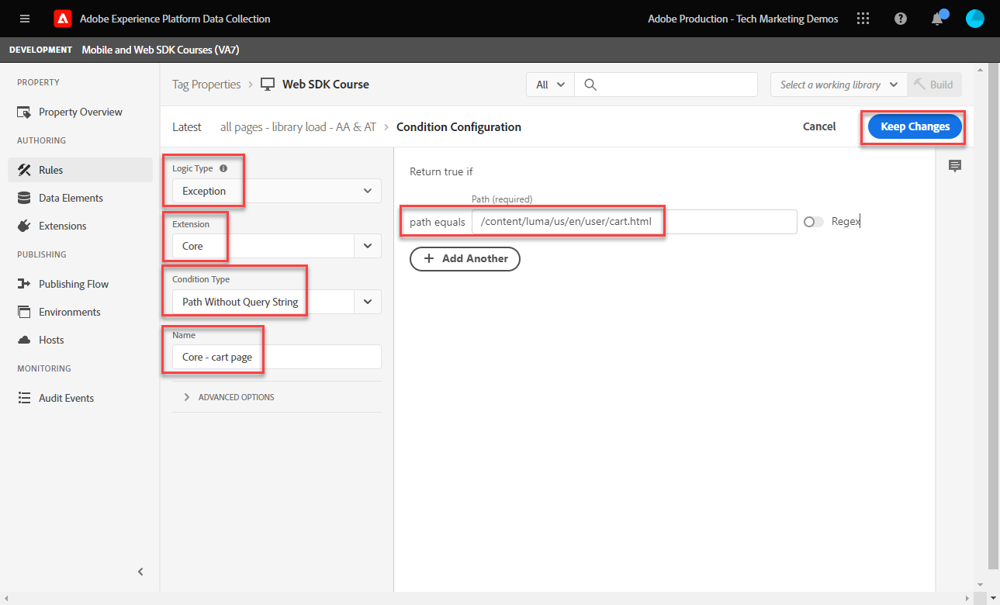
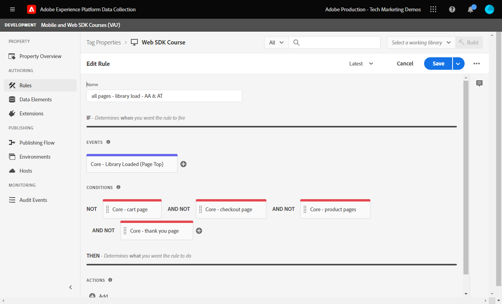

# Een labelregel maken

>[!CAUTION]
>
>We verwachten dat we op vrijdag 15 maart 2024 belangrijke wijzigingen in deze zelfstudie zullen publiceren. Na dat punt zullen vele oefeningen veranderen en u kunt het leerprogramma van het begin moeten opnieuw beginnen om alle lessen te voltooien.

Leer hoe u een gebeurtenis naar het Platform Edge Network kunt verzenden met uw XDM-object aan de hand van een tagregel. Een labelregel is een combinatie van gebeurtenissen, voorwaarden en handelingen die de eigenschap van de tag opgeeft iets te doen.

>[!NOTE]
>
> Voor demonstratiedoeleinden bouwen de oefeningen in deze les op het voorbeeld dat tijdens wordt gebruikt [Gegevenselementen maken](create-data-elements.md) stap; verzenden van een XDM-gebeurtenisactie om inhoud en identiteiten van gebruikers op de [Luma-demosite](https://luma.enablementadobe.com/content/luma/us/en.html).

## Leerdoelstellingen

Aan het eind van deze les, zult u kunnen:

* Een naamgevingsconventie gebruiken voor het beheer van regels binnen tags
* Een tagregel maken om een XDM-gebeurtenis te verzenden
* Een labelregel publiceren naar een ontwikkelingsbibliotheek

## Vereisten

U bent vertrouwd met de tags voor gegevensverzameling en de [Luma-demosite](https://luma.enablementadobe.com/content/luma/us/en.html)en u moet de volgende lessen uit het verleden hebben geleerd in de zelfstudie:

* [Machtigingen configureren](configure-permissions.md)
* [Een XDM-schema configureren](configure-schemas.md)
* [Naamruimte configureren](configure-identities.md)
* [Een gegevensstroom configureren](configure-datastream.md)
* [Web SDK-extensie geïnstalleerd in de eigenschap Tag](install-web-sdk.md)
* [Gegevenselementen maken](create-data-elements.md)

## Naamgevingsconventies

Voor een beter beheer van de regels in tags is het raadzaam een standaardnaamgevingsconventie te volgen. In deze zelfstudie wordt een naamgevingsconventie gebruikt die uit drie delen bestaat:

* [locatie] - [event] - [gereedschap]

waar;

1. de locatie is de pagina of pagina&#39;s op de locatie waar de regel wordt geactiveerd
1. de gebeurtenis is de trekker die het baken in brand steekt
1. is de specifieke toepassing of toepassingen die in de actiestap voor die regel worden gebruikt

## Tagregel maken

In tags worden regels gebruikt om handelingen (aanroepen naar brand) onder verschillende omstandigheden uit te voeren. U zult deze eerste regel gebruiken om het voorwerp XDM naar het Netwerk van de Rand te verzenden gebruikend Web SDK [!UICONTROL Send Event] handeling. Later in deze zelfstudie verzendt u verschillende versies van het XDM-object op basis van het type pagina waarop de bezoeker zich bevindt. Om die reden, zult u regelvoorwaarden gebruiken om die andere types van pagina&#39;s uit te sluiten.

Een labelregel maken:

1. De eigenschap tag openen die u gebruikt voor deze zelfstudie
1. Ga naar **[!UICONTROL Rules]** in de linkernavigatie
1. Selecteer de **[!UICONTROL Create New Rule]** knop
   
1. Naam van de regel `all pages - library load - AA & AT`

   >[!NOTE]
   >
   > Deze regel wordt door Adobe Analytics en Target in een toekomstige les op een specifieke manier gebruikt, en daarom `AA & AT` wordt gebruikt aan het einde van de naam.

1. In de **[!UICONTROL Events]** sectie, selecteert u **[!UICONTROL Add]**
   
1. Gebruik de **[!UICONTROL Core Extension]** en selecteert u `Library Loaded (Page Top)` als de **[!UICONTROL Event Type]**.

   Deze instelling betekent dat de regel wordt geactiveerd wanneer de tagbibliotheek op een pagina wordt geladen.
1. Selecteren **[!UICONTROL Keep Changes]** om op het belangrijkste regelscherm terug te keren
   
1. In de **[!UICONTROL Conditions]** selecteert u de **[!UICONTROL Add]** knop
   
1. Selecteren **[!UICONTROL Logic Type]** `Exception`, **[!UICONTROL Extension]** `Core`, en **[!UICONTROL Condition Type]** `Path Without Query String`
1. Voer het URL-pad in `/content/luma/us/en/user/cart.html` in de **[!UICONTROL path equals]** veld, en **[!UICONTROL name]** het `Core - cart page`
1. Selecteren **[!UICONTROL Keep Changes]**
   
1. Voeg nog drie uitzonderingen toe voor de volgende URL-paden

   * **`Core - checkout page`** for `/content/luma/us/en/user/checkout.html`
   * **`Core - thank you page`** for `/content/luma/us/en/user/checkout/order/thank-you.html`
   * **`Core - product page`** for `/products/` terwijl de Regex-schakelaar ingeschakeld is

   

1. In de **[!UICONTROL Actions]** sectie, selecteert u **[!UICONTROL Add]**
1. Selecteren **[!UICONTROL Adobe Experience Platform Web SDK]** als de **[!UICONTROL Extension]**
1. Selecteren **[!UICONTROL Send Event]** als de **[!UICONTROL Action Type]**
1. Selecteren **[!UICONTROL web.webpagedetails.pageViews]** als de **[!UICONTROL Type]**.

   >[!WARNING]
   >
   > In dit vervolgkeuzemenu worden de **`xdm.eventType`** in het XDM-object. Hoewel u in dit veld ook vrije-formulierlabels kunt typen, wordt u ten zeerste aangeraden **niet** omdat dit negatieve effecten heeft voor Platform.

1. Als de **[!UICONTROL XDM data]**, selecteert u de `xdm.content` gegevenselement dat in de vorige les is gemaakt
1. Selecteren **[!UICONTROL Keep Changes]** om op het belangrijkste regelscherm terug te keren

   
1. Selecteren **[!UICONTROL Save]** om de regel op te slaan

   

## De regel in een bibliotheek publiceren

Vervolgens publiceert u de regel naar uw ontwikkelomgeving, zodat we kunnen controleren of deze werkt.

Een bibliotheek maken:

1. Ga naar **[!UICONTROL Publishing Flow]** in de linkernavigatie
1. Selecteren **[!UICONTROL Add Library]**

   
1. Voor de **[!UICONTROL Name]**, enter `Luma Web SDK Tutorial`
1. Voor de **[!UICONTROL Environment]**, selecteert u `Development`
1. Selecteren  **[!UICONTROL Add All Changed Resources]**

   >[!NOTE]
   >
   >    Naast de Adobe Experience Platform Web SDK-extensie en de `all pages - library load - AA & AT` regel, zult u de markeringscomponenten zien die in vorige lessen worden gecreeerd. De Core-extensie bevat de basis-JavaScript die is vereist voor alle eigenschappen van webtags.

1. Selecteren **[!UICONTROL Save & Build for Development]**

   

Het kan enkele minuten duren voordat de bibliotheek is gemaakt en wanneer deze is voltooid, wordt links van de naam van de bibliotheek een groene stip weergegeven:

Zoals u kunt zien op het tabblad [!UICONTROL Publishing Flow] screen, is er veel meer aan het het publiceren proces dat buiten het werkingsgebied van deze zelfstudie is. Deze zelfstudie gebruikt slechts één bibliotheek in uw ontwikkelomgeving.

Nu bent u bereid om de gegevens in het verzoek te bevestigen gebruikend het Adobe Experience Platform Debugger.

[Volgende ](validate-with-debugger.md)

>[!NOTE]
>
>Bedankt dat u tijd hebt geïnvesteerd in het leren over de SDK van Adobe Experience Platform Web. Als u vragen hebt, algemene feedback wilt delen of suggesties voor toekomstige inhoud wilt hebben, deelt u deze over deze [Experience League Communautaire discussiestuk](https://experienceleaguecommunities.adobe.com/t5/adobe-experience-platform-launch/tutorial-discussion-implement-adobe-experience-cloud-with-web/td-p/444996)
