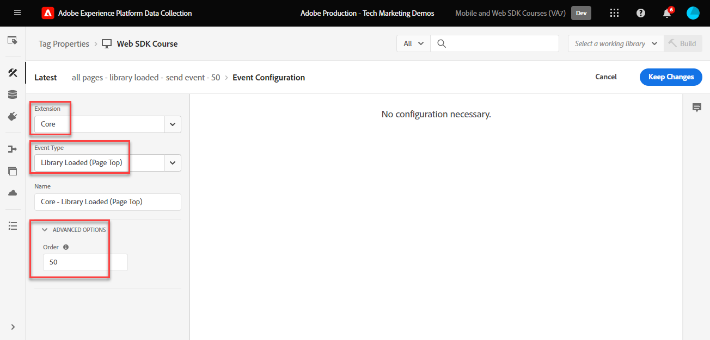

# Tagregels maken

Leer hoe u gebeurtenissen naar de Adobe Experience Platform Edge Network kunt verzenden met uw XDM-object aan de hand van tagregels. Een labelregel is een combinatie van gebeurtenissen, voorwaarden en handelingen die de eigenschap van de tag opgeeft iets te doen. Met het Web SDK van het Platform, worden de regels gebruikt om gebeurtenissen naar Platform Edge Network met de juiste gegevens te verzenden.

## Leerdoelstellingen

Aan het einde van deze les kunt u het volgende doen:

* Een naamgevingsconventie gebruiken voor het beheer van regels binnen tags
* Een gebeurtenis verzenden met XDM-velden met de acties Variabele bijwerken en Gebeurtenis verzenden
* Meerdere sets XDM-velden stapelen over meerdere regels
* Afzonderlijke of volledige arraygegevenselementen toewijzen aan het XDM-object
* Een labelregel publiceren naar een ontwikkelingsbibliotheek

## Vereisten

U bent vertrouwd met de markeringen van de Inzameling van Gegevens en de [ de demomoeplaats van de Luma ](https://newluma.enablementadobe.com) en hebt de vorige lessen in het leerprogramma voltooid:

* [Een XDM-schema configureren](configure-schemas.md)
* [Naamruimte configureren](configure-identities.md)
* [Een gegevensstroom configureren](configure-datastream.md)
* [Web SDK-extensie installeren](install-web-sdk.md)
* [Gegevenselementen maken](create-data-elements.md)
* [Identiteiten maken](create-identities.md)

## Naamgevingsconventies

Als u regels in tags wilt beheren, kunt u het beste een standaardnaamgevingsconventie volgen. In deze zelfstudie wordt een naamgevingsconventie gebruikt die uit vijf delen bestaat:

* [**plaats**] - [**gebeurtenis**] - [**doel**] - [**orde**]

waar;

1. **plaats** is de pagina of de pagina&#39;s op de plaats waar de regel in brand steekt
1. **gebeurtenis** is de trekker voor de regel
1. **doel** is de belangrijkste actie die door de regel wordt uitgevoerd
1. **orde** is de orde waarin de regel met betrekking tot andere regels zou moeten in brand steken
<!-- minor update -->

## Extensie Adobe Client Data Layer toevoegen

De Luma-website gebruikt een gebeurtenisgestuurde gegevenslaag met de naam Adobe Client Data Layer (ACDL). Wanneer een gebeurtenis plaatsvindt, wordt deze in de array `adobeDataLayer` geduwd. We zullen deze gebeurtenissen gebruiken om onze regels op te stellen, hoewel er veel opties zijn die buiten de box vallen.

1. Ga naar **[!UICONTROL Extensions]**
1. Filteren naar **[!UICONTROL Adobe Client Data Layer]**
1. Selecteren **[!UICONTROL Install]**

   

1. De standaardinstellingen behouden
1. Selecteren **[!UICONTROL Save]**

## Tagregels maken

In tags worden regels gebruikt om handelingen (aanroepen naar brand) onder verschillende omstandigheden uit te voeren. De de etikettenuitbreiding van SDK van het Web van het Platform omvat twee acties die in regels worden gebruikt:

* **[!UICONTROL Update variable]** wijst gegevenselementen aan uw XDM of gegevensvariabelen toe
* **[!UICONTROL Send Event]** verzendt de gegevens naar Experience Platform Edge Network

In de rest van deze les:

1. Gebruik de handeling **[!UICONTROL Update variable]** om een &quot;globale configuratie&quot; van XDM-velden te definiëren.

1. Gebruik de handeling **[!UICONTROL Update variable]** die onze &quot;globale configuratie&quot; overschrijft en onder bepaalde omstandigheden extra XDM-velden toevoegt (bijvoorbeeld productdetails toevoegen op productpagina&#39;s).

1. Gebruik de handeling **[!UICONTROL Send Event]** om alle gegevens te verzenden die we naar Adobe Experience Platform Edge Network willen sturen.

Al deze regels zullen behoorlijk gebruikend de &quot;[!UICONTROL order]&quot;optie worden gesequenced.

Deze video geeft een overzicht van het proces:

>[!VIDEO](https://video.tv.adobe.com/v/3427710/?learn=on&enablevpops)

### Algemene configuratievelden

Een labelregel maken voor de globale XDM-velden:

1. Open de eigenschap tag die u voor deze zelfstudie gebruikt

1. Ga naar **[!UICONTROL Rules]** in de linkernavigatie

1. Selecteer de knop **[!UICONTROL Create New Rule]**

   

1. Naam van de regel `all pages - adobeDataLayer push - set global variables - 1`

1. Selecteer in de sectie **[!UICONTROL Events]** de optie **[!UICONTROL Add]**

    toe

1. Gebruik de extensie **[!UICONTROL Adobe Client Data Layer]** en selecteer **[!UICONTROL Data Pushed]** als **[!UICONTROL Event Type]**

1. Selecteer **[!UICONTROL Advanced]** vervolgkeuzelijst en voer `1` in als de **[!UICONTROL Order]**

   >[!NOTE]
   >
   > Hoe lager de volgordenummer, des te eerder de waarde wordt uitgevoerd. Daarom geven wij onze &quot;globale configuratie&quot;een laag orde aantal.

1. Luisteren naar **[!UICONTROL All Events]**
1. Selecteer **[!UICONTROL Keep Changes]** om terug te keren naar het hoofdregelscherm
   

1. Selecteer in de sectie **[!UICONTROL Actions]** de optie **[!UICONTROL Add]**

1. Als **[!UICONTROL Extension]** selecteert u **[!UICONTROL Adobe Experience Platform Web SDK]**

1. Als **[!UICONTROL Action Type]** selecteert u **[!UICONTROL Update variable]**

1. Als **[!UICONTROL Data element]**, selecteer `xdm.variable.content` u in [ creeerde gegevenselementen ](create-data-elements.md) les

   

1. Geef nu de XDM-velden op door deze aan de juiste waarden toe te wijzen:

   | XDM-veld | Toewijzen aan |
   |---|---|
   | `eventType` | `Web Webpagedetails Page Views` (typ eerst de gesuggereerde waarden) |
   | `identityMap` | `Identity Map` data-element |
   | `web.webPageDetails.name` | `Page Name` data-element |
   | `web.webPageDetails.pageViews.value` | `1` |

   >[!TIP]
   >
   > XDM gebieden zullen niet in het netwerkverzoek worden omvat als het gegevenselement ongeldig is. Wanneer de gebruiker niet wordt geverifieerd en het gegevenselement `Identity Map` null is, wordt het object `identityMap` dus niet verzonden. Daarom kunnen we het definiëren in onze &quot;mondiale configuratie&quot;.

   >[!TIP]
   >
   > Hoewel Adobe Analytics een baken niet hoeft te verwerken als paginaweergave als `eventType` is ingesteld op `web.webpagedetails.pageViews` of `web.webPageDetails.pageViews.value` , is het handig om over een standaardmanier te beschikken om een paginaweergave aan te geven voor andere downstreamtoepassingen.

1. Als u klaar bent, ziet uw `XDM Variable` er ongeveer zo uit. Let op hoe de gevulde en gedeeltelijk gevulde velden worden aangeduid met de blauwe cirkels:
   
1. Selecteer **[!UICONTROL Keep Changes]** en **[!UICONTROL Save]** vervolgens de regel in het volgende scherm om de regel te voltooien

### Productpaginavelden

Start nu **[!UICONTROL Update variable]** in extra, gerangschikte regels om het XDM-object te verrijken voordat u het naar [!UICONTROL Platform Edge Network] verzendt.

>[!TIP]
>
>De regelvolgorde bepaalt welke regel het eerst wordt uitgevoerd wanneer een gebeurtenis wordt geactiveerd. Als twee regels hetzelfde gebeurtenistype hebben, wordt eerst de regel met het laagste getal uitgevoerd.
> 

Eerst volgt u de productweergaven op de pagina met productdetails van Luma:

1. Selecteren **[!UICONTROL Add Rule]**
1. Naam geven [!UICONTROL `product detail pages - adobeDataLayer push - set product details variables - 20`]
1. Selecteer het  onder Gebeurtenis om een nieuwe trigger toe te voegen
1. Onder **[!UICONTROL Extension]** selecteert u **[!UICONTROL Adobe Client Data Layer]**
1. Onder **[!UICONTROL Event Type]** selecteert u **[!UICONTROL Data Pushed]**
1. Selecteer deze optie om **[!UICONTROL Advanced Options]** te openen en typ in `20` . Deze ordewaarde verzekert de regellooppas _na_ de globale veranderingsregel.
1. Luisteren naar een **[!UICONTROL Specific Event]**
1. Voer `productView` in als de **[!UICONTROL Event / Key to register for]**
1. Selecteren **[!UICONTROL Keep changes]**

   

1. Onder **[!UICONTROL Actions]** select **[!UICONTROL Add]**
1. Extensie **[!UICONTROL Adobe Experience Platform Web SDK]** selecteren
1. **[!UICONTROL Action Type]** selecteren als **[!UICONTROL Update variable]**
1. Selecteer `XDM Variable` als de **[!UICONTROL Data element]**
1. Deze XDM-velden toewijzen aan de juiste waarden:

   | XDM-veld | Toewijzen aan |
   |---|---|
   | `eventType` | `Commerce Product Views` (typ eerst de gesuggereerde waarden) |
   | `commerce.productViews.value` | `1` |
   | `productListItems.name` | `Ecommerce Product Name` (Selecteer eerst **[!UICONTROL Provide individual items]** en **[!UICONTROL Add Item]** ) |
   | `productListItems.sku` | `Ecommerce Product Id` |

1. Selecteren **[!UICONTROL Keep Changes]**

1. Selecteer **[!UICONTROL Save]** om de regel op te slaan

   >[!NOTE]
   >
   >Omdat deze regel een hogere volgorde heeft, overschrijft deze de `eventType` die is ingesteld in de regel &quot;globale configuratie&quot;. `eventType` kan slechts één waarde bevatten en we raden u aan deze waarde in te stellen met de meest waardevolle gebeurtenis.

   >[!TIP]
   >
   >Als u commerce.productViews.value=1 instelt in XDM, wordt automatisch toegewezen aan de gebeurtenis `prodView` in Analytics

### Kaarten weergeven

U kunt een volledige array toewijzen aan een XDM-object, mits de array overeenkomt met de indeling van het XDM-schema. Het aangepaste element met codegegevens `Ecommerce Cart Products` dat u eerder hebt gemaakt, doorloopt het `adobeDataLayer.ecommerce.cart.items` gegevenslaagobject op de Luma-website en zet dit om in de vereiste indeling van het `productListItems` -object van het XDM-schema.

Zie de vergelijking hieronder van de gegevenslaag van de Luminasite (links) met het vertaalde gegevenselement (rechts) voor illustratie:

Vergelijk het gegevenselement met de `productListItems` -structuur (hint, it should match).

>[!IMPORTANT]
>
>Numerieke variabelen worden omgezet met tekenreekswaarden in de gegevenslaag, zoals `price` en `qty` , die opnieuw worden opgemaakt naar getallen in het gegevenselement. Deze formaatvereisten zijn belangrijk voor gegevensintegriteit in Platform en worden bepaald tijdens [ vormen schema&#39;s ](configure-schemas.md) stap. In het voorbeeld gebruikt **[!UICONTROL quantity]** het gegevenstype **[!UICONTROL Integer]** .
> 

Laten we nu onze array toewijzen aan het XDM-object:

1. Een nieuwe regel maken met de naam `cart page - adobeDataLayer push - set cart variables - 20`
1. Selecteer het  onder Gebeurtenis om een nieuwe trigger toe te voegen
1. Onder **[!UICONTROL Extension]** selecteert u **[!UICONTROL Adobe Client Data Layer]**
1. Onder **[!UICONTROL Event Type]** selecteert u **[!UICONTROL Data Pushed]**
1. Selecteer deze optie om **[!UICONTROL Advanced Options]** te openen en typ in `20` . Deze ordewaarde verzekert de regellooppas _na_ de globale veranderingsregel.
1. Luisteren naar een **[!UICONTROL Specific Event]**
1. Voer `cartView` in als de **[!UICONTROL Event / Key to register for]**
1. Selecteren **[!UICONTROL Keep Changes]**

   

1. Onder **[!UICONTROL Actions]** select **[!UICONTROL Add]**
1. Extensie **[!UICONTROL Adobe Experience Platform Web SDK]** selecteren
1. **[!UICONTROL Action Type]** selecteren als **[!UICONTROL Update variable]**
1. Selecteer `XDM Variable` als de **[!UICONTROL Data element]**
1. Deze XDM-velden toewijzen aan de juiste waarden:

   | XDM-veld | Toewijzen aan |
   |---|---|
   | `eventType` | `Commerce Product List (Cart) Views` (typ eerst de gesuggereerde waarden) |
   | `commerce.productListViews.value` | `1` |
   | `productListItems.name` | `Ecommerce Product Name` (Selecteer eerst **[!UICONTROL Provide individual items]** en **[!UICONTROL Add Item]** ) |
   | `productListItems.sku` | `Ecommerce Product Id` |

   >[!TIP]
   >
   >Door commerce.productListViews.value=1 in XDM in te stellen, wordt automatisch toegewezen aan de gebeurtenis `scView` in Analytics

1. Selecteren `eventType` en instellen op `commerce.productListViews`

1. Omlaag schuiven naar en array selecteren **[!UICONTROL productListItems]**

1. Selecteren **[!UICONTROL Provide entire array]**

1. Toewijzen aan gegevenselement **`cart.productInfo`**

1. Selecteren **[!UICONTROL Keep Changes]**

1. Selecteer **[!UICONTROL Save]** om de regel op te slaan

Maak twee andere regels voor afhandeling en aankoop volgens hetzelfde patroon, met de onderstaande verschillen:

**Naam van de Regel**: `ecommerce  - library loaded - set checkout variables - 20`

1. **[!UICONTROL Condition]**: /content/luma/us/en/user/checkout.html
1. `eventType` instellen op `commerce.checkouts`
1. `commerce.checkout.value` instellen op `1`

   >[!TIP]
   >
   >Dit is gelijk aan het instellen van de gebeurtenis `scCheckout` in Analytics

**Naam van de Regel**: `ecommerce - library loaded - set purchase variables -  20`

1. **[!UICONTROL Condition]**: /content/luma/us/en/user/checkout/order/thank-you.html
1. `eventType` instellen op `commerce.purchases`
1. `commerce.purchases.value` instellen op `1`

   >[!TIP]
   >
   >Dit is gelijk aan het instellen van de gebeurtenis `purchase` in Analytics

1. `commerce.order.purchaseID` instellen op het gegevenselement `cart.orderId`
1. Stel `commerce.order.currencyCode` in op de hardcoded waarde `USD`

   

   >[!TIP]
   >
   >Dit is gelijk aan het instellen van `s.purchaseID` - en `s.currencyCode` -variabelen in Analytics

1. Omlaag schuiven naar en array selecteren **[!UICONTROL productListItems]**
1. Selecteren **[!UICONTROL Provide entire array]**
1. Toewijzen aan gegevenselement **`cart.productInfo.purchase`**
1. Selecteren **[!UICONTROL Keep Changes]**
1. Selecteren **[!UICONTROL Save]**

Als u klaar bent, worden de volgende regels gemaakt.

### Gebeurtenisregel verzenden

Nu u de variabelen hebt ingesteld, kunt u de regel maken om het volledige XDM-object naar Platform Edge Network te verzenden met de handeling **[!UICONTROL Send event]** .

1. Selecteer aan de rechterkant **[!UICONTROL Add Rule]** om een andere regel te maken

1. Naam van de regel `all pages - library loaded - send event - 50`

1. Selecteer in de sectie **[!UICONTROL Events]** de optie **[!UICONTROL Add]**

1. Gebruik **[!UICONTROL Core Extension]** en selecteer `Library Loaded (Page Top)` als **[!UICONTROL Event Type]**

1. Selecteer **[!UICONTROL Advanced]** dropdown en ga `50` in **[!UICONTROL Order]** in. Zo zorgt u ervoor dat deze regel wordt geactiveerd na alle andere regels die u hebt geconfigureerd (met `1` of `20` als hun [!UICONTROL Order] ).

1. Selecteer **[!UICONTROL Keep Changes]** om terug te keren naar het hoofdregelscherm
   

1. Selecteer in de sectie **[!UICONTROL Actions]** de optie **[!UICONTROL Add]**

1. Als **[!UICONTROL Extension]** selecteert u **[!UICONTROL Adobe Experience Platform Web SDK]**

1. Als **[!UICONTROL Action Type]** selecteert u **[!UICONTROL Send event]**

1. Als **[!UICONTROL XDM]** selecteert u het gegevenselement `xdm.variable.content` dat in de vorige les is gemaakt

1. Selecteer **[!UICONTROL Keep Changes]** om terug te keren naar het hoofdregelscherm

    toe
1. Selecteer **[!UICONTROL Save]** om de regel op te slaan

   

## De regels in een bibliotheek publiceren

Vervolgens publiceert u de regel naar de ontwikkelomgeving, zodat u kunt controleren of deze werkt.

Een bibliotheek maken:

1. Ga naar **[!UICONTROL Publishing Flow]** in de linkernavigatie

1. Selecteren **[!UICONTROL Add Library]**

    toe
1. Voer bij **[!UICONTROL Name]** `Luma Web SDK Tutorial` in
1. Selecteer **[!UICONTROL Environment]** voor `Development`
1. Selecteren **[!UICONTROL Add All Changed Resources]**

   >[!NOTE]
   >
   >    Alle tagcomponenten die in vorige lessen zijn gemaakt, worden weergegeven. De extensie Core bevat de basis-JavaScript die door alle eigenschappen van webtags wordt vereist.

1. Selecteren **[!UICONTROL Save & Build for Development]**

   

Het kan enkele minuten duren voordat de bibliotheek is gemaakt en wanneer deze is voltooid, wordt links van de naam van de bibliotheek een groene stip weergegeven:

Zoals u op het [!UICONTROL Publishing Flow] scherm kunt zien, is er veel meer aan het het publiceren proces, dat voorbij het werkingsgebied van deze zelfstudie is. Deze zelfstudie gebruikt slechts één bibliotheek in uw ontwikkelomgeving.

U kunt nu de gegevens in de aanvraag valideren met de Adobe Experience Platform Debugger.

>[!NOTE]
>
>Bedankt dat je tijd hebt geïnvesteerd in het leren over Adobe Experience Platform Web SDK. Als u vragen hebt, algemene terugkoppelen wilt delen, of suggesties over toekomstige inhoud hebben, gelieve hen op deze [ Communautaire besprekingspost van Experience League te delen ](https://experienceleaguecommunities.adobe.com/t5/adobe-experience-platform-data/tutorial-discussion-implement-adobe-experience-cloud-with-web/td-p/444996)
