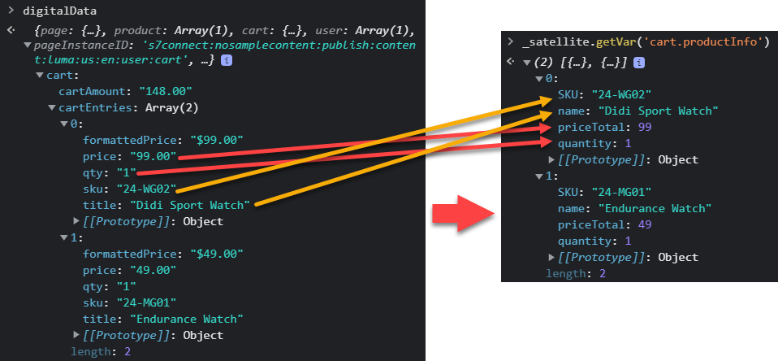

# Tagregels maken

Leer hoe u gebeurtenissen naar de Adobe Experience Platform-Edge Network kunt verzenden met uw XDM-object aan de hand van tagregels. Een labelregel is een combinatie van gebeurtenissen, voorwaarden en handelingen die de eigenschap van de tag opgeeft iets te doen. Met het Web SDK van het Platform, worden de regels gebruikt om gebeurtenissen naar de Edge Network van het Platform met de juiste gegevens te verzenden.

## Leerdoelstellingen

Aan het einde van deze les kunt u het volgende doen:

* Een naamgevingsconventie gebruiken voor het beheer van regels binnen tags
* Een gebeurtenis verzenden met XDM-velden met de acties Variabele bijwerken en Gebeurtenis verzenden
* Meerdere sets XDM-velden stapelen over meerdere regels
* Afzonderlijke of volledige arraygegevenselementen toewijzen aan het XDM-object
* Een labelregel publiceren naar een ontwikkelingsbibliotheek

## Vereisten

U bent vertrouwd met de tags voor gegevensverzameling en de [Luma-demosite](https://luma.enablementadobe.com/content/luma/us/en.html) en hebben de vorige lessen in de zelfstudie voltooid:

* [Een XDM-schema configureren](configure-schemas.md)
* [Naamruimte configureren](configure-identities.md)
* [Een gegevensstroom configureren](configure-datastream.md)
* [Web SDK-extensie installeren](install-web-sdk.md)
* [Gegevenselementen maken](create-data-elements.md)
* [Identiteiten maken](create-identities.md)

## Naamgevingsconventies

Als u regels in tags wilt beheren, kunt u het beste een standaardnaamgevingsconventie volgen. In deze zelfstudie wordt een naamgevingsconventie gebruikt die uit vijf delen bestaat:

* [**locatie**] - [**event**] - [**doel**] - [**bestellen**]

waar;

1. **locatie** is de pagina of pagina&#39;s op de plaats waar de regel wordt geactiveerd
1. **event** is de trigger voor de regel
1. **doel** is de belangrijkste handeling die door de regel wordt uitgevoerd
1. **bestellen** is de volgorde waarin de regel ten opzichte van andere regels moet worden toegepast
<!-- minor update -->

## Tagregels maken

In tags worden regels gebruikt om handelingen (aanroepen naar brand) onder verschillende omstandigheden uit te voeren. De de etikettenuitbreiding van SDK van het Web van het Platform omvat twee acties die in deze les worden gebruikt:

* **[!UICONTROL Update variable]** koppelen gegevenselementen aan eigenschappen in een XDM-object
* **[!UICONTROL Send Event]** verzendt het XDM-object naar de Edge Network Experience Platform

In de rest van deze les:

1. Maak een regel met de **[!UICONTROL Update variable]** handeling om een &quot;globale configuratie&quot; van XDM-velden te definiëren.

1. Maak aanvullende regels met de **[!UICONTROL Update variable]** actie die onze &quot;globale configuratie&quot;met voeten treedt en extra gebieden XDM onder bepaalde voorwaarden bijdragen (bijvoorbeeld, toevoegend productdetails op productpagina&#39;s).

1. Een andere regel maken met de opdracht **[!UICONTROL Send Event]** handeling, die het volledige XDM-object naar Adobe Experience Platform Edge Network verzendt.

Al deze regels zullen behoorlijk worden gesequenceerd gebruikend &quot;[!UICONTROL order]&quot;.

Deze video geeft een overzicht van het proces:

>[!VIDEO](https://video.tv.adobe.com/v/3427710/?learn=on)

### Algemene configuratievelden

Een labelregel maken voor de globale XDM-velden:

1. Open de eigenschap tag die u voor deze zelfstudie gebruikt

1. Ga naar **[!UICONTROL Rules]** in de linkernavigatie

1. Selecteer de **[!UICONTROL Create New Rule]** knop

   

1. Naam van de regel `all pages - library loaded - set global variables - 1`

1. In de **[!UICONTROL Events]** sectie, selecteert u **[!UICONTROL Add]**

   

1. Gebruik de **[!UICONTROL Core Extension]** en selecteert u **[!UICONTROL Library Loaded (Page Top)]** als de **[!UICONTROL Event Type]**

1. Selecteren **[!UICONTROL Advanced]** vervolgkeuzelijst en Enter `1` als de **[!UICONTROL Order]**

   >[!NOTE]
   >
   > Hoe lager de volgordenummer, des te eerder de waarde wordt uitgevoerd. Daarom geven wij onze &quot;globale configuratie&quot;een laag orde aantal.

1. Selecteren **[!UICONTROL Keep Changes]** om op het belangrijkste regelscherm terug te keren
   

1. In de **[!UICONTROL Actions]** sectie, selecteert u **[!UICONTROL Add]**

1. Als de **[!UICONTROL Extension]**, selecteert u **[!UICONTROL Adobe Experience Platform Web SDK]**

1. Als de **[!UICONTROL Action Type]**, selecteert u **[!UICONTROL Update variable]**

1. Als de **[!UICONTROL Data element]**, selecteert u de `xdm.variable.content` u in [Gegevenselementen maken](create-data-elements.md) les

   

Nu, kaart uw [!UICONTROL data elements] aan de [!UICONTROL schema] wordt gebruikt door uw XDM-object. U kunt toewijzen aan afzonderlijke eigenschappen of volledige objecten. In dit voorbeeld koppelt u de eigenschappen aan individuele eigenschappen:

1. Het veld eventType zoeken en selecteren

1. Voer de waarde in `web.webpagedetails.pageViews`

   >[!TIP]
   >
   > Om te begrijpen welke waarden in te vullen `eventType` veld, moet u naar de schemapagina gaan en de `eventType` veld om de voorgestelde waarden op het rechterspoor weer te geven. U kunt desgewenst ook een nieuwe waarde invoeren.
   > 

1. Zoek vervolgens de `identityMap` object in het schema en selecteer het

1. Toewijzen aan `identityMap.loginID` gegevenselement

   

   >[!TIP]
   >
   > XDM gebieden zullen niet in het netwerkverzoek worden omvat als het gegevenselement ongeldig is. Wanneer de gebruiker niet is geverifieerd en de `identityMap.loginID` data element is null, de `identityMap` object wordt niet verzonden. Daarom kunnen we het definiëren in onze &quot;mondiale configuratie&quot;.

1. Schuif omlaag totdat u de **`web`** object

1. Selecteren om te openen

1. Wijs de volgende gegevenselementen toe aan de overeenkomstige `web` XDM-variabelen

   * **`web.webPageDetials.name`** tot `%page.pageInfo.pageName%`
   * **`web.webPageDetials.server`** tot `%page.pageInfo.server%`
   * **`web.webPageDetials.siteSection`** tot `%page.pageInfo.hierarchie1%`

1. Set `web.webPageDetials.pageViews.value` tot `1`

   

   >[!TIP]
   >
   > while `eventType` instellen op `web.webpagedetails.pageViews` noch `web.webPageDetails.pageViews.value` Adobe Analytics is vereist om een baken als paginaweergave te verwerken. Het is handig om over een standaardmanier te beschikken om een paginaweergave voor andere downstreamtoepassingen aan te geven.

1. Selecteren **[!UICONTROL Keep Changes]** en vervolgens **[!UICONTROL Save]** de regel in het volgende scherm om het maken van de regel te voltooien

### Productpaginavelden

Nu gebruiken **[!UICONTROL Update variable]** in extra, gerangschikte regels om het voorwerp te verrijken XDM alvorens het te verzenden naar [!UICONTROL Platform Edge Network].

>[!TIP]
>
>De regelvolgorde bepaalt welke regel het eerst wordt uitgevoerd wanneer een gebeurtenis wordt geactiveerd. Als twee regels hetzelfde gebeurtenistype hebben, wordt eerst de regel met het laagste getal uitgevoerd.
> 

Eerst volgt u de productweergaven op de pagina met productdetails van Luma:

1. Selecteren **[!UICONTROL Add Rule]**
1. Naam geven  [!UICONTROL `ecommerce - library loaded - set product details variables - 20`]
1. Selecteer de  onder Gebeurtenis om een nieuwe trigger toe te voegen
1. Onder **[!UICONTROL Extension]**, selecteert u **[!UICONTROL Core]**
1. Onder **[!UICONTROL Event Type]**, selecteert u **[!UICONTROL Library Loaded (Page Top)]**
1. Selecteren om te openen **[!UICONTROL Advanced Options]**, typt u `20`. Deze ordewaarde verzekert de regellooppas _na_ de `all pages - library loaded - set global variables - 1` waarmee de algemene configuratie wordt ingesteld.
1. Selecteren **[!UICONTROL Keep changes]**

   

1. Onder **[!UICONTROL Conditions]**, selecteert u **[!UICONTROL Add]**
1. Verlaten **[!UICONTROL Logic Type]** als **[!UICONTROL Regular]**
1. Verlaten **[!UICONTROL Extension]** als **[!UICONTROL Core]**
1. Selecteren **[!UICONTROL Condition Type]** als **[!UICONTROL Path Without Query String]**
1. Schakel rechts de optie **[!UICONTROL Regex]** schakelen
1. Onder **[!UICONTROL path equals]** set `/products/`. Voor de Luma-demo-site zorgt deze ervoor dat de regel alleen op productpagina&#39;s wordt geactiveerd
1. Selecteren **[!UICONTROL Keep Changes]**

   

1. Onder **[!UICONTROL Actions]** selecteren **[!UICONTROL Add]**
1. Selecteren **[!UICONTROL Adobe Experience Platform Web SDK]** extension
1. Selecteren **[!UICONTROL Action Type]** als **[!UICONTROL Update variable]**
1. Selecteren `xdm.variable.content` als de **[!UICONTROL Data element]**
1. Omlaag schuiven naar de `commerce` object
1. Open de **[!UICONTROL productViews]** object en set **[!UICONTROL value]** tot `1`

   

   >[!TIP]
   >
   >Het plaatsen van commerce.productViews.value=1 in XDM brengt automatisch aan `prodView` gebeurtenis in Analytics

1. Omlaag schuiven naar `eventType` en stel deze in op `commerce.productViews`

   >[!NOTE]
   >
   >Omdat deze regel een hogere orde heeft, zal het het `eventType` ingesteld in de regel &quot;Algemene configuratie&quot;. `eventType` kan slechts één waarde bevatten en wij adviseren het plaatsen met de waardevolste gebeurtenis.

1. Omlaag schuiven naar en selecteren `productListItems` array
1. Selecteren **[!UICONTROL Provide individual items]**
1. Selecteren **[!UICONTROL Add Item]**

   

   >[!CAUTION]
   >
   >De **`productListItems`** is een `array` gegevenstype zodat verwacht het gegevens binnen als inzameling van elementen komen. Vanwege de gegevenslaagstructuur van de demo-site van Luma en omdat het alleen mogelijk is om één product tegelijk weer te geven op de Luministsite, voegt u afzonderlijke items toe. Afhankelijk van de structuur van de gegevenslaag kunt u bij de implementatie op uw eigen website mogelijk een volledige array opgeven.

1. Selecteren om te openen **[!UICONTROL Item 1]**
1. Kaart **`productListItems.item1.SKU`** tot `%product.productInfo.sku%`

   

1. Selecteren **[!UICONTROL Keep Changes]**

1. Selecteren **[!UICONTROL Save]** om de regel op te slaan

### Kaarten weergeven

U kunt een volledige array toewijzen aan een XDM-object, mits de array overeenkomt met de indeling van het XDM-schema. Het gegevenselement van de aangepaste code `cart.productInfo` u hebt eerdere lussen gemaakt via de `digitalData.cart.cartEntries` gegevenslaagobject op Luma en zet dit om in de vereiste indeling van het `productListItems` object van het XDM-schema.

Zie de vergelijking hieronder van de gegevenslaag van de Luminasite (links) met het vertaalde gegevenselement (rechts) voor illustratie:

Vergelijk het gegevenselement met de `productListItems` structuur (hint, it should match).

>[!IMPORTANT]
>
>Numerieke variabelen worden omgezet met tekenreekswaarden in de gegevenslaag, zoals `price` en `qty` opnieuw opgemaakt naar getallen in het gegevenselement. Deze formaatvereisten zijn belangrijk voor gegevensintegriteit in Platform en worden bepaald tijdens [vormen schema&#39;s](configure-schemas.md) stap. In het voorbeeld: **[!UICONTROL quantity]** gebruikt de **[!UICONTROL Integer]** gegevenstype.
> 

Laten we nu onze array toewijzen aan het XDM-object:

1. Een nieuwe regel maken met de naam `ecommerce - library loaded - set shopping cart variables - 20`
1. Selecteer de  onder Gebeurtenis om een nieuwe trigger toe te voegen
1. Onder **[!UICONTROL Extension]**, selecteert u **[!UICONTROL Core]**
1. Onder **[!UICONTROL Event Type]**, selecteert u **[!UICONTROL Library Loaded (Page Top)]**
1. Selecteren om te openen **[!UICONTROL Advanced Options]**, typt u `20`
1. Selecteren **[!UICONTROL Keep Changes]**

   

1. Onder **[!UICONTROL Conditions]**, selecteert u **[!UICONTROL Add]**
1. Verlaten **[!UICONTROL Logic Type]** als **[!UICONTROL Regular]**
1. Verlaten **[!UICONTROL Extensions]** als **[!UICONTROL Core]**
1. Selecteren **[!UICONTROL Condition Type]** als **[!UICONTROL Path Without Query String]**
1. Rechts **niet** de **[!UICONTROL Regex]** schakelen
1. Onder **[!UICONTROL path equals]** set `/content/luma/us/en/user/cart.html`. Voor de demo-site Luma zorgt deze optie ervoor dat de regel alleen triggers op de cartpagina bevat
1. Selecteren **[!UICONTROL Keep Changes]**

   

1. Onder **[!UICONTROL Actions]** selecteren **[!UICONTROL Add]**
1. Selecteren **[!UICONTROL Adobe Experience Platform Web SDK]** extension
1. Selecteren **[!UICONTROL Action Type]** als **[!UICONTROL Update variable]**
1. Selecteren `xdm.variable.content` als de **[!UICONTROL Data element]**
1. Omlaag schuiven naar de `commerce` en selecteert u deze om het te openen.
1. Open de **[!UICONTROL productListViews]** object en set **[!UICONTROL value]** tot `1`

   

   >[!TIP]
   >
   >Het plaatsen van commerce.productListViews.value=1 in XDM brengt automatisch aan toe `scView` gebeurtenis in Analytics

1. Selecteren `eventType` en instellen op `commerce.productListViews`

1. Omlaag schuiven naar en selecteren **[!UICONTROL productListItems]** array

1. Selecteren **[!UICONTROL Provide entire array]**

1. Toewijzen aan **`cart.productInfo`** gegevenselement

1. Selecteren **[!UICONTROL Keep Changes]**

1. Selecteren **[!UICONTROL Save]** om de regel op te slaan

Maak twee andere regels voor afhandeling en aankoop volgens hetzelfde patroon, met de onderstaande verschillen:

**Naam van regel**: `ecommerce  - library loaded - set checkout variables - 20`

1. **[!UICONTROL Condition]**: /content/luma/us/en/user/checkout.html
1. Set `eventType` tot `commerce.checkouts`
1. Set `commerce.checkout.value` tot `1`

   >[!TIP]
   >
   >Dit is gelijk aan de instelling `scCheckout` gebeurtenis in Analytics

**Naam van regel**: `ecommerce - library loaded - set purchase variables -  20`

1. **[!UICONTROL Condition]**: /content/luma/us/en/user/checkout/order/thank-you.html
1. Set `eventType` tot `commerce.purchases`
1. Set `commerce.purchases.value` tot `1`

   >[!TIP]
   >
   >Dit is gelijk aan de instelling `purchase` gebeurtenis in Analytics

1. Set `commerce.order.purchaseID` aan de `cart.orderId` gegevenselement
1. Set `commerce.order.currencyCode` op de hardcoderingswaarde `USD`

   

   >[!TIP]
   >
   >Dit is gelijk aan de instelling `s.purchaseID` en `s.currencyCode` variabelen in Analytics

1. Omlaag schuiven naar en selecteren **[!UICONTROL productListItems]** array
1. Selecteren **[!UICONTROL Provide entire array]**
1. Toewijzen aan **`cart.productInfo.purchase`** gegevenselement
1. Selecteren **[!UICONTROL Keep Changes]**
1. Selecteren **[!UICONTROL Save]**

Als u klaar bent, worden de volgende regels gemaakt.

### Gebeurtenisregel verzenden

Nu u de variabelen hebt ingesteld, kunt u de regel maken om het volledige XDM-object naar Platform Edge Network te verzenden met de **[!UICONTROL Send event]** handeling.

1. Selecteer rechts **[!UICONTROL Add Rule]** om een andere regel te creëren

1. Naam van de regel `all pages - library loaded - send event - 50`

1. In de **[!UICONTROL Events]** sectie, selecteert u **[!UICONTROL Add]**

1. Gebruik de **[!UICONTROL Core Extension]** en selecteert u `Library Loaded (Page Top)` als de **[!UICONTROL Event Type]**

1. Selecteren **[!UICONTROL Advanced]** vervolgkeuzelijst en Enter `50` in **[!UICONTROL Order]**. Dit zal deze regel na alle andere regels verzekeren u hebt gevormd (die had `1` of `20` als [!UICONTROL Order]).

1. Selecteren **[!UICONTROL Keep Changes]** om op het belangrijkste regelscherm terug te keren
   

1. In de **[!UICONTROL Actions]** sectie, selecteert u **[!UICONTROL Add]**

1. Als de **[!UICONTROL Extension]**, selecteert u **[!UICONTROL Adobe Experience Platform Web SDK]**

1. Als de  **[!UICONTROL Action Type]**, selecteert u **[!UICONTROL Send event]**

1. Als de **[!UICONTROL XDM]**, selecteert u de `xdm.variable.content` gegevenselement dat in de vorige les is gemaakt

1. Selecteren **[!UICONTROL Keep Changes]** om op het belangrijkste regelscherm terug te keren

   
1. Selecteren **[!UICONTROL Save]** om de regel op te slaan

   

## De regels in een bibliotheek publiceren

Vervolgens publiceert u de regel naar de ontwikkelomgeving, zodat u kunt controleren of deze werkt.

Een bibliotheek maken:

1. Ga naar **[!UICONTROL Publishing Flow]** in de linkernavigatie

1. Selecteren **[!UICONTROL Add Library]**

   
1. Voor de **[!UICONTROL Name]**, enter `Luma Web SDK Tutorial`
1. Voor de **[!UICONTROL Environment]**, selecteert u `Development`
1. Selecteren  **[!UICONTROL Add All Changed Resources]**

   >[!NOTE]
   >
   >    Alle tagcomponenten die in vorige lessen zijn gemaakt, worden weergegeven. De Core-extensie bevat de basis-JavaScript die is vereist voor alle eigenschappen van webtags.

1. Selecteren **[!UICONTROL Save & Build for Development]**

   

Het kan enkele minuten duren voordat de bibliotheek is gemaakt en wanneer deze is voltooid, wordt links van de naam van de bibliotheek een groene stip weergegeven:

Zoals u kunt zien op het tabblad [!UICONTROL Publishing Flow] scherm, is er veel meer aan het het publiceren proces, dat buiten het werkingsgebied van dit leerprogramma is. Deze zelfstudie gebruikt slechts één bibliotheek in uw ontwikkelomgeving.

U kunt nu de gegevens in de aanvraag valideren met het Adobe Experience Platform Debugger.

[Volgende ](validate-with-debugger.md)

>[!NOTE]
>
>Bedankt dat u tijd hebt geïnvesteerd in het leren over de SDK van Adobe Experience Platform Web. Als u vragen hebt, algemene feedback wilt delen of suggesties voor toekomstige inhoud hebt, kunt u deze delen over deze [Experience League Communautaire discussiestuk](https://experienceleaguecommunities.adobe.com/t5/adobe-experience-platform-data/tutorial-discussion-implement-adobe-experience-cloud-with-web/td-p/444996)
