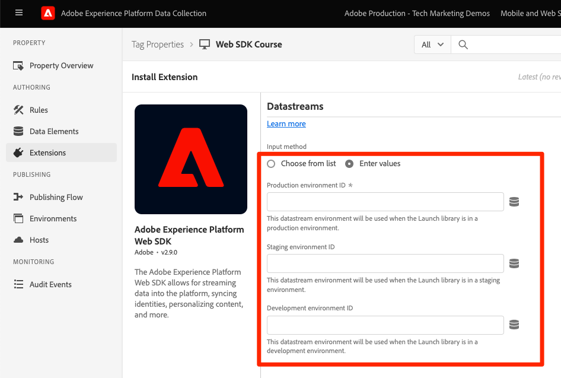

# Adobe Experience Platform Web SDK-tagextensie installeren

Leer hoe te om de de markeringsuitbreiding van SDK van het Web van het Platform in de interface van de Inzameling van Gegevens te installeren en te vormen. Deze tagextensie is de _alleen tagextensie_ vereist om gegevens te verzenden naar _alle Adobe Experience Cloud-toepassingen_, met inbegrip van [Analyse](setup-analytics.md), [Doel](setup-target.md), [Audience Manager](setup-audience-manager.md), Real-time Customer Data Platform en Journey Optimizer!

## Leerdoelstellingen

Aan het eind van deze les, zult u kunnen:

* Een tageigenschap maken in de interface voor gegevensverzameling
* De extensie van de Platform Web SDK-tag installeren
* Uw eerder gemaakte gegevensstroom toewijzen aan de extensie

## Vereisten

U moet de vorige lessen in deze zelfstudie hebben voltooid:

* [Machtigingen configureren](configure-permissions.md)
* [Een XDM-schema configureren](configure-schemas.md)
* [Naamruimte configureren](configure-identities.md)
* [Een gegevensstroom configureren](configure-datastream.md)

## Experience Platform SDK-extensie installeren

### Een eigenschap toevoegen

Eerst moet u een eigenschap tag hebben. Een eigenschap is een container voor alle JavaScript, regels en andere functies die vereist zijn om gegevens van een webpagina te verzamelen en naar verschillende locaties te verzenden.

Een nieuwe eigenschap voor tags maken voor de zelfstudie:

1. Open de [Interface voor gegevensverzameling](https://launch.adobe.com/){target=&quot;_blank&quot;}
1. Selecteren **[!UICONTROL Tags]** in de linkernavigatie
1. Selecteer **[!UICONTROL Nieuwe eigenschap]** knop
   
1. Als de **[!UICONTROL Naam]**, enter `Web SDK Course` (voeg uw naam aan het eind toe, als de veelvoudige mensen van uw bedrijf dit leerprogramma nemen)
1. Als de **[!UICONTROL Domeinen]**, enter `enablementadobe.com` (later toegelicht)
1. Selecteren **[!UICONTROL Opslaan]**
   

## De Web SDK-extensie toevoegen

Met uw schema XDM, gegevensstroom, en markeringsbezit nu gecreeerd, bent u klaar om de uitbreiding van SDK van het Web van het Platform te installeren:

1. De nieuwe eigenschap tag openen
1. Ga naar **[!UICONTROL Extensies]** > **[!UICONTROL Catalogus]**
1. Zoeken naar `Adobe Experience Platform Web SDK`
1. Selecteren **[!UICONTROL Installeren]**

   

## De SDK van het Web van het Platform van de verbinding aan uw gegevensstroom

Laat de meeste standaardinstellingen ongewijzigd en werk deze indien nodig later bij. Het enige wat u nu moet doen is de uitbreiding met uw gegevensstroom verbinden:

1. Onder **[!UICONTROL DataStreams]**, selecteert u de **[!UICONTROL Kiezen uit lijst]** invoermethode
1. Selecteer de gegevensstroom u vroeger creeerde, `Luma Web SDK`
1. Selecteren **[!UICONTROL Opslaan]**
   >[!NOTE]
   >
   > Als u uw gegevensstroom niet kunt vinden, ga naar [Een gegevensstroom configureren](configure-datastream.md) les en volg de stappen om één te creëren

   

Nu u het Web SDK van het Platform hebt geïnstalleerd en het aan de gegevensstroom geassocieerd, bent u klaar om gegevenselementen aan een voorwerp van XDM met het schema te beginnen in kaart te brengen u creeerde.

>[!NOTE]
>
>Tijdens deze zelfstudie configureert u slechts één gegevensstroom en koppelt u deze aan alle labelomgevingen (ontwikkeling, werkgebied en productie). Wanneer u SDK van het Web van het Platform op uw eigen website uitvoert, zou u een afzonderlijke gegevensstroom voor elke milieu moeten vormen en hen aan uw markeringsmilieu&#39;s in kaart brengen gebruikend **[!UICONTROL Invoermethode]** > **[!UICONTROL Waarden invoeren]**
>
>

>[!NOTE]
>
>Terwijl u geen CNAME in [!UICONTROL Edge-domein] het plaatsen in deze les, adviseert Adobe u een CNAME gebruiken wanneer u het Web SDK van het Platform op uw eigen website uitvoert. Terwijl een implementatie CNAME geen voordelen in termen van koekjesleven verstrekt, kunnen er sommige andere voordelen zijn. Deze voordelen zijn onder andere adverteerders en minder gangbare browsers die voorkomen dat gegevens worden verzonden naar domeinen die ze als trackers classificeren. In deze gevallen kunt u met een CNAME voorkomen dat de gegevensverzameling wordt onderbroken voor gebruikers die deze gereedschappen gebruiken.

Voor meer informatie over elke sectie van de extensie raadpleegt u [De extensie Adobe Experience Platform Web SDK configureren](https://experienceleague.adobe.com/docs/experience-platform/edge/extension/web-sdk-extension-configuration.html)

[Volgende: ](create-data-elements.md)

>[!NOTE]
>
>Bedankt dat u tijd hebt geïnvesteerd in het leren over Adobe Experience Platform Web SDK. Als u vragen hebt, algemene feedback wilt delen of suggesties voor toekomstige inhoud hebt, kunt u deze delen over deze [Experience League Communautaire discussiestuk](https://experienceleaguecommunities.adobe.com/t5/adobe-experience-platform-launch/tutorial-discussion-implement-adobe-experience-cloud-with-web/td-p/444996)
