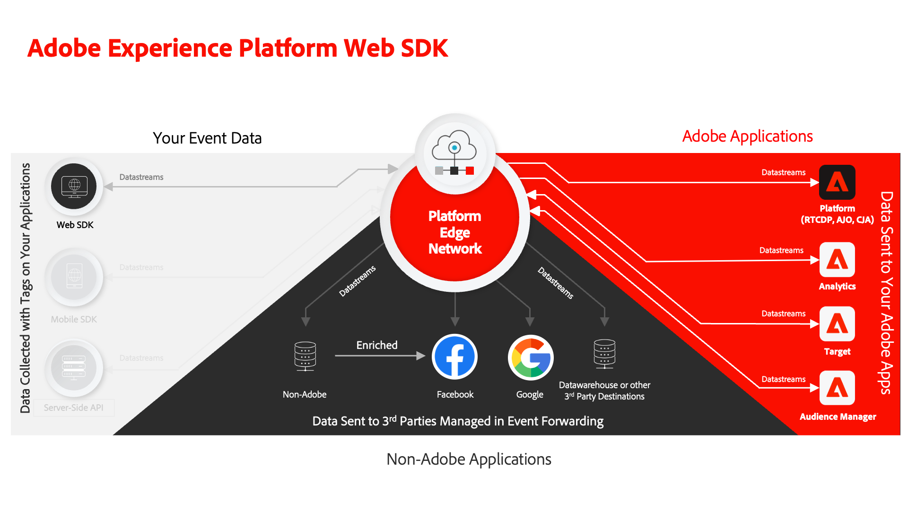

# Tutorial voor Adobe Experience Cloud met Web SDK implementeren

Leer hoe te om de toepassingen van het Experience Cloud uit te voeren gebruikend het Web SDK van Adobe Experience Platform.

Experience Platform Web SDK is een client-side JavaScript-bibliotheek waarmee klanten van Adobe Experience Cloud kunnen communiceren met zowel Adobe-toepassingen als services van derden via de Adobe Experience Platform-Edge Network. Zie [Adobe Experience Platform Web SDK - Overzicht](https://experienceleague.adobe.com/en/docs/experience-platform/edge/home) voor meer gedetailleerde informatie.

Deze zelfstudie begeleidt u door de implementatie van de Platform Web SDK op een voorbeeldwebsite in de detailhandel met de naam Luma. De [Luminantiesite](https://luma.enablementadobe.com/content/luma/us/en.html) heeft een rijke gegevenslaag en functionaliteit die u een realistische implementatie laat bouwen. Voor deze zelfstudie:

* Maak uw eigen eigenschap voor tags in uw eigen account met een Platform Web SDK-implementatie voor de Luma-website.
* Vorm alle eigenschappen van de gegevensinzameling voor de implementaties van SDK van het Web zoals gegevensstromen, schema&#39;s, en identiteitsnamespaces.
* Voeg de volgende Adobe Experience Cloud-toepassingen toe:
   * **[Adobe Experience Platform](setup-experience-platform.md)** (en toepassingen die zijn gebaseerd op Platform zoals Adobe Real-time Customer Data Platform, Adobe Journey Optimizer en Adobe Customer Journey Analytics)
   * **[Adobe Analytics](setup-analytics.md)**
   * **[Adobe Audience Manager](setup-audience-manager.md)**
   * **[Adobe Target](setup-target.md)**
* Voer gebeurtenis door:sturen uit om de gegevens te verzenden die door Web SDK aan niet-Adobe bestemmingen worden verzameld.
* Valideer uw eigen implementatie van SDK van het Web van het Platform gebruikend Foutopsporing en Verzekering van het Experience Platform.

Nadat u deze zelfstudie hebt voltooid, kunt u al uw marketingtoepassingen implementeren via Platform Web SDK op uw eigen website!

>[!NOTE]
>
>Een vergelijkbare zelfstudie met meerdere oplossingen is beschikbaar voor [Mobile SDK](../tutorial-mobile-sdk/overview.md).

## Vereisten

Alle klanten van het Experience Cloud kunnen Platform Web SDK gebruiken. Het is geen vereiste om een op platform-gebaseerde toepassing zoals Real-time Customer Data Platform of Journey Optimizer vergunning te geven om Web SDK te gebruiken.

In deze lessen wordt aangenomen dat u een Adobe-account en de vereiste machtigingen hebt om de lessen te voltooien. Als niet, moet u uit naar een Beheerder van het Experience Cloud bij uw bedrijf om toegang te verkrijgen.

* Voor **Gegevensverzameling** moet u beschikken over:
   * **[!UICONTROL Platforms]**—toestemming voor **[!UICONTROL Web]** en, indien een vergunning is verleend, **[!UICONTROL Edge]**
   * **[!UICONTROL Property Rights]**—toestemming om **[!UICONTROL Approve]**, **[!UICONTROL Develop]**, **[!UICONTROL Edit Property]**, **[!UICONTROL Manage Environments]**, **[!UICONTROL Manage Extensions]**, en **[!UICONTROL Publish]**,
   * **[!UICONTROL Company Rights]**—toestemming om **[!UICONTROL Manage Properties]**

     Zie voor meer informatie over machtigingen voor tags [de documentatie](https://experienceleague.adobe.com/en/docs/experience-platform/tags/admin/user-permissions).

* Voor **Experience Platform** moet u beschikken over:

   * Toegang tot de **standaardproductie**, **&quot;Prod&quot;** sandbox.
   * Toegang tot **[!UICONTROL Manage Schemas]** en **[!UICONTROL View Schemas]** krachtens **[!UICONTROL Data Modeling]**.
   * Toegang tot **[!UICONTROL Manage Identity Namespaces]** en **[!UICONTROL View Identity Namespaces]** krachtens **[!UICONTROL Identity Management]**.
   * Toegang tot **[!UICONTROL Manage Datastreams]** en **[!UICONTROL View Datastreams]** krachtens **[!UICONTROL Data Collection]**.
   * Als u een klant bent van een toepassing op basis van een platform en de [Experience Platform instellen](setup-experience-platform.md) les, zou u ook moeten hebben:
      * Toegang tot een **ontwikkeling** sandbox.
      * Alle machtigingsitems onder **[!UICONTROL Data Management]**, en **[!UICONTROL Profile Management]**:

     De vereiste functies moeten beschikbaar zijn voor alle klanten van het Experience Cloud, zelfs als u geen klant bent van een platformgebaseerde toepassing zoals Real-Time CDP.

     Voor meer informatie over de toegangscontrole van het Platform, zie [de documentatie](https://experienceleague.adobe.com/en/docs/experience-platform/access-control/home).

* Voor het facultatieve **Adobe Analytics** les, u moet hebben [beheerdersrechten voor de instellingen van de rapportsuite, verwerkingsregels en Analysis Workspace](https://experienceleague.adobe.com/en/docs/analytics/admin/admin-console/home)

* Voor het facultatieve **Adobe Target** les, u moet hebben [Editor of fiatteur](https://experienceleague.adobe.com/docs/target/using/administer/manage-users/enterprise/properties-overview.html#section_8C425E43E5DD4111BBFC734A2B7ABC80) toegang.

* Voor het facultatieve **Audience Manager** les, moet u toegang hebben tot creeer, lees, en schrijf eigenschappen, segmenten, en bestemmingen. Raadpleeg de zelfstudie over voor meer informatie [Op rol-Gebaseerd Toegangsbeheer van Audience Manager](https://experienceleague.adobe.com/en/docs/audience-manager-learn/tutorials/setup-and-admin/user-management/setting-permissions-with-role-based-access-control).

>[!NOTE]
>
>Aangenomen wordt dat u bekend bent met ontwikkelingstalen aan de voorzijde, zoals HTML en JavaScript. U hoeft geen expert in deze talen te zijn, maar u kunt meer uit deze zelfstudie halen als u code kunt lezen en begrijpen.

## Updates

* 24 april 2024: Grote update inclusief toevoeging van Set Variable/Update Variable, split personalization and analytics request, Journey Optimizer lesssons

## De Luma-website laden

Laad de [Luma-website](https://luma.enablementadobe.com/content/luma/us/en.html){target="blank"} in een apart browsertabblad en een bladwijzer, zodat u het bestand gemakkelijk kunt laden wanneer dat tijdens de zelfstudie nodig is. U hebt geen andere aanvullende toegang tot Luma nodig dan de gehoste productiesite te kunnen laden.

{target="blank"}

Laten we beginnen!

[Volgende: ](configure-schemas.md)

>[!NOTE]
>
>Bedankt dat u tijd hebt geïnvesteerd in het leren over de SDK van Adobe Experience Platform Web. Als u vragen hebt, algemene feedback wilt delen of suggesties voor toekomstige inhoud hebt, kunt u deze delen over deze [Experience League Communautaire discussiestuk](https://experienceleaguecommunities.adobe.com/t5/adobe-experience-platform-launch/tutorial-discussion-implement-adobe-experience-cloud-with-web/td-p/444996)
