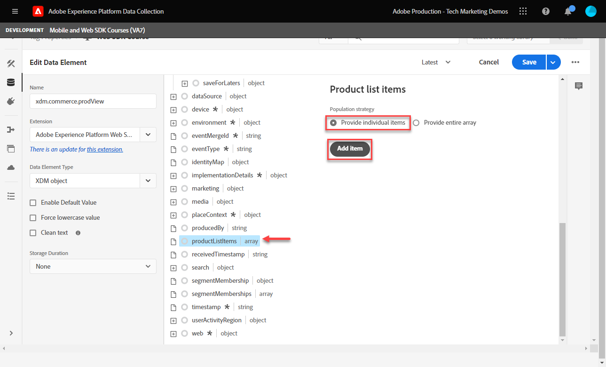

# Adobe Analytics instellen met Platform Web SDK

Meer informatie over het instellen van Adobe Analytics met [Experience Platform Web SDK](https://experienceleague.adobe.com/docs/platform-learn/data-collection/web-sdk/overview.html), maakt u labelregels om gegevens naar Adobe Analytics te verzenden en controleert u of Analytics gegevens vastlegt zoals u had verwacht.

[Adobe Analytics](https://experienceleague.adobe.com/docs/analytics.html) is een industrie-leidende toepassing die u machtigt om uw klanten als mensen te begrijpen en uw zaken met klantenintelligentie te sturen.

## Leerdoelstellingen

Aan het eind van deze les, zult u kunnen:

* Configureer een XDM-schema voor Adobe Analytics en begrijp het verschil tussen automatisch toegewezen en handmatig toegewezen XDM-variabelen voor Analytics
* Een gegevensstroom configureren om Adobe Analytics in te schakelen
* Afzonderlijke of volledige arraygegevenselementen toewijzen aan het XDM-object
* Paginaweergaven vastleggen in Adobe Analytics met het XDM-object
* Leg e-commercegegevens vast met het XDM-object voor de Adobe Analytics-productreeks
* Validatie van Adobe Analytics-variabelen wordt ingesteld met het XDM-object met behulp van Foutopsporing in Experience Platform
* Adobe Analytics-verwerkingsregels gebruiken om aangepaste variabelen in te stellen
* Valideren van gegevens wordt vastgelegd door Adobe Analytics met Real-Time rapporten

## Vereisten

U kent tags, Adobe Analytics en de [Luma-demosite](https://luma.enablementadobe.com/content/luma/us/en.html){target=&quot;_blank&quot;} aanmeldingsfunctie en functionaliteit voor winkelen.

U hebt minstens één test/dev rapportsuite-id nodig. Als u geen test/dev-rapportsuite hebt die u voor deze zelfstudie kunt gebruiken, [Maak een](https://experienceleague.adobe.com/docs/analytics/admin/manage-report-suites/new-report-suite/t-create-a-report-suite.html).

U moet alle stappen van de vorige secties in het leerprogramma hebben voltooid:

* Eerste configuratie
   * [Machtigingen configureren](configure-permissions.md)
   * [Een XDM-schema configureren](configure-schemas.md)
   * [Naamruimte configureren](configure-identities.md)
   * [Een gegevensstroom configureren](configure-datastream.md)
* Configuratie van tags
   * [Web SDK-extensie installeren](install-web-sdk.md)
   * [Gegevenselementen maken](create-data-elements.md)
   * [Een labelregel maken](create-tag-rule.md)
   * [Valideren met Adobe Experience Platform Debugger](validate-with-debugger.md)

## XDM-schema&#39;s en analytische variabelen

Gefeliciteerd! U hebt al een schema geconfigureerd dat compatibel is met Adobe Analytics in het dialoogvenster [Een schema configureren](configure-schemas.md) les!

Het uitvoeren van het Web SDK van het Platform zou zo product-agnostisch mogelijk moeten zijn. In Adobe Analytics vindt het toewijzen van eVars, props en gebeurtenissen niet plaats tijdens het maken van het schema, noch tijdens de configuratie van de tagregels zoals deze traditioneel is uitgevoerd. In plaats daarvan, wordt elk sleutel-waardepaar XDM een Variabele van de Gegevens van de Context die aan een variabele Analytics op één van twee manieren in kaart brengt:

1. Automatisch toegewezen variabelen met gereserveerde XDM-velden
1. Handmatig toegewezen variabelen met Analytics Processing Rules

Als u wilt weten welke XDM-variabelen automatisch worden toegewezen aan Adobe Analytics, raadpleegt u [Variabelen worden automatisch toegewezen in Analytics](https://experienceleague.adobe.com/docs/experience-platform/edge/data-collection/adobe-analytics/automatically-mapped-vars.html?lang=en). Elke variabele die niet automatisch is toegewezen, moet handmatig worden toegewezen.

Het schema dat in het dialoogvenster [Een schema configureren](configure-schemas.md) De les bevat een paar automatisch aan variabelen van Analytics in kaart gebrachte, zoals die in deze lijst worden geschetst:

| Automatisch toegewezen variabelen van XDM naar Analytics | Adobe Analytics-variabele |
|-------|---------|
| `identitymap.ecid.[0].id` | midden |
| `web.webPageDetails.pageViews.value` | een aanroep van de paginaweergave s.t() |
| `web.webPageDetails.name` | s.pageName |
| `web.webPageDetails.server` | s.server |
| `web.webPageDetails.siteSection` | s.channel |
| `commerce.productViews.value` | prodView |
| `commerce.productListViews.value` | scView |
| `commerce.checkouts.value` | scCheckout |
| `commerce.purchases.value` | aankoop |
| `commerce.order.currencyCode` | s.currencyCode |
| `commerce.order.purchaseID` | s.purchaseID |
| `productListItems[].SKU` | s.products=;productnaam;; (primair - zie opmerking hieronder) |
| `productListItems[].name` | s.products=;productnaam;; (fallback - zie Opmerking hieronder) |
| `productListItems[].quantity` | s.products=;;producthoeveelheid; |
| `productListItems[].priceTotal` | s.product=;;;productprijs; |

>[!NOTE]
>
>De afzonderlijke secties van de producttekenreeks Analytics worden ingesteld via verschillende XDM-variabelen onder de `productListItems` object.
>Vanaf 18 augustus 2022, `productListItems[].SKU` neemt prioriteit aan afbeelding aan de productnaam in de s.products variabele.
>De waarde die is ingesteld op `productListItems[].name` alleen aan de productnaam wordt toegewezen als `productListItems[].SKU` bestaat niet. Anders wordt de koppeling verwijderd en beschikbaar in contextgegevens.
>Stel geen lege tekenreeks of null in op  `productListItems[].SKU`. Dit heeft het ongewenste effect van afbeelding aan de productnaam in de s.products variabele.


## De gegevensstroom configureren

De SDK van het Web van het Platform verzendt gegevens van uw website naar het Netwerk van de Rand van het Platform. Uw gegevensstroom vertelt dan het Netwerk van de Rand van het Platform waar te om die gegevens door:sturen, in dit geval, welke van uw Adobe Analytics rapportreeksen.

1. Ga naar [Gegevensverzameling](https://experience.adobe.com/#/data-collection){target=&quot;blank&quot;} interface
1. Selecteer in de linkernavigatie de optie **[!UICONTROL DataStreams]**
1. Selecteer de eerder gemaakte `Luma Web SDK` datastream

   

1. Selecteren **[!UICONTROL Service toevoegen]**

   
1. Selecteren **[!UICONTROL Adobe Analytics]** als de **[!UICONTROL Service]**
1. Voer de  **[!UICONTROL ID van rapportsuite]** van uw pakket ontwikkelingsrapporten
1. Selecteren **[!UICONTROL Opslaan]**

   

   >[!TIP]
   >
   >Meer rapportsuites toevoegen door **[!UICONTROL Rapportsuite toevoegen]** is gelijk aan taggen met meerdere suite&#39;s.

>[!WARNING]
>
>In deze zelfstudie configureert u alleen de Adobe Analytics-rapportensuite voor ontwikkeling. Wanneer u gegevensstromen voor uw eigen website creeert, zou u extra gegevensstromen en rapportsuites voor uw het opvoeren en productiemilieu&#39;s creëren.


## Aanvullende gegevenselementen maken

Vang daarna extra gegevens van de de gegevenslaag van de Luma en verzend het naar het Netwerk van de Rand van het Platform. Terwijl de les zich op gemeenschappelijke vereisten van Adobe Analytics concentreert, kunnen alle gevangen gegevens gemakkelijk naar andere bestemmingen worden verzonden die op uw gegevensstroomconfiguratie worden gebaseerd. Als u bijvoorbeeld de Adobe Experience Platform-les hebt voltooid, worden de aanvullende gegevens die u in deze les vastlegt, ook naar het Platform verzonden.

### E-commercegegevenselementen maken

Tijdens de Create les van gegevenselementen, u [gemaakte JavaScript-gegevenselementen](create-data-elements.md#create-data-elements-to-capture-the-data-layer) die inhoud en identiteitsgegevens heeft vastgelegd. Nu zult u extra gegevenselementen creëren om e-commercegegevens te vangen. Omdat [Luma-demosite](https://luma.enablementadobe.com/content/luma/us/en.html){target=&quot;_blank&quot;} gebruikt verschillende structuren voor gegevenslagen voor productdetailpagina&#39;s en -producten in het winkelwagentje. Voor elk scenario moet u gegevenselementen maken. U zult sommige elementen van de douanecodegegevens moeten tot stand brengen om te pakken wat u van de de gegevenslaag van de Luma nodig hebt, die al dan niet noodzakelijk wanneer het uitvoeren op uw eigen plaats kan zijn. In dit geval moet u door een reeks winkelwagentjes bladeren om specifieke details van elk product te pakken. Gebruik de meegeleverde codefragmenten hieronder:

1. Open de eigenschap tag die u gebruikt voor de zelfstudie
1. Ga naar **[!UICONTROL Gegevenselementen]**
1. Selecteren **[!UICONTROL Gegevenselement toevoegen]**
1. Naam geven **`product.productInfo.sku`**
1. Gebruik de **[!UICONTROL Aangepaste code]** **[!UICONTROL Type gegevenselement]**
1. Selectievakjes laten staan voor **[!UICONTROL Waarde in kleine letters forceren]** en **[!UICONTROL Tekst opschonen]** uitgeschakeld
1. Verlaten `None` als de **[!UICONTROL Opslagduur]** instellen omdat deze waarde op elke pagina anders is
1. Selecteren **[!UICONTROL Editor openen]**

   

1. De volgende code kopiëren en plakken

   ```javascript
   var cart = digitalData.product;
   var cartItem;
   cart.forEach(function(item){
   cartItem = item.productInfo.sku;
   });
   return cartItem;
   ```

1. Selecteren **[!UICONTROL Opslaan]** om de aangepaste code op te slaan

   

1. Selecteren **[!UICONTROL Opslaan]** om het gegevenselement op te slaan

Voer dezelfde stappen uit om deze extra gegevenselementen te maken:

* **`product.productInfo.title`**

   ```javascript
   var cart = digitalData.product;
   var cartItem;
   cart.forEach(function(item){
   cartItem = item.productInfo.title;
   });
   return cartItem;
   ```

* **`cart.productInfo`**

   ```javascript
   var cart = digitalData.cart.cartEntries;
   var cartItem = [];
   cart.forEach(function(item, index, array){
   var qty = parseInt(item.qty);
   var price = parseInt(item.price);
   cartItem.push({
   "SKU": item.sku,
   "name":item.title,
   "quantity":qty,
   "priceTotal":price
   });
   });
   return cartItem;
   ```

Nadat u deze gegevenselementen hebt toegevoegd en de vorige elementen in het dialoogvenster [Gegevenselementen maken](create-data-elements.md) les, zou u de volgende gegevenselementen moeten hebben:

| Gegevenselementen |
-----------------------------|
| `cart.orderId` |
| `cart.productInfo` |
| `identityMap.loginID` |
| `page.pageInfo.hierarchie1` |
| `page.pageInfo.pageName` |
| `page.pageInfo.server` |
| `product.productInfo.sku` |
| `product.productInfo.title` |
| `user.profile.attributes.loggedIn` |
| `user.profile.attributes.username` |
| `xdm.content` |

>[!IMPORTANT]
>
>In deze zelfstudie maakt u voor elke gebeurtenis een ander XDM-object. Dat betekent dat u variabelen opnieuw moet toewijzen die als &quot;globaal&quot;beschikbaar voor elke hit, zoals paginanaam en identityMap worden beschouwd. U kunt [Objecten samenvoegen](https://experienceleague.adobe.com/docs/experience-platform/tags/extensions/adobe/core/overview.html#merged-objects) of gebruik [Tabellen toewijzen](https://exchange.adobe.com/experiencecloud.details.103136.mapping-table.html) om uw XDM-objecten efficiënter te beheren in een levensechte situatie. Voor deze les worden de globale variabelen beschouwd als:
>
>* **[!UICONTROL identityMap]** om de geverifieerde id vast te leggen volgens de [Gegevenselement identiteitskaarten maken](create-data-elements.md#create-identity-map-data-element) in de [Gegevenselementen maken](create-data-elements.md) les.
>* **[!UICONTROL web]** object om inhoud vast te leggen volgens de [content XDM-object](create-data-elements.md#map-content-data-elements-to-XDM-Schema-individually) in de [Gegevenselementen maken](create-data-elements.md) les over elk gegevenselement hierboven.


### Weergaven van versleutelingspagina

In de les Gegevenselementen maken [een `xdm.content` gegevenselement](create-data-elements.md#map-content-data-elements-to-xdm-schema-individually) om de afmetingen van de inhoud vast te leggen. Aangezien u nu gegevens naar Adobe Analytics verzendt, moet u ook een extra XDM gebied in kaart brengen om erop te wijzen dat een baken als de de paginamening van Analytics zou moeten worden verwerkt.

1. Open uw `xdm.content` gegevenselement
1. Omlaag schuiven en selecteren tot `web.webPageDetails`
1. Selecteer deze optie om het dialoogvenster **[!UICONTROL pageViews]** object
1. Set **[!UICONTROL value]** tot `1`
1. Selecteren [!UICONTROL **Opslaan**]

   

>[!TIP]
>
>Dit veld is gelijk aan het verzenden van een **`s.t()`** paginaweergavebaken voor Analyse met `AppMeasurement.js`. Voor een verbinding klikt baken, plaats `webInteraction.linkClicks.value` tot `1`


### De productreeks instellen

Alvorens u aan het productkoord in kaart brengt, is het belangrijk om te begrijpen er twee belangrijkste voorwerpen binnen het schema XDM zijn die voor het vangen van e-commercegegevens worden gebruikt die speciale verhoudingen met Adobe Analytics hebben:

1. De `commerce` objectsets Analytische gebeurtenissen zoals `prodView`, `scView`, en `purchase`
1. De `productListItems` objectsets Analyseafmetingen zoals `productID`.

Zie [Gegevens over handel en producten verzamelen](https://experienceleague.adobe.com/docs/experience-platform/edge/data-collection/collect-commerce-data.html?lang=en) voor meer informatie .

Het is ook belangrijk te begrijpen dat u **[!UICONTROL afzonderlijke kenmerken opgeven]** naar afzonderlijke XDM-velden of **[!UICONTROL een volledige array opgeven]** naar een XDM-object.


### Afzonderlijke kenmerken toewijzen aan een XDM-object

U kunt aan individuele variabelen in kaart brengen om gegevens op de pagina van productdetails van de Plaats van de Demo van de Luma te vangen:

1. Een **[!UICONTROL XDM-object]** **[!UICONTROL Type gegevenselement]** benoemd **`xdm.commerce.prodView`**
1. Dezelfde Platform-sandbox en hetzelfde XDM-schema selecteren als in vorige lessen
1. Open de **[!UICONTROL handel]** object
1. Open de **[!UICONTROL productViews]** object en set **[!UICONTROL value]** tot `1`

   

   >[!TIP]
   >
   >Deze stap is gelijk aan het instellen `prodView` gebeurtenis in Analytics


1. Omlaag schuiven naar en selecteren `productListItems` array
1. Selecteren **[!UICONTROL Afzonderlijke items opgeven]**
1. Selecteren **[!UICONTROL Item toevoegen]**

   

   >[!CAUTION]
   >
   >De **`productListItems`** is een `array` gegevenstype zodat verwacht het gegevens binnen als inzameling van elementen komen. Vanwege de gegevenslaagstructuur van de demo-site van Luma en omdat het alleen mogelijk is om één product tegelijk weer te geven op de Luministsite, voegt u afzonderlijke items toe. Afhankelijk van de structuur van de gegevenslaag kunt u bij de implementatie op uw eigen website mogelijk een volledige array opgeven.

1. Selecteren om te openen **[!UICONTROL Item 1]**
1. De volgende XDM-variabelen toewijzen aan gegevenselementen

   * **`productListItems.item1.SKU`** tot `%product.productInfo.sku%`
   * **`productListItems.item1.name`** tot `%product.productInfo.title%`

   

   >[!IMPORTANT]
   >
   >Voordat u dit XDM-object opslaat, moet u de variabelen &quot;global&quot; en de toename van de paginaweergave ook instellen:
   >

1. Selecteren **[!UICONTROL Opslaan]**

### Een volledige array toewijzen aan een XDM-object

Zoals eerder vermeld, gebruikt de site Luma Demo een andere gegevenslaagstructuur voor producten in het winkelwagentje. Het gegevenselement van de aangepaste code `cart.productInfo` gegevenselement u vroegere lijnen door `digitalData.cart.cartEntries` gegevenslaagobject en zet dit om in het vereiste XDM-objectschema. De nieuwe indeling **moet exact overeenkomen** het schema dat door `productListItems` object van het XDM-schema.

Zie de vergelijking hieronder van de gegevenslaag van de Luminasite (links) met het vertaalde gegevenselement (rechts) voor illustratie:


Vergelijk het gegevenselement met de `productListItems` structuur (hint, it should match).

>[!IMPORTANT]
>
>Numerieke variabelen worden omgezet met tekenreekswaarden in de gegevenslaag, zoals `price` en `qty` opnieuw opgemaakt naar getallen in het gegevenselement. Deze formaatvereisten zijn belangrijk voor gegevensintegriteit in Platform en worden bepaald tijdens [vormen schema&#39;s](configure-schemas.md) stap. In het voorbeeld: **[!UICONTROL hoeveelheid]** gebruikt de **[!UICONTROL Geheel]** gegevenstype.
> 

Nu terug naar het toewijzen van het XDM-object aan een volledige array. Maak een XDM-objectelement om producten op de basispagina vast te leggen:

1. Een **[!UICONTROL XDM-object]** **[!UICONTROL Type gegevenselement]** benoemd **`xdm.commerce.cartView`**
1. Dezelfde Platform-sandbox en hetzelfde XDM-schema selecteren als u voor deze zelfstudie gebruikt
1. Open de **[!UICONTROL handel]** object
1. Open de **[!UICONTROL productListViews]** object en set `value` tot `1`

   >[!TIP]
   >
   >Deze stap is gelijk aan het instellen `scView` gebeurtenis in Analytics

1. Omlaag schuiven naar en selecteren **[!UICONTROL productListItems]** array
1. Selecteren **[!UICONTROL Volledige array opgeven]**
1. Toewijzen aan **`cart.productInfo`** gegevenselement

   

   >[!IMPORTANT]
   >
   >Voordat u dit XDM-object opslaat, moet u de variabelen &quot;global&quot; en de toename van de paginaweergave ook instellen:
   >

1. Selecteren **[!UICONTROL Opslaan]**

Een andere maken **[!UICONTROL XDM-object]**  **[!UICONTROL Type gegevenselement]** voor afhandelingsberichten `xdm.commerce.checkout`. Deze tijd stelt de **[!UICONTROL commerce.checkouts.value]** tot `1`, kaart **[!UICONTROL productListItems]** tot **`cart.productInfo`** zoals u zojuist hebt gedaan, voegt u de variabelen &quot;global&quot; en de teller van de paginaweergave toe.

>[!TIP]
>
>Deze stap is gelijk aan het instellen `scCheckout` gebeurtenis in Analytics


Er zijn aanvullende stappen voor het vastleggen van de `purchase` gebeurtenis:

1. Een andere maken  **[!UICONTROL XDM-object]**  **[!UICONTROL Type gegevenselement]** voor afgeroepen aankopen `xdm.commerce.purchase`
1. Openen **[!UICONTROL handel]** object
1. Open de **[!UICONTROL bestellen]** object
1. Kaart **[!UICONTROL purchaseID]** aan de `cart.orderId` gegevenselement
1. Set **[!UICONTROL currencyCode]** op de hardcoderingswaarde `USD`

   

   >[!TIP]
   >
   >Dit is gelijk aan de instelling `s.purcahseID` en `s.currencyCode` variabelen in Analytics

1. Selecteer deze optie om het dialoogvenster `purchases` object en set `value` tot `1`
   >[!TIP]
   >
   >Dit is gelijk aan de instelling `purchase` gebeurtenis in Analytics

   >[!IMPORTANT]
   >
   >Voordat u dit XDM-object opslaat, moet u de variabelen &quot;global&quot; en de toename van de paginaweergave ook instellen:
   >

1. Selecteren **[!UICONTROL Opslaan]**

Aan het einde van deze stappen moeten de volgende vijf gegevenselementen van XDM-objecten worden gemaakt:

| XDM-objectgegevenselementen |
-----------------------------|
| `xdm.commerce.cartView` |
| `xdm.commerce.checkout` |
| `xdm.commerce.prodView` |
| `xdm.commerce.purchase` |
| `xdm.content` |


## Creeer extra regels voor het Web SDK van het Platform

Met de veelvoudige gemaakte elementen van XDM objecten gegevens, bent u bereid om de bakens te plaatsen gebruikend regels. In deze oefening, creeert u individuele regels per e-commercegebeurtenis en gebruiksvoorwaarden zodat de regels op de juiste pagina&#39;s in brand steken. Laten we beginnen met een Product View-gebeurtenis.

1. Selecteer in de linkernavigatie de optie **[!UICONTROL Regels]** en selecteer vervolgens **[!UICONTROL Regel toevoegen]**
1. Naam geven  [!UICONTROL `product view - library load - AA`]
1. Onder **[!UICONTROL Gebeurtenissen]**, selecteert u **[!UICONTROL Bibliotheek geladen (pagina boven)]**
1. Onder **[!UICONTROL Voorwaarden]**, selecteert u **[!UICONTROL Toevoegen]**

   

1. Verlaten **[!UICONTROL Logische typen]** als **[!UICONTROL Standaard]**
1. Verlaten **[!UICONTROL Extensies]** als **[!UICONTROL Kern]**
1. Selecteren **[!UICONTROL Type voorwaarde]** als **[!UICONTROL Pad zonder queryreeks]**
1. Schakel rechts de optie **[!UICONTROL Regex]** schakelen
1. Onder **[!UICONTROL pad is gelijk aan]** set `/products/`. Voor de Luma-demo-site zorgt deze ervoor dat de regel alleen op productpagina&#39;s wordt geactiveerd
1. Selecteren **[!UICONTROL Wijzigingen behouden]**

   

1. Onder **[!UICONTROL Handelingen]** selecteren **[!UICONTROL Toevoegen]**
1. Selecteren **[!UICONTROL Adobe Experience Platform Web SDK]** extension
1. Selecteren **[!UICONTROL Type handeling]** als **[!UICONTROL Gebeurtenis Send]**
1. De **[!UICONTROL Type]** veld bevat een vervolgkeuzelijst met waarden waaruit u kunt kiezen. Selecteer `[!UICONTROL commerce.productViews]`

   >[!TIP]
   >
   >De hier geselecteerde waarde heeft geen effect op hoe de gegevens aan Analytics worden in kaart gebracht, nochtans wordt het geadviseerd om deze variabele zorgvuldig toe te passen, aangezien het in de bouwerinterface van het segment van Adobe Experience Platform wordt gebruikt. De geselecteerde waarde kan worden gebruikt in het dialoogvenster `[!UICONTROL c.a.x.eventtype]` de variabele van contextgegevens.

1. Onder **[!UICONTROL XDM-gegevens]**, selecteert u de `[!UICONTROL xdm.commerce.prodView]` XDM-objectgegevenselement
1. Selecteren **[!UICONTROL Wijzigingen behouden]**

   

1. Uw regel moet er ongeveer als volgt uitzien. Selecteren **[!UICONTROL Opslaan]**

   


Herhaal dit voor alle andere e-commercegebeurtenissen met de volgende parameters:

**Naam van regel**: cartweergave - laden bibliotheek - AA

* **[!UICONTROL Type gebeurtenis]**: Bibliotheek geladen (pagina boven)
* **[!UICONTROL Voorwaarde]**: /content/luma/us/en/user/cart.html
* **Typ waarde onder Web SDK - Handeling verzenden**: commerce.productListViews
* **XDM-gegevens voor Web SDK - Handeling verzenden:** `%xdm.commerce.cartView%`

**Naam van regel**: uitchecken - laden bibliotheek - AA

* **[!UICONTROL Type gebeurtenis]**: Bibliotheek geladen (pagina boven)
* **[!UICONTROL Voorwaarde]** /content/luma/us/en/user/checkout.html
* **Type voor Web SDK - Handeling verzenden**: commerce.checkouts
* **XDM-gegevens voor Web SDK - Handeling verzenden:** `%xdm.commerce.checkout%`

**Naam van regel**: aankoop - laden van bibliotheek - AA

* **[!UICONTROL Type gebeurtenis]**: Bibliotheek geladen (pagina boven)
* **[!UICONTROL Voorwaarde]** /content/luma/us/en/user/checkout/order/thank-you.html
* **Type voor Web SDK - Handeling verzenden**: commerce.purchase
* **XDM-gegevens voor Web SDK - Handeling verzenden:** `%xdm.commerce.purchase%`

Als u klaar bent, worden de volgende regels gemaakt.


## Bouw uw milieu van de Ontwikkeling

Voeg uw nieuwe gegevenselementen en regels toe aan uw `Luma Web SDK Tutorial` tagbibliotheek en herstel de ontwikkelomgeving.


## Adobe Analytics for Platform Web SDK valideren

In de [Foutopsporing](validate-with-debugger.md) les, leerde u hoe te om het cliënt-kant XDM objecten baken met de Debugger van het Platform en browser ontwikkelaarsconsole te inspecteren, die aan gelijkaardig is hoe u zuivert `AppMeasurement.js` Implementatie van analysemogelijkheden. Om Analytics te bevestigen vangt correct gegevens door het Web SDK van het Platform, moet u twee stappen verder gaan:

1. Valideer hoe de gegevens door het voorwerp XDM op het Netwerk van de Rand van het Platform worden verwerkt, gebruikend de eigenschap van het Spoor van de Rand van Foutopsporing van het Experience Platform
1. Valideer hoe de gegevens door Analytics worden verwerkt gebruikend de Regels van de Verwerking en rapporten in real time.

### Rand overtrekken gebruiken

Leer hoe u met de functie Edge Trace van Foutopsporing in Experience Platform kunt controleren of Adobe Analytics de ECID, paginaweergaven, de productreeks en e-commercegebeurtenissen vastlegt.

### Experience Cloud-id-validatie

1. Ga naar de [Luma-demosite](https://luma.enablementadobe.com/content/luma/us/en.html){target=&quot;_blank&quot;} en gebruik Foutopsporing voor Experience Platforms om [schakelen van de markeringseigenschap op de site naar uw eigen ontwikkeleigenschap](validate-with-debugger.md#use-the-experience-platform-debugger-to-map-to-your-tags-property)

   >[!WARNING]
   >
   >Voordat u verdergaat, moet u zich aanmelden bij de Luministite.  Als u niet bent aangemeld, kunt u zich op de Luministensite niet uitchecken.
   >
   > 1. Selecteer bij Luma de aanmeldknop rechtsboven en gebruik de referenties **u: test@adobe.com test** voor authenticatie
   >
   > 1. U wordt automatisch omgeleid naar de [pagina Didi Sport Watch](https://luma.enablementadobe.com/content/luma/us/en/products/gear/watches/didi-sport-watch.html#24-WG02) op de volgende pagina laden


1. Als u Edge Trace wilt inschakelen, gaat u naar Foutopsporing Experience Platform en selecteert u in de linkernavigatie **[!UICONTROL Logboeken]** Selecteer vervolgens de **[!UICONTROL Rand]** en selecteert u **[!UICONTROL Verbinden]**

   

1. Het zal nu leeg zijn

   

1. Vernieuw de [pagina Didi Sport Watch](https://luma.enablementadobe.com/content/luma/us/en/products/gear/watches/didi-sport-watch.html#24-WG02) en controleer Experience Platform Debugger opnieuw, zou u gegevens moeten zien door komen. De rij die begint met **[!UICONTROL Analytics Automatic Mapping RSIDs]** is het baken van Adobe Analytics
1. Selecteer deze optie om beide opties te openen `[!UICONTROL mappedQueryParams]` vervolgkeuzelijst en tweede vervolgkeuzelijst om de variabelen Analytics weer te geven

   

   >[!TIP]
   >
   >De tweede vervolgkeuzelijst komt overeen met de ID van de Analytics-rapportsuite waarnaar u gegevens verzendt. Het zou uw eigen rapportreeks moeten aanpassen, niet in het schermafbeelding.

1. Omlaag schuiven om te zoeken `[!UICONTROL c.a.x.identitymap.ecid.[0].id]`. Het is een Context Data Variable die ECID vangt
1. Blijf omlaag schuiven totdat u de Analyse ziet `[!UICONTROL mid]` variabele. Beide id&#39;s komen overeen met de Experience Cloud-id van uw apparaat.

   

   >[!NOTE]
   >
   >Aangezien u bent aangemeld, duurt het even om de geverifieerde id te valideren `112ca06ed53d3db37e4cea49cc45b71e` voor de gebruiker **test@adobe.com** wordt ook vastgelegd in de `[!UICONTROL c.a.x.identitymap.lumacrmid.[0].id]`


### Weergaven van inhoudspagina

U gebruikt hetzelfde baken voor het valideren van weergaven van inhoudspagina&#39;s die door Analytics worden vastgelegd.

1. Zoeken naar `[!UICONTROL c.a.x.web.webpagedetails.pageviews.value]=1`. Het vertelt je een `s.t()` paginaweergavebaken wordt verzonden naar Analytics
1. Omlaag schuiven om de `[!UICONTROL gn]` variabele. Dit is de dynamische syntaxis van Analytics voor de `[!UICONTROL s.pageName]` variabele. De paginanaam wordt vastgelegd vanuit de gegevenslaag.

   

### Tekenreeks- en e-commercegebeurtenissen van het product

Aangezien u al op een productpagina staat, blijft deze oefening het zelfde Spoor gebruiken om productgegevens te bevestigen wordt gevangen door Analytics. Zowel worden het productkoord als e-commercegebeurtenissen automatisch in kaart gebracht XDM variabelen aan Analytics. Zolang u aan het juiste hebt toegewezen `productListItem` XDM variable while [configureren van een XDM-schema voor Adobe Analytics](setup-analytics.md#configure-an-xdm-schema-for-adobe-analytics), zorgt het Netwerk van de Rand van het Platform ervoor dat de gegevens aan de juiste analysevariabelen in kaart worden gebracht.

1. Eerst controleert u `Product String` is ingesteld
1. Zoeken naar `[!UICONTROL c.a.x.productlistitems.][0].[!UICONTROL sku]`. De variabele legt de gegevenselementwaarde vast die u aan de `productListItems.item1.sku` eerder in deze les
1. Omlaag schuiven om de `[!UICONTROL pl]` variabele. Dit is de dynamische syntaxis van de variabele van de producttekenreeks Analytics
1. Beide waarden komen overeen met de productnaam die beschikbaar is in de gegevenslaag

   

De behandeling Rand overtrekken `commerce` gebeurtenissen iets anders dan `productList` afmetingen. U ziet geen Variabele van de Gegevens van de Context in kaart gebracht de zelfde manier u de productnaam in kaart brengt aan `[!UICONTROL c.a.x.productlistitem.[0].name]` hierboven. In plaats daarvan wordt in het Edge Trace de uiteindelijke gebeurtenis automatisch toegewezen in de Analytics `event` variabele. Het Netwerk van de Rand van het Platform brengt het dienovereenkomstig in kaart zolang u aan juiste XDM in kaart brengt `commerce` variabele while [configureren van schema voor Adobe Analytics](setup-analytics.md#configure-an-xdm-schema-for-adobe-analytics); in dit geval `commerce.productViews.value=1`.

1. Ga terug in het venster van Foutopsporing Experience Platform en schuif omlaag naar de `[!UICONTROL event]` variable, it is ingesteld op `[!UICONTROL prodView]`

   

Valideer de overige e-commercegebeurtenissen en producttekenreeksen die zijn ingesteld voor Analytics.

1. Toevoegen [Didi Sport Watch](https://luma.enablementadobe.com/content/luma/us/en/products/gear/watches/didi-sport-watch.html#24-WG02) naar winkelwagentje
1. Ga naar de [Winkelpagina](https://luma.enablementadobe.com/content/luma/us/en/user/cart.html), controleer Edge Trace voor `[!UICONTROL events: "scView"]` en de productreeks

   

1. Ga door met de kassa, controleer Edge Trace voor `[!UICONTROL events: "scCheckout"]` en de productreeks

   

1. Vul alleen de **Voornaam** en **Achternaam** velden op het verzendformulier en selecteer **Doorgaan**. Selecteer op de volgende pagina de optie **Opdracht plaatsen**
1. Controleer Edge Trace op bevestigingspagina voor

   * Inkoopgebeurtenis ingesteld `[!UICONTROL events: "purchase"]`
   * Valuta Code variabele die wordt ingesteld `[!UICONTROL cc: "USD"]`
   * Aankoop-id ingesteld in `[!UICONTROL pi]`
   * Producttekenreeks `[!UICONTROL pl]` de productnaam, de hoeveelheid en de prijs instellen

   

## Verwerkingsregels en real-time rapporten

Nu u de bakens Analytics met het Spoor van de Rand bevestigde, kunt u de gegevens ook bevestigen door Analytics gebruikend de rapporten in real time wordt verwerkt. Alvorens u de rapporten in real time controleert, moet u de regels van de Verwerking voor Analytics vormen `props` indien nodig.

### Verwerkingsregels voor aangepaste analytische toewijzingen

In deze oefening, wijst u één variabele XDM aan een steun toe zodat kunt u in rapporten in real time bekijken. Voer dezelfde stappen uit voor elke aangepaste toewijzing die u voor een toepassing moet uitvoeren `eVar`, `prop`, `event`, of variabele toegankelijk via de Regels van de Verwerking.

1. Ga in de gebruikersinterface Analytics naar [!UICONTROL Beheer] > [!UICONTROL Admin Tools] > [!UICONTROL Rapportageopties ]
1. Selecteer de set met ontwikkelings-/testrapporten die u gebruikt voor de zelfstudie > [!UICONTROL Instellingen bewerken] > [!UICONTROL Algemeen] > [!UICONTROL Verwerkingsregels]

   

1. Een regel maken voor **[!UICONTROL Waarde overschrijven van]** `[!UICONTROL Product Name (prop1)]` tot `a.x.productlistitems.0.name`. Herinner me om uw nota toe te voegen waarom u de regel creeert en uw regeltitel noemt. Selecteren **[!UICONTROL Opslaan]**

   

   >[!IMPORTANT]
   >
   >De eerste keer u aan een verwerkingsregel in kaart brengt UI toont u niet de variabelen van contextgegevens van het voorwerp XDM. Als u een waarde wilt selecteren, slaat u Opslaan en keert u terug om te bewerken. Alle XDM-variabelen moeten nu worden weergegeven.

1. Ga naar [!UICONTROL Instellingen bewerken] >  [!UICONTROL Real-time]. Configureer alle drie met de volgende hieronder getoonde parameters, zodat u de weergaven van de inhoudspagina, de productweergaven en de aankopen kunt valideren

   

1. Herhaal de validatiestappen en u moet zien dat real-time rapporten gegevens dienovereenkomstig vullen.

   **Paginaweergaven**
   

   **Productweergaven**
   

   **Aankopen**
   

1. In de interface van de Werkruimte, creeer een lijst om de volledige e-commercesstroom van het product te bekijken u kocht

   

Zie de video voor meer informatie over het toewijzen van XDM-velden aan analytische variabelen [Web SDK-variabelen toewijzen aan Adobe Analytics](https://experienceleague.adobe.com/docs/analytics-learn/tutorials/analysis-use-cases/internal-site-search/map-web-sdk-variables-into-adobe-analytics.html).

Gefeliciteerd! Dit is het einde van de les en nu bent u klaar om Adobe Analytics met het Web SDK van het Platform voor uw eigen website uit te voeren.

[Volgende: ](setup-audience-manager.md)

>[!NOTE]
>
>Bedankt dat u tijd hebt geïnvesteerd in het leren over Adobe Experience Platform Web SDK. Als u vragen hebt, algemene feedback wilt delen of suggesties voor toekomstige inhoud hebt, kunt u deze delen over deze [Experience League Communautaire discussiestuk](https://experienceleaguecommunities.adobe.com/t5/adobe-experience-platform-launch/tutorial-discussion-implement-adobe-experience-cloud-with-web/td-p/444996)
