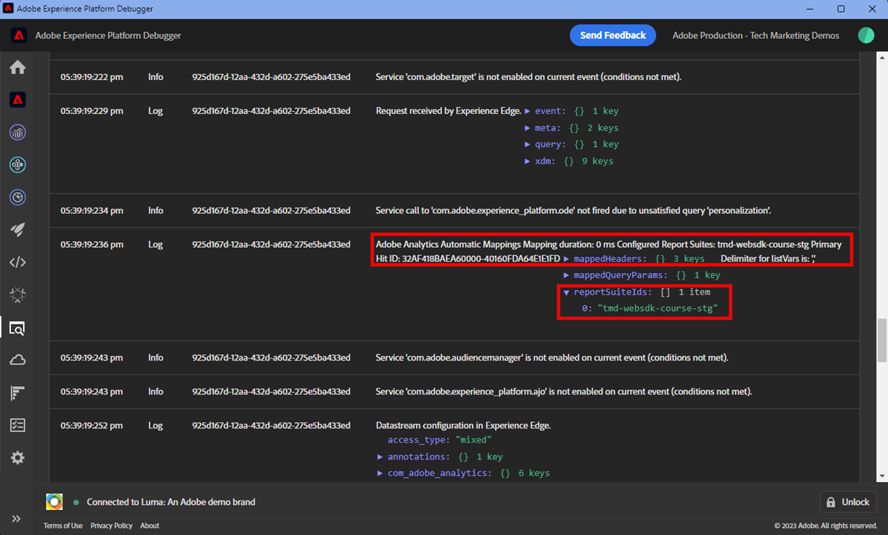

# Adobe Analytics instellen met Adobe Experience Platform Web SDK

Leer hoe te opstelling Adobe Analytics gebruikend [ SDK van het Web van Adobe Experience Platform ](https://experienceleague.adobe.com/en/docs/platform-learn/data-collection/web-sdk/overview), markeringsregels tot stand brengen om gegevens naar Adobe Analytics te verzenden, en te bevestigen dat Analytics gegevens zoals verwacht vangt.

[ Adobe Analytics ](https://experienceleague.adobe.com/en/docs/analytics) is een industrie-leidende toepassing die u machtigt om uw klanten als mensen te begrijpen en uw zaken met klantenintelligentie te sturen.

## Leerdoelstellingen

Aan het eind van deze les, zult u kunnen:

* Een gegevensstroom configureren om Adobe Analytics in te schakelen
* Weet welke standaard-XDM velden automatisch worden toegewezen aan analytische variabelen
* Analysevariabelen instellen in het gegevensobject
* Gegevens naar een andere rapportsuite verzenden door de gegevensstroom te overschrijven
* Adobe Analytics-variabelen valideren met Foutopsporing en Assurance

## Vereisten

Om deze les te voltooien, moet u eerst:

* Ben vertrouwd met en heb toegang tot Adobe Analytics.

* minstens één test/dev rapportsuite-id hebben. Als u geen test/dev- rapportreeks hebt die u voor dit leerprogramma kunt gebruiken, [ gelieve te creëren ](https://experienceleague.adobe.com/en/docs/analytics/admin/admin-tools/manage-report-suites/c-new-report-suite/t-create-a-report-suite).

* Voltooi de vroegere lessen in de Aanvankelijke secties van de Configuratie van de Configuratie en van de Markeringen van dit leerprogramma.

## De gegevensstroom configureren

Platform Web SDK verzendt gegevens van uw website naar Platform Edge Network. Uw datastream geeft vervolgens aan Platform Edge Network door aan welke Adobe Analytics-rapportages uw gegevens moeten worden verzonden.

1. Ga naar ](https://experience.adobe.com/#/data-collection){target="blank"} interface van de Inzameling van 0} Gegevens[
1. Selecteer **[!UICONTROL Datastreams]** bij de linkernavigatie
1. Selecteer de eerder gemaakte `Luma Web SDK: Development Environment` datastream

   

1. Selecteren **[!UICONTROL Add Service]**
    toe
1. Selecteer **[!UICONTROL Adobe Analytics]** als de **[!UICONTROL Service]**
1. Voer de **[!UICONTROL Report Suite ID]** van uw ontwikkelrapport-suite in
1. Selecteren **[!UICONTROL Save]**

   

   >[!TIP]
   >
   >Het toevoegen van meer rapportsuites door **[!UICONTROL Add Report Suite]** te selecteren is gelijkwaardig aan multi-suite het etiketteren.

>[!WARNING]
>
>In deze zelfstudie configureert u alleen de Adobe Analytics-rapportsuite voor uw ontwikkelomgeving. Wanneer u gegevensstromen voor uw eigen website creeert, zou u extra gegevensstromen en rapportsuites voor uw het opvoeren en productiemilieu&#39;s moeten tot stand brengen.

## Analysevariabelen instellen

Er zijn verscheidene manieren om de variabelen van de Analyse in een implementatie van SDK van het Web te plaatsen:

1. Automatische toewijzing van XDM-velden aan analytische variabelen (automatisch).
1. Stel velden in het object `data` in (aanbevolen).
1. XDM-velden toewijzen aan analytische variabelen in de verwerkingsregels voor Analytics (niet langer aanbevolen).
1. Wijs variabelen rechtstreeks toe aan Analytics in het XDM-schema (niet meer aanbevolen).

Vanaf mei 2024 hoeft u niet langer een XDM-schema te maken om Adobe Analytics met Platform Web SDK te implementeren. Het `data` voorwerp (en het `data.variable` gegevenselement u in [ creeerde creëren gegevenselementen ](create-data-elements.md) les) kan worden gebruikt om alle variabelen van de douaneanalyse te plaatsen. Het instellen van deze variabelen in het gegevensobject is vertrouwd voor bestaande klanten van Analytics, is efficiënter dan het gebruik van de interface met verwerkingsregels en voorkomt dat overbodige gegevens ruimte in realtime-klantprofielen opnemen (belangrijk als u Real-Time Customer Data Platform of Journey Optimizer hebt).

### Automatisch toegewezen velden

Veel XDM-velden worden automatisch toegewezen aan analytische variabelen. Voor de meest bijgewerkte lijst van afbeeldingen, gelieve te zien [ veranderlijke afbeelding van Analytics in de Ervaring Edge van Adobe ](https://experienceleague.adobe.com/en/docs/experience-platform/edge/data-collection/adobe-analytics/automatically-mapped-vars).

Dit komt voor als _zelfs als u geen douaneschema_ hebt bepaald. Experience Platform Web SDK verzamelt automatisch bepaalde gegevens en verzendt deze naar Platform Edge Network als XDM-velden. Web SDK leest bijvoorbeeld de URL van de huidige pagina en verzendt deze als het XDM-veld `web.webPageDetails.URL` . Dit veld wordt doorgestuurd naar Adobe Analytics en de pagina-URL-rapporten worden automatisch ingevuld in Adobe Analytics.

Als u Web SDK for Adobe Analytics met een XDM-schema implementeert, zoals in deze zelfstudie, hebben sommige XDM-velden die u hebt geïmplementeerd, automatisch toegewezen aan variabelen van Analytics, zoals in deze tabel wordt beschreven:

| Automatisch toegewezen variabelen van XDM naar Analytics | Adobe Analytics-variabele |
|-------|---------|
| `identitymap.ecid.[0].id` | midden |
| `web.webPageDetails.name` | s.pageName |
| `web.webPageDetails.server` | s.server |
| `web.webPageDetails.siteSection` | s.channel |
| `commerce.productViews.value` | prodView |
| `commerce.productListViews.value` | scView |
| `commerce.checkouts.value` | scCheckout |
| `commerce.purchases.value` | aankoop |
| `commerce.order.currencyCode` | s.currencyCode |
| `commerce.order.purchaseID` | s.purchaseID |
| `productListItems[].SKU` | s.products=;productnaam;;; (primair - zie onderstaande opmerking) |
| `productListItems[].name` | s.products=;productnaam;;; (fallback - zie onderstaande opmerking) |
| `productListItems[].quantity` | s.products=;;producthoeveelheid; |
| `productListItems[].priceTotal` | s.product=;;;productprijs; |

De afzonderlijke secties van de producttekenreeks Analytics worden ingesteld via verschillende XDM-variabelen onder het `productListItems` -object.

>[!NOTE]
>
>Vanaf 18 augustus 2022 heeft `productListItems[].SKU` prioriteit voor het toewijzen aan de productnaam in de variabele s.products.
>>De waarde die is ingesteld op `productListItems[].name` , wordt alleen aan de productnaam toegewezen als `productListItems[].SKU` niet bestaat. Anders wordt de koppeling verwijderd en beschikbaar in contextgegevens.
>>Stel geen lege tekenreeks of null in op `productListItems[].SKU` . Dit heeft het ongewenste effect van afbeelding aan de productnaam in de s.products variabele.

### Variabelen instellen in het gegevensobject

Maar hoe zit het met gebeurtenissen, props en gebeurtenissen? Het instellen van variabelen in het `data` -object is de aanbevolen manier om deze variabelen voor Analytics in te stellen met Web SDK. Als u variabelen in het gegevensobject instelt, kunnen ook alle automatisch toegewezen variabelen worden overschreven.

Ten eerste, wat is het `data` -object? In elke Web SDK-gebeurtenis kunt u twee objecten met aangepaste gegevens verzenden, het `xdm` -object en het `data` -object. Beide worden naar Platform Edge Network verzonden, maar alleen het `xdm` -object wordt naar de Experience Platform-gegevensset verzonden. Eigenschappen in het `data` -object kunnen op de Edge aan `xdm` -velden worden toegewezen met de functie Data Prep for Data Collection, maar anders niet naar Experience Platform. Dit maakt het een ideale manier om gegevens naar toepassingen als Analytics te verzenden, die niet op Experience Platform zelf zijn gebouwd.

Hier zijn de twee voorwerpen in een generische vraag van SDK van het Web:

Adobe Analytics is geconfigureerd om te zoeken naar eigenschappen in het `data.__adobe.analytics` -object en deze te gebruiken voor analytische variabelen.

Laten we eens kijken hoe dit werkt. Laten we `eVar1` en `prop1` instellen met onze paginanaam en zien hoe de door XDM toegewezen waarde kan worden overschreven

1. De labelregel openen `all pages - library loaded - set global variables - 1`
1. Een nieuwe **[!UICONTROL Action]** toevoegen
1. Extensie **[!UICONTROL Adobe Experience Platform Web SDK]** selecteren
1. **[!UICONTROL Action Type]** selecteren als **[!UICONTROL Update variable]**
1. Selecteer `data.variable` als de **[!UICONTROL Data element]**
1. Het object **[!UICONTROL analytics]** selecteren
1. `eVar1` instellen als het gegevenselement `page.pageInfo.pageName`
1. Stel `prop1` in om de waarde van `eVar1` te kopiëren
1. Als u het overschrijven van XDM-toegewezen waarden wilt testen, stelt u in de sectie **[!UICONTROL Additional property]** de paginanaam in als een statische waarde `test`
1. De regel opslaan

Nu, moeten wij het gegevensvoorwerp in onze send gebeurtenisregel omvatten.

1. De labelregel openen `all pages - library loaded - send event - 50`
1. De handeling **[!UICONTROL Send Event]** openen
1. Selecteer `data.variable` als de **[!UICONTROL Data]**
1. Selecteren **[!UICONTROL Keep Changes]**
1. Selecteren **[!UICONTROL Save]**

<!--

### Map to Analytics variables with processing rules

All fields in the XDM schema become available to Adobe Analytics as Context Data Variables with the following prefix `a.x.`. For example, `a.x.web.webinteraction.region`

In this exercise, you map one XDM variable to a prop. Follow these same steps for any custom mapping that you must do for any `eVar`, `prop`, `event`, or variable accessible via Processing Rules.

1. Go to the Analytics interface
1. Go to [!UICONTROL Admin] > [!UICONTROL Admin Tools] > [!UICONTROL Report Suites ]
1. Select the dev/test report suite that you are using for the tutorial > [!UICONTROL Edit Settings] > [!UICONTROL General] > [!UICONTROL Processing Rules]

       

1. Create a rule to **[!UICONTROL Overwrite value of]** `[!UICONTROL Product SKU (prop1)]` to `a.x.productlistitems.0.sku`. Remember to add a note about why you are creating the rule and name your rule title. Select **[!UICONTROL Save]**

       

    >[!IMPORTANT]
    >
    >The first time you map to a processing rule, the UI does not show you the context data variables from the XDM object. To fix that select any value, Save, and come back to edit. All XDM variables should now appear.

### Map to Analytics variables using the Adobe Analytics field group

An alternative to processing rules is to map to Analytics variables in the XDM schema using the `Adobe Analytics ExperienceEvent Template` field group. This approach has gained popularity because many users find it simpler than configuring processing rules, however, by increasing the size of the XDM payload it could in turn increase the profile size in other applications like Real-Time CDP.

To add the `Adobe Analytics ExperienceEvent Template` field group to your schema:

1. Open the [Data Collection](https://experience.adobe.com/#/data-collection){target="blank"} interface
1. Select **[!UICONTROL Schemas]** from the left navigation
1. Make sure you are in the sandbox you are using from the tutorial
1. Open your `Luma Web Event Data` schema
1. In the **[!UICONTROL Field Groups]** section, select **[!UICONTROL Add]**
1. Find the `Adobe Analytics ExperienceEvent Template` field group and add it to your schema

Now, set a merchandising eVar in the product string. With the `Adobe Analytics ExperienceEvent Template` field group, you are able to map variables to merchandising eVars or events within the product string. This is also known as setting **Product Syntax Merchandising**. 

1. Go back to your tag property

1. Open the rule `ecommerce - library loaded - set product details variables - 20`

1. Open the **[!UICONTROL Set Variable]** action

1. Select to open `_experience > analytics > customDimensions > eVars > eVar1`

1. Set the **[!UICONTROL Value]** to `%product.productInfo.title%`

1. Select **[!UICONTROL Keep Changes]**

    

1. Select **[!UICONTROL Save]** to save the rule

As you just saw, basically all of the Analytics variables can be set in the `Adobe Analytics ExperienceEvent Template` field group.

>[!NOTE]
>
> Notice the `_experience` object under `productListItems` > `Item 1`. Setting any variable under this [!UICONTROL object] sets Product Syntax eVars or Events.

-->

## Gegevens verzenden naar een andere rapportsuite

U kunt wijzigen naar welke Adobe Analytics-rapportsuite gegevens worden verzonden wanneer bezoekers zich op bepaalde pagina&#39;s bevinden. Dit vereist een configuratie in zowel de datastream als een regel.

### Vorm de gegevensstroom voor een de opheffing van de rapportreeks

U configureert als volgt de overschrijvingsinstelling van de Adobe Analytics-rapportsuite in de gegevensstroom:

1. De gegevensstroom openen
1. Bewerk de **[!UICONTROL Adobe Analytics]** configuratie door  menu te openen en dan **[!UICONTROL Edit]** te selecteren

   

1. Selecteren **[!UICONTROL Advanced Options]** om te openen **[!UICONTROL Report Suite Overrides]**

1. Selecteer de rapportsuites die u wilt met voeten treden. In dit geval, `Web SDK Course Dev` en `Web SDK Course Stg`

1. Selecteren **[!UICONTROL Save]**

   

### Vorm een regel voor een de opheffing van de rapportreeks

Laten wij een regel tot stand brengen om een extra vraag van de paginamening naar een verschillende rapportreeks te verzenden. Met de functie voor gegevensstroomoverschrijving kunt u de rapportsuite voor een pagina wijzigen met de handeling **[!UICONTROL Send Event]** .

1. Een nieuwe regel maken, een naam geven `homepage - library loaded - AA report suite override - 51`

1. Selecteer het plusteken onder **[!UICONTROL Event]** om een nieuwe trigger toe te voegen

1. Onder **[!UICONTROL Extension]** selecteert u **[!UICONTROL Core]**

1. Onder **[!UICONTROL Event Type]** selecteert u **[!UICONTROL Library Loaded (Page Top)]**

1. Selecteer deze optie om **[!UICONTROL Advanced Options]** te openen en typ in `51` . Dit zorgt ervoor dat de regel wordt uitgevoerd na de `all pages - library loaded - send event - 50` die de basislijn-XDM instelt met het actietype **[!UICONTROL Update variable]** .
1. Selecteren **[!UICONTROL Keep Changes]**

   

1. Onder **[!UICONTROL Conditions]** selecteert u **[!UICONTROL Add]**

1. **[!UICONTROL Logic Type]** behouden als **[!UICONTROL Regular]**

1. **[!UICONTROL Extensions]** behouden als **[!UICONTROL Core]**

1. **[!UICONTROL Condition Type]** selecteren als **[!UICONTROL Path Without Query String]**

1. Laat de schakeloptie **[!UICONTROL Regex]** aan de rechterkant uitgeschakeld

1. Onder **[!UICONTROL path equals]** set `/content/luma/us/en.html` . Voor de Luma-demo-site zorgt deze ervoor dat de regel alleen op de homepage wordt geactiveerd

1. Selecteren **[!UICONTROL Keep Changes]**

   

1. Onder **[!UICONTROL Actions]** select **[!UICONTROL Add]**

1. Als **[!UICONTROL Extension]** selecteert u **[!UICONTROL Adobe Experience Platform Web SDK]**

1. Als **[!UICONTROL Action Type]** selecteert u **[!UICONTROL Send Event]**

1. Als **[!UICONTROL XDM data]**, selecteer het `xdm.variable.content` gegevenselement u in [ creeerde gegevenselementen ](create-data-elements.md) les

1. Als **[!UICONTROL Data]**, selecteer het `data.variable` gegevenselement u in [ creeerde gegevenselementen ](create-data-elements.md) les

   

1. Omlaag schuiven naar de sectie **[!UICONTROL Datastream Configurations Overrides]**

1. Laat de tab **[!UICONTROL Development]** geselecteerd.

   >[!TIP]
   >
   >    Dit tabblad bepaalt in welke tagomgeving de overschrijving plaatsvindt. Voor dit oefening, specificeert u slechts het milieu van de Ontwikkeling maar wanneer u dit aan productie opstelt herinner zich om het ook in het **[!UICONTROL Production]** milieu te doen.

1. Selecteer de **[!UICONTROL Sandbox]** die u gebruikt voor de zelfstudie
1. Selecteer in dit geval de **[!UICONTROL Datastream]** optie `Luma Web SDK: Development Environment` .

1. Selecteer onder **[!UICONTROL Report suites]** de rapportsite die u wilt gebruiken om te overschrijven. In dit geval, `tmd-websdk-course-stg`.

1. Selecteren **[!UICONTROL Keep Changes]**

1. En **[!UICONTROL Save]** uw regel

   

## Bouw uw milieu van de Ontwikkeling

Voeg de bijgewerkte regels toe aan de tagbibliotheek van `Luma Web SDK Tutorial` en herstel de ontwikkelomgeving.

Gefeliciteerd! De volgende stap bestaat uit het valideren van uw Adobe Analytics-implementatie via Experience Platform Web SDK.

## Adobe Analytics valideren met foutopsporing

Leer hoe u kunt valideren dat Adobe Analytics de ECID, paginaweergaven, de productreeks en e-commercegebeurtenissen vastlegt met de functie Edge Trace van de Experience Platform Debugger.

In de [ Debugger ](validate-with-debugger.md) les, leerde u hoe te om het cliënt-kant XDM verzoek met de Debugger van het Platform en browser ontwikkelaarsconsole te inspecteren, die aan gelijkaardig is hoe u een `AppMeasurement.js` implementatie van Analytics zuivert. U hebt ook geleerd hoe u aanvragen van Platform Edge Network voor de server kunt valideren die naar Adobe-toepassingen zijn verzonden, en hoe u een volledig verwerkte lading kunt weergeven met Assurance.

Als u Analytics wilt valideren, worden gegevens correct vastgelegd via Experience Platform Web SDK, moet u twee stappen verder gaan:

1. Valideren hoe gegevens worden verwerkt door het XDM-object op Platform Edge Network, met de functie Edge Trace van Experience Platform Debugger
1. Valideren hoe gegevens volledig worden verwerkt door Analytics met Adobe Experience Platform Assurance

### Validatie van Experience Cloud-id

1. Ga naar de [ plaats van de Luminagedemo ](https://luma.enablementadobe.com/content/luma/us/en.html){target="_blank"}
1. Selecteer de aanmeldknop rechtsboven en gebruik gebruikersgegevens u: test@test.com p: test voor verificatie
1. Open Debugger van Experience Platform en [ schakelaar het markeringsbezit op de plaats aan uw eigen ontwikkelingsbezit ](validate-with-debugger.md#use-the-experience-platform-debugger-to-map-to-your-tags-property)

1. Als u Edge Trace wilt inschakelen, gaat u naar Experience Platform Debugger, selecteert u in de linkernavigatie **[!UICONTROL Logs]** en selecteert u vervolgens de tab **[!UICONTROL Edge]** en selecteert u **[!UICONTROL Connect]** .

   

1. Het zal nu leeg zijn

   

1. Vernieuw de pagina Luminantie en controleer Experience Platform Debugger opnieuw. De gegevens worden dan weergegeven. De rij die begint met **[!UICONTROL Analytics Automatic Mapping]** is het baken van Adobe Analytics
1. Selecteer deze optie om het vervolgkeuzemenu `[!UICONTROL mappedQueryParams]` en het tweede vervolgkeuzemenu te openen om de variabelen Analytics weer te geven

   

   >[!TIP]
   >
   >De tweede vervolgkeuzelijst komt overeen met de ID van de Analytics-rapportsuite waarnaar u gegevens verzendt. Het zou uw eigen rapportreeks moeten aanpassen, niet in het schermafbeelding.

1. Schuif omlaag om `[!UICONTROL c.a.x.identitymap.ecid.[0].id]` te zoeken. Het is een Context Data Variable die ECID vangt
1. Blijf omlaag schuiven totdat u de variabele Analytics `[!UICONTROL mid]` ziet. Beide id&#39;s komen overeen met de Experience Cloud-id van uw apparaat.
1. Op de Luma-site:

   

   >[!NOTE]
   >
   >Aangezien u bent aangemeld, duurt het even om te valideren dat de geverifieerde id `b642b4217b34b1e8d3bd915fc65c4452` voor de gebruiker **`test@test.com`** ook wordt vastgelegd in de `[!UICONTROL c.a.x.identitymap.lumacrmid.[0].id]`

### Validatie van overschrijvingen van rapportsuite

Boven u vormde een gegevensstroomopheffing voor de [ homepage van de Luma ](https://luma.enablementadobe.com/content/luma/us/en.html).  Om deze configuratie te bevestigen

1. Zoek een rij met **[!UICONTROL Datastream config after override was applied]** . Hier vindt u de primaire rapportsuite en de extra rapportsuite(s) die voor de rapportsuite-overschrijvingen zijn geconfigureerd.

   

1. Blader omlaag naar de rij die begint met **[!UICONTROL Analytics Automatic Mapping]** en controleer of in `[!UICONTROL reportSuiteIds]` de rapportsuite wordt weergegeven die u hebt opgegeven in de overschrijvingsconfiguraties

   

### Validatie van weergaven van inhoudspagina

Ga naar een productpagina zoals de [ Didi het productpagina van het Horloge van de Sport ](https://luma.enablementadobe.com/content/luma/us/en/products/gear/watches/didi-sport-watch.html#24-WG02).  Controleer of de weergaven van de inhoudspagina worden vastgelegd door Analytics.

1. Ga naar `[!UICONTROL c.a.x.web.webpagedetails.pageviews.value]=1`.
1. Schuif omlaag om de variabele `[!UICONTROL gn]` weer te geven. Dit is de dynamische syntaxis van Analytics voor de variabele `[!UICONTROL s.pageName]` . De paginanaam wordt vastgelegd vanuit de gegevenslaag.

   >[!NOTE]
   >
   > De `gn` -waarde kan `test` zijn als u het `xdm` -object in een eerdere exercitie met het `data` -object hebt overschreven.

   

### Validatie van productreeks- en e-commercegebeurtenissen

Aangezien u al op een productpagina staat, blijft deze oefening het zelfde Edge Trace gebruiken om productgegevens te bevestigen wordt gevangen door Analytics. Zowel worden het productkoord als e-commercegebeurtenissen automatisch in kaart gebracht XDM variabelen aan Analytics. Zolang u aan de juiste `productListItem` variabele XDM terwijl [ vormend een schema XDM voor Adobe Analytics ](setup-analytics.md#configure-an-xdm-schema-for-adobe-analytics) in kaart hebt gebracht, behandelt het Platform Edge Network de gegevens aan de juiste analytische variabelen in kaart brengen.

**Bevestig eerst dat `Product String` wordt geplaatst**

1. Ga naar `[!UICONTROL c.a.x.productlistitems.][0].[!UICONTROL sku]`. De variabele legt de waarde van het gegevenselement vast die u eerder in deze les aan `productListItems.item1.sku` hebt toegewezen
1. Zoek ook naar `[!UICONTROL c.a.x.productlistitems.][0].[!UICONTROL _experience.analytics.customdimensions.evars.evar1]` . De variabele legt de waarde van het gegevenselement vast die u hebt toegewezen aan `productListItems.item1._experience.analytics.customdimensions.evars.evar1`
1. Schuif omlaag om de variabele `[!UICONTROL pl]` weer te geven. Dit is de dynamische syntaxis van de variabele van de producttekenreeks Analytics
1. Merk op dat de productnaam uit de gegevenslaag zowel aan de parameter `[!UICONTROL c.a.x.productlistitems.][0].[!UICONTROL sku]` als `[!UICONTROL product]` van het productkoord in kaart wordt gebracht.  Bovendien wordt de producttitel van de gegevenslaag in kaart gebracht aan merchandising evar1 in het productkoord.

   

   In het Edge Trace worden gebeurtenissen `commerce` iets anders behandeld dan `productList` -afmetingen. Een Context Data-variabele wordt niet op dezelfde manier weergegeven als de productnaam die aan `[!UICONTROL c.a.x.productlistitem.[0].name]` hierboven is toegewezen. In plaats daarvan geeft het Edge-spoor de uiteindelijke gebeurtenis automatisch toe in de variabele Analytics `event` . Platform Edge Network brengt het dienovereenkomstig in kaart zolang u aan de juiste XDM `commerce` variabele terwijl [ vormend het schema voor Adobe Analytics ](setup-analytics.md#configure-an-xdm-schema-for-adobe-analytics) in kaart; in dit geval `commerce.productViews.value=1`.

1. Ga terug naar het venster Experience Platform Debugger en schuif omlaag naar de variabele `[!UICONTROL events]` , dan wordt deze ingesteld op `[!UICONTROL prodView]`

1. Opmerking `[!UICONTROL c.a.x.eventType]` wordt ook ingesteld op `commerce.productViews` omdat u op een productpagina bent.

   >[!TIP]
   >
   > De `ecommerce - library loaded - set product details variables - 20` -regel overschrijft de waarde van `eventType` ingesteld door de `all pages - library loaded - set global variables - 1` -regel wanneer deze is ingesteld om later in de reeks te worden geactiveerd

   {de Mening van het Product van 0} Analytics ](assets/analytics-debugger-prodView.png) aan kar toe
1. Ga naar de [ Pagina van het Kart ](https://luma.enablementadobe.com/content/luma/us/en/user/cart.html), controleer het Spoor van Edge voor

   * `eventType` ingesteld op `commerce.productListViews`
   * `[!UICONTROL events: "scView"]` en
   * de producttekenreeks is ingesteld

   

1. Ga door met het afrekenen, controleer Edge Trace voor

   * `eventType` ingesteld op `commerce.checkouts`
   * `[!UICONTROL events: "scCheckout"]` en
   * de producttekenreeks is ingesteld

   

1. Vul enkel de **Voornaam** en **Familie** gebieden op de verzendende vorm in en selecteer **ga** verder. Voor de volgende pagina, uitgezochte **Orde van de Plaats**
1. Controleer op de bevestigingspagina Edge Trace for

   * `eventType` ingesteld op `commerce.purchases`
   * Inkoopgebeurtenis wordt ingesteld `[!UICONTROL events: "purchase"]`
   * Valuta Code-variabele die wordt ingesteld `[!UICONTROL cc: "USD"]`
   * Aankoop-id die wordt ingesteld in `[!UICONTROL pi]`
   * Producttekenreeks `[!UICONTROL pl]` voor het instellen van de productnaam, hoeveelheid en prijs

   

## Adobe Analytics valideren met Assurance

Met Adobe Experience Platform Assurance kunt u controleren, testen, simuleren en valideren hoe u gegevens verzamelt of ervaringen opdoet met uw website en mobiele toepassing.

In de vorige oefening bevestigde u dat Adobe Analytics ECID, paginameningen, het productkoord, en e-commercegebeurtenissen met de eigenschap van het Spoor van Edge van de Debugger van Experience Platform vangt.  Vervolgens valideert u dezelfde gebeurtenissen met Adobe Experience Platform Assurance, een alternatieve interface voor toegang tot dezelfde gegevens in Edge Trace.

Zoals u in de [ Assurance ](validate-with-assurance.md) les leerde, zijn er verscheidene manieren om een zitting van Assurance in werking te stellen. Aangezien u Adobe Experience Platform Debugger hebt geopend met een Edge Trace-sessie die is gestart vanaf de laatste oefening, raden we u aan om Assurance te openen via Foutopsporing:

Voer in de **[!UICONTROL "Web SDK Tutorial 3"]** Assurance-sessie **[!UICONTROL "hitdebugger"]** de zoekbalk voor gebeurtenissen in om de resultaten naar de door Adobe Analytics Post verwerkte gegevens te filteren.

### Validatie van Experience Cloud-id

Als u wilt valideren dat Adobe Analytics de ECID vastlegt, selecteert u een baken en opent u de Payload.  De leverancier voor dit baken moet **[!UICONTROL com.adobe.analytics.hitdebugger]** zijn

Blader vervolgens omlaag naar **[!UICONTROL mcvisId]** om te controleren of de ECID correct is vastgelegd

### Validatie van weergaven van inhoudspagina

Met hetzelfde baken valideert u of de weergaven van de inhoudspagina zijn toegewezen aan de juiste Adobe Analytics-variabele.
Schuif omlaag naar **[!UICONTROL pageName]** om te controleren of de `Page Name` correct is vastgelegd:

    >[!NOTE] 
    > 
    > de waarde ` pageName ` test ` zou kunnen zijn ` test ` als u ` xdm&#39; voorwerp met het voorwerp ` data ` in de vroegere oefening overlapt.
    
    

### Validatie van productreeks- en e-commercegebeurtenissen

Volg dezelfde validatiegebruikscase die bij het valideren met de bovenstaande Experience Platform-foutopsporing wordt gebruikt, en ga verder met het gebruik van hetzelfde baken om de instructies `Ecommerce Events` en `Product String` te valideren.

1. Zoeken naar lading waar de **[!UICONTROL events]** `prodView` bevat
   {de bevestiging van het Koord van het 0} Product met Assurance ](assets/assurance-hitdebugger-prodView-event.png)![
1. Schuif omlaag naar **[!UICONTROL product-string]** om de `Product String` te valideren.
   * Noteer `Product SKU` en `Merchandizing eVar1` .
1. Schuif verder omlaag en valideer dat `prop1` , dat u hebt geconfigureerd met de verwerkingsregels in de vorige sectie, de eigenschap `Product SKU` bevat\
   

Ga door met het valideren van uw implementatie door de gebeurtenissen voor winkelwagentjes, kassa&#39;s en aankopen te controleren.

1. Zoek naar lading waar **[!UICONTROL events]** bevat `scView` en bevestigt het productkoord.
   {de bevestiging van het Koord van het 0} Product met Assurance ](assets/assurance-hitdebugger-scView-event.png)![
1. Zoek naar lading waar **[!UICONTROL events]** bevat `scCheckout` en bevestigt het productkoord.
   {de bevestiging van het Koord van het 0} Product met Assurance ](assets/assurance-hitdebugger-scView-event.png)![
1. Zoeken naar lading waar de **[!UICONTROL events]** `purchase` bevat
   {de bevestiging van het Koord van het 0} Product met Assurance ](assets/assurance-hitdebugger-purchase-event.png)

>[!NOTE]
>
>Bedankt dat je tijd hebt geïnvesteerd in het leren over Adobe Experience Platform Web SDK. Als u vragen hebt, algemene terugkoppelen wilt delen, of suggesties over toekomstige inhoud hebben, gelieve hen op deze [ Communautaire besprekingspost van Experience League te delen ](https://experienceleaguecommunities.adobe.com/t5/adobe-experience-platform-data/tutorial-discussion-implement-adobe-experience-cloud-with-web/td-p/444996)
