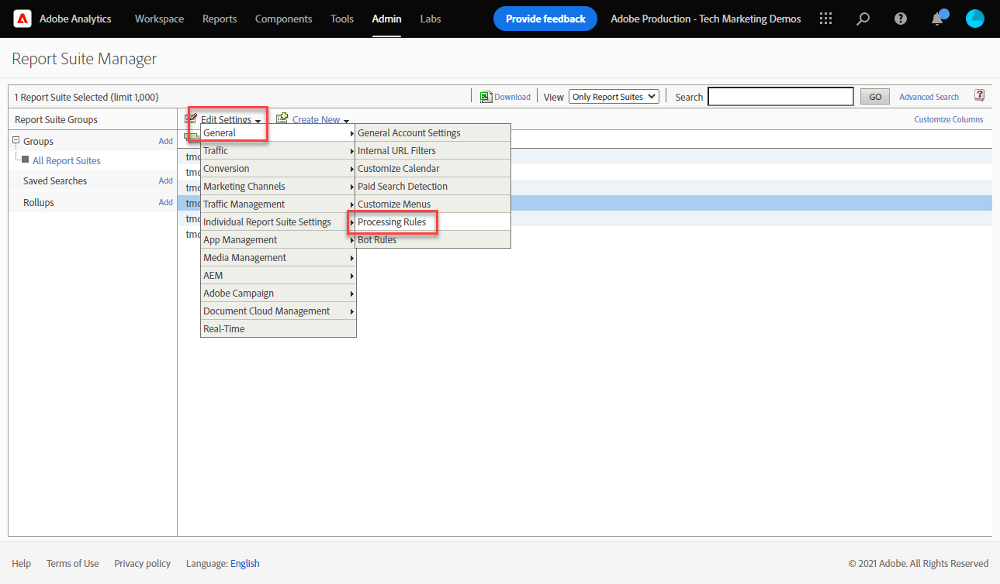
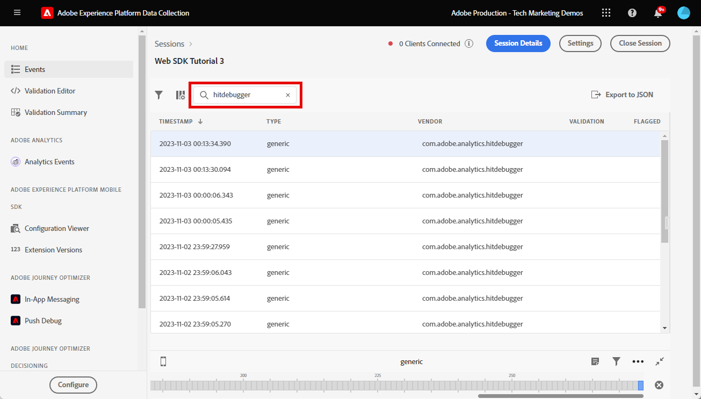

# Adobe Analytics instellen met Adobe Experience Platform Web SDK

Meer informatie over het instellen van Adobe Analytics met [Adobe Experience Platform Web SDK](https://experienceleague.adobe.com/en/docs/platform-learn/data-collection/web-sdk/overview), maakt u labelregels om gegevens naar Adobe Analytics te verzenden en controleert u of Analytics gegevens vastlegt zoals u had verwacht.

[Adobe Analytics](https://experienceleague.adobe.com/en/docs/analytics) is een industrie-leidende toepassing die u machtigt om uw klanten als mensen te begrijpen en uw zaken met klantenintelligentie te sturen.

## Leerdoelstellingen

Aan het eind van deze les, zult u kunnen:

* Een gegevensstroom configureren om Adobe Analytics in te schakelen
* Weet welke standaard-XDM velden automatisch worden toegewezen aan analytische variabelen
* Analysevariabelen instellen in het gegevensobject
* Gegevens naar een andere rapportsuite verzenden door de gegevensstroom te overschrijven
* Adobe Analytics-variabelen valideren met Foutopsporing en Betrouwbaarheid

## Vereisten

Om deze les te voltooien, moet u eerst:

* Ben vertrouwd met en heb toegang tot Adobe Analytics.

* minstens één test/dev rapportsuite-id hebben. Als u geen test/dev- rapportreeks hebt die u voor dit leerprogramma kunt gebruiken, [Maak een](https://experienceleague.adobe.com/en/docs/analytics/admin/admin-tools/manage-report-suites/c-new-report-suite/t-create-a-report-suite).

* Voltooi de vroegere lessen in de Aanvankelijke secties van de Configuratie van de Configuratie en van de Markeringen van dit leerprogramma.

## De gegevensstroom configureren

Platform Web SDK verzendt gegevens van uw website naar Platform Edge Network. Uw gegevensstroom vertelt dan de Edge Network van het Platform aan welke Adobe Analytics rapportreeksen uw gegevens zouden moeten worden verzonden.

1. Ga naar [Gegevensverzameling](https://experience.adobe.com/#/data-collection){target="blank"} interface
1. Selecteer in de linkernavigatie de optie **[!UICONTROL Datastreams]**
1. Selecteer de eerder gemaakte `Luma Web SDK: Development Environment` datastream

   

1. Selecteren **[!UICONTROL Add Service]**
   
1. Selecteren **[!UICONTROL Adobe Analytics]** als de **[!UICONTROL Service]**
1. Voer de **[!UICONTROL Report Suite ID]** van uw pakket ontwikkelingsrapporten
1. Selecteren **[!UICONTROL Save]**

   

   >[!TIP]
   >
   >Meer rapportsuites toevoegen door te selecteren **[!UICONTROL Add Report Suite]** is gelijk aan taggen met meerdere suite&#39;s.

>[!WARNING]
>
>In deze zelfstudie configureert u alleen de Adobe Analytics-rapportsuite voor uw ontwikkelomgeving. Wanneer u gegevensstromen voor uw eigen website creeert, zou u extra gegevensstromen en rapportsuites voor uw het opvoeren en productiemilieu&#39;s moeten tot stand brengen.

## Analysevariabelen instellen

Er zijn verscheidene manieren om de variabelen van de Analyse in een implementatie van SDK van het Web te plaatsen:

1. Automatische toewijzing van XDM-velden aan analytische variabelen (automatisch).
1. Velden instellen in het dialoogvenster `data` object (aanbevolen).
1. XDM-velden toewijzen aan analytische variabelen in de verwerkingsregels voor Analytics (niet langer aanbevolen).
1. Wijs variabelen rechtstreeks toe aan Analytics in het XDM-schema (niet meer aanbevolen).

Vanaf mei 2024 hoeft u niet langer een XDM-schema te maken om Adobe Analytics met Platform Web SDK te implementeren. De `data` en de `data.variable` gegevenselement dat u in deze zelfstudie hebt gemaakt) kunt u gebruiken om alle aangepaste analytische variabelen in te stellen. Het instellen van deze variabelen in het gegevensobject is vertrouwd voor bestaande klanten van Analytics, is efficiënter dan het gebruik van de interface met verwerkingsregels en voorkomt dat overbodige gegevens ruimte in realtime-klantprofielen opnemen (belangrijk als u Real-time Customer Data Platform of Journey Optimizer hebt).

### Automatisch toegewezen velden

Veel XDM-velden worden automatisch toegewezen aan analytische variabelen. Voor de meest recente lijst met toewijzingen raadpleegt u [Variabeletoewijzing analyseren in Adobe Experience Edge](https://experienceleague.adobe.com/en/docs/experience-platform/edge/data-collection/adobe-analytics/automatically-mapped-vars).

Dit gebeurt als _zelfs als u geen aangepast schema hebt gedefinieerd_. SDK van het Web van het Experience Platform verzamelt automatisch sommige gegevens en verzendt hen naar de Edge Network van het Platform als gebieden XDM. Web SDK leest bijvoorbeeld de URL van de huidige pagina en verzendt deze als `web.webPageDetails.URL`. Dit veld wordt doorgestuurd naar Adobe Analytics en wordt automatisch ingevuld in de pagina-URL-rapporten in Adobe Analytics.

Wanneer u SDK van het Web voor Analytics en Op platform-gebaseerde toepassing uitvoert, zult u een douaneXDM schema, aangezien u in dit leerprogramma in [Een schema configureren](configure-schemas.md) les. Sommige XDM gebieden u auto-kaart aan variabelen van Analytics, zoals geschetst in deze lijst hebt uitgevoerd:

| Automatisch toegewezen variabelen van XDM naar Analytics | Adobe Analytics-variabele |
|-------|---------|
| `identitymap.ecid.[0].id` | midden |
| `web.webPageDetails.name` | s.pageName |
| `web.webPageDetails.server` | s.server |
| `web.webPageDetails.siteSection` | s.channel |
| `commerce.productViews.value` | prodView |
| `commerce.productListViews.value` | scView |
| `commerce.checkouts.value` | scCheckout |
| `commerce.purchases.value` | aankoop |
| `commerce.order.currencyCode` | s.currencyCode |
| `commerce.order.purchaseID` | s.purchaseID |
| `productListItems[].SKU` | s.products=;productnaam;;; (primair - zie onderstaande opmerking) |
| `productListItems[].name` | s.products=;productnaam;;; (fallback - zie onderstaande opmerking) |
| `productListItems[].quantity` | s.products=;;producthoeveelheid; |
| `productListItems[].priceTotal` | s.product=;;;productprijs; |

De afzonderlijke secties van de producttekenreeks Analytics worden ingesteld via verschillende XDM-variabelen onder de `productListItems` object.

>Vanaf 18 augustus 2022, `productListItems[].SKU` neemt prioriteit aan afbeelding aan de productnaam in de s.products variabele.
>De waarde die is ingesteld op `productListItems[].name` alleen aan de productnaam wordt toegewezen als `productListItems[].SKU` bestaat niet. Anders wordt de koppeling verwijderd en beschikbaar in contextgegevens.
>Stel geen lege tekenreeks of null in op `productListItems[].SKU`. Dit heeft het ongewenste effect van afbeelding aan de productnaam in de s.products variabele.

### Variabelen instellen in het gegevensobject

Variabelen instellen in het dialoogvenster `data` -object is de aanbevolen manier om analytische variabelen in te stellen met Web SDK. Als u variabelen in het gegevensobject instelt, kunnen ook alle automatisch toegewezen variabelen worden overschreven.

Ten eerste, wat is de `data` object? In elke Web SDK-gebeurtenis kunt u twee objecten verzenden met aangepaste gegevens: `data` en de `xdm` object. Beide worden verzonden naar de Edge Network van het Platform, maar slechts `xdm` object wordt naar de gegevensset Experience Platform verzonden. Eigenschappen in het dialoogvenster `data` object kan op de rand worden toegewezen aan `xdm` velden die de functie Gegevensvoorinstelling voor gegevensverzameling gebruiken, maar die anders niet naar het Experience Platform worden verzonden. Dit maakt het een ideale manier om gegevens naar toepassingen als Analytics te verzenden, die niet op Experience Platform zelf zijn gebaseerd.

Hier zijn de twee voorwerpen in een generische vraag van SDK van het Web:

Adobe Analytics is geconfigureerd om te zoeken naar eigenschappen in de `data.__adobe.analytics` gebruiken voor variabelen van Analytics.

Laten we dit nu doen.

We gebruiken de `data.variable` gegevenselement t

<!--

### Map to Analytics variables with processing rules

All fields in the XDM schema become available to Adobe Analytics as Context Data Variables with the following prefix `a.x.`. For example, `a.x.web.webinteraction.region`

In this exercise, you map one XDM variable to a prop. Follow these same steps for any custom mapping that you must do for any `eVar`, `prop`, `event`, or variable accessible via Processing Rules.

1. Go to the Analytics interface
1. Go to [!UICONTROL Admin] > [!UICONTROL Admin Tools] > [!UICONTROL Report Suites ]
1. Select the dev/test report suite that you are using for the tutorial > [!UICONTROL Edit Settings] > [!UICONTROL General] > [!UICONTROL Processing Rules]

       

1. Create a rule to **[!UICONTROL Overwrite value of]** `[!UICONTROL Product SKU (prop1)]` to `a.x.productlistitems.0.sku`. Remember to add a note about why you are creating the rule and name your rule title. Select **[!UICONTROL Save]**

       

    >[!IMPORTANT]
    >
    >The first time you map to a processing rule, the UI does not show you the context data variables from the XDM object. To fix that select any value, Save, and come back to edit. All XDM variables should now appear.

### Map to Analytics variables using the Adobe Analytics field group

An alternative to processing rules is to map to Analytics variables in the XDM schema using the `Adobe Analytics ExperienceEvent Template` field group. This approach has gained popularity because many users find it simpler than configuring processing rules, however, by increasing the size of the XDM payload it could in turn increase the profile size in other applications like Real-Time CDP.

To add the `Adobe Analytics ExperienceEvent Template` field group to your schema:

1. Open the [Data Collection](https://experience.adobe.com/#/data-collection){target="blank"} interface
1. Select **[!UICONTROL Schemas]** from the left navigation
1. Make sure you are in the sandbox you are using from the tutorial
1. Open your `Luma Web Event Data` schema
1. In the **[!UICONTROL Field Groups]** section, select **[!UICONTROL Add]**
1. Find the `Adobe Analytics ExperienceEvent Template` field group and add it to your schema

Now, set a merchandising eVar in the product string. With the `Adobe Analytics ExperienceEvent Template` field group, you are able to map variables to merchandising eVars or events within the product string. This is also known as setting **Product Syntax Merchandising**. 

1. Go back to your tag property

1. Open the rule `ecommerce - library loaded - set product details variables - 20`

1. Open the **[!UICONTROL Set Variable]** action

1. Select to open `_experience > analytics > customDimensions > eVars > eVar1`

1. Set the **[!UICONTROL Value]** to `%product.productInfo.title%`

1. Select **[!UICONTROL Keep Changes]**

    

1. Select **[!UICONTROL Save]** to save the rule

As you just saw, basically all of the Analytics variables can be set in the `Adobe Analytics ExperienceEvent Template` field group.

>[!NOTE]
>
> Notice the `_experience` object under `productListItems` > `Item 1`. Setting any variable under this [!UICONTROL object] sets Product Syntax eVars or Events.

-->

## Gegevens verzenden naar een andere rapportsuite

U kunt wijzigen naar welke Adobe Analytics-rapportsuite gegevens worden verzonden wanneer bezoekers zich op bepaalde pagina&#39;s bevinden. Dit vereist een configuratie in zowel de datastream als een regel.

### Vorm de gegevensstroom voor een de opheffing van de rapportreeks

U configureert als volgt de overschrijvingsinstelling van de Adobe Analytics-rapportsuite in de gegevensstroom:

1. De gegevensstroom openen
1. Bewerk de **[!UICONTROL Adobe Analytics]** configuratie door de  en selecteert u vervolgens **[!UICONTROL Edit]**

   

1. Selecteer de **[!UICONTROL Advance Options]** openen **[!UICONTROL Report Suite Overrides]**

1. Selecteer de rapportsuites die u wilt met voeten treden. In dit geval: `Web SDK Course Dev` en `Web SDK Course Stg`

1. Selecteren **[!UICONTROL Save]**

   

### Vorm een regel voor een de opheffing van de rapportreeks

Laten wij een regel tot stand brengen om een extra vraag van de paginamening naar een verschillende rapportreeks te verzenden. Gebruik de gegevensstroomoverschrijvingsfunctie om de rapportsuite voor een pagina te wijzigen met de functie **[!UICONTROL Send Event]** Actie.

1. Een nieuwe regel maken, een naam geven `homepage - library loaded - AA report suite override - 51`

1. Selecteer het plusteken onder **[!UICONTROL Event]** een nieuwe trigger toevoegen

1. Onder **[!UICONTROL Extension]**, selecteert u **[!UICONTROL Core]**

1. Onder **[!UICONTROL Event Type]**, selecteert u **[!UICONTROL library loaded]**

1. Selecteren om te openen **[!UICONTROL Advanced Options]**, typt u `51`. Dit verzekert de regellooppas na `all pages - library loaded - send event - 50` dat de basislijn-XDM instelt met de **[!UICONTROL Update variable]** actietype.

   

1. Onder **[!UICONTROL Conditions]**, selecteert u **[!UICONTROL Add]**

1. Verlaten **[!UICONTROL Logic Type]** als **[!UICONTROL Regular]**

1. Verlaten **[!UICONTROL Extensions]** als **[!UICONTROL Core]**

1. Selecteren **[!UICONTROL Condition Type]** als **[!UICONTROL Path Without Query String]**

1. Laat rechts de knop **[!UICONTROL Regex]** schakelen uitgeschakeld

1. Onder **[!UICONTROL path equals]** set `/content/luma/us/en.html`. Voor de Luma-demo-site zorgt deze ervoor dat de regel alleen op de homepage wordt geactiveerd

1. Selecteren **[!UICONTROL Keep Changes]**

   

1. Onder **[!UICONTROL Actions]** selecteren **[!UICONTROL Add]**

1. Als de **[!UICONTROL Extension]**, selecteert u **[!UICONTROL Adobe Experience Platform Web SDK]**

1. Als de **[!UICONTROL Action Type]**, selecteert u **[!UICONTROL Send Event]**

1. Als de **[!UICONTROL Type]**, selecteert u `web.webpagedetails.pageViews`

1. Als de **[!UICONTROL XDM data]**, selecteert u de `xdm.variable.content` gegevenselement dat u in het dialoogvenster [Gegevenselementen maken](create-data-elements.md) les

   

1. Omlaag schuiven naar de **[!UICONTROL Datastream Configurations Overrides]** sectie

1. Laat de **[!UICONTROL Development]** geselecteerd.

   >[!TIP]
   >
   >    Dit tabblad bepaalt in welke tagomgeving de overschrijving plaatsvindt. Voor dit oefening specificeert u slechts het milieu van de Ontwikkeling maar wanneer u dit aan productie opstelt herinner zich om het in ook te doen in **[!UICONTROL Production]** milieu.

1. Selecteer de **[!UICONTROL Datastream]** in dit geval `Luma Web SDK: Development Environment`

1. Onder **[!UICONTROL Report suites]** selecteert u de rapportsite waarvoor u deze wilt gebruiken. In dit geval: `tmd-websdk-course-stg`.

1. Selecteren **[!UICONTROL Keep Changes]**

1. en **[!UICONTROL Save]** uw regel

   

## Bouw uw milieu van de Ontwikkeling

Voeg uw nieuwe gegevenselementen en regels toe aan uw `Luma Web SDK Tutorial` tagbibliotheek en herstel de ontwikkelomgeving.

Gefeliciteerd! De volgende stap bestaat uit het valideren van uw Adobe Analytics-implementatie via Experience Platform Web SDK.

## Adobe Analytics valideren met foutopsporing

Leer hoe u met de functie Edge Trace van Foutopsporing in Experience Platform kunt controleren of Adobe Analytics de ECID, paginaweergaven, de productreeks en e-commercegebeurtenissen vastlegt.

In de [Foutopsporing](validate-with-debugger.md) les, leerde u hoe te om het cliënt-kant XDM verzoek met de Debugger van het Platform en browser ontwikkelaarsconsole te inspecteren, die aan gelijkaardig is hoe u zuivert `AppMeasurement.js` Implementatie van analysemogelijkheden. U leerde ook over het bevestigen van de server-zijverzoeken van de Edge Network van het Platform die naar de toepassingen van de Adobe worden verzonden, en hoe te om een volledig verwerkte lading te bekijken gebruikend Verzekering.

Om Analytics te bevestigen vangt correct gegevens door het Web SDK van het Experience Platform, moet u twee stappen verder gaan:

1. Valideer hoe de gegevens door het voorwerp XDM op de Edge Network van het Platform worden verwerkt, gebruikend de eigenschap van het Spoor van de Rand van Foutopsporing van het Experience Platform
1. Valideren hoe gegevens volledig worden verwerkt door Analytics met Adobe Experience Platform Assurance

### Validatie van Experience Cloud-id

1. Ga naar de [Luma-demosite](https://luma.enablementadobe.com/content/luma/us/en.html){target="_blank"}
1. Selecteer de aanmeldknop rechtsboven en gebruik gebruikersgegevens u: test@adobe.com p: test voor verificatie
1. Open Foutopsporing Experience Platform en [schakelen van de markeringseigenschap op de site naar uw eigen ontwikkeleigenschap](validate-with-debugger.md#use-the-experience-platform-debugger-to-map-to-your-tags-property)

1. Als u Edge Trace wilt inschakelen, gaat u naar Foutopsporing Experience Platform en selecteert u in de linkernavigatie **[!UICONTROL Logs]** en selecteert u vervolgens de **[!UICONTROL Edge]** en selecteert u **[!UICONTROL Connect]**

   

1. Het zal nu leeg zijn

   

1. Vernieuw de pagina Luminantie en controleer Foutopsporing Experience Platform opnieuw. Er worden gegevens weergegeven. De rij die begint met **[!UICONTROL Analytics Automatic Mapping]** is het baken van Adobe Analytics
1. Selecteer deze optie om beide opties te openen `[!UICONTROL mappedQueryParams]` vervolgkeuzelijst en tweede vervolgkeuzelijst om de variabelen Analytics weer te geven

   

   >[!TIP]
   >
   >De tweede vervolgkeuzelijst komt overeen met de ID van de Analytics-rapportsuite waarnaar u gegevens verzendt. Het zou uw eigen rapportreeks moeten aanpassen, niet in het schermafbeelding.

1. Omlaag schuiven om te zoeken `[!UICONTROL c.a.x.identitymap.ecid.[0].id]`. Het is een Context Data Variable die ECID vangt
1. Blijf omlaag schuiven totdat u de Analyse ziet `[!UICONTROL mid]` variabele. Beide id&#39;s komen overeen met de Experience Cloud-id van uw apparaat.
1. Op de Luma-site:

   

   >[!NOTE]
   >
   >Aangezien u bent aangemeld, duurt het even om de geverifieerde id te valideren `112ca06ed53d3db37e4cea49cc45b71e` voor de gebruiker **`test@adobe.com`** wordt ook vastgelegd in de `[!UICONTROL c.a.x.identitymap.lumacrmid.[0].id]`

### Validatie van overschrijvingen van rapportsuite

Hierboven hebt u een gegevensstroomoverschrijving geconfigureerd voor de [Luminantiepage](https://luma.enablementadobe.com/content/luma/us/en.html).  Om deze configuratie te bevestigen

1. Zoek een rij met **[!UICONTROL Datastream config after override was applied]**. Hier vindt u de primaire rapportsuite en de extra rapportsuite(s) die voor de rapportsuite-overschrijvingen zijn geconfigureerd.

   

1. Omlaag schuiven naar de rij die begint met **[!UICONTROL Analytics Automatic Mapping]**  en verifieert `[!UICONTROL reportSuiteIds]` toont de rapportsuite die u hebt opgegeven in uw overschrijvingsconfiguraties

   

### Validatie van weergaven van inhoudspagina

Ga naar een productpagina zoals de [pagina Didi Sport Watch](https://luma.enablementadobe.com/content/luma/us/en/products/gear/watches/didi-sport-watch.html#24-WG02).  Controleer of de weergaven van de inhoudspagina worden vastgelegd door Analytics.

1. Zoeken naar `[!UICONTROL c.a.x.web.webpagedetails.pageviews.value]=1`.
1. Omlaag schuiven om de `[!UICONTROL gn]` variabele. Dit is de dynamische syntaxis van Analytics voor de `[!UICONTROL s.pageName]` variabele. De paginanaam wordt vastgelegd vanuit de gegevenslaag.

   

### Validatie van productreeks- en e-commercegebeurtenissen

Aangezien u al op een productpagina staat, blijft deze oefening het zelfde Spoor gebruiken om productgegevens te bevestigen wordt gevangen door Analytics. Zowel worden het productkoord als e-commercegebeurtenissen automatisch in kaart gebracht XDM variabelen aan Analytics. Zolang u aan het juiste hebt toegewezen `productListItem` XDM variable while [configureren van een XDM-schema voor Adobe Analytics](setup-analytics.md#configure-an-xdm-schema-for-adobe-analytics)De Edge Network van het Platform zorgt ervoor dat de gegevens worden gekoppeld aan de juiste analytische variabelen.

**Eerst controleert u `Product String` is ingesteld**

1. Zoeken naar `[!UICONTROL c.a.x.productlistitems.][0].[!UICONTROL sku]`. De variabele legt de gegevenselementwaarde vast die u aan de `productListItems.item1.sku` eerder in deze les
1. Zoek ook naar `[!UICONTROL c.a.x.productlistitems.][0].[!UICONTROL _experience.analytics.customdimensions.evars.evar1]`. De variabele legt de waarde van het gegevenselement vast u aan `productListItems.item1._experience.analytics.customdimensions.evars.evar1`
1. Omlaag schuiven om de `[!UICONTROL pl]` variabele. Dit is de dynamische syntaxis van de variabele van de producttekenreeks Analytics
1. Merk op dat de productnaam van de gegevenslaag zowel aan de `[!UICONTROL c.a.x.productlistitems.][0].[!UICONTROL sku]` en de `[!UICONTROL product]` parameter van de producttekenreeks.  Bovendien wordt de producttitel van de gegevenslaag in kaart gebracht aan merchandising evar1 in het productkoord.

   

   De behandeling Rand overtrekken `commerce` gebeurtenissen iets anders dan `productList` afmetingen. U ziet geen Variabele van de Gegevens van de Context in kaart gebracht de zelfde manier u de productnaam in kaart brengt aan `[!UICONTROL c.a.x.productlistitem.[0].name]` hierboven. In plaats daarvan wordt in het Edge Trace de uiteindelijke gebeurtenis automatisch toegewezen in de Analytics `event` variabele. De Edge Network van het platform brengt het dienovereenkomstig in kaart zolang u aan juiste XDM in kaart brengt `commerce` variabele while [configureren van schema voor Adobe Analytics](setup-analytics.md#configure-an-xdm-schema-for-adobe-analytics); in dit geval `commerce.productViews.value=1`.

1. Ga terug in het venster van Foutopsporing Experience Platform en schuif omlaag naar de `[!UICONTROL events]` variable, it is ingesteld op `[!UICONTROL prodView]`

1. Ook notitie `[!UICONTROL c.a.x.eventType]` is ingesteld op `commerce.productViews` omdat u op een productpagina bent.

   >[!TIP]
   >
   > De `ecommerce - pdp library loaded - AA (order 20)` regel overschrijft de waarde van `eventType` door de `all pages global content variables - library loaded - AA (order 1)` regel zoals deze is ingesteld om later in de reeks te worden geactiveerd

   

**Valideer de overige e-commercegebeurtenissen en producttekenreeksen die zijn ingesteld voor Analytics**

1. Toevoegen [Didi Sport Watch](https://luma.enablementadobe.com/content/luma/us/en/products/gear/watches/didi-sport-watch.html#24-WG02) naar winkelwagentje
1. Ga naar de [Winkelpagina](https://luma.enablementadobe.com/content/luma/us/en/user/cart.html), controleer Edge Trace voor

   * `eventType` instellen op `commerce.productListViews`
   * `[!UICONTROL events: "scView"]`, en
   * de producttekenreeks is ingesteld

   

1. Ga door met de kassa, controleer Edge Trace voor

   * `eventType` instellen op `commerce.checkouts`
   * `[!UICONTROL events: "scCheckout"]`, en
   * de producttekenreeks is ingesteld

   

1. Vul alleen de **Voornaam** en **Achternaam** velden op het verzendformulier en selecteer **Doorgaan**. Selecteer op de volgende pagina de optie **Opdracht plaatsen**
1. Controleer Edge Trace op bevestigingspagina voor

   * `eventType` instellen op `commerce.purchases`
   * Inkoopgebeurtenis ingesteld `[!UICONTROL events: "purchase"]`
   * Valuta Code variabele die wordt ingesteld `[!UICONTROL cc: "USD"]`
   * Aankoop-id ingesteld in `[!UICONTROL pi]`
   * Producttekenreeks `[!UICONTROL pl]` de productnaam, de hoeveelheid en de prijs instellen

   

## Adobe Analytics valideren met Betrouwbaarheid

Met Adobe Experience Platform Assurance kunt u controleren, testen, simuleren en valideren hoe u gegevens verzamelt of ervaringen met uw website en mobiele toepassing benut.

In de vorige oefening bevestigde u dat Adobe Analytics ECID, paginameningen, het productkoord, en e-commercegebeurtenissen met de eigenschap van het Spoor van de Rand van Foutopsporing van het Experience Platform vangt.  Vervolgens valideert u dezelfde gebeurtenissen met Adobe Experience Platform Assurance, een alternatieve interface voor toegang tot dezelfde gegevens in Edge Trace.

Zoals u in [Betrouwbaarheid](validate-with-assurance.md) les, er zijn verscheidene manieren om een zitting van de Verzekering in werking te stellen. Aangezien u reeds Adobe Experience Platform Debugger open hebt met een zitting van het Spoor van de Rand die van de laatste oefening in werking wordt gesteld, adviseren wij toegang tot Verzekering door Debugger:

Binnen de **[!UICONTROL "Web SDK Tutorial 3"]** Verzekeringssessie openen **[!UICONTROL "hitdebugger"]** in de zoekbalk voor gebeurtenissen om de resultaten naar de verwerkte gegevens van Adobe Analytics Post te filteren.

### Validatie van Experience Cloud-id

Als u wilt valideren dat Adobe Analytics de ECID vastlegt, selecteert u een baken en opent u de Payload.  De leverancier van dit baken moet **[!UICONTROL com.adobe.analytics.hitdebugger]**

Schuif vervolgens omlaag naar **[!UICONTROL mcvisId]** controleren of de ECID correct is vastgelegd

### Validatie van weergaven van inhoudspagina

Met hetzelfde baken valideert u of de weergaven van de inhoudspagina zijn toegewezen aan de juiste Adobe Analytics-variabele.
Omlaag schuiven naar **[!UICONTROL pageName]** om te bevestigen dat `Page Name` correct is vastgelegd

### Validatie van productreeks- en e-commercegebeurtenissen

Volg dezelfde validatiegebruikscase die wordt gebruikt bij validatie met de bovenstaande Experience Platform-foutopsporing, en ga verder met dezelfde baken voor validatie van de functie `Ecommerce Events` en de `Product String`.

1. Zoek naar lading waar **[!UICONTROL events]** bevatten `prodView`
   
1. Omlaag schuiven naar **[!UICONTROL product-string]** om de `Product String`.
   * Noteer de `Product SKU` en `Merchandizing eVar1`.
1. Naderhand omlaag schuiven en valideren dat `prop1`, die u gebruikend verwerkingsregels in de vorige sectie vormde, bevat `Product SKU`\
   

Ga door met het valideren van uw implementatie door de gebeurtenissen voor winkelwagentjes, kassa&#39;s en aankopen te controleren.

1. Zoek naar lading waar **[!UICONTROL events]** bevatten `scView` en valideer de productreeks.
   
1. Zoek naar lading waar **[!UICONTROL events]** bevatten `scCheckout` en valideer de productreeks.
   
1. Zoek naar lading waar **[!UICONTROL events]** bevatten `purchase`
   
1. Wanneer u het `purchase` -gebeurtenis, merkt u op dat de `Product String` bevat de `Product SKU`, `Product Quantity` , en `Product Total Price`.
1. Daarnaast geldt voor de `purchase` valideren dat de `purchase-id` en/of `purchaseId` zijn ingesteld

Gefeliciteerd! Je hebt het gedaan! Dit is het einde van de les en nu bent u klaar om Adobe Analytics met Platform Web SDK voor uw eigen website te implementeren.

[Volgende: ](setup-audience-manager.md)

>[!NOTE]
>
>Bedankt dat u tijd hebt geïnvesteerd in het leren over de SDK van Adobe Experience Platform Web. Als u vragen hebt, algemene feedback wilt delen of suggesties voor toekomstige inhoud hebt, kunt u deze delen over deze [Experience League Communautaire discussiestuk](https://experienceleaguecommunities.adobe.com/t5/adobe-experience-platform-data/tutorial-discussion-implement-adobe-experience-cloud-with-web/td-p/444996)
