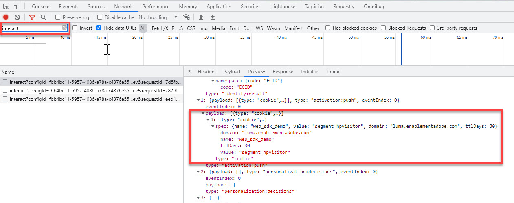

# Audience Manager instellen met Platform Web SDK

Leer hoe u Adobe Audience Manager instelt met de Adobe Experience Platform Web SDK en de implementatie valideert met een cookie-bestemming.

[&#x200B; Adobe Audience Manager &#x200B;](https://experienceleague.adobe.com/nl/docs/audience-manager) is de oplossing van Adobe Experience Cloud die alles verstrekt die wordt vereist om commercieel relevante informatie over plaatsbezoekers te verzamelen, verhandelbare segmenten tot stand te brengen, en gerichte reclame en inhoud aan het juiste publiek te dienen.

## Leerdoelstellingen

Aan het eind van deze les, zult u kunnen:

* Een gegevensstroom configureren om Audience Manager in te schakelen
* Een cachedoel inschakelen in Audience Manager
* Valideer de implementatie van Audience Manager door publiekskwalificatie met Adobe Experience Platform Debugger te bevestigen

## Vereisten

Om deze les te voltooien, moet u eerst:

* Voltooi de vroegere lessen in de Aanvankelijke secties van de Configuratie van de Configuratie en van de Markeringen van dit leerprogramma.
* Heb toegang tot Adobe Audience Manager en de aangewezen toestemmingen om, attributen, segmenten, en bestemmingen tot stand te brengen te lezen en te schrijven. Voor meer informatie, te herzien gelieve [&#x200B; op rol-Gebaseerd Toegangsbeheer van Audience Manager &#x200B;](https://experienceleague.adobe.com/nl/docs/audience-manager-learn/tutorials/setup-and-admin/user-management/setting-permissions-with-role-based-access-control).

## De gegevensstroom configureren

De implementatie van Audience Manager die het Web SDK van het Platform gebruikt verschilt van de implementatie gebruikend [&#x200B; server-kant het door:sturen (SSF) &#x200B;](https://experienceleague.adobe.com/nl/docs/analytics/admin/admin-tools/manage-report-suites/edit-report-suite/report-suite-general/server-side-forwarding/ssf). Door:sturen op de server geeft u Adobe Analytics-aanvraaggegevens door aan Audience Manager. Een SDK-implementatie van het Platform geeft XDM-gegevens door die naar Platform Edge Network naar Audience Manager worden verzonden. Audience Manager is ingeschakeld in de gegevensstroom:

1. Ga naar [&#x200B; interface van de Inzameling van 0&rbrace; Gegevens](https://experience.adobe.com/#/data-collection){target="blank"}
1. Selecteer **[!UICONTROL Datastreams]** bij de linkernavigatie
1. Selecteer de eerder gemaakte `Luma Web SDK: Development Environment` datastream

   

1. Selecteren **[!UICONTROL Add Service]**
    toe
1. Selecteer **[!UICONTROL Adobe Audience Manager]** als de **[!UICONTROL Service]**
1. Bevestig dat **[!UICONTROL Cookie Destinations Enabled]** en **[!UICONTROL URL Destinations Enabled]** zijn geselecteerd
1. Selecteren **[!UICONTROL Save]**
   

## Een gegevensbron maken

Daarna, creeer a [&#x200B; Gegevens Source &#x200B;](https://experienceleague.adobe.com/nl/docs/audience-manager/user-guide/features/data-sources/datasources-list-and-settings), een fundamenteel hulpmiddel om gegevens binnen Audience Manager te organiseren:

1. Ga naar [&#x200B; Audience Manager &#x200B;](https://experience.adobe.com/#/audience-manager/) interface
1. Selecteer **[!UICONTROL Audience Data]** in de bovenste navigatie
1. Selecteer de **[!UICONTROL Data Sources]** in de keuzelijst
1. Selecteer de knop **[!UICONTROL Add New]** boven aan de pagina Gegevensbronnen

   

1. Geef de Data Source een vriendelijke naam en beschrijving. Voor de eerste setup kunt u deze `Platform Web SDK tutorial` een naam geven.
1. **[!UICONTROL ID Type]** instellen op **[!UICONTROL Cookie]**
1. Selecteer in de sectie **[!UICONTROL Data Export Controls]** de optie **[!UICONTROL No Restriction]**

   

1. **[!UICONTROL Save]** de Data Source

## Een kenmerk maken

Nadat het Gegevens Source wordt bewaard, opstelling a [&#x200B; spoor &#x200B;](https://experienceleague.adobe.com/nl/docs/audience-manager/user-guide/features/traits/traits-overview). Treinen zijn een combinatie van een of meer signalen in Audience Manager. Maak een kenmerk voor bezoekers van de startpagina.

>[!NOTE]
>
>Alle XDM gegevens worden verzonden naar Audience Manager als het in de gegevensstroom wordt toegelaten, nochtans zouden de gegevens 24u kunnen vergen tot het in het Ongebruikte rapport van Signalen beschikbaar is. Maak expliciete kenmerken voor de XDM-gegevens die u direct in Audience Manager wilt gebruiken, zoals in deze exercitie wordt beschreven.

1. Selecteren **[!UICONTROL Audience Data]** > **[!UICONTROL Traits]**
1. Selecteren **[!UICONTROL Add New]** > **[!UICONTROL Rule-Based]** Afdrukken

   

1. Geef uw kenmerk een vriendelijke naam en beschrijving, `Luma homepage view`
1. Selecteer de **[!UICONTROL Data Source]** die u in de vorige sectie hebt gemaakt.
1. **[!UICONTROL Select a Folder]** waarin u de eigenschap wilt opslaan in het deelvenster aan de rechterkant. U kunt een omslag tot stand brengen door **te selecteren + pictogram** naast een bestaande ouderomslag. U kunt deze nieuwe map een naam geven `Platform Web SDK tutorial` .
1. Vouw het caret-teken **[!UICONTROL Trait Expression]** uit en selecteer **[!UICONTROL Expression Builder]** U moet een sleutelwaardepaar opgeven dat een homepage-bezoek aangeeft.
1. Open de [&#x200B; homepage van de Luma &#x200B;](https://luma.enablementadobe.com/content/luma/us/en.html) (in kaart gebracht aan uw markeringsbezit) en **Adobe Experience Platform Debugger** en vernieuw de pagina.
1. Bekijk de Verzoeken van het Netwerk en de gebeurtenisdetails voor het Web SDK van het Platform om de sleutel en naamwaarde voor de homepage te vinden.
   
1. Ga terug naar de Expressiebouwer in de gebruikersinterface van Audience Manager en voer de sleutel in als **`web.webPageDetails.name`** en de waarde van **`content:luma:us:en`** . Deze stap zorgt ervoor dat u een eigenschap brandt wanneer u de homepage laadt.
1. **[!UICONTROL Save]** de eigenschap.

## Een segment maken

De volgende stappen moeten a **segment** tot stand brengen en uw onlangs bepaald bezit aan dit segment toewijzen.

1. Selecteer **[!UICONTROL Audience Data]** in de bovenste navigatie en selecteer **[!UICONTROL Segments]**
1. Selecteer **[!UICONTROL Add New]** linksboven op de pagina om de segmentbuilder te openen.
1. Geef uw segment een vriendelijke naam en beschrijving, zoals `Platform Web SDK - Homepage visitors`
1. **[!UICONTROL Select a Folder]** waar het segment wordt opgeslagen in het deelvenster aan de rechterkant. U kunt een omslag tot stand brengen door **te selecteren + pictogram** naast een bestaande ouderomslag. U kunt deze nieuwe map een naam geven `Platform Web SDK tutorial` .
1. Voeg een integratiecode toe, die in dit geval een willekeurige reeks getallen is.
1. Selecteer **[!UICONTROL Data Source]** in de sectie **[!UICONTROL Audience Manager]** en de gegevensbron die u eerder hebt gemaakt
1. Vouw de sectie **[!UICONTROL Traits]** uit en zoek naar het kenmerk dat u hebt gemaakt
1. Selecteer **[!UICONTROL Add Trait]**.
1. Selecteer **[!UICONTROL Save]** onder aan de pagina

    toe

    toe

## Een doel maken

Daarna, creeer a **op cookie-Gebaseerde bestemming** gebruikend de **Bouwer van de Bestemming**. De Bouwer van de Bestemming laat u koekje, URL, en server-aan-server bestemmingen tot stand brengen en beheren.

1. Open de Bouwer van de Bestemming door **[!UICONTROL Destinations]** binnen het **menu van de Gegevens van het publiek** in de hoogste navigatie te selecteren
1. Selecteren **[!UICONTROL Create Destination]**
1. Voer een naam en beschrijving in, `Platform Web SDK tutorial`
1. Als **[!UICONTROL Category]** selecteert u **[!UICONTROL Custom]**
1. Als **[!UICONTROL Type]** selecteert u **[!UICONTROL Cookie]**

    toe

1. Open de sectie **[!UICONTROL Configuration]** om de details over uw koekjesbestemming in te gaan
1. Geef uw cookie een vriendelijke naam, `platform_web_sdk_tutorial`
1. Voeg als **[!UICONTROL Cookie Domain]** het domein van de site toe waar u de integratie wilt integreren, voor de zelfstudie-invoer in het domein Luma, `luma.enablementadobe.com`
1. Als de optie **[!UICONTROL Publish data to]** selecteert u **[!UICONTROL Only the Selected domains]**
1. Selecteer uw domein als dit nog niet is toegevoegd
1. Als de **[!UICONTROL Data Format]** , selecteer **[!UICONTROL Single Key]** en geef uw koekje een sleutel. Voor deze zelfstudie gebruikt u `segment` als de hoofdwaarde.
1. Tot slot selecteert u **[!UICONTROL Save]** om de details van de doelconfiguratie op te slaan.

   

<!--
   

   
-->

1. Gebruik in de sectie **[!UICONTROL Segment Mappings]** de functie **[!UICONTROL Search and Add Segments]** om te zoeken naar uw eerder gemaakte `Platform Web SDK - Homepage visitors` en selecteer **[!UICONTROL Add]** .

1. Nadat u het segment hebt toegevoegd, wordt een pop-upvenster geopend waarin u een verwachte waarde voor de cookie moet opgeven. Voer voor deze oefening de waarde &quot;hpbezoeker&quot; in.

1. Selecteren **[!UICONTROL Save]**

1. Selecteren **[!UICONTROL Done]**
    toe

De periode van de segmentafbeelding vereist een paar uren om worden geactiveerd. Zodra voltooid, kunt u de interface van Audience Manager verfrissen en zien dat de **Gemengde lijst van Segmenten** wordt bijgewerkt.

## Het segment valideren

Een paar uur na de eerste aanmaak van het segment kunt u controleren of het segment goed werkt.

Bevestig eerst dat u in aanmerking kunt komen voor het segment

1. Open de [&#x200B; homepage van de de demoomplaats van de Luma &#x200B;](https://luma.enablementadobe.com/content/luma/us/en.html) met het in kaart gebracht aan uw markeringsbezit om voor uw pas gecreeerd segment te kwalificeren.
1. Open browser **ontwikkelaarshulpmiddelen** > **het lusje van het Netwerk**
1. Filter naar de aanvraag van Platform Web SDK met `interact` als tekstfilter
1. Selecteer een vraag en open het **lusje van de Voorproef** om de reactiedetails te bekijken
1. Vouw de **nuttige lading** uit om de verwachte koekjesdetails, zoals eerder gevormd in Audience Manager te bekijken. In dit voorbeeld wordt de verwachte cookienaam `platform_web_sdk_tutorial` weergegeven.

    toe

1. Open het **lusje van de Toepassing**, en open **Cookies** van het **Opslag** menu.
1. Selecteer het domein **`https://luma.enablementadobe.com`** en bevestig dat uw cookie correct is geschreven in de lijst

    toe

Tot slot zou u het segment in de interface van Audience Manager moeten openen en ervoor zorgen dat de **Populaties van het Segment** hebben verhoogd:

 toe

Nu u deze les hebt voltooid, zou u moeten kunnen zien hoe het Web SDK van het Platform gegevens tot Audience Manager overgaat en een segment-specifieke eerstepartijkoekje met een koekjesbestemming kunnen plaatsen.

>[!NOTE]
>
>Bedankt dat je tijd hebt geïnvesteerd in het leren over Adobe Experience Platform Web SDK. Als u vragen hebt, algemene terugkoppelen wilt delen, of suggesties over toekomstige inhoud hebben, gelieve hen op deze [&#x200B; Communautaire besprekingspost van Experience League te delen &#x200B;](https://experienceleaguecommunities.adobe.com/t5/adobe-experience-platform-data/tutorial-discussion-implement-adobe-experience-cloud-with-web/td-p/444996?profile.language=nl)
