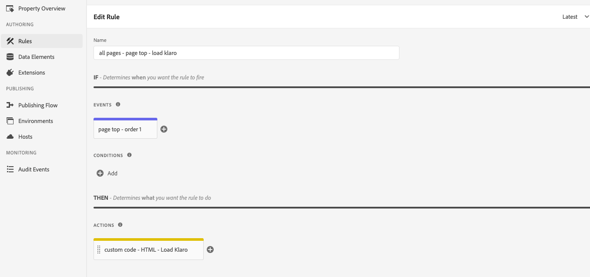
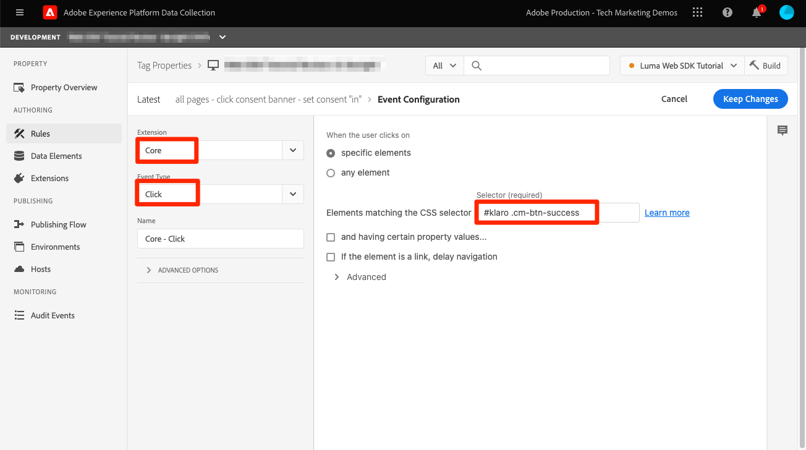

# Goedkeuring instellen met Platform Web SDK

Leer hoe u de privacyinstellingen van de Adobe Experience Platform Web SDK-tagextensie configureert. Stel de toestemming in op basis van de interactie van de bezoeker met een banner van een CMP (Consent Management Platform).

>[!NOTE]
> 
>Voor demonstratiedoeleinden, gebruikt dit leerprogramma [ Klaro ](https://klaro.org/) als CMP. U kunt met Klaro of het CMP dat u voor uw website gebruikt doorgaan.


## Leerdoelstellingen

Aan het einde van deze les kunt u het volgende doen:

* Een CMP laden met tags
* Privacy-instellingen configureren in Experience Platform Web SDK-tagextensie
* Goedkeuring voor Experience Platform Web SDK instellen op basis van actie van bezoeker

## Vereisten

U dient bekend te zijn met tags en de stappen voor het maken van regels, gegevenselementen, het bouwen van bibliotheken naar omgevingen en het wisselen van tagbibliotheken met de Experience Platform Debugger.

Voordat u de privacy-instellingen gaat configureren en de regels voor het instellen van de toestemming gaat maken, moet u ervoor zorgen dat u het script van het toestemmingsbeheerplatform op de website hebt ingespoten en correct werkt. Een CMP kan rechtstreeks in de broncode worden geladen met behulp van siteontwikkelaars of door tags zelf worden geladen. Deze les toont de laatste aanpak aan.

>[!NOTE]
> 
>1. Organisaties gebruiken een Consent Management Platform (of CMP) om de toestemmingskeuzes van een bezoeker wettelijk te documenteren en te beheren voordat ze bezoekersgegevens verzamelen, delen of verkopen van online bronnen zoals websites en apps.
>
>2. De aanbevolen methode voor het injecteren van een CMP is rechtstreeks via de broncode vóór het script voor tagbeheer.

### Klaro configureren

Voordat u in de tagconfiguraties gaat, leert u meer over het platform voor het beheer van de toestemming dat in deze zelfstudie Klaro wordt gebruikt.

1. Bezoek [ Klaro ](https://klaro.org/) en opstelling een rekening.
1. Ga naar **de Manager van de Privacy** en creeer een geval volgens de instructies.
1. Gebruik de **Code van de Integratie** om Klaro in uw markeringsbezit (de instructies zijn in de volgende oefening) te injecteren.
1. Skip de **Scanning** sectie, aangezien het het markeringsbezit ontdekt dat op de de demowebsite van de Luma en niet wordt gehard die u voor dit leerprogramma hebt gebouwd.
1. Voeg de dienst toe geroepen `aep web sdk` en knevel op de **Standaardstaat van de Dienst**. Wanneer deze optie is ingeschakeld, is de standaardwaarde voor toestemming `true` , anders is deze waarde `false` . Deze configuratie is handig wanneer u wilt bepalen wat de status van de standaardtoestemming (vóór toestemming van de bezoeker) is voor uw webtoepassing. Bijvoorbeeld:
   * Voor CCPA wordt de standaardtoestemming doorgaans ingesteld op `true` . U gaat naar dit scenario als **Impliciete opt-in** door dit leerprogramma van verwijzingen voorzien
   * Voor GDPR wordt de standaardtoestemming doorgaans ingesteld op `false` . U gaat naar dit scenario als **Impliciete opt-out** door dit leerprogramma van verwijzingen voorzien.

<!--
    This consent value can be verified by returning the JavaScript object ```klaro.getManager().consents``` in the browser's developer console.
-->
    >[!NOTE] 
    > 
    >Over het algemeen, worden de bovengenoemde stappen gedaan en genomen zorg door het team of het individu dat voor de behandeling van CMP zoals OneTrust of TrustArc verantwoordelijk is.

## Injecteer een CMP

>[!WARNING]
>
>De beste praktijken om een Platform van het Beheer van de Toestemming uit te voeren zijn typisch CMP _te laden alvorens_ uw markeringsmanager te laden. Om dit leerprogramma te vergemakkelijken, zult u CMP _met_ de markeringsmanager laden. Deze les wordt ontworpen om u te tonen hoe te om de toestemmingseigenschappen in het Web SDK van het Platform te gebruiken en zou niet als gids moeten worden gebruikt om Klaro of een andere CMP correct te vormen.


Nu, zodra u met de configuraties van Klaro wordt gedaan, creeer markeringsregels met de volgende configuraties:

* [!UICONTROL Name]: `all pages - library load - Klaro`
* [!UICONTROL Event]: [!UICONTROL Library Loaded (Page Top)] with [!UICONTROL Advanced Options] > [!UICONTROL Order] ingesteld op 1
* [!UICONTROL Action]: [!UICONTROL Custom Code] , [!UICONTROL Language]: HTML om het CMP-script te laden.



Het aangepaste codeblok moet er ongeveer als volgt uitzien:


Sla deze regel nu op en maak deze regel op in uw ontwikkelingsbibliotheek. valideer de toestemmingsbanner wordt weergegeven door de tagbibliotheek van de Luministensite naar uw eigen bibliotheek te verplaatsen. U ziet hieronder een CMP-banner op de website. En om de toestemming van de huidige bezoeker te controleren kunt u het volgende fragment op de console van browser gebruiken.

```javascript
    klaro.getManager().consents 
```


Gebruik het volgende selectievakje in Adobe Experience Platform debugger om naar de foutopsporingsmodus te gaan.


Mogelijk moet u uw cookies en lokale opslag meerdere keren wissen tijdens het doorlopen van deze zelfstudie, aangezien de waarde van de toestemming van de bezoeker daar wordt opgeslagen. Je kunt dat gewoon als volgt doen:


## Goedkeuringsscenario&#39;s

Privacyhandelingen zoals GDPR, CCPA en andere spelen een cruciale rol in de manier waarop u de uitvoering van de toestemming ontwikkelt. In deze les, onderzoekt u hoe een bezoeker met de toestemmingsbanner onder twee meest prominente privacyhandelingen zou kunnen in wisselwerking staan.


### Scenario 1: Impliciete optie

Impliciete opt-in betekent dat het bedrijf de toestemming van de bezoeker (of de &quot;opt-in&quot;) niet hoeft te verkrijgen voordat het zijn gegevens verzamelt, en dat alle bezoekers van de website daarom standaard als gekozen worden behandeld. De bezoeker kan er echter voor kiezen de cookies te negeren via de bevestigingsbanner. Dit gebruik-geval is gelijkaardig aan CCPA.

Nu zult u toestemming voor dit scenario vormen en uitvoeren:

1. Controleer in de sectie **[!UICONTROL Privacy]** van de Experience Platform Web SDK-tagextensie of **[!UICONTROL Default consent]** is ingesteld op **[!UICONTROL In]** :


   

   >[!NOTE]
   > 
   >Voor een dynamische oplossing selecteert u de optie Een gegevenselement opgeven en geeft u een gegevenselement door dat de waarde van ```klaro.getManager().consents``` retourneert
   >
   >Deze optie wordt gebruikt als CMP in de broncode *vóór* de markering ingebed code wordt ingespoten zodat de standaardtoestemming beschikbaar is alvorens de uitbreiding van SDK van het Web van Experience Platform begint te laden. In ons voorbeeld kunnen we deze optie niet gebruiken omdat het CMP wordt geladen met tags en niet voor tags.


2. Deze wijziging opslaan en samenstellen in uw tagbibliotheek
3. Laad uw tagbibliotheek op de Luma-demo-site
4. Schakel foutopsporing van tags in op de Luministoepassing en laad de pagina opnieuw. In de ontwikkelaarsconsole van uw browser moet u zien dat defaultConsent gelijk is aan **[!UICONTROL In]**
5. Met deze configuratie blijft de extensie Experience Platform Web SDK netwerkaanvragen indienen, tenzij een bezoeker besluit de cookies en de opt-out te weigeren:

   


Als een bezoeker besluit om te weigeren (de volgende cookies negeren), moet u de toestemming wijzigen in **[!UICONTROL Out]** . Wijzig de instelling voor toestemming door de volgende stappen uit te voeren:

<!--
1. Create a data element to store the consent value of the visitor. Let's call it `klaro consent value`. Use the code snippet to create a custom code type data element:
    
    ```javascript
    return klaro.getManager().consents["aep web sdk"]
    ```

    


1. Create another custom code data element, `consent confirmed`, with the following snippet which returns ```true``` only after a visitor confirms consent:

    
    ```javascript
    return klaro.getManager().confirmed
    ```

    
-->

1. Creeer een regel die teweegbrengt wanneer de bezoeker **klikt verval ik**.  Noem deze regel als: `all pages - click consent banner - set consent "out"`

1. Als de **[!UICONTROL Event]** , gebruikt u **[!UICONTROL Click]** on **[!UICONTROL Elements matching the CSS selector]** `#klaro .cn-decline`

   

1. Gebruik nu de Experience Platform Web SDK, [!UICONTROL Set consent] [!UICONTROL action type] , om de toestemming in te stellen op &quot;out&quot;:

   

1. Selecteren **[!UICONTROL Save to Library and Build]** :

   

Nu, wanneer een bezoeker opteert-uit, zou de regel die op de bovengenoemde manier wordt gevormd in brand steken en de toestemming van Web SDK plaatst als **[!UICONTROL Out]**.

Valideren door naar de Luma-demo-site te gaan, cookies negeren en bevestigen dat geen enkele Web SDK-aanvraag wordt geactiveerd nadat u deze hebt uitgeschakeld.

### Scenario 2: Impliciete optie


Impliciete opt-out houdt in dat bezoekers standaard moeten worden behandeld als opted-out en cookies niet mogen worden ingesteld. Webverzoeken van SDK mogen alleen worden afgehandeld als bezoekers besluiten om zich handmatig aan te melden door de cookies te accepteren via de machtigingsbanner. Misschien moet u een dergelijk gebruiksgeval aanpakken in de regio van de Europese Unie waar de GDPR van toepassing is.

Hier is hoe u opstelling de configuratie voor een impliciet opt-outscenario:

1. In Klaro, knevel van de **StandaardStaat van de Dienst** in uw `aep web sdk` dienst en sparen de bijgewerkte configuratie.

1. Stel in het gedeelte **[!UICONTROL Privacy]** van de Experience Platform Web SDK-extensie de standaardtoestemming in op **[!UICONTROL Out]** of **[!UICONTROL Pending]** naar wens.

   

1. **sparen** de bijgewerkte configuratie aan uw markeringsbibliotheek en herbouwt het.

   Met deze configuratie zorgt Experience Platform Web SDK ervoor dat geen aanvraag wordt geactiveerd tenzij de toestemmingstoestemming in **[!UICONTROL In]** verandert. Dit kan gebeuren als een bezoeker de cookies handmatig accepteert door in te schakelen.

1. Zorg er in Foutopsporing voor dat de Luminantiesite is toegewezen aan uw tageigenschap en dat de logboekregistratie voor de tagconsole is ingeschakeld.
1. Gebruik de ontwikkelaarsconsole van uw browser aan **Duidelijke plaatsgegevens** in **Toepassing** > **Opslag**

1. Laad de Luminasite opnieuw. Zorg dat `defaultConsent` is ingesteld op **[!UICONTROL Out]** en dat er geen Web SDK-aanvragen zijn ingediend.

   

Als een bezoeker besluit zich aan te melden (de volgende cookies accepteren), moet u de toestemming wijzigen en instellen op **[!UICONTROL In]** . Hieronder wordt beschreven hoe u dit kunt doen met een regel:

1. Creeer een regel die teweegbrengt wanneer de bezoeker **klikt dat ok** is.  Noem deze regel als: `all pages - click consent banner - set consent "in"`

1. Als de **[!UICONTROL Event]** , gebruikt u **[!UICONTROL Click]** on **[!UICONTROL Elements matching the CSS selector]** `#klaro .cm-btn-success`

   

1. Voeg een handeling toe met de Experience Platform Web SDK [!UICONTROL Extension] , **[!UICONTROL Action Type]** of **[!UICONTROL Set consent]** , **[!UICONTROL General consent]** as **[!UICONTROL In]** .

   

   Eén ding om hier op te merken is dat deze [!UICONTROL Set consent] actie het eerste verzoek zal zijn dat uitgaat en identiteit vestigt. Daarom kan het belangrijk zijn om identiteiten op het eerste verzoek zelf te synchroniseren. De identiteitskaart kan aan [!UICONTROL Set consent] actie worden toegevoegd door een identiteitstype gegevenselement over te gaan.

1. Selecteren **[!UICONTROL Save to Library and Build]** :

   

1. **[!UICONTROL Save]** de regel aan uw bibliotheek en herbouwt het.

Zodra u deze regel op zijn plaats hebt, zou de gebeurtenisinzameling moeten beginnen wanneer een bezoeker opteert-binnen.


Voor meer informatie over toestemming in SDK van het Web, zie [ Ondersteunende voorkeur van de klantentoestemming ](https://experienceleague.adobe.com/nl/docs/experience-platform/edge/consent/supporting-consent).


Voor meer informatie over de [!UICONTROL Set consent] actie, zie [ toestemming ](https://experienceleague.adobe.com/nl/docs/experience-platform/tags/extensions/client/web-sdk/action-types#set-consent) plaatsen.

>[!NOTE]
>
>Bedankt dat je tijd hebt geïnvesteerd in het leren over Adobe Experience Platform Web SDK. Als u vragen hebt, algemene terugkoppelen wilt delen, of suggesties over toekomstige inhoud hebben, gelieve hen op deze [ Communautaire besprekingspost van Experience League te delen ](https://experienceleaguecommunities.adobe.com/t5/adobe-experience-platform-data/tutorial-discussion-implement-adobe-experience-cloud-with-web/td-p/444996)
