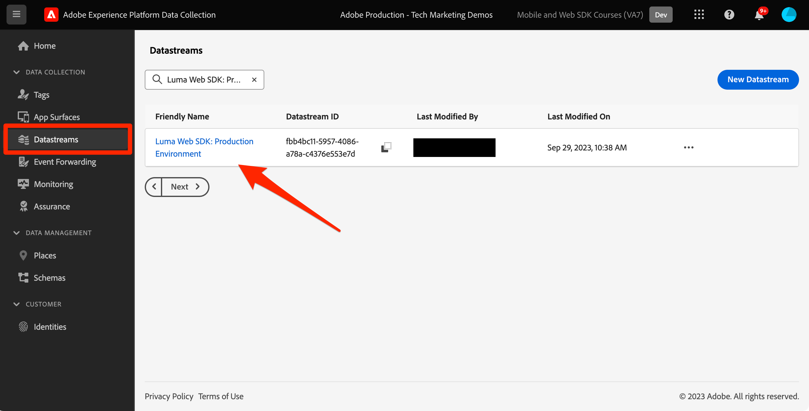

# Beslissingsbeheer instellen met Platform Web SDK

Leer hoe u Adobe Journey Optimizer Decision Management-functionaliteit implementeert met Platform Web SDK. Deze gids behandelt de basisvoorwaarden van het Beheer van het Besluit, gedetailleerde stappen voor configuratie, en een diepe duik in een gebruiksgeval dat op loyaliteitsstatus wordt gericht.

Met deze zelfstudie zijn Journey Optimizer-gebruikers uitgerust om functies voor Beslissingsbeheer te gebruiken, waardoor de personalisatie en relevantie van hun klantinteracties wordt vergroot.


## Leerdoelen

Aan het einde van deze les kunt u het volgende doen:

* Pak de kernconcepten van Beslissingsbeheer binnen de Adobe Journey Optimizer en de integratie ervan met de SDK van het Web van Adobe Experience Platform.

* Leer het geleidelijke proces om SDK van het Web voor Offer decisioning te vormen, die naadloze integratie met Journey Optimizer verzekeren.

* Onderzoek een gedetailleerd gebruiksgeval dat op loyaliteitsstatusaanbiedingen wordt geconcentreerd, die inzicht in het creëren van en het leiden van aanbiedingen, besluiten, en plaatsen effectief krijgt.

* U dient de essentiële voorwaarden en de implicaties daarvan binnen het kader van het beheer van de besluiten te kennen.

* Begrijp het belang van besluitvormingsregels, inzamelingsbepalende eigenschappen, en reserveaanbiedingen in het leveren van het juiste aanbod aan de juiste gebruiker.

* Schrap in geavanceerde onderwerpen zoals simulaties en de inzameling van de gegevens van de douanegebeurtenis, toelatend u om uw mechanismen van de aanbiedingslevering te testen, te bevestigen en te verbeteren.

## Vereisten

Om de lessen in deze sectie te voltooien, moet u eerst:

* Zorg ervoor dat uw organisatie toegang heeft tot Adobe Journey Optimizer Ultimate (Journey Optimizer en Offer decisioning) of Adobe Experience Platform en de invoegtoepassing Offer decisioning.

* Voltooi alle lessen voor aanvankelijke configuratie van het Web SDK van het Platform.

* Schakel uw organisatie in voor Edge-besluitvorming.

* Begrijp hoe te om een plaatsing te vormen, en plaats en activiteit IDs binnen uw Reikwijdte JSON van het Besluit te concretiseren.

## Beperkingen

Aanbiedingen op basis van gebeurtenissen worden momenteel niet ondersteund in Adobe Journey Optimizer. Als u een beslissingsregel maakt die is gebaseerd op een gebeurtenis, kunt u deze regel niet toepassen in een aanbieding.

## Toegang verlenen tot het beheer van besluiten

Om toegang tot de functionaliteit van het Beheer van het Besluit te verlenen, moet u het profiel van het a **Product** tot stand brengen en de overeenkomstige toestemmingen aan uw gebruikers toewijzen. [ Leer meer bij het beheren van de gebruikers en de toestemmingen van Journey Optimizer in deze sectie ](https://experienceleague.adobe.com/en/docs/journey-optimizer/using/access-control/privacy/high-low-permissions#decisions-permissions).

## De gegevensstroom configureren

De offer decisioning moet in de **datastream** configuratie worden toegelaten alvorens om het even welke activiteiten van het Beheer van het Besluit door het Web SDK van het Platform kunnen worden geleverd.

Om Offer decisioning in de gegevensstroom te vormen:

1. Ga naar de [ interface van de Inzameling van Gegevens ](https://experience.adobe.com/#/data-collection).

1. Voor de linkernavigatie, uitgezochte **Gegevensstromen**.

1. Selecteer de eerder gemaakte Luma Web SDK-gegevensstroom.

   

1. Selecteer **uitgeven** binnen de **Dienst van Adobe Experience Platform**.

    uit

1. Controleer de **Offer decisioning** doos.

    TOE

1. Selecteer **sparen**.

Dit zorgt ervoor dat de binnenkomende gebeurtenissen voor Journey Optimizer correct door **Edge van Adobe Experience Platform** worden behandeld.

## SDK configureren voor Beslissingsbeheer

Het Beheer van het besluit vereist extra stappen van SDK, afhankelijk van uw de implementatietype van SDK van het Web. Er zijn twee beschikbare opties om SDK voor Beslissingsbeheer te vormen.

* Zelfstandige SDK-installatie
   1. Configureer de handeling `sendEvent` met uw `decisionScopes` .

      ```javascript
      alloy("sendEvent", {
         ...
         "decisionScopes": [
            "[DECISION SCOPE 1]",
            "[DECISION SCOPE 2]"
         ]
      })
      ```

* Installatie van SDK-tags
   1. Ga naar de interface voor gegevensverzameling.

   1. Voor de linkernavigatie, uitgezochte **Markeringen**.

      

   1. Selecteer het **Bezit van de Markering**.

   1. Creeer uw **Regels**.
      * Voeg een van het Web SDK van het Platform **toe verzendt de actie van de Gebeurtenis** en voeg relevant `decisionScopes` aan de configuratie van die actie toe.

   1. Creeer en publiceer a **Bibliotheek** die alle relevante **Regels** bevat, **Elementen van Gegevens**, en **Uitbreidingen** u hebt gevormd.

## Terminologie

Ten eerste moet u de terminologie begrijpen die wordt gebruikt in de interface voor Beslissingsbeheer.

* **Aftappen**: Een beperking die dicteert hoe vaak een aanbieding verschijnt. Twee typen:
   * Totale uiteinden: Maximale tijden kunnen over het doelpubliek worden getoond.
   * Profielbijschrift: de tijden waarin een aanbieding aan een bepaalde gebruiker kan worden getoond.
* **Verzamelingen**: Subsets van aanbiedingen die door specifieke voorwaarden worden gegroepeerd die door een teller, bijvoorbeeld, aanbiedingscategorie worden geplaatst.
* **Besluit**: logica die de keus van een aanbieding dicteert.
* **Regel van het Besluit**: Beperkingen op aanbiedingen om de geschiktheid van een gebruiker te weten te komen.
* **In aanmerking komende Aanbieding**: Een aanbieding die de vooraf ingestelde beperkingen aanpast en aan een gebruiker kan worden getoond.
* **Beheer van het Besluit**: Het systeem om gepersonaliseerde aanbiedingen te creëren en te verdelen gebruikend bedrijfslogica en besluitvormingsregels.
* **Aanbiedingen van de Fallback**: De standaardaanbieding getoond wanneer een gebruiker niet voor om het even welke aanbiedingen in een inzameling kwalificeert.
* **Aanbieding**: Een marketing bericht met potentiële geschiktheidsregels die zijn kijkers bepalen.
* **Bibliotheek van de Aanbieding**: Een centrale bewaarplaats die aanbiedingen, besluiten, en bijbehorende regels beheert.
* **Gepersonaliseerde Aanbiedingen**: Aangepaste marketing berichten die op geschiktheidsbeperkingen worden gebaseerd.
* **Plaatsen**: Het plaatsen of het scenario waar een aanbieding aan een gebruiker wordt getoond.
* **Prioriteit**: Het rangschikken metrisch voor aanbiedingen die diverse beperkingen zoals geschiktheid en het maximum overwegen.
* **Vertegenwoordigingen**: Kanaalspecifieke informatie, bijvoorbeeld, plaats of taal, die de vertoning van een aanbieding begeleiden.

## Hoofdletters gebruiken - Loyalty&#39;s

In deze les, implementeert u een voorbeeld van het gebruik van beloningen van de Loyalty om het Beheer van het Besluit te begrijpen gebruikend SDK van het Web.

Met dit gebruiksscenario kunt u beter begrijpen hoe Journey Optimizer uw klanten de beste aanbieding kan bieden door gebruik te maken van de gecentraliseerde aanbiedingsbibliotheek en de beslissingsengine voor Beslissingsbeheer.

>[!NOTE]
>
> Aangezien deze zelfstudie gericht is op implementatoren, is het vermeldenswaard dat deze les substantieel interfacewerk in Journey Optimizer impliceert. Terwijl dergelijke interfacetaken typisch door marketers worden behandeld, kan het voor uitvoerders nuttig zijn om inzicht in het proces te krijgen, zelfs als zij niet verantwoordelijk voor de verwezenlijking van de campagne van het besluitvormingsbeheer op de lange termijn zijn.

## Onderdelen

Voordat u de aanbiedingen gaat maken, moet u verschillende onderdelen definiëren die aan de voorwaarde voldoen.

### Een Plaatsing maken voor aanbiedingen met een logo

**Plaatsingen** zijn containers die worden gebruikt om de aanbiedingen te tonen. In dit voorbeeld maakt u een plaatsing boven aan de Luminasite.

De lijst van plaatsen is toegankelijk in het **menu van Componenten**. Er zijn filters beschikbaar waarmee u plaatsingen kunt ophalen op basis van een specifiek kanaal of specifieke inhoud.


Voer de volgende stappen uit om de plaatsing te maken:

1. Klik **creëren plaatsing**.

   

1. Definieer de eigenschappen van de plaatsing:
   * **Naam**: De naam van de plaatsing. Laten wij de voorbeeldplaatsing *&quot;Banner van de Homepage&quot;roepen*.
   * **type van het Kanaal**: Het kanaal waarvoor de plaatsing wordt gebruikt. Laten we *&#39;Web&#39;* gebruiken omdat de aanbiedingen op de website van de Luma worden weergegeven.
   * **inhoudstype**: Het type van inhoud dat de plaatsing wordt toegestaan om te tonen: Tekst, HTML, de Verbinding van het Beeld, of JSON. U kunt *&quot;HTML&quot;* voor de aanbieding gebruiken.
   * **Beschrijving**: Een beschrijving van de plaatsing (facultatief).

    toe

1. Klik **sparen**.
1. Zodra de plaatsing wordt gecreeerd, toont het in de plaatsingslijst.
1. Selecteer de rij met uw nieuwe plaatsing en neem nota van plaatsidentiteitskaart, aangezien dit voor configuratie binnen uw Reikwijdte van het Besluit noodzakelijk kan zijn.

   

### Beslissingsregels voor de status van Loyalty

**de regels van het Besluit** specificeren de voorwaarden waaronder de aanbiedingen worden voorgesteld. In dit voorbeeld maakt u beslissingsregels voor verschillende aanbiedingen afhankelijk van de Loyalty-status van een gebruiker.

De lijst van besluitvormingsregels is toegankelijk in het **menu van Componenten**.

Voer de volgende stappen uit om de beslissingsregels te maken:

1. Navigeer aan het **Regels** lusje, en klik **creeer regel**.

   

1. Laat de eerste regel &quot;*Gouden Regel van de Status van de Loyalty*&quot;noemen. U kunt XDM-velden gebruiken om de regel te definiëren. De Bouwer van het Segment van Adobe Experience Platform **&#x200B;**&#x200B;is een intuïtieve interface die u kunt gebruiken om de regelvoorwaarden te bouwen.

   

1. Klik **sparen** om de regelvoorwaarde te bevestigen.
1. De onlangs bewaarde &#39;*Gouden Regel van de Status van de Loyalty*&#39; zal in de **lijst van Regels** tonen. Selecteer deze optie om de eigenschappen ervan weer te geven.

   

1. Creëer nu de resterende voorwaarden van de loyaliteitsaanbieding voor het gebruiksgeval.


### Verzamelingskwalificaties

**de bepalende eigenschappen van de Inzameling** staan u toe om aanbiedingen binnen de aanbiedingsbibliotheek gemakkelijk te organiseren en te zoeken. In dit voorbeeld, voegt u inzamelingsbepalers aan de aanbiedingen van de Beloning van de Loyalty toe om de aanbiedingsorganisatie te verbeteren.

De lijst van inzamelingsbepalers is toegankelijk in het **menu van Componenten**.

Voer de volgende stappen uit om de verzamelingskwalificatie Loyalty Rewards te maken:

1. Navigeer aan de **kwalificeerders van de Inzameling** tabel, en klik **creeer inzamelingsbepaler**.

   

1. Laat de inzamelingskwalificatie &quot;*Beloningen van de Loyalty* noemen

   

1. Het nieuwe inzamelingsbepaler zou nu in het **bepalende gebied van de Inzameling** tabel moeten tonen

## Aanbiedingen

Nu is het tijd om de Loyalty Rewards aanbiedingen te creëren.

De lijst van aanbiedingen is toegankelijk in het **menu van Aanbiedingen**.


### Aanbiedingen maken voor verschillende kwaliteitstips

Begin met het maken van persoonlijke aanbiedingen voor de verschillende Luma Loyalty Tiers.

Om de eerste **aanbieding** tot stand te brengen, volg deze stappen:

1. Klik **creëren aanbieding**, dan selecteren **Gepersonaliseerde aanbieding**.

1. Laten wij de eerste aanbieding noemen &quot;*Luma Loyalty Rij - Goud*&#39;. Je moet een begin-/einddatum en -tijd voor dit voorstel opgeven. U zou het **inzamelingsbepalende** &quot;*Loyalty beloningen*&quot;aan de aanbieding ook moeten associëren, toestaand u om binnen de **Bibliotheek van de Aanbieding** beter te organiseren. Daarna, klik **daarna**.

   

1. Nu moet u **vertegenwoordiging** toevoegen om te bepalen waar de aanbiedingsvertoningen. Laten wij het **Webkanaal** kiezen. Laten wij ook kiezen de &quot;*Banner van de Homepage* &quot; **plaatsing** u eerder vormde. De geselecteerde **plaatsing** is HTML-type, zodat kunt u HTML, JSON, of inhoud van de TEKST direct aan de redacteur toevoegen om de aanbieding te bouwen gebruikend het **3&rbrace; radioknoop van de Douane &lbrace;.**

    toe

1. Bewerk direct de aanbiedingsinhoud met de **Redacteur van de Uitdrukking**. U kunt HTML-, JSON- of TEXT-inhoud aan deze plaatsing toevoegen. Verzeker u de correcte **wijze** bij de bodem van de redacteur selecteert, afhankelijk van uw inhoudstype. U kunt **ook raken bevestigt** om er geen fouten te verzekeren.

    toe

1. U kunt ook de Expressieeditor gebruiken om kenmerken op te halen die zijn opgeslagen in Adobe Experience Platform. Laten we de voornaam van een profiel toevoegen aan de inhoud van het aanbod om de loyaliteitsleden op een 1:1-niveau beter te personaliseren.

   

1. Voeg beperkingen toe om de aanbieding aan profielen slechts te tonen die voor de &quot;*Gouden Regel van de Status van de Loyalty*&quot;kwalificeren.

    toe

1. Zodra u klaar bent met het herzien van uw aanbieding, klik **Afwerking**. Selecteer **sparen en keur** goed.

Maak nu de rest van de aanbiedingen voor de verschillende Luminantiegrenzen

### Terugvalvoorstellen

U wilt nog steeds een aanbieding doen aan bezoekers van de Luministensite die geen Luma Loyalty zijn. Om dit te doen, kunt u a **fallback aanbieden** voor de campagne vormen.

Ga als volgt te werk om de fallback-aanbieding te maken:

1. Klik **creëren aanbieding**, dan selecteren de uitgezochte **aanbieding van de Fallback**.
   <!--
      
   -->
1. Laat de fallback aanbieding &quot;*niet-Luma Loyalty*&quot;noemen. U kunt het eerder gecreeerde **inzamelingsbepalingsbepaler**, &quot;*Loyalty beloningen*&quot;aan de reserveaanbieding voor gemak van aanbiedingsorganisatie ook associëren.
   <!--
      
   -->
1. Voeg de inhoud van de reserveaanbieding aan de **Redacteur van de Uitdrukking** toe. U kunt HTML-, JSON- of TEXT-inhoud aan deze plaatsing toevoegen. Verzeker u de correcte **wijze** bij de bodem van de redacteur selecteert, afhankelijk van uw inhoudstype. U kunt **ook raken bevestigt** om er geen fouten te verzekeren.
   <!--
      
   -->
1. Als alles correct wordt gevormd, toon **Afwerking** en dan **sparen en keur** goed.
<!--
   
-->

## Besluiten

**Besluiten** zijn containers voor aanbiedingen die de beste aanbieding beschikbaar voor een klant, afhankelijk van het doel kiezen.

De lijst van besluiten is beschikbaar in het **1&rbrace; lusje van Besluiten {van het** 3} menu van Aanbiedingen.**&#x200B;**
<!--
   
-->

### Beslissingen maken voor aanbiedingen van royalty&#39;s

Laten we een beslissing maken voor de Luma Loyalty Rewards use case.

Voer de volgende stappen uit om de beslissing te maken:

1. Klik **creeer besluit**.
   <!--
      
   -->
1. Laten wij het besluit roepen, &quot;*Aanbiedingen van de Loyalty van december Luma*&#39;. De aanbiedingen moeten één maand lopen, dus laten we dat hier specificeren.
   <!--
      
   -->
1. Nu, moet u het **besluitvormingswerkingsgebied** bepalen. Selecteer eerst een plaatsing. U kunt eerder gecreeerd gebruiken &quot;*Banner van de Homepage*&quot;.
   <!--
      
   -->
1. Daarna moet u **evaluatiecriteria** voor het besluitvormingswerkingsgebied toevoegen. Klik **toevoegen** en kies eerder gecreeerd &#39; *Beloningen van de Loyalty*&#39; **inzameling, die alle loyaliteitsaanbiedingen bevat om te overwegen.
   <!--
      
   -->
1. Binnen de inzameling &quot;*van de Beloningen van de Loyalty*&quot;, kunt u het toelatingsgebied gebruiken om de aanbiedingslevering tot een ondergroep van bezoekers van de Luma te beperken. In dit geval wilt u echter dat elke bezoeker een van de aanbiedingen ontvangt. Herinner me, vormde u a **fallback aanbieding** voor alle niet loyaliteitsbezoekers. Stel de geschiktheid in op Geen.
   <!--
      
   -->
1. Ook, kunt u het **het rangschikken methode** gebied gebruiken om de beste aanbieding voor elke bezoeker van de Luma te selecteren, als de veelvoudige aanbiedingen voor de gebruiker/plaatsingscombinatie geschikt zijn. Voor dit gebruiksgeval, kunt u de **prioritaire** methode van de Aanbieding gebruiken, die de waarden gebruikt die in de aanbiedingen worden bepaald om de beste aanbieding te dienen.
   <!--
      
   -->
1. Voeg nu de **fallback aanbieding** aan het besluit toe. Herinnering dat de fallback-aanbieding het standaardaanbod is dat wordt weergegeven aan Luministers als ze niet onder een Luma Loyalty-publiek vallen. Selecteer &quot;*Loyalty niet-Luma*&quot;van de lijst van beschikbare reserveaanbiedingen voor de &quot;*Banner van de Homepage*&quot;plaatsing.
   <!--
      
   -->
1. Voordat u de beslissing activeert, bekijken we eerst het bereik van de beslissing, de fallback-aanbieding, een voorvertoning van de beschikbare aanbiedingen en een schatting van de gekwalificeerde profielen. Zodra alles goed kijkt, kunt u **Afwerking** en **klikken sparen en** activeren.
<!--
   
-->

## Simulaties

Als beste praktijken, zou u de Luma het besluitvormingslogica van de Loyalty moeten bevestigen om ervoor te zorgen dat de correcte aanbiedingen aan het juiste loyaliteitspubliek worden geleverd. U kunt deze bevestiging doen door **testprofielen** te gebruiken. Het is ook een goed idee om wijzigingen in aanbiedingen te testen via testprofielen voordat nieuwe aanbiedingsversies naar de productie worden verplaatst.

Om met het testen te beginnen, selecteer het **&#x200B;**&#x200B;lusje van Simulaties van het **3&rbrace; menu van Aanbiedingen &lbrace;.**

### Loyalty-aanbiedingen testen

1. Selecteer een testprofiel voor de simulatie. Klik **leiden profiel**. [ om een nieuw testprofiel voor aanbieding het testen tot stand te brengen of aan te wijzen, deze gids ](https://experienceleague.adobe.com/en/docs/journeys/using/building-journeys/about-journey-building/creating-test-profiles#create-test-profiles-csv) te volgen.
   <!--
      
   -->
1. Voeg een of meer testprofielen toe aan de simulatie en sla uw selectie op. Voor het testen van het gebruiksgeval, zou u testprofielen moeten hebben die voor elk Luma loyaliteitpubliek worden gevormd.
   <!--
      
   -->
1. Selecteer het beslissingsbereik dat u wilt testen. Selecteer **toevoegt besluitvormingswerkingsgebied**.
   <!--
      
   -->
1. Selecteer eerder gecreeerd &quot;*Banner van de Homepage*&quot;plaatsing.
   <!--
      
   -->
1. De beschikbare besluiten worden getoond, selecteren eerder gecreeerd &quot;*Luma van de Luma het besluit van de Aanbieding van de Luma*, en de klik **voegt** toe.
   <!--
      
   -->
1. Zodra u een testprofiel selecteert, klik **resultaten van de Mening**. De beste beschikbare aanbieding wordt getoond aan het geselecteerde testprofiel voor de &quot;*Aanbiedingen van de Loyalty van de Luma van december*&quot;besluit.
   <!--
      
   -->
1. Selecteer een verschillend testprofiel, en klik **resultaten van de Mening**. In het ideale geval ziet u een andere gesimuleerde aanbieding die overeenkomt met de loyaliteitslaag van het testprofiel.

## Beslissingsbeheervalidering met Adobe Experience Platform Debugger

De **Adobe Experience Platform Debugger** uitbreiding, beschikbaar voor zowel Chrome als Firefox, analyseert uw Web-pagina&#39;s om kwesties in de implementatie van de oplossingen van Adobe Experience Cloud te identificeren.

U kunt debugger op de plaats van de Luma gebruiken om de besluitvormingslogica in productie te bevestigen. Deze bevestiging is een goede praktijk zodra de het gebruiksgeval van de Beloningen van de Loyalty in werking is, om ervoor te zorgen dat alles correct wordt gevormd.

[ Leer hoe te om debugger in uw browser te vormen gebruikend de gids hier ](https://experienceleague.adobe.com/en/docs/platform-learn/data-collection/debugger/overview).

De validatie starten met de foutopsporing:

1. Navigeer naar de webpagina Luma met de plaatsing van de aanbieding.
   <!--
      
   -->
1. Terwijl op de Web-pagina, open **debugger van Adobe Experience Platform**.
   <!--
      
   -->
1. Navigeer aan **Samenvatting**. Verifieer dat **identiteitskaart DataStream** de **datastream** in **de Inzameling van Gegevens van de Adobe** aanpast waarvoor u Offer decisioning toeliet.
   <!--
      
   -->
1. Onder **Oplossingen** navigeer aan het **Web SDK van het Experience Platform**.
   <!--
      
   -->
1. Binnen het **lusje van de Configuratie**, Knevel op **toelaten het Zuiveren**. Dit laat registreren voor de zitting binnen een **1&rbrace; zitting van de Verzekering van Adobe Experience Platform toe.**
   <!--
      
   -->
1. U kunt dan login aan de plaats met diverse Luma loyaliteitsrekeningen, en gebruiken debugger om de verzoeken te bevestigen die naar het **netwerk van Adobe Experience Platform Edge** worden verzonden. Al deze verzoeken zouden in **Verzekering** voor logboek het volgen moeten worden gevangen.
<!--
   
-->

[Volgende: ](setup-consent.md)

>[!NOTE]
>
>Bedankt dat u tijd hebt geïnvesteerd in het leren over de SDK van Adobe Experience Platform Web. Als u vragen hebt, algemene terugkoppelen wilt delen, of suggesties over toekomstige inhoud hebben, gelieve hen op deze [ Communautaire besprekingspost van de Experience League te delen ](https://experienceleaguecommunities.adobe.com/t5/adobe-experience-platform-data/tutorial-discussion-implement-adobe-experience-cloud-with-web/td-p/444996)
