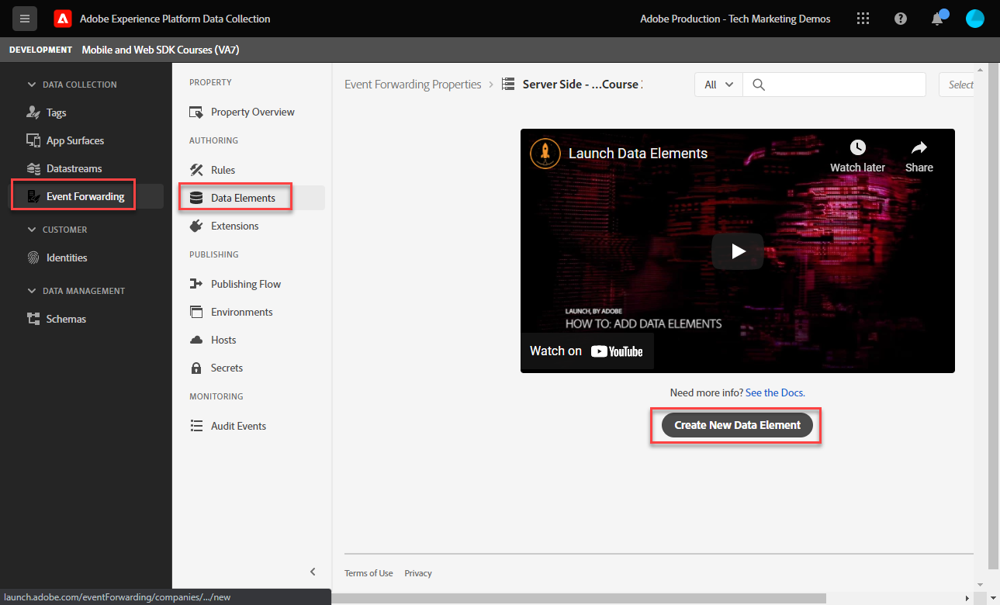
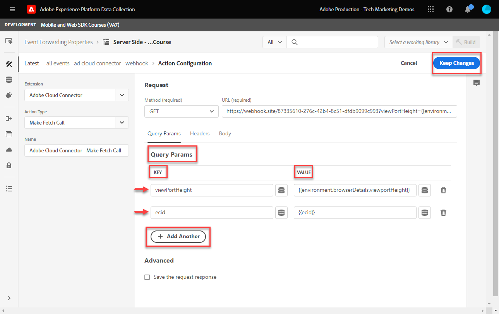

# Een eigenschap voor het doorsturen van gebeurtenissen instellen

Leer hoe te om gebeurtenis-door:sturen bezit te gebruiken gebruikend de gegevens van SDK van het Web van het Experience Platform.

Het door:sturen van de gebeurtenis is een nieuw type van bezit beschikbaar in de Inzameling van Gegevens. Het door:sturen van gebeurtenissen geeft u de capaciteit om gegevens naar derde, niet-Adobe verkopers rechtstreeks van de Edge Network van Adobe Experience Platform in plaats van traditionele cliënt-zijbrowser te verzenden. Kom meer over de voordelen van gebeurtenis te weten door:sturen in [Overzicht van doorsturen van gebeurtenissen](https://experienceleague.adobe.com/en/docs/experience-platform/tags/event-forwarding/overview).

Om gebeurtenis te gebruiken die in Adobe Experience Platform door:sturen, moeten de gegevens naar de Edge Network van Adobe Experience Platform eerst worden verzonden gebruikend één of meerdere van de volgende drie opties:

* [Adobe Experience Platform Web SDK](overview.md)
* [Adobe Experience Platform Mobile SDK](https://developer.adobe.com/client-sdks/documentation/)
  <!--* [Server-to-Server API](https://experienceleague.adobe.com/en/docs/audience-manager/user-guide/api-and-sdk-code/dcs/dcs-apis/dcs-s2s)-->

>[!NOTE]
>De het Web SDK van het Platform en Mobiele SDK van het Platform vereisen geen plaatsing door markeringen, echter, wordt het gebruiken van markeringen om deze SDKs op te stellen geadviseerd.

Na de voltooiing van de vorige lessen in dit leerprogramma, zou u gegevens naar de Edge Network van het Platform moeten verzenden gebruikend het Web SDK. Zodra het gegeven in de Edge Network van het Platform is, kunt u gebeurtenis toelaten door:sturen en een gebeurtenis-door:sturen bezit gebruiken om gegevens naar niet-Adobe oplossingen te verzenden.

## Leerdoelstellingen

Aan dit eind van deze les, zult u kunnen:

* Een eigenschap voor het doorsturen van gebeurtenissen maken
* Koppel een gebeurtenis-door:sturen bezit aan een gegevensbestand van SDK van het Web van het Platform
* Begrijp de verschillen tussen de gegevenselementen en de regels van het markeringsbezit en gebeurtenis-door:sturen bezitsgegevenselementen en regels
* Een gegevenselement voor het doorsturen van gebeurtenissen maken
* Vorm een gebeurtenis-door:sturen regel
* Valideer een gebeurtenis-door:sturen bezit met succes verzendt gegevens

## Vereisten

* Een softwarelicentie die het doorsturen van gebeurtenissen omvat. Het doorsturen van gebeurtenissen is een betaalde eigenschap van de Inzameling van Gegevens. Neem contact op met het accountteam van uw Adobe voor meer informatie.
* Het door:sturen van de gebeurtenis toegelaten in uw organisatie van het Experience Cloud.
* Gebruikersmachtiging voor het doorsturen van gebeurtenissen. (In [Admin Console](https://adminconsole.adobe.com/), onder het Adobe Experience Platform Launch-product, machtigingsitems voor[!UICONTROL Platforms] > [!UICONTROL Edge] en alle [!UICONTROL Property Rights]). Wanneer u het geneesmiddel heeft gekregen, zie [!UICONTROL Event Forwarding] in de linkernavigatie van de interface van de Gegevensverzameling:
  

* Adobe Experience Platform Web of Mobile SDK wordt geconfigureerd om gegevens naar Edge Network te verzenden. U moet de volgende lessen uit deze zelfstudie hebben geleerd:

   * Eerste configuratie

      * [Een XDM-schema configureren](configure-schemas.md)
      * [Naamruimte configureren](configure-identities.md)
      * [Een gegevensstroom configureren](configure-datastream.md)

   * Configuratie van tags

      * [Web SDK-extensie installeren](install-web-sdk.md)
      * [Gegevenselementen maken](create-data-elements.md)
      * [Identiteiten maken](create-identities.md)
      * [Tagregels maken](create-tag-rule.md)
      * [Valideren met Adobe Experience Platform Debugger](validate-with-debugger.md)

## Een eigenschap voor het doorsturen van gebeurtenissen maken

Begin door een gebeurtenis-door:sturen bezit te creëren:

1. Open de [Interface voor gegevensverzameling](https://experience.adobe.com/#/data-collection)
1. Selecteren **[!UICONTROL Event Forwarding]** van de linkernavigatie
1. Selecteer **[!UICONTROL New Property]**.
   

1. Geef de eigenschap een naam. In dit geval `Server-Side - Web SDK Course`

1. Selecteer **[!UICONTROL Save]**.
   

## De gegevensstroom configureren

Voor gebeurtenis door:sturen om de gegevens te gebruiken u naar het netwerk van de Rand verzendt, moet u het onlangs gecreeerde gebeurtenis-door:sturen bezit aan de zelfde gegevensstroom verbinden die wordt gebruikt om gegevens naar de oplossingen van de Adobe te verzenden.

Om Doel in de gegevensstroom te vormen:

1. Ga naar [Gegevensverzameling](https://experience.adobe.com/#/data-collection){target="blank"} interface
1. Selecteer in de linkernavigatie de optie **[!UICONTROL Datastreams]**
1. Selecteer de eerder gemaakte `Luma Web SDK: Development Environment` datastream

   

1. Selecteren **[!UICONTROL Add Service]**
   
1. Selecteren **[!UICONTROL Event Forwarding]** als de **[!UICONTROL Service]**

1. Onder de **[!UICONTROL Property ID]** dropdown, selecteer de naam u aan uw gebeurtenis-door:sturen bezit gaf, in dit geval `Server-Side - Web SDK Course`

1. Onder de **[!UICONTROL Environment ID]** dropdown, selecteer het markeringsmilieu u de gebeurtenis door:sturen milieu aan verbindt, in dit geval `Development`

   >[!TIP]
   >
   >    Om gegevens naar een gebeurtenis te verzenden die milieu buiten de org van de Adobe door:sturen **[!UICONTROL Manually enter IDs]** en plak in een id. Identiteitskaart wordt verstrekt wanneer u een gebeurtenis-door:sturen bezit creeert.

1. Selecteer **[!UICONTROL Save]**.

   

Herhaal deze stappen voor het opvoeren en productie gegevensstromen wanneer u bereid bent om uw veranderingen door de het publiceren stroom te bevorderen.

## Gegevens doorsturen van de Edge Network Platform naar een oplossing zonder Adobe

In deze oefening zult u leren hoe te opstelling een gebeurtenis-door:sturen gegevenselement, een gebeurtenis-door:sturen regel vormen, en het gebruiken van een derde genoemd hulpmiddel bevestigen [Webhaak.site](https://webhook.site/).

>[!NOTE]
>
>Een webhaak is een manier om verschillende systemen in halfreal-time te integreren. [Webhaak.site](https://webhook.site/) is een hulpprogramma van derden waarmee u eenvoudig binnenkomende HTTP-aanvragen of e-mails kunt inspecteren, testen en automatiseren (met de visuele Eigen Acties Builder of WebHaakScript).

>[!IMPORTANT]
>
>U moet reeds gegevenselementen en in kaart gebrachte gegevenselementen aan een Voorwerp XDM, evenals gevormde markeringsregels hebben gecreeerd en die veranderingen binnen een bibliotheek aan een markeringsmilieu bouwt om verder te werk te gaan. Als dat niet het geval is, raadpleegt u de **Configuratie van tags** in de [voorwaarden](setup-event-forwarding.md#prerequisites) sectie. Die stappen zorgen ervoor dat het gegeven wordt verzonden naar de Edge Network van het Platform, en van daar kunt u een gebeurtenis-door:sturen bezit vormen om gegevens aan een niet-Adobe oplossing door:sturen.

### Een gegevenselement voor het doorsturen van gebeurtenissen maken

Het XDM voorwerp u eerder vormde gebruikend de de markeringsuitbreiding van SDK van het Web van het Platform wordt de gegevensbron voor gegevenselementen in een gebeurtenis-door:sturen bezit. U gebruikt de zelfde gegevens die u reeds in het markeringsbezit als gegevensbron voor gebeurtenis-door:sturen hebt gevormd.

>[!IMPORTANT]
>
>Er is één zeer belangrijk syntaxisverschil wanneer het van verwijzingen voorzien van gebieden XDM in gebeurtenis door:sturen tegenover andere contexten. Om gegevens in een gebeurtenis-door:sturen bezit van verwijzingen te voorzien, moet de weg van het gegevenselement omvatten `arc.event` prefix:
>
> * `arc` staat voor Adobe Response Context.
> * Bijvoorbeeld: `arc.event.xdm.web.webPageDetails.URL`
>
>Als dit pad onjuist is opgegeven, worden geen gegevens verzameld.

In deze oefening, zult u de browser viewport hoogte en identiteitskaart van het Experience Cloud van het Voorwerp XDM aan een webhaak door:sturen. Het XDM-veldpad wordt bepaald door het XDM-schema dat wordt gemaakt tijdens het [Een XDM-schema configureren](configure-schemas.md) les.

>[!TIP]
>
>U kunt het XDM-objectpad ook vinden met behulp van de netwerkhulpprogramma&#39;s van uw webbrowser, door te filteren op `/ee` verzoeken, het baken openen [!UICONTROL **Payload**] en naar de gewenste variabele te gaan. Klik vervolgens met de rechtermuisknop en selecteer &quot;Pad eigenschap kopiëren&quot;. Hier volgt een voorbeeld voor de Viewport-hoogte van de browser:
> 

1. Ga naar de **[!UICONTROL Event Forwarding]** eigenschap die u onlangs hebt gemaakt

1. Selecteer in de linkernavigatie de optie **[!UICONTROL Data Elements]**

1. Selecteren tot **[!UICONTROL Create New Data Element]**

   

1. **[!UICONTROL Name]** het gegevenselement `environment.browserDetails.viewportHeight`

1. Onder **[!UICONTROL Extension]**, verlaten `CORE`

1. Onder **[!UICONTROL Data Element Type]**, selecteert u `Path`

1. Typ het XDM-objectpad dat de weergavehoogte van de browser bevat `arc.event.xdm.environment.browserDetails.viewportHeight`

1. Selecteren **[!UICONTROL Save]**

   

1. Een ander gegevenselement maken

1. **[!UICONTROL Name]** het `ecid`

1. Onder **[!UICONTROL Extension]**, verlaten `CORE`

1. Onder **[!UICONTROL Data Element Type]**, selecteert u `Path`

1. Typ het XDM-objectpad dat de Experience Cloud-id bevat `arc.event.xdm.identityMap.ECID.0.id`

1. Selecteren **[!UICONTROL Save]**

   

   >[!CAUTION]
   >
   > Zorg ervoor dat u de `arc.event.` in het pad. Zorg er ook voor dat u de exacte hoofdletter van het veld XDM-object volgt. De naamruimte ECID moet zich in alle hoofdletters bevinden.

   >[!TIP]
   >
   >Wanneer u met uw eigen website werkt, kunt u het XDM-objectpad vinden met de netwerkgereedschappen van uw webbrowser en filteren op `/ee` verzoeken, het baken openen [!UICONTROL **Payload**] en naar de gewenste variabele te gaan. Klik vervolgens met de rechtermuisknop en selecteer &quot;Pad eigenschap kopiëren&quot;. Hier volgt een voorbeeld voor de Viewport-hoogte van de browser:
   > 

### Adobe Cloud Connector-extensie installeren

Als u gegevens naar locaties van derden wilt verzenden, moet u eerst het dialoogvenster [!UICONTROL Adobe Cloud Connector] extensie.

1. Selecteren **[!UICONTROL Extensions]** op de linkernavigatie

1. Selecteer de **[!UICONTROL Catalog]** tab

1. Zoeken naar **[!UICONTROL Adobe Cloud Connector]**, selecteert u **[!UICONTROL Install]**

   

Er is geen extensieconfiguratie nodig. Met deze extensie kunt u nu gegevens doorsturen naar een oplossing zonder Adobe!

### Creeer een gebeurtenis-door:sturen regel

Er zijn een paar belangrijkste verschillen tussen het vormen regels in een markeringsbezit en een regel in een gebeurtenis-door:sturen bezit:

* **[!UICONTROL Events]&amp;[!UICONTROL Conditions]**:

   * **Tags**: Alle regels worden geactiveerd door een gebeurtenis die bijvoorbeeld in de regel moet worden opgegeven. `Library Loaded - Page Top`. Voorwaarden zijn optioneel.
   * **Gebeurtenis doorsturen**: Er wordt aangenomen dat elke gebeurtenis die naar het Edge-netwerk van het platform wordt verzonden, een trigger is voor het doorsturen van gegevens. Er zijn dus geen [!UICONTROL Events] die in gebeurtenis-door:sturen regels moeten worden geselecteerd. Om te beheren welke gebeurtenissen een gebeurtenis-door:sturen regel teweegbrengen, moet u voorwaarden vormen.

* **Tokenisering gegevenselement**:

   * **Tags**: Namen van gegevenselementen worden gekoppeld aan een `%` aan het begin en einde van de naam van het gegevenselement wanneer deze in een regel wordt gebruikt. Bijvoorbeeld: `%viewportHeight%`.

   * **Gebeurtenis doorsturen**: Namen van gegevenselementen worden gekoppeld aan `{{` aan het begin en `}}` aan het eind van de naam van het gegevenselement wanneer gebruikt in een regel. Bijvoorbeeld: `{{viewportHeight}}`.

* **Reeks handelingen**:

   * De sectie van Acties van een gebeurtenis die regel door:sturen wordt altijd opeenvolgend uitgevoerd. Zorg ervoor dat de volgorde van de handelingen correct is wanneer u een regel opslaat. Deze uitvoeringsvolgorde kan niet asynchroon worden uitgevoerd, zoals met tags.

<!--
  * **Tags**: Rule actions can easily be reordered using drag-and-drop functionality.
  * **Event forwarding**: Rule actions are always executed sequentially. Make sure the order of actions is correct when you save a rule.
-->

Om een regel te vormen om gegevens aan uw webhaak door:sturen, moet u uw persoonlijke webhaak eerst verkrijgen:

1. Ga naar [Webhaak.site](https://webhook.site)

1. Zoeken **Uw unieke URL**, zult u dit als verzoek URL in uw gebeurtenis-door:sturen regel gebruiken

1. Selecteren **[!UICONTROL Copy to clipboard]**

1. Laat dit venster open aangezien u de gebeurtenis kunt bevestigen die gegevens in real time door:sturen die door Webhaak wordt gevangen

   

1. Terug **[!UICONTROL Data Collection]** > **[!UICONTROL Event Forwarding]** > **[!UICONTROL Rules]** van de linkernavigatie

1. Selecteren **[!UICONTROL Create New Rule]**

   

1. Naam geven `all events - ad cloud connector - webhook`

1. Een handeling toevoegen

1. Onder **[!UICONTROL Extension]**, selecteert u **[!UICONTROL Adobe Cloud Connector]**

1. Onder **[!UICONTROL Action Type]**, selecteert u **[!UICONTROL Make Fetch Call]**

1. Plak de URL van uw webhaak in het dialoogvenster **[!UICONTROL URL]** field

   

1. Onder **[Zoekparameters]**, voegt u beide gegevenselementen toe die u eerder hebt gemaakt.

1. Op de **[!UICONTROL Key]** kolomtype in `viewPortHeight`. Op de **[!UICONTROL Value]** kolom, voert u de `{{environment.browserDetails.viewportHeight}}` gegevenselement door het in te typen of te selecteren uit het pictogram van de gegevenselementkiezer

1. Selecteren [!UICONTROL **+ Nog een toevoegen**] een andere queryparameter toevoegen

1. Op de **[!UICONTROL Key]** kolomtype in `ecid`. Voer in de kolom Waarde de waarde in `{{ecid}}` gegevenselement

1. Selecteren **[!UICONTROL Keep Changes]**

   

1. Je regel moet er hieronder uitzien

1. Selecteren **[!UICONTROL Save]**

   

### De bibliotheek maken en bouwen

Creeer een bibliotheek en bouw alle veranderingen in uw gebeurtenis-door:sturen ontwikkelomgeving zoals u normaal in een markeringsbezit zou doen.

>[!NOTE]
>
>Als u het Staging en de productie gebeurtenis-door:sturen eigenschappen aan uw gegevensstroom niet hebt verbonden, zult u het milieu van de Ontwikkeling als enige optie zien om een bibliotheek aan te bouwen.

## Valideer gebeurtenis-door:sturen regel

Nu kunt u uw gebeurtenis-door:sturen bezit bevestigen gebruikend de Debugger van het Platform, en WebHaak.site:

1. Voer de volgende stappen uit om [schakelen tussen de tagbibliotheek](validate-with-debugger.md#use-the-experience-platform-debugger-to-map-to-your-tag-property) op de [Luma-demo-site](https://luma.enablementadobe.com/content/luma/us/en/men.html) aan het de markeringsbezit van SDK van het Web waaraan u uw gebeurtenis-door:sturen bezit in de gegevensstroom in kaart bracht.

1. Voordat u de pagina opnieuw laadt, opent u Foutopsporing op Experience Platform **[!UICONTROL Logs]** van de linkernavigatie

1. Selecteer de **[!UICONTROL Edge]** tab, dan selecteren **[!UICONTROL Connect]** om de verzoeken van de Edge Network van het Platform te bekijken

   

1. De pagina opnieuw laden

1. U zult extra verzoeken zien die u zicht in de server-zijverzoeken geven die door de Edge Network van het Platform aan WebHook worden verzonden

1. De aanvraag om validatie te activeren is die waarin de volledig samengestelde URL wordt weergegeven die door het Edge-netwerk wordt verzonden

   

1. Noteer de parameters viewPortHeight en ecid voor de queryreeks

   

1. Ze komen overeen met de gegevens in het XDM-object

   

1. Ten slotte valideert u de overeenkomende gegevens in [Webhaak.site](https://webhook.site) en ook door uw open venster van Webhaak te bekijken

   

Gefeliciteerd! U hebt gebeurtenis gevormd door:sturen!

[Volgende: ](conclusion.md)

>[!NOTE]
>
>Bedankt dat u tijd hebt geïnvesteerd in het leren over de SDK van Adobe Experience Platform Web. Als u vragen hebt, algemene feedback wilt delen of suggesties voor toekomstige inhoud hebt, kunt u deze delen over deze [Experience League Communautaire discussiestuk](https://experienceleaguecommunities.adobe.com/t5/adobe-experience-platform-launch/tutorial-discussion-implement-adobe-experience-cloud-with-web/td-p/444996)
