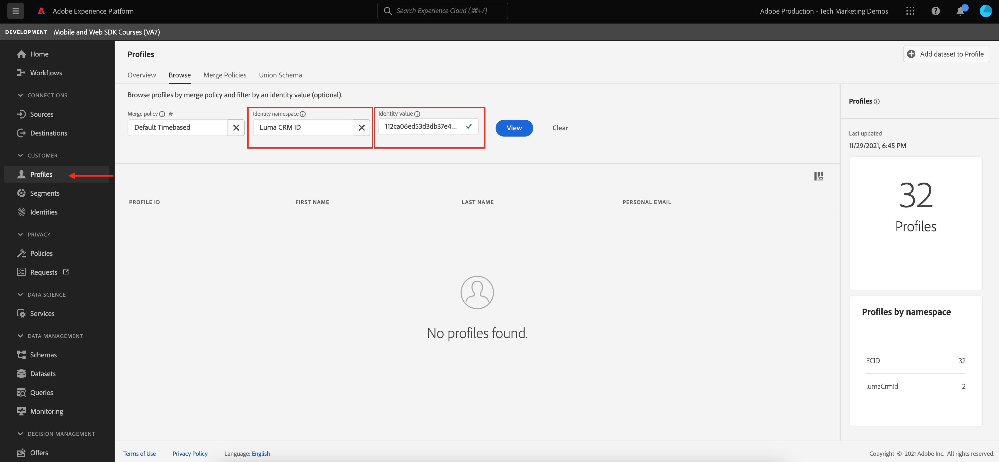
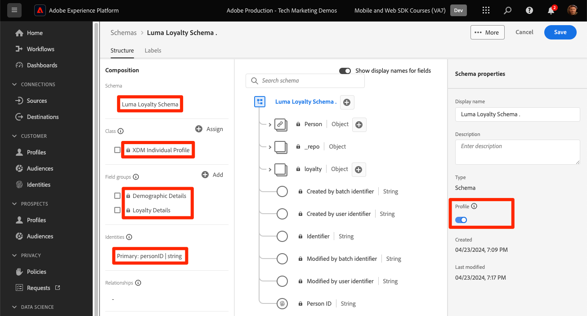
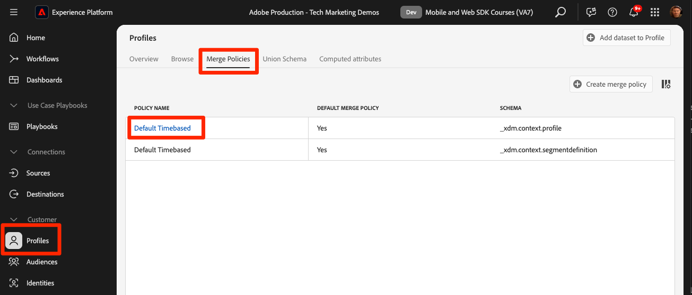
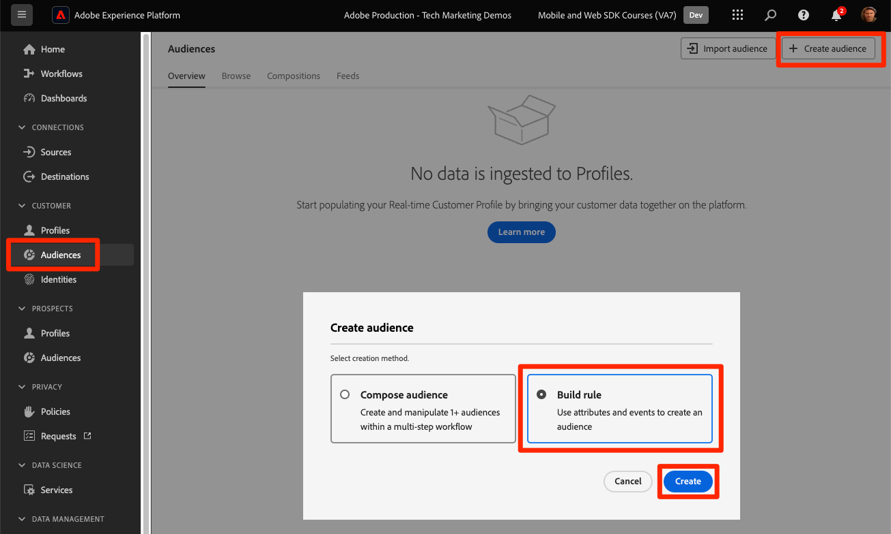

# Gegevens streamen naar Experience Platform met Web SDK

Leer hoe u webgegevens kunt streamen naar Adobe Experience Platform met Platform Web SDK.

Experience Platform is de ruggengraat van alle nieuwe Experience Cloud-toepassingen, zoals Adobe Real-Time Customer Data Platform, Adobe Customer Journey Analytics en Adobe Journey Optimizer. Deze toepassingen worden ontworpen om het Web SDK van het Platform als hun optimale methode van Webgegevensinzameling te gebruiken.

Experience Platform gebruikt hetzelfde XDM-schema dat u eerder hebt gemaakt om gebeurtenisgegevens van de Luma-website vast te leggen. Wanneer die gegevens naar Platform Edge Network worden verzonden, kan de configuratie van de datastream het naar Experience Platform doorsturen.

## Leerdoelstellingen

Aan het eind van deze les, zult u kunnen:

* Een gegevensset maken in Adobe Experience Platform
* Configureer de gegevensstroom om Web SDK-gegevens naar Adobe Experience Platform te verzenden
* Streaming webgegevens inschakelen voor realtime klantprofiel
* Bevestig de gegevens zowel in de dataset van het Platform als in het Profiel van de Klant in real time zijn geland
* De gegevens van het steekproefloyaliteitsprogramma in Platform opnemen
* Een eenvoudig platformpubliek maken

## Vereisten

Om deze les te voltooien, moet u eerst:

* Toegang hebben tot een Adobe Experience Platform-toepassing zoals Real-Time Customer Data Platform, Journey Optimizer of Customer Journey Analytics
* Voltooi de vroegere lessen in de Aanvankelijke secties van de Configuratie van de Configuratie en van de Markeringen van dit leerprogramma.

>[!NOTE]
>
>Als u geen toepassingen van het Platform hebt, kunt u deze les overslaan of lezen.

## Een gegevensset maken

Alle gegevens die met succes in Adobe Experience Platform worden opgenomen, blijven binnen het datumpeer als datasets voortbestaan. A [ dataset ](https://experienceleague.adobe.com/nl/docs/experience-platform/catalog/datasets/overview) is een opslag en beheersconstructie voor een inzameling van gegevens, typisch een lijst die een schema (kolommen) en gebieden (rijen) bevat. Datasets bevatten ook metagegevens die verschillende aspecten van de gegevens beschrijven die ze opslaan.

Stel een gegevensset in voor uw Luma-webgebeurtenisgegevens:

1. Ga naar [ Experience Platform ](https://experience.adobe.com/platform/) of [ Journey Optimizer ](https://experience.adobe.com/journey-optimizer/) interface
1. Bevestig dat u zich in de ontwikkelingssandbox bevindt die u voor deze zelfstudie gebruikt
1. **[!UICONTROL Data Management > Datasets]** openen vanuit de linkernavigatie
1. Selecteren **[!UICONTROL Create dataset]**

   

1. Selecteer de optie **[!UICONTROL Create dataset from schema]**

   

1. Selecteer het `Luma Web Event Data` die schema in de [ wordt gecreeerd vroegere les ](configure-schemas.md) en selecteer dan **[!UICONTROL Next]**

   

1. Geef een **[!UICONTROL Name]** en optioneel **[!UICONTROL Description]** op voor de gegevensset. Gebruik voor deze oefening `Luma Web Event Data` en selecteer vervolgens **[!UICONTROL Finish]**

   

Een dataset wordt nu gevormd om te beginnen gegevens van uw implementatie van het Web SDK van het Platform te verzamelen.

## De gegevensstroom configureren

Nu kunt u uw [!UICONTROL datastream] configureren om gegevens naar [!UICONTROL Adobe Experience Platform] te verzenden. De gegevensstroom is het verband tussen uw markeringsbezit, het Platform Edge Network, en de dataset van Experience Platform.

1. Open de [&#128279;](https://experience.adobe.com/#/data-collection){target="blank"} interface van de Inzameling van 0&rbrace; Gegevens
1. Selecteer **[!UICONTROL Datastreams]** in de linkernavigatie
1. Open de datastream u in [ creeerde vormen een datastream ](configure-datastream.md) les, `Luma Web SDK`

   

1. Selecteren **[!UICONTROL Add Service]**
    toe
1. Selecteer **[!UICONTROL Adobe Experience Platform]** als de **[!UICONTROL Service]**
1. Selecteer `Luma Web Event Data` als de **[!UICONTROL Event Dataset]**

1. Selecteer **[!UICONTROL Save]**.

   

Aangezien u verkeer op de [ Plaats van de Demo van de Luma ](https://luma.enablementadobe.com/content/luma/us/en.html) produceert die aan uw markeringsbezit wordt in kaart gebracht, bevolkt de gegevens de dataset in Experience Platform!

## De gegevensset valideren

Deze stap is essentieel om ervoor te zorgen dat de gegevens in de dataset zijn geland. Er zijn twee aspecten van het valideren van gegevens die naar de dataset worden verzonden.

* Valideren met [!UICONTROL Experience Platform Debugger]
* Valideren met [!UICONTROL Preview Dataset]
* Valideren met [!UICONTROL Query Service]

### Experience Platform Debugger

Deze stappen zijn meer of minder het zelfde als wat u in de [ Debugger les ](validate-with-debugger.md) deed. Aangezien gegevens echter alleen naar Platform worden verzonden nadat u deze in de gegevensstroom hebt ingeschakeld, moet u nog enkele voorbeeldgegevens genereren:

1. Open de [ plaats van de Luminagedemo ](https://luma.enablementadobe.com/content/luma/us/en.html) en selecteer het [!UICONTROL Experience Platform Debugger] uitbreidingspictogram

1. Vorm Debugger om het markeringsbezit aan *in kaart te brengen uw* milieu van de Ontwikkeling, zoals die in [ wordt beschreven bevestigt met Debugger ](validate-with-debugger.md) les

   

1. Meld u aan bij de Luministensite met de referenties `test@test.com`/`test`

1. Terugkeer aan de [ homepage van Luma ](https://luma.enablementadobe.com/content/luma/us/en.html)

1. Binnen de het netwerkbakens van SDK van het Web van het Platform die door debugger worden getoond, selecteer de &quot;gebeurtenissen&quot;rij om details in een pop-up uit te breiden

   

1. Zoek naar &quot;identityMap&quot;binnen pop-up. Hier moet u lumaCrmId zien met drie sleutels van authenticatedState, id en primaire
   

Gegevens moeten nu worden ingevuld in de gegevensset `Luma Web Event Data` en klaar zijn voor validatie van de gegevensset Voorvertoning.

### Een voorvertoning van de gegevensset weergeven

Om te bevestigen dat de gegevens in het gegevensmeer van Platform zijn geland, kunt u de functie **[!UICONTROL Preview dataset]** snel gebruiken. Web SDK-gegevens zijn microbatches aan het data-meer en worden periodiek vernieuwd in de Platform-interface. Het kan 10 tot 15 minuten duren om de gegevens te zien die u hebt gegenereerd.

1. In de [ interface van Experience Platform ](https://experience.adobe.com/platform/), selecteer **[!UICONTROL Data Management > Datasets]** in de linkernavigatie om het **[!UICONTROL Datasets]** dashboard te openen.

   Het dashboard maakt een lijst van alle beschikbare datasets voor uw organisatie. De details worden getoond voor elke vermelde dataset, met inbegrip van zijn naam, het schema de dataset zich aan, en status van de meest recente versiereeks houdt.

1. Selecteer uw `Luma Web Event Data` dataset om zijn **[!UICONTROL Dataset activity]** scherm te openen.

   

   Het activiteitenscherm omvat een grafiek die het tarief visualiseert van berichten die worden verbruikt evenals een lijst van succesvolle en ontbroken partijen.

1. Selecteer in het **[!UICONTROL Dataset activity]** -scherm **[!UICONTROL Preview dataset]** in de rechterbovenhoek van het scherm om een voorvertoning van maximaal 100 rijen met gegevens weer te geven. Als de dataset leeg is, wordt de voorproefverbinding gedeactiveerd.

   

   In het voorproefvenster, wordt de hiërarchische mening van het schema voor de dataset getoond op het recht.

   

### De gegevens opvragen

1. In de [ interface van Experience Platform ](https://experience.adobe.com/platform/), selecteer **[!UICONTROL Data Management > Queroes]** in de linkernavigatie om het **[!UICONTROL Queries]** scherm te openen.
1. Selecteren **[!UICONTROL Create query]**
1. Eerst, stel een vraag in werking om alle namen van de lijsten in het gegevensmeer te zien. Voer `SHOW TABLES` in de query-editor in en klik op het afspeelpictogram om de query uit te voeren.
1. In de resultaten ziet u hoe de naam van de tabel er ongeveer als volgt uitziet `luma_web_event_data`
1. Nu vraag de lijst met een eenvoudige vraag die naar uw lijst van verwijzingen voorziet (merk op dat door gebrek de vraag tot 100 resultaten zal worden beperkt): `SELECT * FROM "luma_web_event_data"`
1. Na een paar ogenblikken ziet u voorbeeldrecords van uw webgegevens.

>[!ERROR]
>
>Als er een fout optreedt met de instelling &quot;Tabel niet voorzien&quot;, controleert u de naam van de tabel nogmaals. Het kan ook zijn dat de micropartij gegevens nog niet in het datumpeer is geland. Probeer het over 10-15 minuten opnieuw.

>[!INFO]
>
>  Voor meer details over de vraagdienst van Adobe Experience Platform, zie [ gegevens ](https://experienceleague.adobe.com/nl/docs/platform-learn/tutorials/queries/explore-data) in de sectie van de Leerprogramma&#39;s van het Platform onderzoeken.

## De dataset en het schema voor het Profiel van de Klant in real time inschakelen

Voor klanten van Real-Time Customer Data Platform en Journey Optimizer, is de volgende stap de dataset en het schema voor het Profiel van de Klant in real time toe te laten. Gegevens die van SDK van het Web stromen zullen één van vele gegevensbronnen zijn die in Platform stromen en u wilt zich bij uw Webgegevens met andere gegevensbronnen aansluiten om klantenprofielen van 360 graads te bouwen. Bekijk deze korte video voor meer informatie over Real-Time Customer Profile:

>[!VIDEO](https://video.tv.adobe.com/v/27251?learn=on&captions=eng)

>[!CAUTION]
>
>Wanneer we met uw eigen website en gegevens werken, raden we u aan gegevens robuuster te valideren voordat u deze inschakelt voor het realtime-klantprofiel.

**om de dataset toe te laten:**

1. Open de gegevensset die u hebt gemaakt, `Luma Web Event Data`

1. Selecteer de **[!UICONTROL Profile Toggle]** om deze in te schakelen

   

1. Bevestig dat u de gegevensset wilt **[!UICONTROL Enable]**

    toe

**om het schema toe te laten:**

1. Open het schema dat u hebt gemaakt, `Luma Web Event Data`

1. Selecteer de **[!UICONTROL Profile Toggle]** om deze in te schakelen

   

1. Selecteren **[!UICONTROL Data for this schema will contain a primary identity in the identityMap field.]**

   >[!IMPORTANT]
   >
   >    Primaire id&#39;s zijn vereist voor elk record dat wordt verzonden naar het Real-Time Klantprofiel. Identiteitsvelden worden doorgaans gelabeld in het schema. Als u identiteitskaarten gebruikt, zijn de identiteitsvelden echter niet zichtbaar binnen het schema. In dit dialoogvenster kunt u bevestigen dat u een primaire identiteit voor ogen hebt en dat u deze in een identiteitsoverzicht opgeeft wanneer u uw gegevens verzendt. Zoals u weet, gebruikt SDK van het Web een identiteitskaart met Experience Cloud identiteitskaart (ECID) als standaard primaire identiteit en voor authentiek verklaarde identiteitskaart als primaire identiteit wanneer beschikbaar.

1. Selecteren **[!UICONTROL Enable]**

    toe

1. Selecteer **[!UICONTROL Save]** om het bijgewerkte schema op te slaan

Het schema is nu ook ingeschakeld voor het profiel.

>[!IMPORTANT]
>
>    Als een schema eenmaal is ingeschakeld voor Profiel, kan het niet worden uitgeschakeld of verwijderd zonder de volledige sandbox opnieuw in te stellen of te verwijderen. Ook kunnen velden na dit punt niet uit het schema worden verwijderd.
>
>   
> Als u met uw eigen gegevens werkt, is het raadzaam de volgende handelingen uit te voeren:
> 
> * Eerst, ga sommige gegevens in uw datasets in.
> * Oplossen van problemen die zich tijdens het invoeren van gegevens voordoen (bijvoorbeeld problemen met gegevensvalidatie of -toewijzing).
> * Uw gegevenssets en schema&#39;s voor profiel inschakelen
> * Voer de gegevens opnieuw in, indien nodig

### Een profiel valideren

U kunt een klantprofiel opzoeken in de interface Platform (of Journey Optimizer-interface) om te bevestigen dat de gegevens zijn geland in het Real-Time Klantprofiel. Zoals de naam suggereert, bevolken de profielen in real time, zodat is er geen vertraging zoals met het bevestigen van gegevens in de dataset.

Eerst moet u meer voorbeeldgegevens genereren. Herhaal de stappen uit eerdere versies in deze les om u aan te melden bij de Luma-website wanneer deze is toegewezen aan uw tag-eigenschap. Controleer het verzoek van Platform Web SDK om ervoor te zorgen dat het gegevens met `lumaCRMId` verzendt.

1. In de [ interface van Experience Platform ](https://experience.adobe.com/platform/), uitgezochte **[!UICONTROL Customer]** > **[!UICONTROL Profiles]** in de linkernavigatie

1. Als **[!UICONTROL Identity namespace]** use `lumaCRMId`
1. Kopieer en plak de waarde van de `lumaCRMId` die is doorgegeven in de aanroep die u hebt gecontroleerd in Experience Platform Debugger, in dit geval `b642b4217b34b1e8d3bd915fc65c4452` .

   

1. Als het profiel voor `lumaCRMId` een geldige waarde bevat, wordt een profiel-id in de console gevuld:

   

1. Als u de volledige **[!UICONTROL Customer Profile]** voor elke id wilt weergeven, selecteert u de **[!UICONTROL Profile ID]** in het hoofdvenster.

   >[!NOTE]
   >
   >U kunt de hyperlink van de profiel-id selecteren of als u de rij selecteert, wordt een rechts menu geopend waarin u de hyperlink Profiel-id kunt selecteren
   > 

   Hier ziet u alle identiteiten die aan `lumaCRMId` zijn gekoppeld, zoals de `ECID` .

   

U hebt nu Platform Web SDK for Experience Platform (en Real-Time CDP) ingeschakeld! En Journey Optimizer! En Customer Journey Analytics!).

## Een publiek met Edge-evaluatie maken

Voor klanten van Real-Time Customer Data Platform en Journey Optimizer wordt aangeraden deze exercitie af te ronden.

Wanneer de gegevens van SDK van het Web in Adobe Experience Platform worden opgenomen, kan het door andere gegevensbronnen worden verrijkt u in Platform hebt ingebed. Bijvoorbeeld, wanneer een gebruiker zich bij de plaats van de Luma aanmeldt, wordt een identiteitsgrafiek gebouwd in Experience Platform en alle andere profiel-toegelaten datasets kunnen potentieel samen worden samengevoegd om de Profielen van de Klant in real time te bouwen. Om dit in actie te zien, zult u snel een andere dataset in Adobe Experience Platform met wat gegevens van de steekproefloyaliteit tot stand brengen zodat u de Profielen van de Klant in real time met Real-Time Customer Data Platform en Journey Optimizer kunt gebruiken. Vervolgens maakt u een publiek op basis van deze gegevens.

### Een kwaliteitsschema maken en voorbeeldgegevens invoeren

Aangezien u reeds soortgelijke oefeningen hebt uitgevoerd, zullen de instructies kort zijn.

Maak het loyaliteitsschema:

1. Een nieuw schema maken
1. Kies **[!UICONTROL Individual Profile]** als de [!UICONTROL base class]
1. Geef het schema een naam `Luma Loyalty Schema`
1. De veldgroep [!UICONTROL Loyalty Details] toevoegen
1. De veldgroep [!UICONTROL Demographic Details] toevoegen
1. Selecteer het veld `Person ID` en markeer het als een [!UICONTROL Identity] en [!UICONTROL Primary identity] met `Luma CRM Id` [!UICONTROL Identity namespace] .
1. Het schema inschakelen voor [!UICONTROL Profile] . Als u de schakeloptie Profiel niet kunt vinden, klikt u op de schemanaam linksboven.
1. Het schema opslaan

   

Om de dataset tot stand te brengen en de steekproefgegevens in te gaan:

1. Een nieuwe gegevensset maken met de `Luma Loyalty Schema`
1. Geef de gegevensset een naam `Luma Loyalty Dataset`
1. De gegevensset inschakelen voor [!UICONTROL Profile]
1. Download het steekproefdossier [ luma-loyalty-forWeb.json ](assets/luma-loyalty-forWeb.json)
1. Sleep het bestand naar uw gegevensset en zet het neer
1. Bevestig dat de gegevens correct zijn ingevoerd

   

### Een samenvoegingsbeleid voor Active-on-Edge instellen

Alle soorten publiek worden gemaakt met een samenvoegbeleid. Het beleid van de fusie leidt tot verschillende &quot;meningen&quot;van een profiel, kan een ondergroep datasets bevatten, en schrijft een prioritaire orde voor wanneer de verschillende datasets de zelfde profielattributen bijdragen. Om aan de rand te worden geëvalueerd, moet een publiek een samenvoegbeleid gebruiken met de **[!UICONTROL Active-On-Edge Merge Policy]** instelling heeft.

>[!IMPORTANT]
>
>Slechts één samenvoegbeleid per sandbox kan de instelling **[!UICONTROL Active-On-Edge Merge Policy]** hebben

1. Open de Experience Platform- of Journey Optimizer-interface en zorg ervoor dat u zich in de ontwikkelomgeving bevindt die u voor de zelfstudie gebruikt.
1. Ga naar **[!UICONTROL Customer]** > **[!UICONTROL Profiles]** > **[!UICONTROL Merge Policies]** pagina
1. Open het dialoogvenster **[!UICONTROL Default Merge Policy]** (waarschijnlijk `Default Timebased` genoemd)
   
1. De instelling **[!UICONTROL Active-On-Edge Merge Policy]** inschakelen
1. Selecteren **[!UICONTROL Next]**

   
1. Blijf **[!UICONTROL Next]** selecteren om door de andere stappen van de workflow te gaan en selecteer **[!UICONTROL Finish]** om uw instellingen op te slaan
   

U kunt nu een publiek maken dat op de Edge wordt geëvalueerd.

### Een publiek maken

Groepprofielen van soorten publiek worden gecombineerd rond algemene kenmerken. Maak een eenvoudig publiek dat u kunt gebruiken in Real-Time CDP of Journey Optimizer:

1. Ga in de Experience Platform- of Journey Optimizer-interface naar **[!UICONTROL Customer]** > **[!UICONTROL Audiences]** in de linkernavigatie
1. Selecteren **[!UICONTROL Create audience]**
1. Selecteren **[!UICONTROL Build rule]**
1. Selecteren **[!UICONTROL Create]**

   

1. Selecteren **[!UICONTROL Attributes]**
1. Het veld **[!UICONTROL Loyalty]** > **[!UICONTROL Tier]** zoeken en naar de sectie **[!UICONTROL Attributes]** slepen
1. Het publiek definiëren als gebruikers met `tier` is `gold`
1. Noem het publiek `Luma Loyalty Rewards – Gold Status`
1. Selecteer **[!UICONTROL Edge]** als de **[!UICONTROL Evaluation method]**
1. Selecteren **[!UICONTROL Save]**

   

>[!NOTE]
>
> Aangezien we het standaardsamenvoegbeleid instellen als **[!UICONTROL Active-On-Edge Merge Policy]** , wordt het publiek dat u hebt gemaakt automatisch gekoppeld aan dit samenvoegbeleid.

Omdat dit een heel eenvoudig publiek is, kunnen we de evaluatiemethode van Edge gebruiken. Het publiek van Edge evalueert op de rand, zodat in het zelfde verzoek dat door Web SDK aan Platform Edge Network wordt gedaan, kunnen wij de publieksdefinitie evalueren en onmiddellijk bevestigen als de gebruiker zal kwalificeren.

[Volgende: ](setup-analytics.md)

>[!NOTE]
>
>Bedankt dat je tijd hebt geïnvesteerd in het leren over Adobe Experience Platform Web SDK. Als u vragen hebt, algemene terugkoppelen wilt delen, of suggesties over toekomstige inhoud hebben, gelieve hen op deze [ Communautaire besprekingspost van Experience League te delen ](https://experienceleaguecommunities.adobe.com/t5/adobe-experience-platform-data/tutorial-discussion-implement-adobe-experience-cloud-with-web/td-p/444996)
