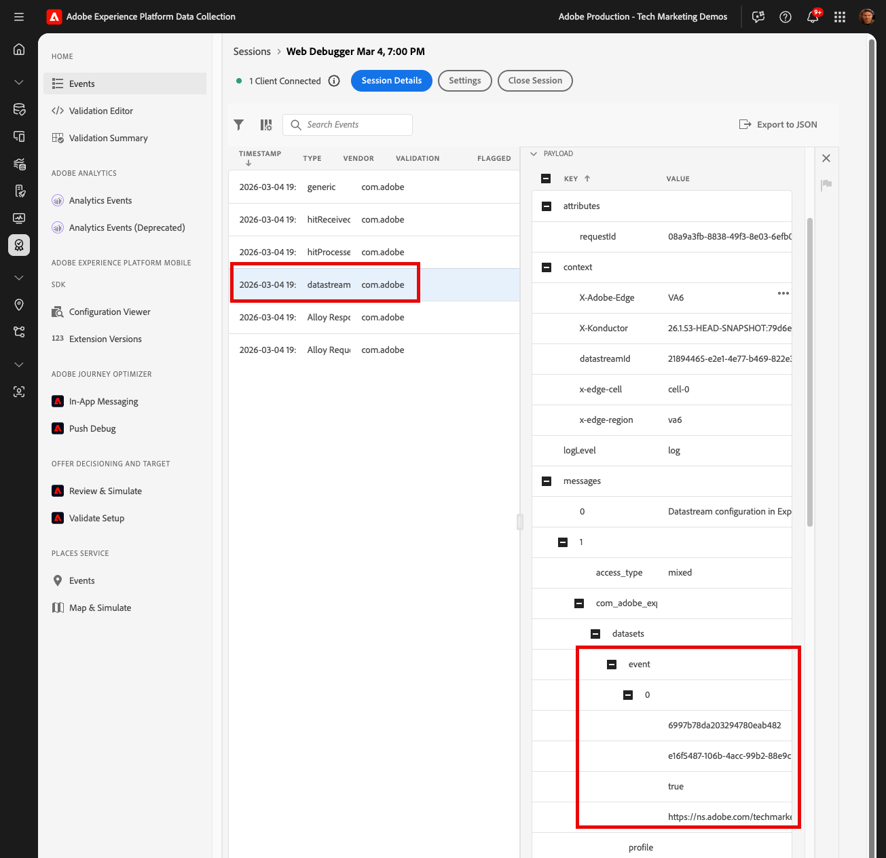
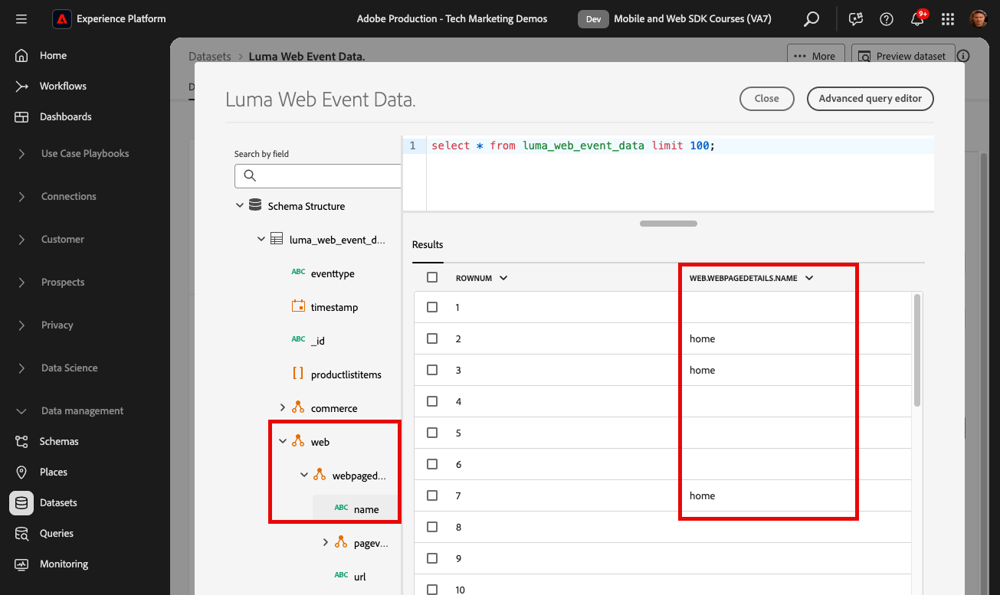

# Gegevens streamen naar Experience Platform met Web SDK

Leer hoe u webgegevens kunt streamen naar Adobe Experience Platform met Platform Web SDK.

Experience Platform is de ruggengraat van alle nieuwe Experience Cloud-toepassingen, zoals Adobe Real-Time Customer Data Platform, Adobe Customer Journey Analytics en Adobe Journey Optimizer. Deze toepassingen worden ontworpen om het Web SDK van het Platform als hun optimale methode van Webgegevensinzameling te gebruiken.

Experience Platform gebruikt hetzelfde XDM-schema dat u eerder hebt gemaakt om gebeurtenisgegevens van de Luma-website vast te leggen. Wanneer die gegevens naar Platform Edge Network worden verzonden, kan de configuratie van de datastream het naar Experience Platform doorsturen.

## Leerdoelstellingen

Aan het eind van deze les, zult u kunnen:

* Een gegevensset maken in Adobe Experience Platform
* Configureer de gegevensstroom om Web SDK-gegevens naar Adobe Experience Platform te verzenden
* Streaming webgegevens inschakelen voor realtime klantprofiel
* Bevestig de gegevens zowel in de dataset van het Platform als in het Profiel van de Klant in real time zijn geland
* De gegevens van het steekproefloyaliteitsprogramma in Platform opnemen
* Een eenvoudig platformpubliek maken

## Vereisten

Om deze les te voltooien, moet u eerst:

* Toegang hebben tot een Adobe Experience Platform-toepassing zoals Real-Time Customer Data Platform, Journey Optimizer of Customer Journey Analytics
* Voltooi de vroegere lessen in de Aanvankelijke secties van de Configuratie van de Configuratie en van de Markeringen van dit leerprogramma.

>[!NOTE]
>
>Als u geen toepassingen van het Platform hebt, kunt u deze les overslaan of lezen.

## Een gegevensset maken

Alle gegevens die met succes in Adobe Experience Platform worden opgenomen, blijven binnen het datumpeer als datasets voortbestaan. A [&#x200B; dataset &#x200B;](https://experienceleague.adobe.com/en/docs/experience-platform/catalog/datasets/overview) is een opslag en beheersconstructie voor een inzameling van gegevens, typisch een lijst die een schema (kolommen) en gebieden (rijen) bevat. Datasets bevatten ook metagegevens die verschillende aspecten van de gegevens beschrijven die ze opslaan.

Stel een gegevensset in voor uw Luma-webgebeurtenisgegevens:

1. Ga naar [&#x200B; Experience Platform &#x200B;](https://experience.adobe.com/platform/) of [&#x200B; Journey Optimizer &#x200B;](https://experience.adobe.com/journey-optimizer/) interface
1. Bevestig dat u zich in de ontwikkelingssandbox bevindt die u voor deze zelfstudie gebruikt
1. **[!UICONTROL Data Management > Datasets]** openen vanuit de linkernavigatie
1. Selecteren **[!UICONTROL Create dataset]**

   

1. Selecteer de optie **[!UICONTROL Create dataset from schema]**

   

1. Selecteer het `Luma Web Event Data` die schema in de [&#x200B; wordt gecreeerd vroegere les &#x200B;](configure-schemas.md) en selecteer dan **[!UICONTROL Next]**

   

1. Geef een **[!UICONTROL Name]** en optioneel **[!UICONTROL Description]** op voor de gegevensset. Gebruik voor deze oefening `Luma Web Event Data` en selecteer vervolgens **[!UICONTROL Finish]**

   

Een dataset wordt nu gevormd om te beginnen gegevens van uw implementatie van het Web SDK van het Platform te verzamelen.

## De gegevensstroom configureren

Nu kunt u uw [!UICONTROL datastream] configureren om gegevens naar [!UICONTROL Adobe Experience Platform] te verzenden. De gegevensstroom is het verband tussen uw markeringsbezit, het Platform Edge Network, en de dataset van Experience Platform.

1. Open de [&#x200B; interface van de Inzameling van 0&rbrace; Gegevens](https://experience.adobe.com/#/data-collection){target="blank"}
1. Selecteer **[!UICONTROL Datastreams]** in de linkernavigatie
1. Open de datastream u in [&#x200B; creeerde vormen een datastream &#x200B;](configure-datastream.md) les, `Luma Web SDK: Development Environment`

   

1. Selecteren **[!UICONTROL Add Service]**
    toe
1. Selecteer **[!UICONTROL Adobe Experience Platform]** als de **[!UICONTROL Service]**
1. Selecteren **[!UICONTROL Enabled]**
1. Selecteer `Luma Web Event Data` als de **[!UICONTROL Event Dataset]**

1. Selecteren **[!UICONTROL Save]**

   

Aangezien u verkeer op de [&#x200B; demowebsite van de Luma &#x200B;](https://luma.enablementadobe.com) produceert die aan uw markeringsbezit wordt in kaart gebracht, bevolkt de gegevens de dataset in Experience Platform!

## De gegevensset valideren

Deze stap is essentieel om ervoor te zorgen dat de gegevens in de dataset zijn geland. Er zijn veelvoudige manieren om de weg van gegevens te bevestigen die naar de dataset worden verzonden.

* Valideren met [!UICONTROL Experience Platform Debugger]
* Valideren met [!UICONTROL Experience Platform Assurance]
* Valideren met [!UICONTROL Preview Dataset]
* Valideren met [!UICONTROL Query Service]

### Debugger

Deze stappen zijn meer of minder het zelfde als wat u in de [&#x200B; Debugger les &#x200B;](validate-with-debugger.md) deed. Aangezien gegevens echter alleen naar Platform worden verzonden nadat u deze in de gegevensstroom hebt ingeschakeld, moet u nog enkele voorbeeldgegevens genereren:

1. Open de [&#x200B; de demowebsite van de Luma &#x200B;](https://luma.enablementadobe.com) en selecteer het [!UICONTROL Experience Platform Debugger] uitbreidingspictogram

1. Vorm Debugger om het markeringsbezit aan *in kaart te brengen uw* milieu van de Ontwikkeling, zoals die in [&#x200B; wordt beschreven bevestigt met Debugger &#x200B;](validate-with-debugger.md) les

   

1. Blader door de website. Bekijk sommige producten en voeg er wat aan toe in uw winkelwagentje

1. Open in Foutopsporing de rij &quot;Gebeurtenissen&quot; om te zoeken naar enkele van uw XDM-variabelen

U hebt bevestigd dat gegevens de browser hebben verlaten en naar de gegevensstroom zijn verzonden!

### Assurance

Aangezien we nu een service in de datastream hebben ingeschakeld, kunnen we meer zien in Assurance:

1. Open je Assurance-sessie of start een nieuwe sessie
1. De gebeurtenis **[!UICONTROL datastream]** openen
1. Hier kunt u de configuratie van de dienst van het Platform, met inbegrip van identiteitskaart van de gegevensstroom bekijken u vroeger in deze les creeerde.

   

1. Open de **[!UICONTROL generic]** -gebeurtenis die bij de **[!UICONTROL com.adobe.streaming.validation]** -leverancier hoort. Dit toont aan dat het verzoek naar de dataset met de begeleidende XDM gegevens is verzonden

   

U hebt bevestigd dat het verzoek door Platform Edge Network werd ontvangen en aan de dataset van het Platform werd doorgestuurd.

### Een voorvertoning van de gegevensset weergeven

Laten we nu eens kijken in de dataset! U kunt de functie **[!UICONTROL Preview dataset]** snel gebruiken. Web SDK-gegevens zijn microbatches aan het data-meer en worden periodiek vernieuwd in de Platform-interface. Het kan 10 tot 15 minuten duren om de gegevens te zien die u hebt gegenereerd.

1. In de [&#x200B; interface van Experience Platform &#x200B;](https://experience.adobe.com/platform/), selecteer **[!UICONTROL Data Management > Datasets]** in de linkernavigatie om het **[!UICONTROL Datasets]** dashboard te openen.

   Het dashboard maakt een lijst van alle beschikbare datasets voor uw organisatie. De details worden getoond voor elke vermelde dataset, met inbegrip van zijn naam, het schema de dataset zich aan, en status van de meest recente versiereeks houdt.

1. Selecteer uw `Luma Web Event Data` dataset om zijn **[!UICONTROL Dataset activity]** scherm te openen.

   

   Het activiteitenscherm omvat een grafiek die het tarief visualiseert van berichten die worden verbruikt evenals een lijst van succesvolle en ontbroken partijen.
1. Aangezien dit een nieuwe dataset is, als u zelfs één partij met opgenomen verslagen ziet, is dat een positief teken:

1. Selecteer in het **[!UICONTROL Dataset activity]** -scherm **[!UICONTROL Preview dataset]** in de rechterbovenhoek van het scherm om een voorvertoning van maximaal 100 rijen met gegevens weer te geven. Als de dataset leeg is, wordt de voorproefverbinding gedeactiveerd.

   

1. Een vraag zal lopen om 100 recente rijen van gegevens van uw dataset te trekken. U kunt naar afzonderlijke XDM-velden, zoals web.webPageDetails.name, bogen:

   

### De gegevens opvragen

U kunt aangepaste query&#39;s op de gegevens uitvoeren en gegevensinvoer valideren:

1. In de [&#x200B; interface van Experience Platform &#x200B;](https://experience.adobe.com/platform/), selecteer **[!UICONTROL Data Management > Queries]** in de linkernavigatie om het **[!UICONTROL Queries]** scherm te openen.
1. Selecteren **[!UICONTROL Create query]**
1. Eerst, stel een vraag in werking om alle namen van de lijsten in het gegevensmeer te zien. Voer `SHOW TABLES` in de query-editor in en klik op het afspeelpictogram om de query uit te voeren.
1. In de resultaten ziet u hoe de naam van de tabel is `luma_web_event_data`
1. Nu vraag de lijst met een eenvoudige vraag die naar uw lijst van verwijzingen voorziet (merk op dat door gebrek de vraag tot 100 resultaten zal worden beperkt): `SELECT * FROM "luma_web_event_data"`
1. Na een paar ogenblikken ziet u voorbeeldrecords van uw webgegevens.

   

>[!ERROR]
>
>Als er een fout optreedt met de instelling &quot;Tabel niet voorzien&quot;, controleert u de naam van de tabel nogmaals. Het kan ook zijn dat de micropartij gegevens nog niet in het datumpeer is geland. Probeer het over 10-15 minuten opnieuw.

>[!INFO]
>
>  De dienst van de vraag is een zeer krachtig hulpmiddel voor gegevensingenieurs en analisten. Voor meer details over de vraagdienst van Adobe Experience Platform, zie [&#x200B; gegevens &#x200B;](https://experienceleague.adobe.com/en/docs/platform-learn/tutorials/queries/explore-data) in de sectie van de Leerprogramma&#39;s van het Platform onderzoeken.

>[!NOTE]
>
>Bedankt dat je tijd hebt geïnvesteerd in het leren over Adobe Experience Platform Web SDK. Als u vragen hebt, algemene terugkoppelen wilt delen, of suggesties over toekomstige inhoud hebben, gelieve hen op deze [&#x200B; Communautaire besprekingspost van Experience League te delen &#x200B;](https://experienceleaguecommunities.adobe.com/adobe-experience-platform-18/tutorial-discussion-implement-adobe-experience-cloud-with-web-sdk-tutorial-248848)
