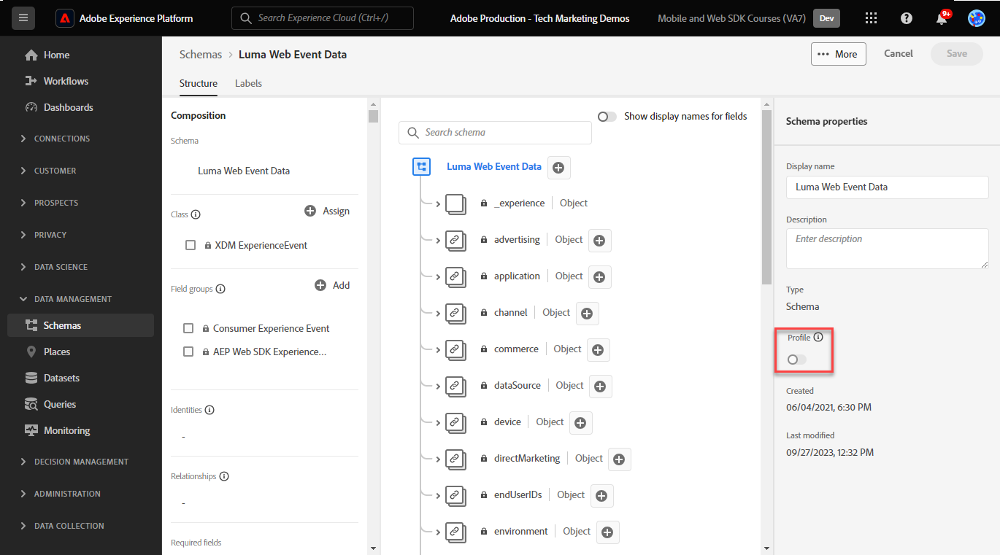

# Gegevens streamen naar Experience Platform met Web SDK

>[!CAUTION]
>
>We verwachten dat we op dinsdag 23 april 2024 belangrijke wijzigingen in deze zelfstudie zullen publiceren. Na dat punt zullen vele oefeningen veranderen en u kunt het leerprogramma van het begin moeten opnieuw beginnen om alle lessen te voltooien.

Leer hoe u webgegevens kunt streamen naar Adobe Experience Platform met Platform Web SDK.

Experience Platform is de ruggengraat van alle nieuwe Experience Cloud toepassingen, zoals Adobe Real-time Customer Data Platform, Adobe Customer Journey Analytics en Adobe Journey Optimizer. Deze toepassingen worden ontworpen om het Web SDK van het Platform als hun optimale methode van Webgegevensinzameling te gebruiken.

Experience Platform gebruikt hetzelfde XDM-schema dat u eerder hebt gemaakt om gebeurtenisgegevens van de Luma-website vast te leggen. Wanneer die gegevens naar de Edge Network van het Platform worden verzonden, kan de configuratie van de gegevensstroom het aan Experience Platform door:sturen.

## Leerdoelstellingen

Aan het eind van deze les, zult u kunnen:

* Een gegevensset maken in Adobe Experience Platform
* Vorm de gegevensstroom om de gegevens van SDK van het Web naar Adobe Experience Platform te verzenden
* Streaming webgegevens inschakelen voor realtime klantprofiel
* Bevestig de gegevens zowel in de dataset van het Platform als in het Profiel van de Klant in real time zijn geland

## Vereisten

U had de volgende lessen reeds moeten voltooien:

* De **Eerste configuratie** lessen:
   * [Machtigingen configureren](configure-permissions.md)
   * [Een XDM-schema configureren](configure-schemas.md)
   * [Een gegevensstroom configureren](configure-datastream.md)
   * [Naamruimte configureren](configure-identities.md)

* De **Configuratie van tags** lessen:
   * [Web SDK-extensie installeren](install-web-sdk.md)
   * [Gegevenselementen maken](create-data-elements.md)
   * [Tagregels maken](create-tag-rule.md)

## Een gegevensset maken

Alle gegevens die met succes in Adobe Experience Platform worden opgenomen, blijven binnen het datumpeer als datasets voortbestaan. A [gegevensset](https://experienceleague.adobe.com/docs/experience-platform/catalog/datasets/overview.html?lang=en) is een opslag en beheersconstructie voor een inzameling van gegevens, typisch een lijst, die een schema (kolommen) en gebieden (rijen) bevat. Datasets bevatten ook metagegevens die verschillende aspecten van de gegevens beschrijven die ze opslaan.

In deze oefening, creeert u een dataset om inhoud en elektronische handeldetails voor te volgen [Luma-demosite](https://luma.enablementadobe.com/content/luma/us/en.html).

>[!WARNING]
>
>U moet de `Luma Web Event Data` schema, zoals in de vorige les wordt geïnstrueerd, [Een XDM-schema configureren](configure-schemas.md).

1. Ga naar de [Interface Experience Platform](https://experience.adobe.com/platform/)
1. Bevestig dat u zich in de ontwikkelingssandbox bevindt die u voor deze zelfstudie gebruikt
1. Openen **[!UICONTROL Datasets]** van de linkernavigatie
1. Selecteren **[!UICONTROL Create dataset]**

   

1. Selecteer de **[!UICONTROL Create dataset from schema]** option

   

1. Selecteer de `Luma Web Event Data` schema gemaakt in het dialoogvenster [eerdere les](configure-schemas.md) en selecteer vervolgens **[!UICONTROL Next]**

   

1. Geef een **[!UICONTROL Name]** en optioneel **[!UICONTROL Description]** voor de gegevensset. Voor deze oefening, gebruik `Luma Web Event Data`selecteert u vervolgens **[!UICONTROL Finish]**

   

Een dataset wordt nu gevormd beginnen gegevens van uw implementatie van SDK van het Web van het Platform te verzamelen.

## De gegevensstroom configureren

Nu kunt u uw [!UICONTROL datastream] gegevens verzenden naar [!UICONTROL Adobe Experience Platform]. De gegevensstroom is het verband tussen uw markeringsbezit, de Edge Network van het Platform, en de dataset van het Experience Platform.

1. Open de [Gegevensverzameling](https://experience.adobe.com/#/data-collection){target="blank"} interface
1. Selecteren **[!UICONTROL Datastreams]** van de linkernavigatie
1. Open de gegevensstroom die u in het dialoogvenster [Een gegevensstroom configureren](configure-datastream.md) les, `Luma Web SDK`

   

1. Selecteren **[!UICONTROL Add Service]**
   
1. Selecteren **[!UICONTROL Adobe Experience Platform]** als de **[!UICONTROL Service]**
1. Selecteren `Luma Web Event Data` als de **[!UICONTROL Event Dataset]**

1. Selecteer **[!UICONTROL Save]**.

   

Terwijl u verkeer binnen op [Luma-demo-site](https://luma.enablementadobe.com/content/luma/us/en.html) Aan uw markeringsbezit in kaart gebracht, zullen de gegevens de dataset in Experience Platform bevolken!

## De gegevensset valideren

Deze stap is essentieel om ervoor te zorgen dat de gegevens in de dataset zijn geland. Er zijn twee aspecten van het valideren van gegevens die naar de dataset worden verzonden.

* Valideren met [!UICONTROL Experience Platform Debugger]
* Valideren met [!UICONTROL Preview Dataset]
* Valideren met [!UICONTROL Query Service]

### Experience Platform Debugger

Deze stappen zijn min of meer hetzelfde als wat u in het dialoogvenster [Foutopsporingsles](validate-with-debugger.md). Aangezien gegevens echter alleen naar Platform worden verzonden nadat u deze in de gegevensstroom hebt ingeschakeld, moet u nog enkele voorbeeldgegevens genereren:

1. Open de [Luma-demosite](https://luma.enablementadobe.com/content/luma/us/en.html) en selecteert u de [!UICONTROL Experience Platform Debugger] extensiepictogram

1. Foutopsporing configureren om de eigenschap tag toe te wijzen aan *uw* Ontwikkelomgeving, zoals beschreven in de [Valideren met foutopsporing](validate-with-debugger.md) les

   

1. Log in op de Luministensite met de referenties `test@adobe.com`/`test`

1. Terugkeren naar de [Luminantiepage](https://luma.enablementadobe.com/content/luma/us/en.html)

1. Binnen de het netwerkbakens van SDK van het Web van het Platform die door debugger worden getoond, selecteer de &quot;gebeurtenissen&quot;rij om details in een pop-up uit te breiden

   

1. Zoek naar &quot;identityMap&quot;binnen pop-up. Hier moet u lumaCrmId zien met drie sleutels van authenticatedState, id en primaire
   

Gegevens moeten nu worden ingevuld in het dialoogvenster `Luma Web Event Data` dataset en klaar voor de bevestiging van de Dataset van de Voorproef.

### Een voorvertoning van de gegevensset weergeven

Om te bevestigen dat de gegevens in het datumpigment van Platform zijn geland, is het snel mogelijk om de **[!UICONTROL Preview dataset]** gebruiken. De gegevens van SDK van het Web zijn micro-gebatcheerd aan het gegevens meer en op periodieke basis verfrist in de interface van het Platform. Het kan 10 tot 15 minuten duren om de gegevens te zien die u hebt gegenereerd.

1. In de [Experience Platform](https://experience.adobe.com/platform/) interface, selecteren **[!UICONTROL Datasets]** in de linkernavigatie om het dialoogvenster **[!UICONTROL Datasets]** dashboard.

   Het dashboard maakt een lijst van alle beschikbare datasets voor uw organisatie. De details worden getoond voor elke vermelde dataset, met inbegrip van zijn naam, het schema de dataset zich aan, en status van de meest recente versiereeks houdt.

1. Selecteer uw `Luma Web Event Data` dataset om zijn te openen **[!UICONTROL Dataset activity]** scherm.

   

   Het activiteitenscherm omvat een grafiek die het tarief visualiseert van berichten die worden verbruikt evenals een lijst van succesvolle en ontbroken partijen.

1. Van de **[!UICONTROL Dataset activity]** scherm, selecteren **[!UICONTROL Preview dataset]** in de rechterbovenhoek van het scherm om maximaal 100 rijen met gegevens voor te vertonen. Als de dataset leeg is, wordt de voorproefverbinding gedeactiveerd.

   

   In het voorproefvenster, wordt de hiërarchische mening van het schema voor de dataset getoond op het recht.

   

>[!INFO]
>
>De de vraagdienst van Adobe Experience Platform is een robuustere methode om gegevens in het meer te bevestigen, maar is voorbij het werkingsgebied van dit leerprogramma. Zie voor meer informatie [Gegevens verkennen](https://experienceleague.adobe.com/docs/platform-learn/tutorials/queries/explore-data.html) in de sectie Platform-zelfstudies.

## De dataset en het schema voor het Profiel van de Klant in real time inschakelen

De volgende stap is de dataset en het schema voor het Profiel van de Klant in real time toe te laten. Gegevens die van SDK van het Web stromen zullen één van vele gegevensbronnen zijn die in Platform stromen en u wilt zich bij uw Webgegevens met andere gegevensbronnen aansluiten om klantenprofielen van 360 graads te bouwen. Bekijk deze korte video voor meer informatie over Real-Time Customer Profile:

>[!VIDEO](https://video.tv.adobe.com/v/27251?learn=on&captions=eng)

>[!CAUTION]
>
>Wanneer we met uw eigen website en gegevens werken, raden we u aan gegevens robuuster te valideren voordat u deze inschakelt voor het realtime-klantprofiel.

**Om de dataset toe te laten:**

1. Open de gegevensset die u hebt gemaakt, `Luma Web Event Data`

1. Selecteer de **[!UICONTROL Profile Toggle]** om het aan te zetten

   

1. Bevestigen dat u wilt **[!UICONTROL Enable]** de dataset

   

**Het schema inschakelen:**

1. Open het schema dat u hebt gemaakt, `Luma Web Event Data`

1. Selecteer de **[!UICONTROL Profile Toggle]** om het aan te zetten

   

1. Selecteren **[!UICONTROL Data for this schema will contain a primary identity in the identityMap field.]**

   >[!IMPORTANT]
   >
   >    Primaire id&#39;s zijn vereist voor elk record dat wordt verzonden naar het Real-Time Klantprofiel. Identiteitsvelden worden doorgaans gelabeld in het schema. Als u identiteitskaarten gebruikt, zijn de identiteitsvelden echter niet zichtbaar binnen het schema. In dit dialoogvenster kunt u bevestigen dat u een primaire identiteit voor ogen hebt en dat u deze in een identiteitsoverzicht opgeeft wanneer u uw gegevens verzendt. Zoals u weet, gebruikt SDK van het Web een identiteitskaart, en Experience Cloud identiteitskaart (ECID) is de standaard primaire identiteit.

1. Selecteren **[!UICONTROL Enable]**

   

1. Selecteren **[!UICONTROL Save]** het bijgewerkte schema opslaan

Het schema is nu ook ingeschakeld voor het profiel.

>[!IMPORTANT]
>
>    Als een schema eenmaal is ingeschakeld voor Profiel, kan het niet worden uitgeschakeld of verwijderd. Ook kunnen velden na dit punt niet uit het schema worden verwijderd. Deze implicaties zijn belangrijk om later in mening te houden wanneer u met uw eigen gegevens in uw milieu van de Productie werkt. In deze zelfstudie moet u een ontwikkelingssandbox gebruiken die u op elk gewenst moment kunt verwijderen.
>
>   
> Als u met uw eigen gegevens werkt, is het raadzaam de volgende handelingen uit te voeren:
> 
> * Eerst, ga sommige gegevens in uw datasets in.
> * Oplossen van problemen die zich tijdens het invoeren van gegevens voordoen (bijvoorbeeld problemen met gegevensvalidatie of -toewijzing).
> * Uw gegevenssets en schema&#39;s voor profiel inschakelen
> * De gegevens opnieuw invoeren

### Een profiel valideren

U kunt een klantprofiel opzoeken in de interface Platform (of Journey Optimizer-interface) om te bevestigen dat de gegevens zijn geland in het Real-Time Klantprofiel. Zoals de naam suggereert, bevolken de profielen in real time, zodat is er geen vertraging zoals met het bevestigen van gegevens in de dataset.

Eerst moet u meer voorbeeldgegevens genereren. Herhaal de stappen uit eerdere versies in deze les om u aan te melden bij de Luma-website wanneer deze is toegewezen aan uw tag-eigenschap. Inspect het verzoek van SDK van het Web van het Platform om ervoor te zorgen het gegevens met verzendt `lumaCRMId`.

1. In de [Experience Platform](https://experience.adobe.com/platform/) interface, selecteren **[!UICONTROL Profiles]** in de linkernavigatie

1. Als de **[!UICONTROL Identity namespace]** gebruiken `lumaCRMId`
1. De waarde van de opdracht kopiëren en plakken `lumaCRMId` overgegaan in de vraag u in Debugger van het Experience Platform (waarschijnlijk) inspecteerde `112ca06ed53d3db37e4cea49cc45b71e`).

   

1. Als het profiel een geldige waarde bevat voor `lumaCRMId`, vult een profiel-id in de console:

   

1. Klik in het dialoogvenster [!UICONTROL Profile ID] en [!UICONTROL Customer profile] wordt gevuld. Hier kunt u alle identiteiten zien verbonden aan `lumaCRMId`, zoals de `ECID`:

   

U hebt nu Platform Web SDK voor Experience Platform ingeschakeld (En Real-Time CDP! En Customer Journey Analytics! En Journey Optimizer!)!

[Volgende: ](setup-analytics.md)

>[!NOTE]
>
>Bedankt dat u tijd hebt geïnvesteerd in het leren over de SDK van Adobe Experience Platform Web. Als u vragen hebt, algemene feedback wilt delen of suggesties voor toekomstige inhoud wilt hebben, deelt u deze over deze [Experience League Communautaire discussiestuk](https://experienceleaguecommunities.adobe.com/t5/adobe-experience-platform-launch/tutorial-discussion-implement-adobe-experience-cloud-with-web/td-p/444996)