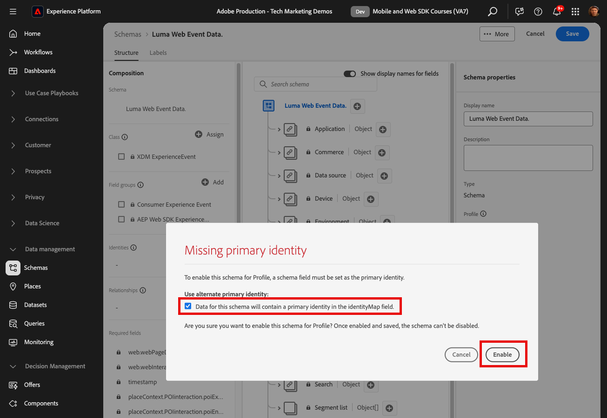
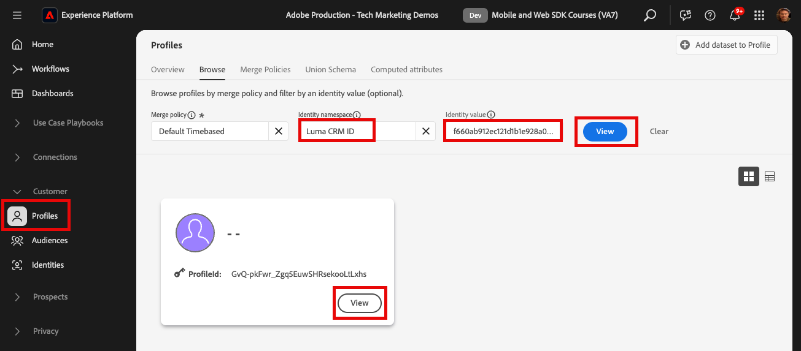

# Klantprofielen in realtime en Edge-segmentatie

## De dataset en het schema voor het Profiel van de Klant in real time inschakelen

Voor klanten van Real-Time Customer Data Platform en Journey Optimizer, is de volgende stap de dataset en het schema voor het Profiel van de Klant in real time toe te laten. Gegevens die van SDK van het Web stromen zullen één van vele gegevensbronnen zijn die in Platform stromen en u wilt zich bij uw Webgegevens met andere gegevensbronnen aansluiten om klantenprofielen van 360 graads te bouwen. Bekijk deze korte video voor meer informatie over Real-Time Customer Profile:

>[!VIDEO](https://video.tv.adobe.com/v/27251?learn=on&captions=eng)

>[!CAUTION]
>
>Wanneer we met uw eigen website en gegevens werken, raden we u aan gegevens robuuster te valideren voordat u deze inschakelt voor het realtime-klantprofiel.

### Het schema inschakelen

Het schema inschakelen voor profiel:

1. Open het schema dat u hebt gemaakt, `Luma Web Event Data`

1. Selecteer de **[!UICONTROL Profile Toggle]** om deze in te schakelen

   

1. Selecteren **[!UICONTROL Data for this schema will contain a primary identity in the identityMap field.]**

1. Selecteren **[!UICONTROL Enable]**

    toe

   >[!IMPORTANT]
   >
   >    Primaire id&#39;s zijn vereist voor elk record dat wordt verzonden naar het Real-Time Klantprofiel. Elke record wordt een &quot;profielfragment&quot; en de primaire middelpunten zijn de sleutels voor het opzoeken van die fragmenten.
   > 
   > Bij sommige soorten gegevens worden identiteitsvelden gelabeld in het schema. Met gebeurtenisgegevens die door Experience Platform SDK&#39;s worden vastgelegd, zijn identiteitskaarten echter standaard en zijn de identiteitsvelden niet zichtbaar binnen het schema.
   >
   > Dit dialoogvenster moet bevestigen dat u een primaire identiteit in mening hebt en dat u het in een identiteitskaart zult specificeren wanneer het verzenden van uw gegevens, het met de verbindingsregels van de identiteitsgrafiek, of allebei zult vormen. We raden u aan beide te doen.
   >
   > Zoals u weet, gebruikt onze Luma-implementatie een identiteitsoverzicht met de geverifieerde lumaCrmId als primaire identiteit wanneer beschikbaar, anders zal het aan Experience Cloud Id (ECID) in gebreke blijven.

1. Selecteer **[!UICONTROL Save]** om het bijgewerkte schema op te slaan

Het schema is nu ingeschakeld voor het profiel.

### De gegevensset inschakelen

Om de dataset toe te laten:

1. Open de gegevensset die u hebt gemaakt, `Luma Web Event Data`

1. Selecteer de **[!UICONTROL Profile Toggle]** om deze in te schakelen

   

1. Bevestig dat u de gegevensset wilt **[!UICONTROL Enable]**

>[!IMPORTANT]
>
>  Als een schema is ingeschakeld voor Profiel en gegevens in de gegevensset worden opgenomen, kunt u het niet uitschakelen of verwijderen zonder de volledige sandbox opnieuw in te stellen of te verwijderen. Ook, kunnen de gebieden die gegevens hebben ontvangen niet uit het schema na dit punt worden verwijderd.
>
>   
> Als u met uw eigen gegevens werkt, is het raadzaam de volgende handelingen uit te voeren:
> 
> * Eerst, ga sommige gegevens in uw datasets in.
> * Oplossen van problemen die zich tijdens het invoeren van gegevens voordoen (bijvoorbeeld problemen met gegevensvalidatie of -toewijzing).
> * Uw gegevenssets en schema&#39;s voor profiel inschakelen
> * Voer de gegevens opnieuw in, indien nodig

### Een profiel valideren

U kunt een klantprofiel opzoeken in de interface Platform (of Journey Optimizer-interface) om te bevestigen dat de gegevens zijn geland in het Real-Time Klantprofiel. Zoals de naam suggereert, bevolken de profielen in real time, zodat is er geen vertraging zoals met het bevestigen van gegevens in de dataset.

Eerst moet u meer steekproefgegevens in uw profiel-toegelaten dataset produceren:

1. Open de [&#x200B; de demowebsite van de Luma &#x200B;](https://luma.enablementadobe.com) en selecteer het [!UICONTROL Experience Platform Debugger] uitbreidingspictogram

1. Vorm Debugger om het markeringsbezit aan *in kaart te brengen uw* milieu van de Ontwikkeling, zoals die in [&#x200B; wordt beschreven bevestigt met Debugger &#x200B;](validate-with-debugger.md) les

   

1. Blader door de website. Bekijk sommige producten en voeg er wat aan toe in uw winkelwagentje.

1. Meld u aan bij de Luministensite met de aanmeldingsgegevens `test@test.com`/ `test` (Als u het bericht &quot;Ongeldig e-mailadres of wachtwoord&quot; krijgt, maakt u een account met deze gegevens)

1. Open de rij &quot;events&quot; om te zoeken naar enkele XDM-variabelen
1. Zoek naar &quot;identityMap&quot;binnen pop-up. Hier zou u lumaCrmId met drie sleutels van authenticatedState, identiteitskaart, en primair moeten zien. De lumaCrmId-waarde voor deze aanmelding is `f660ab912ec121d1b1e928a0bb4bc61b` .

   

Nu zoeken we ons profiel in Experience Platform:

1. In de [&#x200B; interface van Experience Platform &#x200B;](https://experience.adobe.com/platform/), uitgezochte **[!UICONTROL Customer]** > **[!UICONTROL Profiles]** in de linkernavigatie

1. Als **[!UICONTROL Identity namespace]** use `Luma CRM ID`
1. Kopieer en plak de waarde van de `lumaCrmId` die is doorgegeven in de aanroep die u hebt gecontroleerd in Experience Platform Debugger, in dit geval `f660ab912ec121d1b1e928a0bb4bc61b`

1. Als het profiel voor `lumaCRMId` een geldige waarde bevat, wordt een profiel-id in de console gevuld

1. Als u de volledige selectie **[!UICONTROL Customer Profile]** wilt weergeven, selecteert u **[!UICONTROL View]** :

   

1. Eerst wordt een overzicht van het profiel weergegeven. Dit profiel bevat nog niet veel, maar hier zijn de id&#39;s gekoppeld in het profiel, de `lumaCRMId` en `ECID` :

   

1. De meeste profielgegevens die op dit moment beschikbaar zijn, zijn de gebeurtenisgegevens van de webactiviteit. Selecteer **[!UICONTROL Events]** om de gegevens van de klikstroom weer te geven:

   

## Profiel niet samenvouwen

Nu kijken naar iets u nooit in uw eigen implementatie-grafiek wilt zien gebeurt.

### Begrijp het probleem

Ten eerste zullen we nog wat voorbeeldgegevens genereren zodat we het probleem kunnen zien:

1. Zonder om het even welke koekjes of localStorage voorwerpen te schrappen, open de [&#x200B; de demowebsite van de Luma &#x200B;](https://luma.enablementadobe.com) en selecteer het [!UICONTROL Experience Platform Debugger] uitbreidingspictogram

1. Vorm Debugger om het markeringsbezit aan *in kaart te brengen uw* milieu van de Ontwikkeling, zoals die in [&#x200B; wordt beschreven bevestigt met Debugger &#x200B;](validate-with-debugger.md) les

   

1. Hopelijk wordt u nog geregistreerd in de plaats van de Luma gebruikend de geloofsbrieven `test@test.com`/ `test`. Indien niet, log terug in.

1. Blader door de website. Bekijk sommige producten en voeg er wat aan toe in uw winkelwagentje.

1. Nu, meld u af.

1. Meld u nu opnieuw aan en maak een account als een andere gebruiker (`spouse@test.com/test`). Wat we proberen te doen, is een &#39;gedeeld apparaat&#39;-scenario te repliceren, waarbij twee gebruikers dezelfde webbrowser delen, op dezelfde website verifiëren en dezelfde `ECID` -waarde delen.
1. Controleer in Foutopsporing of u een andere lumaCrmId, `98d73957f59c67617611d56ba7e8dbaa` for `spouse@test.com/test` hebt.

   

1. Andere producten weergeven

Nu het profiel opnieuw opzoeken:

1. Opnieuw zoeken naar `Luma CRM ID` is gelijk aan `f660ab912ec121d1b1e928a0bb4bc61b`
1. Let op: het profiel is nu gekoppeld aan twee verschillende Luma CRM-id&#39;s

1. Selecteren **[!UICONTROL View Identity Graph]**

   

1. De identiteitsgrafiek helpt dit profiel visualiseren waarin, wegens het delen van het apparaat, twee `lumaCrmId` waarden door een gemeenschappelijke `ECID` waarde worden verbonden.

   

Dit kan een groot probleem zijn voor een Experience Platform-implementatie. Niet alleen worden de gebeurtenisgegevens van beide gebruikers opgenomen in één profiel, maar ook andere typen gegevens die met deze `lumaCrmId` -waarden in Platform worden ingevoerd, worden samengevoegd.

### Verbeter het met identiteitsgrafiek die regels verbindt

Om de kwestie van de grafiekineenstorting op voorhand te behandelen, gebruik de eigenschap van de grafiek die regels in Adobe Experience Platform verbindt alvorens uw implementatie van SDK van het Web toe te laten.

>[!WARNING]
>
> Deze stappen worden typisch gevormd door een gegevensarchitect die de volledige implementatie van het Platform beheert. Er is veel meer aan de eigenschap dan wat hier wordt getoond en vele complexe scenario&#39;s die eerst zorgvuldig zouden moeten worden gesimuleerd.
>
> Voer deze stappen alleen uit als u deze zelfstudie voltooit in een specifieke ontwikkelingssandbox die u kunt verwijderen nadat u deze zelfstudie hebt voltooid. Deze wijzigingen in de sandbox kunnen niet worden teruggedraaid. Gelieve te zien de [&#x200B; identiteitsgrafiek die regels verbinden leerprogramma&#39;s &#x200B;](https://experienceleague.adobe.com/en/docs/platform-learn/tutorials/identities/graph-linking-rules/overview) om meer te leren.

De koppelingsregels voor identiteitsgrafieken inschakelen:

1. Open **[!UICONTROL Settings]** vanuit een willekeurig scherm Identites:

   

1. Controleer de waarschuwingen in het modaal en selecteer **[!UICONTROL Proceed]**
1. Sleep de naamruimte `Luma CRM ID` zodat dit de naamruimte met de hoogste prioriteit in de lijst is
1. Controleer de instelling **[!UICONTROL Unique per Graph]** voor `Luma CRM ID`
1. Selecteren **[!UICONTROL Next]**
   
1. Bekijk het modaal en **[!UICONTROL Confirm]**
1. Selecteer **[!UICONTROL Next]** om de simulatiestap over te slaan

   >[!WARNING]
   >
   > Voer deze workflow opnieuw niet uit om deze identiteitsinstellingen in te schakelen als u niet in uw eigen specifieke ontwikkelingssandbox werkt.

1. Voer de naam van de sandbox in en selecteer **[!UICONTROL Confirm]**

   

Kom over 24 uur terug naar de site, meld u weer aan als `test@test.com` of `spouse@test.com` en controleer of uw profielen zijn gescheiden.

## Een publiek met Edge-evaluatie maken

Voor klanten van Real-Time Customer Data Platform en Journey Optimizer wordt aangeraden deze exercitie af te ronden.

Wanneer de gegevens van SDK van het Web in Adobe Experience Platform worden opgenomen, kan het door andere gegevensbronnen worden verrijkt u in Platform hebt ingebed. Bijvoorbeeld, wanneer een gebruiker zich bij de plaats van de Luma aanmeldt, wordt een identiteitsgrafiek gebouwd in Experience Platform en alle andere profiel-toegelaten datasets kunnen potentieel samen worden samengevoegd om de Profielen van de Klant in real time te bouwen. Om dit in actie te zien, zult u snel een andere dataset in Adobe Experience Platform met wat gegevens van de steekproefloyaliteit tot stand brengen zodat u de Profielen van de Klant in real time met Real-Time Customer Data Platform en Journey Optimizer kunt gebruiken. Vervolgens maakt u een publiek op basis van deze gegevens.

### Een kwaliteitsschema maken en voorbeeldgegevens invoeren

Aangezien u reeds soortgelijke oefeningen hebt uitgevoerd, zullen de instructies kort zijn.

Maak het loyaliteitsschema:

1. Een nieuw schema maken
1. Kies **[!UICONTROL Individual Profile]** als de [!UICONTROL base class]
1. Geef het schema een naam `Luma Loyalty Schema`
1. De veldgroep [!UICONTROL Loyalty Details] toevoegen
1. De veldgroep [!UICONTROL Demographic Details] toevoegen
1. Selecteer het veld `Person ID` en markeer het als een [!UICONTROL Identity] en [!UICONTROL Primary identity] met `Luma CRM Id` [!UICONTROL Identity namespace] .
1. Het schema inschakelen voor [!UICONTROL Profile] . Als u de schakeloptie Profiel niet kunt vinden, klikt u op de schemanaam linksboven.
1. Het schema opslaan

   

Om de dataset tot stand te brengen en de steekproefgegevens in te gaan:

1. Een nieuwe gegevensset maken met de `Luma Loyalty Schema`
1. Geef de gegevensset een naam `Luma Loyalty Dataset`
1. De gegevensset inschakelen voor [!UICONTROL Profile]
1. Download het steekproefdossier [&#x200B; luma-loyalty-forWeb.json &#x200B;](assets/luma-loyalty-forWeb.json)
1. Sleep het bestand naar uw gegevensset en zet het neer
1. Bevestig dat de gegevens correct zijn ingevoerd

   

### Een samenvoegingsbeleid voor Active-on-Edge instellen

Alle soorten publiek worden gemaakt met een samenvoegbeleid. Het beleid van de fusie leidt tot verschillende &quot;meningen&quot;van een profiel, kan een ondergroep datasets bevatten, en schrijft een prioritaire orde voor wanneer de verschillende datasets de zelfde profielattributen bijdragen. Om aan de rand te worden geëvalueerd, moet een publiek een samenvoegbeleid gebruiken met de **[!UICONTROL Active-On-Edge Merge Policy]** instelling heeft.

>[!IMPORTANT]
>
>Slechts één samenvoegbeleid per sandbox kan de instelling **[!UICONTROL Active-On-Edge Merge Policy]** hebben

1. Open de Experience Platform- of Journey Optimizer-interface en zorg ervoor dat u zich in de ontwikkelomgeving bevindt die u voor de zelfstudie gebruikt.
1. Ga naar **[!UICONTROL Customer]** > **[!UICONTROL Profiles]** > **[!UICONTROL Merge Policies]** pagina
1. Open het dialoogvenster **[!UICONTROL Default Merge Policy]** (waarschijnlijk `Default Timebased` genoemd)
   
1. De instelling **[!UICONTROL Active-On-Edge Merge Policy]** inschakelen
1. Selecteren **[!UICONTROL Next]**

   
1. Blijf **[!UICONTROL Next]** selecteren om door de andere stappen van de workflow te gaan en selecteer **[!UICONTROL Finish]** om uw instellingen op te slaan
   

U kunt nu een publiek maken dat op de Edge wordt geëvalueerd.

### Een publiek maken

Groepprofielen van soorten publiek worden gecombineerd rond algemene kenmerken. Maak een eenvoudig publiek dat u kunt gebruiken in Real-Time CDP of Journey Optimizer:

1. Ga in de Experience Platform- of Journey Optimizer-interface naar **[!UICONTROL Customer]** > **[!UICONTROL Audiences]** in de linkernavigatie
1. Selecteren **[!UICONTROL Create audience]**
1. Selecteren **[!UICONTROL Build rule]**
1. Selecteren **[!UICONTROL Create]**

   

1. Selecteren **[!UICONTROL Attributes]**
1. Het veld **[!UICONTROL Loyalty]** > **[!UICONTROL Tier]** zoeken en naar de sectie **[!UICONTROL Attributes]** slepen
1. Het publiek definiëren als gebruikers met `tier` is `gold`
1. Noem het publiek `Luma Loyalty Rewards – Gold Status`
1. Selecteer **[!UICONTROL Edge]** als de **[!UICONTROL Evaluation method]**
1. Selecteren **[!UICONTROL Save]**

   

>[!NOTE]
>
> Aangezien we het standaardsamenvoegbeleid instellen als **[!UICONTROL Active-On-Edge Merge Policy]** , wordt het publiek dat u hebt gemaakt automatisch gekoppeld aan dit samenvoegbeleid.

Omdat dit een heel eenvoudig publiek is, kunnen we de evaluatiemethode van Edge gebruiken. Het publiek van Edge evalueert op de rand, zodat in het zelfde verzoek dat door Web SDK aan Platform Edge Network wordt gedaan, kunnen wij de publieksdefinitie evalueren en onmiddellijk bevestigen als de gebruiker zal kwalificeren.

>[!NOTE]
>
>Bedankt dat je tijd hebt geïnvesteerd in het leren over Adobe Experience Platform Web SDK. Als u vragen hebt, algemene terugkoppelen wilt delen, of suggesties over toekomstige inhoud hebben, gelieve hen op deze [&#x200B; Communautaire besprekingspost van Experience League te delen &#x200B;](https://experienceleaguecommunities.adobe.com/adobe-experience-platform-18/tutorial-discussion-implement-adobe-experience-cloud-with-web-sdk-tutorial-248848)
