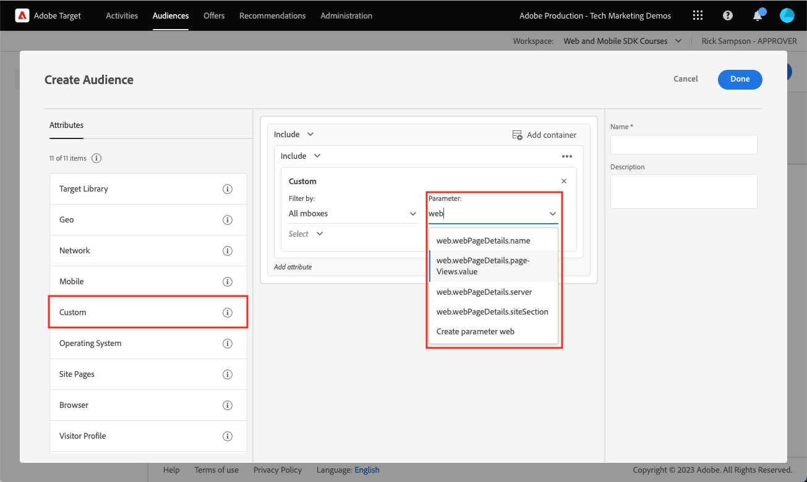

# Adobe Target instellen met Platform Web SDK

Leer hoe u Adobe Target implementeert met Adobe Experience Platform Web SDK. Leer hoe u ervaringen kunt bieden en hoe u extra parameters aan Target kunt doorgeven.

[ Adobe Target ](https://experienceleague.adobe.com/en/docs/target/using/target-home) is de toepassing van Adobe Experience Cloud die alles verstrekt u uw klanten&#39; ervaring moet aanpassen en personaliseren, zodat kunt u opbrengst op uw Web en mobiele plaatsen, apps, en andere digitale kanalen maximaliseren.


## Leerdoelstellingen

Aan het eind van deze les, kunt u het volgende met een implementatie van SDK van het Web van Doel doen:

* Voeg het voorverborgen fragment toe om flikkering te voorkomen
* Een gegevensstroom configureren om de functionaliteit Doel in te schakelen
* Componentactiviteiten voor visuele beleving renderen
* Activiteiten van formuliercomposers renderen
* Geef XDM-gegevens door aan Doel en begrijp de toewijzing aan Doelparameters
* Aangepaste gegevens aan doel doorgeven, zoals profiel- en entiteitsparameters
* Een doelimplementatie valideren
* Afzonderlijke personalisatieverzoeken van analyseverzoeken

>[!TIP]
>
>Zie ons [ Doel van at.js 2.x aan het Web SDK van het Platform ](/help/tutorial-migrate-target-websdk/introduction.md) leerprogramma voor een geleidelijke gids migreren om uw bestaande implementatie te migreren at.js.


## Vereisten

Om de lessen in deze sectie te voltooien, moet u eerst:

* Voltooi alle lessen voor aanvankelijke configuratie van het Web SDK van het Platform, met inbegrip van vestiging gegevenselementen en regels.
* Verzeker u een [ Redacteur of rol van de fiatteur ](https://experienceleague.adobe.com/en/docs/target/using/administer/manage-users/enterprise/properties-overview#section_8C425E43E5DD4111BBFC734A2B7ABC80) in Adobe Target hebt.
* Installeer de [ Visuele de hulpuitbreiding van Composer van de Ervaring ](https://experienceleague.adobe.com/en/docs/target/using/experiences/vec/troubleshoot-composer/vec-helper-browser-extension) als u browser van Google Chrome gebruikt.
* Weet hoe u activiteiten in Target kunt instellen. Als u een herhaling nodig hebt, zijn de volgende zelfstudies en hulplijnen handig voor deze les:
   * [ Gebruik de Visuele Uitbreiding van de Hulp van Composer van de Ervaring (VEC) ](https://experienceleague.adobe.com/en/docs/target/using/experiences/vec/troubleshoot-composer/vec-helper-browser-extension)
   * [ Gebruik Composer van de Visuele Ervaring ](https://experienceleague.adobe.com/en/docs/target-learn/tutorials/experiences/use-the-visual-experience-composer)
   * [ gebruik de op vorm-Gebaseerde Composer van de Ervaring ](https://experienceleague.adobe.com/en/docs/target-learn/tutorials/experiences/use-the-form-based-experience-composer)
   * [ creeer ervaring richtend Activiteiten ](https://experienceleague.adobe.com/en/docs/target-learn/tutorials/activities/create-experience-targeting-activities)

## Flikkeringsafhandeling toevoegen

Bepaal voordat u begint of er een extra flikkerafhandelingsoplossing nodig is, afhankelijk van de manier waarop de tagbibliotheek is geladen.

>[!NOTE]
>
>Dit leerprogramma gebruikt de [ website van de Luma ](https://luma.enablementadobe.com/content/luma/us/en.html){target=_blank}, die een asynchrone implementatie van markeringen en het flikkeren matiging op zijn plaats heeft. Deze sectie is voor verwijzing om te begrijpen hoe de het flikkeren matiging met het Web SDK van het Platform werkt.


### Asynchrone implementatie

Wanneer een tagbibliotheek asynchroon wordt geladen, kan de pagina de rendering voltooien voordat Target de standaardinhoud heeft vervangen door gepersonaliseerde inhoud. Dit gedrag kan leiden tot wat &quot;flikkering&quot;wordt genoemd, waar de standaardinhoud kort toont alvorens door de gepersonaliseerde inhoud wordt vervangen. Als u deze flikkering wilt voorkomen, raadt Adobe aan een speciaal vooraf verborgen fragment toe te voegen vlak voor de asynchrone code voor het insluiten van tags.

Dit fragment is al aanwezig op de Luma-site, maar laten we eens nader kijken om te begrijpen wat deze code doet:

```html
<script>
  !function(e,a,n,t){var i=e.head;if(i){
  if (a) return;
  var o=e.createElement("style");
  o.id="alloy-prehiding",o.innerText=n,i.appendChild(o),setTimeout(function(){o.parentNode&&o.parentNode.removeChild(o)},t)}}
  (document, document.location.href.indexOf("adobe_authoring_enabled") !== -1, ".personalization-container { opacity: 0 !important }", 3000);
</script>
```

Het vooraf verborgen fragment maakt een stijltag in de kop van de pagina met de CSS-definitie van uw keuze. Deze stijlmarkering wordt verwijderd wanneer een reactie van Doel wordt ontvangen, of de onderbreking wordt bereikt.

Het gedrag voor het voorverbergen wordt bepaald door twee configuraties helemaal aan het einde van het fragment.

* `body { opacity: 0 !important }` geeft de CSS-definitie op die moet worden gebruikt voor het voorverbergen totdat Doel wordt geladen. Standaard is de hele pagina verborgen. U kunt deze definitie bijwerken naar de kiezers die u wilt voorverbergen en naar de manier waarop u deze wilt verbergen. U kunt meerdere definities opnemen, aangezien deze waarde eenvoudig is wat wordt ingevoegd in de stijl die u vooraf verbergt. Als u een gemakkelijk identificeerbaar containerelement hebt dat de inhoud onder uw navigatie verpakt, kunt u deze instelling gebruiken om het vooraf verbergen tot dat containerelement te beperken.
* `3000` geeft de time-out op in milliseconden voor het voorverbergen. Als een reactie van Target niet vóór de time-out wordt ontvangen, wordt de stijltag die voor de gebeurtenis werd verborgen, verwijderd. Het bereiken van deze time-out moet zeldzaam zijn.

>[!NOTE]
>
>Het voorverborgen fragment voor het Platform Web SDK wijkt enigszins af van het fragment dat wordt gebruikt met de bibliotheek Target at.js. Gebruik het juiste fragment voor Platform Web SDK omdat het een andere stijl-id van `alloy-prehiding` gebruikt. Als het voorverborgen fragment voor at.js wordt gebruikt, werkt het mogelijk niet correct.

Het voorverborgen fragment is ook beschikbaar binnen tags:

1. Naar de sectie **[!UICONTROL Extensions]** met tags gaan
1. Selecteer **[!UICONTROL Configure]** voor de Adobe Experience Platform Web SDK-extensie
1. Selecteer de knop **[!UICONTROL Copy pre-hiding snippet to clipboard]**

   

   >[!NOTE]
   >
   >Het standaard voorverborgen fragment dat is gekopieerd uit de extensie Platform Web SDK, kan een CSS-definitie bevatten die niet op uw site aanwezig is, zoals `.personalization-container { opacity: 0 !important }` . Controleer en wijzig het vooraf verborgen fragment op de juiste wijze voor uw site.

### Synchrone implementatie

Adobe raadt u aan tags asynchroon te implementeren, zoals op de Luministsite wordt getoond. Als de tagbibliotheek echter synchroon wordt geladen, is het vooraf verborgen fragment niet vereist. In plaats daarvan, wordt de pre-verbergende stijl gespecificeerd in de de uitbreidingsmontages van het Web SDK van het Platform.

De pre-verbergende stijl voor synchrone implementaties kan als volgt worden gevormd:

1. Naar de sectie **[!UICONTROL Extensions]** met tags gaan
1. Selecteer de knop **[!UICONTROL Configure]** voor de extensie Platform Web SDK
1. Selecteer de knop **[!UICONTROL Edit pre-hiding style]**

   

1. Wijzig de CSS zodanig dat deze de kiezers bevat en de methoden verbergt die u wilt gebruiken, bijvoorbeeld: `body { opacity: 0 !important }` als u de volledige hoofdtekst van de pagina wilt voorverbergen.
1. Uw wijzigingen opslaan en bouwen naar een bibliotheek

>[!NOTE]
>
>De vooraf verborgen stijlinstelling is alleen bedoeld voor synchrone implementaties. Deze stijl moet leeg zijn of er moet commentaar op worden toegevoegd als u een asynchrone implementatie van tags gebruikt.

Om meer over te leren hoe het Web SDK van het Platform flikkering kan leiden, kunt u naar de gidssectie verwijzen: [ die flikkering voor gepersonaliseerde ervaringen ](https://experienceleague.adobe.com/en/docs/experience-platform/edge/personalization/manage-flicker) beheert.


## De gegevensstroom configureren

Het doel moet in de gegevensstroomconfiguratie worden toegelaten alvorens om het even welke activiteiten van het Doel door het Web SDK van het Platform kunnen worden geleverd.

Om Doel in de gegevensstroom te vormen:

1. Ga naar de [ interface van de Inzameling van Gegevens ](https://experience.adobe.com/#/data-collection){target="blank"}
1. Selecteer **[!UICONTROL Datastreams]** bij de linkernavigatie
1. Selecteer de eerder gemaakte `Luma Web SDK: Development Environment` datastream

   

1. Selecteren **[!UICONTROL Add Service]**
    toe
1. Selecteer **[!UICONTROL Adobe Target]** als de **[!UICONTROL Service]**
1. Voer desgewenst de optionele details over uw doelimplementatie in volgens de onderstaande richtlijnen.
1. Selecteren **[!UICONTROL Save]**

   

### Eigenschappentoken

Target Premium-klanten hebben de mogelijkheid om gebruikersmachtigingen te beheren met eigenschappen. Met de doeleigenschappen kunt u grenzen vaststellen waar gebruikers doelactiviteiten kunnen uitvoeren. Verwijs naar de [ sectie van de Toestemmingen van de Onderneming ](https://experienceleague.adobe.com/en/docs/target/using/administer/manage-users/enterprise/properties-overview) van de documentatie van het Doel voor details.

Om bezitstokens te plaatsen of te vinden, navigeer aan **Adobe Target** > **[!UICONTROL Administration]** > **[!UICONTROL Properties]**. Het pictogram `</>` geeft de implementatiecode weer. De `at_property` -waarde is de eigenschap token die u in de gegevensstroom zou gebruiken.


<a id="advanced-pto"></a>

Er kan slechts één eigenschapstoken per gegevensstroom worden opgegeven, maar met overschrijvingen van eigenschapstoken kunt u alternatieve eigenschapstokens opgeven ter vervanging van het primaire eigenschapstoken dat in de gegevensstroom is gedefinieerd. Een update van de handeling `sendEvent` is ook nodig om de gegevensstroom te overschrijven.


### Id van doelomgeving

[ Milieu&#39;s ](https://experienceleague.adobe.com/en/docs/target/using/administer/environments) in de hulp van het Doel u uw implementatie door alle stadia van ontwikkeling beheert. Deze optionele instelling geeft aan welke doelomgeving u voor elke gegevensstroom wilt gebruiken.

Adobe raadt u aan om de id van de doelomgeving voor elk van uw ontwikkelings-, staging- en productiegegevensstreams anders in te stellen om de zaken eenvoudig te houden. Alternatief, kunt u uw milieu&#39;s in de interface van het Doel organiseren gebruikend de [ gastheren ](https://experienceleague.adobe.com/en/docs/target/using/administer/hosts) eigenschap.

Om milieu IDs te plaatsen of te vinden, navigeer aan **Adobe Target** > **[!UICONTROL Administration]** > **[!UICONTROL Environments]**.


>[!NOTE]
>
>Als geen identiteitskaart van het Milieu van het Doel wordt gespecificeerd, dan wordt het milieu van het productieDoel verondersteld.

### Doelnaamruimte voor id van derden

Met deze optionele instelling kunt u opgeven welk identiteitssymbool u wilt gebruiken voor de doel-id van derden. Het doel ondersteunt alleen profielsynchronisatie op één identiteitssymbool of naamruimte. Voor meer informatie, kunt u naar het [ in real time profiel verwijzen dat voor mbox3rdPartyId ](https://experienceleague.adobe.com/en/docs/target/using/audiences/visitor-profiles/3rd-party-id) sectie van de gids van het Doel synchroniseert.

De Symbolen van de Identiteit worden gevonden in de identiteitslijst onder **Inzameling van Gegevens** > **[!UICONTROL Customer]** > **[!UICONTROL Identities]**.


Voor dit leerprogramma dat de plaats van de Luma gebruikt, gebruik de opstelling van het Symbool van de Identiteit `lumaCrmId` tijdens de les over [ Identiteiten ](configure-identities.md).


## Besluiten over visuele personalisatie renderen

De visuele verpersoonlijkingsbesluiten verwijzen naar de ervaringen die in Adobe Target visuele ervaringscomposer worden gecreeerd. Eerst, zou u de terminologie moeten begrijpen die in het Doel wordt gebruikt en etiketteert interfaces:

* **Activiteit**: Een reeks ervaringen die aan één of meerdere publiek wordt gericht. Een eenvoudige A/B-test kan bijvoorbeeld een activiteit zijn met twee ervaringen.
* **Ervaring**: Een reeks acties die aan één of meerdere plaatsen worden gericht, of besluitvormingswerkingsgebied.
* **werkingsgebied van het Besluit**: Een plaats waar een ervaring van het Doel wordt geleverd. Beslissingsbereik is gelijk aan &quot;box&quot; als u vertrouwd bent met het gebruik van oudere versies van Target.
* **besluit van Personalization**: Een actie de server bepaalt zou moeten worden toegepast. Deze beslissingen kunnen gebaseerd zijn op publiekscriteria en prioritering van doelactiviteiten.
* **Voorstelling**: Het resultaat van besluiten die door de server worden genomen, die in de reactie van SDK van het Web van het Platform worden geleverd. Bijvoorbeeld, zou het ruilen van een bannerbeeld een voorstel zijn.

### De handeling [!UICONTROL Send event] bijwerken

De visuele verpersoonlijkingsbesluiten van Doel worden geleverd door het Web SDK van het Platform, als het Doel in de datastream wordt toegelaten. Nochtans, _worden zij niet automatisch teruggegeven_. U moet de handeling [!UICONTROL Send event] bijwerken om automatische rendering in te schakelen.

1. In de [ interface van de Inzameling van 0&rbrace; Gegevens, open het markeringsbezit u voor dit leerprogramma gebruikt](https://experience.adobe.com/#/data-collection){target="blank"}
1. De regel `all pages - library loaded - send event - 50` openen
1. Selecteer de handeling `Adobe Experience Platform Web SDK - Send event`
1. **[!UICONTROL Render visual personalization decisions]** inschakelen met het selectievakje

    toe

<!--
1. In the **[!UICONTROL Datastream configuration overrides**] the **[!UICONTROL Target Property Token]** can be overridden either as a static value or with a data element. Only property tokens defined in the [**Advanced Property Token Overrides**](#advanced-pto) section in **Datastream Configuration** will return results.
   
   
   -->

1. Uw wijzigingen opslaan en vervolgens samenstellen in uw bibliotheek

Renderen visuele verpersoonlijkingsbesluiten die tot het Web SDK van het Platform automatisch om het even welke wijzigingen toepassen die gebruikend Composer van de Ervaring van het Doel Visuele of &quot;globale mbox&quot;werden gespecificeerd.

>[!NOTE]
>
>Doorgaans mag de instelling [!UICONTROL Render visual personalization decisions] alleen worden ingeschakeld voor één verzendgebeurtenis-actie per volledig geladen pagina. Als deze instelling is ingeschakeld voor meerdere Send Event-acties, worden daaropvolgende renderaanvragen genegeerd.

Als u deze beslissingen liever zelf rendert of activeert met behulp van aangepaste code, kunt u de instelling [!UICONTROL Render visual personalization decisions] uitgeschakeld laten. Platform Web SDK is flexibel en biedt deze mogelijkheid om u volledige controle te geven. U kunt naar de gids voor meer informatie over [ verwijzen manueel teruggevend gepersonaliseerde inhoud ](https://experienceleague.adobe.com/en/docs/experience-platform/edge/personalization/rendering-personalization-content).


### Opstelling een activiteit van het Doel met Visuele Composer van de Ervaring

Nu het basisgedeelte van de implementatie volledig is, creeer een Ervaring richtend (XT) activiteit in Doel om te bevestigen dat alles correct werkt. U kunt naar het leerprogramma van het Doel voor [ het creëren van Ervaring richten activiteiten ](https://experienceleague.adobe.com/en/docs/target-learn/tutorials/activities/create-experience-targeting-activities) verwijzen als u hulp nodig hebt.

>[!NOTE]
>
>Als u Google Chrome als uw browser gebruikt, wordt de [ Visuele Composer van de Ervaring (VEC) helperuitbreiding ](https://experienceleague.adobe.com/en/docs/target/using/experiences/vec/troubleshoot-composer/vec-helper-browser-extension) vereist om de plaats behoorlijk voor het uitgeven in VEC te laden.

1. Navigeren naar de Adobe Target-interface
1. Een &#39;Experience Targeting&#39;-activiteit maken met de Luma-homepage voor de activiteit-URL

   

1. Wijzig de pagina bijvoorbeeld, verander de tekst op de homepage hoofdbanner.  Selecteer **[!UICONTROL Save]** en vervolgens **[!UICONTROL Next]** als u klaar bent.

   

1. Werk de naam van de gebeurtenis bij en selecteer vervolgens **[!UICONTROL Next]** .

   

1. Kies Adobe Analytics als rapporteringsbron met de aangewezen rapportreeks en de metrische Orden als doel

   

   >[!NOTE]
   >
   >Als u Adobe Analytics dan niet gebruikt selecteer Doel als rapporteringsbron en kies verschillende metrisch zoals **Betrokkenheid > de Kijken van de Pagina** in plaats daarvan. Een doel metrisch wordt vereist om de activiteit te bewaren en voor te vertonen.

1. De activiteit opslaan
1. Als u op de hoogte bent van uw wijzigingen, kunt u uw activiteit activeren. Anders, als u de ervaring zou willen voorproef zonder u te activeren kunt kopiëren [ QA Voorproef URL ](https://experienceleague.adobe.com/en/docs/target/using/activities/activity-qa/activity-qa).
1. Laad de startpagina van de luminantie en u ziet dat de wijzigingen zijn toegepast
1. Na een paar uur, zou u de activiteitsgegevens en omzettingen van het Doel in Adobe Analytics moeten kunnen zien. Verwijs naar de Gids van het Doel voor gedetailleerde informatie over [ Analytics voor Doel (A4T) die ](https://experienceleague.adobe.com/en/docs/target/using/integrate/a4t/reporting) rapporteert.


### Valideren met Foutopsporing

Als u een activiteit instelt, wordt de inhoud weergegeven op de pagina. Nochtans, zelfs als geen activiteiten levend zijn, kunt u de Send het netwerkvraag van de Gebeurtenis ook bekijken om te bevestigen dat het Doel behoorlijk wordt gevormd.

>[!CAUTION]
>
>Als u Google Chrome gebruikt en de [ Visual Experience Composer (VEC) helperuitbreiding ](https://experienceleague.adobe.com/en/docs/target/using/experiences/vec/troubleshoot-composer/vec-helper-browser-extension) geïnstalleerd hebt, zorg ervoor de **Injecteer het plaatsen van de Bibliotheken van het Doel** gehandicapt is. Als u deze instelling inschakelt, worden er extra aanvragen voor het doel ingediend.

1. De Adobe Experience Platform Debugger-browserextensie openen
1. Ga naar de [ plaats van de de demo van de Luma ](https://luma.enablementadobe.com/content/luma/us/en.html) en gebruik debugger om [ het markeringsbezit op de plaats aan uw eigen ontwikkelingeigenschap ](validate-with-debugger.md#use-the-experience-platform-debugger-to-map-to-your-tags-property) te schakelen
1. De pagina opnieuw laden
1. Selecteer het gereedschap **[!UICONTROL Network]** in het foutopsporingsprogramma
1. Filteren op **[!UICONTROL Experience Platform Web SDK]**
1. Selecteer de waarde in de gebeurtenisrij voor de eerste aanroep

   

1. Er zijn toetsen onder `query` > `personalization` en `decisionScopes` hebben de waarde `__view__` . Dit bereik komt overeen met het bereik `target-global-mbox` . Deze vraag van SDK van het Platform van het Web verzocht om besluiten van Target.

   

1. Sluit de bedekking en selecteer de gebeurtenisdetails voor de tweede netwerkvraag. Deze vraag is slechts aanwezig als het Doel een activiteit terugkeerde.
1. U ziet dat er details zijn over de activiteit en ervaring die door Target zijn geretourneerd. Deze vraag van SDK van het Web van Platform verzendt een bericht dat een activiteit van het Doel aan de gebruiker werd teruggegeven en verhoogt een indruk.

   

## Een aangepast beslissingsbereik instellen en maken

Het besluitvormingswerkingsgebied van de douane (vroeger genoemd geworden &quot;mboxes&quot;) kan worden gebruikt om inhoud HTML of JSON op een gestructureerde manier te leveren gebruikend de Vorm-Gebaseerde Composer van de Ervaring van het Doel. Inhoud die aan een van deze aangepaste bereikregels wordt geleverd, wordt niet automatisch gerenderd door Platform Web SDK. Het kan worden teruggegeven gebruikend een actie in Markeringen.

### Een bereik toevoegen aan de [!UICONTROL Send event action]

Wijzig de regel voor het laden van de pagina om een aangepast beslissingsbereik toe te voegen:

1. De regel `all pages - library loaded - send event - 50` openen
1. Selecteer de handeling `Adobe Experience Platform Web SDK - Send Event`
1. Voeg een of meer bereiken toe die u wilt gebruiken. Gebruik `homepage-hero` voor dit voorbeeld.

   

1. Uw wijzigingen opslaan en samenstellen in uw bibliotheek

>[!TIP]
>
>In deze zelfstudie gebruikt u één handmatig gedefinieerd bereik voor demonstratiedoeleinden. Als u besluit om verscheidene besluitvormingswerkingsgebied te gebruiken dat voor specifieke pagina&#39;s bedoeld is, dan zou u moeten overwegen gebruikend een gegevenselement dat een serie van werkingsgebied afhankelijk van de paginappad voorwaardelijk terugkeert. Deze benadering helpt uw implementatie eenvoudig en schaalbaar te houden.

### De reactie van Doel verwerken

Nu u Platform Web SDK hebt gevormd om inhoud voor het `homepage-hero` werkingsgebied te verzoeken, moet u iets met de reactie doen. De tagextensie Platform Web SDK biedt een [!UICONTROL Send Event Complete] -gebeurtenis die kan worden gebruikt om onmiddellijk een nieuwe regel te activeren wanneer een reactie van een [!UICONTROL Send Event] -actie wordt ontvangen.

1. Maak een regel met de naam `homepage - send event complete - render homepage-hero` .
1. Voeg een gebeurtenis aan de regel toe. Gebruik de **uitbreiding van SDK van het Web 0&rbrace; Adobe Experience Platform &lbrace;en het** gebeurtenistype.**[!UICONTROL Send event complete]**
1. Voeg een voorwaarde toe om de regel tot de homepage van Luma (weg zonder vraagkoord evenaart `/content/luma/us/en.html`) te beperken.
1. Voeg een handeling aan de regel toe. Gebruik de **uitbreiding van SDK van het Web 0&rbrace; Adobe Experience Platform &lbrace;en** stel **actietype van voorstellen toe.**

   

   >[!TIP]
   >
   >Geef uw regelgebeurtenissen, -voorwaarden en -handelingen beschrijvende namen in plaats van de standaardnamen te gebruiken. De robuuste namen van de regelcomponent maken de onderzoeksresultaten veel nuttiger.

1. Typ `%event.propositions%` in het veld Proposities terwijl we de gebeurtenis &quot;Gebeurtenis verzenden voltooid&quot; gebruiken als trigger voor deze regel.
1. Selecteer in de sectie &#39;Metagegevens van voorstel&#39; de optie **[!UICONTROL Use a form]**
1. Voor de invoer van het veld **[!UICONTROL Scope]** `homepage-hero`
1. Voor de invoer van het veld **[!UICONTROL Selector]** `div.heroimage`
1. Voor **[!UICONTROL Action Type]** select **[!UICONTROL Set HTML]**
1. Selecteren **[!UICONTROL Keep Changes]**

    terug

   Naast het renderen van de activiteit, moet u een extra vraag aan Doel richten om erop te wijzen dat de op vorm-gebaseerde activiteit heeft teruggegeven:

1. Voeg een andere actie aan de regel toe. Gebruik de **uitbreiding van de Kern** en het **[!UICONTROL Custom code]** actietype:
1. Plak de volgende JavaScript-code:

   ```javascript
   var propositions = event.propositions;
   var heroProposition;
   if (propositions) {
      // Find the hero proposition, if it exists.
      for (var i = 0; i < propositions.length; i++) {
         var proposition = propositions[i];
         if (proposition.scope === "homepage-hero") {
            heroProposition = proposition;
            break;
         }
      }
   }
   // Send a "display" event
   if (heroProposition !== undefined){
      alloy("sendEvent", {
         xdm: {
            eventType: "display",
            _experience: {
               decisioning: {
                  propositions: [{
                     id: heroProposition.id,
                     scope: heroProposition.scope,
                     scopeDetails: heroProposition.scopeDetails
                  }]
               }
            }
         }
      });
   }
   ```

    terug

1. Selecteren **[!UICONTROL Keep Changes]**

1. Uw wijzigingen opslaan en samenstellen in uw bibliotheek
1. Laad de startpagina Luma een paar keer, wat voldoende zou moeten zijn om het nieuwe `homepage-hero` beslissingsbereik te registreren in de interface Doel.


### Een doelactiviteit instellen met de Form-based Experience Composer

Nu u een regel hebt om een gebied van de douanebeslissing manueel terug te geven, kunt u een andere Ervaring creëren richtend (XT) activiteit in Doel. Dit keer gebruikt u de Form-Based Experience Composer.

1. Open [ Adobe Target ](https://experience.adobe.com/target)
1. De activiteit deactiveren die voor de vorige les wordt gebruikt
1. Een Experience Targeting-activiteit (XT) maken met de optie Form-based Experience Composer

   

1. Selecteer de locatie **`homepage-hero`** in het vervolgkeuzemenu Locatie en **[!UICONTROL Create HTML Offer]** in het vervolgkeuzemenu Inhoud. Als de locatie niet beschikbaar is, kunt u deze typen. Het doel vult periodiek nieuwe plaatsnamen na het ontvangen van verzoeken voor die plaats of werkingsgebied.

   

1. Plak de volgende code in het inhoudsvak. Deze code is een standaardhoofdbanner met een andere achtergrondafbeelding:

   ```html
   <div class="we-HeroImage jumbotron" style="background-image: url('/content/luma/us/en/women/_jcr_content/root/hero_image.coreimg.jpeg');">
      <div class="container cq-dd-image">
         <div class="we-HeroImage-wrapper">
            <p class="h3">New Luma Yoga Collection</p>
            <strong class="we-HeroImage-title h1">Be active with style&nbsp;</strong>
            <p>
               <a class="btn btn-primary btn-action" href="/content/luma/us/en/products.html" role="button">Shop Now</a>
            </p>
         </div>
      </div>
   </div>
   ```

1. Kies in de stap [!UICONTROL Goals & Settings] Adobe Target als bron voor rapportage en [!UICONTROL Engagement] > [!UICONTROL Page Views] als doel
1. De activiteit opslaan
1. Als u op de hoogte bent van uw wijzigingen, kunt u uw activiteit activeren. Anders, als u de ervaring zou willen voorproef zonder u te activeren kunt kopiëren [ QA Voorproef URL ](https://experienceleague.adobe.com/en/docs/target/using/activities/activity-qa/activity-qa).
1. Laad de startpagina van de luminantie en u ziet dat de wijzigingen zijn toegepast

>[!NOTE]
>
>Het doel van de conversie &#39;Aangeklikt op mbox&#39; werkt niet automatisch. Omdat het Web SDK van het Platform niet automatisch douanewerkingsgebied teruggeeft, volgt het geen kliks aan plaatsen u verkiest om de inhoud toe te passen. Met de actie `eventType` kunt u voor elk bereik een eigen klikspatiëring maken door op de toepasselijke `_experience` -details te klikken `sendEvent` .

### Valideren met Foutopsporing

Als u uw activiteit hebt geactiveerd, wordt de inhoud weergegeven op de pagina. Maar zelfs als er geen activiteiten actief zijn, kunt u ook naar de [!UICONTROL Send Event] -netwerkaanroep kijken om te bevestigen dat Target inhoud aanvraagt voor uw aangepaste bereik.

1. De Adobe Experience Platform Debugger-browserextensie openen
1. Ga naar de [ plaats van de de demo van de Luma ](https://luma.enablementadobe.com/content/luma/us/en.html) en gebruik debugger om [ het markeringsbezit op de plaats aan uw eigen ontwikkelingeigenschap ](validate-with-debugger.md#use-the-experience-platform-debugger-to-map-to-your-tags-property) te schakelen
1. De pagina opnieuw laden
1. Selecteer het gereedschap **[!UICONTROL Network]** in Foutopsporing
1. Filteren op **[!UICONTROL Adobe Experience Platform Web SDK]**
1. Selecteer de waarde in de gebeurtenisrij voor de eerste aanroep

   

1. Er zijn toetsen onder `query` > `personalization` en `decisionScopes` met de waarde `__view__` zoals eerder, maar nu is er ook een `homepage-hero` bereik opgenomen. Dit Platform Web SDK vroeg om beslissingen van Target voor wijzigingen die zijn aangebracht met behulp van de VEC en de specifieke `homepage-hero` -locatie.

   

1. Sluit de bedekking en selecteer de gebeurtenisdetails voor de tweede netwerkvraag. Deze vraag is slechts aanwezig als het Doel een activiteit terugkeerde.
1. U ziet dat er details zijn over de activiteit en ervaring die door Target zijn geretourneerd. Deze vraag van SDK van het Web van Platform verzendt een bericht dat een activiteit van het Doel aan de gebruiker werd teruggegeven en verhoogt een indruk. Deze actie is gestart door de aangepaste code-actie die u eerder hebt toegevoegd.

   

## Parameters naar doel verzenden

In deze sectie, zult u specifiek doel-specifieke gegevens overgaan en een dichtere blik nemen bij hoe de gegevens XDM aan de parameters van het Doel in kaart worden gebracht.

### Parameters pagina (mbox) en XDM

Alle gebieden XDM worden automatisch overgegaan tot Doel als [ paginaparameters ](https://experienceleague.adobe.com/en/docs/target-dev/developer/implementation/methods/page-parameters) of mbox parameters.

Sommige van deze XDM-velden worden toegewezen aan speciale objecten op de achtergrond van Target. `web.webPageDetails.URL` is bijvoorbeeld automatisch beschikbaar voor het maken van op URL gebaseerde doelvoorwaarden of als het `page.url` -object bij het maken van profielscripts.

U kunt ook paginaparameters toevoegen met het gegevensobject.

### Speciale parameters en het gegevensobject

Er zijn enkele gegevenspunten die nuttig kunnen zijn voor Doel en die niet zijn toegewezen vanuit het XDM-object. Deze speciale doelparameters zijn onder meer:

* [ de attributen van het Profiel ](https://experienceleague.adobe.com/en/docs/target-dev/developer/implementation/methods/in-page-profile-attributes)
* [ de entiteitattributen van Aanbevelingen ](https://experienceleague.adobe.com/en/docs/target/using/recommendations/entities/entity-attributes)
* [ Voorbehouden parameters van Aanbevelingen ](https://experienceleague.adobe.com/en/docs/target/using/recommendations/plan-implement#pass-behavioral)
* De waarden van de categorie voor [ categorieaffiniteit ](https://experienceleague.adobe.com/en/docs/target/using/audiences/visitor-profiles/category-affinity)

Deze parameters moeten in het object `data` worden verzonden in plaats van in het object `xdm` . Bovendien kunnen pagina- (of mbox-)parameters ook in het `data` -object worden opgenomen.

Om het gegevensvoorwerp te bevolken, creeer het volgende gegevenselement, hergebruikend gegevenselementen die in [ worden gecreeerd gegevenselementen ](create-data-elements.md) les creëren:

* **`data.content`** gebruiken van de volgende douanecode:

  ```javascript
  var data = {
     __adobe: {
        target: {
           "entity.id": _satellite.getVar("product.productInfo.sku"),
           "entity.name": _satellite.getVar("product.productInfo.title"),
           "profile.loggedIn": _satellite.getVar("user.profile.attributes.loggedIn"),
           "user.categoryId": _satellite.getVar("product.category")
        }
     }
  }
  return data;
  ```


### De regel voor het laden van de pagina bijwerken

Als u aanvullende gegevens voor Doel buiten het XDM-object wilt doorgeven, moet u alle toepasselijke regels bijwerken. Voor dit voorbeeld, moet de enige wijziging u maken het nieuwe {**gegevenselement 0} data.content aan de generische de regel van de paginalading en van de productpagina meningsregel omvatten.**

1. De regel `all pages - library loaded - send event - 50` openen
1. Selecteer de handeling `Adobe Experience Platform Web SDK - Send event`
1. Het gegevenselement `data.content` toevoegen aan het veld Gegevens

   

1. Uw wijzigingen opslaan en samenstellen in uw bibliotheek

>[!NOTE]
>
>In het bovenstaande voorbeeld wordt een `data` -object gebruikt dat niet op alle paginatypen volledig is ingevuld. Deze situatie wordt op de juiste wijze afgehandeld door labels en er worden sleutels weggelaten met een ongedefinieerde waarde. `entity.id` en `entity.name` worden bijvoorbeeld niet op pagina&#39;s doorgegeven, behalve op productdetails.


## Personalization- en analyseverzoeken splitsen

De gegevenslaag op de Luminasite is volledig gedefinieerd voordat de tags code insluiten. Op deze manier kunnen we een enkele oproep doen om persoonlijke inhoud op te halen (bijvoorbeeld vanuit Adobe Target) en analysegegevens te verzenden (bijvoorbeeld naar Adobe Analytics).

Op vele websites, echter, kan de gegevenslaag niet vroeg genoeg of snel genoeg worden geladen om één enkele vraag voor beide toepassingen te gebruiken. In dergelijke situaties kunt u twee [!UICONTROL Send event] -acties gebruiken voor één pagina die wordt geladen, de eerste acties voor personalisatie en de tweede acties voor analyse. Door de gebeurtenissen op deze manier op te splitsen, kan de verpersoonlijkingsgebeurtenis zo vroeg mogelijk worden geactiveerd, terwijl wordt gewacht tot de gegevenslaag volledig is geladen voordat de gebeurtenis Analytics wordt verzonden. Dit is vergelijkbaar met veel SDK-implementaties vóór het web, waarbij Adobe Target de `target-global-mbox` boven aan de pagina in brand zou steken en Adobe Analytics de `s.t()` -aanroep onder aan de pagina zou starten

Om verpersoonlijking-op-hoogste verzoek tot stand te brengen:

1. De regel `all pages - library loaded - send event - 50` openen
1. Open **verzenden gebeurtenis** actie
1. Selecteer **[!UICONTROL Use guided events]** en selecteer vervolgens **[!UICONTROL Request personalization]**
1. Dit sluit het **Type** als **[!UICONTROL Decisioning Proposition Fetch]**

   

U kunt als volgt het verzoek Analytics-on-bottom maken:

1. Een nieuwe regel maken met de naam `all pages - page bottom - send event - 50`
1. Voeg een gebeurtenis aan de regel toe. Gebruik de **uitbreiding van de Kern** en het **[!UICONTROL Page Bottom]** gebeurtenistype
1. Voeg een handeling aan de regel toe. Gebruik de **uitbreiding van SDK van het Web 0&rbrace; Adobe Experience Platform &lbrace;en** verzenden gebeurtenis **actietype**
1. Selecteer **[!UICONTROL Use guided events]** en selecteer vervolgens **[!UICONTROL Collect analytics]**
1. Hierdoor wordt het selectievakje **[!UICONTROL Include pending display notifications]** vergrendeld, zodat het weergavebericht in de wachtrij van het beslissingsverzoek wordt verzonden.


>[!TIP]
>
>Als de gebeurtenis u een Beslissende Voorziening voor ophaalt geen gebeurtenis van Adobe Analytics na het heeft gebruikt de **Geleide gebeurtenisstijl** **[!UICONTROL Unguided - show all fields]**. U moet alle opties handmatig selecteren, maar hiermee wordt de optie **[!UICONTROL automatically send a display notification]** samen met de aanvraag voor het ophalen ontgrendeld.


### Valideren met Foutopsporing

Nu de regels zijn bijgewerkt, kunt u controleren of de gegevens correct worden doorgegeven via de Adobe Debugger.

1. Navigeer aan de [ de demoplaats van de Luma ](https://luma.enablementadobe.com/content/luma/us/en.html) en login met e-mail `test@test.com` en wachtwoord `test`
1. Naar de pagina met productdetails gaan
1. Open debugger browser van Adobe Experience Platform uitbreiding en [ schakelaar het markeringsbezit aan uw eigen ontwikkelbezit ](validate-with-debugger.md#use-the-experience-platform-debugger-to-map-to-your-tags-property)
1. De pagina opnieuw laden
1. Selecteer het **hulpmiddel van het Netwerk** in Debugger en filter door **SDK van het Web van Adobe Experience Platform**
1. Selecteer de waarde in de gebeurtenisrij voor de eerste aanroep
1. Er zijn toetsen onder `data` > `__adobe` > `target` en deze bevatten informatie over het product, de categorie en de aanmeldingsstatus.

   

### Valideren in de interface Doel

Daarna, kijk in de interface van het Doel om te bevestigen dat de gegevens werden ontvangen en beschikbaar om in publiek en activiteiten te gebruiken zijn. XDM-gegevens worden automatisch toegewezen aan aangepaste doelparameters. U kunt controleren of XDM-gegevens door Target zijn ontvangen en beschikbaar zijn door een publiek te maken.

1. Open [ Adobe Target ](https://experience.adobe.com/target)
1. Navigeren naar de sectie **[!UICONTROL Audiences]**
1. Een publiek maken en het kenmerktype **[!UICONTROL Custom]** kiezen
1. Zoek in het veld **[!UICONTROL Parameter]** naar `web` . In het vervolgkeuzemenu moeten alle XDM-velden worden ingevuld die betrekking hebben op de details van de webpagina.

   

Controleer vervolgens of het kenmerk voor het profiel van de aanmeldingsstatus is geslaagd.

1. Het kenmerktype **[!UICONTROL Visitor Profile]** kiezen
2. Zoeken naar `loggedIn` . Als het kenmerk beschikbaar is in het vervolgkeuzemenu, wordt het kenmerk op de juiste wijze aan Doel doorgegeven. Het kan enkele minuten duren voordat nieuwe kenmerken beschikbaar zijn in de doelinterface.

   

Als u Target Premium hebt, kunt u ook controleren of de entiteitsgegevens correct zijn doorgegeven en de productgegevens zijn geschreven naar de productcatalogus met aanbevelingen.

1. Navigeren naar de sectie **[!UICONTROL Recommendations]**
1. Selecteer **[!UICONTROL Catalog Search]** in de linkerzijnavigatie
1. Zoek naar product SKU of productnaam u eerder op de plaats van de Luma bezocht. Het product moet worden weergegeven in de productcatalogus. Het kan enige minuten duren voordat nieuwe producten doorzoekbaar zijn in de productcatalogus met aanbevelingen.

   

### Valideren met Assurance

Bovendien kunt u Assurance waar nodig gebruiken om te bevestigen dat aanvragen voor doelbeslissingen de juiste gegevens krijgen en dat transformaties aan serverzijde correct plaatsvinden. U kunt campagne en ervaringsinformatie ook bevestigen is bevat in de vraag van Adobe Analytics zelfs wanneer het besluit van het Doel en de vraag van Adobe Analytics afzonderlijk worden verzonden.

1. Open [ Assurance ](https://experience.adobe.com/assurance)
1. Start een nieuwe betrouwbaarheidssessie, voer de **[!UICONTROL session name]** in en voer de **[!UICONTROL base url]** in voor uw site of een andere pagina die u test
1. Klikken **[!UICONTROL Next]**

   

1. Selecteer de verbindingsmethode, in dit geval gebruiken we **[!UICONTROL copy link]**
1. Kopieer de koppeling en plak deze in een nieuw browsertabblad
1. Klikken **[!UICONTROL Done]**

   

1. Nadat uw Assurance-sessie is gestart, ziet u gebeurtenissen die op het tabblad Gebeurtenissen worden gevuld
1. Filteren op &quot;tnta&quot;
1. Selecteer de meest recente vraag en breid de berichten uit om ervoor te zorgen het correct bevolkt en nota van de &quot;tnta&quot;waarden

   

1. Vervolgens behoudt u het filter &quot;tnta&quot; en selecteert u de gebeurtenis analytics.mapping die plaatsvindt na de doelgebeurtenis die we net hebben weergegeven.
1. Onderzoek &quot;context.mappedQueryParams.Waarde \&lt;yourSchemaName\>&quot; om te bevestigen dat het kenmerk &quot;tnta&quot; een samengevoegde tekenreeks bevat die overeenkomt met de &quot;tnta&quot;-waarden die zijn gevonden in de voorafgaande doelgebeurtenis.

   

Dit bevestigt dat de informatie A4T die voor recentere transmissie een rij werd gevormd toen wij de vraag van het doelbesluit maakten behoorlijk werd verzonden wanneer de analytische volgende vraag later op de pagina in brand werd gestoken.

Nu u deze les hebt voltooid zou u een werkende implementatie van Adobe Target moeten hebben gebruikend het Web SDK van het Platform.

>[!NOTE]
>
>Bedankt dat je tijd hebt geïnvesteerd in het leren over Adobe Experience Platform Web SDK. Als u vragen hebt, algemene terugkoppelen wilt delen, of suggesties over toekomstige inhoud hebben, gelieve hen op deze [ Communautaire besprekingspost van Experience League te delen ](https://experienceleaguecommunities.adobe.com/t5/adobe-experience-platform-data/tutorial-discussion-implement-adobe-experience-cloud-with-web/td-p/444996)
