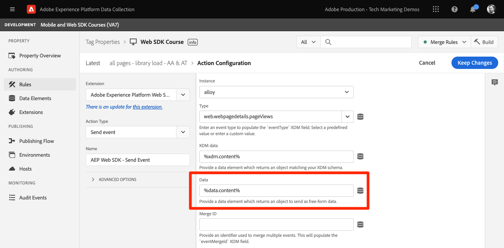

# Adobe Target instellen met Platform Web SDK

Leer hoe u Adobe Target implementeert met de Platform Web SDK. Leer hoe u ervaringen kunt bieden en hoe u extra parameters aan Target kunt doorgeven.

[Adobe Target](https://experienceleague.adobe.com/docs/target/using/target-home.html) is de Adobe Experience Cloud-toepassing die alles biedt wat u nodig hebt om de ervaring van uw klanten op maat te maken en aan te passen, zodat u uw omzet kunt maximaliseren op uw websites en mobiele sites, apps en andere digitale kanalen.


## Leerdoelstellingen

Aan het eind van deze les, zult u het volgende met een implementatie van SDK van het Web van Doel kunnen doen:

* Voeg het voorverborgen fragment toe om flikkering te voorkomen
* Een gegevensstroom configureren om de functionaliteit Doel in te schakelen
* De visuele ervaringscomposeractiviteiten renderen
* Activiteiten van formuliercomposers renderen
* Geef XDM-gegevens door aan Doel en begrijp de toewijzing aan Doelparameters
* Aangepaste gegevens aan doel doorgeven, zoals profiel- en entiteitsparameters
* Een doelimplementatie valideren
* Afzonderlijke personalisatieverzoeken van analyseverzoeken

>[!TIP]
>
>Zie onze [Doel migreren van at.js 2.x naar Platform Web SDK](/help/tutorial-migrate-target-websdk/introduction.md) zelfstudie voor een stapsgewijze handleiding voor het migreren van uw bestaande implementatie at.js.


## Vereisten

Om de lessen in deze sectie te voltooien, moet u eerst:

* Voltooi alle lessen voor aanvankelijke configuratie van het Web SDK van het Platform, met inbegrip van opstellings gegevenselementen en regels.
* Zorg ervoor dat u een [De rol Editor of fiatteur](https://experienceleague.adobe.com/docs/target/using/administer/manage-users/enterprise/properties-overview.html#section_8C425E43E5DD4111BBFC734A2B7ABC80) in Adobe Target.
* Installeer de [Helpextensie Visual Experience Composer](https://experienceleague.adobe.com/docs/target/using/experiences/vec/troubleshoot-composer/vec-helper-browser-extension.html) als u de Google Chrome-browser gebruikt.
* Weet hoe u activiteiten in Target kunt instellen. Als u een herhaling nodig hebt, zijn de volgende zelfstudies en hulplijnen handig voor deze les:
   * [De extensie Visual Experience Composer (VEC) gebruiken](https://experienceleague.adobe.com/docs/target/using/experiences/vec/troubleshoot-composer/vec-helper-browser-extension.html)
   * [De composer voor visuele ervaring gebruiken](https://experienceleague.adobe.com/docs/target-learn/tutorials/experiences/use-the-visual-experience-composer.html)
   * [De Form-Based Experience Composer gebruiken](https://experienceleague.adobe.com/docs/target-learn/tutorials/experiences/use-the-form-based-experience-composer.html)
   * [Gericht op ervaring maken](https://experienceleague.adobe.com/docs/target-learn/tutorials/activities/create-experience-targeting-activities.html)

## Flikkeringsafhandeling toevoegen

Bepaal voordat u begint of er een extra flikkerafhandelingsoplossing nodig is, afhankelijk van de manier waarop de tagbibliotheek is geladen.

>[!NOTE]
>
>Deze zelfstudie gebruikt de [Luminantiesite](https://luma.enablementadobe.com/content/luma/us/en.html) die een asynchrone implementatie van tags en flikkermitigatie heeft. Deze sectie is voor verwijzing om te begrijpen hoe de het flikkeren matiging met het Web SDK van het Platform werkt.


### Asynchrone implementatie

Wanneer een tagbibliotheek asynchroon wordt geladen, kan de pagina de rendering voltooien voordat Target de standaardinhoud heeft vervangen door gepersonaliseerde inhoud. Dit gedrag kan leiden tot wat &quot;flikkering&quot;wordt genoemd waar de standaardinhoud kort toont alvorens door de gepersonaliseerde inhoud wordt vervangen die door Doel wordt gespecificeerd. Als u deze flikkering wilt vermijden, raadt de Adobe aan een speciaal vooraf verborgen fragment toe te voegen vlak voor de asynchrone code voor het insluiten van tags.

Dit fragment is al aanwezig op de Luma-site, maar laten we eens nader kijken om te begrijpen wat deze code doet:

```html
<script>
  !function(e,a,n,t){var i=e.head;if(i){
  if (a) return;
  var o=e.createElement("style");
  o.id="alloy-prehiding",o.innerText=n,i.appendChild(o),setTimeout(function(){o.parentNode&&o.parentNode.removeChild(o)},t)}}
  (document, document.location.href.indexOf("adobe_authoring_enabled") !== -1, ".personalization-container { opacity: 0 !important }", 3000);
</script>
```

Het vooraf verborgen fragment maakt een stijltag in de kop van de pagina met de CSS-definitie van uw keuze. Deze stijlmarkering wordt verwijderd wanneer een reactie van Doel wordt ontvangen, of de onderbreking wordt bereikt.

Het gedrag voor het voorverbergen wordt bepaald door twee configuraties helemaal aan het einde van het fragment.

* `body { opacity: 0 !important }` geeft de CSS-definitie aan die moet worden gebruikt voor de voorverbergen totdat Doel wordt geladen. Standaard is de hele pagina verborgen. U kunt deze definitie bijwerken naar de kiezers die u wilt voorverbergen en naar de manier waarop u deze wilt verbergen. U kunt meerdere definities opnemen, aangezien deze waarde eenvoudig is wat wordt ingevoegd in de stijl die u vooraf verbergt. Als u een gemakkelijk identificeerbaar containerelement hebt dat de inhoud onder uw navigatie verpakt, kunt u deze instelling gebruiken om het vooraf verbergen tot dat containerelement te beperken.
* `3000` geeft de time-out op in milliseconden voor het voorverbergen. Als een reactie van Target niet vóór de time-out wordt ontvangen, wordt de stijltag die voor de gebeurtenis werd verborgen, verwijderd. Het bereiken van deze time-out moet zeldzaam zijn.

>[!NOTE]
>
>Het pre-verbergende fragment voor het Web SDK van het Platform is lichtjes verschillend van dat gebruikt met het Doel at.js bibliotheek. Ben zeker om het correcte fragment voor het Web SDK van het Platform te gebruiken aangezien het een verschillende stijlidentiteitskaart van `alloy-prehiding`. Als het voorverborgen fragment voor at.js wordt gebruikt, werkt het mogelijk niet correct.

Het voorverborgen fragment is ook beschikbaar binnen tags:

1. Ga naar de **[!UICONTROL Extensions]** sectie van tags
1. Selecteren **[!UICONTROL Configure]** voor de Adobe Experience Platform Web SDK-extensie
1. Selecteer de **[!UICONTROL Copy pre-hiding snippet to clipboard]** knop

   

   >[!NOTE]
   >
   >Het standaard pre-verbergende die fragment van de uitbreiding van SDK van het Web van het Platform wordt gekopieerd kan een CSS definitie omvatten die niet op uw plaats, zoals bestaat `.personalization-container { opacity: 0 !important }`. Controleer en wijzig het vooraf verborgen fragment op de juiste wijze voor uw site.

### Synchrone implementatie

Adobe raadt u aan om tags asynchroon te implementeren, zoals op de Luministocatie wordt getoond. Als de tagbibliotheek echter synchroon wordt geladen, is het vooraf verborgen fragment niet vereist. In plaats daarvan, wordt de pre-verbergende stijl gespecificeerd in de de uitbreidingsmontages van SDK van het Web van het Platform.

De pre-verbergende stijl voor synchrone implementaties kan als volgt worden gevormd:

1. Ga naar de **[!UICONTROL Extensions]** sectie van tags
1. Selecteer de **[!UICONTROL Configure]** knop voor de extensie Platform Web SDK
1. Selecteer de **[!UICONTROL Edit pre-hiding style]** knop

   

1. Wijzig CSS om de selecteurs te omvatten en methodes te verbergen u, bijvoorbeeld zou willen gebruiken: `body { opacity: 0 !important }` als u de hele hoofdtekst van de pagina wilt voorverbergen.
1. Uw wijzigingen opslaan en bouwen naar een bibliotheek

>[!NOTE]
>
>De vooraf verborgen stijlinstelling is alleen bedoeld voor synchrone implementaties. Deze stijl moet leeg zijn of er moet commentaar op worden toegevoegd als u een asynchrone implementatie van tags gebruikt.

Als u meer wilt weten over de manier waarop flikkering kan worden beheerd in de Web SDK van het platform, kunt u naar de sectie met hulplijnen verwijzen: [flikkering beheren voor persoonlijke ervaringen](https://experienceleague.adobe.com/docs/experience-platform/edge/personalization/manage-flicker.html).


## De gegevensstroom configureren

Het doel moet in de gegevensstroomconfiguratie worden toegelaten alvorens om het even welke activiteiten van het Doel door het Web SDK van het Platform kunnen worden geleverd.

Om Doel in de gegevensstroom te vormen:

1. Ga naar de [Gegevensverzameling](https://experience.adobe.com/#/data-collection){target="blank"} interface
1. Selecteer in de linkernavigatie de optie **[!UICONTROL Datastreams]**
1. Selecteer de eerder gemaakte `Luma Web SDK: Development Environment` datastream

   

1. Selecteren **[!UICONTROL Add Service]**
   
1. Selecteren **[!UICONTROL Adobe Target]** als de **[!UICONTROL Service]**
1. Voer desgewenst de optionele details over uw doelimplementatie in volgens de onderstaande richtlijnen.
1. Selecteren **[!UICONTROL Save]**

   

### Eigenschappentoken

Klanten van Target Premium hebben de mogelijkheid om gebruikersmachtigingen te beheren met eigenschappen. Met de doeleigenschappen kunt u grenzen vaststellen waar gebruikers doelactiviteiten kunnen uitvoeren. Zie de [Bedrijfsmachtigingen](https://experienceleague.adobe.com/docs/target/using/administer/manage-users/enterprise/properties-overview.html) in de documentatie van Target voor meer informatie.

Als u eigenschapstokens wilt instellen of zoeken, navigeert u naar **Adobe Target** > **[!UICONTROL Administration]** > **[!UICONTROL Properties]**. De `</>` geeft de implementatiecode weer. De `at_property` value is het eigenschapstoken dat u in uw datastream zou gebruiken.


<a id="advanced-pto"></a>

Er kan slechts één eigenschapstoken per gegevensstroom worden opgegeven, maar met overschrijvingen van eigenschapstoken kunt u alternatieve eigenschapstokens opgeven ter vervanging van het primaire eigenschapstoken dat in de gegevensstroom is gedefinieerd. Een update van de `sendEvent` Er is ook actie nodig om de gegevensstroom te overschrijven.


### Id van doelomgeving

[Omgevingen](https://experienceleague.adobe.com/docs/target/using/administer/environments.html) in Target Help kunt u uw implementatie in alle ontwikkelingsstadia beheren. Deze optionele instelling geeft aan welke doelomgeving u voor elke gegevensstroom wilt gebruiken.

De Adobe raadt aan om de ID van het Milieu van het Doel voor elk van uw ontwikkeling, het opvoeren, en productiegegevensstromen verschillend te plaatsen om dingen eenvoudig te houden. U kunt uw omgevingen ook in de doelinterface ordenen met de [gastheren](https://experienceleague.adobe.com/docs/target/using/administer/hosts.html) gebruiken.

Navigeer naar Omgeving-id&#39;s om deze in te stellen of te zoeken **Adobe Target** > **[!UICONTROL Administration]** > **[!UICONTROL Environments]**.


>[!NOTE]
>
>Als geen identiteitskaart van het Milieu van het Doel wordt gespecificeerd, dan wordt het milieu van het productieDoel verondersteld.

### Doelnaamruimte voor id van derden

Met deze optionele instelling kunt u opgeven welk identiteitssymbool u wilt gebruiken voor de doel-id van derden. Het doel ondersteunt alleen profielsynchronisatie op één identiteitssymbool of naamruimte. Voor meer informatie kunt u naar de [Real-Time profielsynchronisatie voor mbox3rdPartyId](https://experienceleague.adobe.com/docs/target/using/audiences/visitor-profiles/3rd-party-id.html) van de doelhandleiding.

De identiteitssymbolen staan in de lijst met identiteiten onder **Gegevensverzameling** > **[!UICONTROL Customer]** > **[!UICONTROL Identities]**.


In deze zelfstudie gebruikt u de site Luma en gebruikt u het identiteitssymbool `lumaCrmId` opstelling tijdens de les over [Identiteiten](configure-identities.md).


## Besluiten over visuele personalisatie renderen

Visuele verpersoonlijkingsbesluiten verwijzen naar de ervaringen die in Adobe Target visuele ervaringscomposer worden gecreeerd. Eerst, zou u de terminologie moeten begrijpen die in het Doel wordt gebruikt en etiketteert interfaces:

* **Activiteit**: Een reeks ervaringen voor een of meer doelgroepen. Een eenvoudige A/B-test kan bijvoorbeeld een activiteit zijn met twee ervaringen.
* **Ervaring**: Een reeks acties die op een of meer locaties zijn gericht, of beslissingsbereik.
* **Beslissingsbereik**: Een locatie waar een doelervaring wordt geleverd. Beslissingsbereik is gelijk aan &quot;box&quot; als u vertrouwd bent met het gebruik van oudere versies van Target.
* **Personeelsbesluit**: Een actie die de server bepaalt, moet worden toegepast. Deze beslissingen kunnen gebaseerd zijn op publiekscriteria en prioritering van doelactiviteiten.
* **Voorstelling**: Het resultaat van besluiten die door de server worden genomen die in de reactie van SDK van het Web van het Platform worden geleverd. Bijvoorbeeld, zou het ruilen van een bannerbeeld een voorstel zijn.

### Werk de [!UICONTROL Send event] action

De visuele verpersoonlijkingsbesluiten van Doel worden geleverd door het Web SDK van het Platform, als het Doel in de datastream wordt toegelaten. Maar _ze worden niet automatisch weergegeven_. U moet de [!UICONTROL Send event] handeling om automatische rendering in te schakelen.

1. In de [Gegevensverzameling](https://experience.adobe.com/#/data-collection){target="blank"} interface, open het markeringsbezit u voor dit leerprogramma gebruikt
1. Open de `all pages - library loaded - send event - 50` regel
1. Selecteer de `Adobe Experience Platform Web SDK - Send event` action
1. Inschakelen **[!UICONTROL Render visual personalization decisions]** met het selectievakje

   

<!--
1. In the **[!UICONTROL Datastream configuration overrides**] the **[!UICONTROL Target Property Token]** can be overridden either as a static value or with a data element. Only property tokens defined in the [**Advanced Property Token Overrides**](#advanced-pto) section in **Datastream Configuration** will return results.
   
   
   -->

1. Uw wijzigingen opslaan en vervolgens samenstellen in uw bibliotheek

Renderen visuele verpersoonlijkingsbesluiten die tot het Web SDK van het Platform automatisch om het even welke wijzigingen toepassen die gebruikend Composer van de Ervaring van het Doel Visuele of &quot;globale mbox&quot;werden gespecificeerd.

>[!NOTE]
>
>De [!UICONTROL Render visual personalization decisions] Deze instelling mag alleen worden ingeschakeld voor één verzendactie per volledige paginalading. Als deze instelling is ingeschakeld voor meerdere Send Event-acties, worden daaropvolgende renderaanvragen genegeerd.

Als u deze beslissingen liever zelf rendert of activeert met behulp van aangepaste code, kunt u de optie [!UICONTROL Render visual personalization decisions] instellen uitgeschakeld. De SDK van het Web van het platform is flexibel en verstrekt dit vermogen om u volledige controle te geven. U kunt de handleiding raadplegen voor meer informatie over [handmatig gepersonaliseerde inhoud renderen](https://experienceleague.adobe.com/docs/experience-platform/edge/personalization/rendering-personalization-content.html).


### Opstelling een activiteit van het Doel met Visuele Composer van de Ervaring

Nu het basisgedeelte van de implementatie volledig is, creeer een Ervaring richtend (XT) activiteit in Doel om te bevestigen dat alles correct werkt. U kunt de zelfstudie Doel raadplegen voor [het creëren van Ervaring richt activiteiten](https://experienceleague.adobe.com/docs/target-learn/tutorials/activities/create-experience-targeting-activities.html) als u hulp nodig hebt.

>[!NOTE]
>
>Als u Google Chrome als browser gebruikt, wordt [Helperextensie Visual Experience Composer (VEC)](https://experienceleague.adobe.com/docs/target/using/experiences/vec/troubleshoot-composer/vec-helper-browser-extension.html?lang=en) is vereist om de site correct te laden voor bewerking in de VEC.

1. Navigeren naar de Adobe Target-interface
1. Een &#39;Experience Targeting&#39;-activiteit maken met de Luma-homepage voor de activiteit-URL

   

1. Wijzig de pagina, bijvoorbeeld wijzig de tekst op de homepage hoofdbanner.  Selecteer **[!UICONTROL Save]** dan **[!UICONTROL Next]**.

   

1. Werk de naam van de gebeurtenis bij en selecteer **[!UICONTROL Next]**.

   

1. Kies Adobe Analytics als rapporteringsbron met de aangewezen rapportreeks en de metrische Orden als doel

   

   >[!NOTE]
   >
   >Als u Adobe Analytics niet gebruikt, selecteert u Doel als rapportbron en kiest u een andere maatstaf, bijvoorbeeld **Betrokkenheid > Paginaweergaven** in plaats daarvan. Een doel metrisch wordt vereist om de activiteit te bewaren en voor te vertonen.

1. De activiteit opslaan
1. Als u op de hoogte bent van uw wijzigingen, kunt u uw activiteit activeren. Als u de ervaring wilt voorvertonen zonder deze te activeren, kunt u de opdracht [URL kwaliteitscontrole](https://experienceleague.adobe.com/docs/target/using/activities/activity-qa/activity-qa.html).
1. Laad de startpagina van de luminantie en u ziet dat de wijzigingen zijn toegepast
1. Na een paar uur, zou u de activiteitsgegevens en omzettingen van het Doel in Adobe Analytics moeten kunnen zien. Raadpleeg de doelgids voor meer informatie over [Analyses voor doelrapportage (A4T)](https://experienceleague.adobe.com/docs/target/using/integrate/a4t/reporting.html?lang=en).


### Valideren met Foutopsporing

Als u een activiteit instelt, wordt de inhoud weergegeven op de pagina. Nochtans zelfs als geen activiteiten levend zijn, kunt u de Send het netwerkvraag van de Gebeurtenis ook bekijken om te bevestigen dat het Doel behoorlijk wordt gevormd.

>[!CAUTION]
>
>Als u Google Chrome gebruikt en de [Helperextensie Visual Experience Composer (VEC)](https://experienceleague.adobe.com/docs/target/using/experiences/vec/troubleshoot-composer/vec-helper-browser-extension.html?lang=en) geïnstalleerd, zorg ervoor de **Doelbibliotheken injecteren** instellen is uitgeschakeld. Als u deze instelling inschakelt, worden er extra aanvragen voor het doel ingediend.

1. De browserextensie van het Adobe Experience Platform Debugger openen
1. Ga naar de [Luma-demosite](https://luma.enablementadobe.com/content/luma/us/en.html) en gebruik foutopsporing om [schakelen van de markeringseigenschap op de site naar uw eigen ontwikkeleigenschap](validate-with-debugger.md#use-the-experience-platform-debugger-to-map-to-your-tags-property)
1. De pagina opnieuw laden
1. Selecteer de **[!UICONTROL Network]** in de foutopsporing
1. Filteren op **[!UICONTROL Adobe Experience Platform Web SDK]**
1. Selecteer de waarde in de gebeurtenisrij voor de eerste aanroep

   

1. Er zijn toetsen onder `query` > `personalization` en  `decisionScopes` heeft een waarde van `__view__`. Dit bereik is gelijk aan het `target-global-mbox`. Deze vraag van SDK van het Web van Platform vroeg besluiten van Doel.

   

1. Sluit de bedekking en selecteer de gebeurtenisdetails voor de tweede netwerkvraag. Deze vraag is slechts aanwezig als het Doel een activiteit terugkeerde.
1. U ziet dat er details zijn over de activiteit en ervaring die door Target zijn geretourneerd. Deze vraag van SDK van het Web van Platform verzendt een bericht dat een activiteit van het Doel aan de gebruiker werd teruggegeven en verhoogt een indruk.

   

## Een aangepast beslissingsbereik instellen en maken

Het besluitvormingswerkingsgebied van de douane (vroeger genoemd geworden &quot;mboxes&quot;) kan worden gebruikt om HTML of inhoud JSON op een gestructureerde manier te leveren gebruikend de Vorm-Gebaseerde Composer van de Ervaring van het Doel. De inhoud die aan één van deze douanewerkingsgebied wordt geleverd wordt niet automatisch teruggegeven door het Web SDK van het Platform. Het kan worden teruggegeven gebruikend een actie in Markeringen.

### Een bereik toevoegen aan de [!UICONTROL Send event action]

Wijzig de regel voor het laden van de pagina om een aangepast beslissingsbereik toe te voegen:

1. Open de `all pages - library loaded - send event - 50` regel
1. Selecteer de `Adobe Experience Platform Web SDK - Send Event` action
1. Voeg een of meer bereiken toe die u wilt gebruiken. In dit voorbeeld kunt u `homepage-hero`.

   

1. Uw wijzigingen opslaan en samenstellen in uw bibliotheek

>[!TIP]
>
>In deze zelfstudie gebruikt u één handmatig gedefinieerd bereik voor demonstratiedoeleinden. Als u besluit om verscheidene besluitvormingswerkingsgebied te gebruiken dat voor specifieke pagina&#39;s bedoeld is, dan zou u moeten overwegen gebruikend een gegevenselement dat een serie van werkingsgebied afhankelijk van de paginappad voorwaardelijk terugkeert. Deze benadering helpt uw implementatie eenvoudig en schaalbaar te houden.

### De reactie van Doel verwerken

Nu u SDK van het Web van het Platform hebt gevormd om inhoud voor te verzoeken `homepage-hero` bereik, moet je iets doen met het antwoord. De tagextensie Platform Web SDK biedt een [!UICONTROL Send Event Complete] gebeurtenis die kan worden gebruikt om onmiddellijk een nieuwe regel te activeren wanneer een reactie van een [!UICONTROL Send Event] actie is ontvangen.

1. Een aangeroepen regel maken `homepage - send event complete - render homepage-hero`.
1. Voeg een gebeurtenis aan de regel toe. Gebruik de **Adobe Experience Platform Web SDK** en de **[!UICONTROL Send event complete]** gebeurtenistype.
1. Voeg een voorwaarde toe om de regel tot de homepage van Luma (weg zonder vraagkoordgelijken te beperken) `/content/luma/us/en.html`).
1. Voeg een handeling aan de regel toe. Gebruik de **Adobe Experience Platform Web SDK** uitbreiding en **Proposities toepassen** actietype.

   

   >[!TIP]
   >
   >Geef uw regelgebeurtenissen, -voorwaarden en -handelingen beschrijvende namen in plaats van de standaardnamen te gebruiken. De robuuste namen van de regelcomponent maken de onderzoeksresultaten veel nuttiger.

1. Enter `%event.propositions%` in het veld Proposities als we de gebeurtenis &quot;Send event complete&quot; gebruiken als trigger voor deze regel.
1. Selecteer in de sectie &#39;Metagegevens van voorstel&#39; de optie **[!UICONTROL Use a form]**
1. Voor de **[!UICONTROL Scope]** veldinvoer `homepage-hero`
1. Voor de **[!UICONTROL Selector]** veldinvoer `div.heroimage`
1. Voor **[!UICONTROL Action Type]** selecteren **[!UICONTROL Set HTML]**

   

1. Uw wijzigingen opslaan en samenstellen in uw bibliotheek
1. Laad de Luminantiepagina een paar keer, wat voldoende zou moeten zijn om de nieuwe pagina te maken `homepage-hero` register van het beslissingswerkingsgebied in de interface van het Doel.

### Een doelactiviteit instellen met de Form-based Experience Composer

Nu u een regel hebt om een gebied van de douanebeslissing manueel terug te geven, kunt u een andere Ervaring creëren richtend (XT) activiteit in Doel. Dit keer gebruikt u de Form-Based Experience Composer.

1. Openen [Adobe Target](https://experience.adobe.com/target)
1. De activiteit deactiveren die voor de vorige les wordt gebruikt
1. Een Experience Targeting-activiteit (XT) maken met de optie Form-based Experience Composer

   

1. Selecteer de **`homepage-hero`** locatie in het vervolgkeuzemenu voor de locatie en **[!UICONTROL Create HTML Offer]** in het vervolgkeuzemenu Inhoud. Als de locatie niet beschikbaar is, kunt u deze typen. Het doel vult periodiek nieuwe plaatsnamen na het ontvangen van verzoeken voor die plaats of werkingsgebied.

   

1. Plak de volgende code in het inhoudsvak. Deze code is een standaardhoofdbanner met een andere achtergrondafbeelding:

   ```html
   <div class="we-HeroImage jumbotron" style="background-image: url('/content/luma/us/en/women/_jcr_content/root/hero_image.coreimg.jpeg');">
      <div class="container cq-dd-image">
         <div class="we-HeroImage-wrapper">
            <p class="h3">New Luma Yoga Collection</p>
            <strong class="we-HeroImage-title h1">Be active with style&nbsp;</strong>
            <p>
               <a class="btn btn-primary btn-action" href="/content/luma/us/en/products.html" role="button">Shop Now</a>
            </p>
         </div>
      </div>
   </div>
   ```

1. Op de [!UICONTROL Goals & Settings] kiest u Adobe Target als bron voor de rapportage en [!UICONTROL Engagement] > [!UICONTROL Page Views] als doel
1. De activiteit opslaan
1. Als u op de hoogte bent van uw wijzigingen, kunt u uw activiteit activeren. Als u de ervaring wilt voorvertonen zonder deze te activeren, kunt u de opdracht [URL kwaliteitscontrole](https://experienceleague.adobe.com/docs/target/using/activities/activity-qa/activity-qa.html).
1. Laad de startpagina van de luminantie en u ziet dat de wijzigingen zijn toegepast

>[!NOTE]
>
>Het doel van de conversie &#39;Aangeklikt op mbox&#39; werkt niet automatisch. Omdat het Web SDK van het Platform niet automatisch douanewerkingsgebied teruggeeft, volgt het geen kliks aan plaatsen u verkiest om de inhoud toe te passen. U kunt uw eigen klik het volgen voor elk werkingsgebied tot stand brengen gebruikend &quot;klik&quot; `eventType` met toepassing van `_experience` details die `sendEvent` handeling.

### Valideren met Foutopsporing

Als u uw activiteit hebt geactiveerd, wordt de inhoud weergegeven op de pagina. Maar zelfs als er geen activiteiten actief zijn, kunt u ook kijken naar de [!UICONTROL Send Event] netwerkvraag om te bevestigen dat het Doel inhoud voor uw douanewerkingsgebied verzoekt.

1. De Adobe Experience Platform Debugger-browserextensie openen
1. Ga naar de [Luma-demosite](https://luma.enablementadobe.com/content/luma/us/en.html) en gebruik foutopsporing om [schakelen van de markeringseigenschap op de site naar uw eigen ontwikkeleigenschap](validate-with-debugger.md#use-the-experience-platform-debugger-to-map-to-your-tags-property)
1. De pagina opnieuw laden
1. Selecteer de **[!UICONTROL Network]** in Foutopsporing
1. Filteren op **[!UICONTROL Adobe Experience Platform Web SDK]**
1. Selecteer de waarde in de gebeurtenisrij voor de eerste aanroep

   

1. Er zijn toetsen onder `query` > `personalization` en  `decisionScopes` heeft een waarde van `__view__` zoals voorheen , maar nu is er ook een `homepage-hero` toepassingsgebied opgenomen. Deze vraag van SDK van het Web van het Platform verzocht om besluiten van Doel voor veranderingen die worden aangebracht gebruikend VEC en specifiek `homepage-hero` locatie.

   

1. Sluit de bedekking en selecteer de gebeurtenisdetails voor de tweede netwerkvraag. Deze vraag is slechts aanwezig als het Doel een activiteit terugkeerde.
1. U ziet dat er details zijn over de activiteit en ervaring die door Target zijn geretourneerd. Deze vraag van SDK van het Web van Platform verzendt een bericht dat een activiteit van het Doel aan de gebruiker werd teruggegeven en verhoogt een indruk.

   

## Parameters naar doel verzenden

In deze sectie, zult u specifiek doel-specifieke gegevens overgaan en een dichtere blik nemen bij hoe de gegevens XDM aan de parameters van het Doel in kaart worden gebracht.

### Parameters pagina (mbox) en XDM

Alle XDM-velden worden automatisch als doel doorgegeven [paginaparameters](https://experienceleague.adobe.com/en/docs/target-dev/developer/implementation/methods/page) of mbox-parameters.

Sommige van deze XDM-velden worden toegewezen aan speciale objecten op de achtergrond van Target. Bijvoorbeeld: `web.webPageDetails.URL` is automatisch beschikbaar voor het maken van URL-doelvoorwaarden of als de `page.url` -object bij het maken van profielscripts.

### Speciale parameters en het gegevensobject

Er zijn enkele gegevenspunten die nuttig kunnen zijn voor Doel en die niet zijn toegewezen vanuit het XDM-object. Deze speciale doelparameters zijn onder meer:

* [Profielkenmerken](https://experienceleague.adobe.com/docs/target/using/implement-target/before-implement/methods/in-page-profile-attributes.html?lang=en)
* [Kenmerken Recommendations-entiteit](https://experienceleague.adobe.com/docs/target/using/recommendations/entities/entity-attributes.html?lang=en)
* [Voor Recommendations gereserveerde parameters](https://experienceleague.adobe.com/docs/target/using/recommendations/plan-implement.html?lang=en#pass-behavioral)
* Categoriewaarden voor [categorie-affiniteit](https://experienceleague.adobe.com/docs/target/using/audiences/visitor-profiles/category-affinity.html?lang=en)

Deze parameters moeten worden verzonden in de `data` object in plaats van in de `xdm` object. Bovendien kunnen pagina- (of mbox-)parameters ook worden opgenomen in de `data` object.

Als u het gegevensobject wilt vullen, maakt u het volgende gegevenselement en gebruikt u de gegevenselementen die in het dialoogvenster [Gegevenselementen maken](create-data-elements.md) les:

* **`data.content`** de volgende aangepaste code gebruiken:

  ```javascript
  var data = {
     __adobe: {
        target: {
           "entity.id": _satellite.getVar("product.productInfo.sku"),
           "entity.name": _satellite.getVar("product.productInfo.title"),
           "profile.loggedIn": _satellite.getVar("user.profile.attributes.loggedIn"),
           "user.categoryId": _satellite.getVar("product.category")
        }
     }
  }
  return data;
  ```


### De regel voor het laden van de pagina bijwerken

Als u aanvullende gegevens voor Doel buiten het XDM-object wilt doorgeven, moet u alle toepasselijke regels bijwerken. In dit voorbeeld hoeft u alleen de nieuwe **data.content** gegevenselement aan de generische de regel van de paginading en de meningsregel van de productpagina.

1. Open de `all pages - library loaded - send event - 50` regel
1. Selecteer de `Adobe Experience Platform Web SDK - Send event` action
1. Voeg de `data.content` gegevenselement naar het veld Gegevens

   

1. Uw wijzigingen opslaan en samenstellen in uw bibliotheek
1. Herhaal stap 1 tot en met 4 voor de **e-commerce - geladen bibliotheek - stel productdetailvariabelen in - 20** regel

>[!NOTE]
>
>In het bovenstaande voorbeeld wordt een `data` -object dat niet op alle paginatypen volledig is ingevuld. Deze situatie wordt op de juiste wijze afgehandeld door labels en er worden sleutels weggelaten met een ongedefinieerde waarde. Bijvoorbeeld: `entity.id` en `entity.name` niet op pagina&#39;s worden doorgestuurd, afgezien van de productdetails.


## Aanvragen voor personalisatie en analyse splitsen

De gegevenslaag op de Luminasite is volledig gedefinieerd voordat de tags code insluiten. Op deze manier kunnen we een enkele oproep doen om persoonlijke inhoud op te halen (bijvoorbeeld vanuit Adobe Target) en analysegegevens te verzenden (bijvoorbeeld naar Adobe Analytics).

Op vele websites, echter, kan de gegevenslaag niet vroeg genoeg of snel genoeg worden geladen om één enkele vraag voor beide toepassingen te gebruiken. In die situaties kunt u twee [!UICONTROL Send event] handelingen op één pagina laden en de eerste voor personalisatie en de tweede voor analyse gebruiken. Door de gebeurtenissen op deze manier op te splitsen, kan de verpersoonlijkingsgebeurtenis zo vroeg mogelijk worden geactiveerd, terwijl wordt gewacht tot de gegevenslaag volledig is geladen voordat de gebeurtenis Analytics wordt verzonden. Dit is gelijkaardig aan vele implementaties van pre-Web SDK, waar Adobe Target de `target-global-mbox` boven aan de pagina en Adobe Analytics zou de `s.t()` bellen onderaan op de pagina

Om verpersoonlijking-op-hoogste verzoek tot stand te brengen:

1. Open de `all pages - library loaded - send event - 50` regel
1. Open de **Gebeurtenis Send** action
1. Selecteren **[!UICONTROL Use guided events]** en selecteer vervolgens **[!UICONTROL Request personalization]**
1. Hierdoor worden de **Type** als **[!UICONTROL Decisioning Proposition Fetch]**

   

U kunt als volgt het verzoek Analytics-on-bottom maken:

1. Een nieuwe regel maken met de naam `all pages - page bottom - send event - 50`
1. Voeg een gebeurtenis aan de regel toe. Gebruik de **Kern** en de **[!UICONTROL Page Bottom]** gebeurtenistype
1. Voeg een handeling aan de regel toe. Gebruik de **Adobe Experience Platform Web SDK** uitbreiding en **Gebeurtenis Send** actietype
1. Selecteren **[!UICONTROL Use guided events]** en selecteer vervolgens **[!UICONTROL Collect analytics]**
1. Hierdoor worden de **[!UICONTROL Include pending display notifications]** checkbox selecteerde zodat zal het een rij gevormde vertoningsbericht van het beslissingsverzoek worden verzonden.


>[!TIP]
>
>Als de gebeurtenis u een BeslissingsPositie voor haalt geen gebeurtenis van Adobe Analytics na het heeft gebruikt **Gebeurtenisstijl Met instructies** **[!UICONTROL Unguided - show all fields]**. U moet alle opties handmatig selecteren, maar hierdoor wordt de optie ontgrendeld om **[!UICONTROL automatically send a display notification]** samen met uw aanvraag voor het ophalen.


### Valideren met Foutopsporing

Nu de regels zijn bijgewerkt, kunt u controleren of de gegevens correct worden doorgegeven met de Adobe Debugger.

1. Ga naar de [Luma-demosite](https://luma.enablementadobe.com/content/luma/us/en.html) en aanmelden met de e-mail `test@adobe.com` en wachtwoord `test`
1. Naar de pagina met productdetails gaan
1. Open de browserextensie van Adobe Experience Platform Debugger en [schakel de eigenschap tag over naar uw eigen ontwikkeleigenschap](validate-with-debugger.md#use-the-experience-platform-debugger-to-map-to-your-tags-property)
1. De pagina opnieuw laden
1. Selecteer de **Netwerk** in Foutopsporing en filteren op **Adobe Experience Platform Web SDK**
1. Selecteer de waarde in de gebeurtenisrij voor de eerste aanroep
1. Er zijn toetsen onder `data` > `__adobe` > `target` en worden ze gevuld met informatie over het product, de categorie en de aanmeldingsstatus.

   

### Valideren in de interface Doel

Daarna, kijk in de interface van het Doel om te bevestigen dat de gegevens werden ontvangen en beschikbaar om in publiek en activiteiten te gebruiken zijn. XDM-gegevens worden automatisch toegewezen aan aangepaste doelparameters. U kunt controleren of XDM-gegevens door Target zijn ontvangen en beschikbaar zijn door een publiek te maken.

1. Openen [Adobe Target](https://experience.adobe.com/target)
1. Ga naar de **[!UICONTROL Audiences]** sectie
1. Maak een publiek en kies de optie **[!UICONTROL Custom]** kenmerktype
1. Zoeken in de **[!UICONTROL Parameter]** veld voor `web`. In het vervolgkeuzemenu moeten alle XDM-velden worden ingevuld die betrekking hebben op de details van de webpagina.

   

Controleer vervolgens of het kenmerk voor het profiel van de aanmeldingsstatus is geslaagd.

1. Kies de optie **[!UICONTROL Visitor Profile]** kenmerktype
2. Zoeken naar `loggedIn`. Als het kenmerk beschikbaar is in het vervolgkeuzemenu, wordt het kenmerk op de juiste wijze aan Doel doorgegeven. Het kan enkele minuten duren voordat nieuwe kenmerken beschikbaar zijn in de doelinterface.

   

Als u Target Premium hebt, kunt u ook controleren of de eenheidgegevens correct zijn doorgegeven en de productgegevens naar de Recommendations-productcatalogus zijn geschreven.

1. Ga naar de **[!UICONTROL Recommendations]** sectie
1. Selecteren **[!UICONTROL Catalog Search]** links navigeren
1. Zoek naar product SKU of productnaam u eerder op de plaats van de Luma bezocht. Het product moet worden weergegeven in de productcatalogus. Het kan enige minuten duren voordat nieuwe producten doorzoekbaar zijn in de Recommendations-productcatalogus.

   

### Valideren met betrouwbaarheid

Bovendien kunt u Verzekering waar nodig gebruiken om de het besluitvormingsverzoeken van het Doel te bevestigen krijgen de correcte gegevens en dat om het even welke server zijtransformaties correct voorkomen. U kunt campagne en ervaringsinformatie ook bevestigen is bevat in de vraag van Adobe Analytics zelfs wanneer het besluit van het Doel en de vraag van Adobe Analytics afzonderlijk worden verzonden.

1. Openen [Betrouwbaarheid](https://experience.adobe.com/assurance)
1. Start een nieuwe betrouwbaarheidssessie en voer de **[!UICONTROL session name]** en voert u de **[!UICONTROL base url]** voor uw site of een andere pagina die u test
1. Klikken **[!UICONTROL Next]**

   

1. Selecteer uw verbindingsmethode, in dit geval gebruiken wij **[!UICONTROL copy link]**
1. Kopieer de koppeling en plak deze in een nieuw browsertabblad
1. Klikken **[!UICONTROL Done]**

   

1. Zodra uw Assurance-sessie wordt gestart, ziet u de gebeurtenissen die op het tabblad Gebeurtenissen worden gevuld
1. Filteren op &quot;tnta&quot;
1. Selecteer de meest recente vraag en breid de berichten uit om ervoor te zorgen het correct bevolkt en nota van de &quot;tnta&quot;waarden

   

1. Vervolgens behoudt u het filter &quot;tnta&quot; en selecteert u de gebeurtenis analytics.mapping die plaatsvindt na de doelgebeurtenis die we net hebben weergegeven.
1. Onderzoek &quot;context.mappedQueryParams.\&lt;yourschemaname>&quot;value to confirm it contains a &quot;tnta&quot; attribute with a concatenated string that match the &quot;tnta&quot; values found in the previous target event.

   

Dit bevestigt dat de informatie A4T die voor recentere transmissie een rij werd gevormd toen wij de doelbeslissende vraag maakten behoorlijk werd verzonden wanneer de analytische volgende vraag later op de pagina in brand werd gestoken.

Nu u deze les hebt voltooid zou u een werkende implementatie van Adobe Target moeten hebben gebruikend het Web SDK van het Platform.

[Volgende: ](setup-web-channel.md)

>[!NOTE]
>
>Bedankt dat u tijd hebt geïnvesteerd in het leren over de SDK van Adobe Experience Platform Web. Als u vragen hebt, algemene feedback wilt delen of suggesties voor toekomstige inhoud hebt, kunt u deze delen over deze [Experience League Communautaire discussiestuk](https://experienceleaguecommunities.adobe.com/t5/adobe-experience-platform-launch/tutorial-discussion-implement-adobe-experience-cloud-with-web/td-p/444996)
