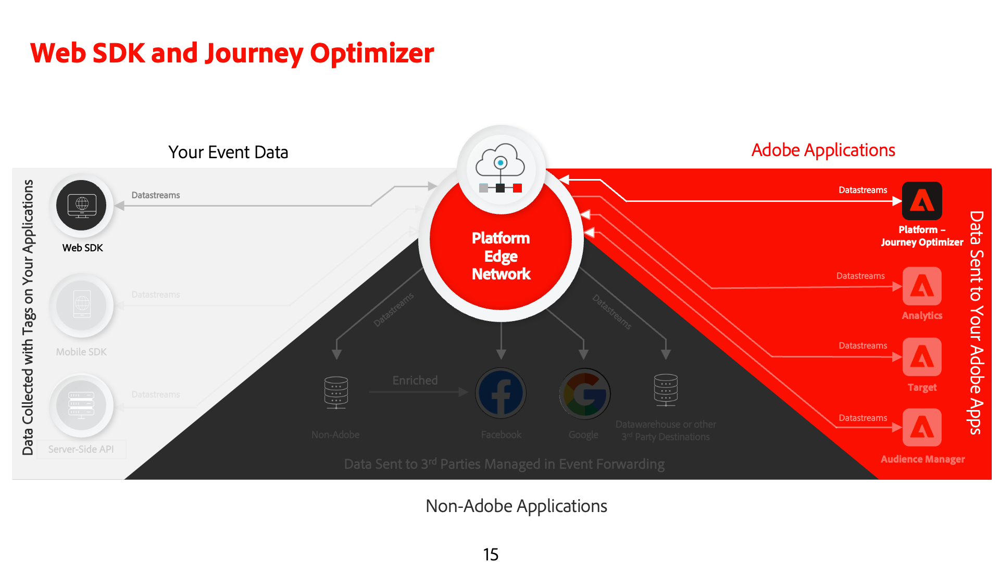
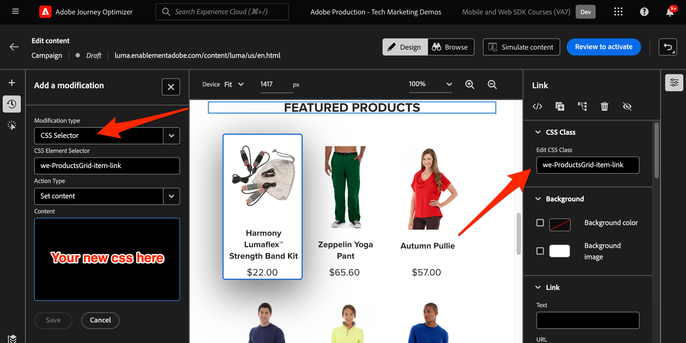

# Journey Optimizer-webkanaal instellen met Web SDK

Leer hoe te om het Webkanaal van Adobe Journey Optimizer [ uit te voeren ](https://experienceleague.adobe.com/en/docs/journey-optimizer/using/web/get-started-web) gebruikend het Web SDK van Adobe Experience Platform. Deze les behandelt de fundamentele vereisten van het Webkanaal, gedetailleerde stappen voor configuratie, en een diepe duik in een gebruiksgeval dat op loyaliteitsstatus wordt gecentreerd.

In deze les zijn Journey Optimizer-gebruikers uitgerust om het webkanaal te gebruiken voor geavanceerde onlinepersonalisatie met de Journey Optimizer-webontwerper.

## Leerdoelen

Aan het einde van deze les kunt u het volgende doen:

* Begrijp de functie en de betekenis van Web SDK bij het leveren van de ervaring van het Webkanaal.
* Begrijp het proces van het creëren van een campagne van het Webkanaal van begin tot eind gebruikend het voorbeeld Luma Loyalty Rewards gebruiksgeval.
* Vorm campagneeigenschappen, acties, en programma&#39;s binnen de interface.
* Begrijp de functionaliteit en de voordelen van de extensie Adobe Experience Cloud Visual Editing Helper.
* Leer met de webontwerper de inhoud van webpagina&#39;s te bewerken, inclusief afbeeldingen, kopteksten en andere elementen.
* Leer hoe u voorstellen op een webpagina invoegt met de beslissingscomponent Voorstel.
* U vertrouwd maken met de beste praktijken om de kwaliteit en het succes van een webkanaalcampagne te garanderen.

## Vereisten

Om de lessen in deze sectie te voltooien, moet u eerst:

* Voltooi alle lessen voor aanvankelijke configuratie van het Web SDK van het Platform, met inbegrip van vestiging gegevenselementen en regels.
* Zorg ervoor dat de extensie Adobe Experience Platform Web SDK 2.16 of hoger is.
* Als u de Journey Optimizer-webontwerper gebruikt om uw webkanaalervaring te ontwerpen, moet u controleren of u de Google Chrome- of Microsoft® Edge-browsers gebruikt.
* Zorg ook u hebt gedownload en [ Adobe Experience Cloud Visuele het Uitgeven de browser van de Helper ](https://chromewebstore.google.com/detail/adobe-experience-cloud-vi/kgmjjkfjacffaebgpkpcllakjifppnca) toegelaten.
* Zorg ervoor dat cookies van derden zijn toegestaan in uw browser. Het kan nodig zijn om ook eventuele advertentieblokkers in uw browser uit te schakelen.

  >[!CAUTION]
  >
  > In de Journey Optimizer-webontwerper kunnen bepaalde websites om een van de volgende redenen niet betrouwbaar worden geopend:
  > 
  > 1. De website heeft een streng beveiligingsbeleid.
  > 1. De website is ingesloten in een iframe.
  > 1. De QA- of werkgebiedsite van de klant is niet extern toegankelijk (het is een interne site).

* Wanneer het creëren van Webervaringen en met inbegrip van inhoud van de bibliotheek van de Hoofdzaak van de Activa van de Manager van de Ervaring van Adobe, is het noodzakelijk om [ subdomain voor het publiceren van deze inhoud ](https://experienceleague.adobe.com/en/docs/journey-optimizer/using/web/configure-web-channel/web-delegated-subdomains) te vormen.
* Als het gebruiken van de eigenschap van de inhoudstest, zorg ervoor dat uw Webdataset ook inbegrepen in uw rapporteringsconfiguratie is.
* Momenteel worden twee typen implementaties ondersteund voor het maken en leveren van webkanaalcampagnes op uw wegeigenschappen:
   * Alleen client: als u uw website wilt wijzigen, moet u de Adobe Experience Platform Web SDK implementeren.
   * Hybride modus: u kunt de Platform Edge Network Server-API gebruiken om de personalisatie op de server aan te vragen. De reactie van de API wordt vervolgens doorgegeven aan de Adobe Experience Platform Web SDK voor het renderen van wijzigingen op de client. Raadpleeg de documentatie bij de Adobe Experience Platform Edge Network Server API voor meer informatie. In dit blogbericht vindt u meer details en implementatiemonsters voor de hybride modus.

  >[!NOTE]
  >
  >Implementatie alleen op de server wordt momenteel niet ondersteund.

## Terminologie

Ten eerste moet u de terminologie begrijpen die in webkanaalcampagnes wordt gebruikt.

* **kanaal van het Web**: Een middel voor mededeling of de levering van inhoud via het Web. In de context van deze handleiding verwijst het naar het mechanisme waarmee gepersonaliseerde inhoud wordt geleverd aan websitebezoekers die de Platform Web SDK, in Adobe Journey Optimizer gebruiken.
* **oppervlakte van het Web**: Verwijs naar een Webbezit dat door URL wordt geïdentificeerd waar de inhoud wordt geleverd. Het kan één of meerdere Web-pagina&#39;s omvatten.
* **het Webontwerper van Journey Optimizer**: Een specifiek hulpmiddel of een interface binnen Journey Optimizer waar de gebruikers hun ervaringen van het Webkanaal kunnen ontwerpen.
* **Adobe Experience Cloud Visuele het Uitgeven Helper**: Een browser uitbreiding die in visueel het uitgeven van en het ontwerpen van de ervaringen van het Webkanaal bijstaat.
* **Datastream**: Een configuratie binnen de dienst van Adobe Experience Platform die ervoor zorgt dat de ervaringen van het Webkanaal kunnen worden geleverd.
* **beleid van de Fusie**: Een configuratie die de nauwkeurige activering en de publicatie van binnenkomende campagnes verzekert.
* **Publiek**: Een specifiek segment van gebruikers of plaatsbezoekers die aan bepaalde criteria voldoen.
* **ontwerper van het Web**: Een interface of een hulpmiddel dat in visueel het uitgeven van en het ontwerpen van Webervaringen zonder diep in code te duiken helpt.
* **de redacteur van de Uitdrukking**: Een hulpmiddel binnen de Webontwerper dat gebruikers toestaat om verpersoonlijking aan webinhoud toe te voegen, potentieel gebaseerd op gegevensattributen of andere criteria.
* **de besluitvormingscomponent van de Aanbieding**: Een component in de Webontwerper die in het beslissen helpt welke aanbieding het meest geschikt is om aan een specifieke bezoeker te worden getoond die op besluitvormingsbeheer wordt gebaseerd.
* **experiment van de Inhoud**: Een methode om verschillende inhoudsvariaties te testen om te weten te komen welke het best in termen van gewenste metrisch, zoals binnenkomende kliks presteert.
* **Behandeling**: In de context van inhoudexperimenten, verwijst een behandeling naar een specifieke variatie van inhoud die tegen een andere wordt getest.
* **Simulatie**: Een voorproefmechanisme om de ervaring van het Webkanaal te visualiseren alvorens het voor levend publiek te activeren.

## De gegevensstroom configureren

U hebt de Adobe Experience Platform-service al toegevoegd aan uw gegevensstroom. Nu moet u de optie Adobe Journey Optimizer inschakelen zodat u webkanaalervaringen kunt aanbieden.

Adobe Journey Optimizer configureren in de gegevensstroom:

1. Ga naar de [ interface van de Inzameling van Gegevens ](https://experience.adobe.com/#/data-collection){target="blank"}.
1. Selecteer **[!UICONTROL Datastreams]** bij de linkernavigatie.
1. Selecteer de eerder gemaakte Luma Web SDK-gegevensstroom.

   

1. Selecteer **[!UICONTROL Edit]** in Adobe Experience Platform.

    uit

1. Schakel het selectievakje **[!UICONTROL Adobe Journey Optimizer]** in.

   

1. Selecteer **[!UICONTROL Save]**.

Dit zorgt ervoor dat binnenkomende gebeurtenissen voor Journey Optimizer correct worden afgehandeld door de Adobe Experience Platform Edge Network.

## Het samenvoegbeleid configureren

Zorg ervoor dat er een samenvoegbeleid is gedefinieerd met de optie **[!UICONTROL Active-On-Edge Merge Policy]** ingeschakeld. Deze optie van het fusiebeleid wordt gebruikt door de inkomende kanalen van Journey Optimizer om de nauwkeurige activering en de publicatie van binnenkomende campagnes op de rand te verzekeren.

De optie configureren in het samenvoegbeleid:

1. Ga naar de pagina **[!UICONTROL Customer]** > **[!UICONTROL Profiles]** in de Experience Platform- of Journey Optimizer-interface.
1. Selecteer het tabblad **[!UICONTROL Merge Policies]**. 
1. Selecteer het beleid (u kunt het beste het [!UICONTROL Default Timebased] beleid gebruiken) en schakel de optie **[!UICONTROL Active-On-Edge Merge Policy]** in de stap **[!UICONTROL Configure]** in of uit.

   

## De webdataset configureren voor het experimenteren met inhoud

Als u inhoudstests wilt gebruiken in webkanaalcampagnes, moet u ervoor zorgen dat de gebruikte webdataset ook wordt opgenomen in uw rapportconfiguratie. Het Journey Optimizer-rapportagesysteem gebruikt de dataset op een alleen-lezen manier om rapporten voor het experimenteren met inhoud buiten de box te vullen.

[ het Toevoegen van datasets voor inhoudexperiment het melden is gedetailleerd in deze sectie ](https://experienceleague.adobe.com/en/docs/journey-optimizer/using/reporting/channel-report/reporting-configuration#add-datasets).

## Hoofdletters gebruiken - Loyalty&#39;s

In deze les, wordt een geval van het de gebruiks van de beloningen van de steekproefLoyalty gebruikt om implementatie van een Webkanaalervaring te detailleren gebruikend het Web SDK.

Met dit gebruiksgeval kunt u beter begrijpen hoe Journey Optimizer uw klanten de beste binnenkomende ervaringen kan bieden, door gebruik te maken van Journey Optimizer-campagnes en de webontwerper.

Aangezien deze zelfstudie gericht is op implementatoren, is het vermeldenswaard dat deze les substantieel interfacewerk in Journey Optimizer impliceert. Hoewel dergelijke interfacetaken doorgaans door marketers worden afgehandeld, kan het voor implementatoren gunstig zijn om insight in het proces te betrekken, zelfs als ze gewoonlijk niet verantwoordelijk zijn voor het maken van een webkanaalcampagne.

### Loyalty Rewards-campagne maken

Nu u onze gegevens van de steekproefloyaliteit hebt gegeten en ons segment creeerde, creeer de het Webkanaalcampagne van Loyalty Rewards in Adobe Journey Optimizer.

De voorbeeldcampagne maken:

1. Open [ Journey Optimizer ](https://experience.adobe.com/journey-optimizer/home){target="_blank"} interface

   >[!NOTE]
   >
   > Het schema, de datasets, en het publiek kunnen ook in de interface van Journey Optimizer worden gebouwd aangezien zij allen gemeenschappelijke constructs van Experience Platform zijn.

1. Ga naar **[!UICONTROL Journey Management]** > **[!UICONTROL Campaigns]** in de linkernavigatie
1. Klik op **[!UICONTROL Create campaign]** rechtsboven.
1. Geef in de sectie **[!UICONTROL Properties]** op hoe u de campagne wilt uitvoeren. Voor het de gebruikscase van de Beloningen van de Loyalty, kies **Gepland**.

   

1. Kies in de sectie **[!UICONTROL Actions]** de optie **[!UICONTROL Web channel]** . Als **[!UICONTROL Web surface]**, uitgezochte **[!UICONTROL Page URL]**.

   >[!NOTE]
   >
   >Een weboppervlak verwijst naar een webeigenschap die wordt geïdentificeerd door een URL waar inhoud wordt geleverd. De URL kan overeenkomen met één pagina of meerdere pagina&#39;s, zodat u wijzigingen kunt toepassen op een of meerdere webpagina&#39;s.

1. Kies de optie **[!UICONTROL Page URL]** Weboppervlak om de ervaring voor deze campagne op één pagina te implementeren. Voer de URL voor de pagina Luma in, `https://luma.enablementadobe.com/content/luma/us/en.html`

1. Selecteer **[!UICONTROL Create]** wanneer het weboppervlak is gedefinieerd.

   

1. Voeg nu enkele aanvullende details toe aan de nieuwe webkanaalcampagne. Geef eerst de naam van de campagne. Roep het `Luma Loyalty Rewards – Gold Status` aan. U kunt desgewenst een beschrijving aan de campagne toevoegen. Voeg ook **[!UICONTROL Tags]** toe om de algemene campagnetaxonomie te verbeteren.

   

1. Standaard is de campagne actief voor alle sitebezoekers. Voor de toepassing van dit gebruiksgeval mogen alleen leden met een goudstatus de ervaring zien. Klik op **[!UICONTROL Select audience]** en kies het `Luma Loyalty Rewards – Gold Status` -publiek om dit in te schakelen.

1. Selecteer in het veld **[!UICONTROL Identity namespace]** de naamruimte voor het identificeren van personen binnen het gekozen segment. Aangezien u de campagne op de plaats van de Luma opstelt, kunt u ECID namespace kiezen. Profielen in het publiek van `Luma Loyalty Rewards – Gold Status` die de ECID-naamruimte tussen hun verschillende identiteiten niet hebben, worden niet aangeroepen door de webkanaalcampagne.

   

1. Plan de campagne om op de datum van vandaag te beginnen gebruikend de **[!UICONTROL Campaign start]** optie, en in een week te eindigen gebruikend de **[!UICONTROL Campaign end]** optie.

   

>[!NOTE]
>
>Houd er rekening mee dat voor webkanaalcampagnes de webervaring wordt weergegeven wanneer de bezoeker de pagina opent. In tegenstelling tot andere typen campagnes in Adobe Journey Optimizer, kan de sectie **[!UICONTROL Action triggers]** daarom niet worden geconfigureerd.

### Experimenteer met Loyalty Rewards-inhoud

Als u omhoog scrolt, in de **[!UICONTROL Action]** sectie, kunt u naar keuze een experiment tot stand brengen om uit te testen welke inhoud beter voor het `Luma Loyalty Rewards – Gold Status` publiek werkt. Laten we twee behandelingen maken en testen als onderdeel van de configuratie van de campagne.

U kunt als volgt het inhoudexperiment maken:

1. Klik op **[!UICONTROL Create experiment]**.

   

1. Kies eerst een **[!UICONTROL Success metric]** . Dit is de maatstaf voor het bepalen van de doeltreffendheid van inhoud. Kies **[!UICONTROL Unique Inbound Clicks]** om te zien welke inhoudsbehandeling meer klikken op het web genereert.

   

1. Wanneer u een experiment instelt met gebruik van een webkanaal en de metriek **[!UICONTROL Inbound Clicks]** , **[!UICONTROL Unique Inbound Clicks]** , **[!UICONTROL Page Views]** of **[!UICONTROL Unique Page Views]** kiest, kunt u in de vervolgkeuzelijst **[!UICONTROL Click Action]** klikken en weergaven op specifieke pagina&#39;s nauwkeurig bijhouden en controleren.

1. U kunt desgewenst een **[!UICONTROL Holdout]** aanwijzen die geen van beide behandelingen ontvangt. Laat dit nu ongecontroleerd.

1. Kies desgewenst ook **[!UICONTROL Distribute evenly]** . Schakel deze optie in om ervoor te zorgen dat de splitsingen van de behandeling altijd gelijkmatig zijn verdeeld.

[ Leer meer over inhoudsexperimenten in het Webkanaal van Adobe Journey Optimizer ](https://experienceleague.adobe.com/en/docs/journey-optimizer/using/content-management/content-experiment/get-started-experiment).

### Inhoud bewerken met de visuele hulp

Nu, auteur de ervaring van het Webkanaal. Gebruik hiervoor de Adobe Experience Cloud **[!UICONTROL Visual Helper]** . Dit gereedschap is een browserextensie die compatibel is met Google Chrome en Microsoft® Edge. Zorg ervoor dat u de extensie hebt gedownload voordat u uw ervaringen ontwikkelt. Zorg er ook voor dat de webpagina de Web SDK bevat.

1. Klik op **[!UICONTROL Action]** op het tabblad **[!UICONTROL Edit content]** van de campagne. Aangezien u één pagina-URL hebt ingevoerd als het oppervlak, kunt u beter beginnen te werken in de composer.

   

1. Klik nu op **[!UICONTROL Edit web page]** om te beginnen met ontwerpen.

    uit

1. Begin door sommige elementen te bewerken met de webcomposer. Gebruik het contextmenu om de koptekst van de hoofdafbeelding van de Luma te bewerken. Pas de stijl van het contextafhankelijke venster aan de rechterkant aan.

   

1. Voeg ook personalisatie aan de container toe gebruikend **[!UICONTROL Expression editor]**.

    toe

1. Zorg ervoor dat de ervaring correct voor kliks wordt gevolgd. Kies **[!UICONTROL Click track element]** in het contextmenu.

   

1. Gebruik **[!UICONTROL Offer decision component]** om aanbiedingen in te voegen in de webpagina. Deze component gebruikt **[!UICONTROL Decision Management]** om de beste aanbieding voor Luministers te kiezen.

### HTML-ontwerpwijzigingen

Er zijn een paar beschikbare methodes als u geavanceerdere, of douaneveranderingen in de plaats als component van de campagne van de Beloning van de Loyaliteit wilt aanbrengen.

Gebruik het deelvenster **[!UICONTROL Components]** om HTML of andere inhoud rechtstreeks toe te voegen aan de Luministensite.

Voeg een nieuwe HTML-component toe boven aan de pagina. Bewerk de HTML in de component vanuit de ontwerpinterface of het deelvenster **[!UICONTROL Contextual]** .

 toe

U kunt ook HTML-bewerkingen toevoegen vanuit het deelvenster **[!UICONTROL Modifications]** . In dit deelvenster kunt u een component op de pagina selecteren en deze bewerken vanuit de ontwerpinterface.

Voeg in de editor de HTML voor het publiek van `Luma Loyalty Rewards – Gold Status` toe. Selecteer **[!UICONTROL Validate]**.

Bekijk nu de nieuwe aangepaste HTML-component om deze passend te maken.

Bewerk een specifieke component met behulp van de **[!UICONTROL CSS selector type]** -wijziging.

Voeg douanecode toe gebruikend de **type `<head>` wijziging van de 1} Pagina**.

De mogelijkheden zijn eindeloos gebruikend **[!UICONTROL Visual Helper]**.

### Loyalty Rewards-inhoud simuleren

Bekijk een voorvertoning van de gewijzigde webpagina voordat u de campagne activeert. Vergeet niet dat testprofielen moeten zijn geconfigureerd om webkanaalervaringen te simuleren.

U kunt als volgt de ervaring simuleren:

1. Selecteer **[!UICONTROL Simulate content]** in de campagne.

   

1. Kies een testprofiel om de simulatie te ontvangen. Houd er rekening mee dat het testprofiel in het publiek van `Luma Loyalty Rewards – Gold Status` moet staan om de juiste behandeling te krijgen.

1. De voorvertoning wordt weergegeven voor het testprofiel.

### De Loyalty Rewards-campagne activeren

Ten slotte activeert u de campagne voor het webkanaal.

1. Selecteer **Overzicht om** te activeren.

1. U wordt gevraagd de details van de campagne een laatste keer te bevestigen. Selecteer **[!UICONTROL Activate]**. Het kan tot 15 minuten duren voordat de campagne live gaat op de site.

### Loyalty Rewards QA

U kunt een aantal aanmeldingen gebruiken om gebruikers met de status &quot;goud&quot; te simuleren en in aanmerking te komen voor uw campagne:

1. `cleavlandeuler@emailsim.io`/`test`
1. `leftybeagen@emailsim.io`/`test`
1. `jenimartinho@emailsim.io`/`test`

U kunt het beste de tab **[!UICONTROL Web]** van de live campagne- en algemene rapporten voor de specifieke KPI&#39;s voor de campagne volgen. Voor deze campagne bekijkt u de indruk dat u afbeeldingen ervaart en klikt u op Snelheid.

### Webkanaalvalidatie met Adobe Experience Platform Debugger

Met de extensie Adobe Experience Platform Debugger, die beschikbaar is voor zowel Chrome als Firefox, worden uw webpagina&#39;s geanalyseerd om problemen vast te stellen bij de implementatie van Adobe Experience Cloud-oplossingen.

Met het foutopsporingsprogramma op de Luminasite kunt u de ervaring met het webkanaal tijdens de productie valideren. Dit is beste praktijken zodra de het gebruiksgeval van de Beloningen van de Loyalty in werking is, om ervoor te zorgen dat alles correct wordt gevormd.

[ Leer hoe te om debugger in uw browser te vormen gebruikend de gids hier ](https://experienceleague.adobe.com/en/docs/platform-learn/data-collection/debugger/overview).

De validatie starten met de foutopsporing:

1. Navigeer met de webkanaalervaring naar de Luma-webpagina.
   <!--
    
    -->
1. Open de knop **[!UICONTROL Adobe Experience Platform Debugger]** terwijl u zich op de webpagina bevindt.
   <!--
    
    -->
1. Navigeer aan **Samenvatting**. Controleer of de **[!UICONTROL Datastream ID]** overeenkomt met de **[!UICONTROL datastream]** in **[!UICONTROL Adobe Data Collection]** waarvoor u Adobe Journey Optimizer hebt ingeschakeld.
   <!--
    
    -->
1. U kunt zich dan bij de plaats met diverse Luma loyaliteitsrekeningen aanmelden, en debugger gebruiken om de verzoeken te bevestigen die naar Adobe Experience Platform Edge Network worden verzonden.
   <!--
    
    -->
1. Navigeer onder **[!UICONTROL Solutions]** naar de map **[!UICONTROL Experience Platform Web SDK]** .
   <!--
    
    -->
1. Binnen het **lusje van de Configuratie**, knevel **[!UICONTROL Enable Debugging]**. Hierdoor wordt het aanmelden voor de sessie binnen een **[!UICONTROL Adobe Experience Platform Assurance]** -sessie ingeschakeld.
   <!--
    
    -->
1. Meld u met verschillende Luma-loyaliteitsaccounts aan bij de site en gebruik foutopsporing om de aanvragen te valideren die naar de **[!UICONTROL Adobe Experience Platform Edge network]** zijn verzonden. Al deze aanvragen moeten in **[!UICONTROL Assurance]** worden vastgelegd voor het bijhouden van logbestanden.
<!--
   
-->

>[!NOTE]
>
>Bedankt dat je tijd hebt geïnvesteerd in het leren over Adobe Experience Platform Web SDK. Als u vragen hebt, algemene terugkoppelen wilt delen, of suggesties over toekomstige inhoud hebben, gelieve hen op deze [ Communautaire besprekingspost van Experience League te delen ](https://experienceleaguecommunities.adobe.com/t5/adobe-experience-platform-data/tutorial-discussion-implement-adobe-experience-cloud-with-web/td-p/444996)
