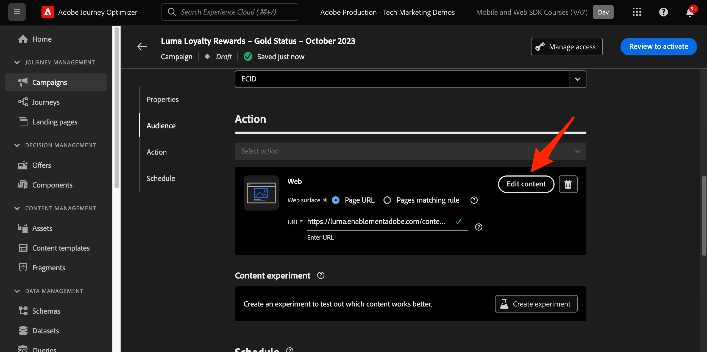

# Journey Optimizer-webkanaal instellen met Web SDK

Leer hoe u de Adobe Journey Optimizer implementeert [webkanaal](https://experienceleague.adobe.com/en/docs/journey-optimizer/using/web/get-started-web) Adobe Experience Platform Web SDK gebruiken. Deze les behandelt de fundamentele vereisten van het Webkanaal, gedetailleerde stappen voor configuratie, en een diepe duik in een gebruiksgeval dat op loyaliteitsstatus wordt gecentreerd.

In deze les zijn Journey Optimizer-gebruikers uitgerust om het webkanaal te gebruiken voor geavanceerde onlinepersonalisatie met de Journey Optimizer-webontwerper.

## Leerdoelen

Aan het einde van deze les kunt u het volgende doen:

* Begrijp de functie en de betekenis van Web SDK in het leveren van de ervaring van het Webkanaal.
* Begrijp het proces van het creëren van een campagne van het Webkanaal van begin tot eind gebruikend het voorbeeld Luma Loyalty Rewards gebruiksgeval.
* Vorm campagneeigenschappen, acties, en programma&#39;s binnen de interface.
* Begrijp de functionaliteit en de voordelen van de extensie Adobe Experience Cloud Visual Editing Helper.
* Leer met de webontwerper de inhoud van webpagina&#39;s te bewerken, inclusief afbeeldingen, kopteksten en andere elementen.
* Leer hoe u voorstellen op een webpagina invoegt met de beslissingscomponent Voorstel.
* U vertrouwd maken met de beste praktijken om de kwaliteit en het succes van een webkanaalcampagne te garanderen.

## Vereisten

Om de lessen in deze sectie te voltooien, moet u eerst:

* Voltooi alle lessen voor aanvankelijke configuratie van het Web SDK van het Platform, met inbegrip van opstellings gegevenselementen en regels.
* Zorg ervoor dat de extensie van de Adobe Experience Platform Web SDK 2.16 of hoger is.
* Als u de Journey Optimizer-webontwerper gebruikt om uw webkanaalervaring te ontwerpen, moet u controleren of u de Google Chrome- of Microsoft® Edge-browsers gebruikt.
* Zorg er ook voor dat u de [Adobe Experience Cloud Visual Editing Helper browser extension](https://chromewebstore.google.com/detail/adobe-experience-cloud-vi/kgmjjkfjacffaebgpkpcllakjifppnca).
* Zorg ervoor dat cookies van derden zijn toegestaan in uw browser. Het kan nodig zijn om ook eventuele advertentieblokkers in uw browser uit te schakelen.

  >[!CAUTION]
  >
  > In de Journey Optimizer-webontwerper kunnen bepaalde websites om een van de volgende redenen niet betrouwbaar worden geopend:
  > 
  > 1. De website heeft een streng beveiligingsbeleid.
  > 1. De website is ingesloten in een iframe.
  > 1. De QA- of werkgebiedsite van de klant is niet extern toegankelijk (het is een interne site).

* Wanneer u webervaringen maakt en inhoud uit de Adobe Experience Manager Assets Essentials-bibliotheek opneemt, is het nodig om [het subdomein configureren voor het publiceren van deze inhoud](https://experienceleague.adobe.com/en/docs/journey-optimizer/using/web/configure-web-channel/web-delegated-subdomains).
* Als het gebruiken van de eigenschap van de inhoudstest, zorg ervoor dat uw Webdataset ook inbegrepen in uw rapporteringsconfiguratie is.
* Momenteel worden twee typen implementaties ondersteund voor het maken en leveren van webkanaalcampagnes op uw wegeigenschappen:
   * Alleen client: als u uw website wilt wijzigen, moet u de SDK van Adobe Experience Platform Web implementeren.
   * Hybride modus: u kunt de API van de Platform Edge Network Server gebruiken om personalisatie op de server aan te vragen. De reactie van de API wordt dan verstrekt aan het Web SDK van Adobe Experience Platform voor het teruggeven van wijzigingen op de cliënt-kant. Raadpleeg de documentatie bij de Adobe Experience Platform Edge Network Server API voor meer informatie. In dit blogbericht vindt u meer details en implementatiemonsters voor de hybride modus.

  >[!NOTE]
  >
  >Implementatie alleen op de server wordt momenteel niet ondersteund.

## Terminologie

Ten eerste moet u de terminologie begrijpen die in webkanaalcampagnes wordt gebruikt.

* **Webkanaal**: Een medium voor communicatie of voor de levering van inhoud via het web. In de context van deze handleiding verwijst het naar het mechanisme waarmee gepersonaliseerde inhoud wordt geleverd aan websitebezoekers die de Platform Web SDK, binnen Adobe Journey Optimizer gebruiken.
* **Weboppervlak**: Verwijst naar een webeigenschap die wordt geïdentificeerd door een URL waar inhoud wordt geleverd. Het kan één of meerdere Web-pagina&#39;s omvatten.
* **Journey Optimizer-webontwerper**: Een specifiek hulpmiddel of een specifieke interface binnen de Journey Optimizer waar de gebruikers hun Web-kanaalervaringen kunnen ontwerpen.
* **Helper voor Adobe Experience Cloud Visual Editing**: Een browserextensie die helpt bij het visueel bewerken en ontwerpen van webkanaalervaringen.
* **DataStream**: Een configuratie binnen de Adobe Experience Platform-service die ervoor zorgt dat webkanaalervaringen kunnen worden geleverd.
* **Samenvoegbeleid**: Een configuratie die de nauwkeurige activering en publicatie van binnenkomende campagnes verzekert.
* **Publiek**: Een specifiek segment gebruikers of bezoekers van de site die aan bepaalde criteria voldoen.
* **Webontwerper**: Een interface of gereedschap dat u helpt bij het visueel bewerken en ontwerpen van een webbeleving zonder diep in de code te duiken.
* **Expression-editor**: Een hulpprogramma in de webontwerper waarmee gebruikers personalisatie kunnen toevoegen aan webinhoud, mogelijk op basis van gegevenskenmerken of andere criteria.
* **Aanbiedingsbeslissingscomponent**: Een component in de webontwerper die helpt te bepalen welk aanbod het meest geschikt is om aan een specifieke bezoeker te worden weergegeven op basis van beslissingsbeheer.
* **Inhoudsexperiment**: Een methode om verschillende inhoudvariaties te testen om te achterhalen welke het beste in termen van gewenste metrisch, zoals binnenkomende kliks presteert.
* **Behandeling**: In het kader van inhoudexperimenten verwijst een behandeling naar een specifieke variatie van inhoud die op een andere wordt getest.
* **Simulatie**: Een voorvertoningsmechanisme waarmee u de webkanaalervaring kunt visualiseren voordat u deze activeert voor een actief publiek.

## De gegevensstroom configureren

U hebt de Adobe Experience Platform-service al toegevoegd aan uw gegevensstroom. Nu moet u de optie Adobe Journey Optimizer inschakelen zodat u webkanaalervaringen kunt aanbieden.

Adobe Journey Optimizer configureren in de gegevensstroom:

1. Ga naar de [Gegevensverzameling](https://experience.adobe.com/#/data-collection){target="blank"} interface.
1. Selecteer in de linkernavigatie de optie **[!UICONTROL Datastreams]**.
1. Selecteer de eerder gemaakte Luma Web SDK-gegevensstroom.

   

1. Selecteren **[!UICONTROL Edit]** binnen de Adobe Experience Platform-service.

   

1. Controleer de **[!UICONTROL Adobe Journey Optimizer]** doos.

   

1. Selecteer **[!UICONTROL Save]**.

Dit zorgt ervoor dat binnenkomende gebeurtenissen voor Journey Optimizer correct door de Edge Network van Adobe Experience Platform worden behandeld.

## Het samenvoegbeleid configureren

Zorg ervoor dat er een samenvoegbeleid is gedefinieerd met de **[!UICONTROL Active-On-Edge Merge Policy]** optie ingeschakeld. Deze optie van het fusiebeleid wordt gebruikt door de inkomende kanalen van Journey Optimizer om de nauwkeurige activering en de publicatie van binnenkomende campagnes op de rand te verzekeren.

De optie configureren in het samenvoegbeleid:

1. Ga naar de **[!UICONTROL Customer]** > **[!UICONTROL Profiles]** in het Experience Platform of de interface van Journey Optimizer.
1. Selecteer het tabblad **[!UICONTROL Merge Policies]**. 
1. Selecteer uw beleid (u kunt het beste de [!UICONTROL Default Timebased] beleid), en knevel **[!UICONTROL Active-On-Edge Merge Policy]** in de **[!UICONTROL Configure]** stap.

   

## De webdataset configureren voor het experimenteren met inhoud

Als u inhoudstests wilt gebruiken in webkanaalcampagnes, moet u ervoor zorgen dat de gebruikte webdataset ook wordt opgenomen in uw rapportconfiguratie. Het Journey Optimizer-rapportagesysteem gebruikt de dataset op een alleen-lezen manier om rapporten voor het experimenteren met inhoud buiten de box te vullen.

[Het toevoegen van gegevenssets voor de rapportage van het inhoudexperiment wordt in deze sectie beschreven](https://experienceleague.adobe.com/en/docs/journey-optimizer/using/campaigns/content-experiment/reporting-configuration#add-datasets).

## Hoofdletters gebruiken - Loyalty&#39;s

In deze les, wordt een geval van het de gebruiks van de beloningen van de steekproefLoyalty gebruikt om implementatie van een ervaring van het Webkanaal in detail te beschrijven gebruikend SDK van het Web.

Met dit gebruiksgeval kunt u beter begrijpen hoe Journey Optimizer uw klanten de beste binnenkomende ervaringen kan bieden, door gebruik te maken van Journey Optimizer-campagnes en de webontwerper.

Aangezien deze zelfstudie gericht is op implementatoren, is het vermeldenswaard dat deze les substantieel interfacewerk in Journey Optimizer impliceert. Terwijl dergelijke interfacetaken typisch door marketers worden behandeld, kan het voor uitvoerders nuttig zijn om inzicht in het proces te krijgen, zelfs als zij typisch niet verantwoordelijk voor de verwezenlijking van de campagne van het Webkanaal zijn.

### Een kwaliteitsschema maken en voorbeeldgegevens invoeren

Wanneer de gegevens van SDK van het Web in Adobe Experience Platform worden opgenomen, kan het door andere gegevensbronnen worden verrijkt u in Platform hebt ingebed. Bijvoorbeeld, wanneer een gebruiker zich bij de plaats van de Luma aanmeldt, wordt een identiteitsgrafiek gebouwd in Experience Platform en alle andere profiel-toegelaten datasets kunnen potentieel samen worden samengevoegd om de Profielen van de Klant in real time te bouwen. Om dit in actie te zien, creeer snel een andere dataset in Adobe Experience Platform met wat gegevens van de steekproefloyaliteit zodat u de Profielen van de Klant in real time in de Webcampagnes van Journey Optimizer kunt gebruiken. Aangezien u al soortgelijke oefeningen hebt uitgevoerd, zullen de instructies kort zijn.

Maak het loyaliteitsschema:

1. Een nieuw schema maken
1. Kies **[!UICONTROL Individual Profile]** als de [!UICONTROL base class]
1. Geef het schema een naam `Luma Loyalty Schema`
1. Voeg de [!UICONTROL Loyalty Details] veldgroep
1. Voeg de [!UICONTROL Demographic Details] veldgroep
1. Selecteer de `Person ID` veld en markeren als een [!UICONTROL Identity] en [!UICONTROL Primary identity] met de `Luma CRM Id` [!UICONTROL Identity namespace].
1. Het schema inschakelen voor [!UICONTROL Profile]

   

Om de dataset tot stand te brengen en de steekproefgegevens in te gaan:

1. Maak een nieuwe dataset van de `Luma Loyalty Schema`
1. De gegevensset een naam geven `Luma Loyalty Dataset`
1. De gegevensset inschakelen voor [!UICONTROL Profile]
1. Het voorbeeldbestand downloaden [luma-loyalty-forWeb.json](assets/luma-loyalty-forWeb.json)
1. Sleep het bestand naar uw gegevensset en zet het neer
1. Bevestig dat de gegevens correct zijn ingevoerd

   

### Een publiek maken

Groepprofielen van soorten publiek worden gecombineerd rond algemene kenmerken. Bouw een snel publiek u in uw Webcampagne kunt gebruiken:

1. Ga in de interface Experience Platform naar **[!UICONTROL Audiences]** in de linkernavigatie
1. Selecteren **[!UICONTROL Create audience]**
1. Selecteren **[!UICONTROL Build rule]**
1. Selecteren **[!UICONTROL Create]**

   

1. Selecteren **[!UICONTROL Attributes]**
1. Zoek de **[!UICONTROL Loyalty]** > **[!UICONTROL Tier]** en sleep het naar het **[!UICONTROL Attributes]** sectie
1. Het publiek definiëren als gebruikers van wie `tier` is `gold`
1. Naam van het publiek `Luma Loyalty Rewards – Gold Status`
1. Selecteren **[!UICONTROL Edge]** als de **[!UICONTROL Evaluation method]**
1. Selecteren **[!UICONTROL Save]**

   

Aangezien dit een zeer eenvoudig publiek is, kunnen wij de de evaluatiemethode van de Rand gebruiken. Het publiek van de rand evalueert op de rand, zodat in het zelfde verzoek dat door SDK van het Web aan de Edge Network van het Platform wordt gemaakt, kunnen wij de publieksdefinitie evalueren en onmiddellijk bevestigen als de gebruiker zal kwalificeren.

### Loyalty Rewards-campagne maken

Nu u onze gegevens van de steekproefloyaliteit hebt gegeten en ons segment creeerde, creeer de het Webkanaalcampagne van Loyalty Rewards in Adobe Journey Optimizer.

De voorbeeldcampagne maken:

1. Open de [Journey Optimizer](https://experience.adobe.com/journey-optimizer/home){target="_blank"} interface

   >[!NOTE]
   >
   > Het schema, de datasets, en het publiek kunnen ook in de interface van Journey Optimizer worden gebouwd aangezien zij allen gemeenschappelijke Experience Platform bouwt.

1. Navigeren naar **[!UICONTROL Journey Management]** > **[!UICONTROL Campaigns]** in de linkernavigatie
1. Klikken **[!UICONTROL Create campaign]** rechtsboven.
1. In de **[!UICONTROL Properties]** , geeft u op hoe u de campagne wilt uitvoeren. Kies voor de Gebruikszaak Loyalty Rewards **Gepland**.

   

1. In de **[!UICONTROL Actions]** in, kiest u **[!UICONTROL Web channel]**. Als de  **[!UICONTROL Web surface]**, selecteert u **[!UICONTROL Page URL]**.

   >[!NOTE]
   >
   >Een weboppervlak verwijst naar een webeigenschap die wordt geïdentificeerd door een URL waar inhoud wordt geleverd. De URL kan overeenkomen met één pagina of meerdere pagina&#39;s, zodat u wijzigingen kunt toepassen op een of meerdere webpagina&#39;s.

1. Kies de optie **[!UICONTROL Page URL]** Optie voor het web om de ervaring voor deze campagne op één pagina te implementeren. Voer de URL voor de pagina Luma in. `https://luma.enablementadobe.com/content/luma/us/en.html`

1. Als het weboppervlak is gedefinieerd, selecteert u **[!UICONTROL Create]**.

   

1. Voeg nu enkele aanvullende details toe aan de nieuwe webkanaalcampagne. Geef eerst de naam van de campagne. Bel het `Luma Loyalty Rewards – Gold Status`. U kunt desgewenst een beschrijving aan de campagne toevoegen. Ook toevoegen **[!UICONTROL Tags]** verbetering van de algemene campagnetaxonomie.

   

1. Standaard is de campagne actief voor alle sitebezoekers. Voor de toepassing van dit gebruiksgeval mogen alleen leden met een goudstatus de ervaring zien. Klik op **[!UICONTROL Select audience]** en kiest u `Luma Loyalty Rewards – Gold Status` publiek.

1. In de **[!UICONTROL Identity namespace]** veld, selecteert u de naamruimte voor het identificeren van personen binnen het gekozen segment. Aangezien u de campagne op de plaats van de Luma opstelt, kunt u ECID namespace kiezen. Profielen in het dialoogvenster `Luma Loyalty Rewards – Gold Status` publiek dat niet beschikt over de ECID-naamruimte tussen de verschillende identiteiten, wordt niet aangeraden door de campagne voor webkanalen.

   

1. Plan de campagne om op de datum van vandaag te beginnen gebruikend **[!UICONTROL Campaign start]** en eindigt in een week met de **[!UICONTROL Campaign end]** -optie.

   

>[!NOTE]
>
>Houd er rekening mee dat voor webkanaalcampagnes de webervaring wordt weergegeven wanneer de bezoeker de pagina opent. In tegenstelling tot andere soorten campagnes in Adobe Journey Optimizer **[!UICONTROL Action triggers]** kan niet worden geconfigureerd.

### Experimenteer met Loyalty Rewards-inhoud

Als u omhoog scrolt, in **[!UICONTROL Action]** kunt u desgewenst een experiment maken om te testen welke inhoud het beste werkt voor de `Luma Loyalty Rewards – Gold Status` publiek. Laten we twee behandelingen maken en testen als onderdeel van de configuratie van de campagne.

U kunt als volgt het inhoudexperiment maken:

1. Klik op **[!UICONTROL Create experiment]**.

   

1. Kies eerst een **[!UICONTROL Success metric]**. Dit is de maatstaf voor het bepalen van de doeltreffendheid van inhoud. Kies **[!UICONTROL Unique Inbound Clicks]**, om te zien welke inhoudsbehandeling meer kliks op het Web Ervaring CTA produceert.

   

1. Als u een experiment instelt met gebruik van een webkanaal en de optie **[!UICONTROL Inbound Clicks]**, **[!UICONTROL Unique Inbound Clicks]**, **[!UICONTROL Page Views]**, of **[!UICONTROL Unique Page Views]** de **[!UICONTROL Click Action]** kunt u klikken en weergaven op specifieke pagina&#39;s nauwkeurig bijhouden en controleren.

1. U kunt desgewenst een **[!UICONTROL Holdout]** die geen van beide behandelingen krijgt. Laat dit nu ongecontroleerd.

1. Kies desgewenst ook **[!UICONTROL Distribute evenly]**. Schakel deze optie in om ervoor te zorgen dat de splitsingen van de behandeling altijd gelijkmatig zijn verdeeld.

[Meer informatie over contentexperimenten in Adobe Journey Optimizer-webkanalen](https://experienceleague.adobe.com/en/docs/journey-optimizer/using/campaigns/content-experiment/get-started-experiment).

### Inhoud bewerken met de visuele hulp

Nu, auteur de ervaring van het Webkanaal. Gebruik hiervoor de Adobe Experience Cloud **[!UICONTROL Visual Helper]**. Dit gereedschap is een browserextensie die compatibel is met Google Chrome en Microsoft® Edge. Zorg ervoor dat u de extensie hebt gedownload voordat u uw ervaringen ontwikkelt. Zorg er ook voor dat de webpagina de Web SDK bevat.

1. Binnen de **[!UICONTROL Action]** tabblad van de campagne, klikt u op **[!UICONTROL Edit content]**. Aangezien u één pagina-URL hebt ingevoerd als het oppervlak, kunt u beter beginnen te werken in de composer.

   

1. Klik nu op **[!UICONTROL Edit web page]** om te beginnen met ontwerpen.

   

1. Begin door sommige elementen te bewerken met de webcomposer. Gebruik het contextmenu om de koptekst van de hoofdafbeelding van de Luma te bewerken. Pas de stijl van het contextafhankelijke venster aan de rechterkant aan.

   

1. Voeg ook verpersoonlijking aan de container toe gebruikend **[!UICONTROL Expression editor]**.

   

1. Zorg ervoor dat de ervaring correct voor kliks wordt gevolgd. Kies **[!UICONTROL Click track element]** in het contextmenu.

   

1. Gebruik de **[!UICONTROL Offer decision component]** om voorstellen in te voegen in de webpagina. Deze component gebruikt **[!UICONTROL Decision Management]** om de beste aanbieding te kiezen voor Luma-bezoekers.

### HTML-ontwerpwijzigingen

Er zijn een paar beschikbare methodes als u geavanceerdere, of douaneveranderingen in de plaats als component van de campagne van de Beloning van de Loyaliteit wilt aanbrengen.

Gebruik de **[!UICONTROL Components]** om HTML of andere inhoud rechtstreeks toe te voegen aan de Luma-site.

Voeg een nieuwe HTML-component toe boven aan de pagina. Bewerk de HTML binnen de component vanuit de ontwerpinterface of **[!UICONTROL Contextual]** venster.

U kunt ook HTML-bewerkingen toevoegen vanuit de **[!UICONTROL Modifications]** venster. In dit deelvenster kunt u een component op de pagina selecteren en deze bewerken vanuit de ontwerpinterface.

Voeg in de editor de HTML voor de `Luma Loyalty Rewards – Gold Status` publiek. Selecteer **[!UICONTROL Validate]**.

Bekijk nu de nieuwe aangepaste HTML-component om deze passend te maken.

Een specifieke component bewerken met de opdracht **[!UICONTROL CSS selector type]** wijziging.

Aangepaste code toevoegen met de opdracht **Pagina `<head>` type** wijziging.

De mogelijkheden om de **[!UICONTROL Visual Helper]**.

### Loyalty Rewards-inhoud simuleren

Bekijk een voorvertoning van de gewijzigde webpagina voordat u de campagne activeert. Vergeet niet dat testprofielen moeten zijn geconfigureerd om webkanaalervaringen te simuleren.

U kunt als volgt de ervaring simuleren:

1. Selecteren **[!UICONTROL Simulate content]** in de campagne.

   

1. Kies een testprofiel om de simulatie te ontvangen. Houd er rekening mee dat het testprofiel in de `Luma Loyalty Rewards – Gold Status` publiek om de juiste behandeling te krijgen.

1. De voorvertoning wordt weergegeven voor het testprofiel.

### De Loyalty Rewards-campagne activeren

Ten slotte activeert u de campagne voor het webkanaal.

1. Selecteren **Controleren om te activeren**.

1. U wordt gevraagd de details van de campagne een laatste keer te bevestigen. Selecteer **[!UICONTROL Activate]**. Het kan tot 15 minuten duren voordat de campagne live gaat op de site.

### Loyalty Rewards QA

U kunt een aantal aanmeldingen gebruiken om gebruikers met de status &quot;goud&quot; te simuleren en in aanmerking te komen voor uw campagne:

1. `cleavlandeuler@emailsim.io`/`test`
1. `leftybeagen@emailsim.io`/`test`
1. `jenimartinho@emailsim.io`/`test`

Als beste praktijken, controleer **[!UICONTROL Web]** tabblad van de live campagne en algemene rapporten voor de campagnespecifieke KPI&#39;s. Voor deze campagne bekijkt u de indruk dat u afbeeldingen ervaart en klikt u op Snelheid.

### Webkanaalvalidatie met Adobe Experience Platform Debugger

Met de extensie Adobe Experience Platform Debugger, die beschikbaar is voor Chrome en Firefox, worden uw webpagina&#39;s geanalyseerd om problemen vast te stellen bij de implementatie van Adobe Experience Cloud-oplossingen.

Met het foutopsporingsprogramma op de Luminasite kunt u de ervaring met het webkanaal tijdens de productie valideren. Dit is beste praktijken zodra de het gebruiksgeval van de Beloningen van de Loyalty in werking is, om ervoor te zorgen dat alles correct wordt gevormd.

[Leer hoe te om debugger in uw browser te vormen gebruikend de gids hier](https://experienceleague.adobe.com/en/docs/platform-learn/data-collection/debugger/overview).

De validatie starten met de foutopsporing:

1. Navigeer met de webkanaalervaring naar de Luma-webpagina.
   <!--
    
    -->
1. Open tijdens de webpagina de **[!UICONTROL Adobe Experience Platform Debugger]**.
   <!--
    
    -->
1. Navigeren naar **Samenvatting**. Controleer of de **[!UICONTROL Datastream ID]** komt overeen met de **[!UICONTROL datastream]** in **[!UICONTROL Adobe Data Collection]** waarvoor je Adobe Journey Optimizer hebt ingeschakeld.
   <!--
    
    -->
1. U kunt zich dan bij de plaats met diverse Luma loyaliteitsrekeningen aanmelden, en debugger gebruiken om de verzoeken te bevestigen die naar de Edge Network van Adobe Experience Platform worden verzonden.
   <!--
    
    -->
1. Onder **[!UICONTROL Solutions]** navigeer naar de **[!UICONTROL Experience Platform Web SDK]**.
   <!--
    
    -->
1. Binnen de **Configuratie** tab, in-/uitschakelen **[!UICONTROL Enable Debugging]**. Hiermee kunt u zich aanmelden voor de sessie in een **[!UICONTROL Adobe Experience Platform Assurance]** sessie.
   <!--
    
    -->
1. Meld u met verschillende Luma-loyaliteitsaccounts aan bij de site en gebruik foutopsporing om de aanvragen te valideren die naar de site worden verzonden **[!UICONTROL Adobe Experience Platform Edge network]**. Al deze verzoeken moeten worden vastgelegd in **[!UICONTROL Assurance]** voor het bijhouden van logbestanden.
<!--
   
-->

[Volgende: ](setup-decision-management.md)

>[!NOTE]
>
>Bedankt dat u tijd hebt geïnvesteerd in het leren over de SDK van Adobe Experience Platform Web. Als u vragen hebt, algemene feedback wilt delen of suggesties voor toekomstige inhoud hebt, kunt u deze delen over deze [Experience League Communautaire discussiestuk](https://experienceleaguecommunities.adobe.com/t5/adobe-experience-platform-data/tutorial-discussion-implement-adobe-experience-cloud-with-web/td-p/444996)
