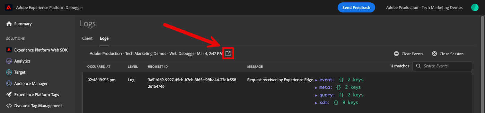

# Web SDK-implementaties valideren met Experience Platform Assurance

[ Adobe Experience Platform Assurance ](https://experienceleague.adobe.com/en/docs/experience-platform/assurance/home) is een eigenschap om u te helpen inspecteren, beproeven, simuleren, en bevestigen hoe u gegevens verzamelt of ervaringen dient.

Zoals u in [ leerde vormen een datastream ](configure-datastream.md) les, verzendt het Web SDK van het Platform eerst gegevens van uw digitaal bezit naar Platform Edge Network. Vervolgens maakt Platform Edge Network de gegevens door naar de services die in uw gegevensstroom zijn ingeschakeld. Met Assurance kunt u de aanvragen die in en uit Platform Edge Network komen, valideren.

## Leerdoelstellingen

Aan het eind van deze les, zult u kunnen:

* Een Assurance-sessie starten
* Verzoeken weergeven die zijn verzonden naar en van Platform Edge Network

## Vereisten

U bent vertrouwd met de markeringen van de Inzameling van Gegevens en de [ demowebsite van de Luma ](https://luma.enablementadobe.com){target="_blank"} en hebt de vorige lessen in het leerprogramma voltooid:

* [Een XDM-schema configureren](configure-schemas.md)
* [Naamruimte configureren](configure-identities.md)
* [Een gegevensstroom configureren](configure-datastream.md)
* [Web SDK-extensie geïnstalleerd in de eigenschap tag](install-web-sdk.md)
* [Gegevenselementen maken](create-data-elements.md)
* [Identiteiten vastleggen](create-identities.md)
* [Een labelregel maken](create-tag-rule.md)
* [Valideren met foutopsporing](validate-with-debugger.md)

## Een Assurance-sessie starten en weergeven

Er zijn verschillende manieren om een Assurance-sessie te starten.

### Edge Trace inschakelen in Foutopsporing

Edge-trace inschakelen:

1. Ga naar de [ de demowebsite van de Luma ](https://luma.enablementadobe.com) en gebruik debugger [ schakelaar het markeringsbezit op de plaats aan uw eigen ontwikkelingeigenschap ](validate-with-debugger.md#use-the-experience-platform-debugger-to-map-to-your-tags-property)
1. Zorg ervoor dat u bent aangemeld bij Foutopsporing en dat de naam van uw organisatie wordt weergegeven. Als uw gebruikersnaam wordt weergegeven, meldt u zich af en probeert u zich weer aan te melden.
1. In de linkernavigatie van **[!UICONTROL Experience Platform Debugger]** select **[!UICONTROL Logs]**
1. Selecteer de tab **[!UICONTROL Edge]** en selecteer **[!UICONTROL Connect]**

   

1. Het is nu leeg

   

1. Vernieuw de [ homepage van de Luma ](https://luma.enablementadobe.com/) en controleer **[!UICONTROL Experience Platform Debugger]** opnieuw, om gegevens te zien komen in Platform Edge Network. In toekomstige lessen, zult u uitgaande verzoeken kunnen zien aangezien u de diensten in uw datastream toelaat.

   

   Elke keer dat u Edge Trace inschakelt in Adobe Experience Platform Debugger, wordt een Assurance-sessie gestart op de achtergrond. Hoewel u de informatie hier kunt bekijken, is de Assurance-interface waarschijnlijk veel nuttiger.

1. Als Edge Trace is ingeschakeld, ziet u bovenaan een uitgaande koppelingspictogram. Selecteer het pictogram om Assurance te openen.

   

1. Er wordt een nieuw browsertabblad geopend met de Assurance-interface.

### Een Assurance-sessie starten vanuit de Assurance-interface

1. Open de [ interface van de Inzameling van Gegevens ](https://experience.adobe.com/#/data-collection/home){target="_blank"}
1. Selecteer Assurance in de linkernavigatie
1. Sessie maken selecteren
   
1. De optie **[!UICONTROL Deep link connect]** gebruiken
1. Selecteren **[!UICONTROL Start]**
1. Geef de sessie een naam, bijvoorbeeld `Luma Web SDK validation`
1. Als **[!UICONTROL Base URL]** enter `https://luma.enablementadobe.com/`
   
1. Selecteer **[!UICONTROL Copy Link]** in het volgende scherm
1. Selecteer het pictogram om de koppeling naar het klembord te kopiëren
1. Plak de URL in uw browser, die de Luma-website opent met een speciale URL-parameter `adb_validation_sessionid` en de sessie start
1. In de Assurance-interface ziet u een bericht dat u verbinding hebt gemaakt met de sessie. Gebeurtenissen worden dan weergegeven in de Assurance-interface.
   

## De huidige status van uw Web SDK-implementatie valideren

Er is beperkte informatie om in dit stadium van uw implementatie te bekijken aangezien wij nog geen diensten in de datastream hebben toegelaten.

### Binnenkomende aanvragen van Web SDK weergeven met `Alloy Request`

We kunnen de binnenkomende hit van Web SDK bekijken zoals deze door de edge wordt ontvangen:

1. De rij `Alloy Request` selecteren
1. Zoek in de Raw-gebeurtenis (of vouw knooppunten uit in de map [!UICONTROL Payload] > `ACPExtensionEventData` ) totdat u het XDM-object met vertrouwde variabelen vindt:

   

### Het antwoord weergeven in `Alloy Response Handle`

Zoals u weet, is de Experience Cloud-id (ECID) zichtbaar in de Web SDK-respons nadat deze is gegenereerd op Platform Edge Network. Laten we ernaar zoeken in de reactie zoals die in Assurance wordt bekeken:

1. Filter de rij en selecteer deze met de gebeurtenis `Alloy Response Handle` .
1. Rechts wordt een menu weergegeven. Selecteer het `+` -teken naast `[!UICONTROL ACPExtensionEventData]`
1. Selecteer `[!UICONTROL payload > 0 > payload > 0 > namespace]` om omlaag te gaan. De id die onder de laatste `0` wordt weergegeven, komt overeen met de `ECID` . U weet dat aan de hand van de waarde die wordt weergegeven onder `namespace` Overeenkomende `ECID`

   

   >[!CAUTION]
   >
   >Mogelijk wordt een ingekorte ECID-waarde weergegeven vanwege de breedte van het venster. Selecteer gewoon de greep in de interface en sleep naar links om de volledige ECID weer te geven.

In toekomstige lessen gebruikt u Assurance om volledig verwerkte ladingen te valideren die een Adobe-toepassing bereiken die in uw datastream is ingeschakeld.

Met een XDM-object dat nu op een pagina wordt geactiveerd, en met de kennis van hoe u uw gegevensverzameling kunt valideren, bent u klaar om Experience Platform en de afzonderlijke Adobe-toepassingen in te stellen met behulp van Platform Web SDK.

>[!NOTE]
>
>Bedankt dat je tijd hebt geïnvesteerd in het leren over Adobe Experience Platform Web SDK. Als u vragen hebt, algemene terugkoppelen wilt delen, of suggesties over toekomstige inhoud hebben, gelieve hen op deze [ Communautaire besprekingspost van Experience League te delen ](https://experienceleaguecommunities.adobe.com/adobe-experience-platform-18/tutorial-discussion-implement-adobe-experience-cloud-with-web-sdk-tutorial-248848)
