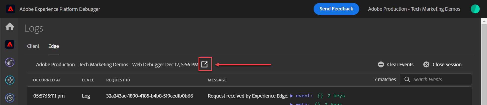

# Web SDK-implementaties valideren met Experience Platform Assurance

Adobe Experience Platform Assurance is een functie waarmee u kunt controleren, testen, simuleren en valideren hoe u gegevens verzamelt of ervaringen opdoet. Lees meer over [ Adobe Assurance ](https://experienceleague.adobe.com/en/docs/experience-platform/assurance/home).

## Leerdoelstellingen

Aan het eind van deze les, zult u kunnen:

* Een Assurance-sessie starten
* Verzoeken weergeven die zijn verzonden naar en van Platform Edge Network

## Vereisten

U bent vertrouwd met de markeringen van de Inzameling van Gegevens en de [ de demomoeplaats van de Luma ](https://luma.enablementadobe.com/content/luma/us/en.html){target="_blank"} en hebt de vorige lessen in het leerprogramma voltooid:

* [Een XDM-schema configureren](configure-schemas.md)
* [Naamruimte configureren](configure-identities.md)
* [Een gegevensstroom configureren](configure-datastream.md)
* [Web SDK-extensie geïnstalleerd in de eigenschap tag](install-web-sdk.md)
* [Gegevenselementen maken](create-data-elements.md)
* [Identiteiten maken](create-identities.md)
* [Een labelregel maken](create-tag-rule.md)
* [Valideren met foutopsporing](validate-with-debugger.md)

## Een Assurance-sessie starten en weergeven

Er zijn verschillende manieren om een Assurance-sessie te starten.

### Een Assurance-sessie starten in Foutopsporing

Elke keer dat u Edge Trace inschakelt in Adobe Experience Platform Debugger, wordt een Assurance-sessie gestart op de achtergrond.

In de les Foutopsporing bekijken hoe we dit deden:

1. Ga naar de [ plaats van de de demo van de Luma ](https://luma.enablementadobe.com/content/luma/us/en.html) en gebruik debugger om [ het markeringsbezit op de plaats aan uw eigen ontwikkelingeigenschap ](validate-with-debugger.md#use-the-experience-platform-debugger-to-map-to-your-tags-property) te schakelen
1. In de linkernavigatie van **[!UICONTROL Experience Platform Debugger]** select **[!UICONTROL Logs]**
1. Selecteer de tab **[!UICONTROL Edge]** en selecteer **[!UICONTROL Connect]**

   
1. Als Edge Trace is ingeschakeld, ziet u bovenaan een uitgaande koppelingspictogram. Selecteer het pictogram om Assurance te openen.

   

1. Er wordt een nieuw browsertabblad geopend met de Assurance-interface.

### Een Assurance-sessie starten vanuit de Assurance-interface

1. Open de [ interface van de Inzameling van Gegevens ](https://experience.adobe.com/#/data-collection/home){target="_blank"}
1. Selecteer Assurance in de linkernavigatie
1. Sessie maken selecteren
   
1. Begin selecteren
1. Geef de sessie een naam, bijvoorbeeld `Luma Web SDK validation`
1. Als **[!UICONTROL Base URL]** enter `https://luma.enablementadobe.com/`
   
1. Selecteer **[!UICONTROL Copy Link]** in het volgende scherm
1. Selecteer het pictogram om de koppeling naar het klembord te kopiëren
1. Plak de URL in uw browser, die de Luma-website opent met een speciale URL-parameter `adb_validation_sessionid` en de sessie start
1. In de Assurance-interface ziet u een bericht dat u verbinding hebt gemaakt met de sessie. Gebeurtenissen worden dan weergegeven in de Assurance-interface.
   

## De huidige status van uw Web SDK-implementatie valideren

Er is beperkte informatie om in deze fase van uw implementatie te bekijken. Eén waarde die we kunnen zien, is de Experience Cloud-id (ECID) die is gegenereerd op Platform Edge Network:

1. Selecteer de rij met de gebeurtenis `Alloy Response Handle` .
1. Rechts wordt een menu weergegeven. Selecteer het `+` -teken naast `[!UICONTROL ACPExtensionEventData]`
1. Selecteer `[!UICONTROL payload > 0 > payload > 0 > namespace]` om omlaag te gaan. De id die onder de laatste `0` wordt weergegeven, komt overeen met de `ECID` . U weet dat aan de hand van de waarde die wordt weergegeven onder `namespace` Overeenkomende `ECID`

   

   >[!CAUTION]
   >
   >Mogelijk wordt een ingekorte ECID-waarde weergegeven vanwege de breedte van het venster. Selecteer gewoon de greep in de interface en sleep naar links om de volledige ECID weer te geven.

In toekomstige lessen gebruikt u Assurance om volledig verwerkte ladingen te valideren die een Adobe-toepassing bereiken die in uw datastream is ingeschakeld.

Met een XDM-object dat nu op een pagina wordt geactiveerd, en met de kennis van hoe u uw gegevensverzameling kunt valideren, bent u klaar om Experience Platform en de afzonderlijke Adobe-toepassingen in te stellen met behulp van Platform Web SDK.

>[!NOTE]
>
>Bedankt dat je tijd hebt geïnvesteerd in het leren over Adobe Experience Platform Web SDK. Als u vragen hebt, algemene terugkoppelen wilt delen, of suggesties over toekomstige inhoud hebben, gelieve hen op deze [ Communautaire besprekingspost van Experience League te delen ](https://experienceleaguecommunities.adobe.com/t5/adobe-experience-platform-data/tutorial-discussion-implement-adobe-experience-cloud-with-web/td-p/444996)
