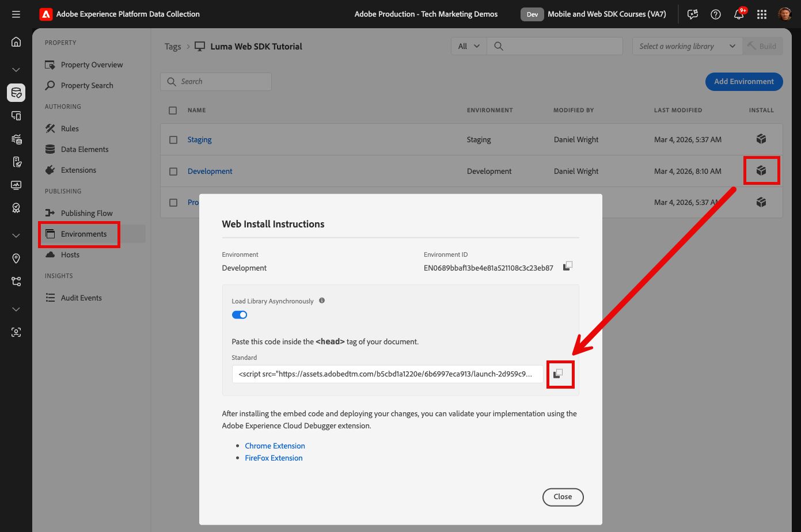
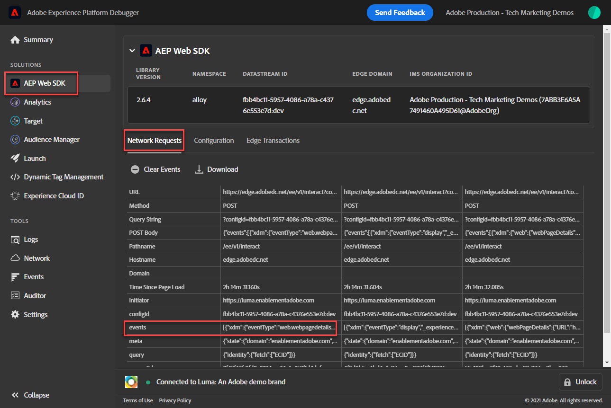
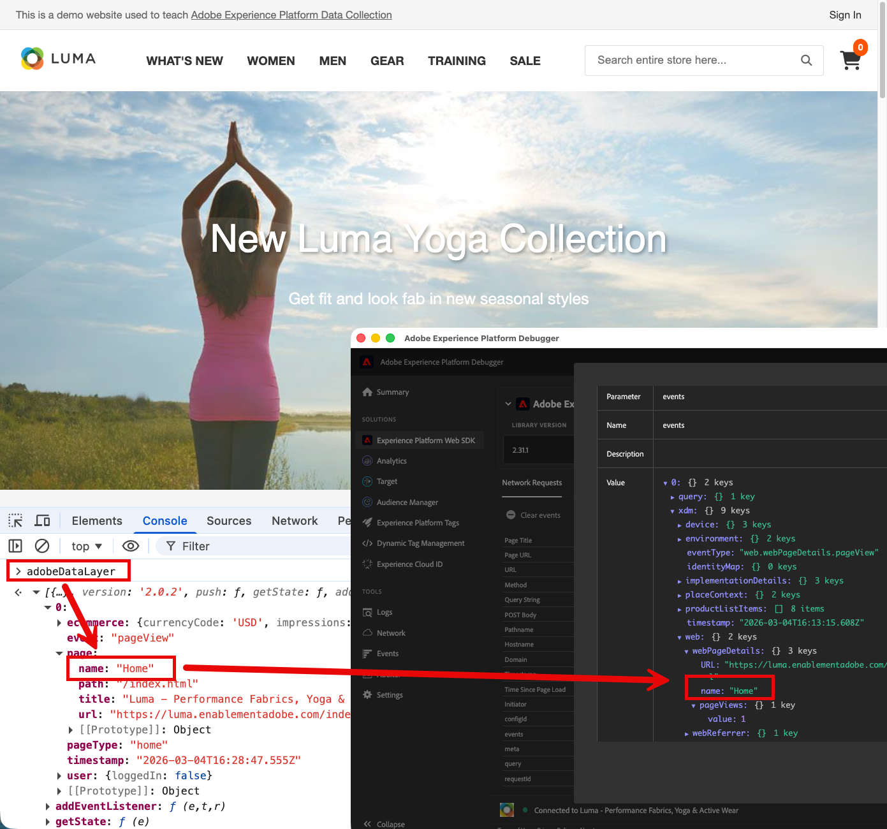

# Web SDK-implementaties valideren met Experience Platform Debugger

Leer hoe u uw Adobe Experience Platform Web SDK-implementatie met Adobe Experience Platform Debugger kunt valideren.

Experience Platform Debugger is de uitbreiding van a [ Chrome ](https://chromewebstore.google.com/detail/adobe-experience-platform/bfnnokhpnncpkdmbokanobigaccjkpob) die u helpt de technologie zien van Adobe die in uw Web-pagina&#39;s wordt uitgevoerd. Experience Platform Debugger en de ontwikkelaarsconsole van uw browser zijn de beste manieren om de browser-zijaspecten van uw implementatie van Web SDK te bevestigen en te zuiveren. Adobe Experience Platform Assurance, dat in de volgende les wordt behandeld, geeft de beste mening van de gegevens aangezien het van en naar het Platform Edge Network reist.

Als u Foutopsporing nog nooit eerder hebt gebruikt, kunt u deze overzichtsvideo van vijf minuten bekijken:

>[!VIDEO](https://video.tv.adobe.com/v/32156?learn=on&enablevpops)

In deze les, gebruikt u de [ uitbreiding van Adobe Experience Platform Debugger ](https://chromewebstore.google.com/detail/adobe-experience-platform/bfnnokhpnncpkdmbokanobigaccjkpob) om het markeringsbezit te vervangen dat op de [ Luma demowebsite ](https://luma.enablementadobe.com) met uw eigen bezit wordt hard gecodeerd.

Deze techniek wordt omgevingsomschakeling genoemd en is later handig wanneer u met tags op uw eigen website werkt. Het staat u toe om uw productiewebsite in uw browser te laden, maar met uw *ontwikkeling* de tagbibliotheek. Hierdoor kunt u op een betrouwbare manier wijzigingen in tags doorvoeren en valideren, onafhankelijk van uw reguliere code-releases. Per slot van rekening is deze scheiding van marketing markeringsversies van uw regelmatige codeversies één van de belangrijkste redenen klanten in de eerste plaats labels gebruiken!

## Leerdoelstellingen

Aan het eind van deze les, zult u debugger kunnen gebruiken om:

* Een alternatieve tagbibliotheek laden
* Valideren van de client-side XDM-gebeurtenis vangt gegevens op en verzendt deze naar het Platform Edge Network
* Edge Trace inschakelen om verzoeken van Platform Edge Network op de server weer te geven

## Vereisten

U bent vertrouwd met de markeringen van de Inzameling van Gegevens en de [ demowebsite van de Luma ](https://luma.enablementadobe.com/){target="_blank"} en hebt de vorige lessen in het leerprogramma voltooid:

* [Een XDM-schema configureren](configure-schemas.md)
* [Naamruimte configureren](configure-identities.md)
* [Een gegevensstroom configureren](configure-datastream.md)
* [Web SDK-extensie geïnstalleerd in de eigenschap tag](install-web-sdk.md)
* [Gegevenselementen maken](create-data-elements.md)
* [Identiteiten vastleggen](create-identities.md)
* [Tagregels maken](create-tag-rule.md)

## Alternatieve tagbibliotheken laden met Foutopsporing

De Experience Platform Debugger beschikt over een coole functie waarmee u een bestaande tagbibliotheek kunt vervangen door een andere. Deze techniek is nuttig voor bevestiging en staat ons toe om vele implementatiestappen in dit leerprogramma over te slaan.

1. Zorg ervoor u de [ de demowebsite van de Luma ](https://luma.enablementadobe.com){target="_blank"} open hebt en selecteert het Debugger van Experience Platform uitbreidingspictogram
1. Foutopsporing opent en toont sommige details van de hard-gecodeerde implementatie (u kunt de plaats van de Luma na het openen van Debugger moeten opnieuw laden)
1. Bevestig dat Debugger &quot;**[!UICONTROL Connected to Luma]**&quot;zoals hieronder afgebeeld is en selecteer dan het &quot;**[!UICONTROL lock]**&quot;pictogram is om Debugger aan de plaats van de Luma te sluiten.
1. Selecteer de knop **[!UICONTROL Sign In]** , meld u aan bij Adobe Experience Cloud met uw Adobe-id en selecteer uw organisatie.

   >[!TIP]
   >
   > Als de debugger uw gebruikersbenaming in plaats van uw naam van de Org na het ondertekenen binnen toont, teken uit en probeer opnieuw.

   

1. Ga nu naar **[!UICONTROL Experience Platform Tags]** in de linkernavigatie
1. Selecteer de tab **[!UICONTROL Configuration]**
1. Open rechts van waar de **[!UICONTROL Page Embed Codes]** wordt weergegeven het vervolgkeuzemenu **[!UICONTROL Actions]** en selecteer **[!UICONTROL Replace]**

   

1. Aangezien u voor authentiek wordt verklaard, zal Foutopsporing uw beschikbare markeringseigenschappen en milieu&#39;s trekken. Selecteer uw eigenschap
1. Selecteer uw `Development` -omgeving
   

   >[!TIP]
   >
   > Als u de eigenschap en de omgeving niet kunt selecteren met de vervolgkeuzelijst, gaat u naar [!UICONTROL Tags] > [!UICONTROL Environments] > [!UICONTROL Development] > [!UICONTROL Install] en selecteert u het pictogram om de ingesloten code te kopiëren en in Foutopsporing te plakken:
   > 

1. Selecteer de knop **[!UICONTROL Apply]**

1. De website van de Luma zal _met uw eigen markeringsbezit_ nu opnieuw laden.

   

Terwijl u de zelfstudie voortzet, gebruikt u deze techniek om de Luministoewijzing toe te wijzen aan uw eigen tageigenschap om de implementatie van Platform Web SDK te valideren. Wanneer u tags op uw eigen website gebruikt, kunt u dezelfde techniek gebruiken om bibliotheken met ontwikkelingslabels op uw productiewebsite te valideren.

## Valideren met foutopsporing

### Valideer netwerkverzoeken en XDM

U kunt Foutopsporing gebruiken om cliënt-zijbakens te bevestigen die van uw implementatie van het Web SDK van het Platform worden teweeggebracht om de gegevens te bekijken die naar Platform Edge Network worden verzonden:

1. Ga naar **[!UICONTROL Summary]** in de linkernavigatie om de details van uw markeringseigenschap te zien

   

1. Ga nu naar **[!UICONTROL Experience Platform Web SDK]** in de linkernavigatie om de **[!UICONTROL Network Requests]** te zien
1. De rij **[!UICONTROL events]** openen

   

1. Let op hoe u het gebeurtenistype `web.webPageDetails.pageView` kunt zien dat u in de [!UICONTROL Update variable] -handeling hebt opgegeven, en andere variabelen die zich buiten het vak bevinden en die aan de `AEP Web SDK ExperienceEvent` -veldgroep voldoen.

   

1. Schuif omlaag naar het `web` -object, selecteer dit om het te openen en inspecteer het `webPageDetails.name` . Deze moeten overeenkomen met de overeenkomstige gegevenslaagvariabelen voor `adobeDataLayer` op de startpagina

>[!TIP]
>
> U kunt als volgt de gegevenslaag `adobeDataLayer` op de startpagina weergeven en vergelijken:
>
> 1. Open de browsergereedschappen voor ontwikkelaars op de startpagina van Luma. In het geval van Chrome selecteert u de knop `F12` op het toetsenbord
> 1. Selecteer de tab **[!UICONTROL Console]**
> 1. Voer `adobeDataLayer` in en selecteer `Enter` op het toetsenbord om de waarden van de gegevenslaag weer te geven

Valideer de gebeurtenissen en variabelen die zijn ingesteld op de productpagina&#39;s, de tekstpagina en de pagina voor bevestiging van de bestelling.

### Identiteitskaart valideren

U kunt ook de identiteitskaartgegevens valideren:

1. Selecteer **[!DNL Sign In]** op de [ website van de Luma ](https://luma.enablementadobe.com/){target=_blank}. Selecteer **[!DNL Create Account]** en maak een account aan de hand van de referenties `test@test.com`/ `test`

1. Gebruik de sneltoets **[!UICONTROL Jump to most recent]** in Foutopsporing om snel naar de meest recente Web SDK-gebeurtenis te gaan (dit is de laatste kolom). Selecteer de rij **[!UICONTROL events]** om de modale details te openen.

1. Onderzoek naar **identityMap** binnen modal. Hier ziet u `lumaCrmId` met drie sleutels van authenticatedState, id, en primaire aanwijzing:
   

## Valideren met ontwikkelaarsgereedschappen voor browsers

Veel webontwikkelaars geven de voorkeur aan de implementatie in de ontwikkelprogramma&#39;s van hun browser. Dit is vooral belangrijk omdat niet alle browsers de Debugger uitbreiding steunen. Vanwege het flexibele framework zijn er aanvullende implementatiedetails die u kunt inspecteren, zoals cookies en reactiegegevens.

### Netwerkverzoeken valideren

De de verzoekdetails van SDK van het Web zijn ook zichtbaar in het Web van de browser ontwikkelaars hulpmiddelen **van het Netwerk** tabel (het veronderstellen van de website laadt uw markeringsbibliotheek).

1. Open het 1} lusje van het Netwerk **van de de Webontwikkelaar van browser hulpmiddelen {en laad de pagina opnieuw.** Filter voor vraag met `/ee` om van de vraag de plaats te bepalen, het te selecteren, en dan in de **Kopballen** tabel te kijken, en **nuttige lading** tabel

   

1. Ga naar het **lusje van de Voorproef** en neem nota hoe de ECID waarde in de netwerkreactie inbegrepen is.

   

   >[!NOTE]
   >
   > De waarde ECID is zichtbaar in de netwerkreactie. Het is niet inbegrepen in het `identityMap` gedeelte van het netwerkverzoek, noch wordt het opgeslagen in dit formaat in een koekje.

### Web SDK cookies

Terwijl wij in de ontwikkelaarshulpmiddelen zijn, nemen een blik bij sommige koekjesWeb SDK reeksen in browser. Open Application > Cookies > https://luma.enablementadobe.com

Verschillende cookies worden ingesteld door Web SDK:

* kndctr_[ IMS_ORGID ]_AdobeOrg_identity: dit slaat gegevens met betrekking tot ECID op
* kndctr_[ IMS_ORGID ]_AdobeOrg_cluster: dit slaat de plaats op van het gegevenscentrum die wordt gebruikt zodat de verdere netwerkvraag wordt verpletterd aan de zelfde servers van Edge
* AMCV_[ IMS_ORGID ]%40AdobeOrg: dit is het erfenisCookie van AMCV die door de bibliotheken van Experience Cloud van de pre-Web wordt gebruikt en het wordt geplaatst omdat wij het gebrek **[!UICONTROL Migrate ECID to VisitorAPI to the web SDK]** plaatsen selecteerde in de de etikettenuitbreiding van SDK van het Web van Adobe Experience Platform. Deze instelling is belangrijk om ingeschakeld te zijn wanneer u uw pagina&#39;s migreert van oudere bibliotheken naar Web SDK, maar u kunt deze instelling uitschakelen nadat al uw pagina&#39;s gedurende een bepaalde tijd zijn gemigreerd.

Als u deze cookies wist en de pagina opnieuw laadt, ziet u mogelijk extra cookies van derden die zijn ingesteld op het `.demdex.net` -domein. Deze worden ingesteld omdat de standaardinstelling **[!UICONTROL Use third party-cookies]**: **[!UICONTROL Enabled]** in de Adobe Experience Platform Web SDK-tagextensie is ingeschakeld. Als uw browser cookies van derden niet toestaat, worden deze verwijderd wanneer u de pagina opnieuw laadt.

### Lokale opslag met luminantie

De Luma-demo-website gebruikt uitsluitend clienttechnologieën zoals HTML, CSS en JavaScript. Er zijn geen back-endopslagmechanismen, behalve de Experience Cloud-implementatie die door de standaardstatus van de website wordt gebruikt. Informatie zoals gebruikersnamen wordt alleen lokaal in uw browser opgeslagen met localStorage. Als u deze gegevens verwijdert of een incognitorvenster gebruikt, zult u dus zien dat u mogelijk een gebruikersaccount voor de test opnieuw moet maken die u eerder hebt gemaakt.

Leer vervolgens hoe u deze netwerkverzoeken valideert wanneer ze via Adobe Experience Platform Assurance worden ontvangen en verzonden vanuit Platform Edge Network!

>[!NOTE]
>
>Bedankt dat je tijd hebt geïnvesteerd in het leren over Adobe Experience Platform Web SDK. Als u vragen hebt, algemene terugkoppelen wilt delen, of suggesties over toekomstige inhoud hebben, gelieve hen op deze [ Communautaire besprekingspost van Experience League te delen ](https://experienceleaguecommunities.adobe.com/adobe-experience-platform-18/tutorial-discussion-implement-adobe-experience-cloud-with-web-sdk-tutorial-248848)
