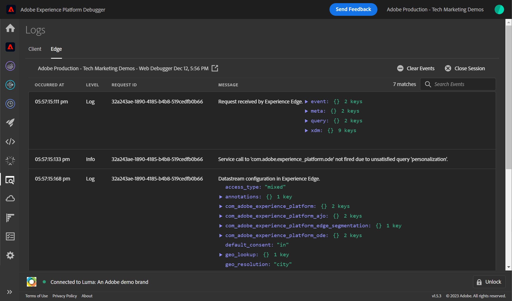

# Valideer de implementaties van SDK van het Web met Foutopsporing van het Experience Platform

Leer hoe u uw Adobe Experience Platform Web SDK-implementatie met Adobe Experience Platform Debugger kunt valideren.

Foutopsporing voor Experience Platforms is een extensie die beschikbaar is voor Chrome- en Firefox-browsers en waarmee u de Adobe-technologie kunt bekijken die in uw webpagina&#39;s is geïmplementeerd. Download de versie voor uw voorkeursbrowser:

* [ uitbreiding Firefox ](https://addons.mozilla.org/nl/firefox/addon/adobe-experience-platform-dbg/)
* [ de uitbreiding van Chrome ](https://chromewebstore.google.com/detail/adobe-experience-platform/bfnnokhpnncpkdmbokanobigaccjkpob)

Als u debugger nooit eerder hebt gebruikt, zou u deze vijf-minieme overzichtsvideo kunnen willen letten:

>[!VIDEO](https://video.tv.adobe.com/v/32156?learn=on)

In deze les, gebruikt u de [ uitbreiding van het Adobe Experience Platform Debugger ](https://chromewebstore.google.com/detail/adobe-experience-platform/bfnnokhpnncpkdmbokanobigaccjkpob) om het markeringsbezit te vervangen dat op de [ Luministoeplaats ](https://luma.enablementadobe.com/content/luma/us/en.html) met uw eigen bezit wordt hard gecodeerd.

Deze techniek wordt omgevingsomschakeling genoemd en is later handig wanneer u met tags op uw eigen website werkt. Het staat u toe om uw productiewebsite in uw browser te laden, maar met uw *ontwikkeling* de tagbibliotheek. Hierdoor kunt u op een betrouwbare manier wijzigingen in tags doorvoeren en valideren, onafhankelijk van uw reguliere code-releases. Per slot van rekening is deze scheiding van marketing markeringsversies van uw regelmatige codeversies één van de belangrijkste redenen klanten in de eerste plaats labels gebruiken!

## Leerdoelstellingen

Aan het eind van deze les, zult u debugger kunnen gebruiken om:

* Een alternatieve tagbibliotheek laden
* Valideer de client-side XDM-gebeurtenis vangt gegevens op en verzendt deze naar de Edge Network Platform
* Edge Trace inschakelen om verzoeken aan de serverzijde die door de Edge Network van het Platform worden verzonden te bekijken

## Vereisten

U bent vertrouwd met de markeringen van de Inzameling van Gegevens en de [ plaats van de de demo van de Luma ](https://luma.enablementadobe.com/content/luma/us/en.html) {target="_blank"} en hebt de vorige lessen in het leerprogramma voltooid:

* [Een XDM-schema configureren](configure-schemas.md)
* [Naamruimte configureren](configure-identities.md)
* [Een gegevensstroom configureren](configure-datastream.md)
* [Web SDK-extensie geïnstalleerd in de eigenschap Tag](install-web-sdk.md)
* [Gegevenselementen maken](create-data-elements.md)
* [Identiteiten maken](create-identities.md)
* [Tagregels maken](create-tag-rule.md)

## Alternatieve tagbibliotheken laden met Foutopsporing

Foutopsporing op Experience Platform heeft een coole functie waarmee u een bestaande tagbibliotheek kunt vervangen door een andere. Deze techniek is nuttig voor bevestiging en staat ons toe om vele implementatiestappen in dit leerprogramma over te slaan.

1. Zorg ervoor u de [ de demowebsite van de Luma ](https://luma.enablementadobe.com/content/luma/us/en.html) {target="_blank"} open hebt en het de uitbreidingspictogram van Foutopsporing van het Experience Platform selecteren
1. Foutopsporing opent en toont sommige details van de hard-gecodeerde implementatie (u kunt de plaats van de Luma na het openen van Debugger moeten opnieuw laden)
1. Bevestig dat Debugger &quot;**[!UICONTROL Connected to Luma]**&quot;zoals hieronder afgebeeld is en selecteer dan het &quot;**[!UICONTROL lock]**&quot;pictogram is om Debugger aan de plaats van de Luma te sluiten.
1. Selecteer de knop **[!UICONTROL Sign In]** en meld u aan bij Adobe Experience Cloud met uw Adobe-id.
1. Ga nu naar **[!UICONTROL Experience Platform Tags]** in de linkernavigatie

   

1. Selecteer de tab **[!UICONTROL Configuration]**
1. Open rechts van waar de **[!UICONTROL Page Embed Codes]** wordt weergegeven het vervolgkeuzemenu **[!UICONTROL Actions]** en selecteer **[!UICONTROL Replace]**

   

1. Aangezien u voor authentiek wordt verklaard, zal Foutopsporing uw beschikbare markeringseigenschappen en milieu&#39;s trekken. Selecteer uw eigenschap
1. Selecteer uw `Development` -omgeving
1. Selecteer de knop **[!UICONTROL Apply]**

   

1. De website van de Luma zal _met uw eigen markeringsbezit_ nu opnieuw laden.

   

Aangezien u het leerprogramma voortzet, gebruikt u deze techniek om de plaats van de Luma aan uw eigen markeringsbezit in kaart te brengen om uw implementatie van SDK van het Web van het Platform te bevestigen. Wanneer u tags op uw eigen website gebruikt, kunt u dezelfde techniek gebruiken om bibliotheken met ontwikkelingslabels op uw productiewebsite te valideren.

## Valideer client-side netwerkverzoeken met Foutopsporing van Experience Platform

U kunt Debugger gebruiken om cliënt-zijbakens te bevestigen die van uw implementatie van SDK van het Web van het Platform worden teweeggebracht om de gegevens te bekijken die naar de Edge Network van het Platform worden verzonden:

1. Ga naar **[!UICONTROL Summary]** in de linkernavigatie om de details van uw markeringseigenschap te zien

   

1. Ga nu naar **[!UICONTROL Experience Platform Web SDK]** in de linkernavigatie om de **[!UICONTROL Network Requests]** te zien
1. De rij **[!UICONTROL events]** openen

   

1. Let op hoe u het gebeurtenistype `web.webpagedetails.pageView` kunt zien dat u in de [!UICONTROL Update variable] -handeling hebt opgegeven, en andere variabelen die zich buiten het vak bevinden en die aan de `AEP Web SDK ExperienceEvent` -veldgroep voldoen.

   

1. Schuif omlaag naar het `web` -object, selecteer dit om het te openen en inspecteer de `webPageDetails.name` , `webPageDetails.server` en `webPageDetails.siteSection` . Deze moeten overeenkomen met de overeenkomstige gegevenslaagvariabelen voor `digitalData` op de startpagina

>[!TIP]
>
> U kunt als volgt de gegevenslaag `digitalData` op de startpagina weergeven en vergelijken:
>
> 1. Open de browsergereedschappen voor ontwikkelaars op de startpagina van Luma. In het geval van Chrome selecteert u de knop `F12` op het toetsenbord
> 1. Selecteer de tab **[!UICONTROL Console]**
> 1. Voer `digitalData` in en selecteer `Enter` op het toetsenbord om de waarden van de gegevenslaag weer te geven

U kunt ook de identiteitskaartgegevens valideren:

1. Meld u aan bij de Luministensite met de referenties `test@adobe.com`/`test`

1. Terugkeer aan de [ homepage van Luma ](https://luma.enablementadobe.com/content/luma/us/en.html)

1. De sectie **[!UICONTROL Experience Platform Web SDK]** openen in de linkernavigatie

   

1. Selecteer de rij **[!UICONTROL events]** om details in een pop-up te openen

   

1. Onderzoek naar **identityMap** binnen pop-up. Hier ziet u `lumaCrmId` met drie toetsen voor authenticatedState, id en primary:
   

### Clientverzoeken valideren met de hulpprogramma&#39;s voor het ontwikkelen van browsers

Deze types van verzoekdetails zijn ook zichtbaar in de hulpmiddelen van de Webontwikkelaar van browser **Netwerk** tabel (het veronderstellen van de website laadt uw markeringsbibliotheek).

1. Open het 1} lusje van het Netwerk **van de de Webontwikkelaar van browser hulpmiddelen {en laad de pagina opnieuw.** Filter voor vraag met `/ee` om van de vraag de plaats te bepalen, het te selecteren, en dan in de **Kopballen** tabel te kijken, en **nuttige lading** tabel

   

1. Ga naar het **lusje van de Reactie** en neem nota hoe de ECID waarde in de reactie inbegrepen is.

   

   >[!NOTE]
   >
   > De waarde ECID is zichtbaar in de netwerkreactie. Het is niet inbegrepen in het `identityMap` gedeelte van het netwerkverzoek, noch wordt het opgeslagen in dit formaat in een koekje.

## Valideer server-zijnetwerkverzoeken met Foutopsporing van het Experience Platform

Zoals u in [ leerde vormen een datastream ](configure-datastream.md) les, verzendt het Web SDK van het Platform eerst gegevens van uw digitaal bezit naar de Edge Network van het Platform. Dan, maakt de Edge Network van het Platform extra server-zijverzoeken aan de overeenkomstige diensten die in uw datastream worden toegelaten. U kunt de server-zijverzoeken bevestigen die door de Edge Network van het Platform door het Spoor van Edge in Debugger worden gemaakt te gebruiken.

<!--Furthermore, you can also validate the fully processed payload after it reaches an Adobe application by using [Adobe Experience Platform Assurance](https://experienceleague.adobe.com/en/docs/experience-platform/assurance/home). -->

### Edge-trace inschakelen

Edge-trace inschakelen:

1. In de linkernavigatie van **[!UICONTROL Experience Platform Debugger]** select **[!UICONTROL Logs]**
1. Selecteer de tab **[!UICONTROL Edge]** en selecteer **[!UICONTROL Connect]**

   

1. Het is nu leeg

   

1. Vernieuw de [ homepage van de Luma ](https://luma.enablementadobe.com/) en controleer **[!UICONTROL Experience Platform Debugger]** opnieuw, om gegevens te zien door komen.

   

Op dit punt, kunt u geen verzoeken bekijken van de Edge Network van het Platform die naar de toepassingen van de Adobe gaan omdat u geen om het even welk in de datastream hebt toegelaten. In toekomstige lessen, gebruikt u het Spoor van Edge om de uitgaande server-zijverzoeken aan Adobe toepassingen en gebeurtenis te bekijken door:sturen. Maar eerst, leer over een ander hulpmiddel om server-zijverzoeken te bevestigen die door Platform Edge Network-Adobe Experience Platform Assurance worden gemaakt!

[Volgende: ](validate-with-assurance.md)

>[!NOTE]
>
>Bedankt dat u tijd hebt geïnvesteerd in het leren over de SDK van Adobe Experience Platform Web. Als u vragen hebt, algemene terugkoppelen wilt delen, of suggesties over toekomstige inhoud hebben, gelieve hen op deze [ Communautaire besprekingspost van de Experience League te delen ](https://experienceleaguecommunities.adobe.com/t5/adobe-experience-platform-data/tutorial-discussion-implement-adobe-experience-cloud-with-web/td-p/444996)
