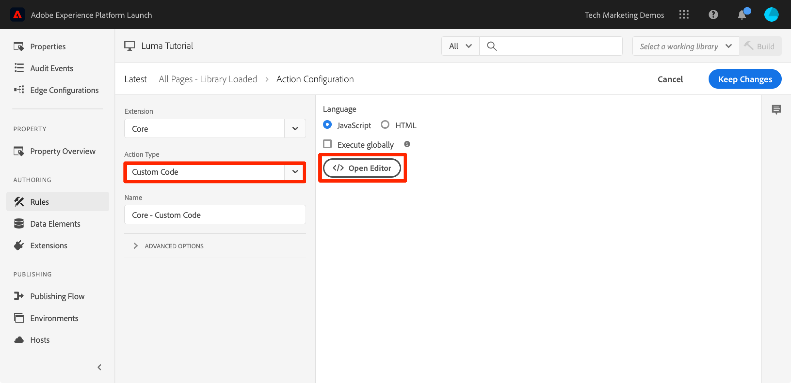
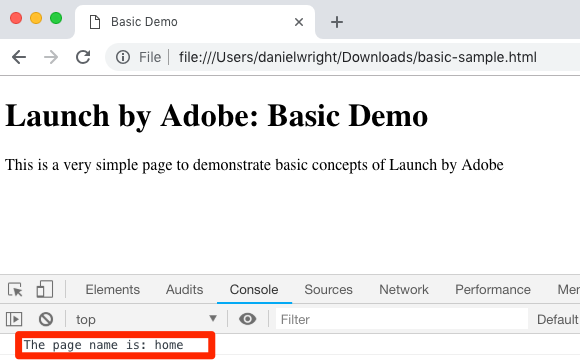

# Een gegevenselement, regel en bibliotheek toevoegen

In deze les, zult u uw eerste Element van Gegevens, Regel, en Bibliotheek creëren.

Gegevenselementen en regels zijn de basisbouwstenen van tags. In Data Elements worden de kenmerken opgeslagen die u naar uw marketing- en advertentieoplossingen wilt verzenden, terwijl Regels de aanvragen naar die oplossingen onder de juiste voorwaarden afhandelen.  Bibliotheken zijn de JavaScript-bestanden die op de pagina worden geladen om al het werk te doen. In deze les, zult u alle drie gebruiken om onze steekproefpagina te maken iets doen.

>[!NOTE]
>
>Adobe Experience Platform Launch wordt in Adobe Experience Platform geïntegreerd als een reeks technologieën voor gegevensverzameling. Verschillende terminologiewijzigingen zijn geïmplementeerd in de interface die u tijdens het gebruik van deze inhoud moet onthouden:
>
> * Platform launch (de Kant van de Cliënt) is nu **[[!DNL tags]](https://experienceleague.adobe.com/docs/experience-platform/tags/home.html?lang=nl)**
> * De Server zijde van de platform launch is nu **[[!DNL event forwarding]](https://experienceleague.adobe.com/docs/experience-platform/tags/event-forwarding/overview.html?lang=nl-NL)**
> * De configuraties van Edge zijn nu **[[!DNL datastreams]](https://experienceleague.adobe.com/docs/experience-platform/edge/fundamentals/datastreams.html?lang=nl-NL)**

## Leerdoelen

Aan het eind van deze les, zult u kunnen:

* Een gegevenselement maken
* Een regel maken
* Een bibliotheek maken
* Wijzigingen toevoegen aan een bibliotheek
* Controleren of uw bibliotheek in uw webbrowser wordt geladen
* De functie &#39;Werkbibliotheek&#39; gebruiken om efficiënter te werken

## Een gegevenselement voor paginanaam maken

Gegevenselementen zijn de versie van een gegevenslaag van een tag. Ze kunnen waarden opslaan van uw eigen gegevenslaagobject, cookies, lokale opslagobjecten, querytekenreeksparameters, pagina-elementen, metatags enzovoort. In deze oefening, zult u een gegevenselement voor de Naam van de Pagina creëren, dat u later in uw Doel en implementaties van Analytics zult gebruiken.

**om een gegevenselement** te creëren

1. Klik in de linkernavigatie op **[!UICONTROL Data Elements]**

1. Aangezien u nog geen gegevenselementen in dit bezit hebt gecreeerd, verschijnt een korte video met extra informatie over dit onderwerp. Kijk naar deze video, als je wilt.

1. Klik op de knop **[!UICONTROL Create New Data Element]** :

   

1. Geef het gegevenselement een naam, bijvoorbeeld `Page Name`

1. Gebruik het gegevenstype [!UICONTROL JavaScript Variable] Data Element om een waarde in de gegevenslaag van de voorbeeldpagina aan te wijzen: `digitalData.page.pageInfo.pageName`

1. Schakel de selectievakjes voor **[!UICONTROL Force lowercase value]** en **[!UICONTROL Clean text]** in om het hoofdlettergebruik te standaardiseren en overbodige spaties te verwijderen

1. Laat **[!UICONTROL None]** staan als de instelling **[!UICONTROL Storage Duration]** omdat deze waarde normaal gesproken op elke pagina anders is

1. Klik op de knop **[!UICONTROL Save]** om het gegevenselement op te slaan

   .

>[!NOTE]
>
>Het elementmogelijkheden van gegevens _kunnen met Uitbreidingen_ worden uitgebreid. Bijvoorbeeld, staat de uitbreiding ContextHub u toe om gegevenselementen toe te voegen gebruikend eigenschappen van de uitbreiding.

## Een regel maken

Vervolgens gebruikt u dit gegevenselement in een eenvoudige regel. Regels zijn een van de krachtigste functies in tags en u kunt opgeven wat er moet gebeuren als de bezoeker communiceert met uw website. Wanneer aan de criteria in uw regels wordt geschetst, teweegbrengt de regel de actie teweeg u hebt gespecificeerd.

U gaat een regel tot stand brengen die de het gegevenselementwaarde van de Naam van de Pagina aan de browser console uitvoert.

**om een regel** te creëren

1. Klik in de linkernavigatie op **[!UICONTROL Rules]**

1. Aangezien u nog geen regels in dit bezit hebt gecreeerd, verschijnt een korte video met extra informatie over het onderwerp. Kijk naar deze video, als je wilt.

1. Klik op de knop **[!UICONTROL Create New Rule]** :

   

1. Geef de regel een naam `All Pages - Library Loaded` . Deze naamgevingsconventie geeft aan waar en wanneer de regel wordt geactiveerd, zodat u deze eenvoudiger kunt herkennen en gebruiken wanneer de eigenschap tag rijpt.

1. Klik onder Gebeurtenissen op **[!UICONTROL Add]** . De gebeurtenis vertelt tags wanneer de regel moet worden geactiveerd en kan vele dingen zijn, zoals het laden van een pagina, een klik, een aangepaste JavaScript-gebeurtenis, enzovoort.

    toe

   1. Selecteer **[!UICONTROL Library Loaded (Page Top)]** als gebeurtenistype. Wanneer u het gebeurtenistype selecteert, wordt met de labels vooraf een naam voor de gebeurtenis ingevuld met uw selectie. De standaardvolgorde voor de gebeurtenis is 50. Orderen is een krachtige functie in tags die u nauwkeurige controle geeft over de volgorde van handelingen wanneer u meerdere regels hebt die door dezelfde gebeurtenis worden geactiveerd. Deze functie wordt later in de zelfstudie gebruikt.

   1. Klik op de knop **[!UICONTROL Keep Changes]**

   

1. Aangezien deze regel op alle pagina&#39;s moet worden toegepast, laat u **[!UICONTROL Conditions]** leeg. Als u het modaal van Voorwaarden opent, zult u zien dat de voorwaarden zowel beperkingen als uitsluitingen kunnen toevoegen die op een grote verscheidenheid van opties, met inbegrip van URLs, de waarden van het gegevenselement, datumwaaiers, en meer worden gebaseerd.

1. Klik onder Acties op **[!UICONTROL Add]**

1. Selecteer **[!UICONTROL Action Type > Custom Code]** , wat op dit punt de enige optie is. Later in de tutorial worden meer opties beschikbaar wanneer u uitbreidingen toevoegt.

1. Selecteer **[!UICONTROL </> Open Editor]** om de code-editor te openen

   

1. Voeg het volgende toe aan de code-editor. Deze code zal de waarde van het gegevenselement van de Naam van de Pagina aan de browser console uitvoeren zodat kunt u het bevestigen werkt:

   ```javascript
   console.log('The page name is '+_satellite.getVar('Page Name'));
   ```

1. De code-editor opslaan

    in

1. Klik in het configuratiescherm Handeling op **[!UICONTROL Keep Changes]**

1. Klik op **[!UICONTROL Save]** om de regel op te slaan

Op de pagina van Regels, zou u uw nieuwe regel moeten zien:


## Uw wijzigingen in een bibliotheek opslaan

Nadat u een verzameling extensies, gegevenselementen en regels in de interface voor gegevensverzameling hebt geconfigureerd, moet u deze mogelijkheden en logica in een set JavaScript-code verpakken die u op uw website kunt implementeren, zodat marketingtags worden geactiveerd wanneer bezoekers naar de site komen. Een bibliotheek is de set JavaScript-code die dit doet.

In een vroegere les, uitvoerde u de inbedcode van uw ontwikkelomgeving op de steekproefpagina. Wanneer u de voorbeeldpagina hebt geladen, is een fout van 404 geretourneerd voor de insluitcode-URL omdat er nog geen tagbibliotheek is gemaakt en toegewezen aan de omgeving. Nu plaatst u het nieuwe gegevenselement en de nieuwe regel in een bibliotheek zodat de voorbeeldpagina iets kan doen.

**om een bibliotheek** toe te voegen en te bouwen

1. Klik in de linkernavigatie op **[!UICONTROL Publishing Flow]**

1. Klikken **[!UICONTROL Add New Library]**

    toe

1. Geef de bibliotheek een naam, bijvoorbeeld `Initial Setup`

1. Selecteren **[!UICONTROL Environment > Development]**

1. Klikken **[!UICONTROL Add All Changed Resources]**

    toe

1. Nadat u op **[!UICONTROL Add All Changed Resources]** -tags hebt geklikt, wordt een overzicht gegeven van de wijzigingen die u zojuist hebt aangebracht.

1. Klikken **[!UICONTROL Save & Build for Development]**

   

Na enkele ogenblikken wordt de statuspunt groen om aan te geven dat de bibliotheek is gemaakt.


## Uw werk valideren

Bevestig nu dat uw regel zoals verwacht werkt.

Laad de voorbeeldpagina opnieuw. Als u de Hulpmiddelen van de Ontwikkelaar -> het lusje van het Netwerk bekijkt, zou u nu een 200 reactie voor uw markeringsbibliotheek moeten zien!


Als u de Developer Tools -> Console bekijkt, ziet u de tekst &quot;De paginanaam is home&quot;


Gefeliciteerd, u hebt uw eerste gegevenselement en regel gemaakt en uw eerste tagbibliotheek gemaakt!

## De functie Werkbibliotheek gebruiken

Wanneer u veel wijzigingen aanbrengt in tags, is het niet handig om naar het tabblad Publiceren te komen, wijzigingen toe te voegen en de bibliotheek te maken wanneer u het resultaat wilt zien.  Nu u uw bibliotheek van de &quot;Aanvankelijke Opstelling&quot;hebt gecreeerd, kunt u een eigenschap gebruiken genoemd &quot;het Werken Bibliotheek&quot;om uw veranderingen snel te bewaren en de bibliotheek in één enkele stap opnieuw op te bouwen.

Breng een kleine wijziging aan in de regel &quot;Alle pagina&#39;s - Bibliotheek geladen&quot;. Klik in de linkernavigatie op **[!UICONTROL Rules]** en klik vervolgens op de `All Pages - Library Loaded` -regel om deze te openen.


Klik op de pagina `Edit Rule` op het vervolgkeuzemenu ***[!UICONTROL Working Library]*** en selecteer uw `Initial Setup` bibliotheek.


Nadat u de bibliotheek hebt geselecteerd, ziet u dat de knop **[!UICONTROL Save]** nu standaard op **[!UICONTROL Save to Library]** staat. Als u een wijziging in de tags aanbrengt, kunt u deze optie gebruiken om de wijziging automatisch rechtstreeks toe te voegen aan uw werkbibliotheek en/of opnieuw samen te stellen.

Test het. Open de handeling Aangepaste code en voeg alleen een dubbele punt toe na de tekst &#39;De paginanaam is&#39;, zodat het hele codeblok wordt gelezen:

```javascript
console.log('The page name is: '+_satellite.getVar('Page Name'));
```

Sla de code op, houd de wijzigingen in de actie en klik nu op de knop **[!UICONTROL Save to Library and Build]** .


Wacht even totdat de groene stip weer verschijnt naast het vervolgkeuzemenu [!UICONTROL Working Library] . Laad nu de voorbeeldpagina opnieuw en u ziet dat de wijziging doorwerkt in het consolemelding (u moet mogelijk de cache van de browser wissen en opnieuw laden om de wijziging in de pagina te kunnen zien):



Dit is een veel snellere manier van werken en u zult deze benadering voor de rest van het leerprogramma gebruiken.

[Volgende &quot;Omgevingen omwisselen met het Experience Cloud Debugger&quot; >](switch-environments.md)
