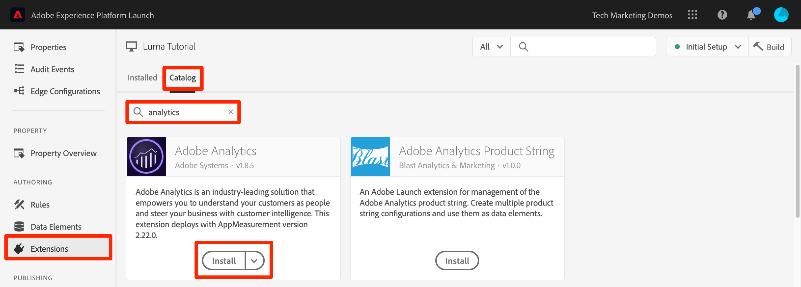
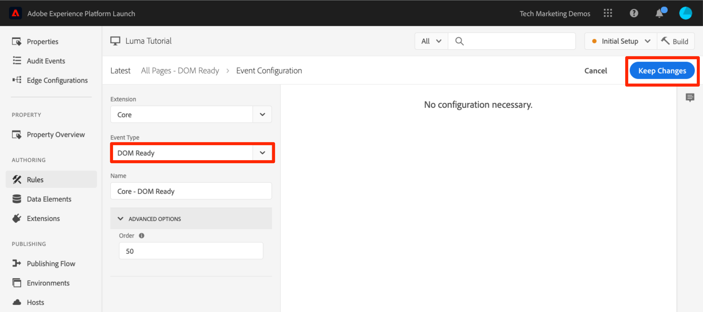
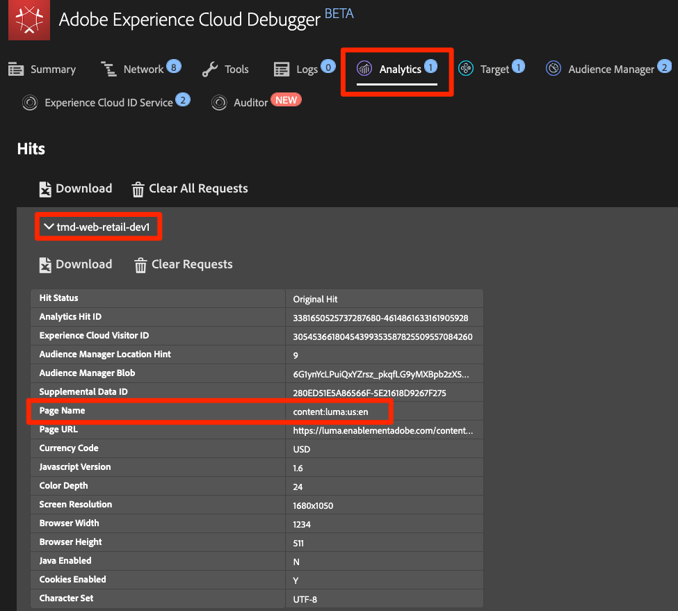
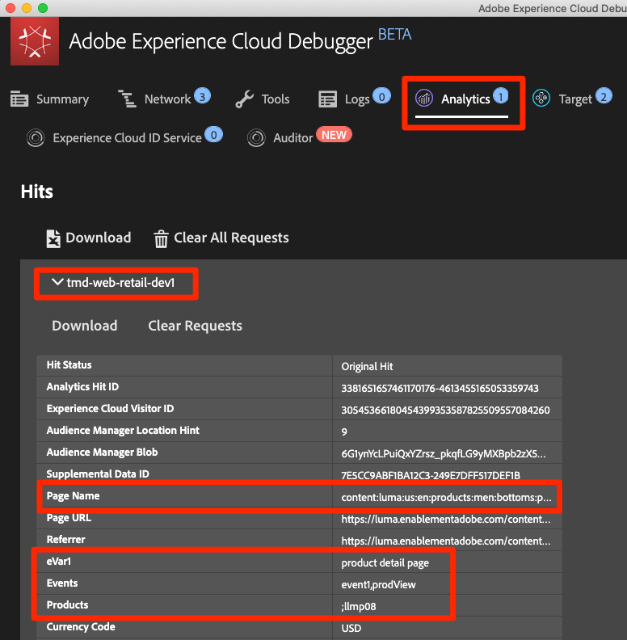
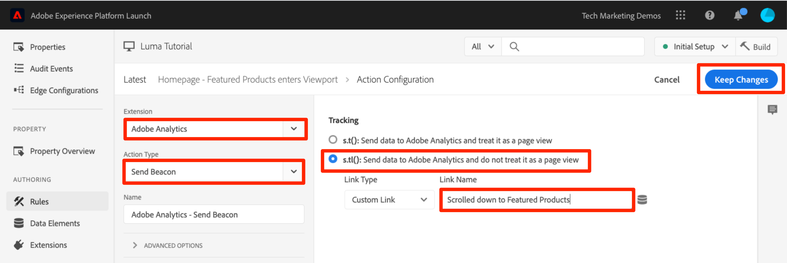
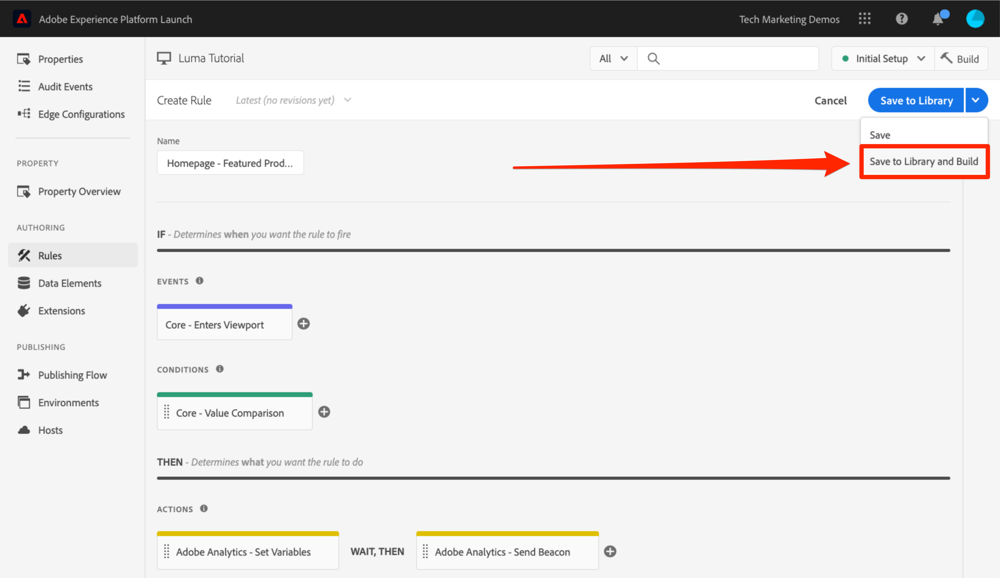

# Adobe Analytics toevoegen

In deze les, zult u de [ uitbreiding van Adobe Analytics ](https://experienceleague.adobe.com/docs/experience-platform/tags/extensions/adobe/analytics/overview.html) uitvoeren en zult regels creëren om gegevens naar Adobe Analytics te verzenden.

[ Adobe Analytics ](https://experienceleague.adobe.com/docs/analytics.html) is een industrie-leidende oplossing die u machtigt om uw klanten als mensen te begrijpen en uw zaken met klantenintelligentie te sturen.

>[!NOTE]
>
>Adobe Experience Platform Launch wordt in Adobe Experience Platform geïntegreerd als een reeks technologieën voor gegevensverzameling. Verschillende terminologiewijzigingen zijn geïmplementeerd in de interface die u tijdens het gebruik van deze inhoud moet onthouden:
>
> * Platform launch (de Kant van de Cliënt) is nu **[[!DNL tags]](https://experienceleague.adobe.com/docs/experience-platform/tags/home.html?lang=nl)**
> * De Server zijde van de platform launch is nu **[[!DNL event forwarding]](https://experienceleague.adobe.com/docs/experience-platform/tags/event-forwarding/overview.html)**
> * De configuraties van Edge zijn nu **[[!DNL datastreams]](https://experienceleague.adobe.com/docs/experience-platform/edge/fundamentals/datastreams.html)**

## Leerdoelen

Aan het eind van deze les, zult u kunnen:

1. De Adobe Analytics-extensie toevoegen
1. Algemene variabelen instellen met de extensie
1. Het paginaweergavebaken toevoegen
1. Aanvullende variabelen toevoegen met regels
1. Kliktracering en andere op gebeurtenissen gebaseerde bakens toevoegen
1. Analyseplug-ins toevoegen

Er zijn veel dingen die voor Analytics in markeringen zouden kunnen worden uitgevoerd. Deze les is niet uitputtend, maar zou u een stevig overzicht van de belangrijkste technieken moeten geven u voor implementatie in uw eigen plaats zult vereisen.

## Vereisten

U zou de lessen in [ reeds moeten hebben voltooid vormen markeringen ](create-a-property.md) en [ voeg de Dienst van de Identiteit toe ](id-service.md).

Daarnaast hebt u ten minste één rapportsuite-id en uw traceringsserver nodig. Als u geen test/dev- rapportreeks hebt die u voor dit leerprogramma kunt gebruiken, te creëren gelieve. Als u onzeker bent hoe te om dat te doen, zie [ de documentatie ](https://experienceleague.adobe.com/docs/analytics/admin/manage-report-suites/new-report-suite/new-report-suite.html). U kunt uw traceringsserver ophalen van uw huidige implementatie, Adobe Consultant of medewerker van de klantenservice.

## De extensie Analytics toevoegen

De extensie Analytics bestaat uit twee hoofdonderdelen:

1. De extensieconfiguratie, die de kernbibliotheekinstellingen van AppMeasurement.js beheert en algemene variabelen kan instellen
1. Handelingen van de regel om het volgende te doen:
   1. Variabelen instellen
   1. Variabelen wissen
   1. De Analysebaken verzenden

**om de uitbreiding van Analytics toe te voegen**

1. Ga naar **[!UICONTROL Extensions > Catalog]**
1. De Adobe Analytics-extensie zoeken
1. Klikken **[!UICONTROL Install]**

   

1. Voer onder [!UICONTROL Library Management > Report Suites] de rapportsuite-id&#39;s in die u voor elke tagomgeving wilt gebruiken. Als uw gebruikers toegang hebben tot Adobe Analytics, merkt u op dat wanneer u begint in de doos te typen, u een vooraf ingevulde lijst van al uw rapportreeksen zult zien. (Het is oké om één rapportenreeks voor alle milieu&#39;s in dit leerprogramma te gebruiken, maar in echt zou u afzonderlijke rapportseries willen gebruiken, zoals aangetoond in hieronder beeld)

    in

   >[!TIP]
   >
   >We raden u aan de instelling [!UICONTROL Manage the library for me option] als [!UICONTROL Library Management] te gebruiken, omdat het hierdoor veel eenvoudiger wordt om de `AppMeasurement.js` -bibliotheek up-to-date te houden.

1. Voer onder [!UICONTROL General > Tracking Server] uw trackingserver in, bijvoorbeeld `tmd.sc.omtrdc.net` . Voer uw SSL-traceringsserver in als uw site ondersteuning biedt voor `https://`

    in

1. Stel in de map [!UICONTROL Global Variables section] onder [!UICONTROL Additional Settings] de variabele [!UICONTROL Page Name] in met behulp van het gegevenselement `Page Name` . Klik het  pictogram om modaal te openen en het pagina `Page Name` gegevenselement te kiezen)

1. Klikken **[!UICONTROL Save to Library]**

   

>[!NOTE]
>
>Globale variabelen kunnen in de uitbreidingsconfiguratie of in regelacties worden geplaatst. Ben zich ervan bewust dat wanneer het plaatsen van variabelen in de uitbreidingsconfiguratie, de gegevenslaag *moet worden bepaald vóór* de markering bed codes in.

## De Paginaweergavebaken verzenden

Nu zult u een regel creëren om het baken van de Analyse in brand te steken, dat [!UICONTROL Page Name] variabele zal verzenden die in de uitbreidingsconfiguratie wordt geplaatst.

U hebt reeds een &quot;Alle Pagina&#39;s - Bibliotheek Geladen&quot;regel in [ gecreeerd voegt een gegevenselement, een regel en een bibliotheek ](add-data-elements-rules.md) les van dit leerprogramma toe, dat op elke pagina wordt teweeggebracht wanneer de markeringsbibliotheek laadt. U *kon* deze regel voor Analytics ook gebruiken, nochtans vereist deze opstelling alle attributen van de gegevenslaag die in het baken van Analytics worden gebruikt om vóór de markering worden bepaald bed codes in. Om meer flexibiliteit met de gegevensinzameling toe te staan, zult u een nieuwe &quot;alle pagina&#39;s&quot;regel tot stand brengen die op DOM Klaar wordt teweeggebracht om het baken van de Analyse in brand te steken.

**om het Baken van de Mening van de Pagina te verzenden**

1. Ga naar de sectie **[!UICONTROL Rules]** in de linkernavigatie en klik vervolgens op **[!UICONTROL Add Rule]**

    toe

1. Naam van de regel `All Pages - DOM Ready`
1. Klik op **[!UICONTROL Events > Add]** om het scherm `Event Configuration` te openen

    toe

1. Selecteer **[!UICONTROL Event Type > DOM Ready]** (De volgorde van de regel is &quot;50&quot;)
1. Klikken **[!UICONTROL Keep Changes]**
   

1. Onder Acties, klik  om een nieuwe actie toe te voegen

   

1. Selecteren **[!UICONTROL Extension > Adobe Analytics]**

1. Selecteren **[!UICONTROL Action Type > Send Beacon]**

1. Laat Tekstspatiëring ingesteld staan op `s.t()` . Merk op dat als u een `s.tl()` vraag in een klik-gebeurtenis regel wilt maken u dat kon doen gebruikend de Send actie van het Bandje, eveneens.

1. Klik op de knop **[!UICONTROL Keep Changes]**

   

1. Klikken **[!UICONTROL Save to Library and Build]**

   

### Valideer het Paginaweergavebaken

Nu u een regel hebt gecreeerd om een baken van Analytics te verzenden, zou u het verzoek in het Experience Cloud Debugger moeten kunnen zien.

1. Open de [ plaats van de Luma ](https://luma.enablementadobe.com/content/luma/us/en.html) in uw browser van Chrome
1. Klik het Debugger pictogram  om **[!UICONTROL Adobe Experience Cloud Debugger]** te openen
1. Zorg ervoor debugger het markeringsbezit aan *in kaart brengt uw* milieu van de Ontwikkeling, zoals die in de [ vroegere les ](switch-environments.md) wordt beschreven

   

1. Klik om het tabblad Analyse te openen
1. Breid uw naam van de Reeks van het Rapport uit om alle verzoeken te tonen die aan het worden gemaakt
1. Bevestig dat het verzoek is geactiveerd met de variabele en waarde Paginanaam

   

>[!NOTE]
>
>Als de paginanaam niet voor u verschijnt, ga terug door de stappen in deze pagina om ervoor te zorgen dat u niets hebt gemist.

## Variabelen toevoegen met regels

Wanneer u de extensie Analytics hebt geconfigureerd, hebt u de variabele `pageName` ingevuld in de extensieconfiguratie. Dit is een fijne locatie voor het vullen van andere algemene variabelen, zoals eVars en props, mits de waarde beschikbaar is op de pagina voordat de code voor het insluiten van tags wordt geladen.

Een flexibelere locatie voor het instellen van variabelen (en gebeurtenissen) bevindt zich in regels met de handeling `Set Variables` . Met regels kunt u verschillende analytische variabelen en gebeurtenissen onder verschillende omstandigheden instellen. U kunt de eigenschap `prodView` bijvoorbeeld alleen instellen op pagina&#39;s met productdetails en de gebeurtenis `purchase` alleen instellen op pagina&#39;s waarop het bestellen wordt bevestigd. Deze sectie zal u leren hoe te om variabelen te plaatsen gebruikend regels.

### Hoofdletters gebruiken

De Pagina&#39;s van het Detail van het product (PDP) zijn belangrijke punten voor gegevensinzameling op detailhandelsplaatsen. Doorgaans wilt u dat Analytics registreert dat een productweergave heeft plaatsgevonden en welk product is weergegeven. Dit is handig om te begrijpen welke producten populair zijn bij uw klanten. Op een mediasite kunnen artikel- of videopagina&#39;s soortgelijke volgtechnieken gebruiken als in deze sectie.  Wanneer u een pagina met productdetails laadt, kunt u die waarde in een &quot;Paginatype&quot; `eVar` plaatsen en een aantal gebeurtenissen en de product-id instellen. Op die manier kunnen we in onze analyse het volgende zien:

1. Hoeveel keer productdetailpagina&#39;s worden geladen
1. Welke specifieke producten worden weergegeven en hoe vaak?
1. Welke andere factoren (campagnes, onderzoek, enz.) beïnvloeden hoeveel PDP&#39;s mensen laden

### Gegevenselement maken voor paginatype

Eerst moet u identificeren welke pagina&#39;s de pagina&#39;s van het Detail van het Product zijn. Dat gaat u doen met een gegevenselement.

**om het Element van Gegevens voor het Type van Pagina te creëren**

1. Klik op **[!UICONTROL Data Elements]** in de linkernavigatie
1. Klikken **[!UICONTROL Add Data Element]**

   

1. Naam van het gegevenselement `Page Type`
1. Selecteren **[!UICONTROL Data Element Type > JavaScript Variable]**
1. `digitalData.page.category.type` gebruiken als de **[!UICONTROL JavaScript variable name]**
1. Controleer de opties **[!UICONTROL Clean text]** en **[!UICONTROL Force Lower Case]**
1. Klikken **[!UICONTROL Save to Library]**

    toe

### Gegevenselement maken voor product-id

Vervolgens verzamelt u de product-id van de huidige productdetailpagina met een gegevenselement

**om het Element van Gegevens voor identiteitskaart van het Product te creëren**

1. Klik op **[!UICONTROL Data Elements]** in de linkernavigatie
1. Klikken **[!UICONTROL Add Data Element]**

   

1. Naam van het gegevenselement `Product Id`
1. Selecteren **[!UICONTROL Data Element Type > JavaScript Variable]**
1. `digitalData.product.0.productInfo.sku` gebruiken als de **[!UICONTROL JavaScript variable name]**
1. Controleer de opties **[!UICONTROL Clean text]** en **[!UICONTROL Force Lower Case]**
1. Klikken **[!UICONTROL Save to Library]**

    toe

### De extensie Adobe Analytics-productreeks toevoegen

Als u reeds vertrouwd met de implementaties van Adobe Analytics bent, bent u waarschijnlijk vertrouwd met de [ productvariabele ](https://experienceleague.adobe.com/docs/analytics/implementation/vars/page-vars/products.html). De productvariabele heeft een zeer specifieke syntaxis en wordt gebruikt lichtjes verschillende manieren afhankelijk van de context. Om de populatie van de productvariabele in markeringen gemakkelijker te maken, zijn drie extra uitbreidingen reeds gecreeerd in de markt van de marktextensie! In deze sectie voegt u een extensie toe die door Adobe Consulting is gemaakt voor gebruik op de pagina Productdetails.

**om toe te voegen voegt `Adobe Analytics Product String` uitbreiding** toe

1. Ga naar de [!UICONTROL Extensions > Catalog] -pagina
1. Zoek de extensie `Adobe Analytics Product String` van Adobe Consulting Services en klik op **[!UICONTROL Install]**
    toe
1. Neem even de tijd om de instructies te lezen
1. Klikken **[!UICONTROL Save to Library]**

   

### De regel voor productdetailpagina&#39;s maken

Nu, zult u uw nieuwe gegevenselementen en uitbreiding gebruiken om uw de paginalijn van het Detail van het Product te bouwen. Voor deze functionaliteit, zult u een andere regel van de paginading creëren, die door DOM Klaar wordt teweeggebracht. Nochtans, zult u een voorwaarde gebruiken zodat het slechts op de pagina&#39;s van het Detail van het Product en de orde het plaatsen in brand steekt zodat het _vóór_ de regel in brand steekt die het baken verzendt.

**om de de paginalijn van het Detail van het Product te bouwen**

1. Ga naar de sectie **[!UICONTROL Rules]** in de linkernavigatie en klik vervolgens op **[!UICONTROL Add Rule]**

    toe

1. Naam van de regel `Product Details - DOM Ready - 40`
1. Klik op **[!UICONTROL Events > Add]** om het scherm `Event Configuration` te openen

    toe

1. Selecteren **[!UICONTROL Event Type > DOM Ready]**
1. Plaats **[!UICONTROL Order]** aan 40, zodat de regel *vóór* de regel zal in werking stellen die de Analytics > verzendt actie van het Beken bevat
1. Klikken **[!UICONTROL Keep Changes]**
   

1. Onder **[!UICONTROL Conditions]**, klik  om het `Condition Configuration` scherm te openen
    toe te voegen

   1. Selecteren **[!UICONTROL Condition Type > Value Comparison]**
   1. Gebruik de kiezer voor het gegevenselement en kies `Page Type` in het eerste veld
   1. Selecteer **[!UICONTROL Contains]** in het vervolgkeuzemenu van de vergelijkingsoperator
   1. In het volgende veldtype `product-page` (dit is het unieke deel van de waarde van het paginatype dat uit de gegevenslaag op PDP&#39;s wordt gehaald)
   1. Klikken **[!UICONTROL Keep Changes]**

      

1. Onder Acties, klik  om een nieuwe actie toe te voegen

   

1. Selecteren **[!UICONTROL Extension > Adobe Analytics Product String]**
1. Selecteren **[!UICONTROL Action Type > Set s.products]**

1. Selecteer in de sectie **[!UICONTROL Analytics E-commerce Event]** de optie **[!UICONTROL prodView]**

1. In de sectie **[!UICONTROL Data layer variables for product data]** gebruikt u de kiezer voor gegevenselementen om het gegevenselement `Product Id` te kiezen

1. Klikken **[!UICONTROL Keep Changes]**

   


1. Onder Acties, klik  om een nieuwe actie toe te voegen

    toe

1. Selecteren **[!UICONTROL Extension > Adobe Analytics]**
1. Selecteren **[!UICONTROL Action Type > Set Variables]**
1. Selecteer **[!UICONTROL eVar1 > Set as]** en voer `product detail page` in
1. **[!UICONTROL event1]** instellen, waarbij de optionele waarden leeg blijven
1. Klik onder Gebeurtenissen op de knop **[!UICONTROL Add Another]**
1. Stel de gebeurtenis **[!UICONTROL prodView]** in en laat de optionele waarden leeg
1. Klikken **[!UICONTROL Keep Changes]**

   

1. Klikken **[!UICONTROL Save to Library and Build]**

   

### De gegevens van de productdetailpagina valideren

U hebt zojuist een regel gemaakt die variabelen instelt voordat het baken wordt verzonden. Je moet nu in staat zijn om de nieuwe gegevens in de hit in het Experience Cloud Debugger te zien.

**om de de paginagegevens van het Detail van het Product te bevestigen**

1. Open de [ plaats van de Luma ](https://luma.enablementadobe.com/content/luma/us/en.html) in uw browser van Chrome
1. Naar een pagina met productdetails navigeren
1. Klik het Debugger pictogram  om uw **[!UICONTROL Adobe Experience Cloud Debugger]** te openen
1. Klik op het tabblad Analyse
1. Uw rapportsuite uitbreiden
1. Merk op de Variabelen van het Detail van het Product die nu in debugger zijn, namelijk dat `eVar1` aan &quot;productdetailpagina&quot;is geplaatst, dat de `Events` variabele aan &quot;event1&quot;en &quot;prodView&quot;is geplaatst, dat de productvariabele met product identiteitskaart van het product wordt geplaatst u bekijkt, en dat uw Naam van de Pagina nog door de uitbreiding van de Analytics wordt geplaatst

   

## Verstuur een baken van de Verbinding van het Spoor

Wanneer een pagina wordt geladen, wordt doorgaans een baken voor het laden van een pagina geactiveerd dat door de functie `s.t()` wordt geactiveerd. Dit verhoogt automatisch `page view` metrisch voor de pagina die in `pageName` wordt vermeld variabele.

Soms wilt u echter de paginaweergaven op uw site niet vergroten, omdat de actie die wordt uitgevoerd &#39;kleiner&#39; (of misschien gewoon anders) is dan de paginaweergave. In dit geval gebruikt u de functie `s.tl()` , die doorgaans een aanvraag voor een &#39;trackkoppeling&#39; wordt genoemd. Hoewel het als verzoek van de spoorverbinding wordt bedoeld, moet het niet op een verbindingsklik worden teweeggebracht. Het kan door *worden teweeggebracht om het even welke* van de gebeurtenissen die aan u in de bouwer van de markeringsregel, met inbegrip van uw eigen douaneJavaScript beschikbaar zijn.

In deze zelfstudie activeert u een `s.tl()` -aanroep met een van de oudste JavaScript-gebeurtenissen, een `Enters Viewport` -gebeurtenis.

### Het hoofdlettergebruik

Voor dit gebruiksgeval, wilt u weten of schuiven de mensen neer op onze homepage van de Luma ver genoeg om de *Gekenmerkte Producten* sectie van onze pagina te zien. Er is wat interne onenigheid in ons bedrijf over of mensen die sectie zelfs zien of niet, zodat wilt u Analytics gebruiken om de waarheid te bepalen.

### De regel in tags maken

1. Ga naar de sectie **[!UICONTROL Rules]** in de linkernavigatie en klik vervolgens op **[!UICONTROL Add Rule]**
    toe
1. Naam van de regel `Homepage - Featured Products enters Viewport`
1. Klik op **[!UICONTROL Events > Add]** om het scherm `Event Configuration` te openen

   

1. Selecteer **[!UICONTROL Event Type > Enters Viewport]**. Hiermee wordt een veld weergegeven waarin u de CSS-kiezer moet invoeren die het item op de pagina identificeert dat de regel moet activeren wanneer deze in de browser wordt weergegeven.
1. Ga terug naar de startpagina van Luma en blader omlaag naar de sectie Aanbevolen producten.
1. Klik met de rechtermuisknop op de ruimte tussen de titel &quot;FEATURED PRODUCTS&quot; en de items in deze sectie en selecteer `Inspect` in het snelmenu. Hierdoor komt u dicht bij wat u wilt.
1. Hier, mogelijk direct onder de geselecteerde sectie, zoekt u naar een div met `class="we-productgrid aem-GridColumn aem-GridColumn--default--12"` . Zoek dit element.
1. Klik met de rechtermuisknop op dit element en selecteer **[!UICONTROL Copy > Copy Selector]**

   

1. Ga terug naar labels en plak deze waarde van het klembord in het veld met het label `Elements matching the CSS selector` .
   1. Aan de zijkant bepaalt u hoe CSS-kiezers worden geïdentificeerd. Deze methode is een beetje kwetsbaar, omdat deze kiezer door bepaalde wijzigingen op de pagina kan worden verbroken. Houd hier rekening mee wanneer u CSS-kiezers in tags gebruikt.
1. Klikken **[!UICONTROL Keep Changes]**
   

1. Onder Voorwaarden, klik  om een nieuwe voorwaarde toe te voegen
1. Selecteren **[!UICONTROL Condition Type > Value Comparison]**
1. Gebruik de kiezer voor het gegevenselement en kies `Page Name` in het eerste veld
1. Selecteer **[!UICONTROL Equals]** in het vervolgkeuzemenu van de vergelijkingsoperator
1. In het volgende veldtype `content:luma:us:en` (dit is de paginanaam van de homepage zoals getrokken uit de gegevenslaag - wij willen slechts deze regel op de homepage lopen)
1. Klikken **[!UICONTROL Keep Changes]**

   

1. Onder Acties, klik  om een nieuwe actie toe te voegen
1. Selecteren **[!UICONTROL Extension > Adobe Analytics]**
1. Selecteren **[!UICONTROL Action Type > Set Variables]**
1. `eVar3` instellen op `Home Page - Featured Products`
1. `prop3` instellen op `Home Page - Featured Products`
1. Stel de variabele `Events` in op `event3`
1. Klikken **[!UICONTROL Keep Changes]**

   

1. Onder Acties, klik  om een andere nieuwe actie toe te voegen

1. Selecteren **[!UICONTROL Extension > Adobe Analytics]**
1. Selecteren **[!UICONTROL Action Type > Send Beacon]**
1. Kies de optie **[!UICONTROL `s.tl()`]** Tekstspatiëring
1. Typ `Scrolled down to Featured Products` in het veld **[!UICONTROL Link Name]** . Deze waarde wordt in het rapport Aangepaste koppelingen in Analytics geplaatst.
1. Klikken **[!UICONTROL Keep Changes]**

   

1. Klikken **[!UICONTROL Save to Library and Build]**

   

### Valideer het baken van de Verbinding van het Spoor

Nu wilt u ervoor zorgen dat deze hit wordt weergegeven wanneer u naar de sectie Aanbevolen producten op de startpagina van onze site schuift. Wanneer u de startpagina laadt, moet het verzoek niet worden gedaan, maar wanneer u omlaag schuift en de sectie in beeld komt, moet de treffer met onze nieuwe waarden branden.

1. Open de [ plaats van de Luma ](https://luma.enablementadobe.com/content/luma/us/en.html) in uw browser van Chrome en zorg ervoor u bij de bovenkant van de homepage bent.
1. Klik **[!UICONTROL debugger icon]**  om uw [!UICONTROL Adobe Experience Cloud Debugger] te openen
1. Klik op het tabblad Analyse
1. De hit van de rapportsuite uitbreiden
1. U ziet dat de normale paginaweergave is geactiveerd voor de startpagina met de paginanaam, enz. (maar niets in eVar3 of prop3).

   

1. Als u Foutopsporing geopend laat, schuift u omlaag op uw site totdat u de sectie Aanbevolen producten kunt zien
1. Bekijk de foutopsporing opnieuw en er had nog een hit voor Analytics moeten verschijnen. Bij deze hit moeten de params gekoppeld zijn aan de s.tl() hit die u hebt ingesteld, namelijk:
   1. `LinkType = "link_o"` (dit betekent dat de hit een aangepaste koppelingshit is, geen treffer voor de paginaweergave)
   1. `LinkName = "Scrolled down to Featured Products"`
   1. `prop3 = "Home Page - Featured Products"`
   1. `eVar3 = "Home Page - Featured Products"`
   1. `Events = "event3"`

      

## Een plug-in toevoegen

Een plug-in is een stuk JavaScript-code dat u aan de implementatie kunt toevoegen om een specifieke functie uit te voeren die niet in het product is ingebouwd. Plug-ins kunnen door u, door andere klanten/partners van de Adobe of door Adobe Consulting worden gebouwd.

Voor het implementeren van plug-ins zijn er drie stappen:

1. Neem de functie doPlugins op, waar naar de plug-in wordt verwezen
1. De hoofdfunctiecode voor de plug-in toevoegen
1. Neem de code op die de functie aanroept en variabelen instelt, enz.

### Het object Analytics algemeen toegankelijk maken

Als u de functie doPlugins (hieronder) toevoegt en stop-ins gebruikt, moet u een doos controleren om het voorwerp van Analytics &quot;s&quot;globaal in de implementatie van Analytics ter ter beschikking te stellen.

1. Ga naar **[!UICONTROL Extensions > Installed]**

1. Klik in de extensie Adobe Analytics op **[!UICONTROL Configure]**

   

1. Selecteer onder **[!UICONTROL Library Management]** het vak met het label `Make tracker globally accessible` . Zoals u in de Help bubble kunt zien, zal dit de tracker globaal onder window.s maken, wat belangrijk zal zijn aangezien u naar het in uw klant JavaScript verwijst.
   

### Inclusief de functie doPlugins

Als u plug-ins wilt toevoegen, moet u een functie met de naam doPlugins toevoegen. Deze functie wordt niet standaard toegevoegd, maar wordt na toevoeging afgehandeld door de bibliotheek van het AppMeasurement en wordt als laatste aangeroepen wanneer een hit naar Adobe Analytics wordt verzonden. Daarom kunt u deze functie gebruiken om sommige JavaScript in te stellen om variabelen in te stellen die gemakkelijker op deze manier zijn ingesteld.

1. Schuif omlaag en vouw de sectie met de naam `Configure Tracker Using Custom Code.` uit terwijl u de extensie Analytics gebruikt
1. Klikken **[!UICONTROL Open Editor]**
1. Plak de volgende code in de code-editor:

   ```javascript
   /* Plugin Config */
   s.usePlugins=true
   s.doPlugins=function(s) {
   /* Add calls to plugins here */
   }
   ```

1. Dit venster openhouden voor de volgende stap

### Functiecode toevoegen voor de plug-in

U gaat eigenlijk twee stop-ins in deze code roepen, maar één van hen wordt gebouwd in de bibliotheek van het AppMeasurement, zodat moet u niet de aan vraag te roepen functie toevoegen. Voor de tweede functie moet u echter ook de functiecode toevoegen. Deze functie wordt getValOnce() genoemd.

### De getValOnce()-plug-in

Het doel van deze plug-in is om te voorkomen dat waarden onjuist worden gedupliceerd in de code wanneer een bezoeker een pagina vernieuwt of de knop Vorige van de browser gebruikt om terug te gaan naar een pagina waarop een waarde is ingesteld. In deze les gebruikt u deze methode om te voorkomen dat de gebeurtenis `clickthrough` wordt gedupliceerd.

De code voor deze stop-binnen is beschikbaar in de [ Documentatie van de Analyse ](https://experienceleague.adobe.com/docs/analytics/implementation/vars/plugins/getvalonce.html), maar het is inbegrepen hier voor uw gemak van exemplaar/deeg.

1. De volgende code kopiëren

   ```javascript
   /* Adobe Consulting Plugin: getValOnce v2.01 */
   s.getValOnce=function(vtc,cn,et,ep){if(vtc&&(cn=cn||"s_gvo",et=et||0,ep="m"===ep?6E4:864E5,vtc!==this.c_r(cn))){var e=new Date;e.setTime(e.getTime()+et*ep);this.c_w(cn,vtc,0===et?0:e);return vtc}return""};
   ```

1. Plak het in het codevenster in de uitbreiding van de Analyse (als u het nog niet hebt geopend, heropen het zoals in de vorige stap), **volledig onder** de doPlugins functie (niet binnen het).

    toe

U kunt deze plug-in nu aanroepen vanuit doPlugins.

### Insteekmodules aanroepen vanuit doPlugins

Nu de code daar is en kan worden van verwijzingen voorzien, kunt u de vraag aan stop-ins binnen de doPlugins functie maken.

Eerst roept u een insteekmodule aan die in de bibliotheek van het AppMeasurement is opgenomen, en die als &quot;nut&quot;wordt bekend. Deze wordt `s.Util.getQueryParam` genoemd, omdat deze een onderdeel is van het object s, een ingebouwd hulpprogramma is en waarden (gebaseerd op een parameter) uit de querytekenreeks in de URL ophaalt.

1. Kopieer de volgende code:

   ```javascript
   s.campaign = s.Util.getQueryParam("cid");
   ```

1. Plak het in de functie doPlugins. Hiermee wordt gezocht naar een parameter met de naam `cid` in de huidige pagina-URL en wordt deze in de variabele s.campagne geplaatst.
1. Roep nu de functie getValOnce door de volgende code te kopiëren en het te kleven in recht onder de vraag aan getQueryParam:

   ```javascript
   s.campaign=s.getValOnce(s.campaign,'s_cmp',30);
   ```

   Deze code zorgt ervoor dat dezelfde waarde gedurende 30 dagen niet meer dan één keer per rij wordt verzonden (zie de documentatie voor manieren om deze code aan uw behoeften aan te passen).

   

1. Het codevenster opslaan
1. Klikken **[!UICONTROL Save to Library and Build]**

   

### De plug-ins valideren

Nu kunt u ervoor zorgen dat de plug-ins werken.

**om de plugins** te bevestigen

1. Open de [ plaats van de Luma ](https://luma.enablementadobe.com/content/luma/us/en.html) in uw browser van Chrome
1. Klik het Debugger pictogram  om **[!UICONTROL Adobe Experience Cloud Debugger]** te openen
1. Klik op het tabblad Analyse
1. Uw rapportsuite uitbreiden
1. Let op: de treffer voor Analytics heeft geen variabele Campagne
1. Als u Foutopsporing geopend laat, gaat u terug naar de site Luma en voegt u `?cid=1234` toe aan de URL. Klik vervolgens op Enter om de pagina te vernieuwen met de queryreeks die u hebt opgenomen

   

1. Controleer Foutopsporing en bevestig dat er een tweede analyseverzoek is met een variabele van de Campagne die aan `1234` wordt geplaatst

   

1. Ga terug en vernieuw de pagina Luma opnieuw, met het vraagkoord nog in URL
1. Controleer de volgende klap in Debugger, en de variabele van de Campagne zou **niet** aanwezig moeten zijn, omdat de stop getValOnce ervoor heeft gezorgd dat het niet gedupliceerd wordt en als een andere persoon binnen van de campagne volgende code kwam.

   

1. BONUS: U kunt dit telkens opnieuw testen door de waarde van de parameter `cid` in de queryreeks te wijzigen. De variabele van de Campagne zou daar slechts moeten zijn als het de **eerste** tijd is u de pagina met de waarde in werking stelt. Als u niet de waarde van de Campagne in debugger ziet, verander eenvoudig de waarde van `cid` in het vraagkoord van URL, druk binnengaan, en u zou het opnieuw in debugger moeten zien.

   >[!NOTE]
   >
   >Er zijn eigenlijk een paar verschillende manieren om een parameter uit het vraagkoord van URL, met inbegrip van in de de uitbreidingsconfiguratie van Analytics te pakken. In deze andere niet-plug-inopties bieden ze echter niet de mogelijkheid om onnodige duplicatie te stoppen, zoals u hier hebt gedaan met de getValOnce-plug-in. Dit is de favoriete methode van de auteur, maar u zou moeten bepalen welke methode het beste voor u en uw behoeften werkt.

Mooi werk! U hebt de les Analytics voltooid. Natuurlijk zijn er veel andere dingen die u kunt doen om onze analytische implementatie te verbeteren, maar hopelijk heeft dit u een aantal van de kernvaardigheden gegeven om de rest van uw behoeften aan te pakken.

[Volgende &quot;Adobe Audience Manager toevoegen&quot; >](audience-manager.md)
