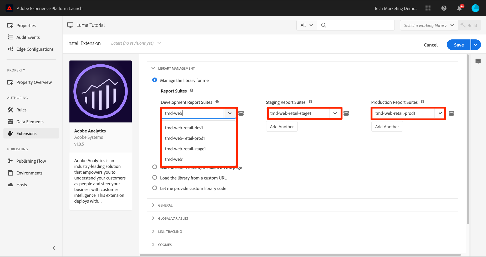
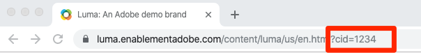

# Adobe Analytics toevoegen

In deze les, zult u uitvoeren [Adobe Analytics-extensie](https://experienceleague.adobe.com/docs/experience-platform/tags/extensions/adobe/analytics/overview.html) en regels maken om gegevens naar Adobe Analytics te verzenden.

[Adobe Analytics](https://experienceleague.adobe.com/docs/analytics.html) is een industrie-leidende oplossing die u machtigt om uw klanten als mensen te begrijpen en uw zaken met klantenintelligentie te sturen.

>[!NOTE]
>
>Adobe Experience Platform Launch wordt in Adobe Experience Platform geïntegreerd als een reeks technologieën voor gegevensverzameling. Verschillende terminologiewijzigingen zijn geïmplementeerd in de interface die u tijdens het gebruik van deze inhoud moet onthouden:
>
> * platform launch (clientzijde) is nu **[[!DNL tags]](https://experienceleague.adobe.com/docs/experience-platform/tags/home.html?lang=nl)**
> * platform launch Server-zijde is nu **[[!DNL event forwarding]](https://experienceleague.adobe.com/docs/experience-platform/tags/event-forwarding/overview.html)**
> * Edge-configuraties zijn nu **[[!DNL datastreams]](https://experienceleague.adobe.com/docs/experience-platform/edge/fundamentals/datastreams.html)**


## Leerdoelen

Aan het eind van deze les, zult u kunnen:

1. De Adobe Analytics-extensie toevoegen
1. Algemene variabelen instellen met de extensie
1. Het paginaweergavebaken toevoegen
1. Aanvullende variabelen toevoegen met regels
1. Kliktracering en andere op gebeurtenissen gebaseerde bakens toevoegen
1. Analyseplug-ins toevoegen

Er zijn veel dingen die voor Analytics in markeringen zouden kunnen worden uitgevoerd. Deze les is niet uitputtend, maar zou u een stevig overzicht van de belangrijkste technieken moeten geven u voor implementatie in uw eigen plaats zult vereisen.

## Vereisten

U had de lessen in [Tags configureren](create-a-property.md) en [Identiteitsservice toevoegen](id-service.md).

Daarnaast hebt u ten minste één rapportsuite-id en uw traceringsserver nodig. Als u geen test/dev- rapportreeks hebt die u voor dit leerprogramma kunt gebruiken, te creëren gelieve. Als u niet zeker weet hoe u dat moet doen, raadpleegt u [de documentatie](https://experienceleague.adobe.com/docs/analytics/admin/manage-report-suites/new-report-suite/new-report-suite.html). U kunt uw traceringsserver ophalen van uw huidige implementatie, Adobe Consultant of medewerker van de klantenservice.

## De extensie Analytics toevoegen

De extensie Analytics bestaat uit twee hoofdonderdelen:

1. De extensieconfiguratie, die de kernbibliotheekinstellingen van AppMeasurement.js beheert en algemene variabelen kan instellen
1. Handelingen van de regel om het volgende te doen:
   1. Variabelen instellen
   1. Variabelen wissen
   1. De Analysebaken verzenden

**De extensie Analytics toevoegen**

1. Ga naar **[!UICONTROL Extensions > Catalog]**
1. De Adobe Analytics-extensie zoeken
1. Klikken **[!UICONTROL Installeren]**

   

1. Onder [!UICONTROL Library Management > Report Suites], voert u de rapportsuite-id&#39;s in die u voor elke tagomgeving wilt gebruiken. Als uw gebruikers toegang hebben tot Adobe Analytics, merkt u op dat wanneer u begint in de doos te typen, u een vooraf ingevulde lijst van al uw rapportreeksen zult zien. (Het is oké om één rapportenreeks voor alle milieu&#39;s in dit leerprogramma te gebruiken, maar in echt zou u afzonderlijke rapportseries willen gebruiken, zoals aangetoond in hieronder beeld)

   

   >[!TIP]
   >
   >We raden u aan de [!UICONTROL De optie Bibliotheek voor mij beheren] als de [!UICONTROL Bibliotheekbeheer] het plaatsen aangezien het het veel gemakkelijker maakt om `AppMeasurement.js` actuele bibliotheek.

1. Onder [!UICONTROL Algemeen > Traceerserver], voert u uw trackingserver in, bijvoorbeeld `tmd.sc.omtrdc.net`. Voer uw SSL-traceringsserver in als uw site ondersteuning biedt `https://`

   

1. In de [!UICONTROL Sectie Algemene variabelen], onder [!UICONTROL Aanvullende instellingen]stelt u de [!UICONTROL Paginanaam] variabele die uw `Page Name` gegevenselement. Klik op de knop  pictogram om het modaal te openen en de pagina te kiezen `Page Name` gegevenselement)

1. Klikken **[!UICONTROL Opslaan in bibliotheek]**

   

>[!NOTE]
>
>Globale variabelen kunnen in de uitbreidingsconfiguratie of in regelacties worden geplaatst. Houd er rekening mee dat bij het instellen van variabelen in de extensieconfiguratie de gegevenslaag moet worden gedefinieerd *voor* de code voor het insluiten van tags.

## De Paginaweergavebaken verzenden

Nu zult u een regel creëren om het baken van Analytics in brand te steken, dat zal verzenden [!UICONTROL Paginanaam] variabele ingesteld in de extensieconfiguratie.

U hebt al een regel &quot;Alle pagina&#39;s - Bibliotheek geladen&quot; gemaakt in het dialoogvenster [Een gegevenselement, een regel en een bibliotheek toevoegen](add-data-elements-rules.md) les van deze zelfstudie, die op elke pagina wordt geactiveerd wanneer de tagbibliotheek wordt geladen. U *kon* gebruik deze regel ook voor Analytics, nochtans vereist deze opstelling alle attributen van de gegevenslaag die in het baken van de Analyse worden gebruikt worden bepaald vóór de markering inbedt codes. Om meer flexibiliteit met de gegevensinzameling toe te staan, zult u een nieuwe &quot;alle pagina&#39;s&quot;regel tot stand brengen die op DOM Klaar wordt teweeggebracht om het baken van de Analyse in brand te steken.

**Het paginaweergavebaken verzenden**

1. Ga naar de **[!UICONTROL Regels]** in de linkernavigatie en klik vervolgens op **[!UICONTROL Regel toevoegen]**

   

1. Naam van de regel `All Pages - DOM Ready`
1. Klikken **[!UICONTROL Gebeurtenissen > Toevoegen]** om de `Event Configuration` scherm

   

1. Selecteren **[!UICONTROL Type gebeurtenis > gereed voor DOM]** (Merk op dat de orde van de regel &quot;50&quot;is)
1. Klikken **[!UICONTROL Wijzigingen behouden]**
   

1. Klik onder Handelingen op de knop  om een nieuwe handeling toe te voegen

   

1. Selecteren **[!UICONTROL Extension > Adobe Analytics]**

1. Selecteren **[!UICONTROL Action Type > Send Beacon]**

1. Tekstspatiëring instellen op `s.t()`. Als u een `s.tl()` de vraag in een klik-gebeurtenis regel kon u dat doen gebruikend de Send actie van het Baken, eveneens.

1. Klik op de knop **[!UICONTROL Wijzigingen behouden]** knop

   

1. Klikken **[!UICONTROL Opslaan in bibliotheek en samenstellen]**

   

### Valideer het Paginaweergavebaken

Nu u een regel hebt gecreeerd om een baken van Analytics te verzenden, zou u het verzoek in de Experience Cloud Debugger moeten kunnen zien.

1. Open de [Luminantiesite](https://luma.enablementadobe.com/content/luma/us/en.html) in uw Chrome-browser
1. Klik op het pictogram Foutopsporing  om de **[!UICONTROL Adobe Experience Cloud Debugger]**
1. Controleer of Foutopsporing de eigenschap tag toewijst aan *uw* Ontwikkelomgeving, zoals beschreven in de [eerdere les](switch-environments.md)

   

1. Klik om het tabblad Analyse te openen
1. Breid uw naam van de Reeks van het Rapport uit om alle verzoeken te tonen die aan het worden gemaakt
1. Bevestig dat het verzoek is geactiveerd met de variabele en de waarde van de paginanaam

   

>[!NOTE]
>
>Als de paginanaam niet voor u verschijnt, ga terug door de stappen in deze pagina om ervoor te zorgen dat u niets hebt gemist.

## Variabelen toevoegen met regels

Wanneer u de extensie Analytics hebt geconfigureerd, hebt u de `pageName` variabele in de extensieconfiguratie. Dit is een fijne locatie voor het vullen van andere algemene variabelen, zoals eVars en props, mits de waarde beschikbaar is op de pagina voordat de code voor het insluiten van tags wordt geladen.

Een flexibelere locatie voor het instellen van variabelen, maar ook van gebeurtenissen, is in regels die `Set Variables` handeling. Met regels kunt u verschillende analytische variabelen en gebeurtenissen onder verschillende omstandigheden instellen. U kunt bijvoorbeeld de opdracht `prodView` alleen op pagina&#39;s met productdetails en de `purchase` alleen gebeurtenis op pagina&#39;s voor bevestiging van bestelling. Deze sectie zal u leren hoe te om variabelen te plaatsen gebruikend regels.

### Gebruiksscenario

De Pagina&#39;s van het Detail van het product (PDP) zijn belangrijke punten voor gegevensinzameling op detailhandelsplaatsen. Doorgaans wilt u dat Analytics registreert dat een productweergave heeft plaatsgevonden en welk product is weergegeven. Dit is handig om te begrijpen welke producten populair zijn bij uw klanten. Op een mediasite kunnen artikel- of videopagina&#39;s soortgelijke volgtechnieken gebruiken als in deze sectie.  Wanneer u een pagina met productdetails laadt, kunt u die waarde in een &quot;Paginatype&quot; plaatsen `eVar`en stelt een aantal gebeurtenissen en de product-id in. Op die manier kunnen we in onze analyse het volgende zien:

1. Hoeveel keer productdetailpagina&#39;s worden geladen
1. Welke specifieke producten worden weergegeven en hoe vaak?
1. Welke andere factoren (campagnes, onderzoek, enz.) beïnvloeden hoeveel PDP&#39;s mensen laden

### Gegevenselement maken voor paginatype

Eerst moet u identificeren welke pagina&#39;s de pagina&#39;s van het Detail van het Product zijn. Dat gaat u doen met een gegevenselement.

**Het gegevenselement voor paginatype maken**

1. Klikken **[!UICONTROL Gegevenselementen]** in de linkernavigatie
1. Klikken **[!UICONTROL Gegevenselement toevoegen]**

   

1. Geef het gegevenselement een naam `Page Type`
1. Selecteren **[!UICONTROL Type gegevenselement > JavaScript-variabele]**
1. Gebruiken `digitalData.page.category.type` als de **[!UICONTROL JavaScript variabelenaam]**
1. Controleer de **[!UICONTROL Tekst opschonen]** en **[!UICONTROL Kleine letters forceren]** opties
1. Klikken **[!UICONTROL Opslaan in bibliotheek]**

   

### Gegevenselement maken voor product-id

Vervolgens verzamelt u de product-id van de huidige productdetailpagina met een gegevenselement

**Het gegevenselement voor de product-id maken**

1. Klikken **[!UICONTROL Gegevenselementen]** in de linkernavigatie
1. Klikken **[!UICONTROL Gegevenselement toevoegen]**

   

1. Geef het gegevenselement een naam `Product Id`
1. Selecteren **[!UICONTROL Type gegevenselement > JavaScript-variabele]**
1. Gebruiken `digitalData.product.0.productInfo.sku` als de **[!UICONTROL JavaScript variabelenaam]**
1. Controleer de **[!UICONTROL Tekst opschonen]** en **[!UICONTROL Kleine letters forceren]** opties
1. Klikken **[!UICONTROL Opslaan in bibliotheek]**

   

### De extensie Adobe Analytics-productreeks toevoegen

Als u al bekend bent met Adobe Analytics-implementaties, bent u waarschijnlijk bekend met de [productvariabele](https://experienceleague.adobe.com/docs/analytics/implementation/vars/page-vars/products.html). De productvariabele heeft een zeer specifieke syntaxis en wordt gebruikt lichtjes verschillende manieren afhankelijk van de context. Om de populatie van de productvariabele in markeringen gemakkelijker te maken, zijn drie extra uitbreidingen reeds gecreeerd in de markt van de marktextensie! In deze sectie voegt u een extensie toe die door Adobe Consulting is gemaakt en die op de pagina Productdetails kan worden gebruikt.

**Om toe te voegen voeg toe `Adobe Analytics Product String` extension**

1. Ga naar de [!UICONTROL Extensions > Catalog] page
1. Zoek de `Adobe Analytics Product String` extensie door Adobe Consulting Services en klik op **[!UICONTROL Installeren]**
   
1. Neem even de tijd om de instructies te lezen
1. Klikken **[!UICONTROL Opslaan in bibliotheek]**

   

### De regel voor productdetailpagina&#39;s maken

Nu, zult u uw nieuwe gegevenselementen en uitbreiding gebruiken om uw de paginalijn van het Detail van het Product te bouwen. Voor deze functionaliteit, zult u een andere regel van de paginading creëren, die door DOM Klaar wordt teweeggebracht. U gebruikt echter een voorwaarde, zodat deze alleen wordt geactiveerd op de pagina&#39;s met productdetails en de volgorde, zodat deze worden geactiveerd _voor_ de regel die het baken verzendt.

**De paginalijn Productdetails samenstellen**

1. Ga naar de **[!UICONTROL Regels]** in de linkernavigatie en klik vervolgens op **[!UICONTROL Regel toevoegen]**

   

1. Naam van de regel `Product Details - DOM Ready - 40`
1. Klikken **[!UICONTROL Gebeurtenissen > Toevoegen]** om de `Event Configuration` scherm

   

1. Selecteren **[!UICONTROL Type gebeurtenis > gereed voor DOM]**
1. Stel de **[!UICONTROL Volgorde]** tot 40, zodat de regel wordt uitgevoerd *voor* de regel met de handeling Analytics > Send Beacon
1. Klikken **[!UICONTROL Wijzigingen behouden]**

   

1. Onder **[!UICONTROL Voorwaarden]** klikt u op de knop  om de `Condition Configuration` scherm
   

   1. Selecteren **[!UICONTROL Condition Type > Value Comparison]**
   1. Gebruik de kiezer voor gegevenselementen en kies `Page Type` in het eerste veld
   1. Selecteren  **[!UICONTROL Bevat]** van de vergelijkingsoperator dropdown
   1. In het volgende veldtype `product-page` (Dit is het unieke deel van de waarde van het paginatype dat uit de gegevenslaag op PDP&#39;s wordt getrokken)
   1. Klikken **[!UICONTROL Wijzigingen behouden]**

      

1. Klik onder Handelingen op de knop  om een nieuwe handeling toe te voegen

   

1. Selecteren **[!UICONTROL Extension > Adobe Analytics Product String]**
1. Selecteren **[!UICONTROL Type handeling > S.products instellen]**

1. In de **[!UICONTROL E-commercegebeurtenis Analytics]** sectie, selecteert u **[!UICONTROL prodView]**

1. In de **[!UICONTROL Gegevenslaagvariabelen voor productgegevens]** de sectie, gebruik de plukker van het Element van Gegevens om te kiezen `Product Id` gegevenselement

1. Klikken **[!UICONTROL Wijzigingen behouden]**

   


1. Klik onder Handelingen op de knop  om een nieuwe handeling toe te voegen

   

1. Selecteren **[!UICONTROL Extension > Adobe Analytics]**
1. Selecteren **[!UICONTROL Handelingstype > Variabelen instellen]**
1. Selecteren **[!UICONTROL eVar1 > Instellen als]** en betreden `product detail page`
1. Set **[!UICONTROL event1]**, waarbij de optionele waarden leeg blijven
1. Klik onder Gebeurtenissen op de knop **[!UICONTROL Nog een toevoegen]** knop
1. Stel de **[!UICONTROL prodView]** gebeurtenis, waarbij de optionele waarden leeg blijven
1. Klikken **[!UICONTROL Wijzigingen behouden]**

   

1. Klikken **[!UICONTROL Opslaan in bibliotheek en samenstellen]**

   

### De gegevens van de productdetailpagina valideren

U hebt zojuist een regel gemaakt die variabelen instelt voordat het baken wordt verzonden. Je moet nu de nieuwe gegevens kunnen zien verschijnen in de hit in de Experience Cloud Debugger.

**De gegevens van de pagina Productdetails valideren**

1. Open de [Luminantiesite](https://luma.enablementadobe.com/content/luma/us/en.html) in uw Chrome-browser
1. Naar een pagina met productdetails navigeren
1. Klik op het pictogram Foutopsporing  om uw **[!UICONTROL Adobe Experience Cloud Debugger]**
1. Klik op het tabblad Analyse
1. Uw rapportsuite uitbreiden
1. Merk de Variabelen van het Detail van het Product op die nu in debugger zijn, namelijk dat `eVar1` is ingesteld op &quot;pagina met productdetails&quot;, die `Events` variabele is ingesteld op &quot;event1&quot; en &quot;prodView&quot;, dat de productvariabele is ingesteld met de product-id van het product dat u bekijkt en dat de paginanaam nog steeds is ingesteld met de extensie Analytics

   

## Verstuur een baken van de Verbinding van het Spoor

Wanneer een pagina wordt geladen, wordt doorgaans een baken voor het laden van de pagina geactiveerd dat wordt geactiveerd door de `s.t()` functie. Dit neemt automatisch toe als `page view` metrisch voor de pagina die in `pageName` variabele.

Soms wilt u echter de paginaweergaven op uw site niet vergroten, omdat de actie die wordt uitgevoerd &#39;kleiner&#39; (of misschien gewoon anders) is dan de paginaweergave. In dit geval gebruikt u de opdracht `s.tl()` functie, die algemeen als &quot;spoorverbinding&quot;verzoek wordt bedoeld. Hoewel het als verzoek van de spoorverbinding wordt bedoeld, moet het niet op een verbindingsklik worden teweeggebracht. Het kan worden geactiveerd door *alle* van de gebeurtenissen die voor u beschikbaar zijn in de bouwer van de markeringsregel, met inbegrip van uw eigen douane JavaScript.

In deze zelfstudie activeert u een `s.tl()` aanroepen met een van de oudste JavaScript-gebeurtenissen, en `Enters Viewport` gebeurtenis.

### Het hoofdlettergebruik

In dit geval wilt u weten of mensen ver genoeg naar beneden schuiven op de startpagina van de Luma om de *Aanbevolen producten* van onze pagina. Er is wat interne onenigheid in ons bedrijf over of mensen die sectie zelfs zien of niet, zodat wilt u Analytics gebruiken om de waarheid te bepalen.

### De regel in tags maken

1. Ga naar de **[!UICONTROL Regels]** in de linkernavigatie en klik vervolgens op **[!UICONTROL Regel toevoegen]**

   
1. Naam van de regel `Homepage - Featured Products enters Viewport`
1. Klikken **[!UICONTROL Gebeurtenissen > Toevoegen]** om de `Event Configuration` scherm

   

1. Selecteren **[!UICONTROL Event Type > Enters View]**. Hiermee wordt een veld weergegeven waarin u de CSS-kiezer moet invoeren die het item op de pagina identificeert dat de regel moet activeren wanneer deze in de browser wordt weergegeven.
1. Ga terug naar de startpagina van Luma en blader omlaag naar de sectie Aanbevolen producten.
1. Klik met de rechtermuisknop op de ruimte tussen de titel &quot;FEATURED PRODUCTS&quot; en de items in deze sectie en selecteer `Inspect` in het snelmenu. Hierdoor komt u dicht bij wat u wilt.
1. Hier, mogelijk direct onder de geselecteerde sectie, zoekt u een div met `class="we-productgrid aem-GridColumn aem-GridColumn--default--12"`. Zoek dit element.
1. Klik met de rechtermuisknop op dit element en selecteer **[!UICONTROL Kopiëren > Selectie kopiëren]**

   

1. Ga terug naar labels en plak deze waarde van het klembord in het veld met het label `Elements matching the CSS selector`.
   1. Aan de zijkant bepaalt u hoe CSS-kiezers worden geïdentificeerd. Deze methode is een beetje kwetsbaar, aangezien bepaalde wijzigingen op de pagina deze kiezer kunnen onderbreken. Houd hier rekening mee wanneer u CSS-kiezers in tags gebruikt.
1. Klikken **[!UICONTROL Wijzigingen behouden]**

   

1. Klik onder Voorwaarden op de knop  om een nieuwe voorwaarde toe te voegen
1. Selecteren **[!UICONTROL Condition Type > Value Comparison]**
1. Gebruik de kiezer voor gegevenselementen en kies `Page Name` in het eerste veld
1. Selecteren  **[!UICONTROL Gelijk]** van de vergelijkingsoperator dropdown
1. In het volgende veldtype `content:luma:us:en` (Dit is de paginanaam van de homepage zoals getrokken uit de gegevenslaag - wij willen slechts deze regel op de homepage lopen)
1. Klikken **[!UICONTROL Wijzigingen behouden]**

   

1. Klik onder Handelingen op de knop  om een nieuwe handeling toe te voegen
1. Selecteren **[!UICONTROL Extension > Adobe Analytics]**
1. Selecteren **[!UICONTROL Handelingstype > Variabelen instellen]**
1. Set `eVar3` tot `Home Page - Featured Products`
1. Set `prop3` tot `Home Page - Featured Products`
1. Stel de `Events` variabele tot `event3`
1. Klikken **[!UICONTROL Wijzigingen behouden]**

   

1. Klik onder Handelingen op de knop  om een nieuwe handeling toe te voegen

1. Selecteren **[!UICONTROL Extension > Adobe Analytics]**
1. Selecteren **[!UICONTROL Action Type > Send Beacon]**
1. Kies de optie **[!UICONTROL `s.tl()`]** tracking, optie
1. In de **[!UICONTROL Koppelingsnaam]** veld, Enter `Scrolled down to Featured Products`. Deze waarde wordt in het rapport Aangepaste koppelingen in Analytics geplaatst.
1. Klikken **[!UICONTROL Wijzigingen behouden]**

   

1. Klikken **[!UICONTROL Opslaan in bibliotheek en samenstellen]**

   

### Valideer het baken van de Verbinding van het Spoor

Nu wilt u ervoor zorgen dat deze hit wordt weergegeven wanneer u naar de sectie Aanbevolen producten op de startpagina van onze site schuift. Wanneer u de startpagina laadt, moet het verzoek niet worden gedaan, maar wanneer u omlaag schuift en de sectie in beeld komt, moet de treffer met onze nieuwe waarden branden.

1. Open de [Luminantiesite](https://luma.enablementadobe.com/content/luma/us/en.html) in uw browser van Chrome en zorg ervoor u bij de bovenkant van de homepage bent.
1. Klik op de knop **[!UICONTROL foutopsporingspictogram]**  om uw [!UICONTROL Adobe Experience Cloud Debugger]
1. Klik op het tabblad Analyse
1. De hit van de rapportsuite uitvouwen
1. U ziet dat de normale paginaweergave is geactiveerd voor de startpagina met de paginanaam, enz. (maar niets in eVar3 of prop3).

   

1. Als u Foutopsporing geopend laat, schuift u omlaag op uw site totdat u de sectie Aanbevolen producten kunt zien
1. Bekijk de foutopsporing opnieuw en er had nog een hit voor Analytics moeten verschijnen. Bij deze hit moeten de params gekoppeld zijn aan de s.tl() hit die u hebt ingesteld, namelijk:
   1. `LinkType = "link_o"` (Dit betekent dat de hit een aangepaste koppelingshit is, geen treffer voor de paginaweergave)
   1. `LinkName = "Scrolled down to Featured Products"`
   1. `prop3 = "Home Page - Featured Products"`
   1. `eVar3 = "Home Page - Featured Products"`
   1. `Events = "event3"`

      

## Een plug-in toevoegen

Een plug-in is een stuk JavaScript-code dat u aan de implementatie kunt toevoegen om een specifieke functie uit te voeren die niet in het product is ingebouwd. Plug-ins kunnen door u, door andere Adobe Klanten/Partners, of door Adobe Consulting worden gebouwd.

Voor het implementeren van plug-ins zijn er drie stappen:

1. Neem de functie doPlugins op, waar naar de plug-in wordt verwezen
1. De hoofdfunctiecode voor de plug-in toevoegen
1. Neem de code op die de functie aanroept en variabelen instelt, enz.

### Het object Analytics algemeen toegankelijk maken

Als u de functie doPlugins (hieronder) toevoegt en stop-ins gebruikt, moet u een doos controleren om het voorwerp van Analytics &quot;s&quot;globaal in de implementatie van Analytics ter ter beschikking te stellen.

1. Ga naar **[!UICONTROL Extensies > Geïnstalleerd]**

1. Klik in de extensie Adobe Analytics op **[!UICONTROL Configureren]**

   

1. Onder **[!UICONTROL Bibliotheekbeheer]** selecteert u het vak met het label `Make tracker globally accessible`. Zoals u in de Help bubble kunt zien, zal dit volgen globaal onder window.s worden behandeld, wat belangrijk zal zijn aangezien u naar het in uw klant JavaScript verwijst.
   

### Inclusief de functie doPlugins

Als u plug-ins wilt toevoegen, moet u een functie met de naam doPlugins toevoegen. Deze functie wordt niet standaard toegevoegd, maar wordt na toevoeging afgehandeld door de AppMeturement-bibliotheek en wordt als laatste aangeroepen wanneer een hit naar Adobe Analytics wordt verzonden. Daarom kunt u deze functie gebruiken om JavaScript uit te voeren om variabelen te plaatsen die gemakkelijker op deze manier worden geplaatst.

1. Schuif omlaag en vouw de sectie met de titel terwijl u in de extensie Analytics blijft staan `Configure Tracker Using Custom Code.`
1. Klikken **[!UICONTROL Editor openen]**
1. Plak de volgende code in de code-editor:

   ```javascript
   /* Plugin Config */
   s.usePlugins=true
   s.doPlugins=function(s) {
   /* Add calls to plugins here */
   }
   ```

1. Dit venster openhouden voor de volgende stap

### Functiecode toevoegen voor de plug-in

U gaat eigenlijk twee stop-ins in deze code roepen, maar één van hen wordt ingebouwd in de bibliotheek AppMeasurement, zodat die u niet de te roepen functie moet toevoegen. Voor de tweede functie moet u echter ook de functiecode toevoegen. Deze functie wordt getValOnce() genoemd.

### De getValOnce()-plug-in

Het doel van deze plug-in is om te voorkomen dat waarden onjuist worden gedupliceerd in de code wanneer een bezoeker een pagina vernieuwt of de knop Vorige van de browser gebruikt om terug te gaan naar een pagina waarop een waarde is ingesteld. In deze les, zult u het gebruiken om het te houden `clickthrough` -gebeurtenis worden gedupliceerd.

De code voor deze plug-in is beschikbaar in het dialoogvenster [Analytische documentatie](https://experienceleague.adobe.com/docs/analytics/implementation/vars/plugins/getvalonce.html), maar deze is hier opgenomen voor uw gemak van kopiëren en plakken.

1. De volgende code kopiëren

   ```javascript
   /* Adobe Consulting Plugin: getValOnce v2.01 */
   s.getValOnce=function(vtc,cn,et,ep){if(vtc&&(cn=cn||"s_gvo",et=et||0,ep="m"===ep?6E4:864E5,vtc!==this.c_r(cn))){var e=new Date;e.setTime(e.getTime()+et*ep);this.c_w(cn,vtc,0===et?0:e);return vtc}return""};
   ```

1. Plak het in het codevenster in de uitbreiding Analytics (als u het nog niet hebt geopend, open het zoals in de vorige stap) opnieuw, **volledig onder** de doPlugins functie (niet binnen het).

   

U kunt deze plug-in nu aanroepen vanuit doPlugins.

### Insteekmodules aanroepen vanuit doPlugins

Nu de code daar is en kan worden van verwijzingen voorzien, kunt u de vraag aan stop-ins binnen de doPlugins functie maken.

Eerst roept u een insteekmodule aan die is opgenomen in de AppMeasurement-bibliotheek en dus ook wel een &quot;hulpprogramma&quot; wordt genoemd. Het wordt `s.Util.getQueryParam`, omdat het deel van het voorwerp s uitmaakt, is een ingebouwd nut, en zal waarden (die op een parameter worden gebaseerd) van het vraagkoord in URL grijpen.

1. Kopieer de volgende code:

   ```javascript
   s.campaign = s.Util.getQueryParam("cid");
   ```

1. Plak het in de functie doPlugins. Hiermee wordt gezocht naar een parameter met de naam `cid` in de huidige pagina URL en plaats het in de s.campagne variabele.
1. Roep nu de functie getValOnce door de volgende code te kopiëren en het te kleven in recht onder de vraag aan getQueryParam:

   ```javascript
   s.campaign=s.getValOnce(s.campaign,'s_cmp',30);
   ```

   Deze code zorgt ervoor dat dezelfde waarde gedurende 30 dagen niet meer dan één keer per rij wordt verzonden (zie de documentatie voor manieren om deze code aan uw behoeften aan te passen).

   

1. Het codevenster opslaan
1. Klikken **[!UICONTROL Opslaan in bibliotheek en samenstellen]**

   

### De plug-ins valideren

Nu kunt u ervoor zorgen dat de plug-ins werken.

**De insteekmodules valideren**

1. Open de [Luminantiesite](https://luma.enablementadobe.com/content/luma/us/en.html) in uw Chrome-browser
1. Klik op het pictogram Foutopsporing  om de **[!UICONTROL Adobe Experience Cloud Debugger]**
1. Klik op het tabblad Analyse
1. Uw rapportsuite uitbreiden
1. Let op: de treffer voor Analytics heeft geen variabele Campagne
1. Als u Foutopsporing geopend laat, gaat u terug naar de site Luma en voegt u  `?cid=1234` naar de URL en kies Enter om de pagina te vernieuwen met de querytekenreeks die u wilt invoeren

   

1. Controleer Foutopsporing en bevestig dat er een tweede verzoek Analytics is met een variabele van de Campagne die aan wordt geplaatst `1234`

   

1. Ga terug en vernieuw de pagina Luma opnieuw, met het vraagkoord nog in URL
1. Controleer de volgende treffer in Debugger, en de variabele van de Campagne zou moeten **niet** aanwezig zijn, omdat de getValOnce stop-in ervoor heeft gezorgd dat het niet wordt gedupliceerd en kijkt als een andere persoon binnen van de campagne volgende code kwam.

   

1. BONUS: U kunt dit telkens opnieuw testen door de waarde van de optie `cid` in de queryreeks. De variabele Campagne mag er alleen zijn als het de **first** als u de pagina met de waarde uitvoert. Als u niet de waarde van de Campagne in debugger ziet, verander eenvoudig de waarde van `cid` in het vraagkoord van URL, druk binnengaan, en u zou het opnieuw in debugger moeten zien.

   >[!NOTE]
   >
   >Er zijn eigenlijk een paar verschillende manieren om een parameter uit het vraagkoord van URL, met inbegrip van in de de uitbreidingsconfiguratie van Analytics te pakken. In deze andere niet-plug-inopties bieden ze echter niet de mogelijkheid om onnodige duplicatie te stoppen, zoals u hier hebt gedaan met de getValOnce-plug-in. Dit is de favoriete methode van de auteur, maar u zou moeten bepalen welke methode het beste voor u en uw behoeften werkt.

Mooi werk! U hebt de les Analytics voltooid. Natuurlijk zijn er veel andere dingen die u kunt doen om onze analytische implementatie te verbeteren, maar hopelijk heeft dit u een aantal van de kernvaardigheden gegeven om de rest van uw behoeften aan te pakken.

[Volgende &quot;Adobe Audience Manager toevoegen&quot; >](audience-manager.md)
