# Adobe Audience Manager toevoegen

Deze les zal u door de stappen begeleiden om Adobe Audience Manager toe te laten gebruikend Server-kant Door:sturen.

[&#x200B; Adobe Audience Manager &#x200B;](https://experienceleague.adobe.com/docs/audience-manager/user-guide/aam-home.html?lang=nl-NL) (AAM) verleent de industrie-leidende diensten voor online beheer van publieksgegevens, die digitale adverteerders en uitgevers de hulpmiddelen geven die zij hebben moeten controleren en hefboomwerking hun gegevensactiva helpen verkoopsucces drijven.

>[!WARNING]
>
> Deze zelfstudie en de bijbehorende Luma-website-oefeningen blijven niet meer behouden en zijn afhankelijk van oudere JavaScript-bibliotheken. Om de huidige beste praktijken te leren, te gebruiken gelieve [&#x200B; Adobe Experience Cloud met het leerprogramma van SDK van het Web uit te voeren &#x200B;](https://experienceleague.adobe.com/nl/docs/platform-learn/implement-web-sdk/overview).

## Leerdoelen

Aan het eind van deze les, zult u kunnen:

1. Beschrijf de twee belangrijkste manieren om Audience Manager in een website te implementeren
1. Audience Manager toevoegen met Server-Side Forwarding van het Analytics-baken
1. De Audience Manager-implementatie valideren

## Vereisten

Om deze les te voltooien, zult u nodig hebben:

1. Om de lessen in [&#x200B; te hebben voltooid vormen markeringen &#x200B;](create-a-property.md), [&#x200B; voeg Adobe Analytics &#x200B;](analytics.md) toe, en [&#x200B; voeg de Dienst van de Identiteit toe &#x200B;](id-service.md).

1. Beheerders hebben toegang tot Adobe Analytics, zodat u Server-Side Forwarding kunt inschakelen voor de rapportsuite die u voor deze zelfstudie gebruikt. U kunt ook een bestaande beheerder van uw organisatie vragen dit voor u te doen, volgens de onderstaande instructies.

1. Uw &quot;Subdomain van Audience Manager&quot; (ook wel bekend als de &quot;Partner-id&quot; of &quot;Partner Subdomain&quot;). Als Audience Manager al op uw eigen website is geïmplementeerd, kunt u dit het gemakkelijkst verkrijgen door naar uw eigen website te gaan en Foutopsporing te openen. Het subdomein is beschikbaar op het tabblad Overzicht in de sectie Audience Manager:

   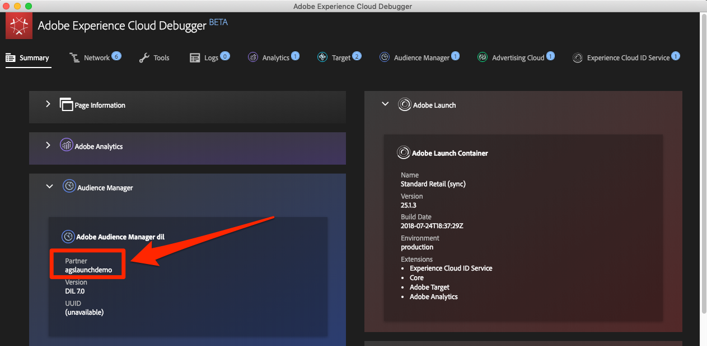

Als u Audience Manager niet reeds hebt uitgevoerd, volg deze instructies om [&#x200B; uw Subdomain van Audience Manager &#x200B;](https://experienceleague.adobe.com/docs/audience-manager-learn/tutorials/web-implementation/how-to-identify-your-partner-id-or-subdomain.html?lang=nl-NL) te verkrijgen.

## Implementatieopties

Er zijn twee manieren om Audience Manager in een website te implementeren:

* **Server-zij Door:sturen (SSF)** - voor klanten met Adobe Analytics, is dit de gemakkelijkste en geadviseerde manier om uit te voeren. Adobe Analytics stuurt gegevens door naar AAM op Adobe-back-end, zodat er nog maar één aanvraag op de pagina kan worden ingediend. Dit maakt ook belangrijke integratiefuncties mogelijk en voldoet aan onze best practices voor de implementatie en implementatie van Audience Manager-code.

* **client-kant DIL** - deze benadering is voor klanten die geen Adobe Analytics hebben. DIL-code (Data Integration Library Code, de AAM JavaScript-configuratiecode) verzendt gegevens rechtstreeks van de webpagina naar Audience Manager.

Aangezien u Adobe Analytics al in deze zelfstudie hebt geïmplementeerd, implementeert u Audience Manager met Server-Side Forwarding. Voor een volledige beschrijving en vereisten lijst voor server-zij het door:sturen, te herzien gelieve de [&#x200B; documentatie &#x200B;](https://experienceleague.adobe.com/docs/analytics/admin/admin-tools/server-side-forwarding/ssf.html?lang=nl-NL), zodat u met vertrouwd bent hoe het werkt, wat wordt vereist, en hoe te bevestigen.

## Server-Side Forwarding inschakelen

Er zijn twee belangrijke stappen bij het uitvoeren van een SSF-implementatie:

1. Het aanzetten van een &quot;schakelaar&quot;in Analytics Admin Console om gegevens van Analytics aan Audience Manager *per rapportreeks* door:sturen.
1. De code plaatsen, wat gebeurt via tags. Opdat dit correct werkt, zult u de uitbreiding van de Dienst van de Identiteit van Adobe Experience Platform moeten hebben geïnstalleerd, evenals de uitbreiding van Analytics (u ** zult eigenlijk niet de uitbreiding van AAM nodig hebben, die hieronder wordt verklaard).

### Server-Side Forwarding inschakelen in de Analytics Admin Console

Een configuratie in Adobe Analytics Admin Console is vereist om gegevens van Adobe Analytics naar Adobe Audience Manager door te sturen. Aangezien het tot vier uren kan duren beginnen de gegevens door:sturen, zou u deze stap eerst moeten doen.

#### SSF inschakelen in de Analytics Admin Console

1. Meld u aan bij Analytics via de gebruikersinterface van Experience Cloud. Als u geen beheerdersrechten hebt voor Analytics, moet u contact opnemen met uw Experience Cloud- of analysebeheerder om toegang toe te wijzen aan u of deze stappen voor u uit te voeren.

   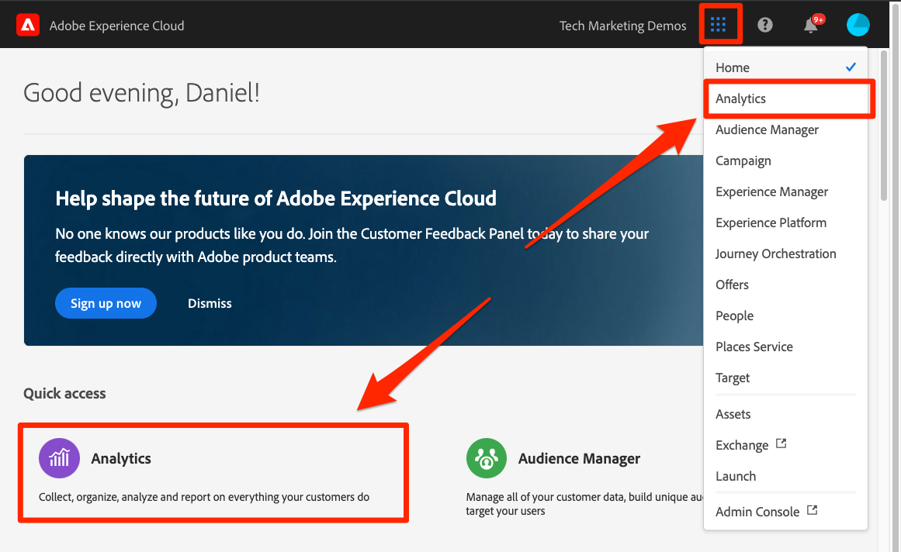

1. Kies in de bovenste navigatie in Analytics de optie **[!UICONTROL Admin > Report Suites]** en selecteer in de lijst de rapportsuite(s) die u naar Audience Manager wilt doorsturen (multi-select).

   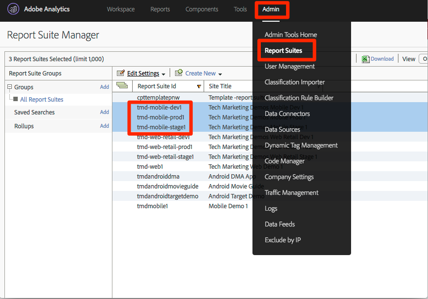

1. Kies **[!UICONTROL Edit Settings > General > Server-Side Forwarding]** in het scherm Rapportsets en met de rapportsuite(s) geselecteerd.

   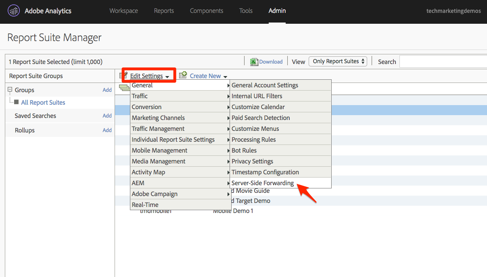

   >[!WARNING]
   >
   >Zoals hierboven vermeld, hebt u beheerdersrechten nodig om dit menu-item te kunnen zien.

1. Eenmaal op de pagina Server-Side Forwarding, leest u de informatie en schakelt u het selectievakje **[!UICONTROL Enable Server-Side Forwarding]** in voor de rapportsuite(s).

1. Klikken **[!UICONTROL Save]**

   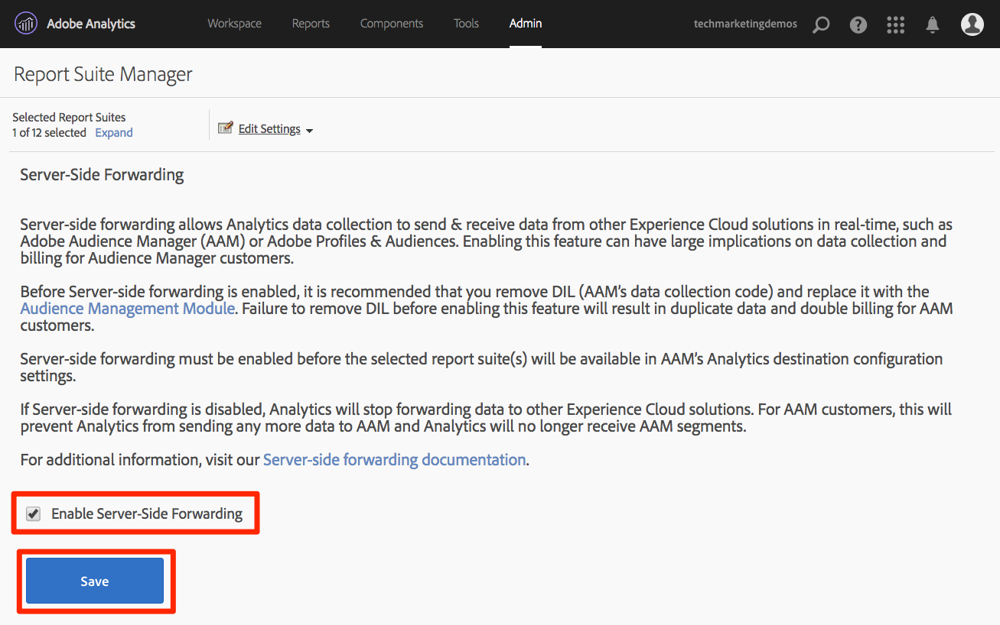

>[!NOTE]
>
>Aangezien SSF per rapportreeks moet worden toegelaten, vergeet niet deze stap voor uw echte rapportreeksen te herhalen wanneer u SSF op uw daadwerkelijke het rapportreeks van de plaats opstelt.
>
>Als de SSF-optie grijs wordt weergegeven, moet u ook de rapportsuite(s) toewijzen aan uw Experience Cloud-organisatie om deze optie in te schakelen. Dit wordt verklaard in [&#x200B; de documentatie &#x200B;](https://experienceleague.adobe.com/docs/analytics/admin/data-governance/gdpr-view-settings.html?lang=nl-NL).

Als deze stap is voltooid en u de Adobe Experience Platform Identity Service hebt ingeschakeld, worden de gegevens doorgestuurd van Analytics naar AAM. Als u het proces echter wilt voltooien, zodat de reactie correct terugkomt van AAM naar de pagina (en ook naar Analytics via de Audience Analytics-functie), moet u ook de volgende stap in de tags uitvoeren. Maak je geen zorgen, het is supergemakkelijk.

### Server-Side Forwarding inschakelen in tags

Dit is de tweede van twee stappen om SSF toe te laten. U hebt de switch al gespiegeld in de Analytics Admin Console en nu hoeft u alleen maar de code toe te voegen die voor u wordt gebruikt als u gewoon het juiste selectievakje inschakelt.

>[!NOTE]
>
>Om server-zij het Door:sturen van de gegevens van Analytics in AAM uit te voeren, zullen wij eigenlijk de uitbreiding van Analytics in markeringen uitgeven/vormen, **niet** de uitbreiding van AAM. De extensie AAM wordt uitsluitend gebruikt voor DIL-implementaties aan de clientzijde, voor gebruikers die geen Adobe Analytics hebben. De volgende stappen zijn dus correct wanneer u deze instelt in de extensie Analytics.

#### SSF inschakelen in tags

1. Ga naar **[!UICONTROL Extensions > Installed]** en klik om de extensie Analytics te configureren.

   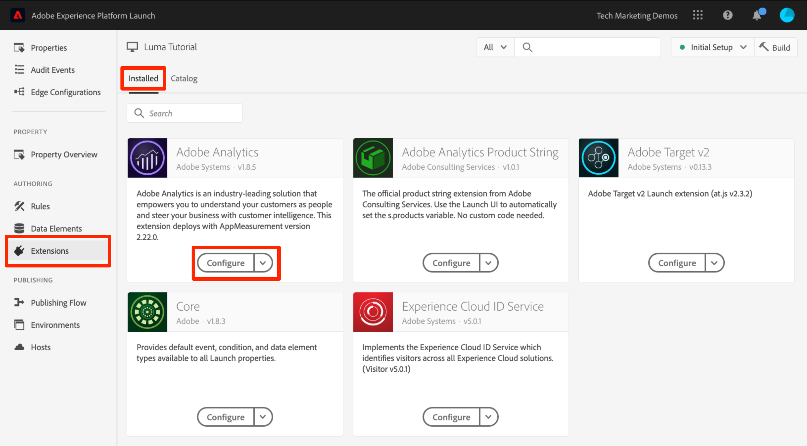

1. De sectie `Adobe Audience Manager` uitbreiden

1. Schakel het selectievakje in op **[!UICONTROL Automatically share Analytics Data with Audience Manager]** . Hiermee voegt u de Audience Manager &quot;Module&quot; (code) toe aan de Analytics `AppMeasurement.js` -implementatie.

1. Voeg uw &quot;Subdomain van Audience Manager&quot;toe (die ook als &quot;de Naam van de Partner,&quot;identiteitskaart van de Partner,&quot;of &quot;Subdomain van de Partner wordt bekend&quot;). Volg deze instructies om [&#x200B; uw Subdomain van Audience Manager &#x200B;](https://experienceleague.adobe.com/docs/audience-manager-learn/tutorials/web-implementation/how-to-identify-your-partner-id-or-subdomain.html?lang=nl-NL) te verkrijgen.

1. Klikken **[!UICONTROL Save to Library and Build]**

   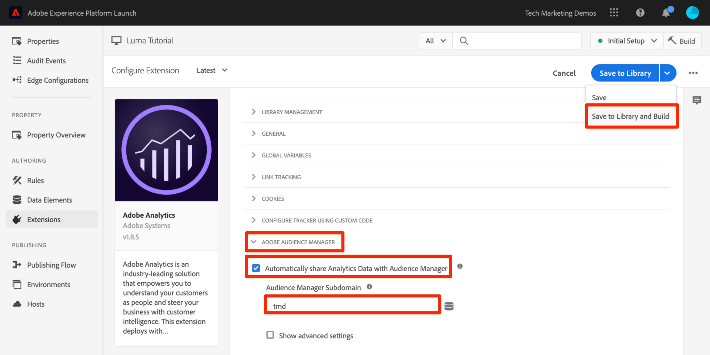

Server-Side Forwarding Code is nu geïmplementeerd!

### Valideer de Server-kant door:sturen

De belangrijkste manier om te bevestigen dat de server-zij het Door:sturen in werking is door de reactie op om het even welk van uw controles van Adobe Analytics te bekijken. Daar komen we zo meteen bij. Ondertussen moeten we een paar andere dingen controleren die ons kunnen helpen ervoor te zorgen dat het werkt zoals we dat willen.

#### Controleren of de code correct wordt geladen

De code die markeringen installeert om het door:sturen, en vooral de reactie van AAM aan de pagina te behandelen, wordt genoemd Audience Manager
&quot;Module.&quot; Met de Experience Cloud Debugger kunnen we ervoor zorgen dat deze geladen is.

1. De Luministsite openen
1. Klik op het foutopsporingspictogram in uw browser om Experience Cloud Debugger te openen
1. Blader omlaag naar de sectie Analytics terwijl u op het tabblad Samenvatting blijft staan
1. Verifieer dat **AudienceManagement** onder de sectie van Modules vermeld is

   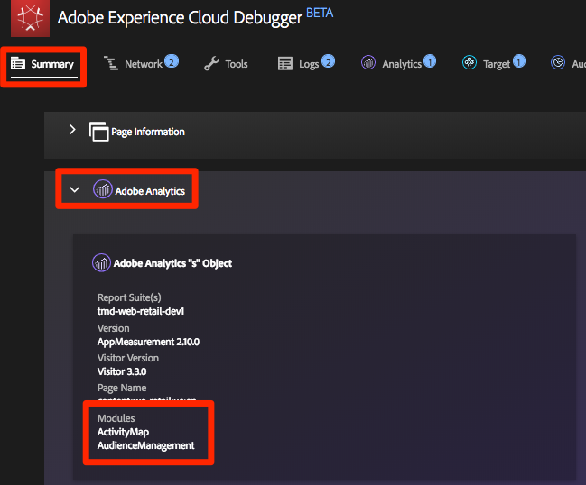

#### Verifieer Partner ID in Debugger

Daarna, kunnen wij ook verifiëren dat debugger juiste &quot;partneridentiteitskaart&quot;(subdomain van de Partner AKA, enz.) van de code opneemt.

1. Blader omlaag naar de sectie Audience Manager terwijl u zich nog steeds in de foutopsporing bevindt en nog steeds op het tabblad Overzicht
1. Verifieer uw identiteitskaart van de Partner/Subdomain onder &quot;Partner&quot;

   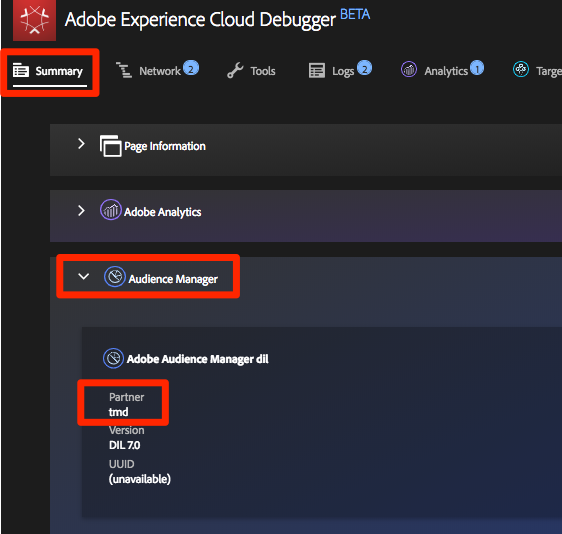

>[!WARNING]
>
>U kunt opmerken dat de sectie Audience Manager van debugger naar &quot;DIL&quot;verwijst, die &quot;Data Integration Library,&quot;is en typisch naar een cliënt-zijimplementatie verwijst, in tegenstelling tot de server-zijbenadering die wij hier hebben uitgevoerd. De waarheid is dat AAM &quot;Module&quot;(gebruikt in deze benadering SSF) veel van de zelfde code zoals de cliënt-kant bibliotheek van DIL gebruikt, en zo zuivert dit momenteel het als dusdanig meldt. Als u de stappen in dit leerprogramma hebt gevolgd, en de rest punten in deze bevestigingssectie correct zijn, kunt u erop vertrouwen dat server-zijdoor:sturen werkt.

#### De analyseaanvraag en -reactie controleren

Oké, dit is het grote signaal. Als u geen server-kant het door:sturen van gegevens van Analytics aan Audience Manager doet, dan is er werkelijk geen reactie op het baken van de Analyse (behalve een 2x2 pixel). Nochtans, als u SSF doet, dan zijn er punten die u in het verzoek en de reactie kunt verifiëren Analytics die u zullen laten weten dat het correct werkt.
Jammer genoeg, op dit ogenblik, steunt debugger van Experience Cloud niet het tonen van de reactie op de bakens. Daarom zou u een andere debugger/pakketsniffer, zoals de Volmacht van Charles of de browser Hulpmiddelen van de Ontwikkelaar moeten gebruiken.

1. Open de Developer Tools in uw browser en ga naar het tabblad Netwerk
1. Typ in het filterveld `b/ss` wat wat u ziet, beperkt tot de Adobe Analytics-aanvragen
1. De pagina vernieuwen om de analyseaanvraag weer te geven

   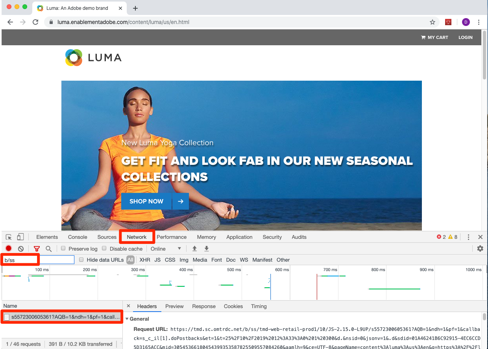

1. In het baken van Analytics (verzoek), zoek een &quot;callback&quot;parameter. Het wordt ingesteld op iets dergelijks: `s_c_il[1].doPostbacks`

   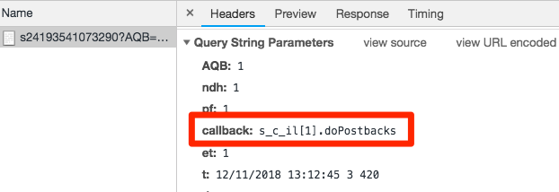

1. U krijgt een reactie op het Analytics-baken. Het zal verwijzingen naar doPostbacks bevatten, zoals geroepen in het verzoek, en het belangrijkste, zou het een &quot;spul&quot;voorwerp moeten hebben. Op deze manier worden AAM-segment-id&#39;s teruggestuurd naar de browser. Als je het voorwerp &quot;dingen&quot;hebt, werkt SSF!

   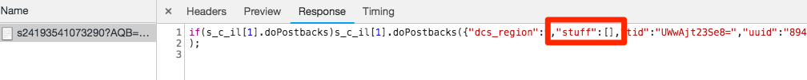

>[!WARNING]
>
>Wees het Onjuiste &quot;Succes&quot; - als er een reactie is, en alles schijnt te werken, zorg **zeker** dat u dat &quot;spul&quot;voorwerp hebt. Als u niet, kunt u een bericht in het antwoord zien dat &quot;status&quot;zegt:&quot;SUCCESS&quot;. Als gek aangezien dit klinkt, is dit eigenlijk bewijs dat het **&#x200B;**&#x200B;niet &lbrace;correct werkt. Als u dit ziet, betekent het dat u deze tweede stap (de code in markeringen) hebt voltooid, maar dat het door:sturen in de Analytics Admin Console (eerste stap van deze sectie) nog niet heeft voltooid. In dit geval moet u controleren of SSF is ingeschakeld in de Analytics Admin Console. Als je dat hebt, en dat is nog geen 4 uur, wees geduld.

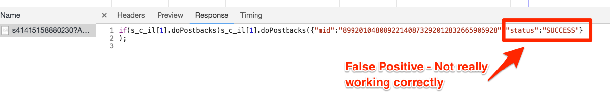

[Volgende &quot;Experience Cloud Integrations&quot; >](integrations.md)
