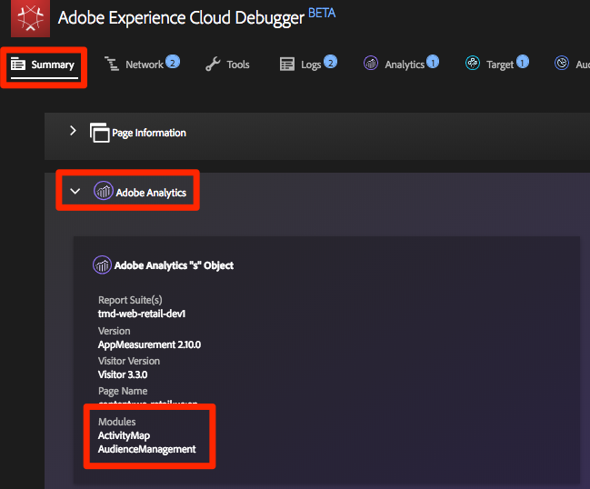

# Adobe Audience Manager toevoegen

Deze les zal u door de stappen begeleiden om Adobe Audience Manager toe te laten gebruikend Server-kant Door:sturen.

[ Adobe Audience Manager ](https://experienceleague.adobe.com/docs/audience-manager/user-guide/aam-home.html) (AAM) verleent de industrie-leidende diensten voor online beheer van publieksgegevens, die digitale adverteerders en uitgevers de hulpmiddelen geven die zij hebben moeten controleren en hefboomwerking hun gegevensactiva helpen verkoopsucces drijven.

>[!NOTE]
>
>Adobe Experience Platform Launch wordt in Adobe Experience Platform geïntegreerd als een reeks technologieën voor gegevensverzameling. Verschillende terminologiewijzigingen zijn geïmplementeerd in de interface die u tijdens het gebruik van deze inhoud moet onthouden:
>
> * Platform launch (de Kant van de Cliënt) is nu **[[!DNL tags]](https://experienceleague.adobe.com/docs/experience-platform/tags/home.html?lang=nl)**
> * De Server zijde van de platform launch is nu **[[!DNL event forwarding]](https://experienceleague.adobe.com/docs/experience-platform/tags/event-forwarding/overview.html)**
> * De configuraties van Edge zijn nu **[[!DNL datastreams]](https://experienceleague.adobe.com/docs/experience-platform/edge/fundamentals/datastreams.html)**

## Leerdoelen

Aan het eind van deze les, zult u kunnen:

1. Beschrijf de twee belangrijkste manieren om Audience Manager in een website uit te voeren
1. Audience Manager toevoegen met Server-Side Forwarding van het Analytics-baken
1. De implementatie van de Audience Manager valideren

## Vereisten

Om deze les te voltooien, zult u nodig hebben:

1. Om de lessen in [ te hebben voltooid vormen markeringen ](create-a-property.md), [ voeg Adobe Analytics ](analytics.md) toe, en [ voeg de Dienst van de Identiteit toe ](id-service.md).

1. Beheerders hebben toegang tot Adobe Analytics, zodat u Server-Side Forwarding kunt inschakelen voor de rapportsuite die u voor deze zelfstudie gebruikt. U kunt ook een bestaande beheerder van uw organisatie vragen dit voor u te doen, volgens de onderstaande instructies.

1. Uw &quot;Subdomain van de Audience Manager&quot;(die ook als &quot;identiteitskaart van de Partner&quot;,&quot;of &quot;Subdomain van de Partner&quot;wordt bekend). Als u Audience Manager al op uw daadwerkelijke website hebt geïmplementeerd, kunt u deze het gemakkelijkst verkrijgen door naar uw werkelijke website te gaan en Foutopsporing te openen. Het subdomein is beschikbaar op het tabblad Overzicht, in de sectie Audience Manager:

    te vinden

Als u reeds uitgevoerde Audience Manager niet hebt, volg deze instructies om [ uw Audience Manager subdomain ](https://experienceleague.adobe.com/docs/audience-manager-learn/tutorials/web-implementation/how-to-identify-your-partner-id-or-subdomain.html) te verkrijgen.

## Implementatieopties

Er zijn twee manieren om Audience Manager in een website te implementeren:

* **Server-zij Door:sturen (SSF)** - voor klanten met Adobe Analytics, is dit de gemakkelijkste en geadviseerde manier om uit te voeren. Adobe Analytics stuurt gegevens door naar AAM op de achtergrond van de Adobe, zodat er minder aanvragen op de pagina kunnen worden ingediend. Dit laat ook zeer belangrijke integratiefuncties toe en past met onze beste praktijken voor de implementatie en plaatsing van de code van de Audience Manager aan.

* **client-kant DIL** - deze benadering is voor klanten die geen Adobe Analytics hebben. DIL code (de Code van de Data Integration Library, de de configuratiecode van AAM JavaScript) verzendt direct gegevens van de Web-pagina in Audience Manager.

Aangezien u Adobe Analytics in deze zelfstudie al hebt geïmplementeerd, implementeert u Audience Manager met behulp van Server-Side Forwarding. Voor een volledige beschrijving en vereisten lijst voor server-zij het door:sturen, te herzien gelieve de [ documentatie ](https://experienceleague.adobe.com/docs/analytics/admin/admin-tools/server-side-forwarding/ssf.html), zodat u met vertrouwd bent hoe het werkt, wat wordt vereist, en hoe te bevestigen.

## Server-Side Forwarding inschakelen

Er zijn twee belangrijke stappen bij het uitvoeren van een SSF-implementatie:

1. Het aanzetten van een &quot;schakelaar&quot;in de Admin Console van Analytics om gegevens van Analytics aan Audience Manager *per rapportreeks* door:sturen.
1. De code plaatsen, wat gebeurt via tags. Opdat dit correct zal werken, zult u de geïnstalleerde uitbreiding van de Dienst van de Identiteit van Adobe Experience Platform moeten hebben, evenals de uitbreiding van Analytics (u ** niet  de AAM uitbreiding zult nodig hebben, die hieronder wordt verklaard).

### Server-Side Forwarding inschakelen in de Admin Console Analytics

Een configuratie in de Admin Console van Adobe Analytics wordt vereist beginnen gegevens van Adobe Analytics aan Adobe Audience Manager door:sturen. Aangezien het tot vier uren kan duren beginnen de gegevens door:sturen, zou u deze stap eerst moeten doen.

#### SSF inschakelen in de Admin Console Analytics

1. Meld u aan bij Analytics via de gebruikersinterface van het Experience Cloud. Als u geen beheerdersrechten hebt voor Analytics, moet u met uw Experience Cloud- of analysebeheerder communiceren om toegang te krijgen tot de analysemogelijkheden of deze stappen voor u uit te voeren.

   

1. Kies in de bovenste navigatie in Analytics de optie **[!UICONTROL Admin > Report Suites]** en selecteer in de lijst de rapportsuite(s) die u wilt doorsturen naar de Audience Manager (meervoudig selecteren).

   

1. Kies **[!UICONTROL Edit Settings > General > Server-Side Forwarding]** in het scherm Rapportsets en met de rapportsuite(s) geselecteerd.

   

   >[!WARNING]
   >
   >Zoals hierboven vermeld, hebt u beheerdersrechten nodig om dit menu-item te kunnen zien.

1. Eenmaal op de pagina Server-Side Forwarding, leest u de informatie en schakelt u het selectievakje **[!UICONTROL Enable Server-Side Forwarding]** in voor de rapportsuite(s).

1. Klikken **[!UICONTROL Save]**

   

>[!NOTE]
>
>Aangezien SSF per rapportreeks moet worden toegelaten, vergeet niet deze stap voor uw echte rapportreeksen te herhalen wanneer u SSF op uw daadwerkelijke het rapportreeks van de plaats opstelt.
>
>Ook, als de optie SSF uit grayed is, zult u de rapportreeks(en) aan uw Experience CloudOrg moeten in kaart brengen om de optie toe te laten. Dit wordt verklaard in [ de documentatie ](https://experienceleague.adobe.com/docs/analytics/admin/data-governance/gdpr-view-settings.html).

Zodra deze stap is voltooid en als u de Adobe Experience Platform Identity Service hebt ingeschakeld, worden de gegevens doorgestuurd van Analytics naar AAM. Als u het proces echter wilt voltooien, zodat de reactie correct terugkomt van AAM naar de pagina (en ook naar Analytics via de functie Audience Analytics), moet u ook de volgende stap in de labels uitvoeren. Maak je geen zorgen, het is supergemakkelijk.

### Server-Side Forwarding inschakelen in tags

Dit is de tweede van twee stappen om SSF toe te laten. U hebt de switch al gespiegeld in de Admin Console Analytics en nu hoeft u alleen maar de code toe te voegen die voor u wordt gebruikt als u gewoon het juiste selectievakje inschakelt.

>[!NOTE]
>
>Om server-zij door:sturen van de gegevens van Analytics in AAM uit te voeren, zullen wij eigenlijk de uitbreiding van Analytics in markeringen uitgeven/vormen, **niet** de uitbreiding van de AAM. De AAM extensie wordt uitsluitend gebruikt voor client-Side DIL-implementaties, voor gebruikers die geen Adobe Analytics hebben. De volgende stappen zijn dus correct wanneer u deze instelt in de extensie Analytics.

#### SSF inschakelen in tags

1. Ga naar **[!UICONTROL Extensions > Installed]** en klik om de extensie Analytics te configureren.

   

1. De sectie `Adobe Audience Manager` uitbreiden

1. Schakel het selectievakje in op **[!UICONTROL Automatically share Analytics Data with Audience Manager]** . Hiermee voegt u de Audience Manager &quot;Module&quot; (code) toe aan de implementatie Analytics `AppMeasurement.js` .

1. Voeg uw &quot;Subdomain van de Audience Manager&quot;toe (die ook als &quot;Naam van de Partner,&quot;identiteitskaart van de Partner,&quot;of &quot;Subdomain van de Partner&quot;wordt bekend). Volg deze instructies om [ uw Audience Manager subdomain ](https://experienceleague.adobe.com/docs/audience-manager-learn/tutorials/web-implementation/how-to-identify-your-partner-id-or-subdomain.html) te verkrijgen.

1. Klikken **[!UICONTROL Save to Library and Build]**

   

Server-Side Forwarding Code is nu geïmplementeerd!

### Valideer de Server-kant door:sturen

De belangrijkste manier om te bevestigen dat de server-zij het Door:sturen in werking is door de reactie op om het even welk van uw controles van Adobe Analytics te bekijken. Daar komen we zo meteen bij. Ondertussen moeten we een paar andere dingen controleren die ons kunnen helpen ervoor te zorgen dat het werkt zoals we dat willen.

#### Controleren of de code correct wordt geladen

De code die markeringen installeert om het door:sturen, en vooral de reactie van AAM aan de pagina te behandelen, wordt genoemd de Audience Manager
&quot;Module.&quot; We kunnen het Experience Cloud Debugger gebruiken om ervoor te zorgen dat het geladen is.

1. De Luministsite openen
1. Klik het debugger pictogram in uw browser om debugger van het Experience Cloud te openen
1. Blader omlaag naar de sectie Analytics terwijl u op het tabblad Samenvatting blijft staan
1. Verifieer dat **AudienceManagement** onder de sectie van Modules vermeld is

   

#### Verifieer Partner ID in Debugger

Daarna, kunnen wij ook verifiëren dat debugger de juiste &quot;partner identiteitskaart&quot;(subdomain van de Partner AKA, enz.) opneemt uit de code.

1. Terwijl nog in debugger, en nog op het Summiere lusje, scrol neer aan de sectie van de Audience Manager
1. Verifieer uw identiteitskaart van de Partner/Subdomain onder &quot;Partner&quot;

   

>[!WARNING]
>
>U kunt opmerken dat de sectie van de Audience Manager van debugger naar &quot;DIL&quot;verwijst, die de &quot;Data Integration Library is,&quot;en typisch naar een cliënt-zijimplementatie, in tegenstelling tot de server-zijbenadering verwijst die wij hier hebben uitgevoerd. De waarheid is dat AAM &quot;Module&quot;(gebruikt in deze benadering SSF) veel van de zelfde code zoals de cliënt-zijbibliotheek van de DIL gebruikt, en zodat dit debugger het momenteel als dusdanig meldt. Als u de stappen in dit leerprogramma hebt gevolgd, en de rest punten in deze bevestigingssectie correct zijn, kunt u erop vertrouwen dat server-zijdoor:sturen werkt.

#### De analyseaanvraag en -reactie controleren

Oké, dit is het grote signaal. Als u geen server-kant het door:sturen van gegevens van Analytics aan Audience Manager doet, dan is er werkelijk geen reactie op het baken van de Analyse (behalve een 2x2 pixel). Nochtans, als u SSF doet, dan zijn er punten die u in het verzoek en de reactie kunt verifiëren Analytics die u zullen laten weten dat het correct werkt.
Jammer genoeg, op dit ogenblik, steunt debugger niet het tonen van de reactie op de bakens. Daarom zou u een andere debugger/pakketsniffer, zoals de Volmacht van Charles of de browser Hulpmiddelen van de Ontwikkelaar moeten gebruiken.

1. Open de Developer Tools in uw browser en ga naar het tabblad Netwerk
1. Typ in het filterveld `b/ss` wat wat u ziet, beperkt tot de Adobe Analytics-aanvragen
1. De pagina vernieuwen om de analyseaanvraag weer te geven

   

1. In het baken van Analytics (verzoek), zoek een &quot;callback&quot;parameter. Het wordt ingesteld op iets dergelijks: `s_c_il[1].doPostbacks`

   

1. U krijgt een reactie op het Analytics-baken. Het zal verwijzingen naar doPostbacks bevatten, zoals geroepen in het verzoek, en het belangrijkste, zou het een &quot;spul&quot;voorwerp moeten hebben. Dit is waar AAM segment IDs terug naar browser zal worden verzonden. Als je het voorwerp &quot;dingen&quot;hebt, werkt SSF!

   

>[!WARNING]
>
>Wees het Onjuiste &quot;Succes&quot; - als er een reactie is, en alles schijnt te werken, zorg **zeker** dat u dat &quot;spul&quot;voorwerp hebt. Als u niet, kunt u een bericht in het antwoord zien dat &quot;status&quot;zegt:&quot;SUCCESS&quot;. Als gek aangezien dit klinkt, is dit eigenlijk bewijs dat het **** niet {correct werkt. Als u dit ziet, betekent het dat u deze tweede stap (de code in markeringen) hebt voltooid, maar dat het door:sturen in de Admin Console Analytics (eerste stap van deze sectie) nog niet heeft voltooid. In dit geval moet u controleren of SSF is ingeschakeld in de Admin Console Analytics. Als je dat hebt, en dat is nog geen 4 uur, wees geduld.

[Volgende &quot;Experience Cloud Integrations&quot; >](integrations.md)
