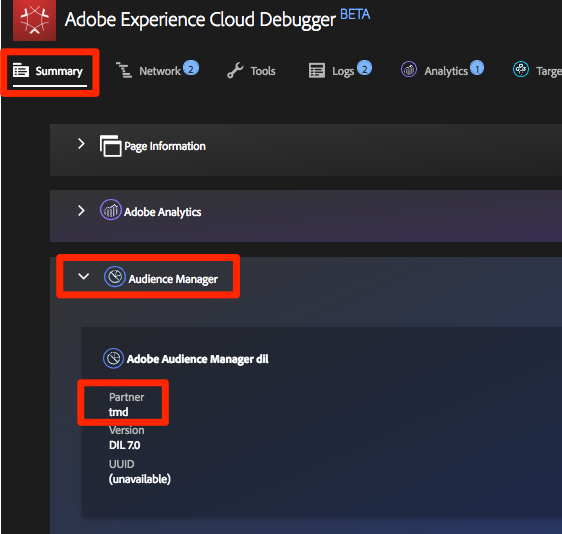

# Adobe Audience Manager toevoegen

Deze les zal u door de stappen begeleiden om Adobe Audience Manager toe te laten gebruikend Server-kant Door:sturen.

[Adobe Audience Manager](https://experienceleague.adobe.com/docs/audience-manager/user-guide/aam-home.html) (AAM) biedt toonaangevende services voor het beheer van online publieksgegevens, zodat digitale adverteerders en uitgevers over de tools beschikken die ze nodig hebben om hun gegevensbestanden te beheren en te gebruiken om hun verkoop te laten slagen.

>[!NOTE]
>
>Adobe Experience Platform Launch wordt in Adobe Experience Platform geïntegreerd als een reeks technologieën voor gegevensverzameling. Verschillende terminologiewijzigingen zijn geïmplementeerd in de interface die u tijdens het gebruik van deze inhoud moet onthouden:
>
> * platform launch (clientzijde) is nu **[[!DNL tags]](https://experienceleague.adobe.com/docs/experience-platform/tags/home.html?lang=nl)**
> * platform launch Server-zijde is nu **[[!DNL event forwarding]](https://experienceleague.adobe.com/docs/experience-platform/tags/event-forwarding/overview.html)**
> * Edge-configuraties zijn nu **[[!DNL datastreams]](https://experienceleague.adobe.com/docs/experience-platform/edge/fundamentals/datastreams.html)**

## Leerdoelen

Aan het eind van deze les, zult u kunnen:

1. Beschrijf de twee belangrijkste manieren om Audience Manager in een website uit te voeren
1. Audience Manager toevoegen met Server-Side Forwarding van het Analytics-baken
1. De Audience Manager-implementatie valideren

## Vereisten

Om deze les te voltooien, zult u nodig hebben:

1. Om de lessen in [Tags configureren](create-a-property.md), [Adobe Analytics toevoegen](analytics.md), en [Identiteitsservice toevoegen](id-service.md).

1. Beheerders hebben toegang tot Adobe Analytics, zodat u Server-Side Forwarding kunt inschakelen voor de rapportsuite die u voor deze zelfstudie gebruikt. U kunt ook een bestaande beheerder van uw organisatie vragen dit voor u te doen, volgens de onderstaande instructies.

1. Uw &quot;Subdomain van de Audience Manager&quot;(die ook als &quot;identiteitskaart van de Partner&quot;,&quot;of &quot;Subdomain van de Partner&quot;wordt bekend). Als u Audience Manager al op uw daadwerkelijke website hebt geïmplementeerd, kunt u deze het gemakkelijkst verkrijgen door naar uw werkelijke website te gaan en Foutopsporing te openen. Het subdomein is beschikbaar op het tabblad Overzicht, in de sectie Audience Manager:

   

Als u Audience Manager nog niet hebt geïmplementeerd, volgt u deze instructies op [verkrijgen uw Audience Manager Subdomain](https://experienceleague.adobe.com/docs/audience-manager-learn/tutorials/web-implementation/how-to-identify-your-partner-id-or-subdomain.html).

## Implementatieopties

Er zijn twee manieren om Audience Manager in een website te implementeren:

* **Server-Side Forwarding (SSF)**—voor klanten met Adobe Analytics is dit de eenvoudigste en aanbevolen manier om te implementeren. Adobe Analytics stuurt gegevens door naar AAM op Adobe backend, zodat er minder aanvragen op de pagina kunnen worden ingediend. Dit laat ook zeer belangrijke integratiefuncties toe en past met onze beste praktijken voor de implementatie en plaatsing van de code van de Audience Manager aan.

* **Client-kant DIL**—Deze benadering geldt voor klanten die geen Adobe Analytics hebben. DIL-code (Data Integration Library Code, de AAM JavaScript-configuratiecode) verzendt gegevens rechtstreeks van de webpagina naar Audience Manager.

Aangezien u Adobe Analytics in deze zelfstudie al hebt geïmplementeerd, implementeert u Audience Manager met behulp van Server-Side Forwarding. Voor een volledige beschrijving en een lijst met vereisten voor het doorsturen van servers raadpleegt u de [documentatie](https://experienceleague.adobe.com/docs/analytics/admin/admin-tools/server-side-forwarding/ssf.html), zodat u bekend bent met de werking, de vereisten en de validatie.

## Server-Side Forwarding inschakelen

Er zijn twee belangrijke stappen bij het uitvoeren van een SSF-implementatie:

1. Het aanzetten van een &quot;schakelaar&quot;in de Admin Console van Analytics om gegevens van Analytics aan Audience Manager door:sturen *per rapportsuite*.
1. De code plaatsen, wat gebeurt via tags. Dit werkt alleen correct als u de extensie Adobe Experience Platform Identity Service hebt geïnstalleerd en de extensie Analytics (u gaat in feite *niet* de AAM uitbreiding nodig hebben, zoals hieronder wordt uitgelegd).

### Server-Side Forwarding inschakelen in de Admin Console Analytics

Een configuratie in de Admin Console van Adobe Analytics wordt vereist beginnen gegevens van Adobe Analytics aan Adobe Audience Manager door:sturen. Aangezien het tot vier uren kan duren beginnen de gegevens door:sturen, zou u deze stap eerst moeten doen.

#### SSF inschakelen in de Admin Console Analytics

1. Meld u aan bij Analytics via de gebruikersinterface van Experience Cloud. Als u geen beheerdersrechten hebt voor Analytics, moet u contact opnemen met uw Experience Cloud- of analysebeheerder om u toegang te verlenen of deze stappen voor u uit te voeren.

   

1. Kies in de bovenste navigatie in Analytics de optie **[!UICONTROL Admin > Report Suites]** en selecteer in de lijst de rapportsuite(s) die u naar de Audience Manager wilt doorsturen (multi-select).

   

1. Kies in het scherm Rapportsets en met de geselecteerde rapportensuite(s) de optie **[!UICONTROL Instellingen bewerken > Algemeen > Server-Side Forwarding]**.

   

   >[!WARNING]
   >
   >Zoals hierboven vermeld, hebt u beheerdersrechten nodig om dit menu-item te kunnen zien.

1. Lees de info en schakel het selectievakje in op de pagina Server-Side Forwarding **[!UICONTROL Server-Side Forwarding inschakelen]** voor de rapportsuite(s).

1. Klikken **[!UICONTROL Opslaan]**

   

>[!NOTE]
>
>Aangezien SSF per rapportreeks moet worden toegelaten, vergeet niet deze stap voor uw echte rapportreeksen te herhalen wanneer u SSF op uw daadwerkelijke het rapportreeks van de plaats opstelt.
>
>Ook, als de optie SSF uit grayed is, zult u de rapportreeks(en) aan uw Experience Cloud Org moeten in kaart brengen om de optie toe te laten. Dit wordt uitgelegd in [de documentatie](https://experienceleague.adobe.com/docs/analytics/admin/data-governance/gdpr-view-settings.html).

Zodra deze stap is voltooid en als u de Adobe Experience Platform Identity Service hebt ingeschakeld, worden de gegevens doorgestuurd van Analytics naar AAM. Als u het proces echter wilt voltooien, zodat de reactie correct terugkomt van AAM naar de pagina (en ook naar Analytics via de functie Audience Analytics), moet u ook de volgende stap in de labels uitvoeren. Maak je geen zorgen, het is supergemakkelijk.

### Server-Side Forwarding inschakelen in tags

Dit is de tweede van twee stappen om SSF toe te laten. U hebt de switch al gespiegeld in de Admin Console Analytics en nu hoeft u alleen maar de code toe te voegen die voor u wordt gebruikt als u gewoon het juiste selectievakje inschakelt.

>[!NOTE]
>
>Als u Server-Side Forwarding van Analytics-gegevens wilt implementeren in AAM, zullen we de extensie Analytics in tags bewerken/configureren. **niet** de AAM extensie. De AAM extensie wordt uitsluitend gebruikt voor client-Side DIL-implementaties, voor gebruikers die geen Adobe Analytics hebben. De volgende stappen zijn dus correct wanneer ze u naar de extensie Analytics sturen om deze instelling in te stellen.

#### SSF inschakelen in tags

1. Ga naar **[!UICONTROL Extensies > Geïnstalleerd]** en klik om de extensie Analytics te configureren.

   

1. Vouw de sectie `Adobe Audience Manager` uit

1. Schakel het selectievakje in om **[!UICONTROL Analysegegevens automatisch delen met Audience Manager]**. Hiermee wordt de Audience Manager &quot;Module&quot; (code) toegevoegd aan de Analytics `AppMeasurement.js` uitvoering.

1. Voeg uw &quot;Subdomain van de Audience Manager&quot;toe (die ook als &quot;Naam van de Partner,&quot;identiteitskaart van de Partner,&quot;of &quot;Subdomain van de Partner&quot;wordt bekend). Volg deze instructies op [verkrijgen uw Audience Manager Subdomain](https://experienceleague.adobe.com/docs/audience-manager-learn/tutorials/web-implementation/how-to-identify-your-partner-id-or-subdomain.html).

1. Klikken **[!UICONTROL Opslaan in bibliotheek en samenstellen]**

   

Server-Side Forwarding Code is nu geïmplementeerd!

### Valideer de Server-kant door:sturen

De belangrijkste manier om te bevestigen dat de server-zij het Door:sturen in werking is door de reactie op om het even welk van uw controles van Adobe Analytics te bekijken. Daar komen we zo meteen bij. Ondertussen moeten we een paar andere dingen controleren die ons kunnen helpen ervoor te zorgen dat het werkt zoals we dat willen.

#### Controleren of de code correct wordt geladen

De code die markeringen installeert om het door:sturen, en vooral de reactie van AAM aan de pagina te behandelen, wordt genoemd de Audience Manager &quot;Module.&quot; We kunnen de Experience Cloud Debugger gebruiken om ervoor te zorgen dat deze geladen is.

1. De Luministsite openen
1. Klik het debugger pictogram in uw browser om debugger van de Experience Cloud te openen
1. Blader omlaag naar de sectie Analytics terwijl u op het tabblad Samenvatting blijft staan
1. Controleren of **AudienceManagement** is vermeld onder de sectie Modules

   

#### Verifieer identiteitskaart van de Partner in Debugger

Daarna, kunnen wij ook verifiëren dat debugger de juiste &quot;partner identiteitskaart&quot;(subdomain van de Partner AKA, enz.) opneemt uit de code.

1. Terwijl nog in debugger, en nog op het Summiere lusje, scrol neer aan de sectie van de Audience Manager
1. Verifieer uw identiteitskaart van de Partner/Subdomain onder &quot;Partner&quot;

   

>[!WARNING]
>
>U kunt opmerken dat de sectie van de Audience Manager van debugger naar &quot;DIL&quot;verwijst, die de &quot;Data Integration Library is,&quot;en typisch naar een cliënt-zijimplementatie, in tegenstelling tot de server-zijbenadering verwijst die wij hier hebben uitgevoerd. De waarheid is dat AAM &quot;Module&quot;(gebruikt in deze benadering SSF) veel van de zelfde code zoals de cliënt-zijbibliotheek van de DIL gebruikt, en zodat dit debugger het momenteel als dusdanig meldt. Als u de stappen in dit leerprogramma hebt gevolgd, en de rest punten in deze bevestigingssectie correct zijn, kunt u erop vertrouwen dat server-zijdoor:sturen werkt.

#### De analyseaanvraag en -reactie controleren

Oké, dit is het grote signaal. Als u geen server-kant het door:sturen van gegevens van Analytics aan Audience Manager doet, dan is er werkelijk geen reactie op het baken van de Analyse (behalve een 2x2 pixel). Nochtans, als u SSF doet, dan zijn er punten die u in het verzoek en de reactie kunt verifiëren Analytics die u zullen laten weten dat het correct werkt.
Jammer genoeg, op dit ogenblik, steunt debugger van Experience Cloud niet het tonen van de reactie op de bakens. Daarom zou u een andere debugger/pakketsniffer, zoals de Volmacht van Charles of de browser Hulpmiddelen van de Ontwikkelaar moeten gebruiken.

1. Open de Hulpmiddelen van de Ontwikkelaar in uw browser en ga naar het lusje van het Netwerk
1. Typ in het filterveld `b/ss` waardoor je alleen maar kunt kijken naar Adobe Analytics-verzoeken
1. De pagina vernieuwen om de analyseaanvraag weer te geven

   

1. In het baken van Analytics (verzoek), zoek een &quot;callback&quot;parameter. Het zal worden geplaatst aan iets als dit: `s_c_il[1].doPostbacks`

   

1. U krijgt een reactie op het Analytics-baken. Het zal verwijzingen naar doPostbacks bevatten, zoals geroepen in het verzoek, en het belangrijkste, zou het een &quot;spul&quot;voorwerp moeten hebben. Dit is waar AAM segment IDs terug naar browser zal worden verzonden. Als je het voorwerp &quot;dingen&quot;hebt, werkt SSF!

   

>[!WARNING]
>
>Let op de fout &quot;Succes&quot; - Als er een reactie is, en alles lijkt te werken, maak **zeker** dat je dat &quot;dingen&quot; object hebt. Als u niet, kunt u een bericht in het antwoord zien dat &quot;status&quot;zegt:&quot;SUCCESS&quot;. Hoe gek dit ook klinkt, dit is eigenlijk een bewijs dat het is **NOT** correct werken. Als u dit ziet, betekent het dat u deze tweede stap (de code in markeringen) hebt voltooid, maar dat het door:sturen in de Admin Console Analytics (eerste stap van deze sectie) nog niet heeft voltooid. In dit geval moet u controleren of SSF is ingeschakeld in de Admin Console Analytics. Als je dat hebt, en dat is nog geen 4 uur, wees geduld.

[Volgende &quot;Experience Cloud-integratie&quot; >](integrations.md)
