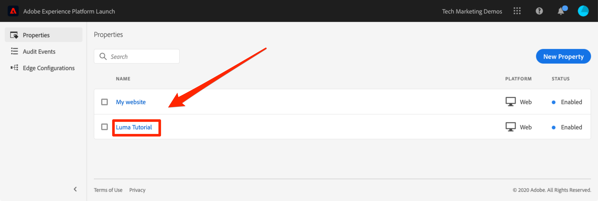

# Een tag-eigenschap maken

In deze les zult u uw eerste markeringsbezit tot stand brengen.

Een eigenschap is in feite een container die u vult met extensies, regels, gegevenselementen en bibliotheken wanneer u tags op uw site implementeert.

>[!WARNING]
>
> Deze zelfstudie en de bijbehorende Luma-website-oefeningen blijven niet meer behouden en zijn afhankelijk van oudere JavaScript-bibliotheken. Om de huidige beste praktijken te leren, te gebruiken gelieve [&#x200B; Adobe Experience Cloud met het leerprogramma van SDK van het Web uit te voeren &#x200B;](https://experienceleague.adobe.com/en/docs/platform-learn/implement-web-sdk/overview).

## Vereisten

Als u de volgende lessen wilt voltooien, moet u gemachtigd zijn om omgevingen in tags te ontwikkelen, goedkeuren, publiceren, beheren en beheren. Als u deze stappen niet kunt uitvoeren omdat de gebruikersinterfaceopties niet beschikbaar zijn, vraagt u de Experience Cloud-beheerder om toegang. Voor meer informatie over de toestemmingen van de markeringsgebruiker, zie [&#x200B; de documentatie &#x200B;](https://experienceleague.adobe.com/docs/experience-platform/tags/admin/user-permissions.html).

## Leerdoelen

Aan het eind van deze les, zult u kunnen:

* Aanmelden bij de gebruikersinterface voor gegevensverzameling
* Een nieuwe eigenschap voor tags maken
* Een eigenschap voor een tag configureren

## Ga naar de interface voor gegevensverzameling

**om aan de Inzameling van Gegevens te krijgen**

1. Logboek in [&#x200B; Adobe Experience Cloud &#x200B;](https://experiencecloud.adobe.com)

1. Klik het 

1. Selecteer **[!UICONTROL Launch/Data Collection]** van het menu 

U moet nu het scherm `Tags Properties` zien (als er geen eigenschappen in de account zijn gemaakt, is dit scherm mogelijk leeg):

## Een eigenschap maken

Een eigenschap is in feite een container die u vult met extensies, regels, gegevenselementen en bibliotheken wanneer u tags op uw site implementeert. Een eigenschap kan elke groepering van een of meer domeinen en subdomeinen zijn. U kunt deze elementen op dezelfde manier beheren en bijhouden. Stel dat u meerdere websites hebt die op één sjabloon zijn gebaseerd en dat u dezelfde elementen op alle websites wilt bijhouden. U kunt één eigenschap toepassen op meerdere domeinen. Voor meer informatie bij het creëren van eigenschappen, zie [&#x200B; &quot;Bedrijven en Eigenschappen&quot;](https://experienceleague.adobe.com/docs/experience-platform/tags/admin/companies-and-properties.html) in de productdocumentatie.

**om een Bezit** te creëren

1. Klik op de knop **[!UICONTROL New Property]** :

   

1. Geef de eigenschap een naam (bijvoorbeeld `Luma Tutorial` of `Luma Tutorial - Daniel` )
1. Voer `enablementadobe.com` in als domein, aangezien dit het domein is waar de Luma-demosite wordt gehost. Hoewel het veld &quot;Domein&quot; is vereist, werkt de eigenschap tag op elk domein waarin deze is geïmplementeerd. Het belangrijkste doel van dit gebied is menuopties in de Bouwer van de Regel vooraf in te vullen.
1. Vouw de sectie **[!UICONTROL Advanced Options]** uit en schakel het selectievakje in op **[!UICONTROL Run rule components in sequence]**
1. Klik op de knop **[!UICONTROL Save]**

   

De nieuwe eigenschap moet worden weergegeven op de pagina Eigenschappen. Als u het vakje naast de eigenschapsnaam inschakelt, worden opties voor **[!UICONTROL Configure]** of **[!UICONTROL Delete]** de eigenschap boven de eigenschappenlijst weergegeven. Klik op de naam van de eigenschap (bijvoorbeeld `Luma Tutorial` ) om het scherm `Overview` te openen.
 te openen

[Volgende &quot;Voeg de Insluitcode toe&quot; >](add-embed-code.md)
