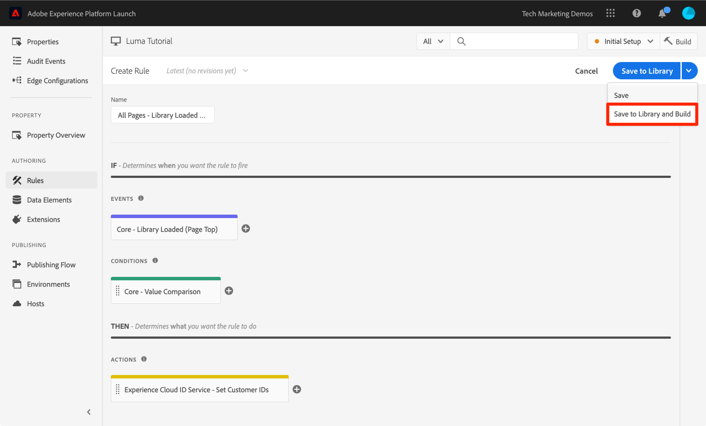

# De Adobe Experience Platform Identity Service toevoegen

Deze les zal uw door de stappen begeleiden die worden vereist om uit te voeren [Adobe Experience Platform Identity Service-extensie](https://experienceleague.adobe.com/docs/experience-platform/tags/extensions/adobe/id-service/overview.html) en sturen Customer ids.

De [Adobe Experience Platform Identity Service](https://experienceleague.adobe.com/docs/id-service/using/home.html) Hiermee wordt een gemeenschappelijke bezoeker-id ingesteld voor alle Adobe-oplossingen, zodat de Experience Cloud-mogelijkheden, zoals het delen van het publiek tussen de oplossingen, worden ingeschakeld. U kunt ook uw eigen klanten-id&#39;s naar de service sturen, zodat u toepassingen op verschillende apparaten kunt zoeken en kunt integreren met uw CRM-systeem (Customer Relationship Management).

>[!NOTE]
>
>Adobe Experience Platform Launch wordt in Adobe Experience Platform geïntegreerd als een reeks technologieën voor gegevensverzameling. Verschillende terminologiewijzigingen zijn geïmplementeerd in de interface die u tijdens het gebruik van deze inhoud moet onthouden:
>
> * platform launch (clientzijde) is nu **[[!DNL tags]](https://experienceleague.adobe.com/docs/experience-platform/tags/home.html?lang=nl)**
> * platform launch Server-zijde is nu **[[!DNL event forwarding]](https://experienceleague.adobe.com/docs/experience-platform/tags/event-forwarding/overview.html)**
> * Edge-configuraties zijn nu **[[!DNL datastreams]](https://experienceleague.adobe.com/docs/experience-platform/edge/fundamentals/datastreams.html)**


## Leerdoelen

Aan het eind van deze les, zult u kunnen:

* De extensie Identiteitsservice toevoegen
* Een gegevenselement maken om uw klantgegevens te verzamelen
* Maak een regel die de actie &quot;Customer ID&#39;s instellen&quot; gebruikt om de id&#39;s van de klant naar Adobe te sturen
* Gebruik de functie voor regelvolgorde om regels uit te voeren die op dezelfde gebeurtenis worden geactiveerd

## Vereisten

U had de lessen in het [Tags configureren](create-a-property.md) sectie.

## De extensie Identiteitsservice toevoegen

Aangezien dit de eerste extensie is die u toevoegt, volgt hier een kort overzicht van extensies. Extensies zijn een van de kernkenmerken van tags. Een extensie is een integratie die is gebouwd door Adobe, een Adobe-partner of een klant van een Adobe die nieuwe en eindeloze opties toevoegt voor de tags die u kunt implementeren op uw website. Als u tags als besturingssysteem beschouwt, zijn extensies de toepassingen die u installeert, zodat tags de taken kunnen uitvoeren die u nodig hebt.

**De extensie Identiteitsservice toevoegen**

1. Klik in de linkernavigatie op **[!UICONTROL Extensies]**

1. Klikken **[!UICONTROL Catalogus]** naar de pagina Extensiecatalogus gaan

1. Let op de verschillende extensies die beschikbaar zijn in de catalogus

1. Typ in het filter bovenaan &quot;id&quot; om de catalogus te filteren

1. Klik op de kaart voor de Adobe Experience Platform Identity Service op **[!UICONTROL Installeren]**

   

1. De organisatie-id van de Experience Cloud is automatisch voor u gedetecteerd.

1. Alle standaardinstellingen behouden en klikken **[!UICONTROL Opslaan in bibliotheek en samenstellen]**

   

>[!NOTE]
>
>Elke versie van de uitbreiding van de Dienst van de Identiteit komt met een specifieke versie van VisitorAPI.js die in de uitbreidingsbeschrijving wordt genoteerd. U werkt de versie VisitorAPI.js bij door de uitbreiding van de Dienst van de Identiteit bij te werken.

### De extensie valideren

De uitbreiding van de Dienst van de Identiteit is één van de weinige marktextensies die een verzoek indient zonder het moeten een regelactie gebruiken. De extensie zal automatisch een aanvraag indienen bij de Identity Service wanneer de eerste pagina van het eerste bezoek aan een website wordt geladen. Zodra de id is aangevraagd, wordt deze opgeslagen in een cookie van de eerste partij die begint met &quot;AMCV_&quot;.

**De extensie Identiteitsservice valideren**

1. Open de [Luminantiesite](https://luma.enablementadobe.com/content/luma/us/en.html)

1. Controleer of Foutopsporing de eigenschap tag toewijst aan *uw* Ontwikkelomgeving, zoals beschreven in de [eerdere les](switch-environments.md).

1. Op het tabblad Overzicht van Foutopsporing geeft de sectie Tags aan dat de extensie Adobe Experience Platform Identity Service is geïmplementeerd.

1. Ook, op het Summiere lusje, zou de sectie van de Dienst van de Identiteit met zelfde identiteitskaart moeten bevolken van Org die op uw scherm van de uitbreidingsconfiguratie in de interface van de Inzameling van Gegevens was:

   

1. Het aanvankelijke verzoek om identiteitskaart van de Bezoeker terug te winnen zou op het lusje van de Dienst van de Identiteit van Debugger kunnen verschijnen. Misschien is het al gevraagd, dus maak je geen zorgen als je het niet ziet:
   

1. Na de eerste aanvraag om de bezoeker-id op te halen, wordt de id opgeslagen in een cookie waarvan de naam begint met `AMCV_`. U kunt als volgt bevestigen dat de cookie is ingesteld:
   1. De ontwikkelaarsgereedschappen van uw browser openen
   1. Ga naar de `Application` tab
   1. Uitbreiden `Cookies` links
   1. Klik op het domein `https://luma.enablementadobe.com`
   1. Zoek naar het AMCV_ cookie aan de rechterkant. U ziet mogelijk verschillende keren dat de Luma-site is geladen met zowel de eigenschap hardcoded tag als de eigen eigenschap.
      

Dat is het! U hebt de eerste extensie toegevoegd! Voor meer informatie over de configuratieopties van de Identiteitsdienst, zie [de documentatie](https://experienceleague.adobe.com/docs/id-service/using/id-service-api/configurations/function-vars.html).

## Klant-id&#39;s verzenden

Vervolgens stuurt u een [Klant-id](https://experienceleague.adobe.com/docs/id-service/using/reference/authenticated-state.html) aan de identiteitsdienst. Hierdoor kunt u [uw CRM integreren](https://experienceleague.adobe.com/docs/core-services/interface/customer-attributes/attributes.html) met de Experience Cloud en de bezoekers van het spoor over apparaten.

In de vorige les: [Gegevenselementen, regels en bibliotheken toevoegen](add-data-elements-rules.md) u creeerde een gegevenselement en gebruikte het in een regel. Nu gebruikt u dezelfde technieken om een klant-id te verzenden wanneer de bezoeker is geverifieerd.

### Gegevenselementen maken voor de id&#39;s van de klant

Begin door twee gegevenselementen te creëren:

1. `Authentication State`—om vast te leggen of de bezoeker al dan niet is aangemeld
1. `Email (Hashed)`—om de gehashte versie van het e-mailadres (gebruikt als klant ID) van de gegevenslaag te vangen

**Het gegevenselement voor de verificatiestatus maken**

1. Klikken **[!UICONTROL Gegevenselementen]** in de linkernavigatie
1. Klik op de knop **[!UICONTROL Gegevenselement toevoegen]** knop

   

1. Geef het gegevenselement een naam `Authentication State`
1. Voor de **[!UICONTROL Type gegevenselement]**, selecteert u **[!UICONTROL Aangepaste code]**
1. Klik op de knop **[!UICONTROL Editor openen]** knop

   

1. In de [!UICONTROL Code bewerken] venster, gebruik de volgende code om waarden van &quot;het programma geopend&quot;of &quot;het programma geopend&quot;gebaseerd op een attribuut in de de gegevenslaag van de plaats van de Luma terug te keren:

   ```javascript
   if (digitalData.user[0].profile[0].attributes.loggedIn)
       return "logged in"
   else
       return "logged out"
   ```

1. Klikken **[!UICONTROL Opslaan]** om de aangepaste code op te slaan

   

1. Alle andere instellingen op de standaardwaarden laten staan
1. Klikken **[!UICONTROL Opslaan in bibliotheek]** om het gegevenselement op te slaan en terug te keren naar de pagina met gegevenselementen. We hoeven geen &#39;Build&#39; te doen voordat we al onze wijzigingen hebben aangebracht en klaar zijn om te valideren.

   

Door de authentificatiestatus van de gebruiker te kennen, weet u wanneer klantenidentiteitskaart op de pagina zou moeten bestaan om naar de Dienst van de Identiteit te verzenden. De volgende stap is een gegevenselement voor klantenidentiteitskaart zelf tot stand te brengen. Op de demo-site Luma gebruikt u de gehashte versie van het e-mailadres van de bezoeker.

**Het gegevenselement voor de gehashte-e-mail toevoegen**

1. Klik op de knop **[!UICONTROL Gegevenselement toevoegen]** knop

   

1. Geef het gegevenselement een naam `Email (Hashed)`
1. Voor de **[!UICONTROL Type gegevenselement]**, selecteert u **[!UICONTROL JavaScript-variabele]**
1. Als de **[!UICONTROL JavaScript variabelenaam]** gebruikt u de volgende aanwijzer naar een variabele in de gegevenslaag van de Luministensite: `digitalData.user.0.profile.0.attributes.username`
1. Alle andere instellingen op de standaardwaarden laten staan
1. Klikken **[!UICONTROL Opslaan in bibliotheek]** om het gegevenselement op te slaan

   

### Een regel toevoegen om de klant-id&#39;s te verzenden

De Adobe Experience Platform Identity Service geeft de id&#39;s van de Klant door in regels met de actie &quot;Customer ID&#39;s instellen&quot;.  U maakt nu een regel om deze handeling te activeren wanneer de bezoeker wordt geverifieerd.

**Een regel maken om de klant-id&#39;s te verzenden**

1. Klik in de linkernavigatie op **[!UICONTROL Regels]**
1. Klikken **[!UICONTROL Regel toevoegen]** om de Bouwer van de Regel te openen

   

1. Naam van de regel `All Pages - Library Loaded - Authenticated - 10`

   >[!TIP]
   >
   >Deze naamgevingsconventie geeft aan dat u deze regel boven aan alle pagina&#39;s afvuurt wanneer de gebruiker wordt geverifieerd en de regel de volgorde &quot;10&quot; heeft. Het gebruiken van een noemende overeenkomst als dit-in plaats van het voor de oplossingen te noemen die in actie-wordt teweeggebracht zal u toestaan om het algemene aantal regels te minimaliseren nodig door uw implementatie.

1. Onder **[!UICONTROL Gebeurtenissen]** klikken **[!UICONTROL Toevoegen]**

   

   1. Voor de **[!UICONTROL Type gebeurtenis]** selecteren **[!UICONTROL Bibliotheek geladen (pagina boven)]**
   1. Breid uit **[!UICONTROL Geavanceerde opties]** en voor de  **[!UICONTROL Volgorde]** enter `10`. De orde controleert de opeenvolging van regels die door de zelfde gebeurtenis worden teweeggebracht. Regels met een lagere volgorde worden vervangen door regels met een hogere volgorde. In dit geval, wilt u klantenidentiteitskaart plaatsen alvorens u het verzoek van het Doel in werking stelt, dat u in de volgende les met een regel met een orde van `50` .
   1. Klik op de knop **[!UICONTROL Wijzigingen behouden]** knoop om aan de Bouwer van de Regel terug te keren

   

1. Onder **[!UICONTROL Voorwaarden]** klikken **[!UICONTROL Toevoegen]**

   

   1. Voor de **[!UICONTROL Type voorwaarde]** selecteren **[!UICONTROL Waardevergelijking]**
   1. Klik op de knop  pictogram om het gegevenselement modaal te openen

      

   1. Klik op de module Gegevenselement op **[!UICONTROL Verificatiestatus]** en klik vervolgens op **[!UICONTROL Selecteren]**

      

1. Controleer of `Equals` is de operator
1. Typ &quot;aangemeld&quot; in het tekstveld, waardoor de regel wordt geactiveerd wanneer de waarde &quot;Aangemeld&quot; is voor het gegevenselement &quot;Aanmeldingsstatus&quot;

1. Klikken **[!UICONTROL Wijzigingen behouden]**

   

1. Onder **[!UICONTROL Handelingen]** klikken **[!UICONTROL Toevoegen]**

   

   1. Voor de **[!UICONTROL Extensie]** selecteren **[!UICONTROL Experience Cloud ID-service]**
   1. Voor de **[!UICONTROL Type handeling]** selecteren **[!UICONTROL Klant-id&#39;s instellen]**
   1. Voor de **[!UICONTROL Integratiecode]** enter `crm_id`
   1. Voor de **[!UICONTROL Waarde]** open de selecteur van het Element van Gegevens modaal en selecteer `Email (Hashed)`
   1. Voor de **[!UICONTROL Deelstaat Auth]** selecteren **[!UICONTROL Geverifieerd]**
   1. Klik op de knop **[!UICONTROL Wijzigingen behouden]** knoop om de actie te bewaren en aan de Bouwer van de Regel terug te keren

      

1. Klik op de knop **[!UICONTROL Opslaan in bibliotheek en samenstellen]** knop om de regel op te slaan

   

U hebt nu een regel gecreeerd die identiteitskaart van de Klant als variabele zal verzenden `crm_id` wanneer de bezoeker voor authentiek wordt verklaard. Aangezien u de volgorde hebt opgegeven als `10` deze regel wordt geactiveerd voordat u `All Pages - Library Loaded` regel die is gemaakt in het dialoogvenster [Gegevenselementen, regels en bibliotheken toevoegen](add-data-elements-rules.md) les die de standaardwaarde van de Orde van gebruikt `50`.

### De klant-id&#39;s valideren

Als u uw werk wilt valideren, meldt u zich aan bij de Lumasite om het gedrag van de nieuwe regel te bevestigen.

**Aanmelden bij de Luministsite**

1. Open de [Luminantiesite](https://luma.enablementadobe.com/content/luma/us/en.html)

1. Controleer of Foutopsporing de eigenschap tag toewijst aan *uw* Ontwikkelomgeving, zoals beschreven in de [eerdere les](switch-environments.md)

   

1. Klik op de knop **[!UICONTROL AANMELDEN]** koppeling in de rechterbovenhoek van de Luma-site

   

1. Enter `test@adobe.com` als de gebruikersnaam
1. Enter `test` als wachtwoord
1. Klik op de knop **[!UICONTROL AANMELDEN]** knop

   

1. Terug naar de startpagina

Bevestig nu dat de klant-id naar de service wordt verzonden met de extensie Foutopsporing.

**Om te controleren of de Identiteitsdienst klantenidentiteitskaart overgaat**

1. Zorg ervoor dat de tab met de Luminasite de focus heeft
1. Ga in Foutopsporing naar het tabblad Adobe Experience Platform Identity Service
1. Uw organisatie-id uitbreiden
1. Klik met de `Customer ID - crm_id` value
1. Let in het modaal op de waarde van de klant-id en op het feit dat `AUTHENTICATED` toestand wordt weerspiegeld:

   

1. U kunt de gehashte e-mailwaarde bevestigen door de broncode van de pagina Luma weer te geven en de eigenschap username te bekijken. Deze moet overeenkomen met de waarde die u in Foutopsporing ziet:

   

### Aanvullende tips voor validatie

Tags hebben ook uitgebreide functies voor consoleregistratie. Ga naar de **[!UICONTROL Gereedschappen]** in Foutopsporing en schakel de optie **[!UICONTROL Logboekregistratie voor tagconsole]** schakelen.


Hierdoor wordt het aanmelden van de console ingeschakeld in uw browserconsole en op het tabblad Logs van Foutopsporing. U zou het registreren van alle regels moeten zien u tot nu toe hebt gecreeerd! Merk op dat de nieuwe logboekingangen aan de bovenkant van de lijst worden toegevoegd, zodat zou uw regel &quot;Alle Pagina&#39;s - Bibliotheek Geladen - voor authentiek verklaard - 10&quot;vóór de &quot;Alle Pagina&#39;s - Bibliotheek Geladen&quot;regel moeten in brand steken en onder het in het Logboek van de Console van Foutopsporing verschijnen:


[Volgende &quot;Adobe Target toevoegen&quot; >](target.md)
