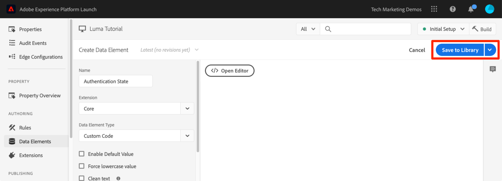
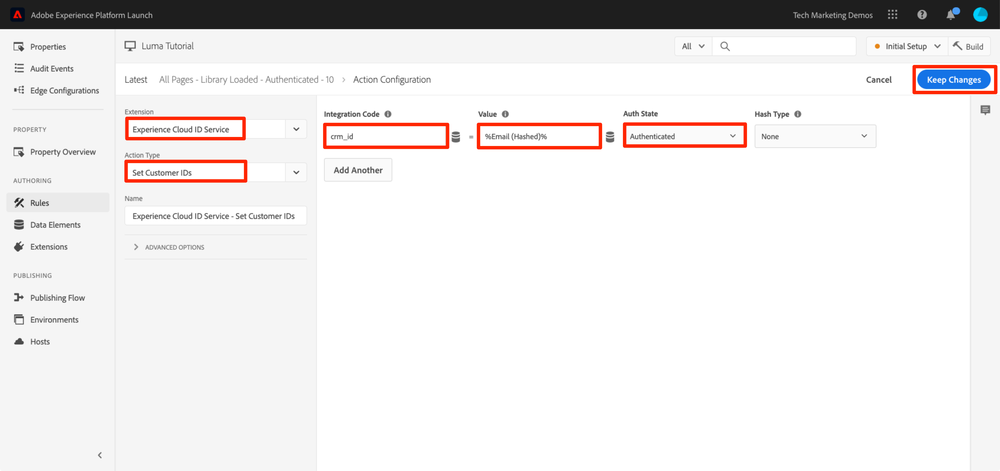

# De Adobe Experience Platform Identity Service toevoegen

Deze les zal uw door de stappen begeleiden die worden vereist om de [&#x200B; uitbreiding van de Dienst van de Identiteit van Adobe Experience Platform &#x200B;](https://experienceleague.adobe.com/docs/experience-platform/tags/extensions/adobe/id-service/overview.html?lang=nl-NL) uit te voeren en klantenids te verzenden.

De [&#x200B; Dienst van de Identiteit van Adobe Experience Platform &#x200B;](https://experienceleague.adobe.com/docs/id-service/using/home.html?lang=nl-NL) plaatst gemeenschappelijke bezoekersidentiteitskaart over alle oplossingen van Adobe om de mogelijkheden van Experience Cloud zoals publiek-deel tussen oplossingen te aandrijven. U kunt ook uw eigen klanten-id&#39;s naar de service sturen, zodat u toepassingen op verschillende apparaten kunt zoeken en kunt integreren met uw CRM-systeem (Customer Relationship Management).

>[!NOTE]
>
>Adobe Experience Platform Launch wordt in Adobe Experience Platform geïntegreerd als een reeks technologieën voor gegevensverzameling. Verschillende terminologiewijzigingen zijn geïmplementeerd in de interface die u tijdens het gebruik van deze inhoud moet onthouden:
>
> * Platform Launch (Client Side) is nu **[[!DNL tags]](https://experienceleague.adobe.com/docs/experience-platform/tags/home.html?lang=nl)**
> * Platform Launch Server Side is now **[[!DNL event forwarding]](https://experienceleague.adobe.com/docs/experience-platform/tags/event-forwarding/overview.html?lang=nl-NL)**
> * De configuraties van Edge zijn nu **[[!DNL datastreams]](https://experienceleague.adobe.com/docs/experience-platform/edge/fundamentals/datastreams.html?lang=nl-NL)**

## Leerdoelen

Aan het eind van deze les, zult u kunnen:

* De extensie Identiteitsservice toevoegen
* Een gegevenselement maken om uw klantgegevens te verzamelen
* Maak een regel die gebruikmaakt van de actie &quot;Customer ID&#39;s instellen&quot; om de id&#39;s van de klant naar Adobe te verzenden
* Gebruik de functie voor regelvolgorde om regels uit te voeren die op dezelfde gebeurtenis worden geactiveerd

## Vereisten

U zou de lessen in [&#x200B; reeds moeten voltooid hebben vormt markeringen &#x200B;](create-a-property.md) sectie.

## De extensie Identiteitsservice toevoegen

Aangezien dit de eerste extensie is die u toevoegt, volgt hier een kort overzicht van extensies. Extensies zijn een van de kernkenmerken van tags. Een extensie is een integratie die is gebouwd door Adobe, een Adobe-partner of een willekeurige Adobe-klant en die nieuwe en eindeloze opties toevoegt voor de tags die u kunt implementeren op uw website. Als u tags als besturingssysteem beschouwt, zijn extensies de toepassingen die u installeert, zodat tags de taken kunnen uitvoeren die u nodig hebt.

**om de Uitbreiding van de Dienst van de Identiteit toe te voegen**

1. Klik in de linkernavigatie op **[!UICONTROL Extensions]**

1. Klik op **[!UICONTROL Catalog]** om naar de pagina van de catalogus Extensies te gaan

1. Let op de verschillende extensies die beschikbaar zijn in de catalogus

1. Typ in het filter bovenaan &quot;id&quot; om de catalogus te filteren

1. Klik op de kaart voor de Adobe Experience Platform Identity Service op **[!UICONTROL Install]**

   

1. De Experience Cloud-organisatie-id is automatisch voor u gedetecteerd.

1. Alle standaardinstellingen behouden en klikken **[!UICONTROL Save to Library and Build]**

   

>[!NOTE]
>
>Elke versie van de uitbreiding van de Dienst van de Identiteit komt met een specifieke versie van VisitorAPI.js die in de uitbreidingsbeschrijving wordt genoteerd. U werkt de versie VisitorAPI.js bij door de uitbreiding van de Dienst van de Identiteit bij te werken.

### De extensie valideren

De uitbreiding van de Dienst van de Identiteit is één van de weinige marktextensies die een verzoek indient zonder het moeten een regelactie gebruiken. De extensie zal automatisch een aanvraag indienen bij de Identity Service wanneer de eerste pagina van het eerste bezoek aan een website wordt geladen. Zodra de id is aangevraagd, wordt deze opgeslagen in een cookie van de eerste partij die begint met &quot;AMCV_&quot;.

**om de uitbreiding van de Dienst van de Identiteit te bevestigen**

1. Open de [&#x200B; plaats van de Luma &#x200B;](https://luma.enablementadobe.com/content/luma/us/en.html)

1. Zorg ervoor debugger het markeringsbezit aan *in kaart brengt uw* milieu van de Ontwikkeling, zoals die in de [&#x200B; vroegere les &#x200B;](switch-environments.md) wordt beschreven.

1. Op het tabblad Overzicht van Foutopsporing geeft de sectie Tags aan dat de extensie Adobe Experience Platform Identity Service is geïmplementeerd.

1. Ook, op het Summiere lusje, zou de sectie van de Dienst van de Identiteit met zelfde identiteitskaart moeten bevolken van Org die op uw scherm van de uitbreidingsconfiguratie in de interface van de Inzameling van Gegevens was:

   

1. Het aanvankelijke verzoek om identiteitskaart van de Bezoeker terug te winnen zou op het lusje van de Dienst van de Identiteit van Debugger kunnen verschijnen. Misschien is het al gevraagd, dus maak je geen zorgen als je het niet ziet:
   

1. Na de eerste aanvraag om de bezoeker-id op te halen, wordt de id opgeslagen in een cookie waarvan de naam begint met `AMCV_` . U kunt als volgt bevestigen dat de cookie is ingesteld:
   1. De ontwikkelaarsgereedschappen van uw browser openen
   1. Ga naar de tab `Application`
   1. `Cookies` aan de linkerkant uitvouwen
   1. Klik op het domein `https://luma.enablementadobe.com`
   1. Zoek naar het AMCV_ cookie aan de rechterkant. U ziet mogelijk verschillende keren dat de Luma-site is geladen met zowel de eigenschap hardcoded tag als de eigen eigenschap.

      

Dat is het! U hebt de eerste extensie toegevoegd! Voor meer details over de configuratieopties van de Dienst van de Identiteit, zie [&#x200B; de documentatie &#x200B;](https://experienceleague.adobe.com/docs/id-service/using/id-service-api/configurations/function-vars.html?lang=nl-NL).

## Klant-id&#39;s verzenden

Daarna, zult u identiteitskaart van de a [&#x200B; Klant &#x200B;](https://experienceleague.adobe.com/docs/id-service/using/reference/authenticated-state.html?lang=nl-NL) naar de Dienst van de Identiteit verzenden. Dit zal u toestaan om uw CRM [&#128279;](https://experienceleague.adobe.com/docs/core-services/interface/customer-attributes/attributes.html?lang=nl-NL) met Experience Cloud evenals spoorbezoekers over apparaten te integreren.

In de vroegere les, [&#x200B; voegt de Elementen van Gegevens, Regels, en Bibliotheken &#x200B;](add-data-elements-rules.md) toe u een gegevenselement creeerde en het in een regel gebruikte. Nu gebruikt u dezelfde technieken om een klant-id te verzenden wanneer de bezoeker is geverifieerd.

### Gegevenselementen maken voor de id&#39;s van de klant

Begin door twee gegevenselementen te creëren:

1. `Authentication State`—om vast te leggen of de bezoeker is aangemeld
1. `Email (Hashed)`—om de gehashte versie van het e-mailadres (gebruikt als de klant-id) van de gegevenslaag vast te leggen

**om het gegevenselement voor de Staat van de Authentificatie** te creëren

1. Klik op **[!UICONTROL Data Elements]** in de linkernavigatie
1. Klik op de knop **[!UICONTROL Add Data Element]**

   

1. Naam van het gegevenselement `Authentication State`
1. Selecteer **[!UICONTROL Custom Code]** voor **[!UICONTROL Data Element Type]**
1. Klik op de knop **[!UICONTROL Open Editor]**

   

1. In het [!UICONTROL Edit Code] venster, gebruik de volgende code om waarden van &quot;het programma geopend&quot;of &quot;het programma geopend&quot;terug te keren die op een attribuut in de de gegevenslaag van de plaats van de Luma worden gebaseerd:

   ```javascript
   if (digitalData.user[0].profile[0].attributes.loggedIn)
       return "logged in"
   else
       return "logged out"
   ```

1. Klik op **[!UICONTROL Save]** om de aangepaste code op te slaan

   

1. Alle andere instellingen op de standaardwaarden laten staan
1. Klik op **[!UICONTROL Save to Library]** om het gegevenselement op te slaan en terug te keren naar de pagina met gegevenselementen. We hoeven geen &#39;Build&#39; te doen voordat we al onze wijzigingen hebben aangebracht en klaar zijn om te valideren.

   

Door de authentificatiestatus van de gebruiker te kennen, weet u wanneer klantenidentiteitskaart op de pagina zou moeten bestaan om naar de Dienst van de Identiteit te verzenden. De volgende stap is een gegevenselement voor klantenidentiteitskaart zelf te creëren. Op de demo-site Luma gebruikt u de gehashte versie van het e-mailadres van de bezoeker.

**om het gegevenselement voor hashed e-mail** toe te voegen

1. Klik op de knop **[!UICONTROL Add Data Element]**

    toe

1. Naam van het gegevenselement `Email (Hashed)`
1. Selecteer **[!UICONTROL JavaScript Variable]** voor **[!UICONTROL Data Element Type]**
1. Als de **[!UICONTROL JavaScript variable name]** gebruikt u de volgende aanwijzer naar een variabele in de gegevenslaag van de Luminantiesite: `digitalData.user.0.profile.0.attributes.username`
1. Alle andere instellingen op de standaardwaarden laten staan
1. Klik op **[!UICONTROL Save to Library]** om het gegevenselement op te slaan

   

### Een regel toevoegen om de klant-id&#39;s te verzenden

De Adobe Experience Platform Identity Service geeft de id&#39;s van de Klant door in regels met de actie &quot;Customer ID&#39;s instellen&quot;.  U maakt nu een regel om deze handeling te activeren wanneer de bezoeker wordt geverifieerd.

**om een regel tot stand te brengen om Klant IDs te verzenden**

1. Klik in de linkernavigatie op **[!UICONTROL Rules]**
1. Klik op **[!UICONTROL Add Rule]** om de Rule Builder te openen

    toe

1. Naam van de regel `All Pages - Library Loaded - Authenticated - 10`

   >[!TIP]
   >
   >Deze naamgevingsconventie geeft aan dat u deze regel boven aan alle pagina&#39;s afvuurt wanneer de gebruiker wordt geverifieerd en de regel de volgorde &quot;10&quot; heeft. Het gebruiken van een noemende overeenkomst als dit-in plaats van het voor de oplossingen te noemen die in actie-wordt teweeggebracht zal u toestaan om het algemene aantal regels te minimaliseren nodig door uw implementatie.

1. Onder **[!UICONTROL Events]** klikken **[!UICONTROL Add]**

    toe

   1. Voor **[!UICONTROL Event Type]** select **[!UICONTROL Library Loaded (Page Top)]**
   1. Vouw de sectie **[!UICONTROL Advanced Options]** uit en selecteer **[!UICONTROL Order]** enter `10` . De orde controleert de opeenvolging van regels die door de zelfde gebeurtenis worden teweeggebracht. Regels met een lagere volgorde worden vervangen door regels met een hogere volgorde. In dit geval, wilt u klantenidentiteitskaart plaatsen alvorens u het verzoek van het Doel in werking stelt, dat u in de volgende les met een regel met een orde van `50` zult doen.
   1. Klik op de knop **[!UICONTROL Keep Changes]** om terug te keren naar de Rule Builder

   

1. Onder **[!UICONTROL Conditions]** klikken **[!UICONTROL Add]**

   

   1. Voor **[!UICONTROL Condition Type]** select **[!UICONTROL Value Comparison]**
   1. Klik het  pictogram om het modale element van Gegevens te openen

      

   1. Klik op **[!UICONTROL Authentication State]** in het gegevenselement Modal en klik vervolgens op **[!UICONTROL Select]**

      

1. Controleer of `Equals` de operator is
1. Typ &quot;aangemeld&quot; in het tekstveld, waardoor de regel wordt geactiveerd wanneer de waarde &quot;Aangemeld&quot; is voor het gegevenselement &quot;Aanmeldingsstatus&quot;

1. Klikken **[!UICONTROL Keep Changes]**

   

1. Onder **[!UICONTROL Actions]** klikken **[!UICONTROL Add]**

    toe

   1. Voor **[!UICONTROL Extension]** select **[!UICONTROL Experience Cloud ID Service]**
   1. Voor **[!UICONTROL Action Type]** select **[!UICONTROL Set Customer IDs]**
   1. Voor **[!UICONTROL Integration Code]** voert u `crm_id` in
   1. Voor **[!UICONTROL Value]** open de selecteurswijze van het Element van Gegevens en selecteer `Email (Hashed)`
   1. Voor **[!UICONTROL Auth State]** select **[!UICONTROL Authenticated]**
   1. Klik op de knop **[!UICONTROL Keep Changes]** om de handeling op te slaan en terug te keren naar de Rule Builder

      

1. Klik op de knop **[!UICONTROL Save to Library and Build]** om de regel op te slaan

   

U hebt nu een regel gemaakt die de Klant-id als een variabele `crm_id` zal verzenden wanneer de bezoeker voor authentiek wordt verklaard. Aangezien u de Orde als `10` specificeerde zal deze regel vuren vóór uw `All Pages - Library Loaded` regel die in [&#x200B; wordt gecreeerd voegt Elementen, Regels en Bibliotheken van Gegevens &#x200B;](add-data-elements-rules.md) les toe die de waarde van de StandaardOrde van `50` gebruikt.

### De klant-id&#39;s valideren

Als u uw werk wilt valideren, meldt u zich aan bij de Lumasite om het gedrag van de nieuwe regel te bevestigen.

**aan login de plaats van de Luma**

1. Open de [&#x200B; plaats van de Luma &#x200B;](https://luma.enablementadobe.com/content/luma/us/en.html)

1. Zorg ervoor debugger het markeringsbezit aan *in kaart brengt uw* milieu van de Ontwikkeling, zoals die in de [&#x200B; vroegere les &#x200B;](switch-environments.md) wordt beschreven

   

1. Klik op de koppeling **[!UICONTROL LOGIN]** in de rechterbovenhoek van de Luminatiesite

   

1. Voer `test@test.com` in als gebruikersnaam
1. Voer `test` in als wachtwoord
1. Klik op de knop **[!UICONTROL LOGIN]**

   

1. Terug naar de startpagina

Bevestig nu dat de klant-id naar de service wordt verzonden met de extensie Foutopsporing.

**om te bevestigen dat de Dienst van de Identiteit klantenidentiteitskaart** overgaat

1. Zorg ervoor dat de tab met de Luminasite de focus heeft
1. Ga in Foutopsporing naar het tabblad Adobe Experience Platform Identity Service
1. Uw organisatie-id uitbreiden
1. Klik op de cel met de waarde `Customer ID - crm_id`
1. Let in het modaal op de waarde van de klant-id en op het feit dat de status `AUTHENTICATED` wordt weerspiegeld:

   

1. U kunt de gehashte e-mailwaarde bevestigen door de broncode van de pagina Luma weer te geven en de eigenschap username te bekijken. Deze moet overeenkomen met de waarde die u in Foutopsporing ziet:

   

### Aanvullende tips voor validatie

Tags hebben ook uitgebreide functies voor consoleregistratie. Als u deze wilt inschakelen, gaat u naar het tabblad **[!UICONTROL Tools]** in Foutopsporing en schakelt u de schakeloptie **[!UICONTROL tags Console Logging]** in.


Hierdoor wordt het aanmelden van de console ingeschakeld in uw browserconsole en op het tabblad Logs van Foutopsporing. U zou het registreren van alle regels moeten zien u tot nu toe hebt gecreeerd! Merk op dat de nieuwe logboekingangen aan de bovenkant van de lijst worden toegevoegd, zodat zou uw regel &quot;Alle Pagina&#39;s - Bibliotheek Geladen - voor authentiek verklaard - 10&quot;vóór de &quot;Alle Pagina&#39;s - Bibliotheek Geladen&quot;regel moeten in brand steken en onder het in het Logboek van de Console van Foutopsporing verschijnen:


[Volgende &quot;Adobe Target toevoegen&quot; >](target.md)
