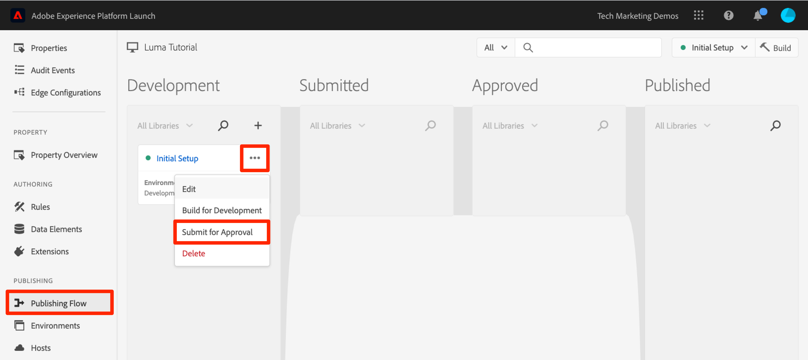
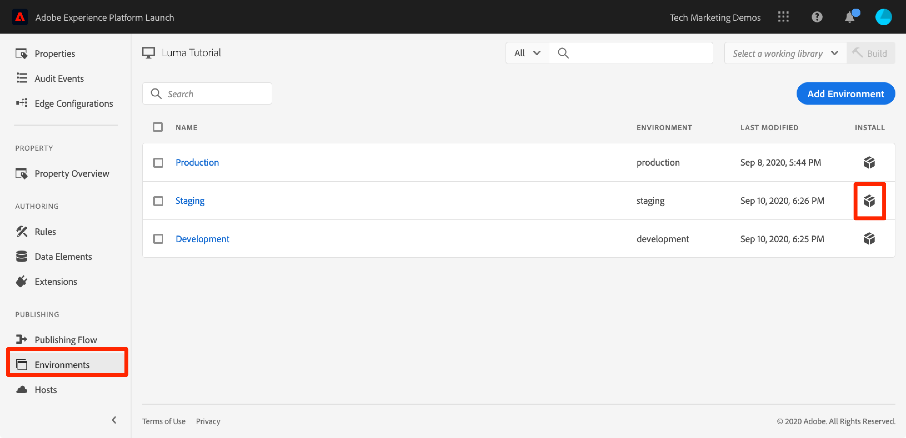
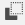

# De eigenschap tag publiceren

Nu u enkele belangrijke oplossingen van de Adobe Experience Cloud in uw ontwikkelomgeving hebt geïmplementeerd, is het tijd om de publicatieworkflow te leren.

>[!WARNING]
>
> Deze zelfstudie en de bijbehorende Luma-website-oefeningen blijven niet meer behouden en zijn afhankelijk van oudere JavaScript-bibliotheken. Om de huidige beste praktijken te leren, te gebruiken gelieve [&#x200B; Adobe Experience Cloud met het leerprogramma van SDK van het Web uit te voeren &#x200B;](https://experienceleague.adobe.com/en/docs/platform-learn/implement-web-sdk/overview).

## Leerdoelen

Aan het eind van deze les, zult u kunnen:

1. Een ontwikkelingsbibliotheek publiceren naar de testomgeving
1. Een testbibliotheek aan uw productiewebsite toewijzen met Foutopsporing
1. Een testbibliotheek publiceren naar de productieomgeving

## Publiceren naar gefaseerd

Nu u uw bibliotheek in de ontwikkelomgeving hebt gemaakt en gevalideerd, is het tijd om deze te publiceren naar Staging.

1. Ga naar de **[!UICONTROL Publishing Flow]** -pagina

1. Open het vervolgkeuzemenu naast uw bibliotheek en selecteer **[!UICONTROL Submit for Approval]**

   

1. Klik op de knop **[!UICONTROL Submit]** in het dialoogvenster:

   

1. De bibliotheek wordt nu in een niet-gebouwde staat in de kolom [!UICONTROL Submitted] weergegeven:

1. Open het vervolgkeuzemenu en selecteer **[!UICONTROL Build for Staging]** :

   

1. Zodra het pictogram met de groene stip wordt weergegeven, kunt u een voorvertoning van de bibliotheek weergeven in de testomgeving.

In een real-life scenario, zou de volgende stap in het proces typisch zijn om uw team te hebben QA de veranderingen in de het Opvoeren bibliotheek bevestigen. Ze kunnen dit doen met Foutopsporing.

**om de Veranderingen in de het Opvoeren Bibliotheek** te bevestigen

1. Open de pagina [!UICONTROL Environments] in de eigenschap Tag

1. In de [!UICONTROL Staging] rij, klik het Install pictogram  om modaal te openen

    te openen

1. Klik het pictogram van het Exemplaar  om de ingebedde code aan uw klembord te kopiëren

1. Klik op **[!UICONTROL Close]** om het modale

   

1. Open de [&#x200B; plaats van de Luminagedemo &#x200B;](https://luma.enablementadobe.com/content/luma/us/en.html) in uw browser van Chrome

1. Open de [&#x200B; Debugger van Experience Platform uitbreiding &#x200B;](https://chromewebstore.google.com/detail/adobe-experience-platform/bfnnokhpnncpkdmbokanobigaccjkpob) door het  pictogram te klikken

   

1. Ga naar het tabblad Gereedschappen

1. Plak in de sectie **[!UICONTROL Adobe Launch > Replace Launch Embed Code]** de code voor het insluiten van het plakken in het klembord
1. De **[!UICONTROL Apply across luma.enablementadobe.com]** -switch inschakelen

1. Klik op het schijfpictogram om op te slaan

    wordt getoond

1. Laad en controleer het Summiere lusje van Debugger opnieuw. Onder de sectie Starten ziet u nu dat de eigenschap Staging is geïmplementeerd en de naam van uw eigenschap (dat wil zeggen &#39;tagzelfstudie&#39; of een andere naam voor uw eigenschap) wordt weergegeven!

    wordt getoond

In het echte leven, zodra uw team QA door de veranderingen in het het Opvoeren milieu te herzien heeft afgemeld, is het tijd om aan productie te publiceren.

## Publiceren naar productie

1. Ga naar de [!UICONTROL Publishing] -pagina

1. Klik in het vervolgkeuzemenu op **[!UICONTROL Approve for Publishing]** :

   

1. Klik op de knop **[!UICONTROL Approve]** in het dialoogvenster:

   

1. De bibliotheek wordt nu in de kolom [!UICONTROL Approved] in de ongebouwde staat (gele punt) weergegeven:

1. Open het vervolgkeuzemenu en selecteer **[!UICONTROL Build and Publish to Production]** :

   

1. Klik op **[!UICONTROL Publish]** in het dialoogvenster:

   

1. De bibliotheek wordt nu in de kolom [!UICONTROL Published] weergegeven:

   

Dat is het! U hebt de zelfstudie voltooid en uw eerste eigenschap in tags gepubliceerd!
