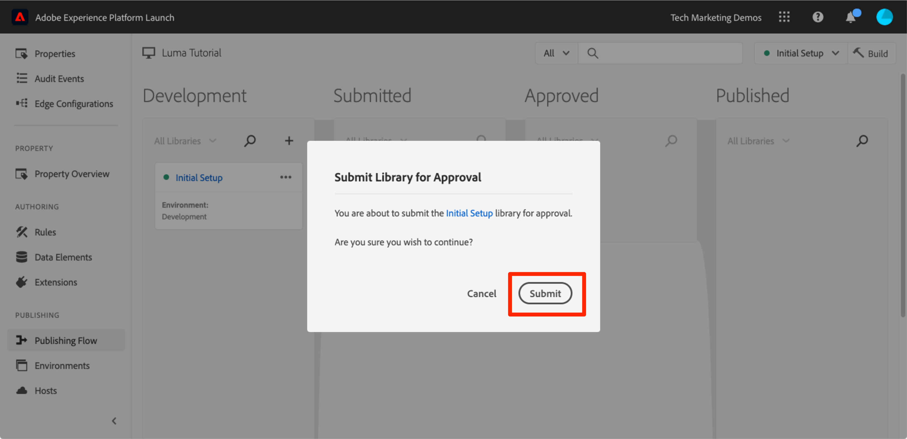
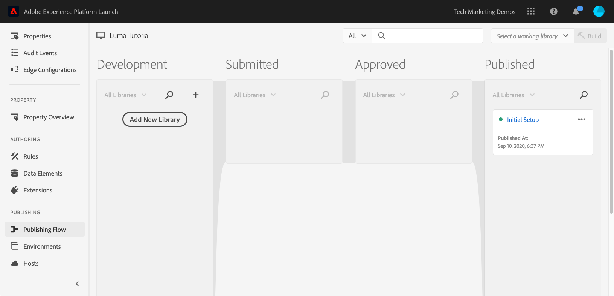

# De eigenschap tag publiceren

Nu u enkele belangrijke oplossingen van de Adobe Experience Cloud in uw ontwikkelomgeving hebt geïmplementeerd, is het tijd om de publicatieworkflow te leren.

>[!NOTE]
>
>Adobe Experience Platform Launch wordt in Adobe Experience Platform geïntegreerd als een reeks technologieën voor gegevensverzameling. Verschillende terminologiewijzigingen zijn geïmplementeerd in de interface die u tijdens het gebruik van deze inhoud moet onthouden:
>
> * Platform launch (clientzijde) is nu **[[!DNL tags]](https://experienceleague.adobe.com/docs/experience-platform/tags/home.html?lang=nl)**
> * Platform launch Server-zijde is nu **[[!DNL event forwarding]](https://experienceleague.adobe.com/docs/experience-platform/tags/event-forwarding/overview.html)**
> * Edge-configuraties zijn nu **[[!DNL datastreams]](https://experienceleague.adobe.com/docs/experience-platform/edge/fundamentals/datastreams.html)**

## Leerdoelen

Aan het eind van deze les, zult u kunnen:

1. Een ontwikkelingsbibliotheek publiceren naar de testomgeving
1. Een testbibliotheek aan uw productiewebsite toewijzen met Foutopsporing
1. Een testbibliotheek publiceren naar de productieomgeving

## Publiceren naar gefaseerd

Nu u uw bibliotheek in de ontwikkelomgeving hebt gemaakt en gevalideerd, is het tijd om deze te publiceren naar Staging.

1. Ga naar de **[!UICONTROL Publishing Flow]** page

1. Open het vervolgkeuzemenu naast uw bibliotheek en selecteer **[!UICONTROL Ter goedkeuring verzenden]**

   

1. Klik op de knop **[!UICONTROL Verzenden]** in het dialoogvenster:

   

1. Uw bibliotheek wordt nu weergegeven in [!UICONTROL Verzonden] kolom in ongebouwde staat:

1. Open het vervolgkeuzemenu en selecteer **[!UICONTROL Opbouwen voor fasering]**:

   

1. Zodra het pictogram met de groene stip wordt weergegeven, kunt u een voorvertoning van de bibliotheek weergeven in de testomgeving.

In een real-life scenario, zou de volgende stap in het proces typisch zijn om uw team te hebben QA de veranderingen in de het Opvoeren bibliotheek bevestigen. Ze kunnen dit doen met Foutopsporing.

**De wijzigingen in de testbibliotheek valideren**

1. Open in de eigenschap Tag de optie [!UICONTROL Omgevingen] page

1. In de [!UICONTROL Staging] rij, klik het Install pictogram  om het modale

   

1. Klik op het pictogram Copy  om de insluitcode naar het klembord te kopiëren

1. Klikken **[!UICONTROL Sluiten]** om het modale

   

1. Open de [Luma-demosite](https://luma.enablementadobe.com/content/luma/us/en.html) in uw Chrome-browser

1. Open de [Experience Platform debugger-extensie](https://chromewebstore.google.com/detail/adobe-experience-platform/bfnnokhpnncpkdmbokanobigaccjkpob) door op de knop  pictogram

   

1. Ga naar het tabblad Gereedschappen

1. In de **[!UICONTROL Adobe starten > Insluitcode starten vervangen]** de ingesloten code in het Klembord plakken
1. De knop **[!UICONTROL Toepassen op luma.enablementadobe.com]** switch

1. Klik op het schijfpictogram om op te slaan

   

1. Laad en controleer het Summiere lusje van Debugger opnieuw. Onder de sectie Starten ziet u nu dat de eigenschap Staging is geïmplementeerd en de naam van uw eigenschap (dat wil zeggen &#39;tagzelfstudie&#39; of een andere naam voor uw eigenschap) wordt weergegeven!

   

In het echte leven, zodra uw team QA door de veranderingen in het het Opvoeren milieu te herzien heeft afgemeld, is het tijd om aan productie te publiceren.

## Publiceren naar productie

1. Ga naar de [!UICONTROL Publiceren] page

1. Klik in het vervolgkeuzemenu op **[!UICONTROL Goedkeuren voor publicatie]**:

   

1. Klik op de knop **[!UICONTROL Goedkeuren]** in het dialoogvenster:

   

1. De bibliotheek wordt nu weergegeven in [!UICONTROL Goedgekeurd] kolom in ongebouwde staat (gele punt):

1. Open het vervolgkeuzemenu en selecteer **[!UICONTROL Samenstellen en publiceren naar productie]**:

   

1. Klik op de knop **[!UICONTROL Publiceren]** in het dialoogvenster:

   

1. De bibliotheek wordt nu weergegeven in [!UICONTROL Gepubliceerd] kolom:

   

Dat is het! U hebt de zelfstudie voltooid en uw eerste eigenschap in tags gepubliceerd!
