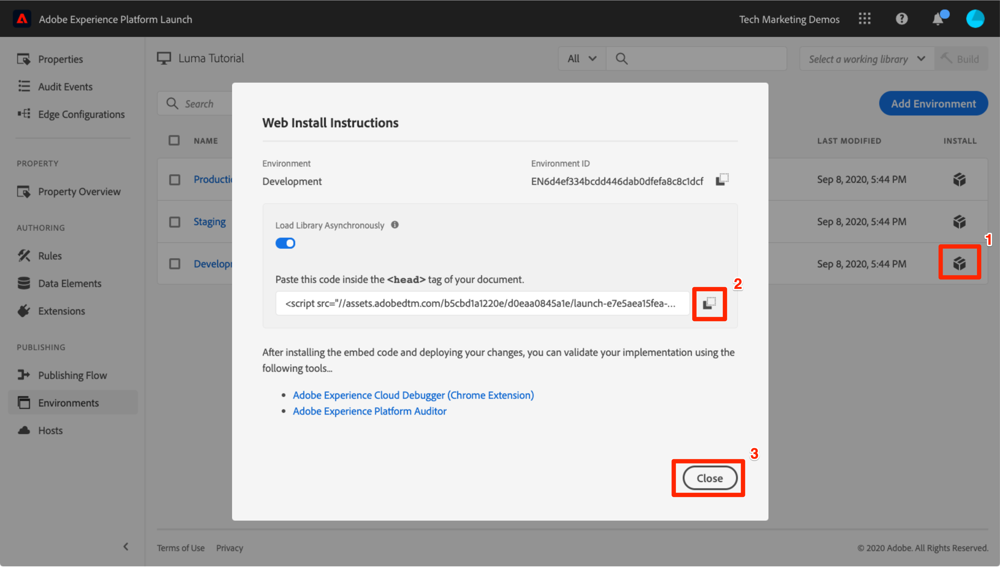

# Tagomgevingen wisselen met het Experience Cloud Debugger

In deze les zult u de [ uitbreiding van het Adobe Experience Platform Debugger ](https://chromewebstore.google.com/detail/adobe-experience-platform/bfnnokhpnncpkdmbokanobigaccjkpob) gebruiken om het markeringsbezit te vervangen dat op de [ Luministoeplaats ](https://luma.enablementadobe.com/content/luma/us/en.html) met uw eigen bezit wordt hard gecodeerd.

Deze techniek wordt omgevingsomschakeling genoemd en is later handig wanneer u met tags op uw eigen website werkt. U zult uw productiewebsite in uw browser, maar met uw *ontwikkelings* markeringsmilieu kunnen laden. Hierdoor kunt u met vertrouwen wijzigingen in tags doorvoeren en valideren, onafhankelijk van uw reguliere code-releases.  Per slot van rekening is deze scheiding van marketing markeringsversies van uw regelmatige codeversies één van de belangrijkste redenen klanten in de eerste plaats labels gebruiken!

>[!NOTE]
>
>Adobe Experience Platform Launch wordt in Adobe Experience Platform geïntegreerd als een reeks technologieën voor gegevensverzameling. Verschillende terminologiewijzigingen zijn geïmplementeerd in de interface die u tijdens het gebruik van deze inhoud moet onthouden:
>
> * Platform launch (de Kant van de Cliënt) is nu **[[!DNL tags]](https://experienceleague.adobe.com/docs/experience-platform/tags/home.html?lang=nl)**
> * De Server zijde van de platform launch is nu **[[!DNL event forwarding]](https://experienceleague.adobe.com/docs/experience-platform/tags/event-forwarding/overview.html?lang=nl-NL)**
> * De configuraties van Edge zijn nu **[[!DNL datastreams]](https://experienceleague.adobe.com/docs/experience-platform/edge/fundamentals/datastreams.html?lang=nl-NL)**

## Leerdoelen

Aan het eind van deze les, zult u kunnen:

* Foutopsporing gebruiken om een andere tagomgeving te laden
* Gebruik Foutopsporing om te controleren of u een andere tagomgeving hebt geladen

## Krijg URL van uw Milieu van de Ontwikkeling

1. Open de pagina `Environments` in de eigenschap Tag

1. In de **[!UICONTROL Development]** rij, klik het Install pictogram  om modaal te openen

1. Klik het pictogram van het Exemplaar  om de ingebedde code aan uw klembord te kopiëren

1. Klik op **[!UICONTROL Close]** om het modale

   

## De URL van de tag op de demopsite van Luma vervangen

1. Open de [ plaats van de Luminagedemo ](https://luma.enablementadobe.com/content/luma/us/en.html) in uw browser van Chrome

1. Open de [ Debugger van het Experience Platform uitbreiding ](https://chromewebstore.google.com/detail/adobe-experience-platform/bfnnokhpnncpkdmbokanobigaccjkpob) door het  pictogram te klikken

   

1. De momenteel geïmplementeerde eigenschap tag wordt weergegeven op het tabblad Overzicht

    wordt getoond

1. Ga naar het tabblad Gereedschappen
1. Naar de sectie schuiven **[!UICONTROL Replace Launch Embed Code]**
1. Zorg ervoor dat het Chrome-tabblad met de Luminantiesite de focus heeft achter Foutopsporing (niet het tabblad met deze zelfstudie of het tabblad met de interface voor gegevensverzameling).  Plak de insluitcode in het klembord in het invoerveld
1. Schakel de functie Toepassen op luma.enablementadobe.com in en uit, zodat alle pagina&#39;s op de Luministsite worden toegewezen aan uw tag-eigenschap
1. Klik op de knop **[!UICONTROL Save]**

    wordt getoond

1. Laad de Luminasite opnieuw en controleer het tabblad Samenvatting van Foutopsporing. Onder de sectie van de Lancering, zou u uw Bezit van de Ontwikkeling nu moeten zien wordt gebruikt. Bevestig dat zowel de Naam van het bezit van u als dat het Milieu &quot;ontwikkeling&quot;zegt.

    wordt getoond

>[!NOTE]
>
>De foutopsporing slaat deze configuratie op en vervangt de insluitcodes van de tag wanneer u terugkeert naar de Luministensite. Het heeft geen invloed op andere sites die u in andere geopende tabbladen bezoekt. Als u wilt voorkomen dat Foutopsporing de insluitcode vervangt, klikt u op de knop **[!UICONTROL Remove]** naast de insluitcode op het tabblad Extra van Foutopsporing.

Terwijl u de zelfstudie voortzet, gebruikt u deze techniek om de Luministsite toe te wijzen aan uw eigen tageigenschap om de implementatie van de tag te valideren. Wanneer u labels gaat gebruiken op uw productiewebsite, kunt u met dezelfde techniek wijzigingen valideren.

[Volgende &quot;Voeg de Adobe Experience Platform Identity Service toe&quot; >](id-service.md)
