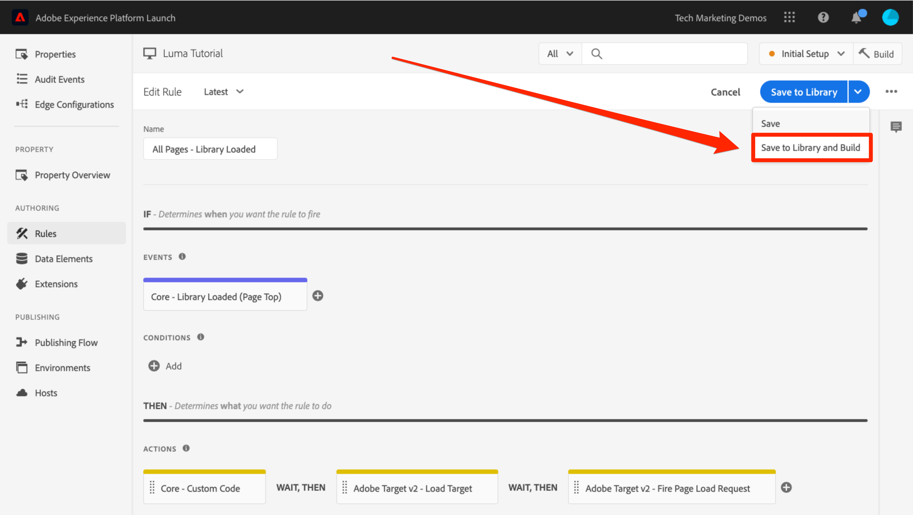
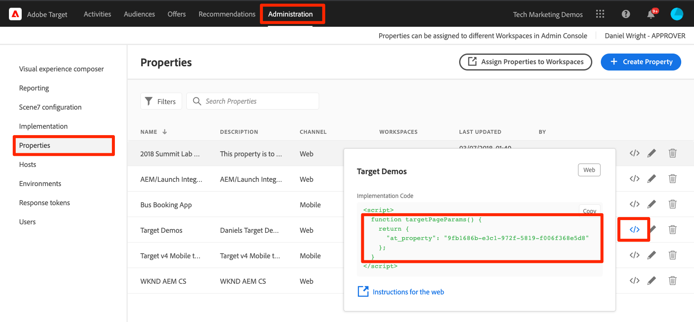
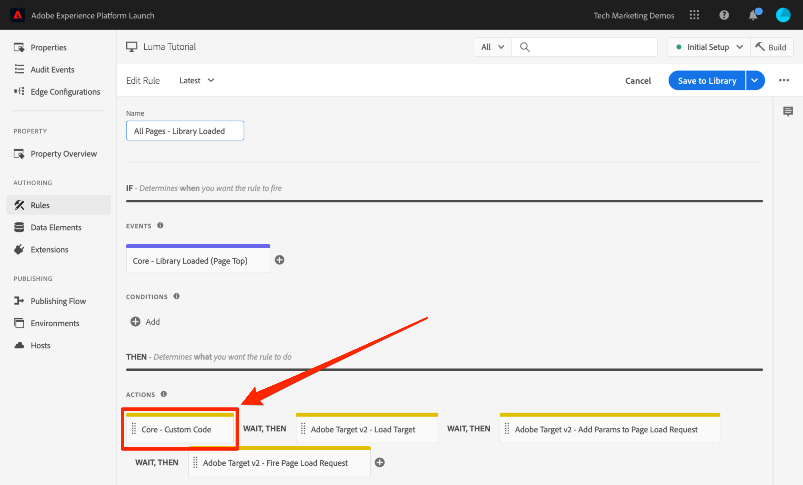

# Adobe Target toevoegen

In deze les, zullen wij de [ uitbreiding van Adobe Target ](https://experienceleague.adobe.com/docs/experience-platform/tags/extensions/adobe/target/overview.html) met een verzoek van de paginading en douaneparameters uitvoeren.

[ Adobe Target ](https://experienceleague.adobe.com/docs/target/using/target-home.html) is de oplossing van Adobe Experience Cloud die alles verstrekt u uw klanten&#39; ervaring moet aanpassen en personaliseren, zodat kunt u opbrengst op uw Web en mobiele plaatsen, apps, sociale media, en andere digitale kanalen maximaliseren.

>[!NOTE]
>
>Adobe Experience Platform Launch wordt in Adobe Experience Platform geïntegreerd als een reeks technologieën voor gegevensverzameling. Verschillende terminologiewijzigingen zijn geïmplementeerd in de interface die u tijdens het gebruik van deze inhoud moet onthouden:
>
> * Platform launch (clientzijde) is nu **[!DNL tags]**
> * Platform launch Server-zijde is nu **[!DNL event forwarding]**
> * Edge-configuraties zijn nu **[!DNL datastreams]**

## Leerdoelen

Aan het eind van deze les, zult u kunnen:

* Voeg het vooraf verborgen fragment toe dat wordt gebruikt voor het beheren van flikkering wanneer u Doel gebruikt met asynchrone tags insluiten-codes
* De extensie Doel v2 toevoegen
* Vuur de aanvraag voor het laden van de pagina aan (voorheen &quot;global mbox&quot; genoemd)
* Parameters toevoegen aan de aanvraag voor het laden van de pagina
* Beschrijf hoe profiel- en entiteitsparameters kunnen worden toegevoegd aan het verzoek om pagina te laden
* Geef de vereiste parameters op voor het bevestigen van de bestelling
* Uitleggen hoe u geavanceerde configuraties, zoals Bibliotheekkoptekst en Bibliotheekvoettekst, kunt toevoegen
* Een doelimplementatie valideren

## Vereisten

Om de lessen in deze sectie te voltooien, moet u de lessen in [ eerst voltooien vormen markeringen ](create-a-property.md) en [ de Dienst van de Identiteit ](id-service.md) toevoegen.

## Het vooraf verborgen doelfragment toevoegen

Voordat we aan de slag kunnen, moeten we de code voor het insluiten van tags enigszins bijwerken. Wanneer de code-insluitcodes asynchroon worden geladen, is de rendering van de pagina mogelijk voltooid voordat de doelbibliotheek volledig is geladen en de inhoud ervan is omgewisseld. Dit kan leiden tot wat &quot;flikkering&quot;wordt genoemd waar de standaardinhoud kort toont alvorens door de gepersonaliseerde inhoud wordt vervangen die door Doel wordt gespecificeerd. Als u deze flikkering wilt vermijden, raden we u ten zeerste aan een speciaal vooraf verborgen fragment hard te coderen vlak voor de asynchrone insluitcodes van tags.

Dit is al gedaan op de plaats van de Luma, maar laten we verdergaan en dit op de steekproefpagina doen zodat begrijpt u de implementatie. Kopieer de volgende coderegels:

```html
<script>
   //prehiding snippet for Adobe Target with asynchronous tags deployment
   ;(function(win, doc, style, timeout) {
   var STYLE_ID = 'at-body-style';
   function getParent() {
      return doc.getElementsByTagName('head')[0];
   }
   function addStyle(parent, id, def) {
      if (!parent) {
      return;
      }
      var style = doc.createElement('style');
      style.id = id;
      style.innerHTML = def;
      parent.appendChild(style);
   }
   function removeStyle(parent, id) {
      if (!parent) {
      return;
      }
      var style = doc.getElementById(id);
      if (!style) {
      return;
      }
      parent.removeChild(style);
   }
   addStyle(getParent(), STYLE_ID, style);
   setTimeout(function() {
      removeStyle(getParent(), STYLE_ID);
   }, timeout);
   }(window, document, "body {opacity: 0 !important}", 3000));
</script>
```

Open de voorbeeldpagina en plak deze vlak voor de code die u met de tag insluit, zoals hieronder wordt weergegeven (maak je geen zorgen als de regelnummers verschillend zijn). In deze schermafbeelding is het voorverborgen fragment geminiatuurd:


Laad de voorbeeldpagina opnieuw. De pagina wordt drie seconden verborgen voordat deze wordt weergegeven. Dit gedrag is tijdelijk en zal verdwijnen nadat u Doel hebt opgesteld. Dit gedrag voor het voorverbergen wordt beheerd door twee configuraties helemaal aan het einde van het fragment, die kunnen worden aangepast maar meestal het beste links blijven bij de standaardinstellingen:

* `body {opacity: 0 !important}` geeft de css-definitie aan die moet worden gebruikt voor het vooraf verbergen totdat Doel wordt geladen. Standaard wordt het gehele lichaam verborgen. Als u een verenigbare DOM structuur met een gemakkelijk identificeerbaar containerelement hebt dat alle inhoud onder uw navigatie verpakt, bijvoorbeeld, en u nooit uw navigatie wilde testen of personaliseren, kon u dit plaatsen gebruiken om het pre-verbergen tot dat containerelement te beperken.
* `3000` die de time-out-instelling voor het voorverbergen opgeeft. Als Doel niet in drie seconden is geladen, wordt de pagina standaard weergegeven. Dit zou zeer zeldzaam moeten zijn.

Voor meer details en om het niet-geminiatuurde pre-verbergende fragment te verkrijgen, te zien gelieve [ de uitbreiding van Adobe Target met een asynchrone plaatsing &#x200B; ](https://experienceleague.adobe.com/docs/experience-platform/tags/extensions/adobe/target/overview.html#adobe-target-extension-with-an-asynchronous-deployment).

## De doelextensie toevoegen

De Adobe Target-extensie ondersteunt client-side implementaties met behulp van de JavaScript SDK van Target voor het moderne web, at.js. De klanten nog die de oudere bibliotheek van het Doel, mbox.js gebruiken, [ zouden aan at.js 2.x ](https://experienceleague.adobe.com/docs/target/using/implement-target/client-side/mbox-implement/migrate-mbox/target-atjs-implementation.html) moeten bevorderen om markeringen te gebruiken.

De extensie Doel v2 bestaat uit twee hoofdonderdelen:

1. De extensieconfiguratie die de kernbibliotheekinstellingen beheert
1. Handelingen van de regel om het volgende te doen:
   1. Doel laden (at.js 2.x)
   1. Params toevoegen aan verzoeken om pagina te laden
   1. Params toevoegen aan alle aanvragen
   1. Aanvraag voor laden van brandbluspagina

In deze eerste oefening zullen wij de uitbreiding toevoegen en de configuraties bekijken. In latere oefeningen zullen wij de acties gebruiken.

**om de Uitbreiding** toe te voegen

1. Ga naar **[!UICONTROL Extensions > Catalog]**
1. Typ `target` in het filter om snel de Adobe Target-extensies te zoeken. Er zijn twee extensies: Adobe Target en Adobe Target v2. In deze zelfstudie wordt de v2-versie van de extensie gebruikt die de nieuwste versie van at.js (momenteel 2.x) gebruikt. Deze versie is ideaal voor traditionele websites en toepassingen van één pagina (SPA).
1. Klikken **[!UICONTROL Install]**

   

1. Wanneer u de extensie toevoegt, worden veel, maar niet alle at.js-instellingen uit de doelinterface geïmporteerd, zoals hieronder wordt weergegeven. Eén instelling die niet wordt geïmporteerd, is de Time-out, die altijd 3000 ms zal duren nadat de extensie is toegevoegd. Laat de standaardinstellingen voor de zelfstudie ongewijzigd. Opmerking: aan de linkerkant ziet u de versie at.js die wordt meegeleverd bij de huidige versie van de extensie.

1. Klikken **[!UICONTROL Save to Library]**

   

Op dit moment doet Target niets, dus is er niets te valideren.

>[!NOTE]
>
>Elke versie van de extensie Doel wordt geleverd met een specifieke versie van at.js. Deze versie wordt vermeld in de extensiebeschrijving. U werkt de versie at.js bij door de uitbreiding van het Doel bij te werken.

## Doel laden en verzoek pagina laden afvuren

Marketers gebruiken Doel om de bezoekerservaring op de pagina te bepalen wanneer ze inhoud testen en als doel instellen. Vanwege deze belangrijke rol in de weergave van de pagina, moet u Doel zo vroeg mogelijk laden om de invloed op de zichtbaarheid van de pagina te minimaliseren. In deze sectie wordt de JavaScript-doelbibliotheek—at.js—geladen en wordt de aanvraag voor het laden van de pagina uitgevoerd (in eerdere versies van at.js wordt deze &#39;&#39;global mbox&#39;&#39; genoemd).

U kunt de `All Pages - Library Loaded` regel gebruiken u in de les &quot;[ creeerde voegt de Elementen van Gegevens, Regels en Bibliotheken ](add-data-elements-rules.md)&quot;toe om Doel uit te voeren omdat het reeds zo vroeg mogelijk op paginaladading wordt teweeggebracht.

**om Doel** te laden

1. Ga naar de **[!UICONTROL Rules]** in de linkernavigatie en klik vervolgens op `All Pages - Library Loaded` om de regeleditor te openen

   

1. Onder Acties, klik  om een nieuwe actie toe te voegen

   

1. Selecteren **[!UICONTROL Extension > Adobe Target v2]**

1. Selecteren **[!UICONTROL Action Type > Load Target]**

1. Klikken **[!UICONTROL Keep Changes]**

   

Als de handeling `Load Target` is toegevoegd, wordt at.js geladen op de pagina. Er worden echter geen doelverzoeken geactiveerd totdat de handeling `Fire Page Load Request` wordt toegevoegd.

**om het Verzoek van de Lading van de Pagina te vuur te nemen**

1. Onder Acties, klik  opnieuw om een andere actie toe te voegen

   

1. Selecteren **[!UICONTROL Extension > Adobe Target v2]**

1. Selecteren **[!UICONTROL Action Type > Fire Page Load Request]**

1. Er zijn enkele configuraties beschikbaar voor de aanvraag voor het laden van de pagina die betrekking hebben op het al dan niet verbergen van de pagina en de CSS-kiezer voor het vooraf verbergen. Deze instellingen werken in combinatie met het vooraf verborgen fragment dat op de pagina is gecodeerd. Laat de standaardinstellingen staan.

1. Klikken **[!UICONTROL Keep Changes]**

   

1. De nieuwe handeling wordt na de handeling `Load Target` in de juiste volgorde toegevoegd en de handelingen worden in deze volgorde uitgevoerd. U kunt de handelingen slepen en neerzetten om de volgorde te wijzigen, maar in dit scenario moet `Load Target` zich vóór `Fire Page Load Request` bevinden.

1. Klikken **[!UICONTROL Save to Library and Build]**

   

### De aanvraag voor het laden van de pagina valideren

Nu u de extensie Doel v2 hebt toegevoegd en de handelingen `Load Target` en `Fire Page Load Request` hebt geactiveerd, moet er een aanvraag voor het laden van de pagina worden ingediend op alle pagina&#39;s waar de eigenschap Tag wordt gebruikt.

**om de Acties van het Verzoek van de Lading van het Doel van de Lading en van de Pagina van de Vuur te bevestigen**

1. Laad de voorbeeldpagina opnieuw. Er wordt niet langer een vertraging van drie seconden weergegeven voordat de pagina zichtbaar is. Als u de voorbeeldpagina laadt met behulp van het `file://` -protocol, moet u deze stap uitvoeren in Firefox- of Safari-browsers, omdat Chrome geen aanvraag voor Doel uitvoert bij gebruik van het `file://` -protocol.

1. Open de [ plaats van de Luma ](https://luma.enablementadobe.com/content/luma/us/en.html)

1. Zorg ervoor debugger het markeringsbezit aan *in kaart brengt uw* milieu van de Ontwikkeling, zoals die in de [ vroegere les ](switch-environments.md) wordt beschreven

   

1. Ga naar het tabblad Overzicht van Foutopsporing

1. Bevestig in de sectie `Launch` dat `Target` onder de kop `Extensions` wordt weergegeven

1. Controleer in de sectie `Target` of de bibliotheekversie van at.js wordt weergegeven

    verschijnt

1. Tot slot ga naar het lusje `Target`, breid uw cliëntcode uit, en bevestig uw paginaladingsverzoek verschijnt:

   

Gefeliciteerd! U hebt Target geïmplementeerd!

## Parameters toevoegen

Het overgaan van parameters in het verzoek van het Doel voegt krachtige mogelijkheden aan uw het richten, het testen, en verpersoonlijkingsactiviteiten toe. De tagextensie biedt twee acties om parameters door te geven:

1. `Add Params to Page Load Request`, die parameters aan de verzoeken van de paginading toevoegt (gelijkwaardig aan [ targetPageParams () ](https://experienceleague.adobe.com/docs/target/using/implement-target/client-side/functions-overview/cmp-atjs-functions.html) methode)

1. `Add Params to All Requests`, die parameters in alle verzoeken van het Doel toevoegt, bijvoorbeeld het verzoek van de paginalading plus extra verzoeken die van de acties van de Code van de Douane worden gemaakt of op uw plaats (gelijkwaardig aan [ targetPageParamsAll () ](https://experienceleague.adobe.com/docs/target/using/implement-target/client-side/functions-overview/cmp-atjs-functions.html) methode) worden gehard

Deze acties kunnen *vóór* de `Load Target` actie worden gebruikt en kunnen verschillende parameters op verschillende pagina&#39;s plaatsen die op uw regelconfiguraties worden gebaseerd. Gebruik de functie voor het ordenen van regels die u hebt gebruikt bij het instellen van id&#39;s van klanten met de identiteitsservice om aanvullende parameters in te stellen voor de gebeurtenis `Library Loaded` voordat de regel wordt geactiveerd die de aanvraag voor het laden van de pagina afvaagt.
>[!TIP]
>
>Aangezien de meeste implementaties de aanvraag voor het laden van de pagina gebruiken voor het leveren van activiteiten, volstaat het doorgaans alleen om de handeling `Add Params to Page Load Requests` te gebruiken.

### Parameters aanvragen (mbox)

De parameters worden gebruikt om douanegegevens tot Doel over te gaan, die uw verpersoonlijkingsmogelijkheden verrijken. Ze zijn ideaal voor kenmerken die tijdens een bladersessie vaak veranderen, zoals de paginanaam, sjabloon, enzovoort. en niet blijven bestaan.

Voeg het `Page Name` gegevenselement toe dat wij vroeger in [ creeerden de Elementen van Gegevens, Regels en van Bibliotheken ](add-data-elements-rules.md) les als verzoekparameter.

**om de verzoekparameter** toe te voegen

1. Ga naar **[!UICONTROL Rules]** in de linkernavigatie en klik dan op `All Pages - Library Loaded` om de regelredacteur te openen.

   

1. Onder Acties, klik  om een nieuwe actie toe te voegen

   

1. Selecteren **[!UICONTROL Extension > Adobe Target v2]**

1. Selecteren **[!UICONTROL Action Type > Add Params to Page Load Request]**

1. Voer `pageName` in als de **[!UICONTROL Name]**

1. Klik het  om het gegevenselement modaal te openen

1. Klik op het gegevenselement `Page Name`

1. Klik op de knop **[!UICONTROL Select]**

   

1. Klikken **[!UICONTROL Keep Changes]**

   

1. Klik en sleep op de linkerrand van de handeling `Add Params to Page Load Request` om de acties vóór de handeling `Fire Page Load Request` opnieuw te rangschikken (dit kan voor of na `Load Target` zijn)

1. Klikken **[!UICONTROL Save to Library and Build]**

   

#### Aanvraagparameters valideren

Voor het tijd-zijn, zijn de douaneparameters die met at.js 2.x- verzoeken worden overgegaan niet gemakkelijk zichtbaar in Debugger, zodat zullen wij de ontwikkelaarshulpmiddelen van browser gebruiken.

**om de pageName verzoekparameter** te bevestigen

1. Laad de Luma-site opnieuw, zorg dat deze is toegewezen aan uw eigen tag-eigenschap
1. De ontwikkelaarsgereedschappen van uw browser openen
1. Klik op het tabblad Netwerk
1. Filter de aanvragen naar `tt.omtrdc` (of uw CNAME-domein voor doelaanvragen)
1. Vouw de sectie `Headers` > `Request Payload` > `execute.pageLoad.parameters` uit om de parameter en waarde van `pageName` te valideren


<!--Now go to the **[!UICONTROL Target]** tab in the Debugger. Expand your client code and look at the requests. You should see the new `pageName` parameter passed in the request:

-->

### Profielparameters

Net als bij aanvraagparameters worden profielparameters ook doorgegeven via de aanvraag Doel. Nochtans, worden de profielparameters opgeslagen in het gegevensbestand van het de bezoekersprofiel van het Doel en zullen voor de [ duur van het profiel van de bezoeker ](https://experienceleague.adobe.com/docs/target/using/audiences/visitor-profiles/visitor-profile-lifetime.html) blijven. U kunt ze instellen op de ene pagina van uw site en ze gebruiken in doelactiviteiten op een andere pagina. Hier is een voorbeeld van een automobielwebsite. Wanneer een bezoeker naar een pagina met voertuigen gaat, kunt u een profielparameter &quot;profile.lastViewed=sportscar&quot; doorgeven om de interesse van de bezoeker in dat voertuig te registreren. Wanneer de bezoeker naar andere, niet-voertuigpagina&#39;s bladert, kunt u inhoud als doel instellen op basis van het laatst bekeken voertuig.  Profielparameters zijn ideaal voor kenmerken die zelden worden gewijzigd of die alleen beschikbaar zijn op bepaalde pagina&#39;s

In deze zelfstudie zult u geen profielparameters doorgeven, maar de workflow is bijna gelijk aan wat u zojuist hebt gedaan bij het doorgeven van de parameter `pageName` . Het enige verschil is dat u parameternamen voor profielen een voorvoegsel `profile.` moet geven. Zo ziet een profielparameter met de naam &quot;userType&quot; eruit in de handeling `Add Params to Page Load Request` :


### Entiteitsparameters

De parameters van de entiteit zijn speciale parameters die in [ Recommendations implementaties ](https://experienceleague.adobe.com/docs/target/using/recommendations/plan-implement.html) om drie belangrijke redenen worden gebruikt:

1. Als sleutel om productaanbevelingen teweeg te brengen. Als u bijvoorbeeld een aanbevolen algoritme gebruikt, zoals &quot;Mensen die Product X bekeken, ook Y bekeken,&quot;, is &quot;X&quot; de &quot;sleutel&quot; van de aanbeveling. Meestal is het de productsku (`entity.id`) of categorie (`entity.categoryId`) die de bezoeker momenteel bekijkt.
1. Om het gedrag van de bezoeker aan machtsaanbevelingen algoritmen, zoals &quot;Onlangs Bekeken Producten&quot;of &quot;Meest Bekeken Producten te verzamelen
1. De Recommendations-catalogus vullen. Recommendations bevat een database van alle producten of artikelen op uw website, zodat deze in de aanbevolen aanbieding kunnen worden gebruikt. Bijvoorbeeld, wanneer het adviseren van producten, wilt u typisch attributen zoals de productnaam (`entity.name`) en beeld (`entity.thumbnailUrl`) tonen. Sommige klanten vullen hun catalogus in met back-endfeeds, maar ze kunnen ook worden gevuld met eenheidsparameters in Target-aanvragen.

U hoeft geen entiteitsparameters in deze zelfstudie door te geven, maar de workflow is gelijk aan wat u eerder hebt gedaan toen u de parameter `pageName` request doorgaf—maar geef de parameter een naam die vooraf is ingesteld op &quot;entiteit&quot;. en deze aan het relevante gegevenselement toewijzen. Merk op dat sommige gemeenschappelijke entiteiten gereserveerde namen hebben die moeten worden gebruikt (bijvoorbeeld entiteit.id voor de productsku). Dit is wat het zou kijken als plaatsen entiteitsparameters in de `Add Params to Page Load Request` actie:


### Parameters van klant-id toevoegen

De inzameling van klantenidentiteitskaart met de Dienst van de Identiteit van Adobe Experience Platform maakt het gemakkelijk om de gegevens van CRM in Doel in te voeren gebruikend de [ eigenschap van de Attributen van de Klant ](https://experienceleague.adobe.com/docs/target/using/audiences/visitor-profiles/working-with-customer-attributes.html) van Adobe Experience Cloud. Het laat ook [ dwars-apparatenbezoeker toe die ](https://experienceleague.adobe.com/docs/target/using/integrate/experience-cloud-device-co-op.html) stitching, u toestaat om een verenigbare gebruikerservaring te handhaven aangezien uw klanten tussen hun laptops en hun mobiele apparaten schakelen.

Het is absoluut noodzakelijk om de klant-id in te stellen in de actie `Set Customer IDs` van de identiteitsservice voordat de aanvraag voor het laden van de pagina wordt geactiveerd. Zorg er daarom voor dat u de volgende mogelijkheden op uw site hebt:

* De klant-id moet beschikbaar zijn op de pagina voordat de tags Code insluiten
* De extensie Adobe Experience Platform Identity Service moet zijn geïnstalleerd
* U moet de handeling `Set Customer IDs` gebruiken in een regel die wordt geactiveerd bij de gebeurtenis &quot;Bibliotheek geladen (Pagina boven)&quot;
* Gebruik de `Fire Page Load Request` actie in een regel die *na* de &quot;Vastgestelde actie van identiteitskaart van de Klant&quot;in brand steekt

In de vorige les, [ voeg de Dienst van de Identiteit van Adobe Experience Platform ](id-service.md) toe, creeerde u de `All Pages - Library Loaded - Authenticated - 10` regel om de &quot;Vastgestelde identiteitskaart van de Klant&quot;actie in brand te steken. Omdat deze regel een `Order` instelling `10` heeft, worden de id&#39;s van de klant ingesteld voordat onze aanvraag voor het laden van de pagina door de `All Pages - Library Loaded` -regel wordt geactiveerd met de `Order` instelling `50` . U hebt dus al de collectie van klantid&#39;s voor Target geïmplementeerd!

#### De klant-id valideren

Voor het tijd-zijn, zijn de douaneparameters die met at.js 2.x- verzoeken worden overgegaan niet gemakkelijk zichtbaar in Debugger, zodat zullen wij de ontwikkelaarshulpmiddelen van browser gebruiken.

**om identiteitskaart van de Klant** te bevestigen

1. Open de [ plaats van de Luma ](https://luma.enablementadobe.com/content/luma/us/en.html)

1. Zorg ervoor debugger het markeringsbezit aan *in kaart brengt uw* milieu van de Ontwikkeling, zoals die in de [ vroegere les ](switch-environments.md) wordt beschreven

   

1. Meld u aan bij de Luministensite met de referenties `test@adobe.com`/`test`
1. Terugkeer aan de [ homepage van Luma ](https://luma.enablementadobe.com/content/luma/us/en.html)

1. De ontwikkelaarsgereedschappen van uw browser openen
1. Klik op het tabblad Netwerk
1. Filter de aanvragen naar `tt.omtrdc` (of uw CNAME-domein voor doelaanvragen)
1. Vouw het gedeelte `Headers` > `Request Payload` > `id.customerIds.0` uit om de instellingen en waarde voor de id van de klant te valideren:


<!--
1. Open the Debugger
1. Go to the Target tab
1. Expand your client code
1. You should see parameters in the latest Target request for `vst.crm_id.id` and `vst.crm_id.authState`. `vst.crm_id.id` should have a value of the hashed email address and `vst.crm_id.authState` should have a value of `1` to represent `authenticated`. Note that `crm_id` is the `Integration Code` you specified in the Identity Service configuration and must align with the key you use in your [Customer Attributes data file](https://experienceleague.adobe.com/docs/core-services/interface/customer-attributes/t-crs-usecase.html):


-->

>[!WARNING]
>
>Met de Adobe Experience Platform Identity Service kunt u meerdere id&#39;s naar de Service verzenden. Alleen de eerste id wordt echter naar Target verzonden.

### De parameter voor het token van eigenschappen toevoegen

>[!NOTE]
>
>Dit is een optionele exercitie voor Target Premium-klanten.

Het bezitstoken is een gereserveerde parameter die met de 1&rbrace; eigenschap van de Toestemmingen van de Gebruiker van de Onderneming van de Premium van het Doel [ wordt gebruikt. ](https://experienceleague.adobe.com/docs/target/using/administer/manage-users/enterprise/property-channel.html) Het wordt gebruikt om verschillende digitale eigenschappen te bepalen zodat de verschillende leden van een Organisatie van het Experience Cloud verschillende toestemmingen op elk bezit kunnen worden toegewezen. U wilt bijvoorbeeld dat één groep gebruikers doelactiviteiten kan instellen op uw website, maar niet in uw mobiele toepassing.

De eigenschappen van het doel zijn analoog aan etiketeigenschappen en de rapportreeksen van Analytics. Een onderneming met meerdere merken, websites en marketingteams kan voor elke website of mobiele app een andere doeleigenschap, tag-eigenschap en analytische rapportsuite gebruiken. De eigenschappen van markeringen worden onderscheiden door hun insluitcodes, de rapportreeksen van Analytics worden onderscheiden door hun identiteitskaart van de rapportreeks, en de eigenschappen van het Doel worden verschillend door hun bezit symbolische parameter.


Het eigenschapstoken moet worden geïmplementeerd met behulp van een aangepaste code in tags met de functie `targetPageParams()` . Als u veelvoudige plaatsen met verschillend gebruikend verschillende at_property waarden met één enkel markeringsbezit uitvoert, kon u de at_property waarde via een gegevenselement beheren.

Hier volgt een optionele oefening als u een klant van de Premium van het Doel bent en een bezitstoken in uw bezit van de Zelfstudie zou willen uitvoeren:

1. Open de gebruikersinterface Doel op een apart tabblad

1. Ga naar **[!UICONTROL Administration > Properties]**

1. Identificeer het bezit dat u wilt gebruiken en **[!UICONTROL </>]** klikken (of een nieuwe bezit creëren)

1. Kopieer het codefragment in de `<script></script>` naar het klembord

   

1. Ga op het tabblad Codes naar de **[!UICONTROL Rules]** in de linkernavigatie en klik vervolgens op `All Pages - Library Loaded` om de regeleditor te openen.

   

1. Klik onder Handelingen op de handeling `Core - Custom Code` om de handeling `Action Configuration` te openen

   

1. Open de code-editor en plak de code in de doelinterface met de functie `targetPageParams()`
1. Klik op de knop **[!UICONTROL Save]**

   

1. Schakel het selectievakje **[!UICONTROL Execute globally]** in zodat `targetPageParams()` wordt gedeclareerd in het algemene bereik
1. Klikken **[!UICONTROL Keep Changes]**

   

1. Klikken **[!UICONTROL Save to Library and Build]**
   

>[!WARNING]
>
>Als u probeert om de `at_property` parameter via de **[!UICONTROL Add Params to Page Load Request]** actie toe te voegen, zal de parameter in het netwerkverzoek bevolken maar Composer van de Visuele Ervaring van het Doel (VEC) zal niet het automatisch kunnen ontdekken wanneer het laden van de pagina. Vul `at_property` altijd in met behulp van de functie `targetPageParams()` in een handeling Aangepaste code.

#### Eigenschaptoken valideren

Voor het tijd-zijn, zijn de douaneparameters die met at.js 2.x- verzoeken worden overgegaan niet gemakkelijk zichtbaar in Debugger, zodat zullen wij de ontwikkelaarshulpmiddelen van browser gebruiken.

**om de Symbolische parameter van het Bezit te bevestigen**

1. Open de [ plaats van de Luma ](https://luma.enablementadobe.com/content/luma/us/en.html)
1. Zorg ervoor debugger het markeringsbezit aan *in kaart brengt uw* milieu van de Ontwikkeling, zoals die in de [ vroegere les ](switch-environments.md) wordt beschreven

   

1. De ontwikkelaarsgereedschappen van uw browser openen
1. Klik op het tabblad Netwerk
1. Filter de aanvragen naar `tt.omtrdc` (of uw CNAME-domein voor doelaanvragen)
1. Vouw de sectie `Headers` > `Request Payload` > `property.token` uit om de waarde te valideren
    moeten zichtbaar zijn

<!--
1. Go to the `Target` tab
1. Expand your client code
1. You should see the parameter for "at_property" in every page load request request as you browse the site:

-->

## Aangepaste verzoeken toevoegen

### Een aanvraag voor een orderbevestiging toevoegen

Het verzoek om bevestiging van de bestelling is een speciaal type verzoek dat wordt gebruikt om ordergegevens naar Target te verzenden. De opneming van drie specifieke verzoekparameters-orderId, orderTotal, en productPurchasedId-is wat een regelmatig verzoek van het Doel in een ordeverzoek omzet. Naast de opbrengsten van de rapportage, doet het verzoek om opdracht ook het volgende:

1. De-dupliceert toevallige orde opnieuw indient
1. Filtert extreme orders (elke volgorde waarvan het totaal meer dan drie standaardafwijkingen van het gemiddelde was)
1. Gebruikt een ander algoritme achter de schermen om het statistische vertrouwen te berekenen
1. Hiermee maakt u een speciaal, downloadbaar auditrapport van afzonderlijke bestelgegevens

De beste praktijk is om een verzoek tot bevestiging van de bestelling in alle orderkanalen, zelfs op niet-detailhandelslocaties, te gebruiken. De plaatsen van de loodgeneratie hebben bijvoorbeeld gewoonlijk loodtrechters met een unieke &quot;loodidentiteitskaart&quot;die aan het eind wordt geproduceerd. Deze plaatsen zouden een ordeverzoek moeten uitvoeren, gebruikend een statische waarde (b.v. &quot;1&quot;) voor orderTotal.

Klanten die de integratie Analytics for Target (A4T) voor het grootste deel van hun rapportage gebruiken, willen mogelijk ook het orderverzoek implementeren als ze Automated Personalization-activiteiten gebruiken, die geen A4T ondersteunen. Bovendien is het orderverzoek een essentieel element in Recommendations-implementaties, waarbij algoritmen op basis van aankoopgedrag worden ingeschakeld. Voor de recentste informatie over steun A4T, te zien gelieve [ de documentatie ](https://experienceleague.adobe.com/docs/target/using/integrate/a4t/a4t.html?lang=en#section_F487896214BF4803AF78C552EF1669AA).

Het verzoek om bevestiging van de bestelling moet worden uitgevoerd vanuit een regel die alleen wordt geactiveerd op de pagina of gebeurtenis waarin uw bestelling wordt bevestigd. Vaak kan dit worden gecombineerd met een regel die de Adobe Analytics-aankoopgebeurtenis instelt. Het moet worden gevormd gebruikend de actie van de Code van de Douane van de uitbreiding van de Kern, gebruikend de aangewezen gegevenselementen om ordeId, orderTotal, en productPurchasedId parameters te plaatsen.

Voeg de gegevenselementen en regel toe die we nodig hebben om een aanvraag voor bevestiging van de bestelling in te dienen op de Luma-site. Aangezien u reeds verscheidene gegevenselementen hebt gecreeerd, zullen deze instructies worden afgekort.

**om het gegevenselement voor identiteitskaart van de Orde te creëren**

1. Klik op **[!UICONTROL Data Elements]** in de linkernavigatie
1. Klikken **[!UICONTROL Add Data Element]**
1. Naam van het gegevenselement `Order Id`
1. Selecteren **[!UICONTROL Data Element Type > JavaScript Variable]**
1. `digitalData.cart.orderId` gebruiken als de `JavaScript variable name`
1. Controleer de optie `Clean text`
1. Klikken **[!UICONTROL Save to Library]**
(We bouwen de bibliotheek pas als we alle wijzigingen voor het verzoek om bevestiging van de bestelling hebben aangebracht)

**om het gegevenselement voor het Mate van de Kar** te creëren

1. Klikken **[!UICONTROL Add Data Element]**
1. Naam van het gegevenselement `Cart Amount`
1. Selecteren **[!UICONTROL Data Element Type > JavaScript Variable]**
1. `digitalData.cart.cartAmount` gebruiken als de `JavaScript variable name`
1. Controleer de optie `Clean text`
1. Klikken **[!UICONTROL Save to Library]**

**om het gegevenselement voor Kart SKUs (Doel) te creëren**

1. Klikken **[!UICONTROL Add Data Element]**
1. Naam van het gegevenselement `Cart SKUs (Target)`
1. Selecteren **[!UICONTROL Data Element Type > Custom Code]**
1. Voor Doel moet de skus een door komma&#39;s gescheiden lijst zijn. Met deze aangepaste code wordt de indeling van de array met gegevenslagen gewijzigd in de juiste indeling. Plak het volgende in de aangepaste code-editor:

   ```javascript
   var targetProdSkus="";
   for (var i=0; i<digitalData.cart.cartEntries.length; i++) {
     if(i>0) {
       targetProdSkus = targetProdSkus + ",";
     }
     targetProdSkus = targetProdSkus + digitalData.cart.cartEntries[i].sku;
   }
   return targetProdSkus;
   ```

1. Controleer de optie `Force lowercase value`
1. Controleer de optie `Clean text`
1. Klikken **[!UICONTROL Save to Library]**

Nu moeten wij een regel tot stand brengen om het verzoek van de ordesbevestiging met deze gegevenselementen als parameters op de pagina van de ordesbevestiging in brand te steken.

**om de regel voor de bevestigingspagina van de Orde te creëren**

1. Klik op **[!UICONTROL Rules]** in de linkernavigatie
1. Klikken **[!UICONTROL Add Rule]**
1. Naam van de regel `Order Confirmation Page - Library Loaded - 60`
1. Klikken **[!UICONTROL Events > Add]**
   1. Selecteren **[!UICONTROL Event Type > Library Loaded (Page Top)]**
   1. Wijzig onder **[!UICONTROL Advanced Options]** de waarde `Order` in `60` zodat deze wordt geactiveerd na de handeling `Load Target` (in de regel `All Pages - Library Loaded` waar `Order` is ingesteld op `50` )
   1. Klikken **[!UICONTROL Keep Changes]**
1. Klikken **[!UICONTROL Conditions > Add]**
   1. Selecteren **[!UICONTROL Condition Type > Path Without Query String]**
   1. Voor `Path equals` voert u `thank-you.html` in
   1. Schakel de optie Regex in en uit om de logica te wijzigen van `equals` in `contains` (u kunt de functie `Test` gebruiken om te bevestigen dat de test wordt doorstaan met de URL `https://luma.enablementadobe.com/content/luma/us/en/user/checkout/order/thank-you.html`

       in

   1. Klikken **[!UICONTROL Keep Changes]**
1. Klikken **[!UICONTROL Actions > Add]**
   1. Selecteren **[!UICONTROL Action Type > Custom Code]**
   1. Klikken **[!UICONTROL Open Editor]**
   1. Plak de volgende code in het modaal `Edit Code`

      ```javascript
      adobe.target.getOffer({
        "mbox": "orderConfirmPage",
        "params":{
           "orderId": _satellite.getVar('Order Id'),
           "orderTotal": _satellite.getVar('Cart Amount'),
          "productPurchasedId": _satellite.getVar('Cart SKUs (Target)')
        },
        "success": function(offer) {
          adobe.target.applyOffer({
            "mbox": "orderConfirmPage",
            "offer": offer
          });
        },
        "error": function(status, error) {
          console.log('Error', status, error);
        }
      });
      ```

   1. Klik op **[!UICONTROL Save]** om de aangepaste code op te slaan
   1. Klik op **[!UICONTROL Keep Changes]** om de handeling te behouden
1. Klikken **[!UICONTROL Save to Library and Build]**

#### Valideer het verzoek om bevestiging van bestelling

Voor het tijd-zijn, zijn de douaneparameters die met at.js 2.x- verzoeken worden overgegaan niet gemakkelijk zichtbaar in Debugger, zodat zullen wij de ontwikkelaarshulpmiddelen van browser gebruiken.

1. Open de [ plaats van de Luma ](https://luma.enablementadobe.com/content/luma/us/en.html)

1. Zorg ervoor debugger het markeringsbezit aan *in kaart brengt uw* milieu van de Ontwikkeling, zoals die in de [ vroegere les ](switch-environments.md) wordt beschreven

   

1. Blader door de site en voeg meerdere producten toe aan uw winkelwagentje
1. Doorgaan met uitchecken
1. Tijdens het uitrekenen zijn de enige vereiste velden `First Name` en `Last Name`

    in

1. Klik op de pagina Revisievolgorde op de knop `Place Order`
1. De ontwikkelaarsgereedschappen van uw browser openen
1. Klik op het tabblad Netwerk
1. Filter de aanvragen naar `tt.omtrdc` (of uw CNAME-domein voor doelaanvragen)
1. Klik op de tweede aanvraag
1. Vouw het gedeelte `Headers` > `Request Payload` > `execute.mboxes.0` uit om de naam van de aanvraag en de parameters voor de volgorde te valideren:


<!--
1. Look in the Debugger
1. Go to the Target tab
1. Expand your client code
1. You should see the `orderConfirmPage` request as the latest Target request with the orderId, orderTotal, and productPurchasedId parameters populated with the details of your order

   link to "orderConfirmPage request with required parameters": images/target-debugger-orderConfirmPage.png 
-->

### Aangepaste aanvragen

Er zijn zeldzame gevallen waarin u een ander doelverzoek moet indienen dan het verzoek om pagina te laden en de bestelling te bevestigen. Soms worden bijvoorbeeld belangrijke gegevens die u voor personalisatie wilt gebruiken, niet op de pagina gedefinieerd vóór de insluitcodes van de tag. Deze kunnen onderaan op de pagina worden gecodeerd of worden geretourneerd door een asynchrone API-aanvraag. Deze gegevens kunnen naar Target worden verzonden met behulp van een extra aanvraag, maar het is niet optimaal om deze aanvraag voor de levering van inhoud te gebruiken omdat de pagina al zichtbaar is. Deze gegevens kunnen worden gebruikt om het bezoekersprofiel te verrijken voor later gebruik (met behulp van profielparameters) of om de Recommendations-catalogus te vullen.

In deze omstandigheden, gebruik de actie van de Code van de Douane in de uitbreiding van de Kern om een verzoek in werking te stellen gebruikend [ getOffer () ](https://experienceleague.adobe.com/docs/target-dev/developer/client-side/at-js-implementation/functions-overview/adobe-target-getoffer.html) [ applyOffer () ](https://experienceleague.adobe.com/docs/target-dev/developer/client-side/at-js-implementation/functions-overview/adobe-target-applyoffer.html) en [ trackEvent () ](https://experienceleague.adobe.com/docs/target-dev/developer/client-side/at-js-implementation/functions-overview/adobe-target-trackevent.html) methodes. Dit is zeer gelijkaardig aan wat u enkel in het [ verzoek van de Bevestiging van de Orde ](#order-confirmation-request) oefening deed, maar u zult enkel een verschillende verzoeknaam gebruiken en zult niet de speciale orde parameters gebruiken. Gebruik de handeling **[!UICONTROL Load Target]** voordat u Target-aanvragen uitvoert vanuit aangepaste code.

## Bibliotheekkoptekst en Bibliotheekvoettekst

Het scherm Edit at.js in het Doel gebruikersinterface heeft plaatsen waarin u douane JavaScript kunt kleven die onmiddellijk voor of na het at.js- dossier zal uitvoeren. De bibliotheekkoptekst wordt soms gebruikt om de instellingen van at.js te overschrijven via het dialoogvenster
[ targetGlobalSettings () ](https://experienceleague.adobe.com/docs/target/using/implement-target/client-side/functions-overview/targetgobalsettings.html) functie of pas gegevens van derden over gebruikend de [ 3&rbrace; eigenschap van de Leveranciers van Gegevens &lbrace;. ](https://experienceleague.adobe.com/docs/target-learn/tutorials/integrations/use-data-providers-to-integrate-third-party-data.html) De Voettekst van de Bibliotheek wordt soms gebruikt om [ at.js de luisteraars van de douanegebeurtenis ](https://experienceleague.adobe.com/docs/target-dev/developer/client-side/at-js-implementation/functions-overview/atjs-custom-events.html) toe te voegen.

Als u deze mogelijkheid in tags wilt repliceren, gebruikt u gewoon de handeling Aangepaste code in de Core-extensie en voert u de handeling voor (bibliotheekkoptekst) of na (Bibliotheekvoettekst) de handeling Doel laden uit. Dit kan worden gedaan in dezelfde regel als de `Load Target` -actie (zoals hieronder wordt afgebeeld) of in afzonderlijke regels met gebeurtenissen of orderinstellingen die op betrouwbare wijze worden geactiveerd voor of na de regel die `Load Target` bevat:


Zie de volgende bronnen voor meer informatie over de gebruiksgevallen voor aangepaste kop- en voetteksten:

* [ DataProviders van het Gebruik om derdegegevens in Adobe Target ](https://experienceleague.adobe.com/docs/target-learn/tutorials/integrations/use-data-providers-to-integrate-third-party-data.html) te integreren
* [ voert dataProviders uit om derdegegevens in Adobe Target te integreren ](https://experienceleague.adobe.com/docs/target-learn/tutorials/integrations/implement-data-providers-to-integrate-third-party-data.html)
* [ Tokens van de Reactie van het Gebruik en de Gebeurtenissen van de Douane bij.js met Adobe Target ](https://experienceleague.adobe.com/docs/target-learn/tutorials/integrations/use-response-tokens-and-atjs-custom-events.html)

[Volgende &quot;Adobe Analytics toevoegen&quot; >](analytics.md)
