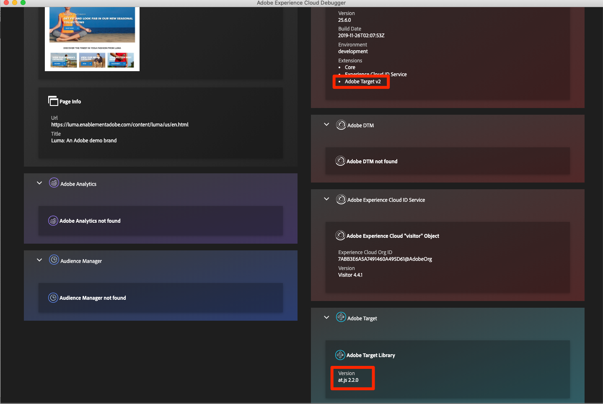
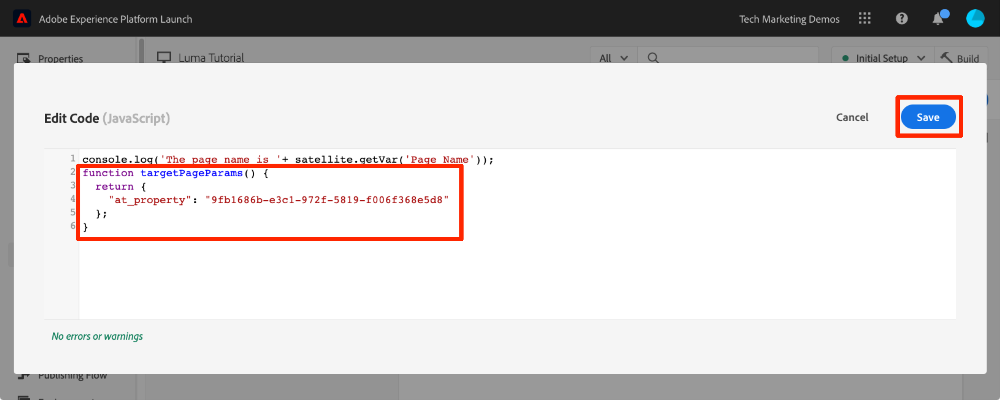

# Adobe Target toevoegen

In deze les zullen we de [Adobe Target-extensie](https://experienceleague.adobe.com/docs/experience-platform/tags/extensions/adobe/target/overview.html) met een paginalaadaanvraag en aangepaste parameters.

[Adobe Target](https://experienceleague.adobe.com/docs/target/using/target-home.html) is de Adobe Experience Cloud-oplossing die alles biedt wat u nodig hebt om de ervaring van uw klanten op maat te maken en aan te passen, zodat u uw omzet kunt maximaliseren op uw websites en mobiele sites, apps, sociale media en andere digitale kanalen.

>[!NOTE]
>
>Adobe Experience Platform Launch wordt in Adobe Experience Platform geïntegreerd als een reeks technologieën voor gegevensverzameling. Verschillende terminologiewijzigingen zijn geïmplementeerd in de interface die u tijdens het gebruik van deze inhoud moet onthouden:
>
> * Platform launch (clientzijde) is nu **[!DNL tags]**
> * Platform launch Server-zijde is nu **[!DNL event forwarding]**
> * Edge-configuraties zijn nu **[!DNL datastreams]**

## Leerdoelen

Aan het eind van deze les, zult u kunnen:

* Voeg het vooraf verborgen fragment toe dat wordt gebruikt voor het beheren van flikkering wanneer u Doel gebruikt met asynchrone tags insluiten-codes
* De extensie Doel v2 toevoegen
* Vuur de aanvraag voor het laden van de pagina aan (voorheen &quot;global mbox&quot; genoemd)
* Parameters toevoegen aan de aanvraag voor het laden van de pagina
* Beschrijf hoe profiel- en entiteitsparameters kunnen worden toegevoegd aan het verzoek om pagina te laden
* Geef de vereiste parameters op voor het bevestigen van de bestelling
* Uitleggen hoe u geavanceerde configuraties, zoals Bibliotheekkoptekst en Bibliotheekvoettekst, kunt toevoegen
* Een doelimplementatie valideren

## Vereisten

Als u de lessen in deze sectie wilt voltooien, moet u eerst de lessen in [Tags configureren](create-a-property.md) en [Identiteitsservice toevoegen](id-service.md).

## Het vooraf verborgen doelfragment toevoegen

Voordat we aan de slag kunnen, moeten we de code voor het insluiten van tags enigszins bijwerken. Wanneer de code-insluitcodes asynchroon worden geladen, is de rendering van de pagina mogelijk voltooid voordat de doelbibliotheek volledig is geladen en de inhoud ervan is omgewisseld. Dit kan leiden tot wat &quot;flikkering&quot;wordt genoemd waar de standaardinhoud kort toont alvorens door de gepersonaliseerde inhoud wordt vervangen die door Doel wordt gespecificeerd. Als u deze flikkering wilt vermijden, raden we u ten zeerste aan een speciaal vooraf verborgen fragment hard te coderen vlak voor de asynchrone insluitcodes van tags.

Dit is al gedaan op de plaats van de Luma, maar laten we verdergaan en dit op de steekproefpagina doen zodat begrijpt u de implementatie. Kopieer de volgende coderegels:

```html
<script>
   //prehiding snippet for Adobe Target with asynchronous tags deployment
   ;(function(win, doc, style, timeout) {
   var STYLE_ID = 'at-body-style';
   function getParent() {
      return doc.getElementsByTagName('head')[0];
   }
   function addStyle(parent, id, def) {
      if (!parent) {
      return;
      }
      var style = doc.createElement('style');
      style.id = id;
      style.innerHTML = def;
      parent.appendChild(style);
   }
   function removeStyle(parent, id) {
      if (!parent) {
      return;
      }
      var style = doc.getElementById(id);
      if (!style) {
      return;
      }
      parent.removeChild(style);
   }
   addStyle(getParent(), STYLE_ID, style);
   setTimeout(function() {
      removeStyle(getParent(), STYLE_ID);
   }, timeout);
   }(window, document, "body {opacity: 0 !important}", 3000));
</script>
```

Open de voorbeeldpagina en plak deze vlak voor de code die u met de tag insluit, zoals hieronder wordt weergegeven (maak je geen zorgen als de regelnummers verschillend zijn). In deze schermafbeelding is het voorverborgen fragment geminiatuurd:


Laad de voorbeeldpagina opnieuw. De pagina wordt drie seconden verborgen voordat deze wordt weergegeven. Dit gedrag is tijdelijk en zal verdwijnen nadat u Doel hebt opgesteld. Dit gedrag voor het voorverbergen wordt beheerd door twee configuraties helemaal aan het einde van het fragment, die kunnen worden aangepast maar meestal het beste links blijven bij de standaardinstellingen:

* `body {opacity: 0 !important}` geeft de css-definitie aan die moet worden gebruikt voor het vooraf verbergen totdat Doel wordt geladen. Standaard wordt het gehele lichaam verborgen. Als u een verenigbare DOM structuur met een gemakkelijk identificeerbaar containerelement hebt dat alle inhoud onder uw navigatie verpakt, bijvoorbeeld, en u nooit uw navigatie wilde testen of personaliseren, kon u dit plaatsen gebruiken om het pre-verbergen tot dat containerelement te beperken.
* `3000` Hiermee wordt de time-out-instelling voor het voorverbergen opgegeven. Als Doel niet in drie seconden is geladen, wordt de pagina standaard weergegeven. Dit zou zeer zeldzaam moeten zijn.

Ga voor meer informatie en voor het niet-geminiateerde voorverborgen fragment naar [de Adobe Target-extensie met een asynchrone &#x200B;](https://experienceleague.adobe.com/docs/experience-platform/tags/extensions/adobe/target/overview.html#adobe-target-extension-with-an-asynchronous-deployment).

## De doelextensie toevoegen

De Adobe Target-extensie ondersteunt client-side implementaties met de JavaScript SDK van Target voor het moderne web, at.js. Klanten die nog steeds gebruikmaken van de oudere bibliotheek van Target, mbox.js, [moet worden bijgewerkt naar at.js 2.x](https://experienceleague.adobe.com/docs/target/using/implement-target/client-side/mbox-implement/migrate-mbox/target-atjs-implementation.html) om tags te gebruiken.

De extensie Doel v2 bestaat uit twee hoofdonderdelen:

1. De extensieconfiguratie die de kernbibliotheekinstellingen beheert
1. Handelingen van de regel om het volgende te doen:
   1. Doel laden (at.js 2.x)
   1. Params toevoegen aan verzoeken om pagina te laden
   1. Params toevoegen aan alle aanvragen
   1. Aanvraag voor laden van brandbluspagina

In deze eerste oefening zullen wij de uitbreiding toevoegen en de configuraties bekijken. In latere oefeningen zullen wij de acties gebruiken.

**De extensie toevoegen**

1. Ga naar **[!UICONTROL Extensions > Catalog]**
1. Type `target` in het filter om snel de Adobe Target-extensies te zoeken. Er zijn twee extensies: Adobe Target en Adobe Target v2. In deze zelfstudie wordt de v2-versie van de extensie gebruikt die de nieuwste versie van at.js (momenteel 2.x) gebruikt. Deze versie is ideaal voor traditionele websites en toepassingen van één pagina (SPA).
1. Klikken **[!UICONTROL Installeren]**

   

1. Wanneer u de extensie toevoegt, worden veel, maar niet alle at.js-instellingen uit de doelinterface geïmporteerd, zoals hieronder wordt weergegeven. Eén instelling die niet wordt geïmporteerd, is de Time-out, die altijd 3000 ms zal duren nadat de extensie is toegevoegd. Laat de standaardinstellingen voor de zelfstudie ongewijzigd. Opmerking: aan de linkerkant ziet u de versie at.js die wordt meegeleverd bij de huidige versie van de extensie.

1. Klikken **[!UICONTROL Opslaan in bibliotheek]**

   

Op dit moment doet Target niets, dus is er niets te valideren.

>[!NOTE]
>
>Elke versie van de extensie Doel wordt geleverd met een specifieke versie van at.js. Deze versie wordt vermeld in de extensiebeschrijving. U werkt de versie at.js bij door de uitbreiding van het Doel bij te werken.

## Doel laden en verzoek pagina laden afvuren

Marketers gebruiken Doel om de bezoekerservaring op de pagina te bepalen wanneer ze inhoud testen en als doel instellen. Vanwege deze belangrijke rol in de weergave van de pagina, moet u Doel zo vroeg mogelijk laden om de invloed op de zichtbaarheid van de pagina te minimaliseren. In deze sectie wordt de JavaScript-doelbibliotheek geladen—at.js—en wordt de aanvraag voor het laden van de pagina uitgevoerd (in eerdere versies van at.js wordt deze &#39;&#39;globale box&#39;&#39; genoemd).

U kunt de `All Pages - Library Loaded` regel die u hebt gemaakt in de les &quot;[Gegevenselementen, regels en bibliotheken toevoegen](add-data-elements-rules.md)&quot; om Doel te implementeren, omdat dit al zo vroeg mogelijk wordt geactiveerd bij het laden van pagina&#39;s.

**Doel laden**

1. Ga naar de **[!UICONTROL Regels]** in de linkernavigatie en klik vervolgens op `All Pages - Library Loaded` om de regeleditor te openen

   

1. Klik onder Handelingen op de knop  om een nieuwe handeling toe te voegen

   

1. Selecteren **[!UICONTROL Extension > Adobe Target v2]**

1. Selecteren **[!UICONTROL Handelingstype > Doel laden]**

1. Klikken **[!UICONTROL Wijzigingen behouden]**

   

Met de `Load Target` toegevoegde actie, at.js zal op de pagina laden. Er worden echter geen doelverzoeken geactiveerd totdat we de `Fire Page Load Request` handeling.

**Aanvraag voor laden van pagina afvuren**

1. Klik onder Handelingen op de knop  opnieuw om een andere handeling toe te voegen

   

1. Selecteren **[!UICONTROL Extension > Adobe Target v2]**

1. Selecteren **[!UICONTROL Handelingstype > Aanvraag voor laden van brandbluspagina]**

1. Er zijn enkele configuraties beschikbaar voor de aanvraag voor het laden van de pagina die betrekking hebben op het al dan niet verbergen van de pagina en de CSS-kiezer voor het vooraf verbergen. Deze instellingen werken in combinatie met het vooraf verborgen fragment dat op de pagina is gecodeerd. Laat de standaardinstellingen staan.

1. Klikken **[!UICONTROL Wijzigingen behouden]**

   

1. De nieuwe handeling wordt na de handeling toegevoegd `Load Target` en de acties worden in deze volgorde uitgevoerd. U kunt de handelingen slepen en neerzetten om de volgorde te wijzigen, maar in dit scenario: `Load Target` moet vóór  `Fire Page Load Request`.

1. Klikken **[!UICONTROL Opslaan in bibliotheek en samenstellen]**

   

### De aanvraag voor het laden van de pagina valideren

Nu u de extensie Doel v2 hebt toegevoegd en de opdracht `Load Target` en `Fire Page Load Request` handelingen, moet er een aanvraag voor het laden van een pagina zijn die wordt uitgevoerd op alle pagina&#39;s waarop de eigenschap tag wordt gebruikt.

**De handelingen voor de aanvraag voor het laden van doel- en branddoelpagina valideren**

1. Laad de voorbeeldpagina opnieuw. Er wordt niet langer een vertraging van drie seconden weergegeven voordat de pagina zichtbaar is. Als u de voorbeeldpagina laadt met de opdracht `file://` moet u deze stap uitvoeren in Firefox- of Safari-browsers, aangezien Chrome geen aanvraag voor het doel uitvoert wanneer het de `file://` protocol.

1. Open de [Luminantiesite](https://luma.enablementadobe.com/content/luma/us/en.html)

1. Controleer of Foutopsporing de eigenschap tag toewijst aan *uw* Ontwikkelomgeving, zoals beschreven in de [eerdere les](switch-environments.md)

   

1. Ga naar het tabblad Overzicht van Foutopsporing

1. In de `Launch` bevestigen dat `Target` verschijnt onder de `Extensions` kop

1. In de `Target` , bevestig dat uw bibliotheekversie at.js wordt weergegeven

   

1. Tot slot ga naar `Target` vouwt u de clientcode uit en bevestigt u dat de aanvraag voor het laden van de pagina wordt weergegeven:

   

Gefeliciteerd! U hebt Target geïmplementeerd!

## Parameters toevoegen

Het overgaan van parameters in het verzoek van het Doel voegt krachtige mogelijkheden aan uw het richten, het testen, en verpersoonlijkingsactiviteiten toe. De tagextensie biedt twee acties om parameters door te geven:

1. `Add Params to Page Load Request`, die parameters toevoegt aan verzoeken om pagina&#39;s te laden (gelijk aan [targetPageParams()](https://experienceleague.adobe.com/docs/target/using/implement-target/client-side/functions-overview/cmp-atjs-functions.html) methode)

1. `Add Params to All Requests`, die parameters toevoegt in alle doelverzoeken, bijvoorbeeld de aanvraag voor het laden van de pagina plus aanvullende verzoeken die zijn gedaan via aangepaste codesacties of die op uw site zijn gecodeerd (equivalent aan de [targetPageParamsAll()](https://experienceleague.adobe.com/docs/target/using/implement-target/client-side/functions-overview/cmp-atjs-functions.html) methode)

Deze handelingen kunnen worden gebruikt *voor* de `Load Target` actie en kan verschillende parameters op verschillende pagina&#39;s plaatsen die op uw regelconfiguraties worden gebaseerd. Gebruik de regelbestelfunctie die u hebt gebruikt bij het instellen van de id&#39;s van de klant met de identiteitsservice om aanvullende parameters in te stellen voor de `Library Loaded` -gebeurtenis voordat de regel de aanvraag voor het laden van de pagina afvaagt.
>[!TIP]
>
>Aangezien de meeste implementaties de aanvraag voor het laden van de pagina gebruiken voor het leveren van activiteiten, volstaat het gewoonlijk om alleen de `Add Params to Page Load Requests` handeling.

### Parameters aanvragen (mbox)

De parameters worden gebruikt om douanegegevens tot Doel over te gaan, die uw verpersoonlijkingsmogelijkheden verrijken. Ze zijn ideaal voor kenmerken die tijdens een bladersessie vaak veranderen, zoals de paginanaam, sjabloon, enzovoort. en niet blijven bestaan.

Laten we de `Page Name` data element dat we eerder hebben gemaakt in de [Gegevenselementen, regels en bibliotheken toevoegen](add-data-elements-rules.md) les als verzoekparameter.

**De parameter request toevoegen**

1. Ga naar de **[!UICONTROL Regels]** in de linkernavigatie en klik vervolgens op `All Pages - Library Loaded` om de regeleditor te openen.

   

1. Klik onder Handelingen op de knop  om een nieuwe handeling toe te voegen

   

1. Selecteren **[!UICONTROL Extension > Adobe Target v2]**

1. Selecteren **[!UICONTROL Handelingstype > Params toevoegen aan verzoek om pagina te laden]**

1. Enter `pageName` als de **[!UICONTROL Naam]**

1. Klik op de knop  om het gegevenselement modaal te openen

1. Klik op de knop `Page Name` gegevenselement

1. Klik op de knop **[!UICONTROL Selecteren]** knop

   

1. Klikken **[!UICONTROL Wijzigingen behouden]**

   

1. Klik en sleep op de linkerrand van het gereedschap `Add Params to Page Load Request` actie om de acties opnieuw te rangschikken het vóór `Fire Page Load Request` handeling (kan voor of na `Load Target`)

1. Klikken **[!UICONTROL Opslaan in bibliotheek en samenstellen]**

   

#### Aanvraagparameters valideren

Voor het tijd-zijn, zijn de douaneparameters die met at.js 2.x- verzoeken worden overgegaan niet gemakkelijk zichtbaar in Debugger, zodat zullen wij de ontwikkelaarshulpmiddelen van browser gebruiken.

**De aanvraagparameter pageName valideren**

1. Laad de Luma-site opnieuw, zorg dat deze is toegewezen aan uw eigen tag-eigenschap
1. De ontwikkelaarsgereedschappen van uw browser openen
1. Klik op het tabblad Netwerk
1. De aanvragen filteren om `tt.omtrdc` (of uw domein van CNAME voor de verzoeken van het Doel)
1. Breid uit `Headers` > `Request Payload` > `execute.pageLoad.parameters` te valideren `pageName` parameter en waarde


<!--Now go to the **[!UICONTROL Target]** tab in the Debugger. Expand your client code and look at the requests. You should see the new `pageName` parameter passed in the request:

-->

### Profielparameters

Net als bij aanvraagparameters worden profielparameters ook doorgegeven via de aanvraag Doel. Profielparameters worden echter opgeslagen in de database van het bezoekersprofiel van het doel en blijven voor de [duur van het profiel van de bezoeker](https://experienceleague.adobe.com/docs/target/using/audiences/visitor-profiles/visitor-profile-lifetime.html). U kunt ze instellen op de ene pagina van uw site en ze gebruiken in doelactiviteiten op een andere pagina. Hier is een voorbeeld van een automobielwebsite. Wanneer een bezoeker naar een pagina met voertuigen gaat, kunt u een profielparameter &quot;profile.lastViewed=sportscar&quot; doorgeven om de interesse van de bezoeker in dat voertuig te registreren. Wanneer de bezoeker naar andere, niet-voertuigpagina&#39;s bladert, kunt u inhoud als doel instellen op basis van het laatst bekeken voertuig.  Profielparameters zijn ideaal voor kenmerken die zelden worden gewijzigd of die alleen beschikbaar zijn op bepaalde pagina&#39;s

In deze zelfstudie zult u geen profielparameters doorgeven, maar de workflow is bijna gelijk aan wat u zojuist hebt gedaan toen u de `pageName` parameter. Het enige verschil is dat u parameternamen voor profielen als `profile.` voorvoegsel Zo ziet een profielparameter met de naam &quot;userType&quot; eruit in het dialoogvenster `Add Params to Page Load Request` handeling:


### Entiteitsparameters

Parameters voor entiteiten zijn speciale parameters die worden gebruikt in [Recommendations-implementaties](https://experienceleague.adobe.com/docs/target/using/recommendations/plan-implement.html) om drie belangrijke redenen :

1. Als sleutel om productaanbevelingen teweeg te brengen. Als u bijvoorbeeld een aanbevolen algoritme gebruikt, zoals &quot;Mensen die Product X bekeken, ook Y bekeken,&quot;, is &quot;X&quot; de &quot;sleutel&quot; van de aanbeveling. Meestal is het de producthuid (`entity.id`) of categorie (`entity.categoryId`) die de bezoeker momenteel bekijkt.
1. Om het gedrag van de bezoeker aan machtsaanbevelingen algoritmen, zoals &quot;Onlangs Bekeken Producten&quot;of &quot;Meest Bekeken Producten te verzamelen
1. De Recommendations-catalogus vullen. Recommendations bevat een database van alle producten of artikelen op uw website, zodat deze in de aanbevolen aanbieding kunnen worden gebruikt. Wanneer u bijvoorbeeld producten aanbeveelt, wilt u doorgaans kenmerken weergeven zoals de productnaam (`entity.name`) en afbeelding (`entity.thumbnailUrl`). Sommige klanten vullen hun catalogus in met back-endfeeds, maar ze kunnen ook worden gevuld met eenheidsparameters in Target-aanvragen.

U hoeft geen entiteitsparameters in deze zelfstudie door te geven, maar de workflow is identiek aan wat u eerder hebt gedaan toen u de `pageName` request parameter—Geef de parameter een naam die vooraf is ingesteld op &#39;entiteit&#39;. en deze aan het relevante gegevenselement toewijzen. Merk op dat sommige gemeenschappelijke entiteiten gereserveerde namen hebben die moeten worden gebruikt (bijvoorbeeld entiteit.id voor de productsku). Dit is hoe het er uitziet als u entiteitsparameters instelt in de `Add Params to Page Load Request` handeling:


### Parameters van klant-id toevoegen

De inzameling van klantenidentiteitskaart met de Dienst van de Identiteit van Adobe Experience Platform maakt het gemakkelijk om CRM- gegevens in Doel in te voeren gebruikend [Klantkenmerken](https://experienceleague.adobe.com/docs/target/using/audiences/visitor-profiles/working-with-customer-attributes.html) van de Adobe Experience Cloud. Het maakt ook [stitching voor bezoekers van meerdere apparaten](https://experienceleague.adobe.com/docs/target/using/integrate/experience-cloud-device-co-op.html), zodat u een consistente gebruikerservaring kunt behouden wanneer uw klanten schakelen tussen hun laptops en hun mobiele apparaten.

Het is absoluut noodzakelijk om de klant-id in te stellen in de identiteitsservice `Set Customer IDs` handeling voordat de aanvraag voor het laden van de pagina wordt geactiveerd. Zorg er daarom voor dat u de volgende mogelijkheden op uw site hebt:

* De klant-id moet beschikbaar zijn op de pagina voordat de tags Code insluiten
* De extensie Adobe Experience Platform Identity Service moet zijn geïnstalleerd
* U moet de opdracht `Set Customer IDs` handeling in een regel die wordt geactiveerd bij de gebeurtenis &quot;Bibliotheek geladen (Pagina boven)&quot;
* Gebruik de `Fire Page Load Request` actie in een regel die brandt *na* de actie &quot;Customer ID&#39;s instellen&quot;

In de vorige les [De Adobe Experience Platform Identity Service toevoegen](id-service.md), hebt u de `All Pages - Library Loaded - Authenticated - 10` regel om de actie &quot;Customer ID instellen&quot; uit te voeren. Omdat deze regel een  `Order` instellen van `10`, de id&#39;s van de klant worden ingesteld voordat onze aanvraag voor het laden van de pagina wordt geactiveerd door de `All Pages - Library Loaded` met het `Order` instellen van `50`. U hebt dus al de collectie van klantid&#39;s voor Target geïmplementeerd!

#### De klant-id valideren

Voor het tijd-zijn, zijn de douaneparameters die met at.js 2.x- verzoeken worden overgegaan niet gemakkelijk zichtbaar in Debugger, zodat zullen wij de ontwikkelaarshulpmiddelen van browser gebruiken.

**De klant-id valideren**

1. Open de [Luminantiesite](https://luma.enablementadobe.com/content/luma/us/en.html)

1. Controleer of Foutopsporing de eigenschap tag toewijst aan *uw* Ontwikkelomgeving, zoals beschreven in de [eerdere les](switch-environments.md)

   

1. Log in op de Luministensite met de referenties `test@adobe.com`/`test`
1. Terugkeren naar de [Luminantiepage](https://luma.enablementadobe.com/content/luma/us/en.html)

1. De ontwikkelaarsgereedschappen van uw browser openen
1. Klik op het tabblad Netwerk
1. De aanvragen filteren om `tt.omtrdc` (of uw domein van CNAME voor de verzoeken van het Doel)
1. Breid uit `Headers` > `Request Payload` > `id.customerIds.0` sectie voor validatie van de instellingen en waarde van de id van de klant:


<!--
1. Open the Debugger
1. Go to the Target tab
1. Expand your client code
1. You should see parameters in the latest Target request for `vst.crm_id.id` and `vst.crm_id.authState`. `vst.crm_id.id` should have a value of the hashed email address and `vst.crm_id.authState` should have a value of `1` to represent `authenticated`. Note that `crm_id` is the `Integration Code` you specified in the Identity Service configuration and must align with the key you use in your [Customer Attributes data file](https://experienceleague.adobe.com/docs/core-services/interface/customer-attributes/t-crs-usecase.html):


-->

>[!WARNING]
>
>Met de Adobe Experience Platform Identity Service kunt u meerdere id&#39;s naar de Service verzenden. Alleen de eerste id wordt echter naar Target verzonden.

### De parameter voor het token van eigenschappen toevoegen

>[!NOTE]
>
>Dit is een optionele exercitie voor Target Premium-klanten.

Het bezitstoken is een gereserveerde parameter die met de Premie van het Doel wordt gebruikt [Machtigingen voor zakelijke gebruikers](https://experienceleague.adobe.com/docs/target/using/administer/manage-users/enterprise/property-channel.html) gebruiken. Het wordt gebruikt om verschillende digitale eigenschappen te bepalen zodat de verschillende leden van een Organisatie van het Experience Cloud verschillende toestemmingen op elk bezit kunnen worden toegewezen. U wilt bijvoorbeeld dat één groep gebruikers doelactiviteiten kan instellen op uw website, maar niet in uw mobiele toepassing.

De eigenschappen van het doel zijn analoog aan etiketeigenschappen en de rapportreeksen van Analytics. Een onderneming met meerdere merken, websites en marketingteams kan voor elke website of mobiele app een andere doeleigenschap, tag-eigenschap en analytische rapportsuite gebruiken. De eigenschappen van markeringen worden onderscheiden door hun insluitcodes, de rapportreeksen van Analytics worden onderscheiden door hun identiteitskaart van de rapportreeks, en de eigenschappen van het Doel worden verschillend door hun bezit symbolische parameter.


Het eigenschapstoken moet worden geïmplementeerd met behulp van een aangepaste code in tags met de opdracht `targetPageParams()` functie. Als u veelvoudige plaatsen met verschillend gebruikend verschillende at_property waarden met één enkel markeringsbezit uitvoert, kon u de at_property waarde via een gegevenselement beheren.

Hier volgt een optionele oefening als u een klant van de Premium van het Doel bent en een bezitstoken in uw bezit van de Zelfstudie zou willen uitvoeren:

1. Open de gebruikersinterface Doel op een apart tabblad

1. Ga naar **[!UICONTROL Beheer > Eigenschappen]**

1. Identificeer het Bezit dat u wilt gebruiken en klik het **[!UICONTROL &lt;/>]** (of maak een nieuwe eigenschap)

1. Kopieer het codefragment in het dialoogvenster `<script></script>` naar uw klembord

   

1. Ga op het tabblad Codes naar de **[!UICONTROL Regels]** in de linkernavigatie en klik vervolgens op `All Pages - Library Loaded` om de regeleditor te openen.

   

1. Klik onder Handelingen op de knop `Core - Custom Code` actie om de `Action Configuration`

   

1. Open de code-editor en plak de code in de interface Doel met de `targetPageParams()` function
1. Klik op de knop **[!UICONTROL Opslaan]** knop

   

1. Controleer de **[!UICONTROL Wereldwijd uitvoeren]** vak so `targetPageParams()` wordt gedeclareerd in het algemene bereik
1. Klikken **[!UICONTROL Wijzigingen behouden]**

   

1. Klikken **[!UICONTROL Opslaan in bibliotheek en samenstellen]**
   

>[!WARNING]
>
>Als u de opdracht `at_property` parameter via de **[!UICONTROL Params toevoegen aan verzoek om pagina te laden]** actie, zal de parameter in het netwerkverzoek bevolken maar de Visuele Composer van de Ervaring van het Doel (VEC) zal niet het kunnen auto-ontdekken wanneer het laden van de pagina. Altijd vullen `at_property` met de `targetPageParams()` in een handeling Aangepaste code.

#### Eigenschaptoken valideren

Voor het tijd-zijn, zijn de douaneparameters die met at.js 2.x- verzoeken worden overgegaan niet gemakkelijk zichtbaar in Debugger, zodat zullen wij de ontwikkelaarshulpmiddelen van browser gebruiken.

**De parameter Eigenschaptoken valideren**

1. Open de [Luminantiesite](https://luma.enablementadobe.com/content/luma/us/en.html)
1. Controleer of Foutopsporing de eigenschap tag toewijst aan *uw* Ontwikkelomgeving, zoals beschreven in de [eerdere les](switch-environments.md)

   

1. De ontwikkelaarsgereedschappen van uw browser openen
1. Klik op het tabblad Netwerk
1. De aanvragen filteren om `tt.omtrdc` (of uw domein van CNAME voor de verzoeken van het Doel)
1. Breid uit `Headers` > `Request Payload` > `property.token` sectie om de waarde te valideren
   

<!--
1. Go to the `Target` tab
1. Expand your client code
1. You should see the parameter for "at_property" in every page load request request as you browse the site:

-->

## Aangepaste verzoeken toevoegen

### Een aanvraag voor een orderbevestiging toevoegen

Het verzoek om bevestiging van de bestelling is een speciaal type verzoek dat wordt gebruikt om ordergegevens naar Target te verzenden. De opneming van drie specifieke verzoekparameters-orderId, orderTotal, en productPurchasedId-is wat een regelmatig verzoek van het Doel in een ordeverzoek omzet. Naast de opbrengsten van de rapportage, doet het verzoek om opdracht ook het volgende:

1. De-dupliceert toevallige orde opnieuw indient
1. Filtert extreme orders (elke volgorde waarvan het totaal meer dan drie standaardafwijkingen van het gemiddelde was)
1. Gebruikt een ander algoritme achter de schermen om het statistische vertrouwen te berekenen
1. Hiermee maakt u een speciaal, downloadbaar auditrapport van afzonderlijke bestelgegevens

De beste praktijk is om een verzoek tot bevestiging van de bestelling in alle orderkanalen, zelfs op niet-detailhandelslocaties, te gebruiken. De plaatsen van de loodgeneratie hebben bijvoorbeeld gewoonlijk loodtrechters met een unieke &quot;loodidentiteitskaart&quot;die aan het eind wordt geproduceerd. Deze plaatsen zouden een ordeverzoek moeten uitvoeren, gebruikend een statische waarde (b.v. &quot;1&quot;) voor orderTotal.

Klanten die de integratie Analytics for Target (A4T) voor het grootste deel van hun rapportage gebruiken, willen mogelijk ook het orderverzoek implementeren als ze Automated Personalization-activiteiten gebruiken, die geen A4T ondersteunen. Bovendien is het orderverzoek een essentieel element in Recommendations-implementaties, waarbij algoritmen op basis van aankoopgedrag worden ingeschakeld. Voor de meest recente informatie over A4T-ondersteuning raadpleegt u [de documentatie](https://experienceleague.adobe.com/docs/target/using/integrate/a4t/a4t.html?lang=en#section_F487896214BF4803AF78C552EF1669AA).

Het verzoek om bevestiging van de bestelling moet worden uitgevoerd vanuit een regel die alleen wordt geactiveerd op de pagina of gebeurtenis waarin uw bestelling wordt bevestigd. Vaak kan dit worden gecombineerd met een regel die de Adobe Analytics-aankoopgebeurtenis instelt. Het moet worden gevormd gebruikend de actie van de Code van de Douane van de uitbreiding van de Kern, gebruikend de aangewezen gegevenselementen om ordeId, orderTotal, en productPurchasedId parameters te plaatsen.

Voeg de gegevenselementen en regel toe die we nodig hebben om een aanvraag voor bevestiging van de bestelling in te dienen op de Luma-site. Aangezien u reeds verscheidene gegevenselementen hebt gecreeerd, zullen deze instructies worden afgekort.

**Het gegevenselement voor Order-id maken**

1. Klikken **[!UICONTROL Gegevenselementen]** in de linkernavigatie
1. Klikken **[!UICONTROL Gegevenselement toevoegen]**
1. Geef het gegevenselement een naam `Order Id`
1. Selecteren **[!UICONTROL Gegevenselement Type > JavaScript-variabele]**
1. Gebruiken `digitalData.cart.orderId` als de `JavaScript variable name`
1. Schakel de optie `Clean text` in
1. Klikken **[!UICONTROL Opslaan in bibliotheek]**
(We bouwen de bibliotheek pas als we alle wijzigingen voor het verzoek om bevestiging van de bestelling hebben aangebracht)

**Het gegevenselement voor de starthoeveelheid maken**

1. Klikken **[!UICONTROL Gegevenselement toevoegen]**
1. Geef het gegevenselement een naam `Cart Amount`
1. Selecteren **[!UICONTROL Gegevenselement Type > JavaScript-variabele]**
1. Gebruiken `digitalData.cart.cartAmount` als de `JavaScript variable name`
1. Schakel de optie `Clean text` in
1. Klikken **[!UICONTROL Opslaan in bibliotheek]**

**Om het gegevenselement voor Kart SKUs (Doel) te creëren**

1. Klikken **[!UICONTROL Gegevenselement toevoegen]**
1. Geef het gegevenselement een naam `Cart SKUs (Target)`
1. Selecteren **[!UICONTROL Type gegevenselement > Aangepaste code]**
1. Voor Doel moet de skus een door komma&#39;s gescheiden lijst zijn. Met deze aangepaste code wordt de indeling van de array met gegevenslagen gewijzigd in de juiste indeling. Plak het volgende in de aangepaste code-editor:

   ```javascript
   var targetProdSkus="";
   for (var i=0; i<digitalData.cart.cartEntries.length; i++) {
     if(i>0) {
       targetProdSkus = targetProdSkus + ",";
     }
     targetProdSkus = targetProdSkus + digitalData.cart.cartEntries[i].sku;
   }
   return targetProdSkus;
   ```

1. Schakel de optie `Force lowercase value` in
1. Schakel de optie `Clean text` in
1. Klikken **[!UICONTROL Opslaan in bibliotheek]**

Nu moeten wij een regel tot stand brengen om het verzoek van de ordesbevestiging met deze gegevenselementen als parameters op de pagina van de ordesbevestiging in brand te steken.

**De pagina Regel voor bevestiging van bestelling maken**

1. Klikken **[!UICONTROL Regels]** in de linkernavigatie
1. Klikken **[!UICONTROL Regel toevoegen]**
1. Naam van de regel `Order Confirmation Page - Library Loaded - 60`
1. Klikken **[!UICONTROL Gebeurtenissen > Toevoegen]**
   1. Selecteren **[!UICONTROL Gebeurtenistype > Geladen bibliotheek (pagina boven)]**
   1. Onder **[!UICONTROL Geavanceerde opties]** wijzigt u de `Order` tot `60` zodat het na de `Load Target` actie (die in ons `All Pages - Library Loaded` bepalen waar `Order` is ingesteld op `50`)
   1. Klikken **[!UICONTROL Wijzigingen behouden]**
1. Klikken **[!UICONTROL Voorwaarden > Toevoegen]**
   1. Selecteren **[!UICONTROL Condition Type > Path Without Query String]**
   1. Voor `Path equals` enter `thank-you.html`
   1. Schakel de optie Regex in of uit om de logica te wijzigen van `equals` tot `contains` (u kunt de `Test` om te bevestigen dat de test met de URL wordt uitgevoerd `https://luma.enablementadobe.com/content/luma/us/en/user/checkout/order/thank-you.html`

      

   1. Klikken **[!UICONTROL Wijzigingen behouden]**
1. Klikken **[!UICONTROL Handelingen > Toevoegen]**
   1. Selecteren **[!UICONTROL Handelingstype > Aangepaste code]**
   1. Klikken **[!UICONTROL Editor openen]**
   1. Plak de volgende code in de `Edit Code` modaal

      ```javascript
      adobe.target.getOffer({
        "mbox": "orderConfirmPage",
        "params":{
           "orderId": _satellite.getVar('Order Id'),
           "orderTotal": _satellite.getVar('Cart Amount'),
          "productPurchasedId": _satellite.getVar('Cart SKUs (Target)')
        },
        "success": function(offer) {
          adobe.target.applyOffer({
            "mbox": "orderConfirmPage",
            "offer": offer
          });
        },
        "error": function(status, error) {
          console.log('Error', status, error);
        }
      });
      ```

   1. Klikken **[!UICONTROL Opslaan]** de aangepaste code opslaan
   1. Klikken **[!UICONTROL Wijzigingen behouden]** om de handeling te behouden
1. Klikken **[!UICONTROL Opslaan in bibliotheek en samenstellen]**

#### Valideer het verzoek om bevestiging van bestelling

Voor het tijd-zijn, zijn de douaneparameters die met at.js 2.x- verzoeken worden overgegaan niet gemakkelijk zichtbaar in Debugger, zodat zullen wij de ontwikkelaarshulpmiddelen van browser gebruiken.

1. Open de [Luminantiesite](https://luma.enablementadobe.com/content/luma/us/en.html)

1. Controleer of Foutopsporing de eigenschap tag toewijst aan *uw* Ontwikkelomgeving, zoals beschreven in de [eerdere les](switch-environments.md)

   

1. Blader door de site en voeg meerdere producten toe aan uw winkelwagentje
1. Doorgaan met uitchecken
1. Tijdens het uitchecken zijn de enige vereiste velden `First Name` en `Last Name`

   

1. Klik op de pagina Revisievolgorde op de knop `Place Order` knop
1. De ontwikkelaarsgereedschappen van uw browser openen
1. Klik op het tabblad Netwerk
1. De aanvragen filteren om `tt.omtrdc` (of uw domein van CNAME voor de verzoeken van het Doel)
1. Klik op de tweede aanvraag
1. Breid uit `Headers` > `Request Payload` > `execute.mboxes.0` sectie voor validatie van de aanvraagnaam en de orderparameters:


<!--
1. Look in the Debugger
1. Go to the Target tab
1. Expand your client code
1. You should see the `orderConfirmPage` request as the latest Target request with the orderId, orderTotal, and productPurchasedId parameters populated with the details of your order

   link to "orderConfirmPage request with required parameters": images/target-debugger-orderConfirmPage.png 
-->

### Aangepaste aanvragen

Er zijn zeldzame gevallen waarin u een ander doelverzoek moet indienen dan het verzoek om pagina te laden en de bestelling te bevestigen. Soms worden bijvoorbeeld belangrijke gegevens die u voor personalisatie wilt gebruiken, niet op de pagina gedefinieerd vóór de insluitcodes van de tag. Deze kunnen onderaan op de pagina worden gecodeerd of worden geretourneerd door een asynchrone API-aanvraag. Deze gegevens kunnen naar Target worden verzonden met behulp van een extra aanvraag, maar het is niet optimaal om deze aanvraag voor de levering van inhoud te gebruiken omdat de pagina al zichtbaar is. Deze gegevens kunnen worden gebruikt om het bezoekersprofiel te verrijken voor later gebruik (met behulp van profielparameters) of om de Recommendations-catalogus te vullen.

In deze omstandigheden kunt u de handeling Aangepaste code in de Core-extensie gebruiken om een aanvraag uit te voeren met de opdracht [getOffer()](https://experienceleague.adobe.com/docs/target-dev/developer/client-side/at-js-implementation/functions-overview/adobe-target-getoffer.html)/[applyOffer()](https://experienceleague.adobe.com/docs/target-dev/developer/client-side/at-js-implementation/functions-overview/adobe-target-applyoffer.html) en [trackEvent()](https://experienceleague.adobe.com/docs/target-dev/developer/client-side/at-js-implementation/functions-overview/adobe-target-trackevent.html) methoden. Dit lijkt sterk op wat u zojuist deed in de [Bevestigingsaanvraag voor bestelling](#order-confirmation-request) oefening, maar u zult enkel een verschillende verzoeknaam gebruiken en zult niet de speciale orde parameters gebruiken. Gebruik de **[!UICONTROL Doel laden]** handeling voordat u doelverzoeken vanuit aangepaste code maakt.

## Bibliotheekkoptekst en Bibliotheekvoettekst

Het scherm Edit at.js in de gebruikersinterface van het Doel heeft plaatsen waarin u douane JavaScript kunt kleven die onmiddellijk voor of na het at.js- dossier zal uitvoeren. De bibliotheekkoptekst wordt soms gebruikt om de instellingen van at.js te overschrijven via het dialoogvenster
[targetGlobalSettings()](https://experienceleague.adobe.com/docs/target/using/implement-target/client-side/functions-overview/targetgobalsettings.html) gegevens van derden die [Gegevensleveranciers](https://experienceleague.adobe.com/docs/target-learn/tutorials/integrations/use-data-providers-to-integrate-third-party-data.html) gebruiken. De bibliotheekvoettekst wordt soms gebruikt om toe te voegen [at.js, aangepaste gebeurtenis](https://experienceleague.adobe.com/docs/target-dev/developer/client-side/at-js-implementation/functions-overview/atjs-custom-events.html) listeners.

Als u deze mogelijkheid in tags wilt repliceren, gebruikt u gewoon de handeling Aangepaste code in de Core-extensie en voert u de handeling voor (bibliotheekkoptekst) of na (Bibliotheekvoettekst) de handeling Doel laden uit. Dit kan in de zelfde regel worden gedaan zoals `Load Target` handeling (zoals hieronder afgebeeld) of in afzonderlijke regels met gebeurtenissen of orderinstellingen die op betrouwbare wijze worden geactiveerd voor of na de regel die `Load Target`:


Zie de volgende bronnen voor meer informatie over de gebruiksgevallen voor aangepaste kop- en voetteksten:

* [DataProviders gebruiken om gegevens van derden te integreren in Adobe Target](https://experienceleague.adobe.com/docs/target-learn/tutorials/integrations/use-data-providers-to-integrate-third-party-data.html)
* [DataProviders implementeren om gegevens van derden te integreren in Adobe Target](https://experienceleague.adobe.com/docs/target-learn/tutorials/integrations/implement-data-providers-to-integrate-third-party-data.html)
* [De Tokens van de Reactie van het gebruik en bij.js de Gebeurtenissen van de Douane met Adobe Target](https://experienceleague.adobe.com/docs/target-learn/tutorials/integrations/use-response-tokens-and-atjs-custom-events.html)

[Volgende &quot;Adobe Analytics toevoegen&quot; >](analytics.md)
